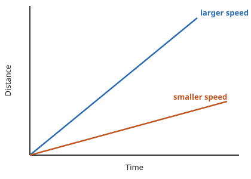
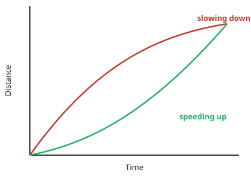
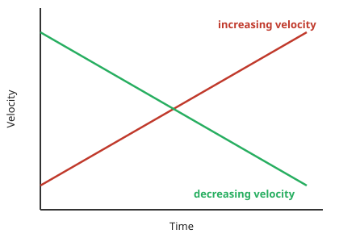

# Motion graphs

## Distance-time graphs

A distance-time graph shows how the **distance** of an object moving in a straight line (from a starting position) varies over time.

Distance-time graphs show whether the object is moving at a **constant speed**, and how **large** or **small** that speed is: a **straight line** represents **constant speed**, and the slope of the straight line represents the **magnitude** of the speed — a very **steep** slope means the object is moving at a **large** speed, a **shallow** slope means the object is moving at a **small** speed, and a **flat, horizontal line** means the object is **stationary** (not moving).

*Both of these objects are moving with a constant speed, because the lines are straight — the steeper (blue) line represents a larger speed*

!!! tip "Examiner Tips and Tricks"

    The Edexcel IGCSE Physics specification states that you need to be able to explain distance-time graphs and to be able to plot them.

    Plotting graphs is an important skill in physics and usually comes up in at least one exam paper. If you are not confident in plotting graphs, you should definitely practice before your exam!

### Changing speed on a distance-time graph

Objects might be moving at a **changing speed** — this is represented by a **curve**, where the slope of the line will be changing: if the slope is **increasing**, the **speed** is **increasing** (accelerating); if the slope is **decreasing**, the **speed** is **decreasing** (decelerating).

*Changing speeds are represented by changing slopes. The red line represents an object slowing down and the green line represents an object speeding up.*

### Calculating speed from a distance-time graph

!!! note "Required formulae: speed from a distance-time graph"
    The **speed** of a moving object can be calculated from the **gradient** of the line on a **distance-time** graph:

    $$ \text{speed} = \text{gradient} = \frac{\Delta y}{\Delta x} $$

    

    *The speed of an object can be found by calculating the gradient of a distance-time graph*

    $\Delta y$ is the **change** in y (distance) values, and $\Delta x$ is the **change** in x (time) values.

!!! example "Worked Example (calculation)"

    A distance-time graph is drawn below for part of a train journey. The train is travelling at a constant speed.

    <table>
    <thead>
        <tr>
            <th>TIME (MINUTES)</th>
            <th>DISTANCE (km)</th>
        </tr>
    </thead>
    <tbody>
        <tr>
            <td>0</td>
            <td>0</td>
        </tr>
        <tr>
            <td>1</td>
            <td>1.33</td>
        </tr>
        <tr>
            <td>2</td>
            <td>2.67</td>
        </tr>
        <tr>
            <td>3</td>
            <td>4</td>
        </tr>
        <tr>
            <td>4</td>
            <td>5.33</td>
        </tr>
        <tr>
            <td>5</td>
            <td>6.67</td>
        </tr>
        <tr>
            <td>6</td>
            <td>8</td>
        </tr>
    </tbody>
    </table>

    Calculate the speed of the train.

    ??? success "Answer:"

        **Step 1: Identify the relevant quantities by drawing a large gradient triangle on the graph**

        Since the line is straight over the whole journey shown, use the full range of the data: $\Delta x = 6$ mins, $\Delta y = 8$ km.

        **Step 2: State that speed is equal to the gradient of a distance-time graph**

        The **gradient** of a **distance-time** graph is equal to the **speed** of a moving object:

        $$\text{speed} = \text{gradient} = \frac{\Delta y}{\Delta x}$$

        **Step 3: Substitute the values, converting units where necessary**

        The distance and time are not in standard units, so convert them first: distance travelled = 8 km = **8000 m**; time taken = 6 mins = **360 s**.

        $$\text{speed} = \frac{8000}{360}$$

        **Step 4: Evaluate**

        $$\text{speed} = 22.2 \text{ m/s}$$

        The speed is given to 3 significant figures, matching the precision of the graph data.

!!! example "Worked Example (explanation): a walk to the park"

    A student decides to take a stroll to the park. They find a bench in a quiet spot and take a seat, picking up where they left off reading a book on black holes. After some time reading, the student realises they lost track of time and runs home.

    A distance-time graph for the student's trip is drawn below:

    <table>
    <thead>
        <tr>
            <th>TIME (MINUTES)</th>
            <th>DISTANCE (km)</th>
        </tr>
    </thead>
    <tbody>
        <tr>
            <td>0</td>
            <td>0</td>
        </tr>
        <tr>
            <td>10</td>
            <td>0.12</td>
        </tr>
        <tr>
            <td>20</td>
            <td>0.24</td>
        </tr>
        <tr>
            <td>25</td>
            <td>0.3</td>
        </tr>
        <tr>
            <td>30</td>
            <td>0.3</td>
        </tr>
        <tr>
            <td>40</td>
            <td>0.3</td>
        </tr>
        <tr>
            <td>50</td>
            <td>0.3</td>
        </tr>
        <tr>
            <td>60</td>
            <td>0.3</td>
        </tr>
        <tr>
            <td>65</td>
            <td>0.3</td>
        </tr>
        <tr>
            <td>70</td>
            <td>0.45</td>
        </tr>
        <tr>
            <td>75</td>
            <td>0.6</td>
        </tr>
    </tbody>
    </table>

    (a) How long does the student spend reading the book?

    (b) Which section of the graph represents the student running home?

    (c) What is the total distance travelled by the student?

    ??? success "Answer (Part a):"

        The student spends **40 minutes** reading the book. The **flat** section of the line (from 25 to 65 minutes, section B) represents an object which is **stationary** — so section B represents the student sitting on the bench reading, and this section lasts for **40 minutes**.

    ??? success "Answer (Part b):"

        **Section C** (70 to 75 minutes) represents the student running home. The **slope** of the line in section C is **steeper** than the slope in section A, meaning the student was moving with a **larger** speed (running) in section C.

    ??? success "Answer (Part c):"

        The total distance travelled by the student is **0.6 km** — the total distance travelled by an object is given by the final point on the line, and in this case, the line ends at **0.6 km** on the **distance** axis.

!!! tip "Examiner Tips and Tricks"
    Use the **entire line**, where possible, to calculate the gradient. Examiners tend to award credit if they see a **large gradient triangle** used — so remember to draw these directly on the graph itself!

    Remember to check the **units** of variables measured on each axis. These may not always be in standard units - in our example, the unit of distance was **km** and the unit of time was **minutes**. Double-check which units to use in your answer.

## Velocity-time graphs

A velocity-time graph shows how the **velocity** of a moving object varies with **time** — velocity is plotted against time on the graph.

*Increasing and decreasing velocity represented on a velocity-time graph*

### Acceleration on a velocity-time graph

Velocity-time graphs show whether the object is moving with a **constant acceleration**, and the **magnitude** of that acceleration: a **straight line** represents **constant acceleration** (or deceleration), and the **slope** of the line represents the **magnitude** of acceleration — a **steep** slope means **large acceleration** (the object's speed changes very **quickly**), and a **gentle** slope means **small acceleration** (the object's speed changes very **gradually**).

A **positive gradient** shows **increasing velocity** — the object is **accelerating**. A **negative gradient** shows **decreasing velocity** — the object is **decelerating**. A **flat line** means the acceleration is **zero** — the object is moving with a **constant velocity**.

*Upward and downward sloping straight lines show periods of acceleration and deceleration; a flat horizontal line shows a period of constant velocity*

### How to find acceleration on a velocity-time graph

!!! note "Required formulae: acceleration from a velocity-time graph"
    The **acceleration** of an object can be calculated from the **gradient** of a velocity-time graph:

    $$ \text{acceleration} = \text{gradient} = \frac{\Delta y}{\Delta x} $$

    

    *How to find the gradient of a velocity-time graph*

    $\Delta y$ is the change in $y$ (velocity) values, and $\Delta x$ is the change in $x$ (time) values.

!!! example "Worked Example (calculation)"

    A cyclist is training for a cycling tournament.

    The velocity-time graph below shows the cyclist's motion as they cycle along a flat, straight road.

    <table>
    <tbody>
        <tr>
            <td>TIME (s)</td>
            <td>VELOCITY (m/s)</td>
        </tr>
        <tr>
            <td>0</td>
            <td>0</td>
        </tr>
        <tr>
            <td>1</td>
            <td>0</td>
        </tr>
        <tr>
            <td>2</td>
            <td>0</td>
        </tr>
        <tr>
            <td>3</td>
            <td>0</td>
        </tr>
        <tr>
            <td>4</td>
            <td>0</td>
        </tr>
        <tr>
            <td>5</td>
            <td>0</td>
        </tr>
        <tr>
            <td>6</td>
            <td>1</td>
        </tr>
        <tr>
            <td>7</td>
            <td>2</td>
        </tr>
        <tr>
            <td>8</td>
            <td>3</td>
        </tr>
        <tr>
            <td>9</td>
            <td>4</td>
        </tr>
        <tr>
            <td>10</td>
            <td>5</td>
        </tr>
        <tr>
            <td>11</td>
            <td>5</td>
        </tr>
        <tr>
            <td>12</td>
            <td>5</td>
        </tr>
        <tr>
            <td>13</td>
            <td>5</td>
        </tr>
        <tr>
            <td>14</td>
            <td>8</td>
        </tr>
        <tr>
            <td>15</td>
            <td>10</td>
        </tr>
        <tr>
            <td>16</td>
            <td>10</td>
        </tr>
        <tr>
            <td>17</td>
            <td>10</td>
        </tr>
        <tr>
            <td>18</td>
            <td>10</td>
        </tr>
        <tr>
            <td>19</td>
            <td>10</td>
        </tr>
        <tr>
            <td>20</td>
            <td>10</td>
        </tr>
    </tbody>
    </table>

    (a) In which section (A, B, C, D, or E) of the velocity-time graph is the cyclist's acceleration the largest?

    (b) Calculate the cyclist's acceleration between 5 and 10 seconds.

    ??? success "Answer (Part a):"

        The slope of a velocity-time graph indicates the magnitude of acceleration, so the only sections of the graph where the cyclist is accelerating are sections B (6–10 s) and D (14–15 s) — sections A, C, and E are flat, meaning the cyclist is moving at a constant velocity (therefore, not accelerating). Section D has the steepest slope, so the largest acceleration is shown in **section D**.

    ??? success "Answer (Part b):"

        **Step 1: Identify the relevant quantities by reading off the velocity at the start and end of the given time period**

        At $t = 5$ s, velocity $= 0$ m/s. At $t = 10$ s, velocity $= 5$ m/s.

        **Step 2: State that the gradient of a velocity-time graph gives the acceleration**

        $$ a = \text{gradient} = \frac{\Delta y}{\Delta x} $$

        **Step 3: Substitute the known values**

        $$ a = \frac{5 - 0}{10 - 5} $$

        **Step 4: Evaluate**

        $$ a = 1\text{ m/s}^2 $$

        Therefore, the cyclist accelerated at $1\text{ m/s}^2$ between 5 and 10 seconds.

!!! tip "Examiner Tips and Tricks"
    Use the **entire slope**, where possible, to calculate the gradient. Examiners tend to award credit if they see a **large gradient triangle** used.

    Remember to actually draw the lines directly on the graph itself, particularly when the question asks you to **use the graph** to calculate the acceleration.

### How to find the distance travelled on a velocity-time graph

!!! note "Practical skill: finding distance travelled from a velocity-time graph"
    The area under a **velocity-time graph** represents the **displacement** (or **distance travelled**) by an object.

    

    *The displacement, or distance travelled, is represented by the area beneath the graph*

    If the area beneath the velocity-time graph forms a **triangle** (i.e. the object is **accelerating** or **decelerating**), the area can be found using $\text{Area} = \frac{1}{2} \times \text{base} \times \text{height}$. If it forms a **rectangle** (i.e. the object is moving at a **constant velocity**), the area can be found using $\text{Area} = \text{base} \times \text{height}$.

    **Enclosed** areas under velocity-time graphs represent **total displacement** (or **total distance travelled**) in a time interval.

    

    *Three enclosed areas (two triangles and one rectangle) under this velocity-time graph represent the total distance travelled in the total time*

    If an object moves with **constant acceleration**, its velocity-time graph will consist of straight lines, so the distance travelled can be calculated by working out the **area of enclosed rectangles and triangles** — the area of each enclosed section represents the distance travelled in that particular interval of time, and the **total** distance travelled is the **sum** of all the individual enclosed areas.

!!! example "Worked Example (calculation)"

    The velocity-time graph below shows a car journey that lasts for 160 seconds.

    <table>
    <thead>
        <tr>
            <th>TIME (s)</th>
            <th>VELOCITY (m/s)</th>
        </tr>
    </thead>
    <tbody>
        <tr>
            <td>0</td>
            <td>0</td>
        </tr>
        <tr>
            <td>20</td>
            <td>8.75</td>
        </tr>
        <tr>
            <td>40</td>
            <td>17.5</td>
        </tr>
        <tr>
            <td>70</td>
            <td>17.5</td>
        </tr>
        <tr>
            <td>90</td>
            <td>25</td>
        </tr>
        <tr>
            <td>160</td>
            <td>0</td>
        </tr>
    </tbody>
    </table>

    Calculate the total distance travelled by the car.

    ??? success "Answer:"

        **Step 1: Recall that the area under a velocity-time graph represents the distance travelled**

        In order to calculate the total distance travelled, the total area underneath the line must be determined.

        **Step 2: Identify each enclosed area**

        There are **five** enclosed areas under the line, labelled as areas 1 to 5 below, using the graph's breakpoints (velocity at 110 s is 17.5 m/s, read from the graph):

        <table>
        <thead>
            <tr>
                <th>TIME (s)</th>
                <th>VELOCITY (m/s)</th>
            </tr>
        </thead>
        <tbody>
            <tr>
                <td>0</td>
                <td>0</td>
            </tr>
            <tr>
                <td>40</td>
                <td>17.5</td>
            </tr>
            <tr>
                <td>70</td>
                <td>17.5</td>
            </tr>
            <tr>
                <td>90</td>
                <td>25</td>
            </tr>
            <tr>
                <td>110</td>
                <td>17.5</td>
            </tr>
            <tr>
                <td>160</td>
                <td>0</td>
            </tr>
        </tbody>
        </table>

        **Step 3: Calculate the area of each enclosed shape under the line**

        Area 1 = area of a triangle (0 to 40 s):

        $$A_1 = \frac{1}{2} \times 40 \times 17.5 = 350 \text{ m}$$

        Area 2 = area of a rectangle (40 to 70 s):

        $$A_2 = 30 \times 17.5 = 525 \text{ m}$$

        Area 3 = area of a triangle (70 to 90 s):

        $$ A_3 = \frac{1}{2} \times 20 \times 7.5 = 75 \text{ m} $$

        Area 4 = area of a rectangle (90 to 110 s):

        $$ A_4 = 20 \times 17.5 = 350 \text{ m} $$

        Area 5 = area of a triangle (110 to 160 s):

        $$ A_5 = \frac{1}{2} \times 70 \times 25 = 875 \text{ m} $$

        **Step 4: Calculate the total distance travelled by finding the total area under the line**

        $$ \text{total distance} = A_1 + A_2 + A_3 + A_4 + A_5 $$

        $$ \text{total distance} = 350 + 525 + 75 + 350 + 875 $$

        $$ \text{total distance} = 2175 \text{ m} $$

!!! tip "Examiner Tips and Tricks"

    Some areas will need to be split into a triangle and a rectangle to determine the area for a specific time interval, like areas 3 & 4 in the worked example above.

    If you are asked to find the distance travelled for a specific time interval, then you just need to find the area of the section above that time interval.

    For example, the distance travelled between 70 s and 90 s is the sum of Area 3 + Area 4.

## Acceleration-time graphs

??? info "Beyond the spec: acceleration-time graphs"
    Plotting and interpreting acceleration-time graphs isn't part of the 4PH1 specification (only distance-time and velocity-time graphs are, per `reference/spec_points.md` 1.3–1.9), but the same ideas extend naturally: an acceleration-time graph plots an object's acceleration against time, and since acceleration is itself the gradient of a velocity-time graph, the relationship "steps down" by one level — the **area** under an acceleration-time graph represents the **change in velocity** over that time interval, in the same way the area under a velocity-time graph represents distance travelled.
