# Describing Motion

## Physical quantities

### Scalars and vectors

* All quantities can be one of two types:

    - a **scalar** is a quantity that has **magnitude** but not direction (for instance: time, mass, energy, temprature ...)

    - a **vector** is a quantity that has both **magnitude** and **direction** (for instance: a force)

* Vector quantities can be represented by arrows

    * The **length** of the arrow represents the **magnitude**

    * The **direction** of the arrow indicates the **direction**

* The table below lists some common examples of scalar and vector quantities (Corresponding vectors and their scalar counterparts are aligned in the table where applicable)

<table>
  <thead>
    <tr>
        <th>Scalar</th>
        <th>Vector</th>
    </tr>
  </thead>
  <tbody>
    <tr>
        <td>distance</td>
        <td>displacement</td>
    </tr>
    <tr>
        <td>speed</td>
        <td>velocity</td>
    </tr>
    <tr>
        <td>mass</td>
        <td>weight</td>
    </tr>
    <tr>
        <td> </td>
        <td>force</td>
    </tr>
    <tr>
        <td> </td>
        <td>acceleration</td>
    </tr>
    <tr>
        <td> </td>
        <td>momentum</td>
    </tr>
    <tr>
        <td colspan="2">energy</td>
    </tr>
    <tr>
        <td colspan="2">volume</td>
    </tr>
    <tr>
        <td colspan="2">density</td>
    </tr>
    <tr>
        <td colspan="2">temperature</td>
    </tr>
    <tr>
        <td colspan="2">power</td>
    </tr>
  </tbody>
</table>

!!! example "Worked Example"

    Astronaut A is in charge of training junior astronauts. For one of their sessions, they would like to explain the difference between mass and weight.

    Suggest how Astronaut A should explain the difference between mass and weight, using definitions of scalars and vectors in your answer.

    ??? note "Answer:"

        **Step 1: Recall the definitions of a scalar and vector quantity**

        * Scalar quantities have only a **magnitude**

        * Vector quantities have both **magnitude and direction**

        **Step 2: Identify which quantity has magnitude only**

        * **Mass** is a quantity with **magnitude** only

        * So mass is a **scalar** quantity

            * Astronaut A might explain to the junior astronauts that their mass will not change if they travel to outer space

        **Step 3: Identify which quantity has magnitude and direction**

        * **Weight** is a quantity with **magnitude and direction** (it is a force)

        * So weight is a **vector** quantity

            * Astronaut A might explain to the junior astronauts that their weight will vary depending on their location in space

### Distance and Displacement

* **Distance** is a measure of how far an object has travelled, **regardless of direction**

    - Distance is the total length of the path taken

    - Distance, therefore, has a **magnitude** but **no direction**

    - So, distance is a **scalar** quantity

* **Displacement** is a measure of how far it is between two points in space, **including the direction**

    - Displacement is the **length** and **direction** of a **straight line** drawn from the starting point to the finishing point

    - Displacement, therefore, has a **magnitude** and a **direction**

    - So, displacement is a **vector** quantity

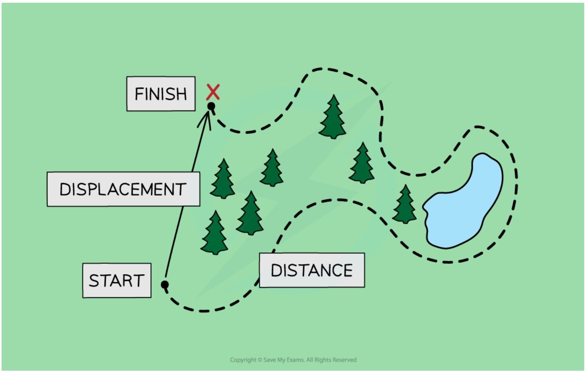

*Displacement is a vector quantity while distance is a scalar quantity*

* When a student travels to school, there will probably be a **difference** in the distance they travel and their displacement
    

    * The **overall distance** they travel includes the total lengths of all the roads, including any twists and turns
    

    * The **overall displacement** of the student would be a straight line between their home and school, regardless of any obstacles, such as buildings, lakes or motorways, along the way

### Speed and Velocity

* The **speed** of an object is **the distance it travels every second**

* Speed is a **scalar** quantity because it has a **magnitude** but not a direction

#### Average speed

* The **speed** of an object can **vary** throughout its journey

* Therefore, it is often more useful to know an object's **average speed**

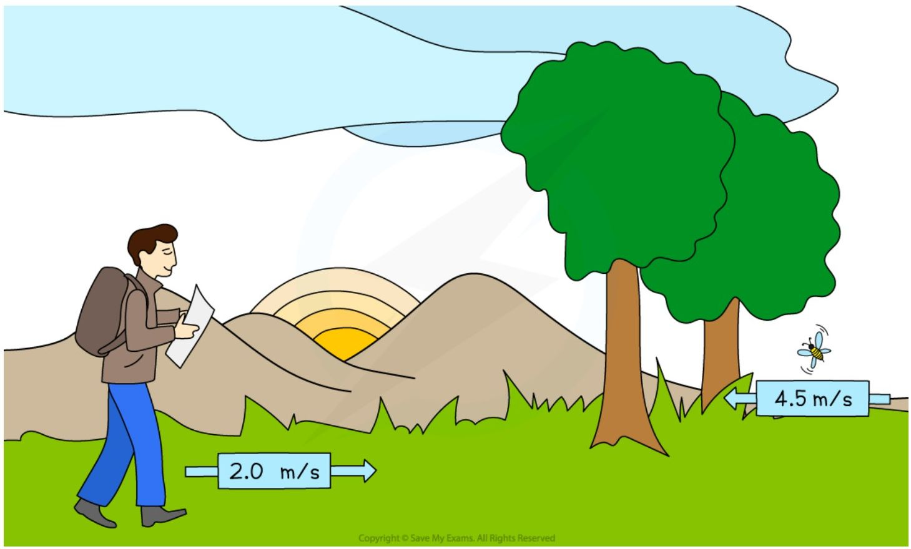

*A hiker might have an average speed of 2.0 m/s, whereas a particularly excited bumble bee can have average speeds of up to 4.5 m/s*

* The equation for calculating the **average speed** of a moving object is:

$$ \text{average speed} = \frac{\text{distance moved}}{\text{time taken}} $$

* **Average speed** considers the **total distance moved** and the **total time taken**

??? note "Average speed formula triangle"

    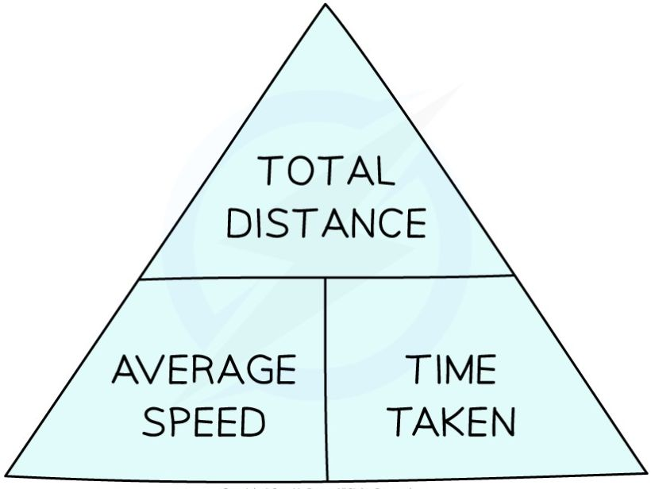

    *Formula triangle for average speed, distance moved and time taken*

??? note "How to use formula triangles"

    * Formula triangles are really useful for knowing how to rearrange physics equations

    * To use them:

    1. Cover up the quantity to be calculated, this is known as the 'subject' of the equation

    2. Look at the position of the other two quantities

        * If they are on the same line, this means they are **multiplied**

        * If one quantity is above the other, this means they are **divided** - make sure to keep the order of which is on the top and bottom of the fraction!

    * In the example below, to calculate average speed, cover-up the variable speed so that only distance and time are left

        * The equation is revealed as:

    $$ \text{speed} = \frac{\text{distance}}{\text{time}} $$

    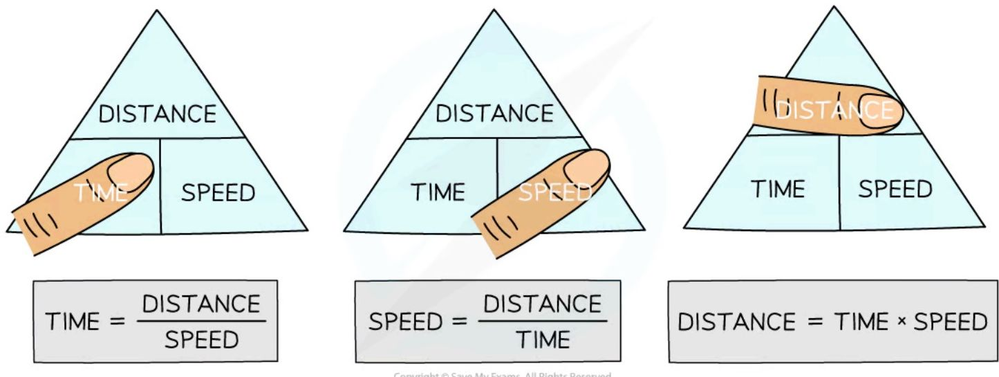

    *To use a formula triangle, simply cover up the quantity you wish calculate and the structure of the equation is revealed*

!!! Example "Worked Example"

    Planes fly at typical average speeds of around 250 m/s.

    Calculate the distance travelled by a plane moving at this average speed for 2 hours.

    ??? note "Answer:"

        **Step 1: List the known quantities**

        * Average speed = 250 m/s

            - Time taken = 2 hours

        **Step 2: Write the relevant equation**

        $$ \text{average speed} = \frac{\text{distance moved}}{\text{time taken}} $$

        **Step 3: Rearrange to make distance moved the subject**

        $$ \text{distance moved} = \text{average speed} \times \text{time taken} $$

        **Step 4: Convert any units**

        * The time given in the question is not in standard units

        * Convert 2 hours into seconds:

        $$ 2 \text{ hours} = 2 \times 60 \times 60 $$

        $$ 2 \text{ hours} = 7200 \text{ s} $$

        **Step 5: Substitute the values for average speed and time taken**

        $$ \text{distance moved} = 250 \times 7200 $$

        $$ \text{distance moved} = 1\ 800\ 000 \text{ m} $$

!!! tip "Examiner Tips and Tricks"
    Rearranging equations is an important skill in Physics. You can use the equation triangles to help you practice, but it is better not to rely on them because they do not work for all equations you may need to rearrange in the exam.

#### velocity

* **Speed** is a measure of the **distance** travelled by an object per unit time, **regardless of the direction**
    

    * The speed of an object describes how fast it is moving, but **not** the direction it is travelling in
    

    * Speed, therefore, has **magnitude** but **no direction**
    

    * So, speed is a **scalar** quantity

* **Velocity** is a measure of the **displacement** of an object per unit time, **including the direction**
    

    * The velocity of an object describes how fast it is moving **and** which direction it is travelling in
    

    * An object can have a **constant speed** but a **changing velocity** if the object is **changing direction**
    

    * Velocity, therefore, has **magnitude and direction**

* So, velocity is a **vector** quantity

### Acceleration

* **Acceleration** is defined as the **rate of change in velocity**

    * In other words, it describes how much an object's velocity **changes** every **second**

* The equation below is used to calculate the average acceleration of an object:

$$ \text{acceleration} = \frac{\text{change in velocity}}{\text{time taken}} $$

$$ a = \frac{\Delta v}{t} $$

* Where:

    * $a$ = acceleration in metres per second squared (m/s2)

    * $\Delta v$ = change in velocity in metres per second (m/s)

    * $t$ = time taken in seconds (s)

??? note "Formula triangle for acceleration, change in velocity and time"

    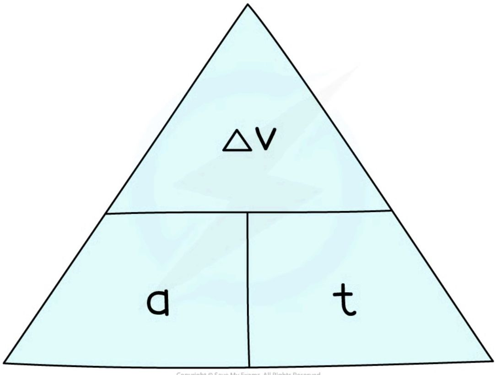

    *To use an equation triangle, simply cover up the value you wish to calculate and the structure of the equation will be revealed*

* The **change in velocity** is found by the **difference** between the initial and final velocity:

change in velocity = final velocity $-$ initial velocity

$$ \Delta v = v - u $$

* Where:

- $v$ = final velocity in metres per second (m/s)

- $u$ = initial velocity in metres per second (m/s)

* Therefore, the acceleration, or the rate of change in velocity, equation can be written as:

$$ a = \frac{(v - u)}{t} $$

#### Speeding up and slowing down

* An object that speeds up is **accelerating**

* An object that slows down is **decelerating**

* The **acceleration** of an object can be **positive** or **negative**, depending on whether the object is speeding up or slowing down

- If an object is **speeding up**, its acceleration is **positive**

- If an object is **slowing down**, its acceleration is **negative** (also known as **deceleration**)

#### Examples of acceleration and deceleration

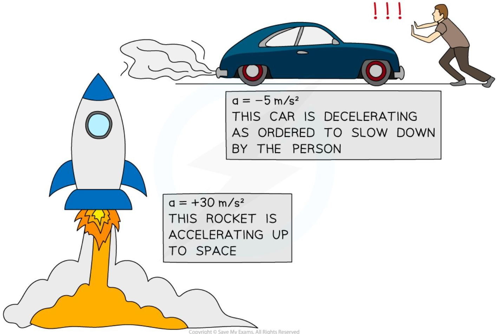

A rocket speeding up (accelerating) and a car slowing down (decelerating)

!!! Example "Worked Example"

    A Japanese bullet train decelerates at a constant rate in a straight line. The velocity of the train decreases from $50\text{ m/s}$ to $42\text{ m/s}$ in $30\text{ seconds}$.

    (a) Calculate the change in velocity of the train.

    (b) Calculate the deceleration of the train, and explain how your answer shows the train is slowing down.

    ??? note "Answer (Part a)"

        **Step 1: List the known quantities**

        * Initial velocity, $u = 50\text{ m/s}$

        * Final velocity, $v = 42\text{ m/s}$

        **Step 2: Write the relevant equation**

        $$\Delta v = v - u$$

        **Step 3: Substitute values for final and initial velocity**

        $$\Delta v = 42 - 50$$

        $$\Delta v = -8\text{ m/s}$$

    ??? note "Answer (Part b)"

        **Step 1: List the known quantities**

        * Change in velocity, $\Delta v = -8\text{ m/s}$

        * Time taken, $t = 30\text{ s}$

        **Step 2: Write the relevant equation**

        $$a = \frac{(v - u)}{t} = \frac{\Delta v}{t}$$

        **Step 3: Substitute the values for change in velocity and time**

        $$a = \frac{-8}{30}$$

        $$a = -0.27\text{ m/s}^2$$

        **Step 4: Interpret the value for deceleration**
        
        * The answer is **negative**, which indicates the train is **slowing down**

!!! tip "Examiner Tips and Tricks"

    Remember, the units for acceleration are **metres per second squared**, m/s2

    In other words, acceleration measures how much the velocity (in m/s) changes every second, m/s/s.

## Core practical 1: investigating motion

### Aim of the experiment

* The aim of this experiment is to investigate the motion of some everyday objects, by measuring their speed

* Examples of objects that could be used are:

    * a **paper cone**

    * a **tennis ball**

* Measuring speed **directly** is difficult to do; therefore, by measuring distance moved and time taken, the average speed of the object can be calculated

* This is just one method of measuring the speed of different objects - some methods involve the use of light gates to measure speed and acceleration, e.g. for a **toy car** moving down a slope

### Variables

* Independent variable = Distance, *d*

* Dependent variable = Time, *t*

* Control variables:

    * Use the same object (paper cone, tennis ball etc.) for each measurement

### Equipment

<table>
  <thead>
    <tr>
        <th>Equipment</th>
        <th>Purpose</th>
    </tr>
  </thead>
  <tbody>
    <tr>
        <td>Paper cone / tennis ball</td>
        <td>To measure the speed of</td>
    </tr>
    <tr>
        <td>Stop watch</td>
        <td>To measure time taken</td>
    </tr>
    <tr>
        <td>Tape measure / metre rule</td>
        <td>To measure distance moved</td>
    </tr>
  </tbody>
</table>

* Resolution of measuring equipment:

    * Ruler = 1 mm

    * Stop clock = 0.01 s

### Method

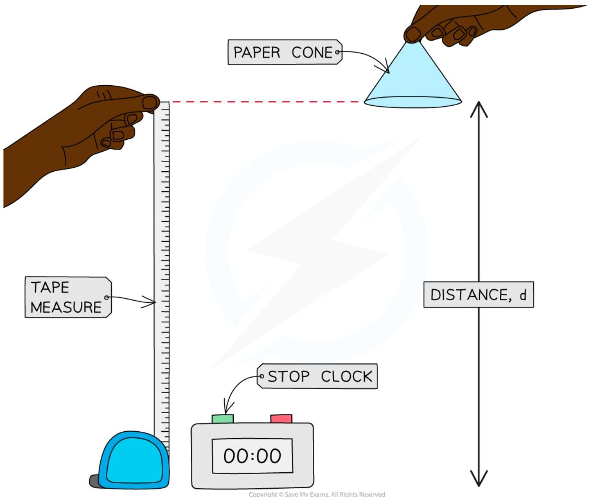

***Investigating the motion of a falling paper cone***

1. Measure out a height of 1.0 m using the tape measure or metre ruler

2. Drop the object (paper cone or tennis ball) from this height, which is the distance travelled by the object

3. Use the stop clock to measure how long the object takes to travel this distance

4. Record the distance travelled and time taken

5. Repeat steps 2–3 three times, calculating an average time taken for the object to fall a certain distance

6. Repeat steps 1–4 for heights of 1.2 m, 1.4 m, 1.6 m, and 1.8 m

### Example results table

<table>
  <thead>
    <tr>
        <th>DISTANCE / m</th>
        <th>TIME 1 / s</th>
        <th>TIME 2 / s</th>
        <th>TIME 3 / s</th>
        <th>AVERAGE TIME / s</th>
    </tr>
  </thead>
  <tbody>
    <tr>
        <td colspan="5">1.0</td>
    </tr>
    <tr>
        <td colspan="5">1.2</td>
    </tr>
    <tr>
        <td colspan="5">1.4</td>
    </tr>
    <tr>
        <td colspan="5">1.6</td>
    </tr>
    <tr>
        <td colspan="5">1.8</td>
    </tr>
  </tbody>
</table>

*A results table should include spaces for all the measurements taken and space to perform any necessary calculations, such as averages*

### Analysis of results

* The average speed of the falling object can be calculated using the equation:

$$ \text{average speed} = \frac{\text{distance moved}}{\text{time taken}} $$

* Where:

    - Average speed is measured in metres per second (m/s)

    - Distance moved is measured in metres (m)

    - Time taken is measured in seconds (s)

* Therefore, calculate the average speed at each distance by dividing the distance by the average time taken

### Evaluating the experiment

#### Systematic errors

* Make sure the measurements on the tape measure or metre rule are taken at eye level to avoid **parallax error**

* The average human reaction time is 0.25 s, which is equivalent to half a second per when starting and stopping the timer

    - This is likely to be significant when small intervals of time are measured

    - To reduce this systematic error, larger distances could be used resulting in larger time intervals

    - Using a **ball bearing** and an **electronic data logger**, like a trap door, is a good way to remove the error due to human **reaction time** for this experiment

* Consider using an electronic sensor, such as light gates, to obtain highly accurate measurements of time

* The timer on a light gate starts and stops automatically as it passes the sensors positioned at the start and stop points

#### Random errors

* Ensure the experiment is done in a space with no draft or breeze, as this could affect the motion of the falling object

#### Safety considerations

* Place a mat or a soft material below any falling object to cushion its fall

## Motion graphs

### Distance-time graphs

* A distance-time graph shows how the **distance** of an object moving in a straight line (from a starting position) varies over time:

<table>
  <thead>
    <tr>
        <th>TIME</th>
        <th>DISTANCE</th>
    </tr>
  </thead>
  <tbody>
    <tr>
        <td>0</td>
        <td>0</td>
    </tr>
    <tr>
        <td colspan="2">THIS OBJECT’S DISTANCE IS INCREASING WITH TIME. IN OTHER WORDS, IT IS MOVING FURTHER AWAY FROM ITS STARTING POSITION</td>
    </tr>
  </tbody>
</table>

*This graph shows a moving object moving further away from its origin*

#### Constant speed on a distance-time graph

* Distance-time graphs also show the following information:

    * Whether the object is moving at a **constant speed**

    * How **large** or **small** the speed is

* A **straight line** represents **constant speed**

* The slope of the straight line represents the **magnitude** of the speed:

    * A very **steep** slope means the object is moving at a **large** speed

    * A **shallow** slope means the object is moving at a **small** speed

    * A **flat, horizontal line** means the object is **stationary** (not moving)

<table>
  <thead>
    <tr>
        <th>Series</th>
        <th>Slope Description</th>
    </tr>
  </thead>
  <tbody>
    <tr>
        <td>Blue line</td>
        <td>STEEPER SLOPE MEANS LARGER SPEED</td>
    </tr>
    <tr>
        <td>Orange line</td>
        <td>SHALLOWER SLOPE MEANS SMALLER SPEED</td>
    </tr>
  </tbody>
</table>

*This graph shows how the slope of a line is used to interpret the speed of moving objects. Both of these objects are moving with a constant speed, because the lines are straight.*

!!! tip "Examiner Tips and Tricks"

    The Edexcel IGCSE Physics specification states that you need to be able to explain distance-time graphs and to be able to plot them.

    Plotting graphs is an important skill in physics and usually comes up in at least one exam paper. If you are not confident in plotting graphs, you should definitely practice before your exam!

#### Changing speed on a distance-time graph

* Objects might be moving at a **changing speed**

    - This is represented by a **curve**

* In this case, the slope of the line will be changing

    - If the slope is **increasing**, the **speed** is **increasing** (accelerating)

    - If the slope is **decreasing**, the **speed** is **decreasing** (decelerating)

* The image below shows two different objects moving with changing speeds

*Changing speeds are represented by changing slopes. The red line represents an object slowing down and the green line represents an object speeding up.*

#### Calculating speed from a distance-time graph

* The **speed** of a moving object can be calculated from the **gradient** of the line on a **distance-time** graph:

$$ \text{speed} = \text{gradient} = \frac{\Delta y}{\Delta x} $$

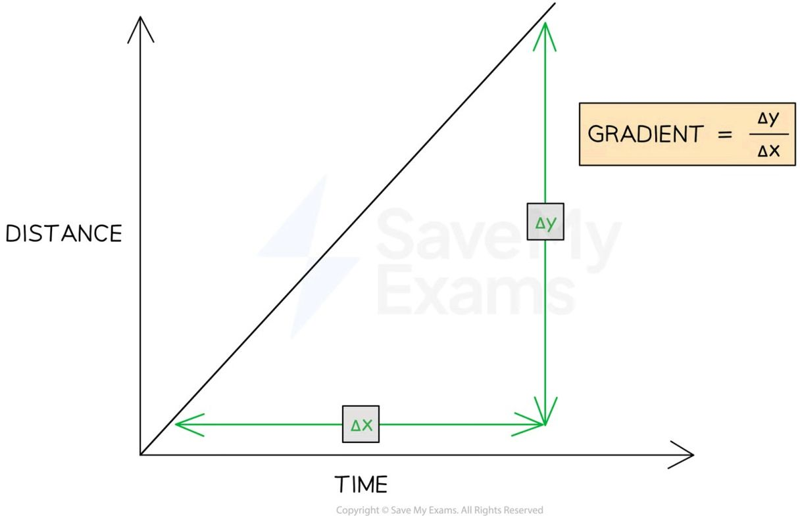

**The speed of an object can be found by calculating the gradient of a distance-time graph**

* $\Delta y$ is the **change** in y (distance) values

* $\Delta x$ is the **change** in x (time) values

!!! Example "Worked Example"

    A distance-time graph is drawn below for part of a train journey. The train is travelling at a constant speed.

    <table>
    <thead>
        <tr>
            <th>TIME (MINUTES)</th>
            <th>DISTANCE (km)</th>
        </tr>
    </thead>
    <tbody>
        <tr>
            <td>0</td>
            <td>0</td>
        </tr>
        <tr>
            <td>1</td>
            <td>1.33</td>
        </tr>
        <tr>
            <td>2</td>
            <td>2.67</td>
        </tr>
        <tr>
            <td>3</td>
            <td>4</td>
        </tr>
        <tr>
            <td>4</td>
            <td>5.33</td>
        </tr>
        <tr>
            <td>5</td>
            <td>6.67</td>
        </tr>
        <tr>
            <td>6</td>
            <td>8</td>
        </tr>
    </tbody>
    </table>

    Calculate the speed of the train.

    ??? note "Answer:"

        **Step 1: Draw a large gradient triangle on the graph**

        * The image below shows a large **gradient triangle** drawn with dashed lines

        * $\Delta y$ and $\Delta x$ are labelled, using the **units** as stated on each axes

        <table>
        <thead>
            <tr>
                <th>TIME (MINUTES)</th>
                <th>DISTANCE (km)</th>
            </tr>
        </thead>
        <tbody>
            <tr>
                <td>0</td>
                <td>0</td>
            </tr>
            <tr>
                <td>1</td>
                <td>1.33</td>
            </tr>
            <tr>
                <td>2</td>
                <td>2.67</td>
            </tr>
            <tr>
                <td>3</td>
                <td>4.00</td>
            </tr>
            <tr>
                <td>4</td>
                <td>5.33</td>
            </tr>
            <tr>
                <td>5</td>
                <td>6.67</td>
            </tr>
            <tr>
                <td>6</td>
                <td>8.00</td>
            </tr>
        </tbody>
        </table>

        \* Δx = 6 mins, Δy = 8 km

        **Step 2: Convert units for distance and time into standard units**

        * The distance travelled = 8 km = **8000 m**

        * The time taken = 6 mins = **360 s**

        **Step 3: State that speed is equal to the gradient of a distance-time graph**

        * The **gradient** of a **distance-time** graph is equal to the **speed** of a moving object:

        $$\text{speed} = \text{gradient} = \frac{\Delta y}{\Delta x}$$

        **Step 4: Substitute values in to calculate the speed**

        $$\text{speed} = \frac{8000}{360}$$

        $$\text{speed} = 22.2 \text{ m/s}$$

!!! Example "Worked Example 2"

    A student decides to take a stroll to the park. They find a bench in a quiet spot and take a seat, picking up where they left off reading a book on Black Holes. After some time reading, the student realises they lost track of time and runs home.

    A distance-time graph for for the student's trip is drawn below:

    <table>
    <thead>
        <tr>
            <th>TIME (MINUTES)</th>
            <th>DISTANCE (km)</th>
        </tr>
    </thead>
    <tbody>
        <tr>
            <td>0</td>
            <td>0</td>
        </tr>
        <tr>
            <td>10</td>
            <td>0.12</td>
        </tr>
        <tr>
            <td>20</td>
            <td>0.24</td>
        </tr>
        <tr>
            <td>25</td>
            <td>0.3</td>
        </tr>
        <tr>
            <td>30</td>
            <td>0.3</td>
        </tr>
        <tr>
            <td>40</td>
            <td>0.3</td>
        </tr>
        <tr>
            <td>50</td>
            <td>0.3</td>
        </tr>
        <tr>
            <td>60</td>
            <td>0.3</td>
        </tr>
        <tr>
            <td>65</td>
            <td>0.3</td>
        </tr>
        <tr>
            <td>70</td>
            <td>0.45</td>
        </tr>
        <tr>
            <td>75</td>
            <td>0.6</td>
        </tr>
    </tbody>
    </table>

    a) How long does the student spend reading the book?

    b) Which section of the graph represents the student running home?

    c) What is the total distance travelled by the student?

    ??? note "Answer (Part a):"

        * The student spends **40 minutes** reading the book

        * The **flat** section of the line (section B) represents an object which is **stationary** - so section B represents the student sitting on the bench reading

        * This section lasts for **40 minutes** - as shown in the graph below

        <table>
        <thead>
            <tr>
                <th>TIME (MINUTES)</th>
                <th>DISTANCE (km)</th>
            </tr>
        </thead>
        <tbody>
            <tr>
                <td>0</td>
                <td>0</td>
            </tr>
            <tr>
                <td>10</td>
                <td>0.12</td>
            </tr>
            <tr>
                <td>20</td>
                <td>0.24</td>
            </tr>
            <tr>
                <td>25</td>
                <td>0.3</td>
            </tr>
            <tr>
                <td>30</td>
                <td>0.3</td>
            </tr>
            <tr>
                <td>40</td>
                <td>0.3</td>
            </tr>
            <tr>
                <td>50</td>
                <td>0.3</td>
            </tr>
            <tr>
                <td>60</td>
                <td>0.3</td>
            </tr>
            <tr>
                <td>65</td>
                <td>0.3</td>
            </tr>
            <tr>
                <td>70</td>
                <td>0.45</td>
            </tr>
            <tr>
                <td>75</td>
                <td>0.6</td>
            </tr>
        </tbody>
        </table>

    ??? note "Answer (Part b):"

        * **Section C** represents the student running home
        * The **slope** of the line in section C is **steeper** than the slope in section A
        * This means the student was moving with a **larger** speed (running) in section C

    ??? note "Answer Part (c):"

        * The total distance travelled by the student is **0.6 km**
        * The total distance travelled by an object is given by the final point on the line - in this case, the line ends at **0.6 km** on the **distance** axis. This is shown in the image below:

        <table>
        <thead>
            <tr>
                <th>TIME (MINUTES)</th>
                <th>DISTANCE (km)</th>
            </tr>
        </thead>
        <tbody>
            <tr>
                <td>0</td>
                <td>0</td>
            </tr>
            <tr>
                <td>10</td>
                <td>0.12</td>
            </tr>
            <tr>
                <td>25</td>
                <td>0.3</td>
            </tr>
            <tr>
                <td>65</td>
                <td>0.3</td>
            </tr>
            <tr>
                <td>75</td>
                <td>0.6</td>
            </tr>
        </tbody>
        </table>

!!! tip "Examiner Tips and Tricks"
    Use the **entire line**, where possible, to calculate the gradient. Examiners tend to award credit if they see a **large gradient triangle** used - so remember to draw these directly on the graph itself!

    Remember to check the **units** of variables measured on each axis. These may not always be in standard units - in our example, the unit of distance was **km** and the unit of time was **minutes**. Double-check which units to use in your answer.

### Velocity-Time Graphs

* A velocity time graph, or velocity-time graph, shows how the **velocity** of a moving object varies with **time**

    - Velocity-time refers to the fact that velocity is plotted against time on the graph

* The red line represents an object with **increasing** velocity

* The green line represents an object with **decreasing** velocity

**Velocity-time graph**

<table>
  <tbody>
    <tr>
        <td>Category</td>
        <td>Increasing Velocity</td>
        <td>Decreasing Velocity</td>
    </tr>
    <tr>
        <td>Start</td>
        <td>Low</td>
        <td>High</td>
    </tr>
    <tr>
        <td>End</td>
        <td>High</td>
        <td>Low</td>
    </tr>
  </tbody>
</table>

*Increasing and decreasing velocity represented on a velocity-time graph*

#### Acceleration on a velocity-time graph

* Velocity-time graphs also show the following information:

    - Whether the object is moving with a **constant acceleration**

    - The **magnitude** of the acceleration

* A **straight line** represents **constant acceleration** (or deceleration)

* The **slope** of the line represents the **magnitude** of acceleration

    - A **steep** slope means **large acceleration**

        - The object's speed changes very **quickly**

    - A **gentle** slope means **small acceleration**

        - The object's speed changes very **gradually**

    - A **positive gradient** shows **increasing velocity**

* The object is **accelerating**

* A **negative gradient** shows **decreasing velocity**

- The object is **decelerating**

* A **flat line** means the acceleration is **zero**

- The object is moving with a **constant velocity**

#### Constant acceleration and constant velocity on a velocity-time graph

<table>
  <thead>
    <tr>
        <th>Phase</th>
        <th>Description</th>
    </tr>
  </thead>
  <tbody>
    <tr>
        <td>Constant acceleration</td>
        <td>Upward sloping line</td>
    </tr>
    <tr>
        <td>Constant velocity</td>
        <td>Flat horizontal line</td>
    </tr>
    <tr>
        <td>Constant deceleration</td>
        <td>Downward sloping line</td>
    </tr>
  </tbody>
</table>

*Flat horizontal lines on a velocity-time graph show periods of constant velocity, and sloping straight line show periods of acceleration*

#### How to find acceleration on a velocity-time graph

* The **acceleration** of an object can be calculated from the **gradient** of a velocity-time graph

$$ \text{acceleration} = \text{gradient} = \frac{\Delta y}{\Delta x} $$

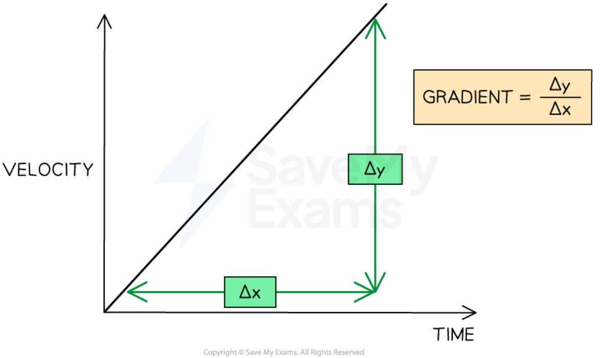

*How to find the gradient of a velocity-time graph*

*   $\Delta y$ is the change in $y$ (velocity) values

*   $\Delta x$ is the change in $x$ (time) values

!!! Example "Worked Example"

    A cyclist is training for a cycling tournament.

    The velocity-time graph below shows the cyclist's motion as they cycle along a flat, straight road.

    <table>
    <tbody>
        <tr>
            <td>TIME (s)</td>
            <td>VELOCITY (m/s)</td>
        </tr>
        <tr>
            <td>0</td>
            <td>0</td>
        </tr>
        <tr>
            <td>1</td>
            <td>0</td>
        </tr>
        <tr>
            <td>2</td>
            <td>0</td>
        </tr>
        <tr>
            <td>3</td>
            <td>0</td>
        </tr>
        <tr>
            <td>4</td>
            <td>0</td>
        </tr>
        <tr>
            <td>5</td>
            <td>0</td>
        </tr>
        <tr>
            <td>6</td>
            <td>1</td>
        </tr>
        <tr>
            <td>7</td>
            <td>2</td>
        </tr>
        <tr>
            <td>8</td>
            <td>3</td>
        </tr>
        <tr>
            <td>9</td>
            <td>4</td>
        </tr>
        <tr>
            <td>10</td>
            <td>5</td>
        </tr>
        <tr>
            <td>11</td>
            <td>5</td>
        </tr>
        <tr>
            <td>12</td>
            <td>5</td>
        </tr>
        <tr>
            <td>13</td>
            <td>5</td>
        </tr>
        <tr>
            <td>14</td>
            <td>8</td>
        </tr>
        <tr>
            <td>15</td>
            <td>10</td>
        </tr>
        <tr>
            <td>16</td>
            <td>10</td>
        </tr>
        <tr>
            <td>17</td>
            <td>10</td>
        </tr>
        <tr>
            <td>18</td>
            <td>10</td>
        </tr>
        <tr>
            <td>19</td>
            <td>10</td>
        </tr>
        <tr>
            <td>20</td>
            <td>10</td>
        </tr>
    </tbody>
    </table>

    (a) In which section (A, B, C, D, or E) of the velocity-time graph is the cyclist's acceleration the largest?

    (b) Calculate the cyclist's acceleration between 5 and 10 seconds.

    ??? note "Answer (Part a):"
        **Step 1: Recall that the slope of a velocity-time graph represents the magnitude of acceleration**

        * The slope of a velocity-time graph indicates the magnitude of acceleration
        Therefore, the only sections of the graph where the cyclist is accelerating are sections B and D

        * Sections A, C, and E are flat; in other words, the cyclist is moving at a constant velocity (therefore, not accelerating)

        **Step 2: Identify the section with the steepest slope**

        * Section D of the graph has the steepest slope

        * Hence, the largest acceleration is shown in section D

    ??? note "Answer (Part b):"

        **Step 1: Recall that the gradient of a velocity-time graph gives the acceleration**

        * Calculating the gradient of a slope on a velocity-time graph gives the acceleration for that time period

        **Step 2: Draw a large gradient triangle at the appropriate section of the graph**

        * A gradient triangle is drawn for the time period between 5 and 10 seconds

        <table>
        <thead>
            <tr>
                <th>TIME (s)</th>
                <th>VELOCITY (m/s)</th>
            </tr>
        </thead>
        <tbody>
            <tr>
                <td>0</td>
                <td>0</td>
            </tr>
            <tr>
                <td>2.5</td>
                <td>0</td>
            </tr>
            <tr>
                <td>5</td>
                <td>0</td>
            </tr>
            <tr>
                <td>7.5</td>
                <td>2.5</td>
            </tr>
            <tr>
                <td>10</td>
                <td>5</td>
            </tr>
            <tr>
                <td>12.5</td>
                <td>5</td>
            </tr>
            <tr>
                <td>14</td>
                <td>8</td>
            </tr>
            <tr>
                <td>15</td>
                <td>10</td>
            </tr>
            <tr>
                <td>17.5</td>
                <td>10</td>
            </tr>
            <tr>
                <td>20</td>
                <td>10</td>
            </tr>
        </tbody>
        </table>

        **Step 3: Calculate the size of the gradient and state this as the acceleration**

        * The acceleration is given by the gradient, which can be calculated using:

        $$ a = \frac{\Delta y}{\Delta x} $$

        $$ a = \frac{5}{5} $$

        $$ a = 1\text{ m/s}^2 $$

        * Therefore, the cyclist accelerated at $1\text{ m/s}^2$ between 5 and 10 seconds

!!! tip "Examiner Tips and Tricks"
    Use the **entire slope**, where possible, to calculate the gradient. Examiners tend to award credit if they see a **large gradient triangle** used.

    Remember to actually draw the lines directly on the graph itself, particularly when the question asks you to **use the graph** to calculate the acceleration.

#### How to find the distance travelled on a velocity-time graph

* The area under a **velocity-time graph** represents the **displacement** (or **distance travelled**) by an object

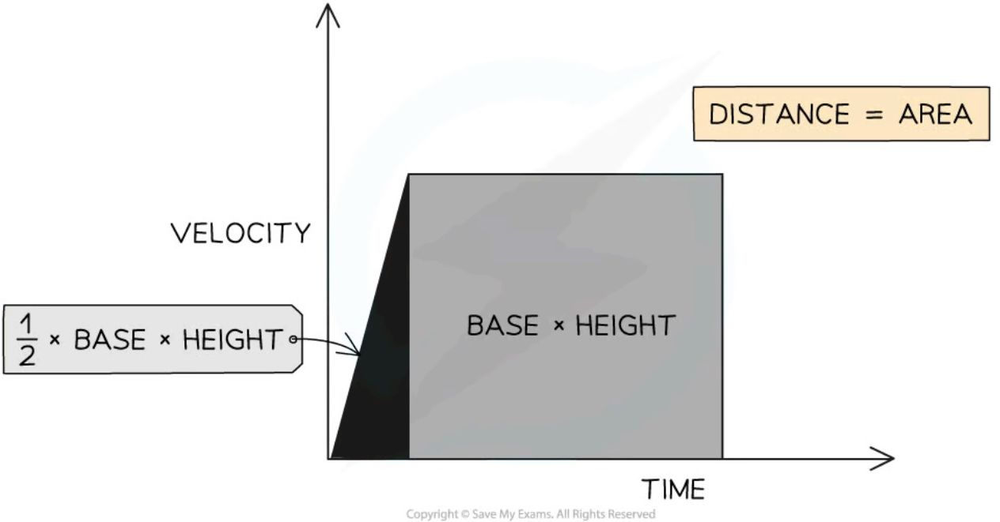

*The displacement, or distance travelled, is represented by the area beneath the graph*

* If the area beneath the velocity-time graph forms a **triangle** (i.e. the object is **accelerating** or **decelerating**), then the area can be determined by using the following formula:

**Area = ½ × Base × Height**

* If the area beneath the velocity-time graph forms a **rectangle** (i.e. the object is moving at a **constant velocity**), then the area can be determined by using the following formula:

**Area = Base × Height**

* **Enclosed** areas under velocity-time graphs represent **total displacement** (or **total distance travelled**) in a time interval

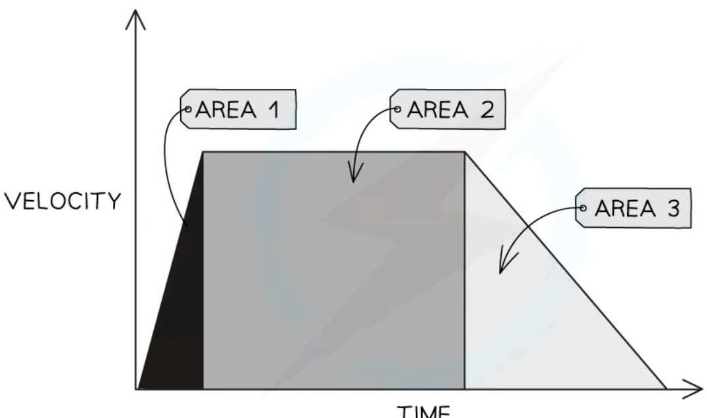

Three enclosed areas (two triangles and one rectangle) under this velocity-time graph represent the total distance travelled in the total time

* If an object moves with **constant acceleration**, its velocity-time graph will consist of straight lines

    - In this case, calculate the distance travelled by working out the **area of enclosed rectangles and triangles**

    - The area of each enclosed section represents the distance travelled in that particular interval of time

    - The **total** distance travelled is the **sum** of all the individual enclosed areas

!!! Example "Worked Example"

    The velocity-time graph below shows a car journey that lasts for 160 seconds.

    <table>
    <thead>
        <tr>
            <th>TIME (s)</th>
            <th>VELOCITY (m/s)</th>
        </tr>
    </thead>
    <tbody>
        <tr>
            <td>0</td>
            <td>0</td>
        </tr>
        <tr>
            <td>20</td>
            <td>8.75</td>
        </tr>
        <tr>
            <td>40</td>
            <td>17.5</td>
        </tr>
        <tr>
            <td>70</td>
            <td>17.5</td>
        </tr>
        <tr>
            <td>90</td>
            <td>25</td>
        </tr>
        <tr>
            <td>160</td>
            <td>0</td>
        </tr>
    </tbody>
    </table>

    Calculate the total distance travelled by the car.

    ??? note "Answer:"

        **Step 1: Recall that the area under a velocity-time graph represents the distance travelled**

        * In order to calculate the total distance travelled, the total area underneath the line must be determined

        **Step 2: Identify each enclosed area**

        * In this example, there are **five** enclosed areas under the line

        * These can be labelled as areas 1, 2, 3, 4 and 5, as shown in the image below:

        <table>
        <thead>
            <tr>
                <th>TIME (s)</th>
                <th>VELOCITY (m/s)</th>
            </tr>
        </thead>
        <tbody>
            <tr>
                <td>0</td>
                <td>0</td>
            </tr>
            <tr>
                <td>40</td>
                <td>17.5</td>
            </tr>
            <tr>
                <td>70</td>
                <td>17.5</td>
            </tr>
            <tr>
                <td>90</td>
                <td>25</td>
            </tr>
            <tr>
                <td>110</td>
                <td>17.5</td>
            </tr>
            <tr>
                <td>160</td>
                <td>0</td>
            </tr>
        </tbody>
        </table>

        **Step 3: Calculate the area of each enclosed shape under the line**

        * Area 1 = area of a triangle

        $$A_1 = \frac{1}{2} \times \text{base} \times \text{height}$$

        $$A_1 = \frac{1}{2} \times 40 \times 17.5$$

        $$A_1 = 350 \text{ m}$$

        * Area 2 = area of a rectangle

        $$A_2 = \text{base} \times \text{height}$$

        $$A_2 = 30 \times 17.5$$

        $$A_2 = 525 \text{ m}$$

        * Area 3 = area of a triangle

        $$ A_3 = \frac{1}{2} \times \text{base} \times \text{height} $$

        $$ A_3 = \frac{1}{2} \times 20 \times 7.5 $$

        $$ A_3 = 75 \text{ m} $$

        * Area 4 = area of a rectangle

        $$ A_4 = \text{base} \times \text{height} $$

        $$ A_4 = 20 \times 17.5 $$

        $$ A_4 = 350 \text{ m} $$

        * Area 5 = area of a triangle

        $$ A_5 = \frac{1}{2} \times \text{base} \times \text{height} $$

        $$ A_5 = \frac{1}{2} \times 70 \times 25 $$

        $$ A_5 = 875 \text{ m} $$

        **Step 4: Calculate the total distance travelled by finding the total area under the line**

        * Add up each of the five areas enclosed:

        $$ \text{total distance} = A_1 + A_2 + A_3 + A_4 + A_5 $$

        $$ \text{total distance} = 350 + 525 + 75 + 350 + 875 $$

        $$ \text{total distance} = 2175 \text{ m} $$

!!! tip "Examiner Tips and Tricks"

    Some areas will need to be split into a triangle and a rectangle to determine the area for a specific time interval, like areas 3 & 4 in the worked example above.

    If you are asked to find the distance travelled for a specific time interval, then you just need to find the area of the section above that time interval.

    For example, the distance travelled between 70 s and 90 s is the sum of Area 3 + Area 4

## Equations of motion

* Uniform acceleration is **constant** acceleration

* The following equation applies to objects moving with **uniform acceleration**:

(final speed)2 = (initial speed)2 + (2 × acceleration × distance moved)

$$ v^2 = u^2 + 2as $$

* Where:

    - s = distance moved in metres (m)

    - u = initial speed in metres per second (m/s)

    - v = final speed in metres per second (m/s)

    - a = acceleration in metres per second squared (m/s2)

* This equation is used to calculate quantities such as **initial or final speed, uniform acceleration,** or **distance moved** in cases where the **time taken** is **not known**

!!! tips "Examiner Tips and Tricks"

    This is an example of an equation that cannot be rearranged with a formula triangle. It is really important that you learn to rearrange equations without the help of a triangle for your exam.

    To rearrange any equation, follow these simple rules:

    * What ever you do to the equation, you must do to **both sides**

    * To undo an operation, perform the **opposite operation**

        - To undo a subtraction, you must add (and vice versa)

        - To undo a multiplication, you must divide (and vice versa)

        - To undo a square, you must square root (and vice versa)

    Always show your working out, there is usually a mark awarded for rearranging an equation in an exam question.

!!! Example "Worked Example"

    A car accelerates steadily from rest at a rate of 2.5 m/s2 up to a speed of 16 m/s.

    Calculate how far the car moves during this period of acceleration.

    ??? note "Answer:"

        **Step 1: List the known quantities**

        * Initial speed, $u = 0\text{ m/s}$

            - Because the car starts **from rest**

        * Final speed, $v = 16\text{ m/s}$

        * Acceleration, $a = 2.5\text{ m/s}$

        **Step 2: Identify and write down the equation to use**

        * The question says that the car '**accelerates steadily**' - so the equation for **uniform acceleration** can be used:

        $$v^2 = u^2 + 2as$$

        **Step 3: Rearrange the equation to work out the distance moved**

        * Subtract $u^2$ from each side

        $$v^2 - u^2 = 2as$$

        * Divide both sides by $2a$

        $$s = \frac{v^2 - u^2}{2a}$$

        **Step 4: Substitute known quantities into the equation and simplify where possible**

        $$s = \frac{16^2 - 0^2}{2 \times 2.5}$$

        $$s = \frac{256}{5}$$

        $$s = 51\text{ m}$$

!!! tip "Examiner Tips and Tricks"

    Writing out your **list of known quantities** and labelling the quantity you need to calculate is really good exam technique. It helps you determine the correct equation to use, and sometimes examiners award credit for showing this working.