# Explaining motion

## Newton's laws of motion

!!! abstract "Principle: Newton's first law of motion"
    An object will remain **stationary**, or moving at a **constant velocity**, unless acted on by a **resultant force**.

Newton's first law is the reason **balanced forces** produce no change in motion — a stationary object stays at rest, and a moving object keeps moving at the same speed and in the same direction, unless a resultant (unbalanced) force acts on it (see [Resultant force](#resultant-force) below). Newton's **second law** describes what happens once there *is* a resultant force — it causes an object to accelerate, and relates the size of that acceleration to the force and the object's mass (see [Newton's second law](#newtons-second-law) below). Newton's **third law** describes the forces between two objects that are interacting with each other (see [Newton's third law](1_4_momentum-and-collisions.md#newtons-third-law) in Momentum and collisions).

## Forces

A **force** is a **push** or **pull** that arises from the **interaction** between objects. There are lots of different types of forces that occur when objects interact.

### Forces acting at a distance

#### Gravitational force (weight)

There is a **gravitational force** of attraction between all objects with mass — the more massive the object, the greater the gravitational force exerted by it. When a football is thrown (or kicked), the gravitational pull of the Earth on the football pulls it toward the (centre of the) Earth.

!!! abstract "Definition: Weight"
    Weight is **the force experienced by an object with mass when placed in a gravitational field**.

##### Weight and mass

**Weight** and **mass** are **different** in physics. **Mass** is a measure of how much **matter** there is in an object — mass has **magnitude** but not direction, so mass is a **scalar** quantity. **Weight** is a force, and forces have **magnitude and direction**, so weight is a **vector** quantity.

##### Gravitational field strength

Planets have strong gravitational fields, so they attract nearby masses with a strong gravitational force. Different planets have different gravitational field strengths, depending on the mass of the planet — more massive planets have stronger gravitational fields.

##### Weight, mass and gravitational field strength

Because of weight, objects stay firmly on the ground, objects will always fall to the ground, and satellites are kept in orbit.

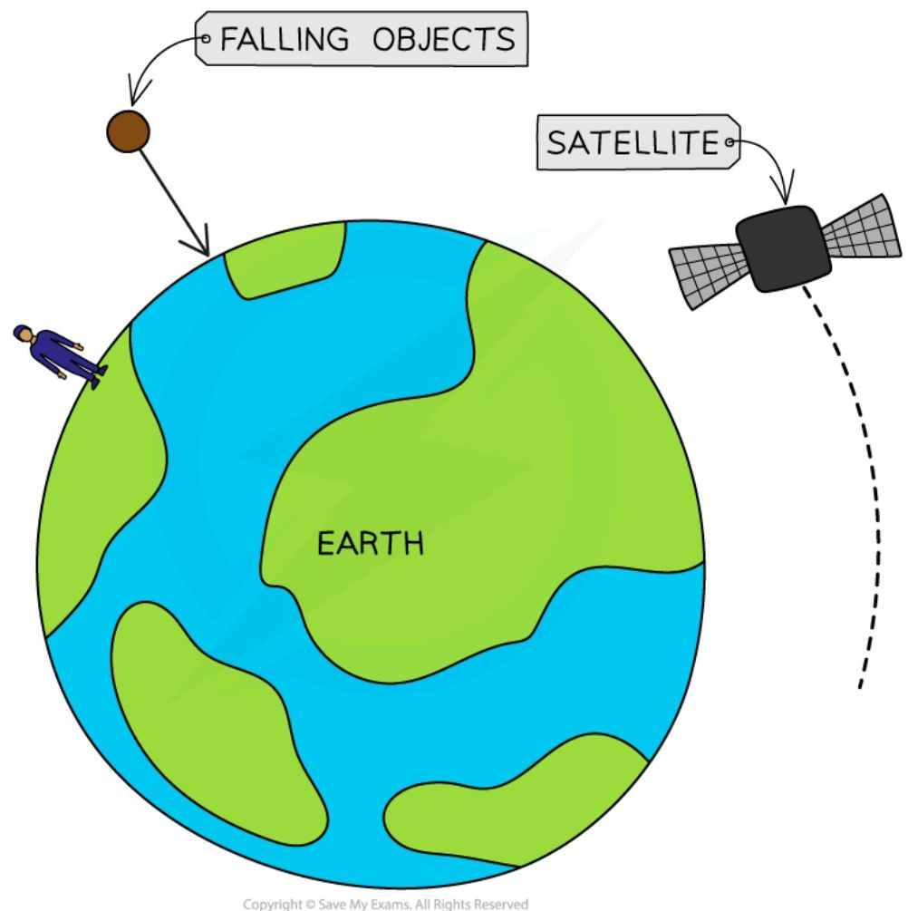

**Some of the phenomena associated with gravitational attraction and the weight force**

!!! note "Required formulae: weight"
    $$W = mg$$

    Where $W$ = weight, measured in newtons (N); $m$ = mass, measured in kilograms (kg); and $g$ = gravitational field strength, measured in newtons per kilogram (N/kg).

The **gravitational field strength** on Earth is **10 N/kg**. $g$ is also used to describe the acceleration of an object in freefall in a gravitational field — the **acceleration of freefall** on Earth is **10 m/s<sup>2</sup>**, since these quantities are two ways of describing the same thing.

The weight that an object experiences depends on the **object's** mass and the mass of the **planet** attracting it. The mass of an object and the weight acting on it are **directly proportional** — if one doubles, the other also doubles, and if one is halved, the other is also halved. The **magnitude** of the weight force depends on the **gravitational field strength**.

!!! example "Worked Example (calculation)"

    NASA's Artemis mission aims to send the first woman astronaut to the Moon. Isabelle hopes to one day become an astronaut. She has a mass of 40 kg.

    Earth's gravitational field strength is 10 N/kg, and the Moon's gravitational field strength is 2 N/kg.

    Discuss the difference between Isabelle's weight on Earth, and her weight on the Moon.

    ??? success "Answer:"

        **Step 1: State the equation linking weight and mass**

        $$W = m \times g$$

        **Step 2: List the known values**

        * Earth's gravitational field strength, $g = 10\text{ N/kg}$

        * The Moon's gravitational field strength, $g = 2\text{ N/kg}$

        * Mass, $m = 40\text{ kg}$

        **Step 3: Calculate Isabelle's weight on Earth**

        $$W = 40 \times 10 = 400\text{ N}$$

        **Step 4: Calculate Isabelle's weight on the Moon**

        $$W = 40 \times 2 = 80\text{ N}$$

        **Step 5: Discuss the two values of weight**

        Isabelle's weight is **greater** on Earth than on the Moon. This is because the Earth has a **larger** gravitational field strength than the Moon, so Isabelle's weight force (the force of gravity pulling down on her) is larger on Earth than on the Moon.

!!! tip "Examiner Tips and Tricks"

    It is a common misconception that mass and weight are the same, but they are in fact **very different**: since weight is a **force**, it is a **vector** quantity; since mass is an **amount**, it is a **scalar** quantity.

    You do not need to remember the value of $g$ on Earth; it will be given to you in the exam.

#### Electrostatic force

There is an **electrostatic** force between two objects with **charge**: **like charges repel** one another, and **opposite charges attract** one another. When an electron gets close to a positively charged ion, the ion exerts a pull force on the electron (**attraction**). When an electron gets close to another electron, the electrons experience a push force from one another (**repulsion**).

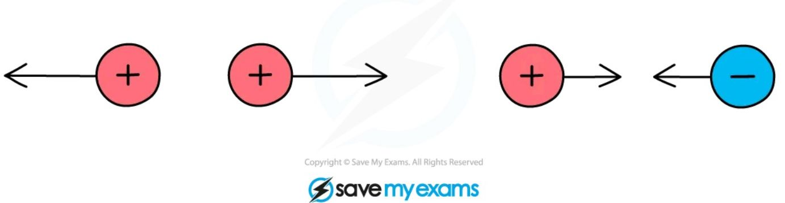

*Like charges experience a repulsive push force and opposite charges experience an attractive pull force*

#### Magnetic force

There is a **magnetic** force between objects with **magnetic poles**: **like poles repel** one another, **opposite poles attract** one another. When a north pole gets close to a south pole, they experience a pull force from one another (**attraction**). When a north pole gets close to a north pole, they experience a push force from one another (**repulsion**).

```mermaid
graph LR
    subgraph Opposites_Attract
    N1[N] --- f1( ) --> f2( ) --- S1[S]
    end
    subgraph Like_Poles_Repel_1
    N2[N] --- f3( ) <-- f4( ) --- N3[N]
    end
    subgraph Like_Poles_Repel_2
    S2[S] --- f5( ) <-- f6( ) --- S3[S]
    end
```

*Opposite poles experience an attractive pull force, and like poles experience a repulsive push force*

#### Nuclear forces

Inside an atomic nucleus, protons repel each other electrostatically (since they all carry positive charge), yet the nucleus of most atoms stays bound together — this is due to the **strong nuclear force**, an attractive force acting between protons and neutrons at very short range (roughly the size of a nucleus) that overcomes this electrostatic repulsion. Unlike gravitational, electrostatic and magnetic forces, the strong nuclear force only acts over an extremely short distance, becoming negligible outside the nucleus.

### Contact forces

#### Reaction force

When an object rests on a surface, the **surface** exerts a push force on the **object** — this **reaction force** acts at **right angles** (perpendicular) to the surface. When a football rests on the horizontal surface of the grass, the grass exerts a push force (reaction force) vertically upwards on the football.


*The push force exerted on an object by a surface is called the reaction force*

#### Friction

Frictional forces always **oppose** the **motion** of an object, causing it to **slow down**. Friction occurs when two (or more) surfaces rub against each other — at a molecular level, both surfaces contain **imperfections** (i.e. they are not perfectly smooth), and these imperfections tend to push against each other.


*Friction is a force which opposes an object's motion, acting in the opposite direction to the motion of the object*

!!! tip "Examiner Tips and Tricks"

    Drag force is a type of friction that acts to oppose the motion of objects moving through a fluid (a liquid or a gas).

    Air resistance is a type of drag force, and therefore a type of friction, that acts to oppose the motion of objects moving through air.

#### Tension

Tension occurs in an object (like a rope or spring) that is **stretched**. When a **pull** force is exerted on **each end** of an object, **tension** acts across the length of the object. When two people pull a rope in opposite directions, tension acts along the rope and pulls back on each person.

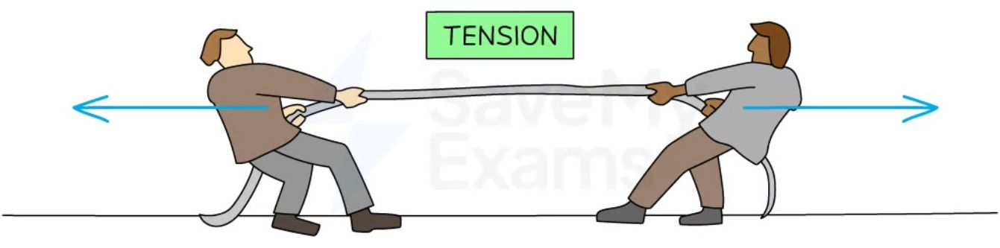

*Two people exert a pull force on the rope from each end, creating tension in the rope*

#### Upthrust

When an object is fully or partially **submerged** in a **fluid**, the fluid exerts an **upward-acting** push force on the object. A boat floats on a lake due to the **upthrust** exerted by the water on the boat. A ball held underwater will shoot upwards when released due to the upthrust exerted by the water pushing it back to the surface.

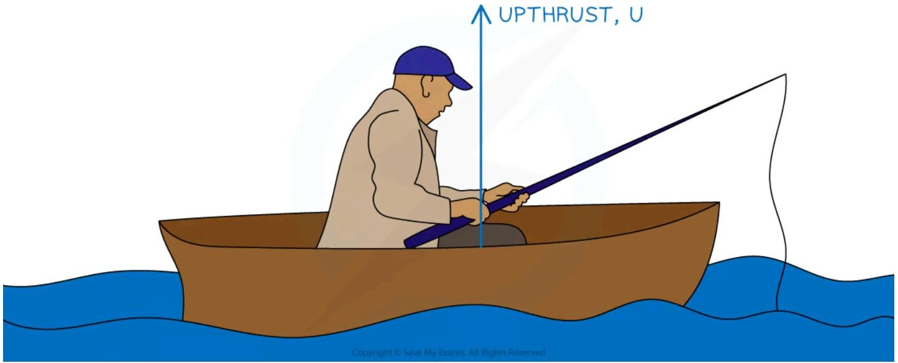

*The water pushes up on the boat, this is the force of upthrust*

#### Drag force

Drag force is a type of **frictional force** that occurs when an object moves through a **fluid** (a gas or a liquid). The particles in the fluid **collide** with the object moving through it and **slow** its motion. When a pebble is thrown into water, the water molecules flow against its solid surface, causing it to slow down.

#### Air resistance

Air resistance is a specific type of **drag** force and is therefore also a **frictional** force. Air resistance occurs when particles of air **collide** with an object moving through it and **slows** its **motion**. When a skydiver opens their parachute, air resistance opposes their motion and reduces their speed so it is safe to land.

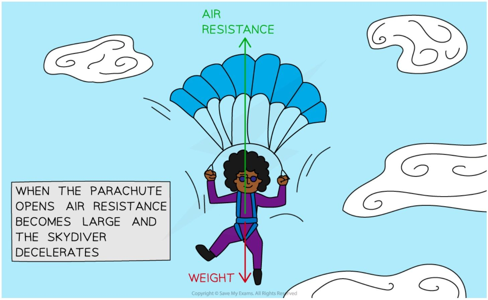

*A skydiver uses air resistance to reduce their speed so that they can land safely*

#### Thrust

Thrust is a force produced by an engine that **speeds up** the motion of an object. The engine of a car exerts a thrust force and increases its speed.

#### Lift

Lift is an upward force generated by the movement of an object through a fluid, such as air — the shape of an aircraft wing forces air to flow faster over its curved upper surface than underneath, creating a pressure difference that pushes the wing (and the aircraft) upwards.

#### General comments

!!! tip "Examiner Tips and Tricks"

    The force of gravitational attraction on an object is called its **weight**. Remember not to refer to this force as simply 'gravity', as this term can mean several different things, and examiners will probably mark it as wrong.

    Similarly, when referring to **air resistance**, avoid using terms like 'wind resistance' (there is no such thing!) or 'air pressure', which is a different concept. **Drag** is an acceptable alternative to the force of air resistance because air resistance is a special type of drag.

## Effects of forces

When a force acts on an object, the force can affect the object in a variety of ways: the object could change **speed**, change **direction**, or change **shape**. The effects of forces on an object often depend on the type of force acting — the push force (**thrust**) of an engine can cause a car to speed up, whilst the force exerted by the brakes (**friction**) can cause it to slow down; the gravitational pull of the Sun on a comet causes the comet to change direction; when two opposing forces push on each end of a spring, the spring changes shape (it **compresses**).

<table>
  <thead>
    <tr>
        <th>THRUST</th>
        <th>GRAVITATIONAL ATTRACTION</th>
        <th>SQUASHING (OR STRETCHING)</th>
    </tr>
  </thead>
  <tbody>
    <tr>
        <td>THE THRUST OF AN ENGINE CAN CHANGE A CAR'S SPEED</td>
        <td>THE GRAVITATIONAL ATTRACTION OF THE SUN CAN CHANGE THE DIRECTION OF A COMET</td>
        <td>SQUASHING (OR STRETCHING) A SPRING CAN CHANGE ITS SHAPE</td>
    </tr>
  </tbody>
</table>

*Forces can change the speed or direction of motion of an object, or even change its shape*

## Combining forces

### Adding vectors

Force is a **vector** quantity because force has **magnitude and direction**. When using arrows to represent forces: the **length** of the arrow represents the **magnitude** of the force, and the **direction** of the arrow indicates the **direction** of the force. The **scale** of the arrows should be **proportional** to the relative magnitudes of the forces — an arrow for a 4 N force should be twice as long as an arrow for a 2 N force — and the arrows should be labelled with the names of the forces, or a description of the forces (for example, weight, $W$, or the gravitational pull of the Earth on the object).

<table>
  <thead>
    <tr>
        <th>Force</th>
        <th>Details</th>
    </tr>
  </thead>
  <tbody>
    <tr>
        <td>FORCE A</td>
        <td>MAGNITUDE: 2 N<br/>DIRECTION: DOWNWARD</td>
    </tr>
    <tr>
        <td>FORCE B</td>
        <td>MAGNITUDE: 5 N<br/>DIRECTION: TO THE RIGHT</td>
    </tr>
  </tbody>
</table>

*The length of the arrows are proportional to the magnitude of the forces, and show the direction that forces act in*

Not all forces are directed perfectly horizontally or vertically, so some need to have an angle described for the direction — it is useful to describe an angle with respect to the vertical or the horizontal.

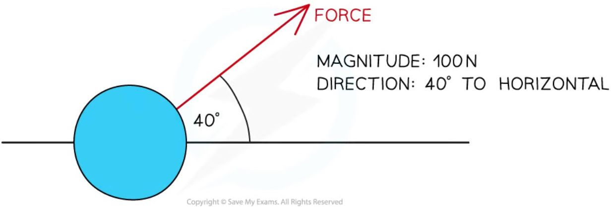

*A force of magnitude 100 N directed 40° from the horizontal*

### Resultant force

A **resultant force** is a single force that describes all of the forces operating on a body. When multiple forces act on one object, the forces can be combined to produce one net force that describes the **combined action** of all of the forces. This single resultant force determines the **direction** in which the object will move as a result of all of the forces, and the **magnitude** of the net force experienced by the object.

Resultant forces can be calculated by adding all of the forces acting on the object: forces working in opposite directions are **subtracted** from each other, and forces working in the same direction are **added** together. If the forces acting in opposite directions are equal in size, then there will be no resultant force — the forces are said to be **balanced**.

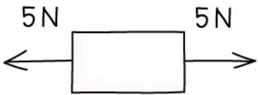

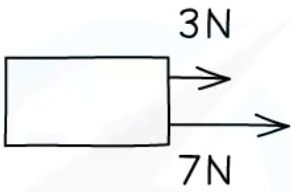

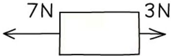

**Diagram showing the resultant forces on three different objects**

Imagine the forces on the boxes as two people pushing on either side: in the first scenario, the two people are evenly matched, so the box **doesn't move**; in the second scenario, the two people are pushing on the same side of the box, so it moves to the right with their combined strength; in the third scenario, the two people are pushing against each other and are not evenly matched, so there is a **resultant force to the left**.

!!! example "Worked Example (calculation)"

    Calculate the magnitude and direction of the resultant force in the diagram below.

    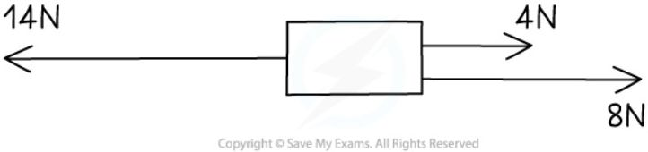

    ??? success "Answer:"

        **Step 1: Add up all of the forces directed to the right**

        $$ 4\text{ N} + 8\text{ N} = 12\text{ N} $$

        **Step 2: Subtract the forces on the right from the forces on the left**

        $$ 14\text{ N} - 12\text{ N} = 2\text{ N} $$

        **Step 3: Evaluate the direction of the resultant force**

        The force to the left is **greater** than the force to the right, therefore the resultant force is directed to the left.

        **Step 4: State the magnitude and direction of the resultant force**

        The resultant force is 2 N to the left.

!!! tip "Examiner Tips and Tricks"

    When calculating resultant forces, always remember to provide **units** for your answer and to state whether the force is to the left, to the right, or maybe up or down. Always provide your final answer as a description of the **magnitude** and the **direction**, for example: resultant force = **4 N to the right**.

When the forces acting on an object completely cancel out (the **resultant** force is **zero**), the forces are said to be **balanced**: the forces have combined in such a way that they cancel each other out and no **resultant force** acts on the body. For example, the **weight** of a book on a desk is balanced by the **normal** force of the desk, so no **resultant force** is experienced by the book — the book and the table are **equal** and **balanced**.

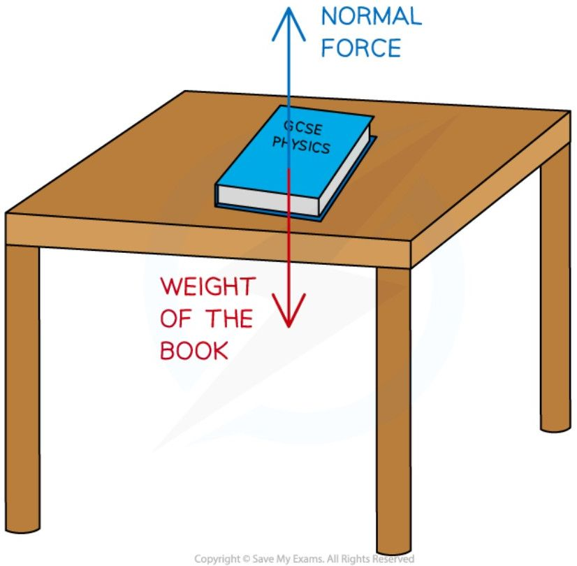

*A book resting on a table is an example of balanced forces*

When the forces acting on an object do not completely cancel out, there is a **non-zero resultant force**, and the forces are said to be **unbalanced**. For example, imagine two people playing a game of tug-of-war, working against each other on opposite sides of the rope: if person **A** pulls with 80 N to the left and person **B** pulls with 100 N to the right, these forces do not cancel each other out completely. Since person **B** pulled with more force than person **A**, the forces will be unbalanced and the rope will experience a resultant force of 20 N to the right.

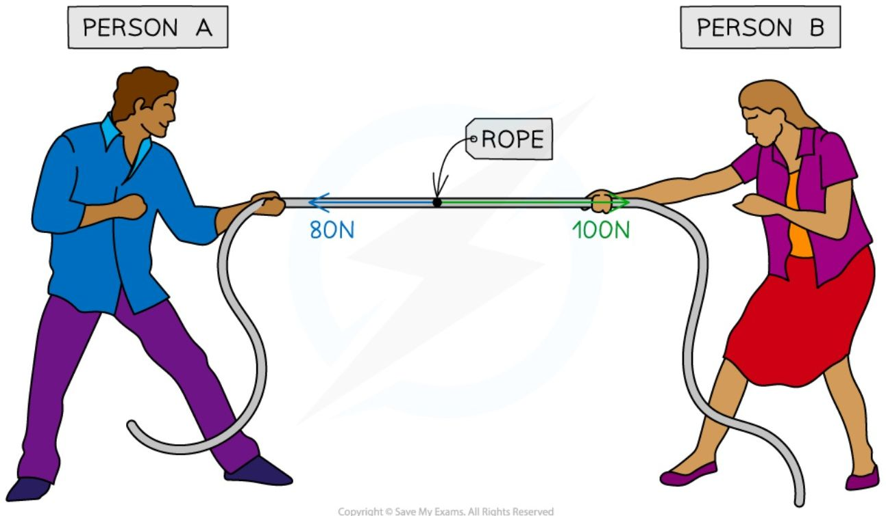

*A tug-of-war is an example of when forces can become unbalanced*

## Newton's second law

When forces combine on an object in such a way that they do not cancel out, there is a **resultant force** on the object. This resultant force causes the object to **accelerate** (i.e. change its **velocity**) — the object might **speed up**, **slow down**, or **change direction**.

!!! note "Required formulae: Newton's second law"
    $$F = m \times a$$

    Where $F$ = resultant force, measured in newtons (N); $m$ = mass, measured in kilograms (kg); and $a$ = acceleration, measured in metres per second squared (m/s<sup>2</sup>).

!!! example "Worked Example (calculation)"

    A car salesperson claims that their best car has a mass of 900 kg and can accelerate from 0 to 27 m/s in 3 seconds.

    Calculate:

    (a) The acceleration of the car in the first 3 seconds.

    (b) The force required to produce this acceleration.

    ??? success "Answer:"

        **Part (a)**

        **Step 1: List the known quantities**

        * Initial velocity = 0 m/s

        * Final velocity = 27 m/s

        * Time, $t = 3\text{ s}$

        **Step 2: State the equation for acceleration**

        $$ a = \frac{(v - u)}{t} $$

        **Step 3: Calculate the acceleration**

        $$ a = \frac{(27 - 0)}{3} $$

        $$ a = 9\text{ m/s}^2 $$

        **Part (b)**

        **Step 1: List the known quantities**

        * Mass of the car, $m = 900\text{ kg}$

        * Acceleration, $a = 9\text{ m/s}^2$

        **Step 2: Identify which law of motion to apply**

        The question involves quantities of **force**, **mass** and **acceleration**, so Newton's second law is required:

        $$ F = ma $$

        **Step 3: Calculate the force required to accelerate the car**

        $$ F = 900 \times 9 $$

        $$ F = 8100\text{ N} $$

!!! example "Worked Example (calculation)"

    A passenger of mass 70 kg travels in a car at a speed of 20 m/s. The vehicle is involved in a collision, which brings the car (and the passenger) to a halt in 0.1 seconds.

    Calculate:

    (a) The deceleration of the car (and the passenger).

    (b) The decelerating force on the passenger.

    ??? success "Answer:"

        **Part (a)**

        **Step 1: List the known quantities**

        * Initial velocity, $u = 20 \text{ m/s}$

        * Final velocity, $v = 0 \text{ m/s}$

        * Time, $t = 0.1 \text{ s}$

        **Step 2: Write out the equation for acceleration**

        $$a = \frac{(v - u)}{t}$$

        **Step 3: Calculate the deceleration of the car (and the passenger)**

        $$a = \frac{(0 - 20)}{0.1}$$

        $$a = \frac{-20}{0.1}$$

        $$a = -200 \text{ m/s}^2$$

        **Part (b)**

        **Step 1: List the known quantities**

        * Mass of the passenger, $m = 70 \text{ kg}$

        * Acceleration (deceleration, in this case), $a = -200 \text{ m/s}^2$

        **Step 2: State the relationship between resultant force, mass and acceleration**

        This question involves quantities of force, mass and acceleration, so the appropriate equation for this case is:

        $$F = ma$$

        **Step 3: Calculate the decelerating force**

        $$F = 70 \times (-200)$$

        $$F = -14\ 000 \text{ N}$$

!!! tip "Examiner Tips and Tricks"

    Remember that the resultant **force** is a **vector** quantity. Examiners may ask you to comment on **why** its value is negative — this happens when the resultant force acts in the **opposite direction** to the object's motion. In the worked example above, the resultant force **opposes** the passenger's motion, slowing them down (**decelerating** them) to a halt, this is why it has a minus symbol.
