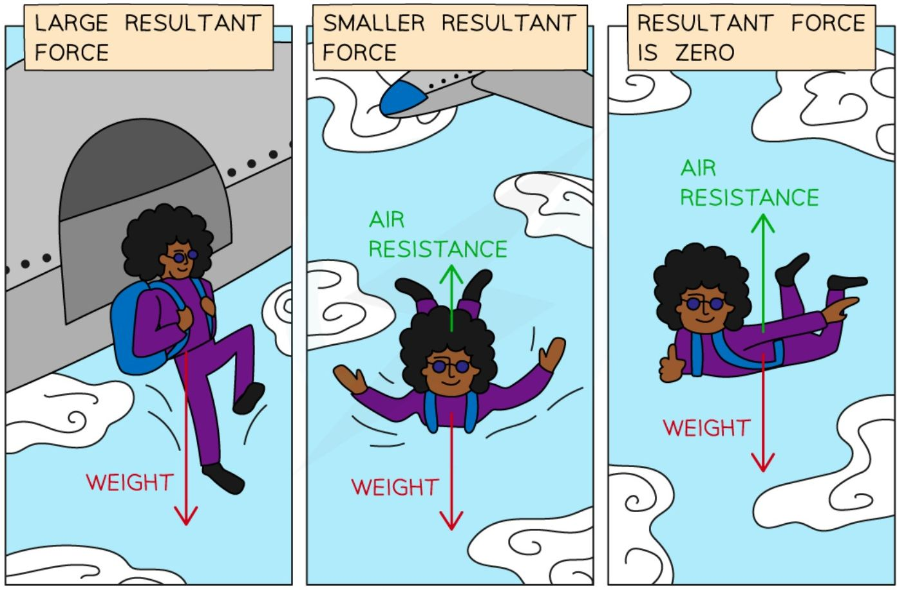

# Explaining motion

## Newton's laws of motion

TODO

## Forces

* A **force** is a **push** or **pull** that arises from the **interaction** between objects

* There are lots of different types of forces that occur when objects interact

### Forces acting at a distance

#### Gravitational force (weight)

    - There is a **gravitational force** of attraction between all objects with mass

    - The more massive the object, the greater the gravitational force exerted by it

    - When a football is thrown (or kicked), the gravitational pull of the Earth on the football pulls it toward the (centre of the) Earth


* Weight is defined as:

**The force experienced by an object with mass when placed in a gravitational field**

##### Weight and mass

* **Weight** and **mass** are **different** in physics

* **Mass** is a measure of how much **matter** there is in an object

    * Mass has **magnitude** but not direction

    * Therefore, mass is a **scalar** quantity

* **Weight** is a force

    * Forces have **magnitude and direction**

    * Therefore, weight is a **vector** quantity

##### Gravitational field strength

* Planets have strong gravitational fields

    * Hence, they attract nearby masses with a strong gravitational force

* Different planets have different gravitational field strengths

    * This depends on the mass of the planet

    * More massive planets have stronger gravitational fields

##### Weight, mass and gravitational field strength

* Because of weight:

    * Objects stay firmly on the ground

    * Objects will always fall to the ground

    * Satellites are kept in orbit


**Some of the phenomena associated with gravitational attraction and the weight force**

* Weight, mass and gravitational field strength are related using the equation:

$$W = mg$$

* Where:

    - **$W$** = weight, measured in newtons (N)

    - **$m$** = mass, measured in kilograms (kg)

    - **$g$** = gravitational field strength, measured in newtons per kilogram (N/kg)

* The **gravitational field strength** on Earth is **10 N/kg**

* **$g$** is also used to describe the acceleration of an object in freefall in a gravitational field

    - The **acceleration of freefall** on Earth is **10 m/s<sup>2</sup>**

    - These quantities are two ways of describing the thing

* The weight that an object experiences depends on:

    - The **object's** mass

    - The mass of the **planet** attracting it

* The mass of an object and the weight acting on it are **directly proportional**

    - If one doubles, the other also doubles

    - If one is halved, the other is also halved

* The **magnitude** of the weight force depends on the **gravitational field strength**


!!! example "Worked Example"

    NASA's Artemis mission aims to send the first woman astronaut to the Moon. Isabelle hopes to one day become an astronaut. She has a mass of 40 kg.

    Earth's gravitational field strength is 10 N/kg, and the Moon's gravitational field strength is 2 N/kg.

    Discuss the difference between Isabelle's weight on Earth, and her weight on the Moon.

    ??? note "Answer:"

        **Step 1: State the equation linking weight and mass**

        * The equation linking weight and mass is:

        $$W = m \times g$$

        **Step 2: List the known values**

        * Earth's gravitational field strength, $g = 10\text{ N/kg}$

        * The Moon's gravitational field strength, $g = 2\text{ N/kg}$

        * Mass, $m = 40\text{ kg}$

        **Step 3: Calculate Isabelle's weight on Earth**

        * Substituting the values of mass and Earth's gravitational field strength into the equation gives:

        $$W = 40 \times 10 = 400\text{ N}$$

        **Step 4: Calculate Isabelle's weight on the Moon**

        * Substituting the values of mass and the Moon's gravitational field strength into the equation gives:

        $$W = 40 \times 2 = 80\text{ N}$$

        **Step 5: Discuss the two values of weight**

        * Isabelle's weight is **greater** on Earth than on the Moon

        * This is because the Earth has a **larger** gravitational field strength than the Moon, so Isabelle's weight force (the force of gravity pulling down on her) is larger on Earth than on the Moon

!!! tip "Examiner Tips and Tricks"

    It is a common misconception that mass and weight are the same, but they are in fact **very different**

    * Since weight is a **force** - it is a **vector** quantity

    * Since mass is an **amount** - it is a **scalar** quantity

    You do not need to remember the value of $g$ on Earth; it will be given to you in the exam.


#### Electrostatic force

    * There is an **electrostatic** force between two objects with **charge**

    * **Like charges repel** one another, and **opposite charges attract** one another

    * When an electron gets close to a positively charged ion, the ion exerts a pull force on the electron (**attraction**)

    * When an electron gets close to another electron, the electrons experience a push force from one another (**repulsion**)

**Electrostatic forces acting on charged particles**


*Like charges experience a repulsive push force and opposite charges experience an attractive pull force*

#### Magnetic force

    * There is a **magnetic** force between objects with **magnetic poles**

* **Like poles repel** one another, **opposite poles attract** one another
* When a north pole gets close to a south pole, they experience a pull force from one another (**attraction**)
* When a north pole gets close to a north pole, they experience a push force from one another (**repulsion**)

**Magnetic forces acting on magnets**

```mermaid
graph LR
    subgraph Opposites_Attract
    N1[N] --- f1( ) --> f2( ) --- S1[S]
    end
    subgraph Like_Poles_Repel_1
    N2[N] --- f3( ) <-- f4( ) --- N3[N]
    end
    subgraph Like_Poles_Repel_2
    S2[S] --- f5( ) <-- f6( ) --- S3[S]
    end
```
*Opposite poles experience an attractive pull force, and like poles experience a repulsive push force*

#### Nuclear forces

TODO

### Contact forces

#### Reaction force

    - When an object rests on a surface, the **surface** exerts a push force on the **object**

    - This **reaction force** acts at **right angles** (perpendicular) to the surface

    - When a football rests on the horizontal surface of the grass, the grass exerts a push force (reaction force) vertically upwards on the football

**Reaction force acting on a football**


*The push force exerted on an object by a surface is called the reaction force*

#### Friction

* Frictional forces always **oppose** the **motion** of an object, causing it to **slow down**

* Friction occurs when two (or more) surfaces rub against each other

    - At a molecular level, both surfaces contain **imperfections** - i.e. they are not perfectly smooth

    - These imperfections tend to push against each other

**Friction acting between the surface of a sledge and the surface of the snow**


*Friction is a force which opposes an object's motion, acting in the opposite direction to the motion of the object*

!!! tip "Examiner Tips and Tricks"

    Remember from the revision note [Types of Forces](https://www.savemyexams.com/igcse/physics/edexcel/19/revision-notes/1-forces-and-motion/1-2-forces-movement-and-changing-shape/1-2-1-types-of-forces/) that drag force is a type of friction that acts to oppose the motion of objects moving through a fluid (a liquid or a gas).

    Air resistance is a type of drag force, and therefore a type of friction, that acts to oppose the motion of objects moving through air.

#### Tension
    * Tension occurs in an object (like a rope or spring) that is **stretched**
    * When a **pull** force is exerted on **each end** of an object, **tension** acts across the length of the object
    * When two people pull a rope in opposite directions, tension acts along the rope and pulls back on each person

**Tension force in a rope**


*Two people exert a pull force on the rope from each end, creating tension in the rope*

#### Upthrust

    * When an object is fully or partially **submerged** in a **fluid**, the fluid exerts an **upward-acting** push force on the object

* A boat floats on a lake due to the **upthrust** exerted by the water on the boat

* A ball held underwater will shoot upwards when released due to the upthrust exerted by the water pushing it back to the surface

**Upthrust acting on a boat**


*The water pushes up on the boat, this is the force of upthrust*

#### Drag force

    * Drag force is a type of **frictional force** that occurs when an object moves through a **fluid** (a gas or a liquid)


    * The particles in the fluid **collide** with the object moving through it and **slow** its motion

    * When a pebble is thrown into water, the water molecules flow against its solid surface, causing it to slow down

#### Air resistance

    * Air resistance is a specific type of **drag** force and is therefore also a **frictional** force

    * Air resistance occurs when particles of air **collide** with an object moving through it and **slows** its **motion**

    * When a skydiver opens their parachute, air resistance opposes their motion and reduces their speed so it is safe to land

**Air resistance acting on a skydiver**


*A skydiver uses air resistance to reduce their speed so that they can land safely*

#### Thrust

    * Thrust is a force produced by an engine that **speeds up** the motion of an object

    * The engine of a car exerts a thrust force and increases its speed

#### Lift

TODO

#### General comments
!!! tip "Examiner Tips and Tricks"

    The force of gravitational attraction on an object is called its **weight**. Remember not to refer to this force as simply 'gravity', as this term can mean several different things, and examiners will probably mark it as wrong.

    Similarly, when referring to **air resistance**, avoid using terms like 'wind resistance' (there is no such thing!) or 'air pressure', which is a different concept. **Drag** is an acceptable alternative to the force of air resistance because air resistance is a special type of drag.


## Effects of forces

* When a force acts on an object, the force can affect the object in a variety of ways

* The object could:

    - change **speed**

    - change **direction**

    - change **shape**

* The effects of forces on an object often depend on the type of force acting

    - The push force (**thrust**) of an engine can cause a car to speed up, whilst the force exerted by the brakes (**friction**) can cause it to slow down

    - The gravitational pull of the Sun on a comet causes the comet to change direction

    - When two opposing forces push on each end of a spring, the spring changes shape (it **compresses**)

**The effects of different forces on objects**

<table>
  <thead>
    <tr>
        <th>THRUST</th>
        <th>GRAVITATIONAL ATTRACTION</th>
        <th>SQUASHING (OR STRETCHING)</th>
    </tr>
  </thead>
  <tbody>
    <tr>
        <td>THE THRUST OF AN ENGINE CAN CHANGE A CAR'S SPEED</td>
        <td>THE GRAVITATIONAL ATTRACTION OF THE SUN CAN CHANGE THE DIRECTION OF A COMET</td>
        <td>SQUASHING (OR STRETCHING) A SPRING CAN CHANGE ITS SHAPE</td>
    </tr>
  </tbody>
</table>

*Forces can change the speed or direction of motion of an object, or even change its shape*

## Combining forces

### Adding vectors

* Force is a **vector** quantity because force has **magnitude and direction**

* When using arrows to represent forces:

    * the **length** of the arrow represents the **magnitude** of the force

    * the **direction** of the arrow indicates the **direction** of the force

    * the **scale** of the arrows should be **proportional** to the relative magnitudes of the forces

        * an arrow for a 4 N force should be twice as long as an arrow for a 2 N force

    * the arrows should be labelled with the names of the forces, or a description of the forces

        * for example, weight, W, or the gravitational pull of the Earth on the object

**Two forces acting on an object**

<table>
  <thead>
    <tr>
        <th>Force</th>
        <th>Details</th>
    </tr>
  </thead>
  <tbody>
    <tr>
        <td>FORCE A</td>
        <td>MAGNITUDE: 2 N<br/>DIRECTION: DOWNWARD</td>
    </tr>
    <tr>
        <td>FORCE B</td>
        <td>MAGNITUDE: 5 N<br/>DIRECTION: TO THE RIGHT</td>
    </tr>
  </tbody>
</table>

*The length of the arrows are proportional to the magnitude of the forces, and show the direction that forces act in*

* Not all forces are directed perfectly horizontally or vertically and so need to have an angle described for the direction

    - It is useful to describe an angle with respect to the vertical or the horizontal

**A force acting at an angle**


*A force of magnitude 100 N directed 40° from the horizontal*

### Resultant force

* A **resultant force** is a single force that describes all of the forces operating on a body

* When multiple forces act on one object, the forces can be combined to produce one net force that describes the **combined action** of all of the forces

* This single resultant force determines:

    * The **direction** in which the object will move as a result of all of the forces

    * The **magnitude** of the net force experienced by the object

* Resultant forces can be calculated by adding all of the forces acting on the object

    * Forces working in opposite directions are **subtracted** from each other

    * Forces working in the same direction are **added** together

* If the forces acting in opposite directions are equal in size, then there will be no resultant force – the forces are said to be **balanced**


**Diagram showing the resultant forces on three different objects**

* Imagine the forces on the boxes as two people pushing on either side

    * In the first scenario, the two people are evenly matched - the box **doesn't move**

    * In the second scenario, the two people are pushing on the same side of the box, it moves to the right with their combined strength

    * In the third scenario, the two people are pushing against each other and are not evenly matched, so there is a **resultant force to the left**

!!! example "Worked Example"

    Calculate the magnitude and direction of the resultant force in the diagram below.

    

??? Answer:

    **Step 1: Add up all of the forces directed to the right**

    $$ 4\text{ N} + 8\text{ N} = 12\text{ N} $$

    **Step 2: Subtract the forces on the right from the forces on the left**

    $$ 14\text{ N} - 12\text{ N} = 2\text{ N} $$

    **Step 3: Evaluate the direction of the resultant force**

    * The force to the left is **greater** than the force to the right therefore the resultant force is directed to the left

    **Step 4: State the magnitude and direction of the resultant force**

    * The resultant force is 2 N to the left

!!! tip "Examiner Tips and Tricks"

    When calculating resultant forces, always remember to provide **units** for your answer and to state whether the force is to the left, to the right, or maybe up or down. Always provide your final answer as a description of the **magnitude** and the **direction**, for example:

    * Resultant Force = **4 N to the right**


* When the forces acting on an object completely cancel out (the **resultant** force is **zero**) the forces are said to be **balanced**

* When the forces acting on an object do not completely cancel out (there is a **non-zero** **resultant** force)

* **Balanced** forces mean that the forces have combined in such a way that they cancel each other out and no **resultant force** acts on the body

    * For example, the **weight** of a book on a desk is balanced by the **normal** force of the desk

    * As a result, **no resultant force** is experienced by the book, the book and the table are **equal** and **balanced**


*A book resting on a table is an example of balanced forces*

* **Unbalanced forces** mean that the forces have combined in such a way that they do not cancel out completely and there is a **resultant force** on the object

    * For example, imagine two people playing a game of tug-of-war, working against each other on opposite sides of the rope

    * If person **A** pulls with 80 N to the left and person **B** pulls with 100 N to the right, these forces do not cancel each other out completely

    * Since person **B** pulled with more force than person **A** the forces will be unbalanced and the rope will experience a resultant force of 20 N to the right


*A tug-of-war is an example of when forces can become unbalanced*

## Newton's second law

* When forces combine on an object in such a way that they do not cancel out, there is a **resultant force** on the object

* This resultant force causes the object to **accelerate** (i.e. change its **velocity**)

    * The object might **speed up**

    * The object might **slow down**

    * The object might **change direction**

* The relationship between resultant force, mass and acceleration is given by the equation:

$$F = m \times a$$

* Where:

    * $F$ = resultant force, measured in newtons (N)

    * $m$ = mass, measured in kilograms (kg)

    * $a$ = acceleration, measured in metres per second squared (m/s<sup>2</sup>)

* This equation is also known as Newton's second law of motion


!!! example "Worked Example"

    A car salesperson claims that their best car has a mass of 900 kg and can accelerate from 0 to 27 m/s in 3 seconds.

    Calculate:

    a) The acceleration of the car in the first 3 seconds.

    b) The force required to produce this acceleration.

    ??? note "Answer:"

        **Part (a)**

        **Step 1: List the known quantities**

        * Initial velocity = 0 m/s

        * Final velocity = 27 m/s

        * Time, $t = 3\text{ s}$

        **Step 2: State the equation for acceleration**

        $$ a = \frac{(v - u)}{t} $$

        **Step 3: Calculate the acceleration**

        $$ a = \frac{(27 - 0)}{3} $$

        $$ a = 9\text{ m/s}^2 $$

        **Part (b)**

        **Step 1: List the known quantities**

        * Mass of the car, $m = 900\text{ kg}$

        * Acceleration, $a = 9\text{ m/s}^2$

        **Step 2: Identify which law of motion to apply**

        * The question involves quantities of **force**, **mass** and **acceleration**, so Newton's second law is required:

        $$ F = ma $$

        **Step 3: Calculate the force required to accelerate the car**

        $$ F = 900 \times 9 $$

        $$ F = 8100\text{ N} $$

!!! example "Worked Example"

    A passenger of mass 70 kg travels in a car at a speed of 20 m/s. The vehicle is involved in a collision, which brings the car (and the passenger) to a halt in 0.1 seconds.

    Calculate:

    a) The deceleration of the car (and the passenger).

    b) The decelerating force on the passenger.

    ??? note "Answer:"

        **Part (a)**

        **Step 1: List the known quantities**

        * Initial velocity, $u = 20 \text{ m/s}$

        * Final velocity, $v = 0 \text{ m/s}$

        * Time, $t = 0.1 \text{ s}$

        **Step 2: Write out the equation for acceleration**

        $$a = \frac{(v - u)}{t}$$

        **Step 3: Calculate the deceleration of the car (and the passenger):**

        $$a = \frac{(0 - 20)}{0.1}$$

        $$a = \frac{-20}{0.1}$$

        $$a = -200 \text{ m/s}^2$$

        **Part (b)**

        **Step 1: List the known quantities**

        * Mass of the passenger, $m = 70 \text{ kg}$

        * Acceleration (deceleration, in this case), $a = -200 \text{ m/s}^2$

        **Step 2: State the relationship between resultant force, mass and acceleration**

        * This question involves quantities of force, mass and acceleration, so the appropriate equation for this case is:

        $$F = ma$$

        **Step 3: Calculate the decelerating force**

        $$F = 70 \times (-200)$$

        $$F = -14\ 000 \text{ N}$$


!!! tip "Examiner Tips and Tricks"

    Remember that the resultant **force** is a **vector** quantity. Examiners may ask you to comment on **why** its value is negative – this happens when the resultant force acts in the **opposite direction** to the object's motion. In the worked example above, the resultant force **opposes** the passenger's motion, slowing them down (**decelerating** them) to a halt, this is why it has a minus symbol.

## Application 1: Stopping distance

* The **stopping distance** of a car is defined as:

> The stopping distance of a car is the total distance travelled during the time it takes to stop in an emergency

* The stopping distance is the sum of the distance travelled as the driver makes the decision to stop plus the distance travelled as the driver applies the brakes

### Stopping distance formula

* The stopping distance is calculated using the following formula:

Stopping distance = Thinking distance + Braking distance

#### Thinking distance

* **Thinking distance** is defined as

> Thinking distance is the distance travelled in the time it takes the driver to react to an emergency and prepare to stop

* The **main factors** affecting thinking distance are:

    * The **speed** of the car

    * The **reaction time** of the driver

* The **reaction time** is defined as:

> A measure of how much time passes between seeing something and reacting to it

* The average reaction time of a human is 0.25 s

* Reaction time is increased by:

    * **Tiredness**

    * **Distractions** (e.g. using a mobile phone)

    * **Intoxication** (i.e. consumption of **alcohol** or **drugs**)

#### Braking distance

* **Braking distance** is defined as

> the distance travelled under the braking force in metres (m)

* For a given braking force, the **greater the speed** of the vehicle, the **greater the stopping distance**

#### Calculating stopping distance

* For a given braking force, the **speed** of a vehicle determines the size of the **stopping distance**


* The **greater the speed** of the vehicle, the **larger the stopping distance**

**The Effect of speed on stopping distance**

<table>
  <thead>
    <tr>
        <th colspan="4">AVERAGE CAR LENGTH = 4 METRES (13 FEET)</th>
    </tr>
    <tr>
        <th>Speed</th>
        <th>Thinking Distance</th>
        <th>Braking Distance</th>
        <th>Total Stopping Distance</th>
    </tr>
  </thead>
  <tbody>
    <tr>
        <td>20 mph (32 km/h)</td>
        <td>6m</td>
        <td>6m</td>
        <td>= 12 METRES (40 FEET) OR THREE CAR LENGTHS</td>
    </tr>
    <tr>
        <td>30 mph (48 km/h)</td>
        <td>9m</td>
        <td>14m</td>
        <td>= 23 METRES (75 FEET) OR SIX CAR LENGTHS</td>
    </tr>
    <tr>
        <td>40 mph (64 km/h)</td>
        <td>12m</td>
        <td>24m</td>
        <td>= 36 METRES (118 FEET) OR NINE CAR LENGTHS</td>
    </tr>
    <tr>
        <td>50 mph (80 km/h)</td>
        <td>15m</td>
        <td>38m</td>
        <td>= 53 METRES (175 FEET) OR THIRTEEN CAR LENGTHS</td>
    </tr>
    <tr>
        <td>60 mph (96 km/h)</td>
        <td>18m</td>
        <td>55m</td>
        <td>= 73 METRES (240 FEET) OR EIGHTEEN CAR LENGTHS</td>
    </tr>
    <tr>
        <td>70 mph (112 km/h)</td>
        <td>21m</td>
        <td>75m</td>
        <td>= 96 METRES (315 FEET) OR TWENTY-FOUR CAR LENGTHS</td>
    </tr>
  </tbody>
</table>

*A vehicle's stopping distance increases with speed. At a speed of 20 mph the stopping distance is 12 m, whereas at 60 mph the stopping distance is 73 m (reproduced from the UK Highway Code)*

**A Table Showing Speed and Stopping Distance**

<table>
  <thead>
    <tr>
        <th>Speed (mph)</th>
        <th>Speed (m/s)</th>
        <th>Stopping Distances (m)</th>
    </tr>
  </thead>
  <tbody>
    <tr>
        <td>20</td>
        <td>9</td>
        <td>12</td>
    </tr>
    <tr>
        <td>30</td>
        <td>14</td>
        <td>23</td>
    </tr>
    <tr>
        <td>40</td>
        <td>18</td>
        <td>36</td>
    </tr>
    <tr>
        <td>50</td>
        <td>22</td>
        <td>53</td>
    </tr>
    <tr>
        <td>60</td>
        <td>27</td>
        <td>73</td>
    </tr>
  </tbody>
</table>

!!! example "Worked Example"

    At a speed of 20 m/s, a particular vehicle had a stopping distance of 40 metres. The car travelled 14 metres whilst the driver was reacting to the incident in front of him. What was the braking distance?

    **A** 54 m

    **B** 34 m

    **C** 26 m

    **D** 6 m

    !!! note "Answer:"
        
        C

        ## Step 1: Identify the different variables

        * Stopping distance = 40 m

        * Thinking distance = 14 m

        ## Step 2: Rearrange the formula for stopping distance

        Stopping distance = Thinking distance + Braking distance

        Braking distance = Stopping distance – Thinking distance

        ## Step 3: Calculate and identify the correct braking distance

        Braking distance = 40 – 14

        Braking distance = 26 metres

        * Therefore, the answer is **C**

### Factors affecting stopping distance

* There are various factors which can affect a vehicle's stopping distance

- **Vehicle speed**

    * The greater the speed, the greater the vehicle's braking distance will be

    * This is because the brakes will need to do more work to bring the vehicle to a stop

- **Vehicle mass**

    * The more massive the vehicle, the more distance it will travel as it comes to a stop

- **Road conditions**

    * Wet or icy roads make the brakes less effective and the vehicle travels further as it comes to a stop

- **Driver reaction time**

* Thinking distance is increased if the driver is distracted, for example by a phone, satnav, radio or a person

* Thinking distance is increased if the driver is tired, on certain types of medication, or is under the influence of alcohol or drugs


## Application 2: Terminal velocity

* Terminal velocity is the fastest speed that an object can reach when falling

* Terminal velocity is reached when the upward and downward acting forces are **balanced**

    - The **resultant force** on the object reaches **zero**

    - The object no longer accelerates and a **constant** terminal **velocity** is reached

### Falling objects

* Falling objects experience **two forces**:

    - **Weight**

    - **Air resistance**

* The force of air resistance **increases** as the object's **speed** increases

* This is because the object collides with air particles as it moves through the air

    - The faster the object is travelling, the more collisions it has with the air particles

* The weight of the object does not change

* This is because $$W = mg$$

    - The mass, $$m$$, of the object does not change

    - The acceleration of freefall, $$g$$, does not change

### Reaching terminal velocity

**Skydiver in freefall reaching terminal velocity**



*The skydiver initially accelerates downward due to the force of weight. The upward force of air resistance increases as they fall until eventually it equals the weight force and terminal velocity is reached*

* At the **instant** the skydiver steps out of the plane, the support force of the plane is no longer acting on the skydiver, but they are not yet falling, so the only force exerted them is the **weight** force

    * There is a downward acting **resultant force** on the skydiver

    * The resultant force is equal to the weight force

    * The skydiver accelerates downward at **maximum acceleration**

* As the skydiver begins to **fall**, the force of air resistance is very **small** because the skydiver's speed is small

    * There is a downward acting **resultant force** on the skydiver

    * The resultant force is equal to the weight force **minus** the force of air resistance

    * The skydiver accelerates downward but the **acceleration decreases**

* As the skydiver **accelerates**, their speed increases, so the force of **air resistance increases**

    * There is a downward acting **resultant force** on the skydiver

    * The resultant force is equal to the weight force minus the force of air resistance

    * The skydiver accelerates downward but the **acceleration continues to decrease**

* As the skydiver's **acceleration decreases**, their speed increases at a slower and slower rate

    * Eventually, the skydiver reaches a speed at which the force of air resistance is **equal** to the force of weight

    * The forces are **balanced**, so the **resultant force is zero**

    * The skydiver no longer accelerates and a **constant velocity** is reached

        * This is **terminal velocity**


!!! example "Worked Example"

    A small object falls out of an aircraft. Choose words from the list to complete the sentences below:

    **Friction Gravity Air pressure**
    **Accelerates Falls at a steady speed Slows down**

    (a) The weight of an object is the force of [__________] which acts on it.

    (b) When something falls, initially it [____________].

    (c) The faster it falls, the larger the force of [______________] which acts on it.

    (d) Eventually it [______________] when the force of friction equals the force of gravity acting on it.

    ??? note "Answer (Part a):

        * The weight of an object is the force of **gravity** which acts on it.

            * The weight force is due to the Earth's gravitational pull on the object, so weight is due to gravity

    ??? note "Answer (Part b):

        * When something falls, initially it **accelerates**.

        * The **resultant force** on the object is **very large** initially, so it accelerates

        * This is because there is a **large unbalanced force** downwards (its weight) - the upward force of air resistance is very small to begin with

    ??? note "Answer (Part c):

        * The faster it falls, the larger the force of **friction** which acts on it.

        * The force of **air resistance** is due to **friction** between the object's motion and **collisions with air particles**

        * Air particles try to slow the object down, so air itself produces a **frictional force**, called air resistance (sometimes called **drag**)

    ??? note "Answer (Part d):

        * Eventually it **falls at a steady speed** when the force of friction equals the force of gravity acting on it.

        * When the upwards **air resistance** grows enough to **balance** the downwards **weight** force, the resultant force on the object is **zero**

        * This means the object isn't accelerating - rather, it is moving at a **steady** (terminal) speed

!!! tip "Examiner Tips and Tricks"

    The force of gravity on an object is called its **weight**. If you are asked to name this force, use this word: don't call it 'gravity', as this term could also mean gravitational field strength, and so might be marked wrong. Additionally, remember to identify **air resistance** as the upward force on a falling object. This force **gets larger** as the object speeds up, but the weight of the object stays constant. Don't confuse 'air resistance' with 'air pressure' as these are two different concepts!
