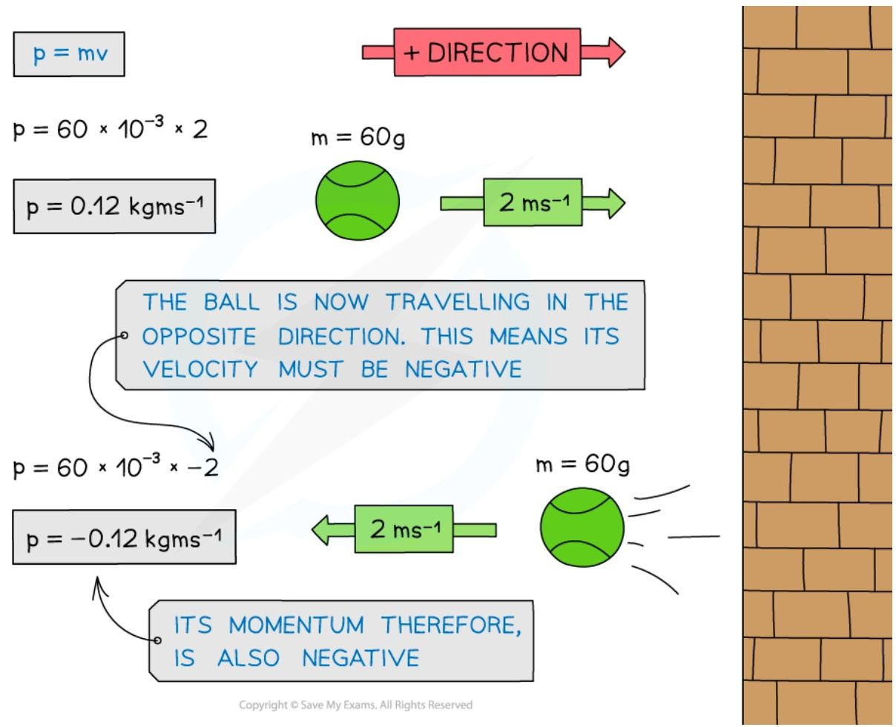
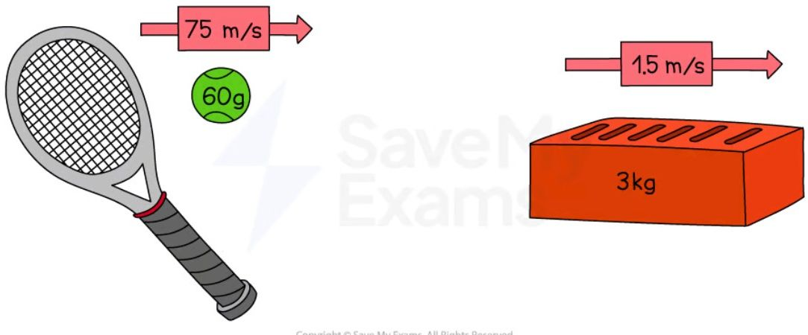
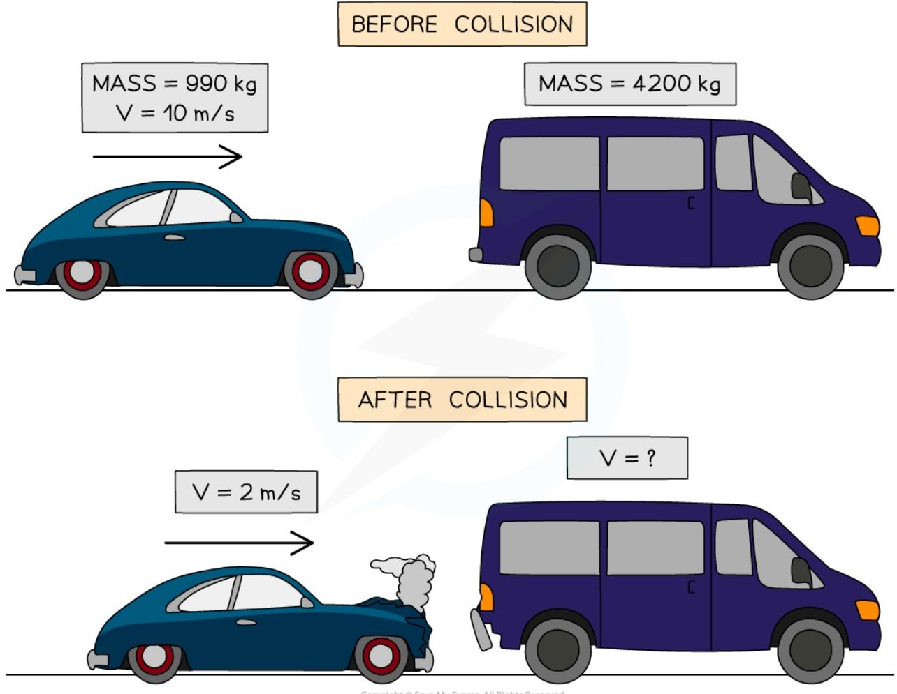
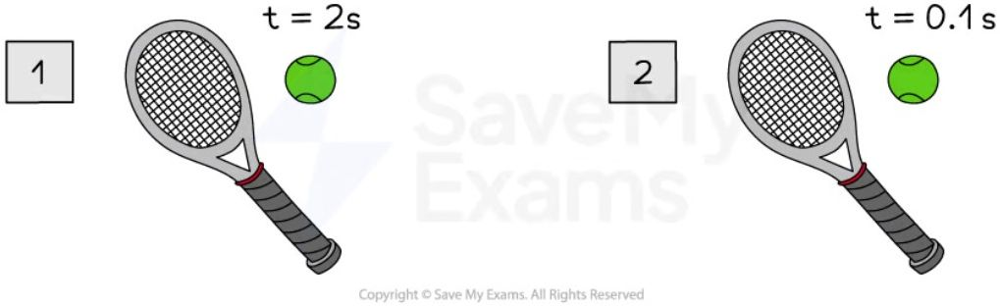
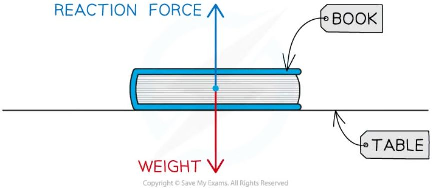
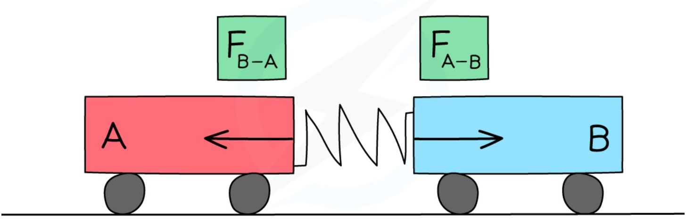
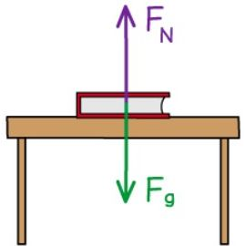
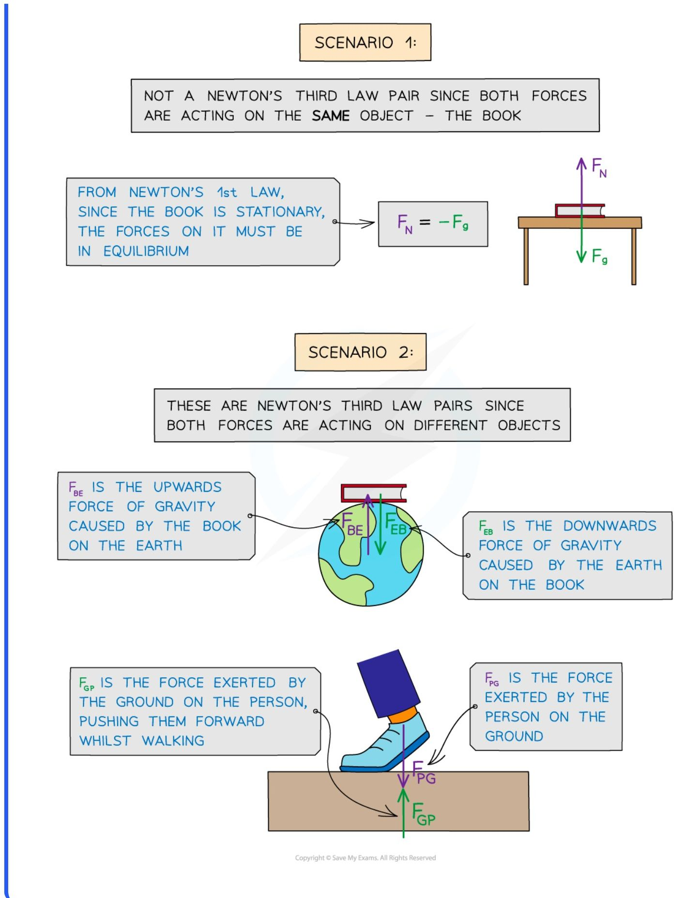
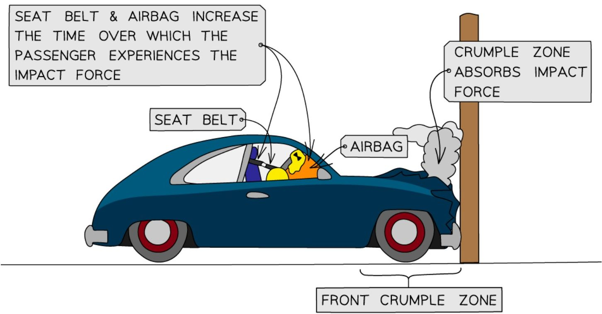

# Momentum

## Definition

* **Momentum** is a property that all moving objects have

* An object with **mass**, $m$, moving at a **velocity**, $v$, will have a momentum, $p$

* Momentum is the product of an objects mass and velocity $p = mv$

* Where:

    - $p$ = momentum in kilogram metre per second (kg m/s)

    - $m$ = mass in kilograms (kg)

    - $v$ = velocity in metres per second (m/s)

* This means that an object at rest (i.e. v = 0) has **no** momentum

* Momentum keeps an object moving in the same direction

    - It is difficult to change the direction of an object with a large momentum

* Velocity is a **vector** with both **magnitude** and **direction**

* Therefore, the momentum of an object depends on its **direction** of travel

    - This means momentum can be either **positive** or **negative**

* If an object travelling to the right has positive momentum, then an object travelling in the opposite direction (to the left) will have negative momentum

    - This isn't a solid rule, but in questions, usually the positive direction is to the right and negative to the left

** How does the momentum of a ball change after a collision?**

*The momentum of the tennis ball is positive as it approaches the wall and negative after the collision as it moves in the opposite direction*

* The momentum of an object will change if:

    - it's **velocity** increases or decreases (acceleration)

    - it's **direction** changes (acceleration)

    - it's **mass** changes

!!! example "Worked Example3

    Determine which object has the most momentum, the tennis ball or the brick.

    Explain your answer.

    

    ??? note "Answer:"

        **Step 1: Calculate the momentum of the tennis ball using the momentum equation**

        $$ p = mv $$

        $$ p = 0.06 \times 75 $$

        $$ p = 4.5 \text{ kg m/s} $$

        **Step 2: Calculate the momentum of the brick using the momentum equation**

        $$ p = mv $$

        $$ p = 3 \times 1.5 $$

        $$ p = 4.5 \text{ kg m/s} $$

        **Step 3: Explain your answer**

        * Both the tennis ball and the brick have the same momentum
        * Even though the brick has a much greater mass than the ball, the ball is travelling much faster than the brick
        * This means that on impact, they would both exert a similar force (depending on the time it takes for each to come to rest)

!!! tip "Examiner Tips and Tricks"

    Remember the units of momentum as **kg m/s** which is the product of the units of mass (kg) and velocity (m/s).

    Which direction is taken as positive is completely up to you in the exam. In general, forwards, to the right, and upwards are taken as positive, and backward, to the left, or down are taken as negative.

## The principle of conservation of momentum

* The principle of **conservation of momentum** states that:

> **The total momentum before an interaction is equal to the total momentum after an interaction, if no external forces are acting on the objects**

* In this context, an interaction can be either:

    - A **collision** i.e. where two objects collide with each other
    
    - An **explosion** i.e. where a stationary object explodes into two (or more) parts

## Collisions

* For a collision between two objects:

**The total momentum before a collision = the total momentum after a collision** 

* In the example below:

* Before the collision:

    * The momentum is only generated by mass *m* because it is the only moving object

    * If the right is taken as the positive direction, the total momentum of the system is **m × u**

* After the collision:

    * Mass *M* also now has momentum

    * The velocity of *m* is now -*v* (since it is now travelling to the left) and the velocity of *M* is *V*

    * The total momentum is now the momentum of *M* + the momentum of *m*

    * This is (*M* × *V*) + (*m* × -*v*) or **(*M* × *V*) – (*m* × *v*)** written more simply

**Conservation of momentum before and after a collision**

<table>
  <thead>
    <tr>
        <th>State</th>
        <th>Object m</th>
        <th>Object M</th>
        <th>Momentum</th>
    </tr>
  </thead>
  <tbody>
    <tr>
        <td>BEFORE</td>
        <td>Mass m, velocity u (right)</td>
        <td>Mass M, velocity 0</td>
        <td>MOMENTUM = m × u</td>
    </tr>
    <tr>
        <td>AFTER</td>
        <td>Mass m, velocity v (left)</td>
        <td>Mass M, velocity V (right)</td>
        <td>MOMENTUM = M × V – m × v</td>
    </tr>
  </tbody>
</table>

*The momentum of a system before and after a collision is always conserved*

* Since momentum is a **vector** quantity, a system of objects moving in opposite directions (e.g. towards each other) at the same speed will have an overall momentum of 0 since they will **cancel out**

    * Momentum is **always conserved** over time

!!! example "Worked Example"

    The diagram shows a car and a van, just before and after the car collides with the van, which is initially at rest.

    The car initially moves at a speed of 10 m/s, but this reduces to 2 m/s after the collision.

    

    The mass of the car is 990 kg and the mass of the van is 4200 kg.

    Calculate the velocity of the van when it is pushed forward by the collision.

    **Answer:**

    **Step 1: State the principle of the conservation of momentum**

    Total momentum before a collision = total momentum after a collision

    **Step 2: Calculate the total momentum of the car and van before the collision**

    Momentum: $$p = mv$$

    * Initial momentum of the car:

    $$p_{car} = 990 \times 10 = 9900\text{ kgm/s}$$

    * Initial momentum of the van:

    $$p_{van} = 0$$ (the van is at rest, so $$p = v = 0$$)

    * Total momentum before collision:

    $$p_{before} = p_{car} + p_{van}$$

    $$p_{before} = 9900 + 0 = 9900\text{ kg m/s}$$

    **Step 3: Calculate the total momentum of the car and van after the collision**

    * Final momentum of the car:

    $$p_{car} = 990 \times 2 = 1980\text{ kg m/s}$$

    * Final momentum of the van:

    $$p_{van} = 4200 \times v$$

    * Total momentum after collision:

    $$p_{after} = 1980 + 4200v$$

    **Step 4: Rearrange the conservation of momentum equation for the velocity of the van**

    $$p_{before} = p_{after}$$

    $$9900 = 1980 + 4200v$$

    $$9900 - 1980 = 4200v$$

    $$v = \frac{9900 - 1980}{4200}$$

    $$v = 1.9\text{ m/s}$$

!!! tip "Examiner Tips and Tricks"

    If it is not given in the question already, drawing a diagram of before and after helps keep track of all the masses and velocities (and directions) in the conservation of momentum questions.

    Remember that velocity is speed with a direction. The question asks for the speed, so you do not need to include the final speed in your answer.

## Forces and momentum

* When a force acts on an object that is moving, or able to move, the object will accelerate (or decelerate)

    * This causes a **change in momentum**

* The resultant force acting on an object is defined by the equation:

$$F = ma$$

* Momentum is calculated using the equation:

$$p = mv$$

* Change in momentum is given as:

$$\Delta p = mv - mu$$

* Combining these equations gives:

$$\text{force} = \frac{\text{change in momentum}}{\text{time}}$$

$$F = \frac{(mv - mu)}{t}$$

* Where:

    * $F$ = resultant force, measured in newtons (N)

    * $a$ = acceleration, measured in metres per second squared (m/s2)

    * $m$ = mass, measured in kilograms (kg)

    * $\Delta p$ = change in momentum, measured in kilogram metres per second (kg m/s)

    * $v$ = final velocity, measured in metres per second (m/s)

    * $u$ = initial velocity, measured in metres per second (m/s)

    * $t$ = time, measured in seconds (s)

* Remember to consider the **direction** of object's motion

    * If you take the initial direction as positive then the reverse direction is negative

* **Force** can also be described as the **rate of change of momentum** on a body

    * The **rate of change** describes how a variable changes with respect to time

* The shorter the time over which momentum changes, the bigger the force

* So, force and time are **inversely proportional** to each other

!!! tip "Examiner Tips and Tricks"

    When two quantities are inversely proportional, it means that as one increases, the other decreases by a proportional amount

    * If one is doubled, the other is halved

    * If one is decreased by a factor of 4, the other is increased by a factor of 4

!!! example "Worked Example"

    A tennis ball hits a racket twice, with a change in momentum of 0.5 kg m/s both times.

    During the first hit, the contact time is 2.0 s, and during the second hit, the contact time is 0.1 s.

    Determine which strike of the tennis racket experiences the greatest force from the tennis ball.

    

    ??? note "Answer:"

        **Step 1: List the known quantities**

        * Change in momentum each time, $\Delta p = 0.5 \text{ kg m/s}$

        * Contact time of first hit, $t_1 = 2.0 \text{ s}$

        * Contact time of second hit, $t_2 = 0.1 \text{ s}$

        **Step 1: Calculate the force during the first hit**

        $$F_1 = \frac{\Delta p}{t_1}$$

        $$F_1 = \frac{0.5}{2.0}$$

        $$ F_1 = 0.25\text{ N} $$

        **Step 2: Calculate the force during the second hit**

        $$ F_2 = \frac{\Delta p}{t_2} $$

        $$ F_2 = \frac{0.5}{0.1} $$

        $$ F_2 = 5.0\text{ N} $$

        **Step 3: State your answer**

        * The tennis racket experiences the greatest force from the ball during the **second hit**

!!! example "Worked Example"

    A car of mass 1500 kg hits a wall at an initial velocity of 15 m/s and rebounds with a velocity of 5 m/s. The car is in contact with the wall for 3 seconds.

    Calculate the average force experienced by the car and state the direction of the force.

    ??? note "Answer:"

        **Step 1: List the known quantities and assign direction**

        * Mass of car, $m = 1500\text{ kg}$

        * Initial velocity before collision, $u = 15\text{ m/s}$

        * Final velocity after collision, $v = -5\text{ m/s}$

        * Time of impact, $t = 3\text{ s}$

        **Step 2: Draw a diagram of the collision**

        * The diagram should include:

            - The velocity before and after the collision

            - The direction of motion before and after the collision

        <table>
        <thead>
            <tr>
                <th>State</th>
                <th>Velocity</th>
                <th>Direction</th>
            </tr>
        </thead>
        <tbody>
            <tr>
                <td>BEFORE</td>
                <td>15 ms⁻¹</td>
                <td>Right (towards wall)</td>
            </tr>
            <tr>
                <td>AFTER</td>
                <td>-5 ms⁻¹</td>
                <td>Left (away from wall)</td>
            </tr>
        </tbody>
        </table>

        * In momentum questions , a positive direction is always chosen

            * Here, right is chosen as the positive direction

            * This means final velocity, which is in the left direction, must be negative

        **Step 3: Write out the force and momentum equation**

        * Recall that force is change in momentum over time

        $$ F = \frac{\Delta p}{t} = \frac{p_f - p_i}{t} $$

        * Momentum is mass $\times$ velocity

            * Initial momentum is mass $\times$ initial velocity, $u$

            * Final momentum is mass $\times$ final velocity, $v$

        $$ p_f = mv \text{ and } p_i = mu $$

        $$ F = \frac{mv - mu}{t} $$

        **Step 4: Substitute in the known values to calculate force**

        $$ F = \frac{(1500 \times -5) - (1500 \times 15)}{3} $$

        $$ F = \frac{-7500 - 22\ 500}{3} $$

        $$ F = \frac{-30\ 000}{3} $$

        $$ F = -10\ 000\text{ N} $$

        * The minus sign means the direction of the force is to the left (or in the opposite direction to the car's initial motion)

## Newton's third law

* **Newton's third law** of motion describes the effects of the **forces** involved when **two different objects** interact with one another

* This is different to Newton's first and second laws, which describe the effects of forces acting on a **single object**

* **Newton's third law of motion** can be defined as follows:

> **Whenever two objects interact, the forces they exert on each other are equal in magnitude and opposite in direction**

* Newton's third law explains the forces that enable someone to walk

    - The **foot** and the **ground** are the **two objects interacting**

    - The **foot** exerts a push force on the **ground**

    - The **ground** exerts a push force on the **foot**

    - The forces are **equal** in **magnitude** and **opposite** in **direction**

**Newton's third law of motion applied to walking**

*The foot pushes the ground backwards, and the ground pushes the foot forwards. Newton's third law explains the forces that enable people to walk*

* Use the following **three rules** to help you identify a **third law pair**:

1. The two forces in a third law pair act on **different objects**

2. The two forces in a third law pair **always** are equal in size but act in opposite direction

3. The two forces are always the **same type**: weight, reaction force, etc.

* If you are struggling to name the force, just describe it as a push or pull force

!!! example "Worked Example"

    A physics textbook is at rest on a table. Student A draws a free body force diagram for the book and labels the forces acting on it as weight and reaction force.

    

    Student A says the diagram is an example of Newton's third law of motion. Student B disagrees with Student A.

    By referring to the vector diagram, state and explain who is correct.

    ??? "Answer:"

        **Step 1: Identify the forces and objects involved**

        * The gravitational pull of the Earth acts downwards on the book (weight) and the push force of the table acts upwards on the book (normal contact force)

        **Step 2: State Newton's third law of motion**

        * Whenever two objects interact, the forces they exert on each other are equal in magnitude and opposite in direction

        **Step 3: Check if the diagram satisfies the two conditions for identifying Newton's third law**

        * Newton's third law identifies pairs of equal and opposite forces, of the same type, acting on two different objects

        * In this example:

            - both forces are acting on the book

            - the forces acting on the book are different forces: normal contact force and weight

            - the image below shows how to apply Newton's third law correctly in this case, considering the pairs of forces acting:

        

        * The third law pairs in this scenario would be:

            - The gravitational pull of the Earth on the book (weight) and the gravitational pull of the book on the Earth (weight)

            - Both forces are the same type (weight)

            - Both forces are equal and opposite

        * The arrows in the vector diagram of the book on the table are equal and opposite which is where lots of students get confused

            - This is because the forces are balanced

            - But the forces are both acting on the book (one object)

            - Remember that Newton's third law describes **two different objects** interacting

        **Step 4: Conclude who is correct**

        * In this case, **Student B is correct**

            - The vector diagram in the question is an example of Newton's first law

            - In the vector diagram of the book on the table, both forces are acting on one object and the forces are not the same type

* According to **Newton's Third Law**:

* When two objects collide, both objects will react, generally causing one object to speed up (gain momentum) and the other object to slow down (lose momentum)

** Newton's third law applied to a collision**

**The force of Trolley A on Trolley B is equal and opposite to the force of Trolley B on Trolley A**

* Consider the collision between two trolleys, **A** and **B**:

    - When trolley **A** exerts a force on trolley **B**, trolley **B** will exert an equal force on trolley **A** in the opposite direction

* In this case:

$$F_{B-A} = -F_{A-B}$$

* While the forces are equal in magnitude and opposite in direction, the accelerations of the objects are not necessarily equal in magnitude

* From $F = ma$, acceleration depends upon both force and mass, this means:

    - For objects of equal mass, they will have equal accelerations

    - For objects of unequal mass, they will have unequal accelerations

!!! tip "Examiner Tips and Tricks"

    Remember that pairs of equal and opposite forces in Newton's third law act on **two different objects**. It's a really common mistake to confuse Newton's third law with Newton's first law, so applying this check will help you distinguish between them. Newton's first law involves forces acting on a **single** object.

    These differences are shown in Scenario 1 (Newton's first law) vs. Scenario 2 (Newton's third law)

    SCENARIO 1:

    NOT A NEWTON'S THIRD LAW PAIR SINCE BOTH FORCES ARE ACTING ON THE **SAME** OBJECT - THE BOOK

    FROM NEWTON'S 1st LAW, SINCE THE BOOK IS STATIONARY, THE FORCES ON IT MUST BE IN EQUILIBRIUM

    $\rightarrow$ $F_N = -F_g$

    

    SCENARIO 2:

    THESE ARE NEWTON'S THIRD LAW PAIRS SINCE BOTH FORCES ARE ACTING ON DIFFERENT OBJECTS

    FBE IS THE UPWARDS FORCE OF GRAVITY CAUSED BY THE BOOK ON THE EARTH

    

    FEB IS THE DOWNWARDS FORCE OF GRAVITY CAUSED BY THE EARTH ON THE BOOK

    FGP IS THE FORCE EXERTED BY THE GROUND ON THE PERSON, PUSHING THEM FORWARD WHILST WALKING

    FPG IS THE FORCE EXERTED BY THE PERSON ON THE GROUND

    

## Momentum & safety features

* Since force is equal to the rate of change in momentum, the force of an impact in a vehicle collision can be decreased by **increasing the contact time** over which the collision occurs
    

    - The contact time is the time in which the person is in contact with what they have collided with

* Therefore, **safety features** are created to reduce the impact of a force, such as in:
    

    - Vehicles
    

    - Playgrounds
    

    - Bicycle helmets
    

    - Gymnasium crashmats

### Safety features in vehicles

* Vehicle safety features are designed to absorb energy upon an impact by changing **shape**

* The main vehicle safety features are **crumple zones**, **seat belts** and **airbags**
    

    - For a given force upon impact, these absorb the energy from the impact and increase the time over which the force takes place
    

    - This, in turn, increases the time taken for the change in momentum of the passenger and the vehicle to come to rest
    

    - The increased time reduces the force and risk of injury on a passenger

* The usefulness of safety features depends on two main factors: **mass** and **velocity**

* If the impact is from a large mass, for example, a truck travelling very fast and colliding with a wall, the momentum will be very large
    

    - The change in momentum (ie. from a high speed to rest) will also be very large
    

    - This means that a very **long** contact time is needed to reduce the force of impact

**Safety features on a car**

*The seat belt, airbag and crumple zones help reduce the risk of injury on a passenger*

* **Seat belts**

    * These are designed to stop a passenger from colliding with the interior of a vehicle by keeping them fixed to their seat in an abrupt stop

    * They are designed to stretch slightly to increase the time for the passenger’s momentum to reach zero and reduce the force on them in a collision

* **Airbags**

    * These are deployed at the front on the dashboard and steering wheel when a collision occurs

    * They act as a soft cushion to prevent injury on the passenger when they are thrown forward upon impact

* **Crumple zones**

    * These are designed into the exterior of vehicles

    * They are at the front and back and are designed to crush or crumple in a controlled way in a collision

    * This is why vehicles after a collision look more heavily damaged than expected, even for relatively small collisions

    * The crumple zones increase the time over which the vehicle comes to rest, **lowering the impact force** on the passengers

### Crash mats

* Crash mats used in gymnasiums help reduce the risk of injury for falls in gymnastics and climbing

    * They are thick and soft to offer shock absorption of the force created by the person landing on the mat

* When a person lands on a crash mat with a large force, for example, after jumping, the soft landing means their body is in contact with the mat for a longer period of time than if it were otherwise not there 

* This **increases** the **contact time** over which their momentum is reduced, creating a **smaller impact force** and a lower chance of injury

**Climber using a crash mat**

***A bouldering mat is a type of crash mat used to reduce the chance of injury in falls whilst climbing***

* In a similar way, playgrounds utilise cushioned surfaces as children will often fall onto these with a large force

    - The cushioned surface reduces the risk of a severe injury by increasing their **contact time** with the ground

* Meanwhile, a child in a gymnasium can use a thinner crash mat than an adult due to having a lower mass

* This is the same for activities where a person/adult will fall with a low velocity such as falling from lower heights

    - Therefore, thin crash mats are suitable for low-impact activities

* Safety features are intended to **reduce** the chance of serious injury but do not completely prevent it in all cases
