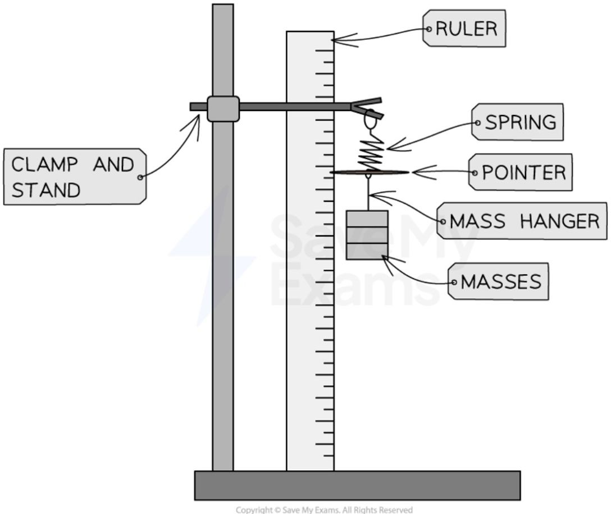
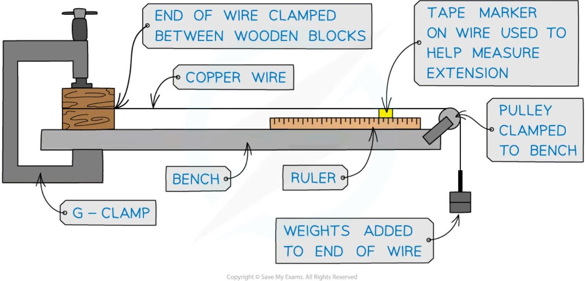
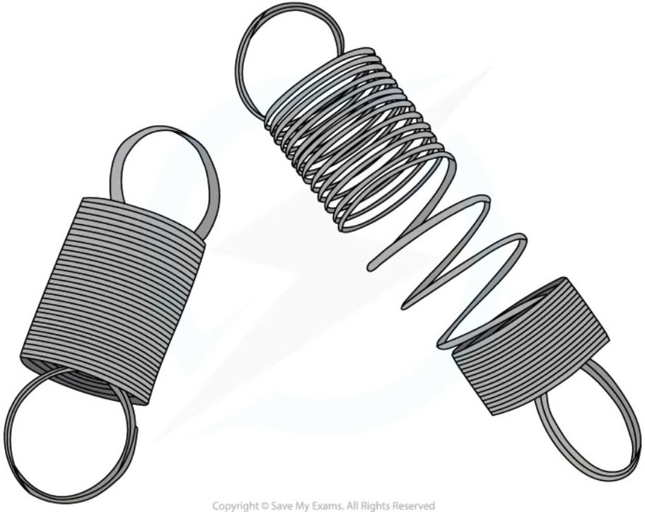

# Stretching effect of forces

## Core practical 2: investigating force and extension

### Aim of the experiment

=== "spring"
    The aim of this experiment is to investigate the relationship between **force** and **extension** for a spring.

=== "rubber band"
    The aim of this experiment is to investigate the relationship between **force** and **extension** for a rubber band.

=== "wire"
    The aim of this experiment is to investigate the relationship between **force** and **extension** for a wire.

### Variables

=== "spring"

    * **Independent variable** = Force, *F*

    * **Dependent variable** = Extension, *e*

=== "rubber band"

    * **Independent variable** = Force, *F*

    * **Dependent variable** = Extension, *e*

=== "wire"

    * **Independent variable** = Force, *F*

    * **Dependent variable** = Extension, *e*

### Equipment

=== "spring"

    <table>
    <thead>
        <tr>
            <th>Equipment</th>
            <th>Purpose</th>
        </tr>
    </thead>
    <tbody>
        <tr>
            <td>Clamp and stand</td>
            <td>To apply an upward force to the spring and rubber band</td>
        </tr>
        <tr>
            <td>Ruler</td>
            <td>To measure original length and extension</td>
        </tr>
        <tr>
            <td>Spring and rubber band</td>
            <td>To measure the extension of</td>
        </tr>
        <tr>
            <td>5 × 100 g masses</td>
            <td>To apply a downward force to the spring and rubber band</td>
        </tr>
        <tr>
            <td>100 g mass hanger</td>
            <td>To hold additional masses</td>
        </tr>
        <tr>
            <td>Pointer (also called a fiducial marker)</td>
            <td>To accurately read the extension from the ruler</td>
        </tr>
        <tr>
            <td>G-clamp</td>
            <td>To secure the clamp stand to the bench so that the equipment does not fall over</td>
        </tr>
    </tbody>
    </table>

    **Resolution** of measuring equipment:

    * Ruler = 1 mm

=== "rubber band"

    <table>
    <thead>
        <tr>
            <th>Equipment</th>
            <th>Purpose</th>
        </tr>
    </thead>
    <tbody>
        <tr>
            <td>Clamp and stand</td>
            <td>To apply an upward force to the spring and rubber band</td>
        </tr>
        <tr>
            <td>Ruler</td>
            <td>To measure original length and extension</td>
        </tr>
        <tr>
            <td>Spring and rubber band</td>
            <td>To measure the extension of</td>
        </tr>
        <tr>
            <td>5 × 100 g masses</td>
            <td>To apply a downward force to the spring and rubber band</td>
        </tr>
        <tr>
            <td>100 g mass hanger</td>
            <td>To hold additional masses</td>
        </tr>
        <tr>
            <td>Pointer (also called a fiducial marker)</td>
            <td>To accurately read the extension from the ruler</td>
        </tr>
        <tr>
            <td>G-clamp</td>
            <td>To secure the clamp stand to the bench so that the equipment does not fall over</td>
        </tr>
    </tbody>
    </table>

    **Resolution** of measuring equipment:

    * Ruler = 1 mm

=== "wire"
    <table>
    <thead>
        <tr>
            <th>Equipment</th>
            <th>Purpose</th>
        </tr>
    </thead>
    <tbody>
        <tr>
            <td>Ruler</td>
            <td>To measure original length and extension</td>
        </tr>
        <tr>
            <td>Spring, rubber band and metal wire</td>
            <td>To measure the extension of</td>
        </tr>
        <tr>
            <td>5 × 100 g masses</td>
            <td>To apply a downward force to the wire</td>
        </tr>
        <tr>
            <td>100 g mass hanger</td>
            <td>To hold additional masses</td>
        </tr>
        <tr>
            <td>Tape (to use as a marker on the wire)</td>
            <td>To accurately read the extension from the ruler</td>
        </tr>
        <tr>
            <td>Bench pulley</td>
            <td>To allow the masses to hang vertically from the metal wire</td>
        </tr>
        <tr>
            <td>G-clamp &amp; wooden blocks</td>
            <td>To apply an opposing force on the end of the wire</td>
        </tr>
    </tbody>
    </table>

    **Resolution** of measuring equipment:

    * Ruler = 1 mm

### Method

=== "spring"

    

    *Example set-up of the equipment used to investigate force and extension for a spring*

    1. Align the marker to a value on the ruler with no mass added, and record this initial length of the spring / rubber band

    2. Add the 100 g mass hanger onto the spring / rubber band

    3. Record the mass (in kg) and position (in cm) from the ruler now that the spring / rubber band has extended

    4. Add another 100 g to the mass hanger

    5. Record the new mass and position from the ruler now that the spring / rubber band has extended further

    6. Repeat this process until all masses have been added

    7. Remove the masses and repeat the entire process again, until it has been carried out a total of three times, and an average length (for each mass attached) is calculated

=== "rubber band"

    

    *Example set-up of the equipment used to investigate force and extension for a spring*

    1. Align the marker to a value on the ruler with no mass added, and record this initial length of the spring / rubber band

    2. Add the 100 g mass hanger onto the spring / rubber band

    3. Record the mass (in kg) and position (in cm) from the ruler now that the spring / rubber band has extended

    4. Add another 100 g to the mass hanger

    5. Record the new mass and position from the ruler now that the spring / rubber band has extended further

    6. Repeat this process until all masses have been added

    7. Remove the masses and repeat the entire process again, until it has been carried out a total of three times, and an average length (for each mass attached) is calculated

=== "wire"

    

    ***Example set-up of equipment to investigate the force and extension for a metal wire***

    1. Set up the apparatus so the wire is taut with no masses added

    2. Measure the original length of the wire using a metre ruler and mark a reference point with tape, preferably near the beginning of the scale, e.g. at 1 cm

    3. Record the initial length of the wire to the marker

    4. Add a 100 g mass onto the mass hanger

    5. Read and record the new reading of the tape marker from the metre ruler now that the metal wire has extended

    6. Repeat this process until all masses have been added

    7. Remove the masses and repeat the entire process again, until it has been carried out a total of three times, and an average length (for each mass attached) is calculated

### Example results table

=== "spring"

    <table>
    <thead>
        <tr>
            <th>MASS/kg</th>
            <th>FORCE/N</th>
            <th>LENGTH 1/m</th>
            <th>LENGTH 2/m</th>
            <th>LENGTH 3/m</th>
            <th>AVERAGE LENGTH/m</th>
            <th>EXTENSION/m</th>
        </tr>
    </thead>
    <tbody>
        <tr>
            <td colspan="7">0</td>
        </tr>
        <tr>
            <td colspan="7">0.1</td>
        </tr>
        <tr>
            <td colspan="7">0.2</td>
        </tr>
        <tr>
            <td colspan="7">0.3</td>
        </tr>
        <tr>
            <td colspan="7">0.4</td>
        </tr>
        <tr>
            <td colspan="7">0.5</td>
        </tr>
        <tr>
            <td colspan="7">0.6</td>
        </tr>
    </tbody>
    </table>

=== "rubber band"

    <table>
    <thead>
        <tr>
            <th>MASS/kg</th>
            <th>FORCE/N</th>
            <th>LENGTH 1/m</th>
            <th>LENGTH 2/m</th>
            <th>LENGTH 3/m</th>
            <th>AVERAGE LENGTH/m</th>
            <th>EXTENSION/m</th>
        </tr>
    </thead>
    <tbody>
        <tr>
            <td colspan="7">0</td>
        </tr>
        <tr>
            <td colspan="7">0.1</td>
        </tr>
        <tr>
            <td colspan="7">0.2</td>
        </tr>
        <tr>
            <td colspan="7">0.3</td>
        </tr>
        <tr>
            <td colspan="7">0.4</td>
        </tr>
        <tr>
            <td colspan="7">0.5</td>
        </tr>
        <tr>
            <td colspan="7">0.6</td>
        </tr>
    </tbody>
    </table>

=== "wire"

    $F = mg \rightarrow$ FORCE / N

    $e = \text{new marker reading} - \text{reference point reading} \rightarrow$ EXTENSION / m

    <table>
    <thead>
        <tr>
            <th>MASS / kg</th>
            <th>FORCE / N</th>
            <th>NEW MARKER READING / m</th>
            <th>EXTENSION / m</th>
        </tr>
    </thead>
    <tbody>
        <tr>
            <td colspan="4">0.1</td>
        </tr>
        <tr>
            <td colspan="4">0.2</td>
        </tr>
        <tr>
            <td colspan="4">0.3</td>
        </tr>
        <tr>
            <td colspan="4">0.4</td>
        </tr>
        <tr>
            <td colspan="4">0.5</td>
        </tr>
    </tbody>
    </table>

### Analysis of results

=== "spring"

    The force, *F*, added to the spring / rubber band / metal wire is the **weight** of the mass, calculated using the equation $W = m \times g$, where $W$ = weight in newtons (N), $m$ = mass in kilograms (kg), and $g$ = gravitational field strength on Earth in newtons per kg (N/kg). Therefore, multiply each mass by gravitational field strength, $g$, to calculate the force, $F$ — the force can be calculated by multiplying the mass (in kg) by 10 N/kg.

    The **extension e** of the spring / rubber band is calculated using the equation ***e* = average length – original length**, where the final length is the length of the spring / rubber band recorded from the ruler after the masses were added. The extension *e* of the metal wire is calculated using the equation ***e* = new marker reading – reference point reading**. The original length is the length of the spring / rubber band / metal wire when there were no masses attached.

    1. Plot a graph of the force against extension for the spring / rubber band / metal wire

    2. Draw a line or curve of best fit

    3. If the graph has a **linear** region (is a straight line), then the force is **proportional** to the extension

=== "rubber band"

    The force, *F*, added to the spring / rubber band / metal wire is the **weight** of the mass, calculated using the equation $W = m \times g$, where $W$ = weight in newtons (N), $m$ = mass in kilograms (kg), and $g$ = gravitational field strength on Earth in newtons per kg (N/kg). Therefore, multiply each mass by gravitational field strength, $g$, to calculate the force, $F$ — the force can be calculated by multiplying the mass (in kg) by 10 N/kg.

    The **extension e** of the spring / rubber band is calculated using the equation ***e* = average length – original length**, where the final length is the length of the spring / rubber band recorded from the ruler after the masses were added. The extension *e* of the metal wire is calculated using the equation ***e* = new marker reading – reference point reading**. The original length is the length of the spring / rubber band / metal wire when there were no masses attached.

    1. Plot a graph of the force against extension for the spring / rubber band / metal wire

    2. Draw a line or curve of best fit

    3. If the graph has a **linear** region (is a straight line), then the force is **proportional** to the extension

=== "wire"

    The force, *F*, added to the spring / rubber band / metal wire is the **weight** of the mass, calculated using the equation $W = m \times g$, where $W$ = weight in newtons (N), $m$ = mass in kilograms (kg), and $g$ = gravitational field strength on Earth in newtons per kg (N/kg). Therefore, multiply each mass by gravitational field strength, $g$, to calculate the force, $F$ — the force can be calculated by multiplying the mass (in kg) by 10 N/kg.

    The **extension e** of the spring / rubber band is calculated using the equation ***e* = average length – original length**, where the final length is the length of the spring / rubber band recorded from the ruler after the masses were added. The extension *e* of the metal wire is calculated using the equation ***e* = new marker reading – reference point reading**. The original length is the length of the spring / rubber band / metal wire when there were no masses attached.

    1. Plot a graph of the force against extension for the spring / rubber band / metal wire

    2. Draw a line or curve of best fit

    3. If the graph has a **linear** region (is a straight line), then the force is **proportional** to the extension

### Evaluating the experiments

#### Systematic errors

=== "spring"

    Make sure the measurements on the ruler are taken at eye level to avoid **parallax error**.

=== "rubber band"

    Make sure the measurements on the ruler are taken at eye level to avoid **parallax error**.

=== "wire"

    Make sure the measurements on the ruler are taken at eye level to avoid **parallax error**.

#### Random errors

=== "spring"

    The accuracy of such an experiment is improved with the use of a pointer (a fiducial marker). Wait a few seconds for the spring / rubber band / metal wire to fully extend when a mass is added, before taking the reading for its new length. Make sure to check whether the spring has not gone past its **limit of proportionality**, otherwise, it has been stretched too far.

=== "rubber band"

    The accuracy of such an experiment is improved with the use of a pointer (a fiducial marker). Wait a few seconds for the spring / rubber band / metal wire to fully extend when a mass is added, before taking the reading for its new length. Make sure to check whether the spring has not gone past its **limit of proportionality**, otherwise, it has been stretched too far.

=== "wire"

    The accuracy of such an experiment is improved with the use of a pointer (a fiducial marker). Wait a few seconds for the spring / rubber band / metal wire to fully extend when a mass is added, before taking the reading for its new length. Make sure to check whether the spring has not gone past its **limit of proportionality**, otherwise, it has been stretched too far.

#### Safety considerations

=== "spring"

    * Wear goggles during this experiment in case the spring, rubber band or wire snaps

    * Stand up while carrying out the experiment, making sure no feet are directly under the masses

    * Place a mat or a soft material below the masses to prevent any damage in case they fall

    * Use a G clamp to secure the clamp stand to the desk so that the clamp and masses do not fall over — as well as this, place each mass carefully on the hanger and do not pull the spring so hard that it breaks or pulls the apparatus over

=== "rubber band"

    * Wear goggles during this experiment in case the spring, rubber band or wire snaps

    * Stand up while carrying out the experiment, making sure no feet are directly under the masses

    * Place a mat or a soft material below the masses to prevent any damage in case they fall

    * Use a G clamp to secure the clamp stand to the desk so that the clamp and masses do not fall over — as well as this, place each mass carefully on the hanger and do not pull the spring so hard that it breaks or pulls the apparatus over

=== "wire"

    * Wear goggles during this experiment in case the spring, rubber band or wire snaps

    * Stand up while carrying out the experiment, making sure no feet are directly under the masses

    * Place a mat or a soft material below the masses to prevent any damage in case they fall

    * Use a G clamp to secure the clamp stand to the desk so that the clamp and masses do not fall over — as well as this, place each mass carefully on the hanger and do not pull the spring so hard that it breaks or pulls the apparatus over

!!! tip "Examiner Tips and Tricks"

    Remember — for the spring and rubber band, the extension measures how much the object has stretched by and can be found by **subtracting the original length from each of the subsequent lengths**.

    For the metal wire, each extension is measured by finding the difference between the **new marker point** and the **original reference point**.

    A common mistake is to calculate the increase in length each time instead of the total extension. If each of your extensions is roughly the same, then you might have made this mistake!

## Hooke's law

!!! abstract "Principle: Hooke's law"
    Within the **limit of proportionality**, the extension of a spring (or other elastic object) is **directly proportional** to the force applied to it.

!!! abstract "Definition: Limit of proportionality"
    The **limit of proportionality** is the point on a force-extension graph beyond which force is no longer directly proportional to extension — beyond this point, the object has been stretched too far for Hooke's law to still apply.

!!! note "Required formulae: Hooke's law"
    $$ F = kx $$

    Where $F$ = force in newtons (N), $k$ = spring constant in newtons per metre (N/m), and $x$ = extension in metres (m). The spring constant, $k$, describes the **stiffness** of a spring — the larger the value of $k$, the stiffer the spring, and the more force is needed to produce a given extension.

This is exactly the relationship investigated in Core practical 2 above: the **initial linear region** of a force-extension graph (a straight line through the origin) is the region in which Hooke's law is obeyed, and its gradient gives the spring constant, $k$. Beyond the limit of proportionality, the graph curves, since the force is no longer proportional to the extension.

!!! example "Worked Example (calculation)"

    A spring has a spring constant of 40 N/m. Calculate the force needed to extend the spring by 0.05 m, assuming the spring has not been stretched beyond its limit of proportionality.

    ??? success "Answer:"

        **Step 1: List the known quantities**

        * Spring constant, $k = 40\text{ N/m}$

        * Extension, $x = 0.05\text{ m}$

        **Step 2: Write the relevant equation**

        $$ F = kx $$

        **Step 3: Substitute in the known values**

        $$ F = 40 \times 0.05 $$

        $$ F = 2\text{ N} $$

!!! tip "Examiner Tips and Tricks"

    Don't assume every force-extension graph is a straight line all the way through — Hooke's law only applies up to the limit of proportionality. If a question's graph curves, that's a sign the object has been stretched beyond this point, and $F = kx$ no longer applies there.

## Elastic behaviour

!!! abstract "Definition: Elastic behaviour"
    Elastic behaviour is the ability of a material to **recover its original shape** after the forces causing the deformation have been removed.

**Deformation** is a change in the original shape of an object, and can be either **elastic** or **inelastic**. **Elastic deformation** is when the object **does** return to its original shape after the deforming forces are removed, so it results in a change in the object's shape that is **not permanent** — examples of materials that undergo elastic deformation are rubber bands, fabrics, and steel springs. **Inelastic deformation** is when the object **does not** return to its original shape after the deforming forces are removed, so it results in a change in the object's shape that **is permanent** — examples of materials that undergo inelastic deformation are plastic, clay, and glass.

**Elastic behaviour of a spring**

*The spring on the right has undergone inelastic deformation, its shape has been permanently deformed*
