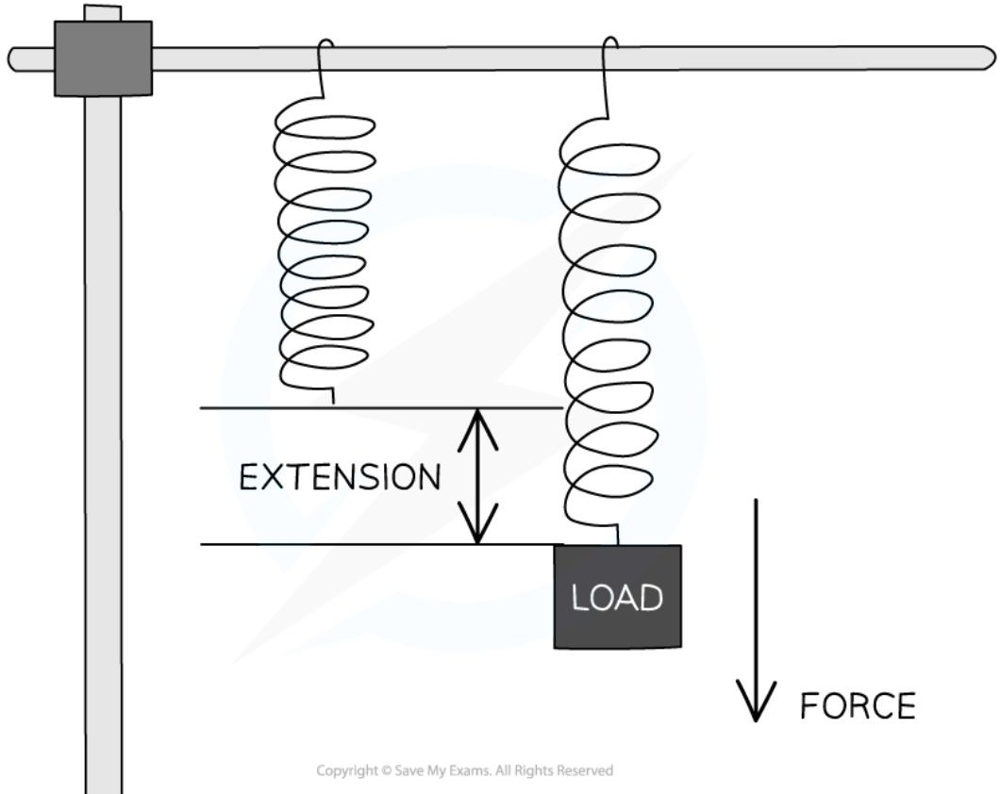

# Core practical 2: investigating force & extension

## Experiment 1: investigating force and extension for springs and rubber bands

* The aim of this experiment is to investigate the relationship between **force** and **extension** for a spring and a rubber band:

### Variables

* **Independent variable** = Force, *F*

* **Dependent variable** = Extension, *e*

### Equipment

### Equipment list

<table>
  <thead>
    <tr>
        <th>Equipment</th>
        <th>Purpose</th>
    </tr>
  </thead>
  <tbody>
    <tr>
        <td>Clamp and stand</td>
        <td>To apply an upward force to the spring and rubber band</td>
    </tr>
    <tr>
        <td>Ruler</td>
        <td>To measure original length and extension</td>
    </tr>
    <tr>
        <td>Spring and rubber band</td>
        <td>To measure the extension of</td>
    </tr>
    <tr>
        <td>5 × 100 g masses</td>
        <td>To apply a downward force to the spring and rubber band</td>
    </tr>
    <tr>
        <td>100 g mass hanger</td>
        <td>To hold additional masses</td>
    </tr>
    <tr>
        <td>Pointer (also called a fiducial marker)</td>
        <td>To accurately read the extension from the ruler</td>
    </tr>
    <tr>
        <td>G-clamp</td>
        <td>To secure the clamp stand to the bench so that the equipment does not fall over</td>
    </tr>
  </tbody>
</table>

* **Resolution** of measuring equipment:

- Ruler = 1 mm

### Method

*Example set-up of the equipment used to investigate force and extension for a spring*

1. Align the marker to a value on the ruler with no mass added, and record this initial length of the spring / rubber band

2. Add the 100 g mass hanger onto the spring / rubber band

3. Record the mass (in kg) and position (in cm) from the ruler now that the spring / rubber band has extended

4. Add another 100 g to the mass hanger

5. Record the new mass and position from the ruler now that the spring / rubber band has extended further

6. Repeat this process until all masses have been added

7. Remove the masses and repeat the entire process again, until it has been carried out a total of three times, and an average length (for each mass attached) is calculated

## Example results table

<table>
  <thead>
    <tr>
        <th>MASS/kg</th>
        <th>FORCE/N</th>
        <th>LENGTH 1/m</th>
        <th>LENGTH 2/m</th>
        <th>LENGTH 3/m</th>
        <th>AVERAGE LENGTH/m</th>
        <th>EXTENSION/m</th>
    </tr>
  </thead>
  <tbody>
    <tr>
        <td colspan="7">0</td>
    </tr>
    <tr>
        <td colspan="7">0.1</td>
    </tr>
    <tr>
        <td colspan="7">0.2</td>
    </tr>
    <tr>
        <td colspan="7">0.3</td>
    </tr>
    <tr>
        <td colspan="7">0.4</td>
    </tr>
    <tr>
        <td colspan="7">0.5</td>
    </tr>
    <tr>
        <td colspan="7">0.6</td>
    </tr>
  </tbody>
</table>

# Experiment 2: investigating force and extension for metal wires

* The aim of this experiment is to investigate the relationship between force and extension for a metal wire

## Variables

* **Independent variable** = Force, *F*

* **Dependent variable** = Extension, *e*

## Equipment

### Equipment list

<table>
  <thead>
    <tr>
        <th>Equipment</th>
        <th>Purpose</th>
    </tr>
  </thead>
  <tbody>
    <tr>
        <td>Ruler</td>
        <td>To measure original length and extension</td>
    </tr>
    <tr>
        <td>Spring, rubber band and metal wire</td>
        <td>To measure the extension of</td>
    </tr>
    <tr>
        <td>5 × 100 g masses</td>
        <td>To apply a downward force to the wire</td>
    </tr>
    <tr>
        <td>100 g mass hanger</td>
        <td>To hold additional masses</td>
    </tr>
    <tr>
        <td>Tape (to use as a marker on the wire)</td>
        <td>To accurately read the extension from the ruler</td>
    </tr>
    <tr>
        <td>Bench pulley</td>
        <td>To allow the masses to hang vertically from the metal wire</td>
    </tr>
  </tbody>
</table>

<table>
  <tbody>
    <tr>
        <td>G-clamp &amp; wooden blocks</td>
        <td>To apply an opposing force on the end of the wire</td>
    </tr>
  </tbody>
</table>

\* **Resolution** of measuring equipment:

- Ruler = 1 mm

# Method

***Example set-up of equipment to investigate the force and extension for a metal wire***

1. Set up the apparatus so the wire is taut with no masses added

2. Measure the original length of the wire using a metre ruler and mark a reference point with tape preferably near the beginning of the scale eg. at 1 cm

3. Record the initial length of the wire to the marker

4. Add a 100 g mass onto the mass hanger

5. Read and record the new reading of the tape marker from the meter ruler now that the metal wire has extended

6. Repeat this process until all masses have been added

7. Remove the masses and repeat the entire process again, until it has been carried out a total of three times, and an average length (for each mass attached) is calculated

# Example results table

F = mg $\rightarrow$ FORCE / N
e = NEW MARKER READING - REFERENCE POINT READING $\rightarrow$ EXTENSION / m

<table>
  <thead>
    <tr>
        <th>MASS / kg</th>
        <th>FORCE / N</th>
        <th>NEW MARKER READING / m</th>
        <th>EXTENSION / m</th>
    </tr>
  </thead>
  <tbody>
    <tr>
        <td colspan="4">0.1</td>
    </tr>
    <tr>
        <td colspan="4">0.2</td>
    </tr>
    <tr>
        <td colspan="4">0.3</td>
    </tr>
    <tr>
        <td colspan="4">0.4</td>
    </tr>
    <tr>
        <td colspan="4">0.5</td>
    </tr>
  </tbody>
</table>

## Analysis of results

* The force, *F* added to the spring / rubber band / metal wire is the **weight** of the mass

* The weight is calculated using the equation:

$$W = m \times g$$

* Where:

    * *W* = weight in newtons (N)

    * *m* = mass in kilograms (kg)

    * *g* = gravitational field strength on Earth in newtons per kg (N/kg)

* Therefore, multiply each mass by gravitational field strength, *g*, to calculate the force, *F*

    * The force can be calculated by multiplying the mass (in kg) by 10 N/kg

* The **extension e** of the spring / rubber band is calculated using the equation:

***e* = average length – original length**

* The final length is the length of the spring / rubber band recorded from the ruler after the masses were added

* The extension *e* of the metal wire is calculated using the equation:

***e* = new marker reading – reference point reading**

* The original length is the length of the spring / rubber band / metal wire when there were no masses attached

1. Plot a graph of the force against extension for the spring / rubber band / metal wire

2. Draw a line or curve of best fit

3. If the graph has a **linear** region (is a straight line), then the force is **proportional** to the extension

# Evaluating the experiments

Systematic errors

* Make sure the measurements on the ruler are taken at eye level to avoid **parallax error**

Random errors

* The accuracy of such an experiment is improved with the use of a pointer (a fiducial marker)

* Wait a few seconds for the spring / rubber band / metal wire to fully extend when a mass is added, before taking the reading for its new length

* Make sure to check whether the spring has not gone past its **limit of proportionality** otherwise, it has been stretched too far

## Safety considerations

* Wear goggles during this experiment in case the spring, rubber band or wire snaps

* Stand up while carrying out the experiment, making sure no feet are directly under the masses

* Place a mat or a soft material below the masses to prevent any damage in case they fall

* Use a G clamp to secure the clamp stand to the desk so that the clamp and masses do not fall over

    - As well as this, place each mass carefully on the hanger and do not pull the spring so hard that it breaks or pulls the apparatus over

### Examiner Tips and Tricks

Remember - for the spring and rubber band, the extension measures how much the object has stretched by and can be found by **subtracting the original length from each of the subsequent lengths.**

For the metal wire, each extension is measured by finding the difference between the **new marker point** and the **original reference point.**

A common mistake is to calculate the increase in length by each time instead of the total extension. If each of your extensions is roughly the same, then you might have made this mistake!

Hooke's Law

# Hooke's law

* The relationship between the extension of an elastic object and the applied force is defined by Hooke's Law

* Hooke's Law states that:

**The extension of an elastic object is directly proportional to the force applied, up to the limit of proportionality**

* Directly proportional means that as the force is increased, the extension increases

    - If the force is doubled, then the extension will double

    - If the force is halved, then the extension will also halve

* The **limit of proportionality** is the point beyond which the relationship between force and extension is no longer directly proportional

    - This limit varies according to the material

*Hooke's Law states that a force applied to a spring will cause it to extend by an amount proportional to the force*

## The force-extension graph

* Hooke’s law is the **linear** relationship between force and extension

    - This is represented by a **straight line** on a force-extension graph

* Any material beyond its **limit of proportionality** will have a non-linear relationship between force and extension

<table>
  <thead>
    <tr>
        <th>Region</th>
        <th>Description</th>
    </tr>
  </thead>
  <tbody>
    <tr>
        <td>LINEAR REGION</td>
        <td>Initial straight-line section of the graph</td>
    </tr>
    <tr>
        <td>NON-LINEAR REGION</td>
        <td>Curved section of the graph after the limit of proportionality</td>
    </tr>
    <tr>
        <td>LIMIT OF PROPORTIONALITY</td>
        <td>The point (marked with an X) where the linear relationship ends</td>
    </tr>
  </tbody>
</table>

*Hooke's Law is associated with the linear region of a force-extension graph. Beyond the limit of proportionality, Hooke's law no longer applies*

# Elastic behaviour

* **Elastic behaviour** is the ability of a material to **recover its original shape** after the forces causing the deformation have been removed

* **Deformation** is a change in the original shape of an object

* Deformation can be either:

    * elastic

    * inelastic

## Elastic Deformation

* **Elastic deformation** is when the object **does** return to its original shape after the deforming forces are removed

* Elastic deformation results in a change in the object's shape that is **not permanent**

* Examples of materials that undergo elastic deformation are:

    * Rubber bands

    * Fabrics

    * Steel springs

## Inelastic Deformation

* **Inelastic deformation** is when the object **does not** return to its original shape after the deforming forces are removed

* Inelastic deformation results in a change in the object's shape that **is permanent**

* Examples of materials that undergo inelastic deformation are:

    * Plastic

    * Clay

    * Glass

## Elastic behaviour of a spring

*The spring on the right has undergone inelastic deformation, it's shape has been permanently deformed*

