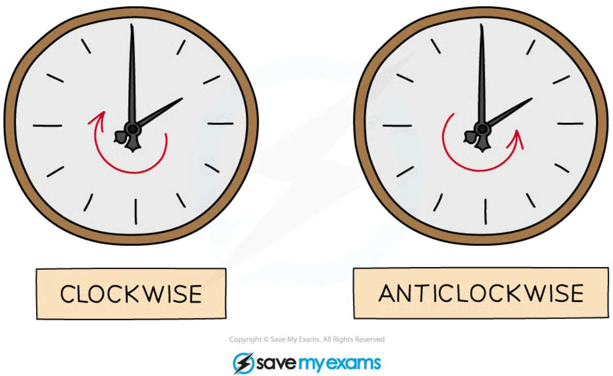
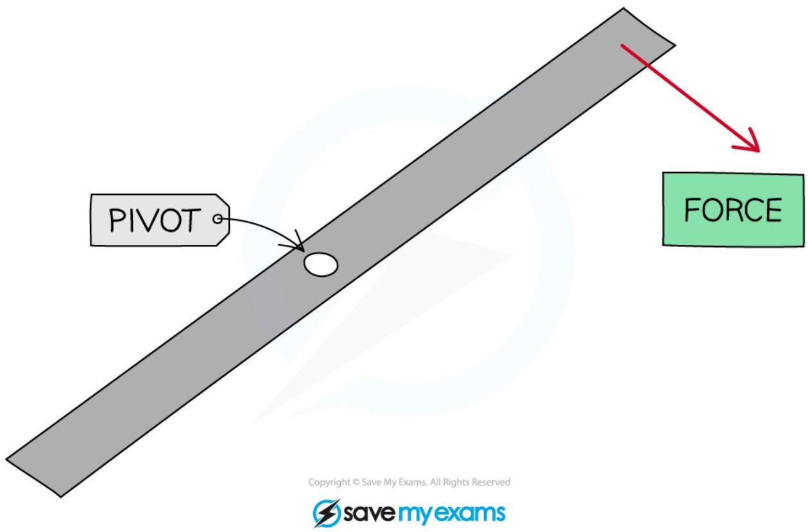
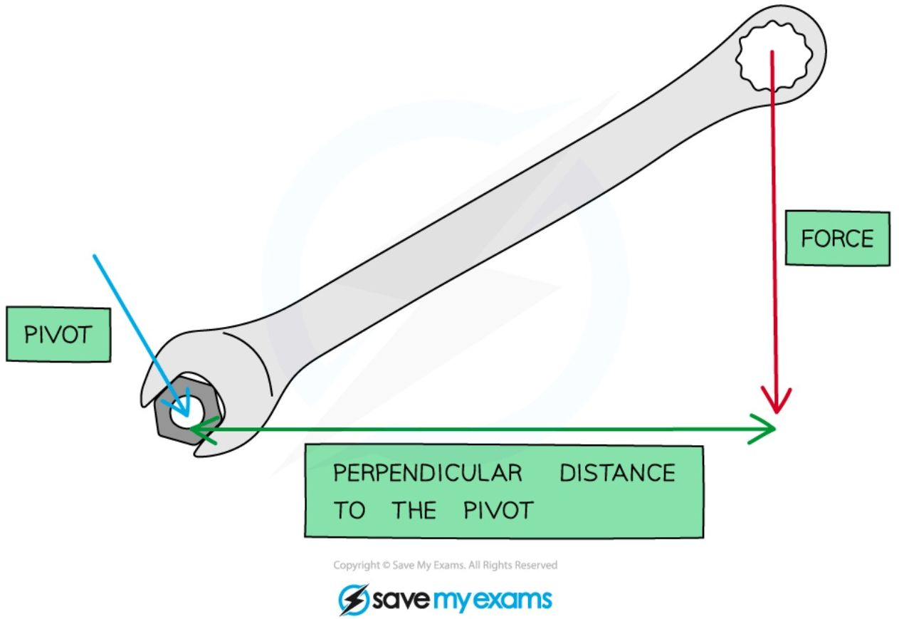
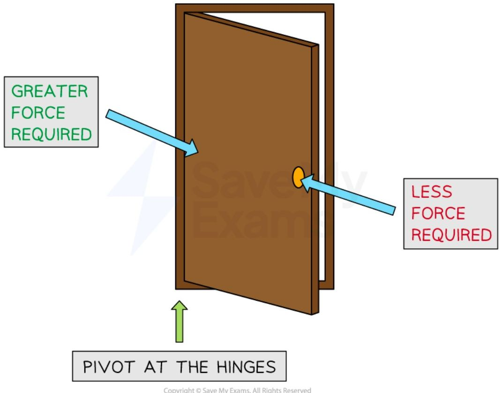
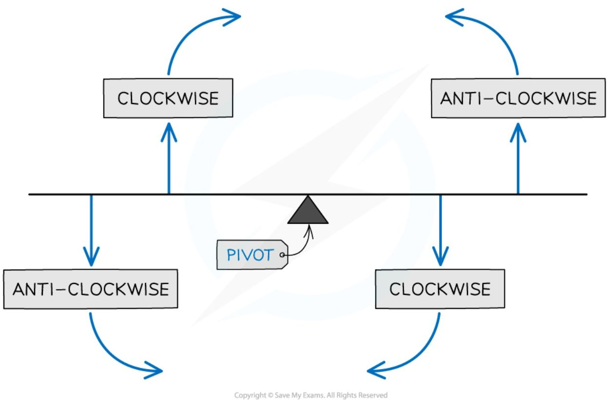
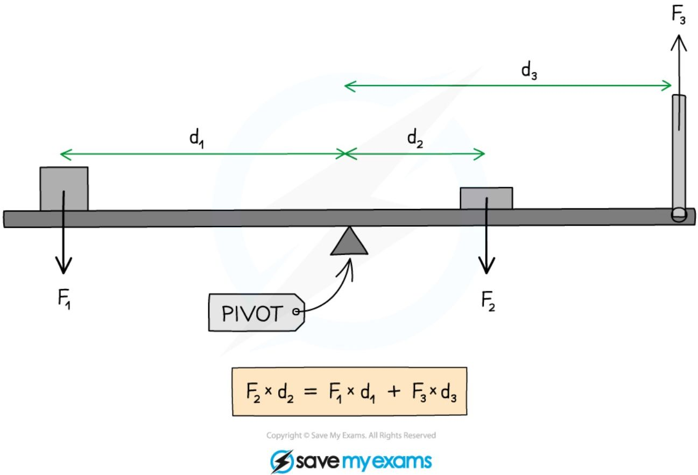
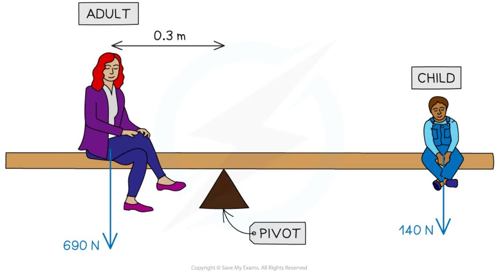
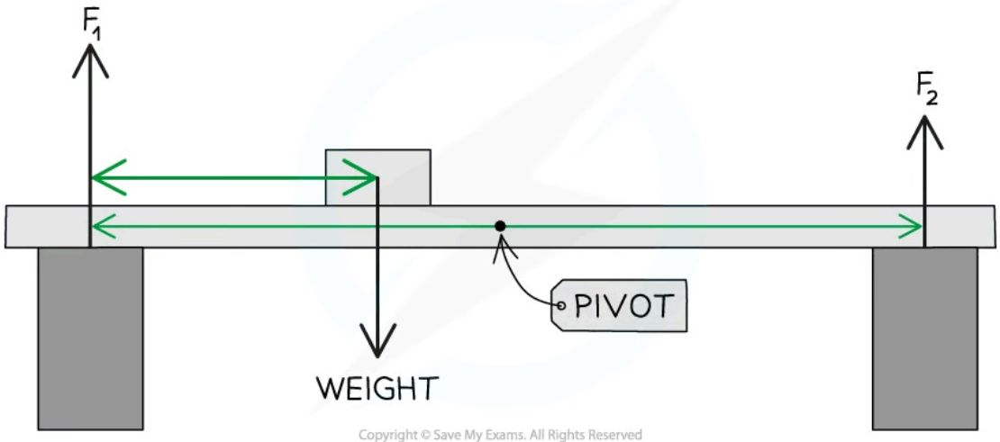
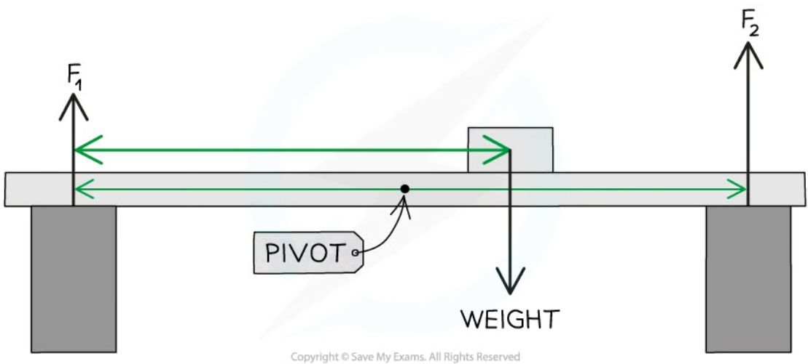
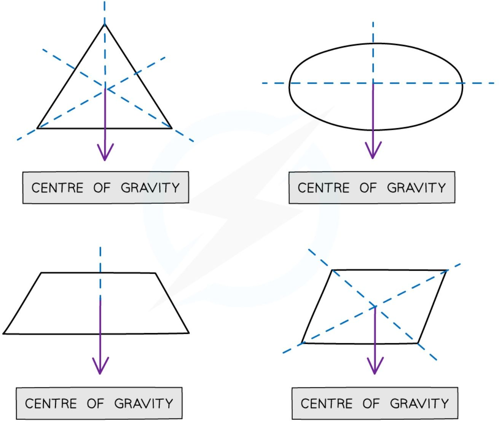

# Moments

## The moment of a force

* The **moment** of a force is the **turning effect** produced when a force is exerted on an object

* Examples of the rotation caused by the moment of a force are:
    

    * A child on a see-saw
    

    * Turning the handle of a spanner
    

    * A door opening and closing
    

    * Using a crane to move building supplies
    

    * Using a screwdriver to open a tin of paint
    

    * Turning a tap on and off
    

    * Picking up a wheelbarrow
    

    * Using scissors

* Forces can cause the **rotation** of an object about a fixed **pivot**

* This rotation can be **clockwise** or **anticlockwise**

**Clockwise and anti-clockwise rotation**

*Consider the hands of a clock when deciding if an object will rotate in a clockwise or anti-clockwise direction*

* A force applied on one side of the pivot will cause the object to rotate

**An object rotating clockwise about a pivot**

*The force applied will cause the object to rotate clockwise about the pivot*

\* A moment is defined as:

**The turning effect of a force about a pivot**

\* The size of a moment is defined by the equation: $M = F × d$

\* Where:

- M = moment in newton metres (Nm)

- F = force in newtons (N)

- d = perpendicular distance of the force to the pivot in metres (m)

\* The forces should be **perpendicular** to the distance from the pivot

- For example, on a horizontal beam, the forces which will cause a moment are those directed upwards or downwards

**The moment of a force exerted on a spanner**

*The moment depends on the force and perpendicular distance to the pivot*

* **Increasing** the **distance** a force is applied from a pivot **decreases** the **force** required

    * If you try to push open a door right next to the hinge it is very difficult, as it requires a lot of force

    * If you push the door open at the side furthest from the hinge then it is much easier, as less force is required

**Forces required to open a door**

*A greater force is required to push open a door next to the hinges than at the door handle*

!!! tip "Examiner Tips and Tricks"

    The moment of a force is measured in newton metres (N m), but can also be newton centimetres (N cm) if the distance is measured in cm instead.

    If your IGCSE exam question doesn't ask for a specific unit, always convert the distance into **metres**

## The principle of moments

* The **principle of moments** states that:

> If an object is balanced, the total clockwise moment about a pivot equals the total anticlockwise moment about that pivot

* For a balanced object, the moments on both sides of the pivot are **equal**

clockwise moment = anticlockwise moment

**Clockwise and anticlockwise moments**

*Imagine holding the beam about the pivot and applying just one of the forces. If the beam moves clockwise then the force applied is clockwise.*

* In the example below, the forces and distances of the objects on the beam are different, but they are arranged in a way that **balances** the whole system

* Remember that the moment = **force × distance from a pivot**

* The forces should be **perpendicular** to the distance from the pivot

    * For example, on a horizontal beam, the forces which will cause a moment are those directed upwards or downwards

**Using the principle of moments**

**The clockwise and anticlockwise moments acting on a beam are balanced**

* In the above diagram:

    * Force $F_1$ causes an **anticlockwise** moment of $F_1 \times d_1$ about the pivot

    * Force $F_2$ causes a **clockwise** moment of $F_2 \times d_2$ about the pivot

    * Force $F_3$ causes an **anticlockwise** moment of $F_3 \times d_3$ about the pivot

* Collecting the clockwise and anticlockwise moments:

    * Sum of the clockwise moments = $F_2 \times d_2$

    * Sum of the anticlockwise moments = $(F_1 \times d_1) + (F_3 \times d_3)$

* Using the principle of moments, the beam is balanced when:

**Sum of the clockwise moments = Sum of the anticlockwise moments**

$$F_2 \times d_2 = (F_1 \times d_1) + (F_3 \times d_3)$$

!!! example "Worked Example"

    A parent and child are at opposite ends of a playground see-saw. The parent weighs 690 N and the child weighs 140 N. The adult sits 0.3 m from the pivot.

    

    Calculate the distance the child must sit from the pivot for the see-saw to be balanced.

    ??? note "Answer:"

        **Step 1: List the known quantities**

        * Clockwise force (child), $F_{child} = 140\text{ N}$
        * Anticlockwise force (adult), $F_{adult} = 690\text{ N}$
        * Distance of adult from the pivot, $d_{adult} = 0.3\text{ m}$

        **Step 2: Write down the relevant equation**

        * Moments are calculated using:
        $$\text{Moment} = \text{force} \times \text{distance from pivot}$$

        * For the see-saw to balance, the principle of moments states that
        $$\text{Total clockwise moments} = \text{Total anticlockwise moments}$$

        **Step 3: Calculate the total clockwise moments**

        * The clockwise moment is from the child
        $$\text{Moment of child (clockwise)} = F_{child} \times d_{child}$$
        $$\text{Moment of child (clockwise)} = 140 \times d_{child}$$

        **Step 4: Calculate the total anticlockwise moments**

        * The anticlockwise moment is from the adult
        $$\text{Moment of adult (anticlockwise)} = F_{adult} \times d_{adult}$$
        $$\text{Moment of adult (anticlockwise)} = 690 \times 0.3 = 207\text{ N m}$$

        **Step 5: Substitute into the principle of moments equation**

        $$\text{Moment of child (clockwise)} = \text{Moment of adult (anticlockwise)}$$
        $$140 \times d_{child} = 207$$

        **Step 6: Rearrange for the distance of the child from the pivot**

        $$ d_{child} = \frac{207}{140} = 1.5\text{ m} $$

        * The child must sit **1.5 m** from the pivot to balance the see-saw

!!! tip "Examiner Tips and Tricks"

    Make sure that all the distances are in the same units and that you're considering the correct forces as **clockwise** or **anticlockwise**.

    In your IGCSE exam, you will only be expected to apply the principle of moments to a situation where an object rotates in one plane (up and down or side to side)

## Supporting a beam

* A **light beam** is one that can be treated as though it has **no mass**

* The supports, therefore, must exert upward forces that balance the downward acting weight of any object placed on the beam

***F1 and F2 upwards balance the weight of the beam downwards***

* As the mass in the above diagram is moved from the left-hand side to the right-hand side of the beam, force $F_1$ will **decrease** and force $F_2$ will **increase**

***F1 decreases F2 increases keep the beam balanced***

* Consider what would happen to the beam if the right-hand support was removed:

    - Force F2 would be 0

    - The weight of the object would produce a moment about the left-hand support, causing the beam to pivot in a clockwise direction

***When F2 is removed the beam will rotate by the clockwise moment***

* Therefore, the force F2 must therefore supply an **anticlockwise** moment about the left-hand support, which **balances** the moment supplied by the object

## Centre of gravity

* The **centre of gravity** of an object is defined as:

> The point through which the weight of an object acts

* For a symmetrical object of uniform density, the **centre of gravity is located at the point of symmetry**

    - For example, the centre of gravity of a sphere is at the centre

**Finding the centre of gravity of symmetrical objects**

*The centre of gravity of a regular shaped object can be found using symmetry*

* The centre of gravity of an irregular object can be found using suspension

* The **irregular shape** is suspended from a pivot and allowed to settle

* A plumb line (weighted thread) is then held next to the pivot and a pencil is used to draw a vertical line from the pivot (the centre of mass must be somewhere on this line)

* The process is then repeated, suspending the shape from two additional points

* The centre of mass is located at the point where all three lines cross

!!! tip "Examiner Tips and Tricks"

    Since the centre of gravity is a hypothetical point, it can lie inside or outside of a body. The centre of gravity will constantly shift depending on the shape of a body. For example, a human body’s centre of gravity is lower when learning forward than when standing upright

    However, when you are drawing force diagrams, always draw the weight force as if it were acting from the centre of gravity of the object!
