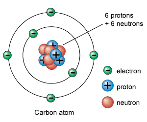
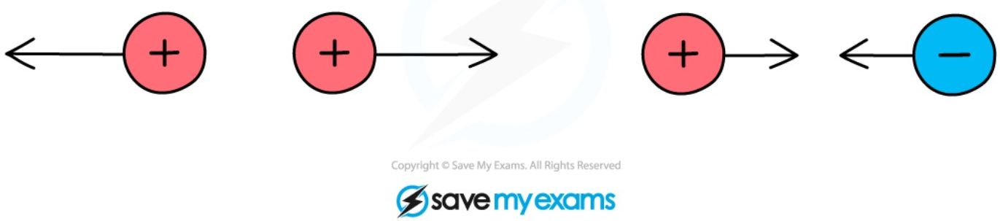
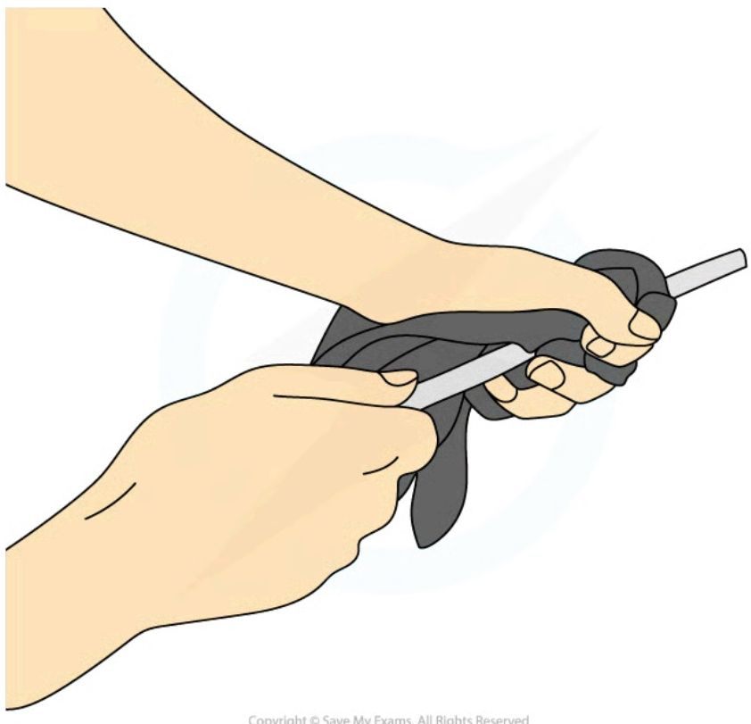

# Explaining electrostatic phenomena

**Static electricity** refers to the accumulation of **charge** on an object, which then attracts (or sometimes repels) other objects or can even produce sparks.

## Charge

!!! abstract "Definition: Charge"

    <table>
        <tr>
            <th>Name</th>
            <th>Symbol</th>
            <th>Unit</th>
            <th>Unit symbol</th>
            <th>Type</th>
        </tr>
        <tr>
            <td>Charge</td>
            <td>Q</td>
            <td>Coulomb</td>
            <td>C</td>
            <td>scalar</td>
        </tr>
    </table>
    
    **Charge** is a fundamental property of matter that is responsible for the electrostatic force. (In a similar way as mass is a fundamental property of matter that is responsible for the gravitational force)

The charge of an object is due to the charges of the particles it is made of. 
The charge of a particle can be positive, negative, or neutral (no charge) 
Matter is made of atoms, which contain a nucleus made of **protons** and **neutrons** around which orbit **electrons**. 

*The basic structure of an atom*

Protons all have the same **positive** charge ($+e = +1.60 \times 10^{-19} \text{C}$) and neutrons are **neutral**, so the nucleus of an atom is always positive. **Electrons**, have a **negative** charge ($-e = -1.60 \times 10^{-19} \text{C}$ i.e. exact same magnitude as the proton's, but opposite sign)

In a neutral atom, the number of electrons is equal to the number of protons so the overall charge is zero.

A very important property of Charge is that it is always conserved :

!!! abstract "Principle of Conservation of Charge:"
    The total charge is constant. 

## The electrostatic force

When two charged particles or objects are close together, they exert a force on each other, called the **electrostatic force**:

**Direction:** The direction of the force depends on the signs (+ or -) of the charge of the particles / objects

- If the charges are **opposite** (+ and -), they will **attract** (the force experienced by each particle / object is towards the other particle / object)

- If the charges are the **same** (both +, or both -), they will **repel** each other (the force experienced by each particle / object is away from the other particle / object)

**Opposite charges attract, like charges repel**

<table>
  <thead>
    <tr>
        <th>Charge of object 1</th>
        <th>Charge of object 2</th>
        <th>Attract or repel?</th>
    </tr>
  </thead>
  <tbody>
    <tr>
        <td>positive</td>
        <td>positive</td>
        <td>repel</td>
    </tr>
    <tr>
        <td>positive</td>
        <td>negative</td>
        <td>attract</td>
    </tr>
    <tr>
        <td>negative</td>
        <td>positive</td>
        <td>attract</td>
    </tr>
    <tr>
        <td>negative</td>
        <td>negative</td>
        <td>repel</td>
    </tr>
  </tbody>
</table>

**Magnitude:** 

- the magnitude of the force **increases** with the magnitude of the **charges** (the **higher** the charges, the **stronger** the force)

- the magnitude of the force **decreases** with the **distance** between the particles / objects (The **closer** the particles / objects are, the **stronger** the electrostatic force is.)

!!! note "Note:"
    The forces the particles exert on each other are always equal in magnitude and opposite in direction, as required by Newton's 3rd law.

!!! tip "Examiner Tips and Tricks"

    Remember the saying "opposites attract" when answering questions about forces between charged particles.

## Conductors & Insulators

To explain electrostatic phenomena, it is important to discuss the ability of materials to allow the flow of charge.

!!! abstract "Definition: Electric conductors and insulators"

    An electric **conductor** is a material that allows **charge** (usually electrons) to flow through it easily. 
    Examples of **conductors** are: metals (Silver, Copper, Aluminium, Steel ...), graphite, mineral water 

    An electric **insulator** is a material that does **not** allow the flow of **charge** through them very easily. 
    Examples of **insulators** are : plastic, wool, glass, rubber, **pure** water

!!! note "Note:"
    Not all conductors (respectively insulators) are as good at conducting (resp. insulating). It would be more correct to place materials on a scale of **conductivity** :

    <table>
    <thead>
        <tr>
            <th>COPPER</th>
            <th>IRON</th>
            <th>CARBON</th>
            <th>WATER</th>
            <th>AIR</th>
            <th>GLASS</th>
            <th>RUBBER</th>
        </tr>
    </thead>
    <tbody>
        <tr>
            <td colspan="3">BETTER CONDUCTORS</td>
            <td> </td>
            <td colspan="3">BETTER INSULATORS</td>
        </tr>
    </tbody>
    </table>

Metals are good conductors because on the atomic scale, they are made up of positively charged metal ions with their outermost electrons **delocalised**. This means the electrons are free to move. The more easily electrons are able to flow, the **better** the conductor.

*The lattice structure of a conductor with positive metal ions and delocalised electrons*

!!! warning "Warning:"

    The case of water is worth highlighting: contrary to what most students think, **pure** water is a good insulator. The reason mineral water is a good conductor is it contains ions (dissolved salts, mostly) which carry charge and are free to move.

## Charging by friction

Objects are initially electrically **neutral**, meaning the negative and positive charges balance each other and are evenly distributed

!!! abstract "Standard explanation: Charging by friction"

    When objects made of **insulating materials** are rubbed against each other, **electrons** are **transferred** from one to the other, and the objects become **electrically charged**. This is called **charging by friction**

    One object **gains electrons** and therefore becomes **negatively** charged, while the other **loses electrons** and becomes **positively charged.** 
    
   
**Example:** An example of this is a plastic or polythene rod being charged by rubbing it with a cloth (both the rod and cloth are insulating materials)

*A polythene rod may be given a charge by rubbing it with a cloth*

In this particular case, it is the rod that **gains** electrons. Since electrons are negatively charged, the rod becomes **negatively** charged. And as a result, the cloth has **lost** electrons and therefore is left with an equal **positive** charge

*Electrons are transferred from the rod to the cloth as they are rubbed together. This leaves the cloth negatively charged and the rod positively charged*

**Important Remarks:**

1. The only way charge is transferred is if there is a transfer of **electrons**: Protons are strongly bonded inside the nucleus, and can **not** be transferred by friction. Electrons, on the other hand, are only loosely bonded to the nucleus.

2. The fact that both objects gain an opposite charge is a simple consequence of the fact that the charge build up is due to a transfer of electrons but it is also an illustration of the principle of conservation of charge.

3. **Conductors** generally cannot be charged by **friction** under normal conditions: any electrons gained or lost instantly flow through the metal and dissipate safely into the ground (or through your hands) before a static charge can build up. ([see this](https://van.physics.illinois.edu/ask/listing/552)). To successfully hold an electric charge on a conductor, you must hold it with an insulating handle (like a thick rubber glove) and charge it through contact or induction, rather than directly rubbing it.

4. Students frequently ask themselves which object will gain electrons and which will lose electrons. You are **not** supposed to know, but a simplified answer is that each material has a property called **electron affinity** which describes its ability to attract electrons, and the object with the **highest electron affinity** will **gain electrons** and become negative. (see [here](https://en.wikipedia.org/wiki/Triboelectric_effect) for a more detailed discussion).

!!! tip "Examiner Tips and Tricks"

    At this level, if asked to explain how things gain or lose charge, you must discuss **electrons** and explain whether something has gained or lost them. Remember when charging by friction, it is only the **electrons** that can move, not any 'positive' charge, therefore if an object gains a negative charge, something else must have gained a positive charge by losing negative electrons.

!!! tip "Examiner Tips and Tricks"

    Many students struggle with the concept of becoming positively charged by losing negative electrons. Luckily this can be explained using a very simple equation.

    A neutral object has a charge of 0. When we remove an electron, we are subtracting a negative charge from our neutral object. This is the same as the following equation:

    $$ 0 - (-1) = +1 $$

    By removing a negative charge from a neutral object, we end up with a positively charged object, as shown by the +1 answer.

## Attraction between charged and neutral objects

The fact that two charged objects attract or repel each other is easily explained by the electrostatic force. But it turns out that **charged objects can also attract neutral objects**. Here is why:

!!! abstract "Model explanation: attraction between charged and neutral object:"
    When a charged object is brought near a neutral object, it causes the charges inside the neutral object to shift: 
    The opposite charges move closer to the charged object and the like charges move further away. 
    Because they are closer, the opposite charges attract more than the like charges repel 
    This results in an overall attractive force.

**Example:** [This simulation](https://phet.colorado.edu/sims/html/balloons-and-static-electricity/latest/balloons-and-static-electricity_all.html) helps visualizing the process.

 **Important remarks**

1. This force is typically quite weak and can only be demonstrated with very light objects (balloons, small polystyrene beads, small pieces of paper, stream of water).

2. This force is always attractive.

!!! warning "Warning:"
    This model explanation has not been required in any past paper yet. However, it is hinted at - in less details - in a couple of mark schemes (TODO: find example), and it is definitely required to be aware of the fact that charged objects can attract neutral objects as it is one way to demonstrate that an object is charged (see [Testing whether an object is charged](2_1_2_investigating-electrostatic-phenomena.md)).

## Example questions

!!! examples "Worked Example 1: The Plastic Slide"
    **Question:** Explain why a child's hair sticks up and separates after sliding down a plastic playground slide.
    
    ??? abstract "Answer"
        1. **Friction:** As the child slides down, friction between their clothes/body and the plastic slide causes **electrons to transfer** from one surface to the other.
        2. **Net Charge:** This leaves the child's body and their hair with a net electrostatic charge.
        3. **Repulsion:** Every individual strand of hair gains the **same sign of charge** (e.g., all negative or all positive).
        4. **Separation:** Because like charges repel, the strands of hair push away from one another, causing them to stand up and separate.

!!! examples "Worked Example 2: The Van de Graaff Generator"
    **Question:** A student places their hands on a running Van de Graaff generator dome. Explain what will happen to their hair.
    
    ??? abstract "Answer"
        1. **Conduction:** The dome builds up a large static charge via internal belt friction. When touched, charges safely travel up and conduct through the student's body because human tissue can conduct current at high voltages.
        2. **Accumulation:** The electrostatic charges collect at the outer extremities, including the hair strands.
        3. **Like Charges Repel:** Since all strands collect identical, net-like charges, they experience an outward repulsive electrostatic force away from each other and the head.

!!! examples "Worked Example 3: Cling Film Behaviour"
    **Question:** Explain why kitchen cling film sticks easily to smooth plastic or glass bowls but does not stick well to metal surfaces.
    
    ??? abstract "Answer"
        1. **Friction Induction:** Pulling cling film off a roll creates massive friction, transferring electrons and leaving the film highly charged.
        2. **Insulating Bowls:** When brought near an insulating bowl (glass/plastic), the film induces local surface charge separation. Because charges cannot move freely on an insulator, this localized polarization stays in place, creating a strong permanent attraction.
        3. **Conducting Bowls:** When brought near a metal bowl, any induced charges or transferred electrons instantly flow throughout the metal body and dissipate safely, neutralizing the attractive force.
        
