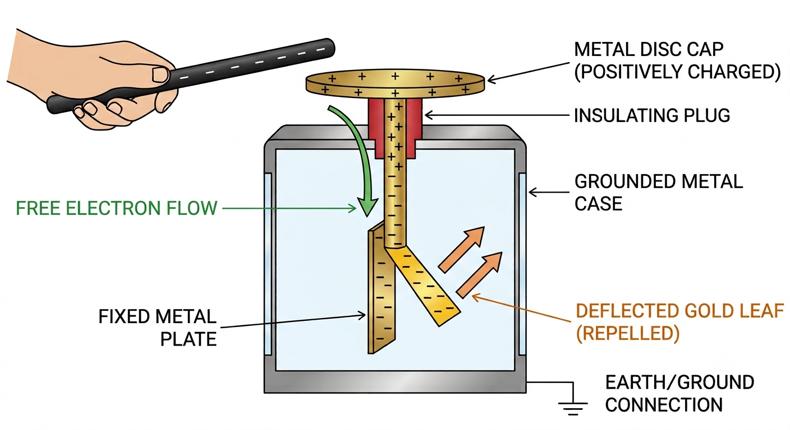

# Investigating electrostatic phenomena

## Core practical 3: investigating charging by friction

This experiment aims to investigate how insulating materials can be charged by friction.

### Variables

* **Independent variable** = Rods of different material

* **Dependent variable** = Charge on the rod

* Control variables:

    - Time spent rubbing the rod

    - Using the same type of cloth

    - Using the same length of rod

### Equipment

<table>
  <thead>
    <tr>
        <th>Equipment</th>
        <th>Purpose</th>
    </tr>
  </thead>
  <tbody>
    <tr>
        <td>Polythene rod</td>
        <td>to charge and hang from a cradle to test against each material</td>
    </tr>
    <tr>
        <td>Rods of different materials (acrylic, acetate, glass, wood)</td>
        <td>to observe the effects of these on the polythene rod</td>
    </tr>
    <tr>
        <td>Cloths (one per material)</td>
        <td>to rub the materials to charge them</td>
    </tr>
    <tr>
        <td>Cradle</td>
        <td>to suspend rods from, allowing them to move freely when subjected to a force</td>
    </tr>
    <tr>
        <td>Nylon string</td>
        <td>to hang the rods</td>
    </tr>
    <tr>
        <td>Wooden stand</td>
        <td>to suspend the string and cradle from</td>
    </tr>
  </tbody>
</table>

### Method

*Apparatus for investigating charging by friction*

1. Take a polythene rod, hold it at its centre and rub both ends with a cloth

2. Suspend the rod, without touching the ends, from a stand using a cradle and nylon string

3. Take an acrylic rod and rub it with another cloth

4. Without touching the ends of the acrylic rod bring each end of the acrylic rod up to, but without touching, each end of the polythene rod (if the ends do touch, the rods will **discharge** and the forces will no longer be present)

5. Record any observations of the polythene rod's motion

6. Repeat, changing out the acrylic rod for rods of different materials

### Analysis of Results

* When two insulating materials are rubbed together, electrons will transfer from one insulator onto the other insulator

* A polythene rod is given a negative charge by rubbing it with the cloth

    - This is because electrons are transferred to the polythene from the cloth

    - Electrons are negatively charged, hence the polythene rod becomes negatively charged

* Conversely, an acetate rod is given a positive when rubbed with a cloth

    - This is because electrons are transferred away from the acetate to the cloth

    - Electrons are negatively charged, so when the acetate **loses** negative charge, it becomes **positively** charged

*Electrons are transferred to the polythene rod whilst they move from the acetate rod*

* If the material is **repelled** by (rotates away from) the polythene rod, then the materials have the **same charge**

* If the material is **attracted** to (moves towards) the polythene rod, then they have **opposite charges**

    * In the example from the diagram above, the acetate rod would be attracted to the polythene rod, as they have opposite charges

### Evaluating the Experiment
#### Systematic errors

#### Random errors

* Ensure the experiment is done in a space with no draft or breeze and the table is free of vibrations (e.g. from electrical equipment in the room), as this could affect the motion of the polythene rod

* If the deflection of the rod is very small, the direction could be misinterpreted – rub the other material for a longer period to transfer more charge and produce a more visible deflection

* This experiment can be carried out in several different ways

* To improve the outcome of the experiment, consider investigating a variable with a numerical result

* For example:

    * the independent variable could stay the same (using rods of different material)

    * the dependent variable could change to be the number of paper circles picked up by each rod

* Collecting numerical data allows:
    

    * more analysis to be carried out e.g. creating a graph or a chart
    

    * better conclusions to be drawn e.g. the rod made of      picked up more circles of paper than the other rods, therefore it became the most charged

#### Safety considerations

## Testing whether an object is charged

To test whether an object is charged (or demonstrate that on object is charged), there are several methods:

### Using a gold leaf electroscope

A **gold leaf electroscope** is a classic piece of physics apparatus used to detect the presence of electrostatic charge on an object. 

!!! abstract "Model Explanation: Design and Operation of a gold leaf electroscope"
    **Design Structure:**

    * **Metal Cap (Disc):** A conducting plate at the top where objects are brought close or touched.

    * **Metal Rod:** Conducts charge down from the cap into the protective case.

    * **Insulating Plug:** Holds the rod in place while preventing charge from leaking into the case.

    * **Gold Leaf:** An incredibly thin, lightweight piece of gold foil attached next to a rigid metal plate.

    * **Grounded Case:** A protective box (often with glass windows) that shields the delicate leaf from air currents and external electric fields.

    **How it operates:**

    1. When an unknown object is brought close to the **metal cap**, it causes **electrostatic induction**.

    2. For example, a positively charged rod will attract electrons towards the cap, forcing them up the **metal rod**.

    3. This causes both the central **metal plate** and the flexible **gold leaf** to gain a net positive charge.

    4. Because like charges repel, the gold leaf experiences an electrostatic force pushing it away from the rigid metal plate.

    5. The gold leaf rises, visibly demonstrating that the object is charged.

*Structure and operation of a gold leaf electroscope*

!!! warning "Limitation of the Electroscope"

    The gold leaf will rise regardless of whether the object is positively or negatively charged.

    * Bringing a **negative** rod close pushes electrons down, causing the leaf and plate to become **negative** and repel.

    * Bringing a **positive** rod close pulls electrons up to the cap, leaving the leaf and plate **positive**, which *still* results in repulsion.
    
    Therefore, a standard electroscope **cannot** determine the sign (+ or -) of an unknown charge on its own.

### Using small neutral objects

!!! abstract "Standard Explanation: Attraction of Neutral Objects"
    * A charged object can be brought close to small, lightweight neutral objects such as bits of paper, polystyrene beads, or a thin stream of water from a tap.

    * The electric field from the charged object induces a temporary opposite charge on the closer side of the neutral objects.

    * This creates an attractive electrostatic force, causing the paper bits or water stream to move toward the rod.

!!! warning "Common Mistake: Mistaking Attraction for Proof of Charge Type"
    Just like the electroscope, this method **does not** tell you the sign of the charge. Both a purely positive rod and a purely negative rod will successfully attract neutral paper or water.

### Using a Coulombmeter

!!! abstract "Using a Coulombmeter"
    A digital Coulombmeter can be connected to a proof plane (a small metal disc on an insulating handle). When the proof plane touches the charged object and then touches the Coulombmeter, the meter displays a numerical value for the charge in Coulombs ($C$).

!!! tip "Examiner Tip"
    A digital Coulombmeter is the fastest way to find out the exact **sign** (positive or negative) of a charge because the digital screen will display a minus sign ($-$) for a negative charge. However, Edexcel exam questions rarely feature this modern piece of kit—they heavily prefer asking you about old-school mechanical methods like rods and cloths!

### Using another charged object

!!! warning "Crucial Distinction: Attraction vs Repulsion"
    Using a known charged rod to test an unknown object requires strict logic because **attraction is not definitive proof of charge**.
    
    * A known positive rod will **attract** a negative object.

    * A known positive rod will *also* **attract** a completely neutral object via induction.
    
    Therefore, if you observe attraction, you cannot definitively conclude if the object is oppositely charged or just neutral.
    
    !!! note "The Only Definitive Test"
        **Repulsion is the only true test for a charge.** If your unknown object is **repelled** by a rod of a known charge, it proves without a doubt that the object is charged, and that it carries the **same sign** of charge as the known rod.