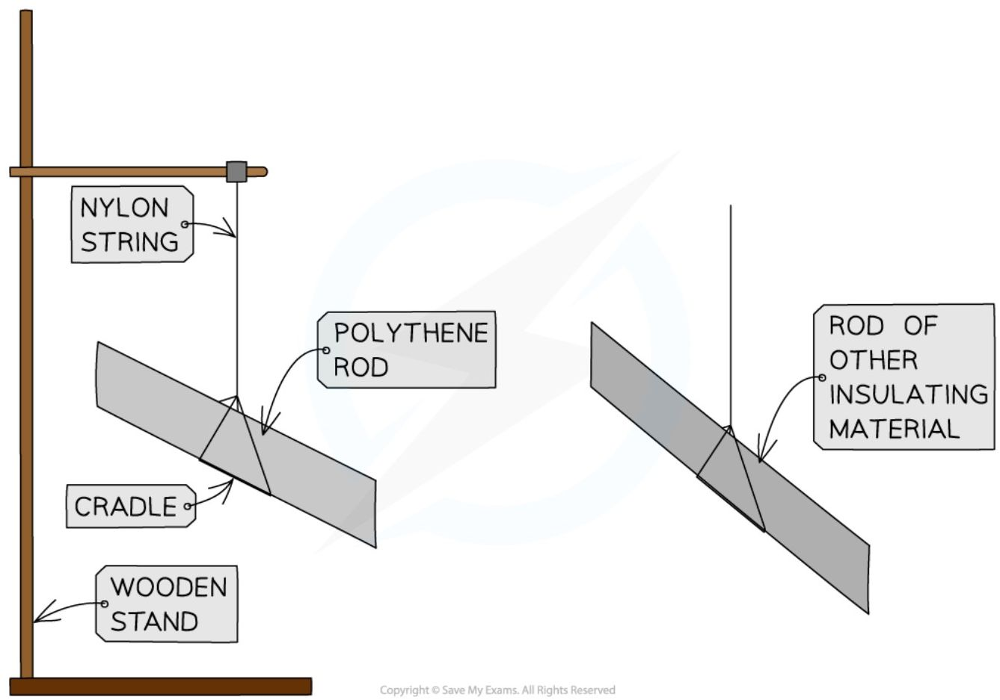
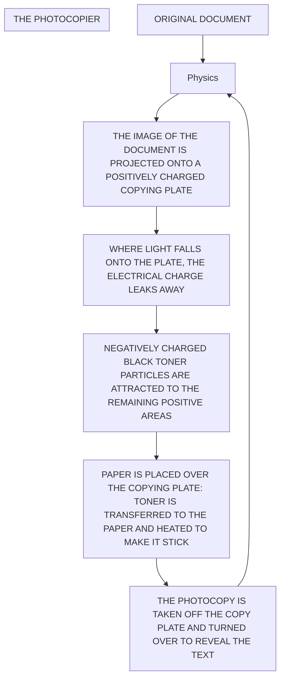
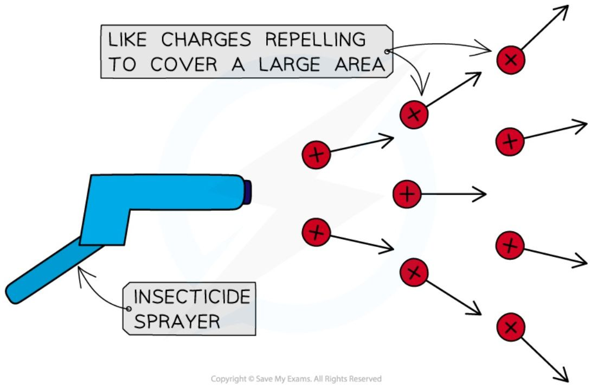

# Static Electricity

## Electrostatic force

* The charge of a particle can be:

    * positive

    * negative

    * neutral (no charge)

* Electrons are **negatively** charged particles, whilst protons are **positive** and neutrons are **neutral**

* This is why in a neutral atom, the number of electrons is equal to the number of protons

    * This is so the equal (but opposite) charges cancel out to make the overall charge of the atom zero

<table>
  <thead>
    <tr>
        <th>Symbol</th>
        <th>Label</th>
    </tr>
  </thead>
  <tbody>
    <tr>
        <td>Red circle</td>
        <td>PROTON</td>
    </tr>
    <tr>
        <td>Green circle</td>
        <td>NEUTRON</td>
    </tr>
    <tr>
        <td>Blue circle</td>
        <td>ELECTRON</td>
    </tr>
  </tbody>
</table>

***The number of negative electrons in an atom balances the number of positive protons***

* Therefore, an object becomes negatively charged when it **gains** electrons and positively charged when it **loses** electrons

* When two charged particles or objects are close together, they also exert a **force** on each other

* This force could be:
    

    * **Attractive** (the objects get closer together)
    

    * **Repulsive** (the objects move further apart)

**Opposite charges attract, like charges repel**

* Whether two objects attract or repel depends on their **charge**

    - If the charges are the **opposite**, they will **attract**

    - If the charges are the **same**, they will **repel** – charges which are the same (e.g. both positive) are often referred to as **like charges**

* The force is **stronger** if the objects are **closer together**

<table>
  <thead>
    <tr>
        <th>Charge of object 1</th>
        <th>Charge of object 2</th>
        <th>Attract or repel?</th>
    </tr>
  </thead>
  <tbody>
    <tr>
        <td>positive</td>
        <td>positive</td>
        <td>repel</td>
    </tr>
    <tr>
        <td>positive</td>
        <td>negative</td>
        <td>attract</td>
    </tr>
    <tr>
        <td>negative</td>
        <td>positive</td>
        <td>attract</td>
    </tr>
    <tr>
        <td>negative</td>
        <td>negative</td>
        <td>repel</td>
    </tr>
  </tbody>
</table>

* Attraction and repulsion between two charged objects are examples of a **non-contact force**

    - This is a force that acts on an object without being physically in contact with it

!!! tip "Examiner Tips and Tricks"

    Remember the saying "opposites attract" when answering questions about forces between charged particles.

## Conductors & Insulators

### Conductors

*   A **conductor** is a material that allows **charge** (usually electrons) to flow through it easily

*   Examples of conductors are: 

    *   Silver
    

    *   Copper
    

    *   Aluminium
    

    *   Steel

*   Conductors tend to be **metals**

<table>
  <thead>
    <tr>
        <th>COPPER</th>
        <th>IRON</th>
        <th>CARBON</th>
        <th>WATER</th>
        <th>AIR</th>
        <th>GLASS</th>
        <th>RUBBER</th>
    </tr>
  </thead>
  <tbody>
    <tr>
        <td colspan="3">BETTER CONDUCTORS</td>
        <td> </td>
        <td colspan="3">BETTER INSULATORS</td>
    </tr>
  </tbody>
</table>

### Different materials have different properties of conductivity

*   On the atomic scale, conductors are made up of positively charged metal ions with their outermost electrons **delocalised**
    

    *   This means the electrons are free to move

*   Metals conduct electricity very well because:
    

    *   Current is the rate of flow of electrons
    

    *   So, the more easily electrons are able to flow, the **better** the conductor

*The lattice structure of a conductor with positive metal ions and delocalised electrons*

### Insulators

* An **insulator** is a material that has **no free charges**, hence does **not** allow the flow of charge through them very easily

* Examples of insulators are:

    * Rubber

    * Plastic

    * Glass

    * Wood

* Some non-metals, such as wood, allow **some** charge to pass through them

* Although they are not very good at conducting, they do conduct a little in the form of **static** electricity

    * For example, two insulators can build up charge on their surfaces and if they touch this would allow that charge to be conducted away

## Core practical 3: investigating charging by friction

### Aim of the experiment

* The aim of this experiment is to investigate how insulating materials can be charged by friction

### Variables

* **Independent variable** = Rods of different material

* **Dependent variable** = Charge on the rod

* Control variables:

    - Time spent rubbing the rod

    - Using the same type of cloth

    - Using the same length of rod

### Equipment

<table>
  <thead>
    <tr>
        <th>Equipment</th>
        <th>Purpose</th>
    </tr>
  </thead>
  <tbody>
    <tr>
        <td>Polythene rod</td>
        <td>to charge and hang from a cradle to test against each material</td>
    </tr>
    <tr>
        <td>Rods of different materials (acrylic, acetate, glass, wood)</td>
        <td>to observe the effects of these on the polythene rod</td>
    </tr>
    <tr>
        <td>Cloths (one per material)</td>
        <td>to rub the materials to charge them</td>
    </tr>
    <tr>
        <td>Cradle</td>
        <td>to suspend rods from, allowing them to move freely when subjected to a force</td>
    </tr>
    <tr>
        <td>Nylon string</td>
        <td>to hang the rods</td>
    </tr>
    <tr>
        <td>Wooden stand</td>
        <td>to suspend the string and cradle from</td>
    </tr>
  </tbody>
</table>

### Method

*Apparatus for investigating charging by friction*

1. Take a polythene rod, hold it at its centre and rub both ends with a cloth

2. Suspend the rod, without touching the ends, from a stand using a cradle and nylon string

3. Take an acrylic rod and rub it with another cloth

4. Without touching the ends of the acrylic rod bring each end of the acrylic rod up to, but without touching, each end of the polythene rod (if the ends do touch, the rods will **discharge** and the forces will no longer be present)

5. Record any observations of the polythene rod's motion

6. Repeat, changing out the acrylic rod for rods of different materials

### Analysis of Results

* When two insulating materials are rubbed together, electrons will transfer from one insulator onto the other insulator

* A polythene rod is given a negative charge by rubbing it with the cloth

    - This is because electrons are transferred to the polythene from the cloth

    - Electrons are negatively charged, hence the polythene rod becomes negatively charged

* Conversely, an acetate rod is given a positive when rubbed with a cloth

    - This is because electrons are transferred away from the acetate to the cloth

    - Electrons are negatively charged, so when the acetate **loses** negative charge, it becomes **positively** charged

*Electrons are transferred to the polythene rod whilst they move from the acetate rod*

* If the material is **repelled** by (rotates away from) the polythene rod, then the materials have the **same charge**

* If the material is **attracted** to (moves towards) the polythene rod, then they have **opposite charges**

    * In the example from the diagram above, the acetate rod would be attracted to the polythene rod, as they have opposite charges

### Evaluating the Experiment
#### Systematic errors

#### Random errors

* Ensure the experiment is done in a space with no draft or breeze and the table is free of vibrations (e.g. from electrical equipment in the room), as this could affect the motion of the polythene rod

* If the deflection of the rod is very small, the direction could be misinterpreted – rub the other material for a longer period to transfer more charge and produce a more visible deflection

* This experiment can be carried out in several different ways

* To improve the outcome of the experiment, consider investigating a variable with a numerical result

* For example:

    * the independent variable could stay the same (using rods of different material)

    * the dependent variable could change to be the number of paper circles picked up by each rod

* Collecting numerical data allows:
    

    * more analysis to be carried out e.g. creating a graph or a chart
    

    * better conclusions to be drawn e.g. the rod made of      picked up more circles of paper than the other rods, therefore it became the most charged

#### Safety considerations

## Production of static

* **Static electricity** refers to the accumulation of charge on an object, which then attracts other objects or can even produce sparks

* When certain insulating materials are rubbed against each other they become **electrically charged**

    * This is called **charging by friction**

* The charges remain on the insulators and cannot immediately flow away

    * One becomes positive and the other negative

* An example of this is a plastic or polythene rod being charged by rubbing it with a cloth

    * Both the rod and cloth are insulating materials

*A polythene rod may be given a charge by rubbing it with a cloth*

* This occurs because negatively charged electrons are **transferred** from one material to the other

    * The material, in this case, the rod, **gains** electrons

* Since electrons are negatively charged, the rod becomes **negatively** charged

    * As a result, the cloth has **lost** electrons and therefore is left with an equal **positive** charge

!!! tip Examiner Tips and Tricks

    > At this level, if asked to explain how things gain or lose charge, you must discuss **electrons** and explain whether something has gained or lost them. Remember when charging by friction, it is only the **electrons** that can move, not any 'positive' charge, therefore if an object gains a negative charge, something else must have gained a positive charge by losing negative electrons.

!!! tip "Examiner Tips and Tricks"

    Many students struggle with the concept of becoming positively charged by losing negative electrons. Luckily this can be explained using a very simple equation.

    A neutral object has a charge of 0. When we remove an electron, we are subtracting a negative charge from our neutral object. This is the same as the following equation:

    $$ 0 - (-1) = +1 $$

    By removing a negative charge from a neutral object, we end up with a positively charged object, as shown by the +1 answer.

### Movement of electrons

* All objects are initially electrically **neutral**, meaning the negative and positive charges are evenly distributed

* However, when the electrons are transferred through friction, one object becomes **negatively** charged and the other **positively** charged

    - The object the electrons are transferred **to** becomes **negatively charged**

    - The object the electrons transfer **from** becomes **positively charged**

* This difference in charges leads to a force of **attraction** between itself and other objects which are also electrically neutral

    - This is done by attracting the opposite charge to the surface of the objects they are attracted to

* In the example below, when the cloth and acetate rod are rubbed together, the electrons are transferred from the **rod** to the **cloth**

* This results in an **attractive** force between the two objects once separated

*Electrons are transferred from the rod to the cloth as they are rubbed together. This leaves the cloth negatively charged and the rod positively charged*

## Uses & Dangers of Static Electricity

### Uses of static electricity

* Electrostatic charges are used in everyday situations such as photocopiers and inkjet printers

#### Photocopiers

* Photocopiers use static electricity to copy paper documents, most commonly in black and white

1. An image of the document is projected onto a positively charged copying plate

2. The plate loses its charge in the light areas and keeps the positive charge in the dark areas (i.e the text)

3. A negatively charged black toner powder (the ink) is applied to the plate and sticks to the part where there is a positive charge

4. The toner is then transferred onto a new blank sheet of white paper

5. The paper is heated to make sure the powder sticks (hence why photocopied paper feels warm)

* The photocopy of the document is now made

* Inkjet printers work in a similar way, but instead of the black toner powder, a small jet of coloured ink is negatively charged and attracted to the correct place on the page

Diagram of the process by which a photocopier prints black text onto paper

#### Insecticide Sprayers

* Insecticides are chemicals used to kill pests in order to protect crops

* In order to spray crops effectively whilst using a minimal amount of chemicals, the sprayer has to deliver the chemicals as a fine **mist** and cover a **large area**

* To achieve this, the insecticide is given an electrostatic charge (e.g. positive) as it leaves the sprayer

* The droplets of insecticide then **repel** each other since they are the same charge

    - This ensures that the spray remains fine and covers a large area

* They are also attracted to the negative charges on Earth, so they will fall **quickly** and are less likely to be blown away

* A similar technique is used in the spray painting of cars

*Positively-charged particles leaving the sprayer repel one another, covering a larger area and preventing particles from grouping together.*

### Dangers of static electricity

* There are various situations where static electricity can pose a hazard, for example:

    - the risk of electrocution (e.g from lightning or a loose connection in an electrical appliance)

    - the risk of a fire or explosion due to a **spark** close to a flammable gas or liquid

* Static electricity can cause sparking

    - This is where a large amount of charge builds up, producing a large potential difference across a gap

    - If the potential difference is large enough, current can travel through the air between objects – this is a spark

* There are dangers of sparking in everyday situations such as fuelling vehicles such as cars and planes

* Earthing is used to prevent the dangerous build-up of charge

    - This is done by connecting the vehicles to the Earth with a conductor

#### Fuelling Vehicles

* A build-up of static charge is a potential danger when refuelling aeroplanes

* Fuel runs through pipes at a fast rate

    - This fuel is very flammable

* The friction between the fuel (a liquid insulator) and the pipe causes the fuel to **gain charge**

* If this charge were to cause a spark, the fuel could ignite and cause an explosion

*A diagram showing how the bonding line reduces the chance of sparks when fuelling a plane*

* This is prevented by the fuel tank being connected to the Earth with a copper wire called the **bonding line** during the refuelling

* The conductor **earths** the plane by carrying the charge through to the Earth which removes the risk of any sparks

    - It is easier for charge to flow down the bonding line than to spark, so sparks are very unlikely to occur

!!! tip "Examiner Tips and Tricks"

    * You could be asked to explain other dangers and uses in your exams

    * They may ask you to explain the movement of charge in terms of **electrons**

    * If asked to explain a danger:

    * State what the danger is (electric shock? fire?)
    * Explain how the charge can be **removed** to get rid of the risk i.e earthing (think about which way the electrons have to move)
    * If asked to explain a use, think carefully about the forces exerted due to static electricity and what they will do
