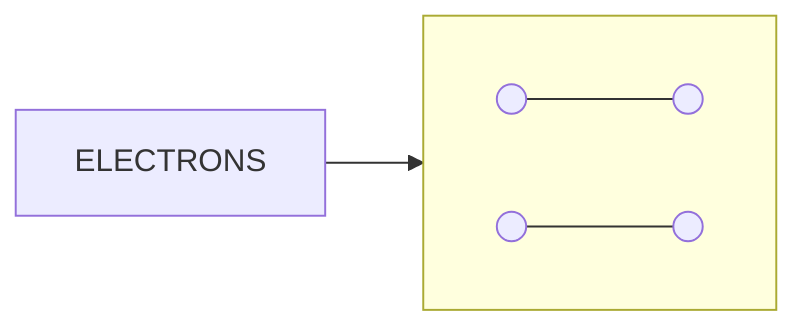

# Electrical quantities

## Charge and current

### Charge

The wires in an electric circuit are made of **metal** because it is a good **conductor** of electric **current**. In the wires, the current is a flow of **negatively charged electrons**.


*(Note: The diagram above represents a flow of electrons through a metal lattice. Large blue circles represent metal ions, and small green circles represent electrons moving towards the positive terminal.)*

<table>
  <thead>
    <tr>
        <th colspan="2">Legend</th>
    </tr>
  </thead>
  <tbody>
    <tr>
        <td>Large Blue Circle</td>
        <td>= METAL ION</td>
    </tr>
    <tr>
        <td>Small Green Circle</td>
        <td>= ELECTRON</td>
    </tr>
  </tbody>
</table>

*In metal wires, the current is a flow of negatively charged electrons. When a voltage is applied, electrons flow through the lattice of metal ions*

!!! tip "Examiner Tips"

    You should always consider current to be the flow of **positive** charge, i.e. from the positive terminal to the negative terminal of a cell. This is known as **conventional current**. This is in the opposite direction to **electron flow**, which is the flow of negatively charged electrons from the negative terminal to the positive terminal of a cell — this is the convention we use because scientists defined conventional current before they discovered the electron.

    

#### Calculating electric charge

Current, charge and time are related by the equation:

!!! note "Required formulae: charge, current and time"
    $$ Q = I \times t $$

    Where $Q$ is charge in coulombs (C), $I$ is current in amps (A), and $t$ is time in seconds (s).

    ??? note "Formula triangle for charge, current and time"

        ```mermaid
        graph TD
            A[CHARGE (Q)] --- B[CURRENT (I)]
            A --- C[TIME (t)]
            B --- C
        ```

        *Formula triangle for the charge, current and time equation*

!!! example "Worked Example (multiple choice)"

    When will 8 A of current pass through an electrical circuit?

    **A.** When 8 J of energy is used by 1 C of charge

    **B.** When a charge of 4 C passes in 0.5 s

    **C.** When a charge of 8 C passes in 0.1 s

    **D.** When a charge of 1 C passes in 8 s

    ??? success "Answer: B"

        The equation relating current, charge and time is $Q = I \times t$, rearranged to make current $I$ the subject: $I = \frac{Q}{t}$.

        Consider option **B**, where $Q = 4$ C and $t = 0.5$ s: $I = \frac{4}{0.5} = 8\text{ A}$ — this matches, so **B** is correct.

        **A** is incorrect, as this is the definition of a voltage of 8 V between two points, not a description of current. **C** is incorrect, as $I = \frac{8}{0.1} = 80\text{ A}$. **D** is incorrect, as $I = \frac{1}{8} = 0.125\text{ A}$.

!!! tip "Examiner Tips and Tricks"

    Electric currents in everyday circuits tend to be quite small, so it's common for examiners to throw in a **unit prefix** like 'm' next to quantities of current, e.g. 10 mA (10 milliamperes). Make sure you can convert these into standard units, e.g. 10 mA = 10 × 10<sup>-3</sup> A.

    Only use the formula triangle to help you **rearrange** the equation that links charge, current and time — don't draw it if you are asked to write out the equation in full, such as $Q = I \times t$, as you may lose marks for doing so.

### Current

!!! abstract "Definition: Current"
    Electric current is **the rate of flow of electric charge**. Current is measured in **amperes**, or **amps (A)**: 1 amp is equivalent to a charge of 1 coulomb flowing in 1 second, or $1\text{ A} = 1\text{ C/s}$ — so the size of a current is the amount of charge passing through a component each second.

Current flows when a **circuit** is formed (e.g. when a wire connects the two oppositely charged terminals of a cell), from the **positive** terminal to the **negative** terminal of a cell.


*Charge flows from the positive terminal to the negative terminal*

#### Measuring current

Current can be measured using an **ammeter**, which must be connected in **series** with the component being measured.


*An ammeter can be used to measure the current around a circuit*

## Voltage and energy

### Definition

!!! abstract "Definition: Voltage"
    Voltage is **the energy transferred per unit charge passing between two points**. Voltage is measured in **volts (V)**: 1 volt is equivalent to the transfer of 1 joule of energy by 1 coulomb of charge, or $1\text{ V} = 1\text{ J/C}$.

The terminals of a cell make one end of the circuit **positive** and the other **negative**. As electrons flow through a cell, they **gain** energy — for example, in a 12 V cell, every coulomb of charge passing through gains 12 J of energy. As electrons flow through a circuit, they **lose** energy — after leaving the 12 V cell, each coulomb of charge transfers 12 J of energy to the wires and components in the circuit.


*Electrons gain energy as they pass through a cell. As they flow through the light bulb, energy is transferred to the surroundings by heating and radiation*

### Measuring voltage

Voltage can be measured using a **voltmeter**, which must be set up in **parallel** with the component being measured.


*Voltage can be measured by connecting a voltmeter in parallel between two points in a circuit*

!!! tip "Examiner Tips and Tricks"

    When you are building a circuit in class, always **connect the voltmeter last**. Make the whole circuit first and check it works, and then connect the voltmeter so that the leads are on each side of the component you are measuring — this will save you a lot of time waiting for your teacher to troubleshoot your circuit!

    You might sometimes see voltage called potential difference. This term can be useful when thinking about voltmeters, since potential difference describes a **difference** between **two points**, so the voltmeter has to be connected between **two** points in the circuit.

### Calculating voltage

The equation linking the energy transferred, voltage and charge is given below:

!!! note "Required formulae: energy, charge and voltage"
    $$ E = Q \times V $$

    Where $E$ is energy transferred in joules (J), $Q$ is charge moved in coulombs (C), and $V$ is voltage in volts (V).

    ??? note "Formula triangle for energy, charge and voltage"

        ```mermaid
        graph TD
            A[ENERGYTRANSFERRED(E)] --- B[VOLTAGE (V)]
            A --- C[CHARGE (Q)]
            B --- C
        ```

        *Formula triangle for the energy transferred, voltage and charge equation*

!!! example "Worked Example (calculation)"

    The normal operating voltage for a lamp is 6 V.

    Calculate how much energy is transferred in the lamp when 4200 C of charge flows through it.

    ??? success "Answer:"

        **Step 1: List the known quantities**

        * Voltage, $V = 6\text{ V}$

        * Charge, $Q = 4200\text{ C}$

        **Step 2: State the equation linking potential difference, energy and charge**

        $$E = Q \times V$$

        **Step 3: Substitute the known values and calculate the energy transferred**

        $$E = 6 \times 4200 = 25\ 200\text{ J}$$

        Therefore, **25 200 J** of energy is transferred in the lamp.

!!! tip "Examiner Tips and Tricks"

    Don't be confused by the symbol for voltage (the **symbol** V) being the same as its unit (the **volt**, V). Learn the equation and remember especially that one volt is equivalent to 'a joule per coulomb'.

## Resistance

### Calculating current, resistance and potential difference

!!! abstract "Definition: Resistance"
    Resistance is **the opposition of a component to the flow of electric current through it**. Resistance is measured in **ohms (Ω)**: a resistance of 1 Ω is equivalent to a voltage across a component of 1 V which produces a current of 1 A through it.

The resistance of a component controls the size of the current in a circuit: for a given voltage across a component, the **higher** the resistance, the **lower** the current that can flow, and the **lower** the resistance, the **higher** the current that can flow. All electrical components, including wires, have some value of resistance — wires are often made from copper because it has a **low** electrical resistance, which is why it is known as a **good conductor**.

### Comparing current and resistance


***A greater resistance means there is a lower current and vice versa***

The current, resistance and potential difference of a component in a circuit are calculated using the equation:

!!! note "Required formulae: voltage, current and resistance"
    $$V = I \times R$$

    Where $V$ is voltage in volts (V), $I$ is current in amps (A), and $R$ is resistance in ohms (Ω). This equation is sometimes called **Ohm's law**.

    ??? note "Formula triangle for voltage, current and resistance"

        ```mermaid
        graph TD
            A[VOLTAGE (V)] --- B[CURRENT (I)]
            A --- C[RESISTANCE (R)]
            B --- C
        ```

        *Formula triangle for the voltage, current and resistance equation*

!!! example "Worked Example (calculation)"

    Calculate the voltage across a resistor of resistance 10 $\Omega$ if there is a current of 0.3 A through it.

    ??? success "Answer:"

        **Step 1: List the known quantities**

        * Resistance, $R = 10\ \Omega$

        * Current, $I = 0.3\ A$

        **Step 2: Write the equation relating resistance, potential difference and current**

        $$V = I \times R$$

        **Step 3: Substitute in the values**

        $$V = 0.3 \times 10 = \mathbf{3\ V}$$

!!! tip "Examiner Tips and Tricks"

    In exam questions, the resistance of the wires, batteries, ammeters and voltmeters are always assumed to be **zero** (in the case of voltmeters, they have extremely high resistances so that current does not flow through them, and this has a negligible effect on the overall resistance of the circuit)

## Summary

<table>
    <tr>
        <th>Name</th>
        <th>Symbol</th>
        <th>Definition (words)</th>
        <th>Definition (equation)</th>
        <th>Unit</th>
        <th>Unit symbol</th>
    </tr>
    <tr>
        <td>Charge</td>
        <td>Q</td>
        <td></td>
        <td></td>
        <td>Coulomb</td>
        <td>C</td>
    </tr>
        <tr>
        <td>Current</td>
        <td>I</td>
        <td>rate of flow of charge</td>
        <td>$I=Q/t$</td>
        <td>Amp</td>
        <td>A</td>
    </tr>
    <tr>
        <td>Energy</td>
        <td>E or W</td>
        <td></td>
        <td></td>
        <td>Joule</td>
        <td>J</td>
    </tr>
    <tr>
        <td>Power</td>
        <td>P</td>
        <td>rate of energy transfer</td>
        <td>$P=W/t$</td>
        <td>Watt</td>
        <td>W</td>
    </tr>
    <tr>
        <td>Voltage</td>
        <td>V</td>
        <td>Energy transferred per unit charge</td>
        <td>V=E/Q</td>
        <td>Volt</td>
        <td>V</td>
    </tr>
    <tr>
        <td>Resistance</td>
        <td>R</td>
        <td>opposition to the flow of current</td>
        <td>R=V/I</td>
        <td>Ohm</td>
        <td>$\Omega$</td>
    </tr>
</table>
