# Electrical components

## List of important components

### Symbols

Circuit diagrams are drawn using standard symbols rather than pictures of the real components, so that anyone can read them regardless of what the components actually look like. Below is the full list of circuit symbols you need to know for your exam, as specified by the exam board (Appendix 8 of the specification, extracted in `reference/circuit_symbols.md`).

!!! tip "Examiner Tips and Tricks"
    Many of these symbols are very similar, with small differences denoting what they do: two arrows pointing **towards** a symbol mean that it is **light-dependent** (e.g. the LDR), while two arrows pointing **away** from a symbol mean that it is **light-emitting** (e.g. the LED). Symbols are sometimes drawn with circles around them (e.g. meters and the lamp) — these circles are compulsory, unlike some circles you may see used elsewhere.

=== "Power"

    | Description | Symbol |
    | :--- | :---: |
    | Cell |  |
    | Battery of cells | 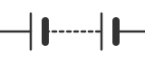 |
    | Power supply (D.C.) | 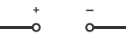 |
    | Power supply (A.C.) |  |
    | Transformer | 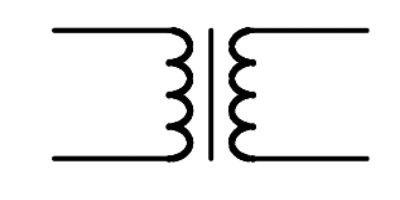 |
    | Generator | 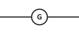 |

=== "Connections"

    | Description | Symbol |
    | :--- | :---: |
    | Conductors crossing with no connection |  |
    | Junction of conductors |  |
    | Open switch |  |

=== "Safety"

    | Description | Symbol |
    | :--- | :---: |
    | Earth or ground | 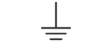 |
    | Fuse/circuit breaker | 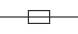 |

=== "Resistors and diodes"

    | Description | Symbol |
    | :--- | :---: |
    | Fixed resistor | 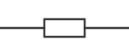 |
    | Variable resistor | 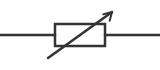 |
    | Heater |  |
    | Thermistor | 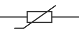 |
    | Light-dependent resistor (LDR) | 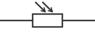 |
    | Diode | 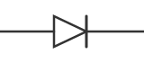 |
    | Light-emitting diode (LED) | 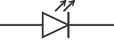 |

=== "Meters"

    | Description | Symbol |
    | :--- | :---: |
    | Ammeter | 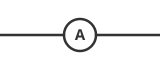 |
    | Voltmeter | 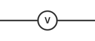 |

=== "Input / output devices"

    | Description | Symbol |
    | :--- | :---: |
    | Lamp | 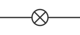 |
    | Loudspeaker | 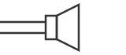 |
    | Microphone | 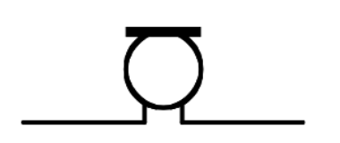 |
    | Electric bell |  |
    | Motor | 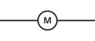 |

*Although these are the forms of circuit symbols that will be used in examination papers, there may be other internationally agreed symbols which are acceptable in student answers.*

### Thermistors and LDRs

Environmental conditions, such as temperature and light intensity, can influence the resistance of some resistors, such as thermistors and light-dependent resistors (LDRs).

#### Thermistors

The resistance of a thermistor depends on its **temperature**: it is **high** in **cold** conditions and **low** in **hot** conditions — as the temperature **increases**, the resistance of a thermistor **decreases**, and as the temperature **decreases**, its resistance **increases**.

<table>
  <thead>
    <tr>
        <th>Condition</th>
        <th>Description</th>
    </tr>
  </thead>
  <tbody>
    <tr>
        <td></td>
        <td>LOW TEMPERATURE HIGH RESISTANCE</td>
    </tr>
    <tr>
        <td></td>
        <td>HIGH TEMPERATURE LOW RESISTANCE</td>
    </tr>
  </tbody>
</table>

*The resistance of a thermistor depends on its temperature*

The relationship between resistance and temperature for a thermistor can be shown on a graph of resistance against temperature, which shows a curve indicating these quantities are inversely proportional to each other.

**THERMISTOR CIRCUIT SYMBOL:** 

#### Light-dependent resistors (LDRs)

The resistance of a **light-dependent resistor** (LDR) depends on the **light intensity** on it: it is **high** in **dark** conditions and **low** in **bright** conditions — as the light intensity **increases**, the resistance of an LDR **decreases**, and as it **decreases**, its resistance **increases**.

*The resistance of an LDR depends on the intensity of light on it*

The relationship between resistance and light intensity for an LDR can also be shown on a graph, which shows a curve indicating these quantities are inversely proportional to each other.

**LDR CIRCUIT SYMBOL:** 

### Lamps and LEDs

Lamps and light-emitting diodes (LEDs) **illuminate** (light up) when a **current** flows through them, which makes them useful for indicating the presence of a current in a circuit.

#### Light-emitting diodes (LEDs)

LEDs are a type of **diode**, meaning they only allow current to flow through them in one direction — so in a circuit, an LED will only light up if it is placed in the correct direction. The circuit symbol for an LED is as follows:

*LEDs can be used to indicate the presence of a current as they illuminate when current flows through them. The same is true for lamps*

!!! tip "Examiner Tips and Tricks"
    Make sure you learn the various symbols mentioned on this page. Many of them are very similar with small differences denoting what they do: two arrows pointing towards a symbol mean that it is **light-dependent**, while two arrows pointing away mean that it is **light-emitting**. Symbols are sometimes drawn with circles around them (e.g. the LDR) — these circles are often optional (although not in the case of meters and bulbs).

## IV graphs

### Investigating the relationship between current and voltage

In order to investigate the relationship between **current** and **voltage** of different components, the following equipment is required: an **ammeter**, to measure the current through the component; a **voltmeter**, to measure the voltage across the component; a **variable resistor**, to vary the current through the circuit; a **power source**, to provide a source of potential difference (voltage); and **wires**, to connect the components together in a circuit.

*These circuits enable current and voltage to be investigated for a filament lamp or a diode*

The **current** is the **independent variable**: the **variable resistor** is used to change the current flowing through the filament lamp or diode. The **voltage** is the **dependent variable**: the **voltmeter** is used to measure the voltage across the component. Recording measurements of current and voltage as the current increases enables an IV graph to be plotted for each component.

### Linear and non-linear IV graphs

When the voltage $V$ across a component is varied, the current $I$ flowing through it may vary **linearly** or **non-linearly** — this relationship can be shown on an IV graph. When the relationship is **linear**, the IV graph is a **straight line** which passes through the **origin**, and the resistance is **constant**. When it is **non-linear**, the IV graph is **not** a straight line, and the resistance is **not** constant.

<table>
  <thead>
    <tr>
        <th>LINEAR</th>
        <th>NON-LINEAR</th>
    </tr>
  </thead>
  <tbody>
    <tr>
        <td>STRAIGHT LINE GRAPH</td>
        <td>STRAIGHT LINE AT LOW I &amp; V</td>
    </tr>
    <tr>
        <td> </td>
        <td>CURVE</td>
    </tr>
  </tbody>
</table>

*Linear IV graphs are straight lines through the origin, indicating a constant resistance. Non-linear IV graphs are curved, indicating a variable resistance*

Components with **linear** IV graphs include fixed resistors and wires (both at constant temperature). Components with **non-linear** IV graphs include filament lamps, diodes, LDRs and thermistors.

### IV graph for a wire or a resistor

The relationship between current and voltage for a wire or fixed resistor is linear, or **directly proportional**: the IV graph is a straight line, so voltage and current increase (or decrease) by the **same** amount, and the slope of the graph is constant, so resistance is **constant**.

<table>
  <thead>
    <tr>
        <th>POTENTIAL DIFFERENCE (V)</th>
        <th>CURRENT (A)</th>
    </tr>
  </thead>
  <tbody>
    <tr>
        <td>-3</td>
        <td>-0.3</td>
    </tr>
    <tr>
        <td>-2</td>
        <td>-0.2</td>
    </tr>
    <tr>
        <td>-1</td>
        <td>-0.1</td>
    </tr>
    <tr>
        <td>0</td>
        <td>0</td>
    </tr>
    <tr>
        <td>1</td>
        <td>0.1</td>
    </tr>
    <tr>
        <td>2</td>
        <td>0.2</td>
    </tr>
    <tr>
        <td>3</td>
        <td>0.3</td>
    </tr>
  </tbody>
</table>

*The current is directly proportional to the potential difference (voltage) as the graph is a straight line through the origin*

### IV graph for a filament bulb

The relationship between current and voltage for a filament lamp is non-linear, or **not** directly proportional: the IV graph is **not** a straight line, so voltage and current do **not** increase (or decrease) by the same amount, and the slope of the graph is not constant, so resistance **changes**. As voltage increases, the current increases at a proportionally **slower** rate, and the resistance **increases** — the flatter the slope, the higher the resistance.

As the current through a filament lamp increases, its resistance **increases** because the higher current causes the **temperature** of the filament to increase, which causes the atoms in the metal lattice of the filament to **vibrate** more. This makes it more difficult for **free electrons** (the current) to pass through, increasing the resistance — and since resistance **opposes** the current, this causes it to increase at a **slower** rate.

### IV graph for a diode

A diode allows current to flow in **one** direction only — this is called **forward bias**. In the reverse direction, the diode has very **high resistance**, so **no** current flows — this is called **reverse bias**. When the current is in the direction of the arrowhead symbol, this is forward bias: on the IV graph, this is shown by a sharp increase in voltage and current on the right side of the graph, showing the resistance is very **low**. When the diode is switched around, this is reverse bias: on the IV graph, this is shown by a zero reading of current or voltage on the left side of the graph, showing the resistance is very **high**.

<table>
  <thead>
    <tr>
        <th>Potential Difference</th>
        <th>Current</th>
    </tr>
  </thead>
  <tbody>
    <tr>
        <td>Negative</td>
        <td>0</td>
    </tr>
    <tr>
        <td>Zero</td>
        <td>0</td>
    </tr>
    <tr>
        <td>Positive</td>
        <td>Exponential Increase</td>
    </tr>
  </tbody>
</table>

*IV graph for a semiconductor diode*

### Resistance

Resistance is the **opposition** to the flow of **current**: the **higher** the resistance of a circuit, the **lower** the current. Resistors come in two types: **fixed** resistors, which have a resistance that remains **constant**, and **variable** resistors, which can **change** their resistance by changing the **length** of wire that makes up the circuit — a **longer** length of wire has **more resistance** than a shorter length.

 

*Fixed and variable resistor circuit symbols*
