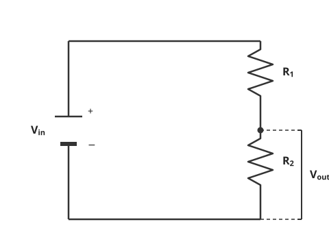

# Analysing simple circuits

## Comparing parallel and series circuits

### Advantages and disadvantages of a series circuit

A **series** circuit consists of a string of two or more components connected in a loop.

*In a series circuit, only one switch is needed to control all of the lamps. This can be seen as an advantage or as a disadvantage*

#### Advantages of a series circuit

* All of the components are controlled by a **single switch**

* Fewer wires are required

#### Disadvantages of a series circuit

* The components cannot be controlled **separately**

* If one component breaks, all other components stop working

### Advantages and disadvantages of parallel circuits

A **parallel** circuit consists of two or more components attached across **different branches** of the circuit.

*In a parallel circuit, the lamps are connected in parallel and can be switched on and off by their own switches*

#### Advantages of a parallel circuit

* The components can be **individually controlled** using their own switches

* If one component breaks, then the others will continue to function

#### Disadvantages of a parallel circuit

* Many more wires are involved, which can be more complicated to set up

* All branches have the same voltage as the supply, making it more difficult to control the voltage across individual components

!!! tip "Examiner Tips and Tricks"

    You may have noticed that for a parallel circuit, all of the components can be controlled by a single switch - like a series circuit. Nevertheless, the exam board still considers this an advantage of **series** circuits.

    Note that the current does not always split equally in a parallel circuit – often there will be more current in some branches than in others. The current in each branch will only be identical if the **resistance** of the components along each branch are identical. However, the voltage across two components connected in parallel is always the **same**

## Potential dividers

A **potential divider** is a circuit built specifically to produce a chosen fraction of the supply voltage across one component.

!!! abstract "Definition: Potential divider"
    A potential divider is **a series circuit of two or more resistive components used to split, or "divide", the supply voltage between them** — the greater a component's share of the total resistance, the greater its share of the supply voltage. It is usually built from two fixed resistors, or a fixed resistor paired with a thermistor, an LDR, or a variable resistor.

This is the same **sharing-of-voltage-in-series** rule already met in [Circuit laws](2_2_2_circuit-laws.md) — a potential divider is simply that idea turned into a deliberately-built circuit, with a second output tapped across one of the two resistors.

*In a potential divider, the supply voltage $V_{in}$ is split between $R_1$ and $R_2$. The output voltage $V_{out}$ is the fraction of $V_{in}$ that falls across $R_2$*

!!! note "Required formulae: the potential divider equation"
    $$ V_{out} = \frac{R_2}{R_1 + R_2} \times V_{in} $$

    Where $V_{in}$ is the supply voltage in volts (V), $V_{out}$ is the voltage across $R_2$ in volts (V), and $R_1$, $R_2$ are the resistances of the two components in ohms (Ω) — labelled so that $R_2$ is the one $V_{out}$ is measured across.

!!! example "Worked Example (calculation)"

    A potential divider is made from a 12 V supply and two resistors in series: $R_1 = 20\ \Omega$ and $R_2 = 40\ \Omega$.

    Calculate the output voltage $V_{out}$ taken across $R_2$.

    ??? success "Answer:"

        **Step 1: List the known quantities**

        * Supply voltage, $V_{in} = 12\text{ V}$

        * Resistance, $R_1 = 20\ \Omega$

        * Resistance, $R_2 = 40\ \Omega$

        **Step 2: State the potential divider equation**

        $$V_{out} = \frac{R_2}{R_1 + R_2} \times V_{in}$$

        **Step 3: Substitute the known values and calculate $V_{out}$**

        $$V_{out} = \frac{40}{20 + 40} \times 12 = \frac{40}{60} \times 12 = \mathbf{8\ V}$$

### Sensing circuits

A potential divider becomes a **sensing circuit** when one of its two resistors is replaced by a component whose resistance responds to a physical condition — a thermistor for temperature, or an LDR for light intensity ([Electrical components](2_2_3_electrical-components.md)). Because $V_{out}$ depends on the **ratio** of the two resistances rather than on either resistance alone, a change in $R_1$ or $R_2$ changes $V_{out}$ even though the supply voltage $V_{in}$ stays fixed — this is what makes the circuit useful as a sensor, since $V_{out}$ can be read (e.g. with a voltmeter, or fed into further circuitry) as a stand-in for the temperature or light level.

For example, take the circuit above with $R_1$ replaced by a thermistor. As the temperature **falls**, the thermistor's resistance **rises**, so $R_1$ takes up a **larger** share of the total resistance, and therefore a **larger** share of $V_{in}$ — this leaves a **smaller** share for $R_2$, so $V_{out}$ **falls**. The same reasoning applies to an LDR responding to light intensity, or to a variable resistor being adjusted by hand instead of by an environmental condition: whichever resistor's value goes up claims a bigger share of $V_{in}$, at the expense of the other.

## Analysing changes in a circuit

When one component in a circuit changes resistance — a thermistor or LDR responding to a change in its environment ([Electrical components](2_2_3_electrical-components.md)), or a variable resistor being adjusted by hand — the current, voltage and resistance readings elsewhere in the circuit can change too, not just at that one component. **How** they change depends on whether the component sits in a series or a parallel arrangement.

### Changes in a series circuit

In a series circuit, current has the same value at every point in the loop ([Circuit laws](2_2_2_circuit-laws.md)), so a resistance change in **any one** component changes the current **everywhere** in the circuit, not just at that component. If a component's resistance **increases**, the total resistance of the circuit increases, and — since the supply voltage doesn't change — the current throughout the whole circuit **decreases** (and vice versa if its resistance decreases).

The voltage across each component follows from this. For a component whose resistance hasn't changed, its voltage **decreases** in the same direction as the current, since $V = I \times R$ with $R$ fixed. For the component whose resistance **did** change, the effect is the opposite: the potential-divider reasoning above still applies, so a component that has become a bigger share of the total resistance also becomes a bigger share of the (unchanged) supply voltage — its own voltage **increases**, even though the current through it has fallen.

!!! example "Worked Example (method)"

    An LDR and a fixed resistor are connected in series across a battery of fixed voltage. The light level on the LDR increases from dark to bright.

    Describe what happens to the current in the circuit and to the voltage across each component.

    ??? success "Answer:"

        **Step 1: State how the LDR's resistance changes**

        As light intensity increases, the resistance of an LDR **decreases** ([Electrical components](2_2_3_electrical-components.md)).

        **Step 2: Work out how the total resistance of the circuit changes**

        The total resistance of a series circuit is the sum of the individual resistances. Since the LDR's resistance has fallen and the fixed resistor's resistance hasn't changed, the total resistance of the circuit **decreases**.

        **Step 3: Work out how the current changes**

        The battery's voltage hasn't changed, and current is the same at every point in a series circuit. Since $I = \frac{V}{R}$ and the total resistance has fallen while the voltage stays fixed, the current **increases** throughout the whole circuit.

        **Step 4: Work out how the voltage across the fixed resistor changes**

        The fixed resistor's own resistance hasn't changed, but the current through it has increased. Since $V = I \times R$, the voltage across the fixed resistor **increases**.

        **Step 5: Work out how the voltage across the LDR changes**

        The supply voltage is shared between the two components, and hasn't itself changed. Since the voltage across the fixed resistor has increased, the voltage across the LDR must **decrease** to compensate — consistent with the LDR now holding a smaller share of the total resistance.

### Changes in a parallel circuit

In a parallel circuit, each branch has the same voltage as the supply, regardless of what happens elsewhere in the circuit ([Circuit laws](2_2_2_circuit-laws.md)). This means a resistance change in one branch does **not** change the voltage across any branch, including its own. What **does** change is the current: the branch containing the component itself sees its own current change (since $I = \frac{V}{R}$, with $V$ fixed for that branch, a change in $R$ changes $I$ inversely), and the **total** current drawn from the supply changes too, since it's the sum of all the branch currents. Components in any **other**, unaffected branch see no change at all — their own voltage and resistance are both unchanged, so their current stays the same.

!!! example "Worked Example (explanation)"

    A thermistor and a lamp with a fixed resistance are connected in parallel, forming two separate branches across the same battery.

    Explain what happens to the current in each branch, and to the total current drawn from the battery, as the temperature around the thermistor increases.

    ??? success "Model answer:"

        As temperature increases, the resistance of the thermistor decreases ([Electrical components](2_2_3_electrical-components.md)). Because the thermistor and the lamp are connected in parallel, the voltage across each branch is always equal to the supply voltage, regardless of what happens in the other branch — so the voltage across the thermistor doesn't change, and neither does the voltage across the lamp.

        With a lower resistance and an unchanged voltage, the current through the thermistor branch **increases** ($I = \frac{V}{R}$). The lamp's branch is unaffected by this: its own resistance and voltage are both unchanged, so the current through it stays the same. However, since the thermistor branch is now drawing more current than before, the **total** current drawn from the battery — the sum of the two branch currents — also **increases**.
