# Electric Circuits

## Electrical Quantities

### Charge & Current

#### Current

#### Definition

* Electric current is defined as **The rate of flow of electric charge**

* Current is measured in units of **amperes** or **amps (A)**

    - 1 amp is equivalent to a charge of 1 coulomb flowing in 1 second, or 1 A = 1 C/s

* This means the size of an electric current is the amount of charge passing through a component each second

* Current flows

    - when a **circuit** is formed e.g. when a wire connects the two oppositely charged terminals of a cell

    - from the **positive** terminal to the **negative** terminal of a cell


*Charge flows from the positive terminal to the negative terminal*

#### Measuring current

* Current can be measured using an **ammeter**

* Ammeters must be connected in **series** with the component being measured

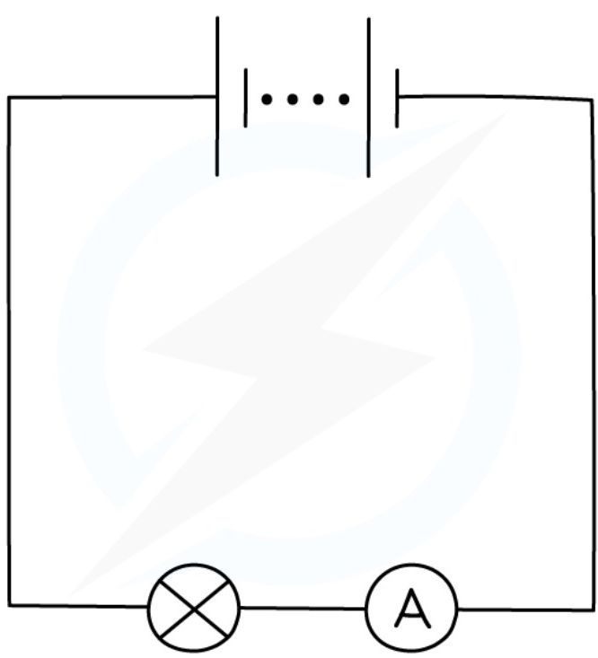

*An ammeter can be used to measure the current around a circuit*

#### Charge

* The wires in an electric circuit are made of **metal** because it is a good **conductor** of electric **current**

* In the wires, the current is a flow of **negatively charged electrons**

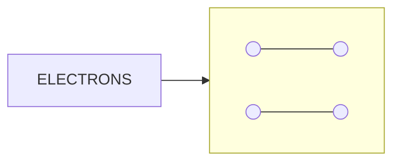
*(Note: The diagram above represents a flow of electrons through a metal lattice. Large blue circles represent metal ions, and small green circles represent electrons moving towards the positive terminal.)*

<table>
  <thead>
    <tr>
        <th colspan="2">Legend</th>
    </tr>
  </thead>
  <tbody>
    <tr>
        <td>Large Blue Circle</td>
        <td>= METAL ION</td>
    </tr>
    <tr>
        <td>Small Green Circle</td>
        <td>= ELECTRON</td>
    </tr>
  </tbody>
</table>

*In metal wires, the current is a flow of negatively charged electrons. When a voltage is applied, electrons flow through the lattice of metal ions*

!!! tip "Examiner Tips"

    You should always consider current to be the flow of **positive** charge i.e. from the positive terminal to the negative terminal of a cell. This is known as **conventional current**.

    This is in the opposite direction to **electron flow**, which is the flow of negatively charged electrons from the negative terminal to the positive terminal of a cell.

    This is the convention we use because scientists defined conventional current before they discovered the electron

    

#### Calculating electric charge

* Current, charge and time are related by the equation:

charge = current × time

$$ Q = I \times t $$

* Where:

    * Q = charge, measured in coulombs (C)

    * I = current, measured in amps (A)

    * t = time, measured in seconds (s)

* The current, charge and time equation can be rearranged with the help of the following formula triangle:

!!! note "current charge time formula triangle"

    ```mermaid
    graph TD
        A[CHARGE (Q)] --- B[CURRENT (I)]
        A --- C[TIME (t)]
        B --- C
    ```


    *Formula triangle for the charge, current and time equation*

!!! example "Worked Example"

    When will 8 A of current pass through an electrical circuit?

    **A.** When 8 J of energy is used by 1 C of charge

    **B.** When a charge of 4 C passes in 0.5 s

    **C.** When a charge of 8 C passes in 0.1 s

    **D.** When a charge of 1 C passes in 8 s

    ??? note "Answer :" 
        
        B

        * The equation relating current, charge and time is:

        $$Q = I \times t$$

        * Rearrange to make current $I$ the subject of the equation:

        $$I = \frac{Q}{t}$$

        * Consider option **B**, where Q = 4 C and t = 0.5 s:

        $$I = \frac{4}{0.5} = 8\text{ A}$$

        * Therefore, the correct answer is **B**

        **A** is incorrect as this is the definition of a voltage of 8 V between two points and does not describe current

        **C** is incorrect as $$ I = \frac{8}{0.1} = 80 \text{ A} $$


        **D** is incorrect as $$ I = \frac{1}{8} = 0.125 \text{ A} $$

!!! tip "Examiner Tips and Tricks"

    Electric currents in everyday circuits tend to be quite small, so it's common for examiners to throw in a **unit prefix** like 'm' next to quantities of current, e.g. 10 mA (10 milliamperes). Make sure you can convert these into standard units, e.g. 10 mA = 10 × 10<sup>-3</sup> A.

    Make sure to only use the triangle to help you **rearrange** the equation that links charge, current and time. Don't draw it if you are asked to write out the equation in full, such as $Q = I \times t$, as you may lose marks for doing so.

    Check out this revision note on [speed, distance and time](https://www.savemyexams.com/igcse/physics/edexcel/19/revision-notes/1-forces-and-motion/1-1-movement-and-position/1-1-2-speed/) if you need a reminder on how to use formula triangles.

### Voltage & Energy

### Definition
* Voltage is defined as

> **The energy transferred per unit charge passing between two points**

* Voltage is measured in units of **volts (V)**

    - 1 volt is equivalent to the transfer of 1 joule of energy by 1 coulomb of charge, or 1 V = 1 J/C

* The terminals of a cell make one end of the circuit **positive** and the other **negative**

* As electrons flow through a cell, they **gain** energy

    - For example, in a 12 V cell, every coulomb of charge passing through gains 12 J of energy

* As electrons flow through a circuit, they **lose** energy

    - For example, after leaving the 12 V cell, each coulomb of charge will transfer 12 J of energy to the wires and components in the circuit


*Electrons gain energy as they pass through a cell. As they flow through the light bulb, energy is transferred to the surroundings by heating and radiation*

### Measuring voltage

* Voltage can be measured using a **voltmeter**

* Voltmeters must be set up in **parallel** with the component being measured

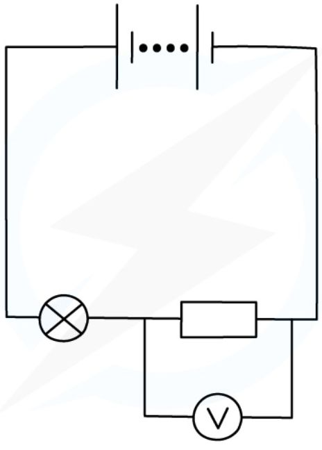

Voltage can be measured by connecting a voltmeter in parallel between two points in a circuit

!!! tip "Examiner Tips and Tricks"
    > When you are building a circuit in class, always **connect the voltmeter last**. Make the whole circuit first and check it works, and then connect the voltmeter so that the leads are on each side of the component you are measuring. This will save you a lot of time waiting for your teacher to troubleshoot your circuit!
    >
    > 

    > You might sometimes see voltage called potential difference. This term can be useful when thinking about voltmeters as the potential difference describes a **difference** between **two points**, therefore the voltmeter has to be connected between **two** points in the circuit.

### Calculating voltage

* The equation linking the energy transferred, voltage and charge is given below:

energy transferred = charge × voltage

$$ E = Q \times V $$

* Where:
    

    - E = energy transferred, measured in joules (J)
    

    - Q = charge moved, measured in coulombs (C)
    

    - V = voltage, measured in volts (V)

* This can be rearranged using the formula triangle below:

!!! note "Energy charge voltage formula triangle"

    ```mermaid
    graph TD
        A[ENERGYTRANSFERRED(E)] --- B[VOLTAGE (V)]
        A --- C[CHARGE (Q)]
        B --- C
    ```

    *Formula triangle for the energy transferred, voltage and charge equation*

    * Check out this revision note on [speed, distance and time](https://www.savemyexams.com/igcse/physics/edexcel/19/revision-notes/1-forces-and-motion/1-1-movement-and-position/1-1-2-speed/) if you need a reminder on how to use formula triangles

!!! example "Worked Example"

    The normal operating voltage for a lamp is 6 V.

    Calculate how much energy is transferred in the lamp when 4200 C of charge flows through it.

    ??? note "Answer :"

        **Step 1: List the known quantities**

        * Voltage, $V = 6\text{ V}$

        * Charge, $Q = 4200\text{ C}$

        **Step 2: State the equation linking potential difference, energy and charge**

        * The equation linking potential difference, energy and charge is:

        $$E = Q \times V$$

        **Step 3: Substitute the known values and calculate the energy transferred**

        $$E = 6 \times 4200 = 25\ 200\text{ J}$$

        * Therefore, **25 200 J** of energy is transferred in the lamp

!!! tip "Examiner Tips and Tricks"

    Don't be confused by the symbol for voltage (the **symbol** V) being the same as its unit (the **volt**, V). Learn the equation and remember especially that one volt is equivalent to 'a joule per coulomb'.


### Resistance

#### Calculating current, resistance & potential difference

* Resistance is defined as **The opposition of a component to the flow of electric current through it**

* Resistance is measured in units of **ohms (Ω)**

    - A resistance of 1 Ω is equivalent to a voltage across a component of 1 V which produces a current of 1 A through it

* The resistance of a component controls the size of the current in a circuit

* For a given voltage across a component:

    - The **higher** the resistance, the **lower** the current that can flow

    - The **lower** the resistance, the **higher** the current that can flow

* All electrical components, including wires, have some value of resistance

* Wires are often made from copper because it has a **low** electrical resistance

    - This is why it is known as a **good conductor**

#### Comparing current and resistance

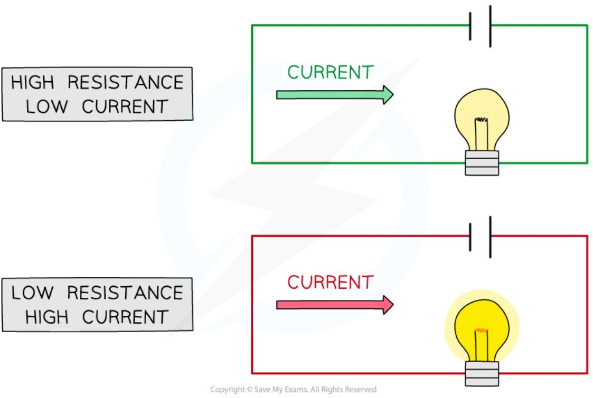

***A greater resistance means there is a lower current and vice versa***

* The current, resistance and potential difference of a component in a circuit are calculated using the equation:

$$ \text{voltage} = \text{current} \times \text{resistance} $$

$$V = I \times R$$

* Where:
    
    * $V$ = voltage, measured in volts (V)
    
    * $I$ = current, measured in amps (A)

    * $R$ = resistance, measured in ohms ($\Omega$)

* This equation is sometimes called Ohm's law

* It can be rearranged with the help of the following formula triangle:

!!! note "Voltage current resistance formula triangle"

    <table>
    <thead>
        <tr>
            <th colspan="2">VOLTAGE (V)</th>
        </tr>
    </thead>
    <tbody>
        <tr>
            <td>CURRENT (I)</td>
            <td>RESISTANCE (R)</td>
        </tr>
    </tbody>
    </table>

    *Formula triangle for the voltage, current and resistance equation*

    * Check out this revision note on [speed, distance and time](https://www.savemyexams.com/igcse/physics/edexcel/19/revision-notes/1-forces-and-motion/1-1-movement-and-position/1-1-2-speed/) if you need a reminder on how to use formula triangles

!!! example "Worked Example"

    Calculate the voltage across a resistor of resistance 10 $\Omega$ if there is a current of 0.3 A through it.

    ??? note "Answer :"

        **Step 1: List the known quantities**

        * Resistance, $R = 10\ \Omega$

        * Current, $I = 0.3\ A$

        **Step 2: Write the equation relating resistance, potential difference and current**

        $$V = I \times R$$


        **Step 3: Substitute in the values**

        $V = 0.3 \times 10 = \mathbf{3\ V}$

!!! tip "Examiner Tips and Tricks"

    In exam questions, the resistance of the wires, batteries, ammeters and voltmeters are always assumed to be **zero** (in the case of voltmeters, they have extremely high resistances so that current does not flow through them, and this has a negligible effect on the overall resistance of the circuit)

## Circuit laws

* There are two ways of joining electrical components:
    

    * in **series**
    

    * in **parallel**

### Current in series

* A **series** circuit is a circuit that has only one loop, or one path that the electrons can take

* In a series circuit, the current has the **same value at any point**
    

    * This is because the electrons have only one path they can take
    

    * Therefore, the number of electrons passing a fixed point per unit time is the same at all locations

* This means that **all** components in a series circuit have the same current

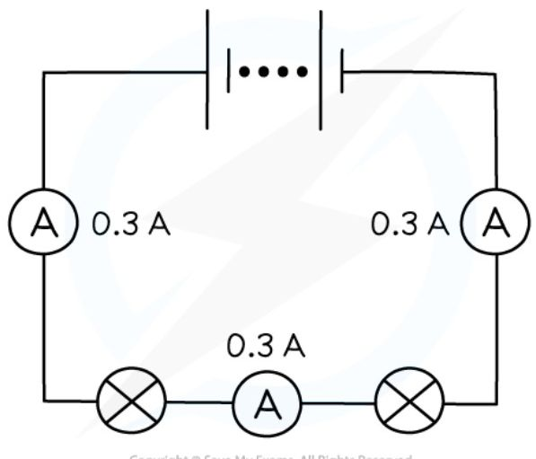

*The current is the same at each point in a series circuit*

* The amount of current flowing in a series circuit depends on:
    

    * the **voltage** of the power source
    

    * the **number** (and type) of components

* **Increasing** the **voltage** of the power source drives **more current** around the circuit
    

    * So, decreasing the voltage of the power source reduces the current

* **Increasing** the **number** of components in the circuit **increases** the **total resistance**
    

    * Hence **less current** flows through the circuit


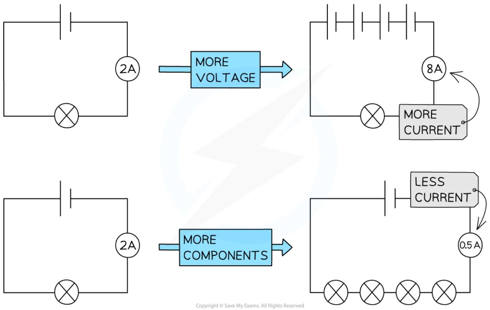

*Current will increase if the voltage of the power supply increases and decreases if the number of components increases*

### Current in parallel

* A parallel circuit is a circuit that has two or more loops, or more than one path that electrons can take

* Parallel circuits contain **junctions** and **branches**

    - Junctions are points where two or more wires meet to form a new branch

    - Branches are the sections of wire between junctions

* In a parallel circuit, the current has different values at different points in the circuit

    - This is because the current **splits** at a junction

    - Therefore, the electrons have different paths they can take

* The **sum** of the current in the **individual** branches is equal to the total current before (and after) the branches

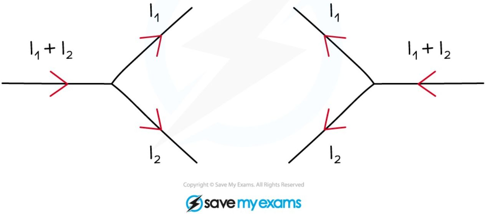

*Current splits at a junction into individual branches*

* At a junction, the current is always **conserved**

    * This means the amount of current flowing into the junction is equal to the amount of current flowing out of it

    * This is because the **charge** is conserved

* Current does not always split equally – often there will be more current in some branches than in others

    * The current in each branch will only be identical if the resistance of the components along each branch is **identical**

* Current behaves in this way because it is the **flow of electrons**:

    * Electrons, or any charge, cannot be created or destroyed

    * This means the total number of electrons (and hence current) going around a circuit must remain the same

    * When the electrons reach a junction, however, some of them will go one way and the rest will go the other

!!! example "Worked Example"

    In the circuit below, ammeter A<sub>0</sub> shows a reading of 10 A, and ammeter A<sub>1</sub> shows a reading of 6 A.

    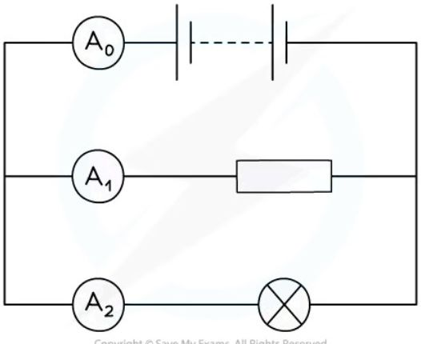


    What is the reading on ammeter A<sub>2</sub>?

    ??? note "Answer :"

        **Step 1:** Recall what happens to the current at a junction

        * At a junction, the current splits, but is always conserved

        * This means that the total amount of current flowing into a junction is equal to the total amount flowing out

        **Step 2:** Consider the first junction in the circuit where the current splits

        * The diagram below shows the first junction in the circuit

        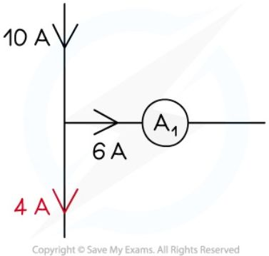

        **Step 3:** Calculate the missing amount of current

        * Since 10 A flows into the junction (the total current from the battery), 10 A must flow out of the junction

        * The question says that 6 A flows through ammeter A<sub>1</sub> so the remaining current flowing through ammeter A<sub>2</sub> must be:

        $$ 10\text{ A} - 6\text{ A} = 4\text{ A} $$

        * Therefore, **4 A** flows through ammeter A<sub>2</sub>

!!! tip "Examiner Tips and Tricks"

    The direction of current flow is super important when considering junctions in a circuit.

    You should remember that current flows from the **positive** terminal to the **negative** terminal of a cell / battery. This will help determine the direction current is flowing 'in' to a junction and which way the current then flows 'out'.

    ```mermaid
    graph LR
        A[+] --- B[CONDUCTOR]
        B --- C[-]
        subgraph " "
        direction LR
        D[FLOW OF CHARGE] --> E[ ]
        style E fill:none,stroke:none
        end
        style A fill:#f28b82,stroke:#000
        style B fill:#bdbdbd,stroke:#000
        style C fill:#81d4fa,stroke:#000
        style D fill:#b9f6ca,stroke:#000
    ```

### Voltage in series

* In a series circuit, the **total voltage** of a power supply is **shared** between the components

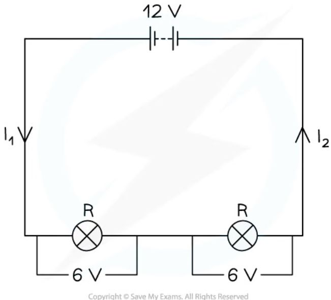

*Lamps connected in a series circuit share the potential difference from the battery*

* For two identical components (with equal resistance), the voltage across them will be:

    * the **same**

    * equal to **half the total voltage** of the power supply

* For two non-identical components (with different values of resistance), the voltage will be:

    * **higher** across the component with the higher resistance

    * **lower** across the component with lower resistance

### Voltage in parallel

* In a parallel circuit, the **total voltage** across each branch is the **same** as the voltage of the power supply

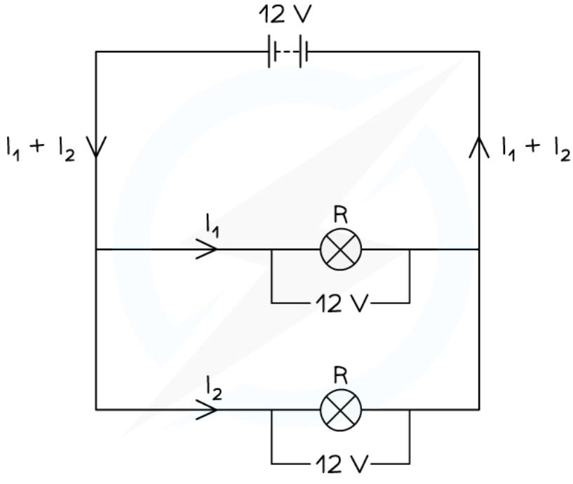


*Lamps connected in a parallel circuit all have the same voltage across them*

### Comparing parallel and series circuits

### Advantages and disadvantages of a series circuit

* A **series** circuit consists of a string of two or more components connected in a loop

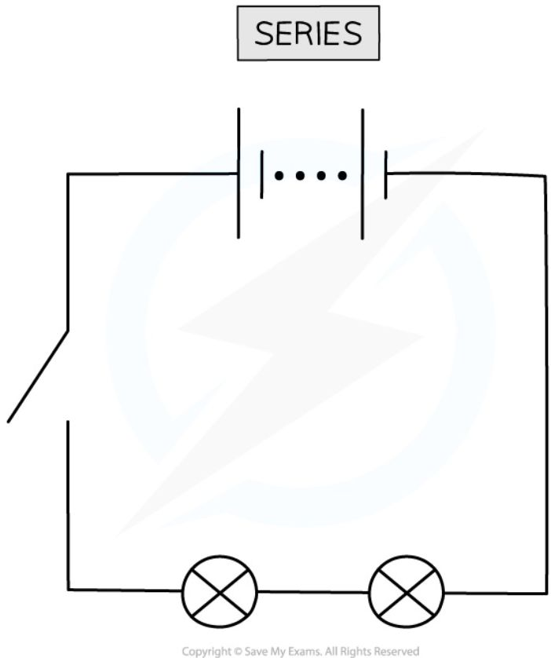

*In a series circuit, only one switch is needed to control all of the lamps. This can be seen as an advantage or as a disadvantage*

#### Advantages of a series circuit

* All of the components are controlled by a **single switch**

* Fewer wires are required

#### Disadvantages of a series circuit

* The components cannot be controlled **separately**

* If one component breaks, all other components stop working

### Advantages and disadvantages of parallel circuits

* A **parallel** circuit consists of two or more components attached across **different branches** of the circuit

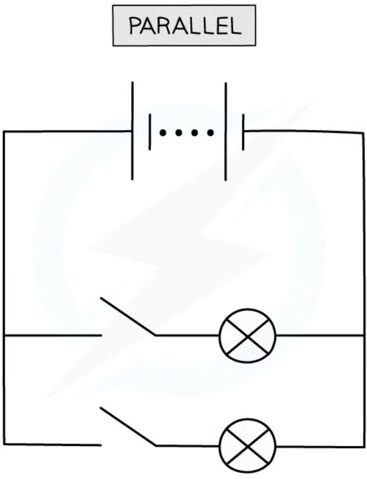

*In a parallel circuit, the lamps are connected in parallel and can be switched on and off by their own switches*

#### Advantages of a parallel circuit

* The components can be **individually controlled** using their own switches

* If one component breaks, then the others will continue to function

#### Disadvantages of a parallel circuit

* Many more wires are involved which can be more complicated to set up

* All branches have the same voltage as the supply making it more difficult to control the voltage across individual components

!!! tip "Examiner Tips and Tricks"

    You may have noticed that for a parallel circuit, all of the components can be controlled by a single switch - like a series circuit. Nevertheless, the exam board still considers this an advantage of **series** circuits.

    Note that the current does not always split equally in a parallel circuit – often there will be more current in some branches than in others. The current in each branch will only be identical if the **resistance** of the components along each branch are identical. However, the voltage across two components connected in parallel is always the **same**

### Resistors in Series

* When two or more resistors are connected in series, the **total resistance** is equal to the **sum** of their individual resistances

* For two resistors of resistance $R_1$ and $R_2$, the total resistance can be calculated using the equation:

$$R = R_1 + R_2$$

* Where:

    * $R$ is the total resistance, in ohms ($\Omega$)

* Increasing the number of resistors **increases** the overall resistance

    * The charge now has **more** resistors to pass through

* The **total voltage** is also the **sum** of the voltages across each of the individual resistors

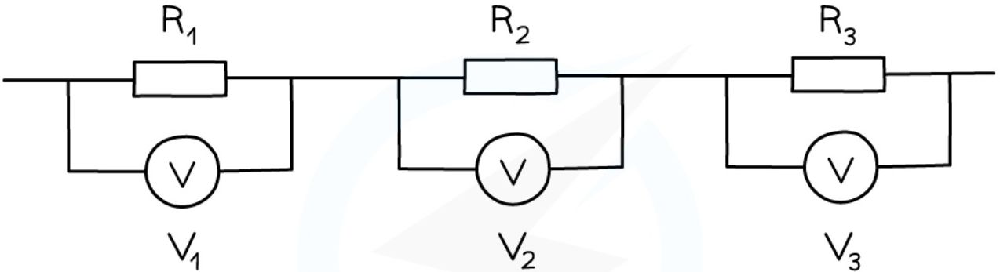

> TOTAL VOLTAGE $= V_1 + V_2 + V_3$
>
> COMBINED RESISTANCE $= R_1 + R_2 + R_3$

*Three resistors connected in series. The total voltage is the sum of the individual voltages, and the total resistance is the sum of the three individual resistances*

### Summary of series and parallel circuits

* For components connected in **series**:

    * the **current** is the same at all points and in each component

    * the **voltage** of the power supply is shared between the components

    * the **total resistance** is the sum of the resistances of each component

* For components connected in **parallel**:
    
    * the **current** from the supply splits in the branches

    * the **voltage** across each branch is the same

    * the **total resistance** is less than that of each component

!!! example "Worked Example"

    The combined resistance $R$ in the following series circuit is 60 Ω.

    What is the resistance value of $R_2$?

    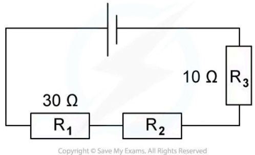

    **A** 100 Ω      **B** 30 Ω      **C** 20 Ω      **D** 40 Ω

    ??? note "Answer :"
        
        C

        **Step 1:** Write down the equation for the combined resistance in series

        $$R = R_1 + R_2 + R_3$$

        **Step 2:** Substitute the values for total resistance $R$ and the other resistors

        $$60\ \Omega = 30\ \Omega + R_2 + 10\ \Omega$$

        **Step 3:** Rearrange for $R_2$

        $$R_2 = 60\ \Omega - 30\ \Omega - 10\ \Omega = \mathbf{20\ \Omega}$$

!!! example "Worked Example"
    Dennis sets up a series circuit as shown below.

    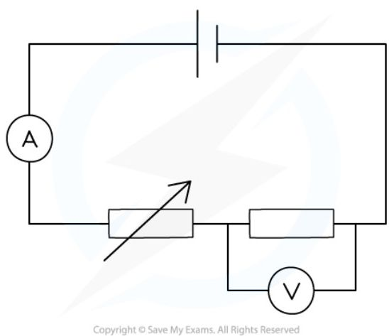


    The cell supplies a current of 2 A to the circuit, and the fixed resistor has a resistance of 4 Ω.

    (a) How much current flows through the fixed resistor?

    (b) What is the reading on the voltmeter?

    ??? note "Answer :"
        Part (a)

        Step 1: Recall that current is conserved in a series circuit

        * Since current is conserved in a series circuit, it is the same size if measured anywhere in the series loop

        * This means that since the cell supplies 2 A to the circuit, the current is 2 A everywhere

        * Therefore, **2 A** flows through the fixed resistor

        Part (b)

        Step 1: List the known quantities

        * Current, $I = 2\text{ A}$

        * Resistance, $R = 4\text{ }\Omega$

        Step 2: State the equation linking potential difference, resistance and current

        * The equation linking potential difference, resistance and current is:

        $$V = I \times R$$

        Step 3: Substitute the known values into the equation and calculate the potential difference

        $$V = 2 \times 4 = 8\text{ V}$$

        * Therefore, the voltmeter reads **8 V** across the fixed resistor

## IV Graphs

* When the voltage V across a component is varied, the current I flowing through it may vary **linearly** or **non-linearly**

* The relationship between current and voltage of a component can be shown on an IV graph

* When the relationship between current and voltage is **linear**:

    * the IV graph is a **straight line** which passes through the **origin**

    * the resistance is **constant**

* When the relationship between current and voltage is **non-linear**:

    * the IV graph that is **not** a straight line

    * the resistance is **not** constant

### Linear and non-linear IV graphs

<table>
  <thead>
    <tr>
        <th>LINEAR</th>
        <th>NON-LINEAR</th>
    </tr>
  </thead>
  <tbody>
    <tr>
        <td>STRAIGHT LINE GRAPH</td>
        <td>STRAIGHT LINE AT LOW I &amp; V</td>
    </tr>
    <tr>
        <td> </td>
        <td>CURVE</td>
    </tr>
  </tbody>
</table>

*Linear IV graphs are straight lines through the origin, indicating a constant resistance. Non-linear IV graphs are curved, indicating a variable resistance*

* Components with **linear** IV graphs include:

    * fixed resistors (at constant temperature)

    * wires (at constant temperature)

* Components with **non-linear** IV graphs include:

    * filament lamps

* diodes
* LDRs
* thermistors

### IV graph for a wire or a resistor

* The relationship between current and voltage for a wire or fixed resistor is linear, or **directly proportional**, which means

    - the IV graph is a straight line, so voltage and current increase (or decrease) by the **same** amount
    
    - the slope of the graph is constant, so resistance is **constant**

<table>
  <thead>
    <tr>
        <th>POTENTIAL DIFFERENCE (V)</th>
        <th>CURRENT (A)</th>
    </tr>
  </thead>
  <tbody>
    <tr>
        <td>-3</td>
        <td>-0.3</td>
    </tr>
    <tr>
        <td>-2</td>
        <td>-0.2</td>
    </tr>
    <tr>
        <td>-1</td>
        <td>-0.1</td>
    </tr>
    <tr>
        <td>0</td>
        <td>0</td>
    </tr>
    <tr>
        <td>1</td>
        <td>0.1</td>
    </tr>
    <tr>
        <td>2</td>
        <td>0.2</td>
    </tr>
    <tr>
        <td>3</td>
        <td>0.3</td>
    </tr>
  </tbody>
</table>

*The current is directly proportional to the potential difference (voltage) as the graph is a straight line through the origin*

### IV graph for a filament bulb

* The relationship between current and voltage for a filament lamp is non-linear, or **not** directly proportional, which means
    

    - the IV graph is **not** a straight line, so voltage and current do **not** increase (or decrease) by the same amount
    

    - the slope of the graph is not constant, so resistance **changes**

* The IV graph for a filament lamp shows as voltage increases
    

    - the current increases at a proportionally **slower** rate
    

    - the resistance **increases**; the flatter the slope, the higher the resistance

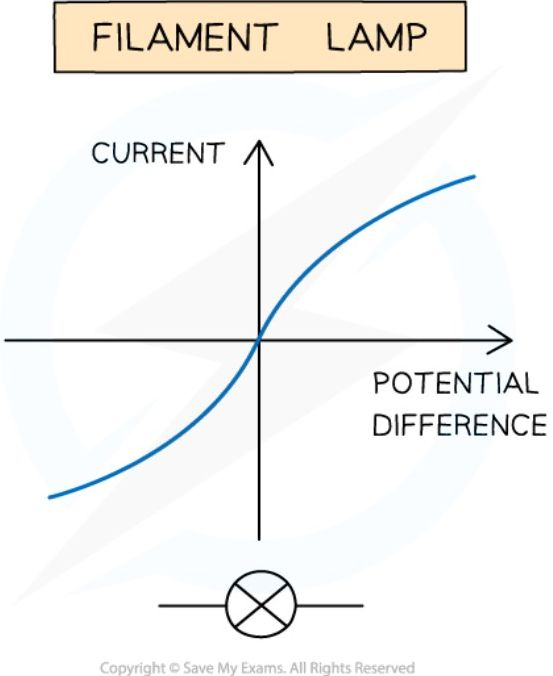

* As current through a filament lamp increases, the resistance **increases** because:

    - the higher current causes the **temperature** of the filament to increase

    - the higher temperature causes the atoms in the metal lattice of the filament to **vibrate** more

    - this causes an increase in resistance as it becomes more difficult for **free electrons** (the current) to pass through

    - since resistance **opposes** the current, this causes it to increase at a **slower** rate

### IV graph for a diode

* A diode allows current to flow in **one** direction only

    - This is called **forward bias**

* In the reverse direction, the diode has very **high resistance**, and therefore **no** current flows

    - This is called **reverse bias**

* When the current is in the direction of the arrowhead symbol, this is **forward bias**

    - On the IV graph, this is shown by a sharp increase in voltage and current on the right side of the graph

    - This shows the resistance is very **low**

* When the diode is switched around, this is **reverse bias**

    - On the IV graph, this is shown by a zero reading of current or voltage on the left side of the graph

    - This shows the resistance is very **high**

<table>
  <thead>
    <tr>
        <th>Potential Difference</th>
        <th>Current</th>
    </tr>
  </thead>
  <tbody>
    <tr>
        <td>Negative</td>
        <td>0</td>
    </tr>
    <tr>
        <td>Zero</td>
        <td>0</td>
    </tr>
    <tr>
        <td>Positive</td>
        <td>Exponential Increase</td>
    </tr>
  </tbody>
</table>

*IV graph for a semiconductor diode*

### Investigating the relationship between current and voltage

* In order to investigate the relationship between **current** and **voltage** of different components, the following equipment is required:

    * an **ammeter** - to measure the current through the component

    * a **voltmeter** - to measure the voltage across the component

    * a **variable resistor** - to vary the current through the circuit

    * a **power source** - to provide a source of potential difference (voltage)

    * **wires** - to connect the components together in a circuit

* The image below shows the circuits set up to obtain *IV* graphs for a filament lamp and a diode

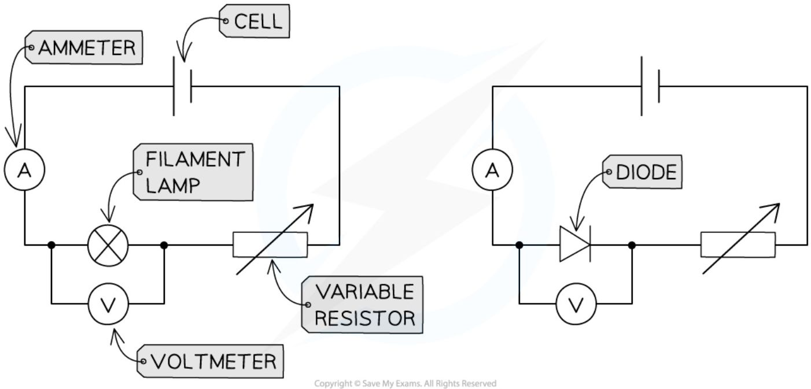

These circuits enable the investigation of current and voltage for a filament lamp or diode to be investigated


* The **current** is the **independent variable**

    - The **variable resistor** is used to change the current flowing through the filament lamp / diode

* The **voltage** is the **dependent variable**

    - The **voltmeter** is used to measure the voltage across the filament lamp / diode

* Recording measurements of current and voltage as the current increases enables an IV graph to be plotted for each component

### Resistance

* Resistance is the **opposition** to the flow of **current**

    - The **higher** the resistance of a circuit the **lower** the current

* Resistors come in two types:

    - **Fixed** resistors

    - **Variable** resistors

* Fixed resistors have a resistance that remains **constant**

* Variable resistors can **change** the resistance by changing the **length** of wire that makes up the circuit

    - A **longer** length of wire has **more resistance** than a shorter length of wire

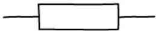 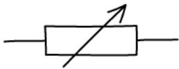
RESISTOR VARIABLE RESISTOR

*Fixed and variable resistor circuit symbols*

## Electrical Components

### Thermistors & LDRs

* Environmental conditions, such as temperature and light intensity, can influence the resistance of resistors, such as

    * Thermistors

    * Light-dependent resistors (LDRs)

#### Thermistors

* The resistance of a thermistor depends on its **temperature**

* The resistance of a thermistor is **high** in **cold** conditions and **low** in **hot** conditions

    * As the temperature **increases** the resistance of a thermistor **decreases**

    * As the temperature **decreases** the resistance of a thermistor **increases**

<table>
  <thead>
    <tr>
        <th>Condition</th>
        <th>Description</th>
    </tr>
  </thead>
  <tbody>
    <tr>
        <td></td>
        <td>LOW TEMPERATURE<br/>HIGH RESISTANCE</td>
    </tr>
    <tr>
        <td></td>
        <td>HIGH TEMPERATURE<br/>LOW RESISTANCE</td>
    </tr>
  </tbody>
</table>

*The resistance of a thermistor depends on its temperature*

* The relationship between resistance and temperature for a thermistor can be shown on a graph


**THERMISTOR GRAPH**

<table>
  <thead>
    <tr>
        <th>Temperature</th>
        <th>Resistance</th>
    </tr>
  </thead>
  <tbody>
    <tr>
        <td>Low Temperature</td>
        <td>High Resistance</td>
    </tr>
    <tr>
        <td>High Temperature</td>
        <td>Low Resistance</td>
    </tr>
  </tbody>
</table>

**THERMISTOR CIRCUIT SYMBOL:** 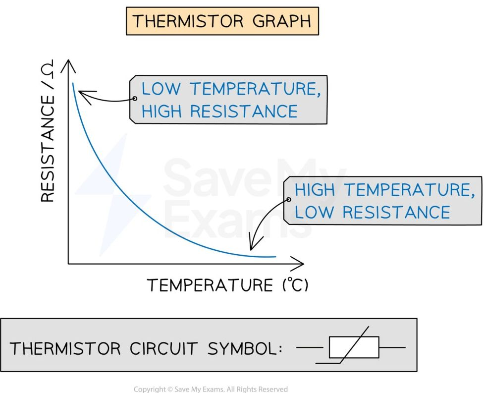

*The graph of resistance against temperature for a thermistor shows a curve indicating these quantities are inversely proportional to each other*

#### Light-dependent resistors (LDRs)

* The resistance of a **light-dependent resistor** (LDR) depends on the **light intensity** on it

* The resistance of an LDR is **high** in **dark** conditions and **low** in **bright** conditions

    * As the light intensity **increases** the resistance of an LDR **decreases**

    * As the light intensity **decreases** the resistance of an LDR **increases**

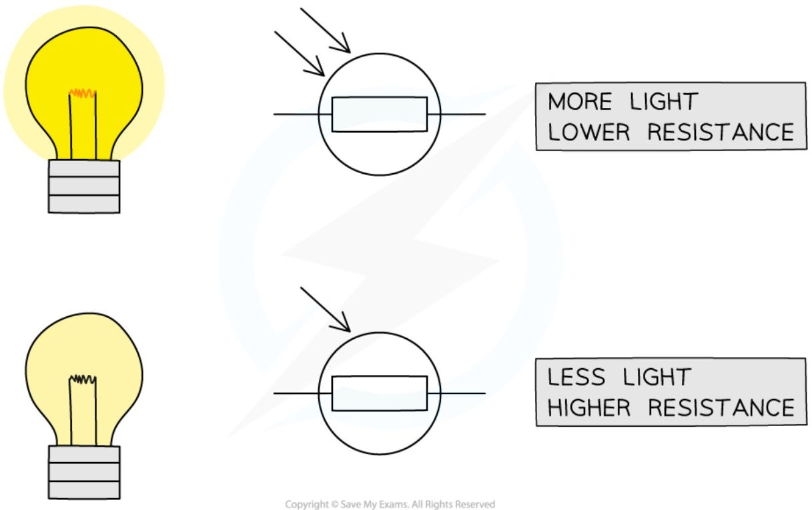

*The resistance of an LDR depends on the intensity of light on it*

* The relationship between resistance and light intensity for an LDR can be shown on a graph

LDR GRAPH

<table>
  <thead>
    <tr>
        <th>Light Intensity</th>
        <th>Resistance</th>
    </tr>
  </thead>
  <tbody>
    <tr>
        <td>LOW LIGHT INTENSITY</td>
        <td>HIGH RESISTANCE</td>
    </tr>
    <tr>
        <td>HIGH LIGHT INTENSITY</td>
        <td>LOW RESISTANCE</td>
    </tr>
  </tbody>
</table>

LDR CIRCUIT SYMBOL: 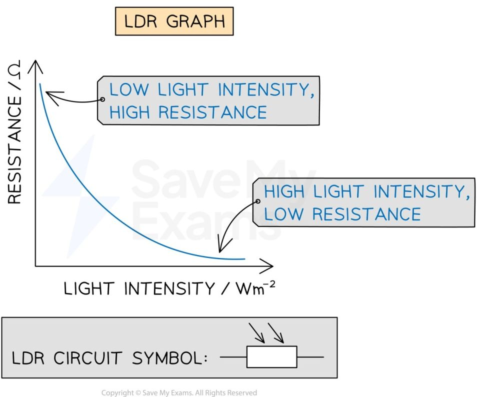

*The graph of light intensity against temperature for an LDR shows a curve indicating these quantities are inversely proportional to each other*

!!! tip "Examiner Tips and Tricks"

    Here is a list of all the circuit symbols you need to know for your exam:

    **Electrical symbols**

    <table>
    <tbody>
        <tr>
            <td>Cell</td>
            <td></td>
        </tr>
        <tr>
            <td>Battery of cells</td>
            <td></td>
        </tr>
        <tr>
            <td> </td>
            <td>or</td>
        </tr>
        <tr>
            <td> </td>
            <td></td>
        </tr>
        <tr>
            <td>Power supply</td>
            <td></td>
        </tr>
        <tr>
            <td>D. C. power supply</td>
            <td></td>
        </tr>
        <tr>
            <td>A. C. power supply</td>
            <td></td>
        </tr>
        <tr>
            <td>Fixed resistor</td>
            <td></td>
        </tr>
        <tr>
            <td>Variable resistor</td>
            <td></td>
        </tr>
        <tr>
            <td>Thermistor</td>
            <td></td>
        </tr>
        <tr>
            <td>Light-dependent resistor</td>
            <td></td>
        </tr>
        <tr>
            <td>Heater</td>
            <td></td>
        </tr>
        <tr>
            <td>Potential divider</td>
            <td></td>
        </tr>
        <tr>
            <td>Transformer</td>
            <td></td>
        </tr>
        <tr>
            <td>Magnetising coil</td>
            <td></td>
        </tr>
        <tr>
            <td>Switch</td>
            <td></td>
        </tr>
    </tbody>
    </table>
    <table>
    <tbody>
        <tr>
            <td>Earth or ground</td>
            <td></td>
        </tr>
        <tr>
            <td>Junction of conductors</td>
            <td></td>
        </tr>
        <tr>
            <td>Conductors crossing with no connection</td>
            <td></td>
        </tr>
        <tr>
            <td>Lamp</td>
            <td></td>
        </tr>
        <tr>
            <td>Motor</td>
            <td></td>
        </tr>
        <tr>
            <td>Generator</td>
            <td></td>
        </tr>
        <tr>
            <td>Ammeter</td>
            <td></td>
        </tr>
        <tr>
            <td>Voltmeter</td>
            <td></td>
        </tr>
        <tr>
            <td>Diode</td>
            <td></td>
        </tr>
        <tr>
            <td>Light-emitting diode</td>
            <td></td>
        </tr>
        <tr>
            <td>Fuse</td>
            <td></td>
        </tr>
        <tr>
            <td>Relay coil</td>
            <td></td>
        </tr>
        <tr>
            <td>Electric bell</td>
            <td></td>
        </tr>
        <tr>
            <td>Microphone</td>
            <td></td>
        </tr>
        <tr>
            <td>Loudspeaker</td>
            <td></td>
        </tr>
    </tbody>
    </table>


### Lamps & LEDs

* Lamps and light-emitting diodes (LEDs) **illuminate** (light up) when a **current** flows through them

* This makes them useful for indicating the presence of a current in a circuit

#### Light-emitting diodes (LEDs)

* LEDs are a type of **diode**

    * This means they only allow current to flow through them in one direction

    * Therefore, in a circuit, an LED will only light up if it is placed in the correct direction

* The circuit symbol for an LED is as follows:

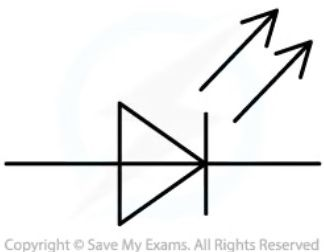

*LEDs can be used to indicate the presence of a current as they illuminate when current flows through them. The same is true for lamps*

!!! tip "Examiner Tips and Tricks"
    > Make sure you learn the various symbols mentioned on this page. Many of them are very similar with small differences denoting what they do:
    > 

    > * Two arrows pointing towards a symbol mean that it is **light-dependent**
    > 

    > * Two arrows pointing away mean that it is **light-emitting**
    > 

    > Symbols are sometimes drawn with circles around them (e.g. the LDR). These circles are often optional (although not in the case of meters and bulbs).
