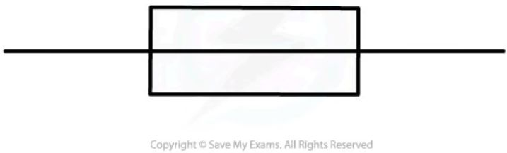
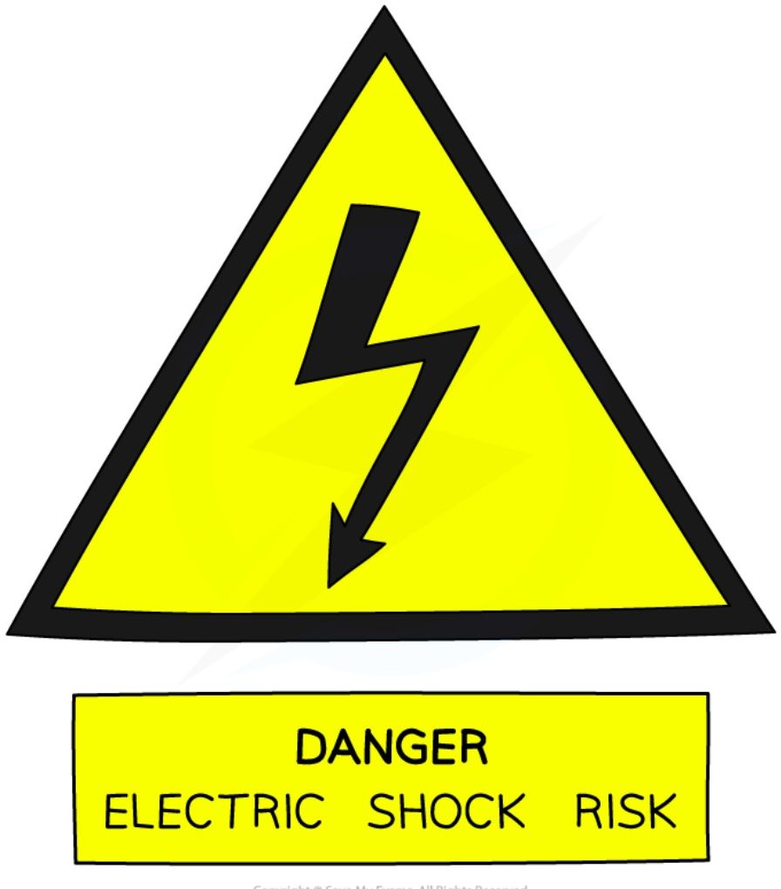
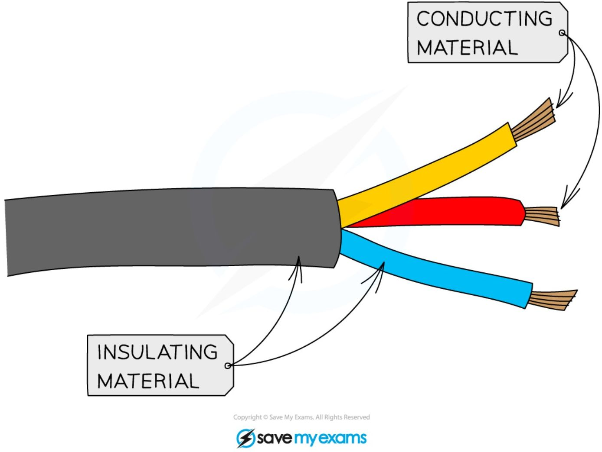
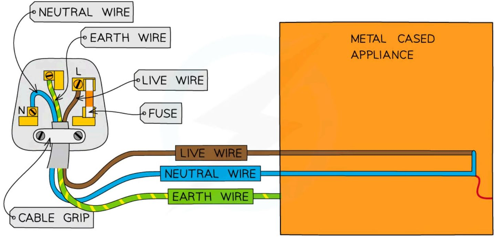
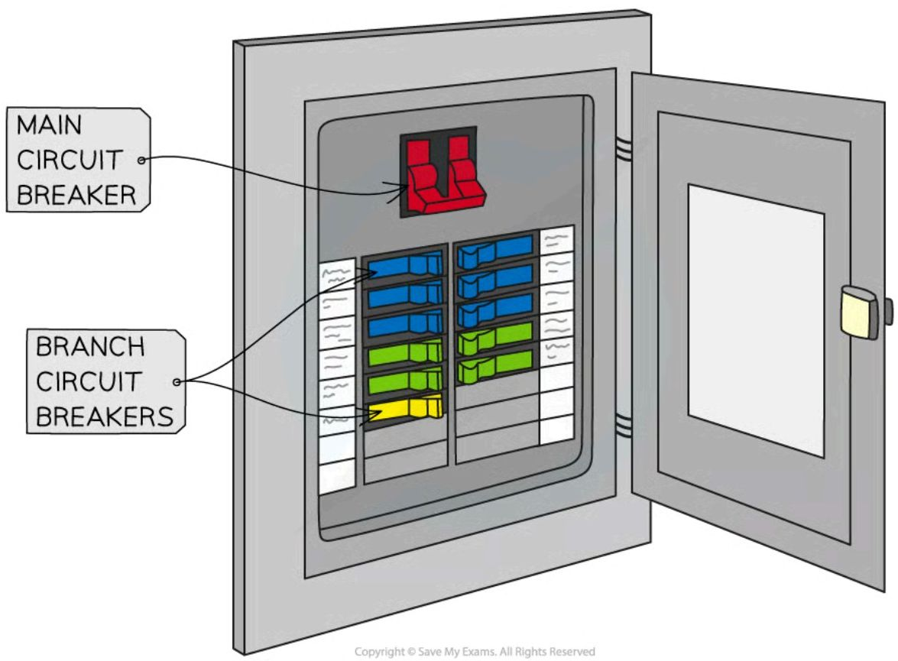
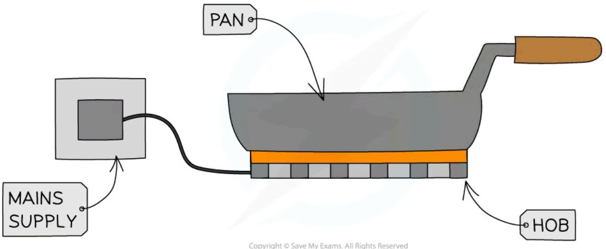
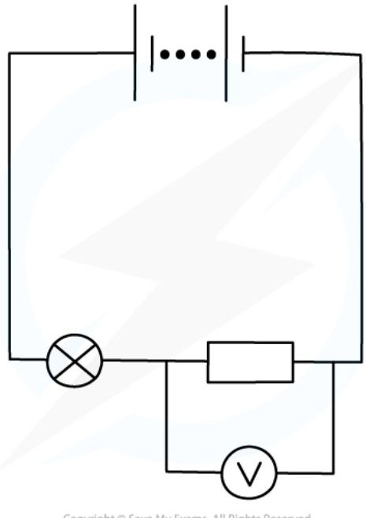

# Electrical Power & Mains Electricity

## Electrical Power & Fuses

### Electrical power

* Power is defined as

> **The rate of energy transfer or the amount of energy transferred per second**

* The electrical power of a device depends on:

    - The **voltage** (potential difference) of the device

    - The **current** of the device

* The power of an electrical component (or appliance) is given by the equation:

$$ P = IV $$

* Where:

    - $P$ = power, measured in Watts (W)

    - $I$ = current, measured in amperes (A)

    - $V$ = potential difference, measured in volts (V)

* The unit of power is the **Watt** (W), which is the same as a joule per second (J/s)

!!! A formula triangle can help rearrange the electrical power equation

    ```mermaid
    graph TD
        A[POWER \(P\)] --- B[CURRENT \(I\)]
        A --- C[VOLTAGE \(V\)]
        B --- C
    ```
    **Power, current, voltage formula triangle**

    * For more information on how to use a formula triangle refer to the revision note on [Speed](https://www.savemyexams.com/igcse/physics/edexcel/19/revision-notes/1-forces-and-motion/1-1-movement-and-position/1-1-2-speed/)

!!! Example "Worked Example"

    Calculate the potential difference through a 48 W electric motor with a current of 4 A.

    ??? note "Answer :"

        **Step 1: List the known quantities**

        * Power, $P = 48\text{ W}$

        * Current, $I = 4\text{ A}$

        **Step 2: Write down the relevant equation**

        $$P = IV$$

        **Step 3: Rearrange for potential difference, $V$**

        $$V = \frac{P}{I}$$

        **Step 4: Substitute the values**
        $$ V = \frac{48}{4} $$
        $$ V = 12\text{ V} $$

!!! tip "Examiner Tips and Tricks"

    Remember: Power is just energy **per second**. Think of it this way will help you to remember the relationship between power and energy. You can remember the unit by the phrase: "**Watt** is the unit of **power**?"

### Selecting fuses

* A fuse is a safety device designed to **cut off** the flow of electricity to an appliance if the **current becomes too large** (due to a fault or a surge)

#### Fuse circuit symbol



*The circuit symbol for a fuse – take care not to confuse this with a resistor*

* Fuses usually consist of a glass cylinder containing a thin metal wire

* If the current in the wire becomes too **large**:

    - The wire heats up and **melts**

    - This causes the wire to **break**, breaking the circuit and stopping the current

* This makes sure that more current doesn't keep flowing through the circuit and causing more damage to the equipment, or, causing a fire

#### Fuse sizes

* Fuses come in a **variety** of sizes, typically 3 A, 5 A and 13 A

    - In order to select the right fuse for the job, the **current** through an appliance needs to be known

* If the **electrical power** of the appliance is known (along with **mains voltage**), the current can be calculated using the equation:

$$ I = \frac{P}{V} $$

\* Where:

- *I* = current in amperes (A)

- *P* = power in watts (W)

- *V* = voltage in volts (V)

\* The fuse should always have a current rating that is slightly **higher** than the current needed by the appliance

- Because of this, the rule of thumb is to **always** choose the **next size up**

\* If the fuse current rating is too low, it will break the circuit even when an acceptable current is flowing through

\* If the fuse current rating is too high, it will not break the circuit in enough time before damage occurs

!!! example "Worked Example"

    If an appliance uses a current of 3.1 A, what would be a suitable rating for a fuse?

    ??? note "Answer :"

        **Step 1: Consider a 3 A fuse**

        - A 3 A fuse would be too small

        - The fuse would blow as soon as the appliance was switched on

        **Step 2: Consider a 5 A fuse**

        - A 5 A fuse would be an appropriate choice

        - It is the next size up from the current required

        **Step 3: Consider a 13 A fuse**

        - A 13 A fuse would be too large

        - It would allow an extra 10 amperes to pass through the appliance before it finally blew

!!! tip "Examiner Tips and Tricks"

    Remember there are two steps involved in selecting a correctly sized fuse for an appliance:

    1. Calculating the current required using the **electrical power equation**

    2. Selecting the **next size up** fuse

## Calculating energy transfers

* **Work** is done when charge flows through a circuit

    - Work done is equal to the **energy transferred**

* The amount of energy transferred by electrical work in a component (or appliance) depends upon:

    - The **current**, $I$

    - The **potential difference**, $V$

    - The amount of **time** the component is used for, $t$

* When charge flows through a resistor, for example, the energy transferred is what makes the resistor **hot**

* The energy transferred can be calculated using the equation:

$$E = P \times t$$

* Where:

    - $E$ = energy transferred in joules (J)

    - $P$ = power in watts (W)

    - $t$ = time in seconds (s)

* **$P = IV$** as explained in [Electrical power & fuses](https://www.savemyexams.com/igcse/physics/edexcel/19/revision-notes/2-electricity/2-3-electrical-power-and-mains-electricity/2-3-1-electrical-power-and-fuses/)

    - So this equation can also be written as:

$$E = I \times V \times t$$

* Where:

    - $I$ = current in amperes (A)

    - $V$ = potential difference in volts (V)

* When charge flows around a circuit for a given time, the energy supplied by the battery is equal to the energy transferred to all the components in the circuit

* You can read more about how energy is transferred in our revision note, E[nergy Stores &](https://www.savemyexams.com/igcse/physics/edexcel/19/revision-notes/4-energy-resources-and-energy-transfers/4-1-energy-stores-and-transfers/4-1-1-energy-stores-and-transfers/) Transfers

!!! example "Worked Example"

    Calculate the energy transferred in 1 minute when a current of 0.7 A passes through a potential difference of 4 V.

    ??? note "Answer :"

        **Step 1: Write down the known quantities**

        * Time, $t = 1 \text{ minute} = 60 \text{ s}$
        * Current, $I = 0.7 \text{ A}$
        * Potential difference, $V = 4 \text{ V}$

        **Step 2: Write down the relevant equation**

        $$E = I \times V \times t$$

        **Step 3: Substitute in the values**

        $$E = 0.7 \times 4 \times 60$$

        $$E = 168 \text{ J}$$

!!! tips "Examiner Tips and Tricks"

    'Energy transferred' and 'work done' are often used interchangeably in equations, don't panic, they mean the same thing! Always remember that the time $t$ in the above equations must always be converted into **seconds**.

## Electrical Safety

* Mains electricity is potentially lethal

    - Potential differences as small as 50 V can pose a serious hazard to individuals



*Signs, like the above, warn of the risk of electrocution*

* Common electrical safety hazards include:

    - **Damaged Insulation** – if someone touches an exposed piece of wire, they could be subjected to a lethal shock

    - **Overheating of cables** – passing too much current through too small a wire (or leaving a long length of wire tightly coiled) can lead to the wire overheating. This could cause a fire or melt the insulation, exposing live wires

    - **Damp conditions** – if moisture comes into contact with live wires, it could conduct electricity either causing a short circuit within a device (which could cause a fire) or posing an electrocution risk

* To protect the user or the device, there are several safety features built into domestic appliances, including:

    - Double insulation

* Earthing
* Fuses
* Circuit breakers

### Insulation & double insulation

* The conducting part of a wire is usually made of copper or some other metal

    - If this comes into contact with a person, this poses a risk of electrocution

* To improve electrical safety wires are covered with an insulating material, such as rubber



***The conducting part of a wire is covered in an insulating material for safety***

* Some appliances do not have metal cases, so there is no risk of them becoming electrified

* Such appliances are said to be **double insulated**, as they have two layers of insulation:

    - Insulation around the wires themselves

    - A non-metallic case that acts as a second layer of insulation

* Double insulated appliances do not require an earth wire or have been designed so that the earth wire cannot touch the metal casing

### Earthing

* Many electrical appliances have metal cases

* This poses a potential electrical safety hazard:     

    - If a live wire (inside the appliance) came into contact with the case, the case would become electrified and anyone who touched it would risk being electrocuted

* The earth wire is an additional safety wire that can reduce this risk



*A diagram showing the three wires going to a mains powered appliance: live, neutral and earth*

* If this happens:
    
    - The earth wire provides a **low resistance path to the earth**

    - It causes a **surge of current in the earth wire** and hence also in the live wire

    - The high current through the fuse causes it to **melt and break**

    - **This cuts off the supply of electricity to the appliance**, making it safe

### Fuses & circuit breakers

* Fuses and circuit breakers are electrical safety devices designed to **cut off the flow of electricity** to an appliance if the **current becomes too large** (due to a fault or a surge)
    
    - As explained in the [Selecting fuses](https://www.savemyexams.com/igcse/physics/edexcel/19/revision-notes/2-electricity/2-3-electrical-power-and-mains-electricity/2-3-1-electrical-power-and-fuses/) revision note a fuse consists of a glass cylinder containing a metal wire
    
    - A **circuit breaker** consists of an automatic electromagnet switch that breaks the circuit if the current exceeds a certain value



*The main circuit breaker can quickly shut off electricity to the whole house. The branch circuit breakers can shut off electricity to specific areas of the house*

* A circuit breaker has a major advantage over a fuse as an electrical safety device because:

    - It doesn't melt and break, hence it can be reset and used again

    - It works much faster

* For these reasons, circuit breakers are used in mains electricity in homes as the most important electrical safety device

    - Sometimes they are misleadingly named "Fuse boxes"

!!! tip "Examiner Tips and Tricks"

    For your exam, you must explain how insulation, double insulation, earthing, fuses and circuit breakers protect the device or user in different domestic appliances.

## Electricity & Heat

* A **current** passing through a resistor (or wire) results in the **electrical transfer of energy**

    - As explained in [Charge & current,](https://www.savemyexams.com/igcse/physics/edexcel/19/revision-notes/2-electricity/2-1-current-potential-difference-and-resistance/2-1-1-charge-and-current/) current is the **rate of flow of charge**

* The temperature of a resistor increases due to the **collisions** of the **free electrons** within the wire

* Some of the **energy is dissipated** into the surroundings by **heating**

* This heating effect is **utilised** in many domestic contexts, including:

    - Electric **heaters**

    - Electric **ovens**

    - Electric **hob**

    - **Toasters**

    - **Kettles**



*The heating effect of current can be used for many applications such as electric hobs*

!!! tip "Examiner Tips and Tricks"

    Remember that a charge moving around an electrical circuit are an example of an electrical transfer pathway. If you are unsure of how to explain energy stores and transfers use the E[nergy stores & transfers](https://www.savemyexams.com/igcse/physics/edexcel/19/revision-notes/4-energy-resources-and-energy-transfers/4-1-energy-stores-and-transfers/4-1-1-energy-stores-and-transfers/) revision note to help.

## AC & DC

* Mains electricity can be supplied by **alternating current** (a.c.) or **direct current** (d.c.) from a cell or battery

### Direct current

* A direct current (d.c.) is defined as

> **A steady current, constantly flowing in the same direction in a circuit, from positive to negative**

* The potential difference across a cell in a d.c. circuit travels in **one direction only**

    - The current travels from the positive terminal to the negative terminal

* A d.c. power supply has a **fixed** positive terminal and a fixed negative terminal

* Electric **cells**, or **batteries**, produce direct current (d.c.)



*Circuits powered by cells or batteries use a d.c. supply*

### Alternating current

* An alternating current (a.c.) is defined as

**A current that continuously changes its direction, going back and forth around a circuit**

* An alternating current power supply has two identical terminals that **change** from positive to negative and back again

* The alternating current always travels from the positive terminal to the negative terminal

* Therefore, the current changes direction as the polarity of the terminals changes

* The **frequency** of an alternating current is the number of times the current changes direction back and forth each second

* In the UK, **mains electricity** is an **alternating** current with a frequency of 50 Hz and a potential difference of around 230 V

<table>
  <thead>
    <tr>
        <th>DIRECT CURRENT (D.C.)</th>
        <th>ALTERNATING CURRENT (A.C.)</th>
    </tr>
  </thead>
  <tbody>
    <tr>
        <td>Constant positive value (horizontal line)</td>
        <td>Sinusoidal wave (oscillating between positive and negative)</td>
    </tr>
  </tbody>
</table>

Two graphs showing the variation of current with time for alternating current and direct current

### Comparing alternating current & direct current

* The following table summarises the differences between d.c. and a.c.

<table>
  <thead>
    <tr>
        <th>Direct Current (d.c.)</th>
        <th>Alternating Current (a.c.)</th>
    </tr>
  </thead>
  <tbody>
    <tr>
        <td>Continuous and in one direction</td>
        <td>Constantly changing direction</td>
    </tr>
    <tr>
        <td>Produced by cells and batteries</td>
        <td>Produced by electrical generators i.e. mains electricity</td>
    </tr>
    <tr>
        <td>Has a positive and negative terminal</td>
        <td>Has two identical terminals</td>
    </tr>
  </tbody>
</table>

!!! tip "Examiner Tips and Tricks"

    If asked to explain the difference between alternating and direct current, sketching and labelling the graphs above can earn you full marks. All the circuits you have studied so far are d.c. circuits. Don't be put off by an exam question if you are asked to calculate the current, potential difference or resistance in d.c. series circuits, you don't have to do anything different from what you have already learned!