# Describing waves

## Transverse and longitudinal waves

Waves can come in one of two types: transverse waves, or longitudinal waves.

### Transverse waves

!!! abstract "Definition: Transverse wave"
    A transverse wave is one that **vibrates or oscillates perpendicular to the direction of energy transfer**.

Transverse waves oscillate **perpendicularly** to the direction of travel, and transfer **energy**, but **not** the **particles** of the medium. They can exist as mechanical waves, which can travel in **solids** and on the **surfaces of liquids** but **not** through liquids or gases, or as electromagnetic waves, which can move in solids, liquids, gases and in a **vacuum**.

On a transverse wave, the **highest** point above the rest position is called a **peak**, or **crest**, and the **lowest** point below the rest position is called a **trough**.

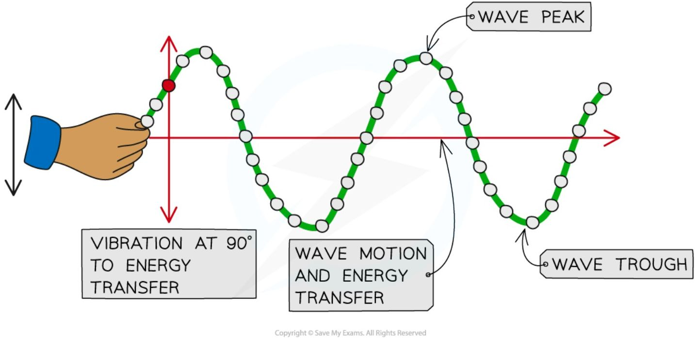

*Transverse waves can be seen in a rope when it is moved quickly up and down*

Examples of transverse waves are ripples on the surface of water, vibrations in a guitar string, S-waves (a type of seismic wave), and electromagnetic waves (such as radio, light, X-rays etc).

### Longitudinal waves

!!! abstract "Definition: Longitudinal wave"
    A longitudinal wave is one that **vibrates or oscillates parallel to the direction of energy transfer**.

Longitudinal waves oscillate in the **same direction** as the direction of wave travel, and transfer **energy**, but **not matter** (the particles of the medium). They can move through solids, liquids and gases, but **cannot** move in a vacuum, since there are no particles.

The key features of a longitudinal wave are the points where particles are close together, called **compressions**, and where they are spaced apart, called **rarefactions**.

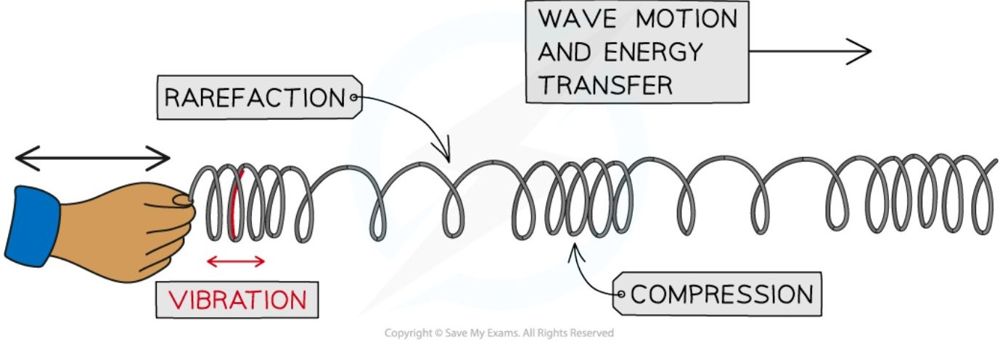

*Longitudinal waves can be seen in a slinky spring when it is moved quickly backwards and forward*

Examples of longitudinal waves are sound waves, P-waves (a type of seismic wave), and pressure waves caused by repeated movements in a liquid or gas.

### Comparing transverse and longitudinal waves

Wave vibrations can be shown on **ropes** (transverse) and **springs** (longitudinal):

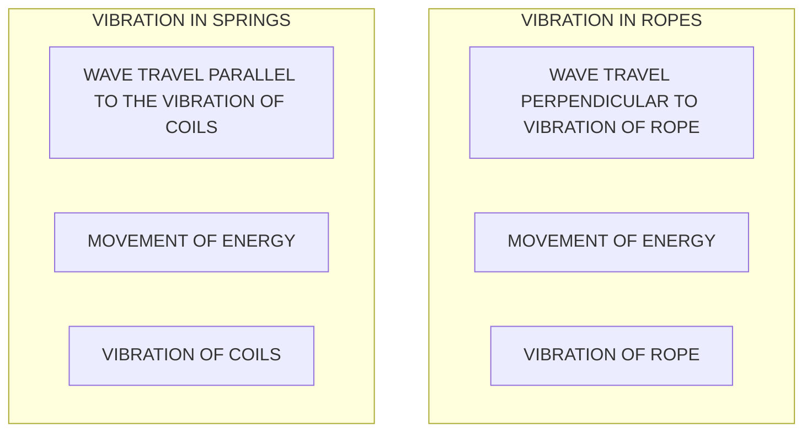

*A comparison of longitudinal and transverse waves, shown through vibrations in ropes or springs*

### Properties of transverse and longitudinal waves

<table>
  <thead>
    <tr>
        <th></th>
        <th>Transverse Waves</th>
        <th>Longitudinal Waves</th>
    </tr>
  </thead>
  <tbody>
    <tr>
        <th>Structure</th>
        <td>Peaks and troughs</td>
        <td>Compressions and rarefactions</td>
    </tr>
    <tr>
        <th>Vibration</th>
        <td>Perpendicular to the direction of energy transfer</td>
        <td>Parallel to the direction of energy transfer</td>
    </tr>
    <tr>
        <th>Vacuum</th>
        <td>Can travel in a vacuum<br/>(electromagnetic waves)</td>
        <td>Cannot travel in a vacuum</td>
    </tr>
    <tr>
        <th>Material</th>
        <td>Can travel through solids, and on the surface of liquids</td>
        <td>Can travel through solids, liquids and gases</td>
    </tr>
    <tr>
        <th>Density</th>
        <td>Constant density</td>
        <td>Changes in density</td>
    </tr>
    <tr>
        <th>Pressure</th>
        <td>Pressure is constant</td>
        <td>Changes in pressure</td>
    </tr>
    <tr>
        <th>Speed of wave</th>
        <td>Depends on the material it is travelling through (fastest in a vacuum)</td>
        <td>Depends on the material it is travelling through (fastest in a solid)</td>
    </tr>
  </tbody>
</table>

!!! example "Worked Example (method)"

    The diagram below shows a loudspeaker generating sound waves, which travel to the right as indicated. Sound waves are longitudinal. A dust mote floats in the air just next to the loudspeaker, labelled **D**.

    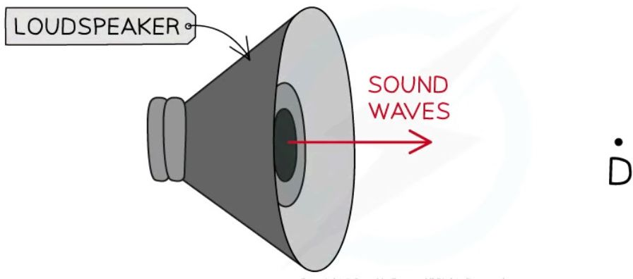

    Draw arrows on the diagram to indicate how the dust mote **D** would vibrate as sound waves pass it.

    ??? success "Answer:"

        **Step 1: Recall the definition of longitudinal waves**

        Points along longitudinal waves vibrate **parallel** to the direction of energy transfer, so the dust mote vibrates in a line **parallel** to the direction of the sound waves drawn.

        **Step 2: Draw arrows at the point labelled D to show it vibrating in parallel to the direction of the sound waves**

        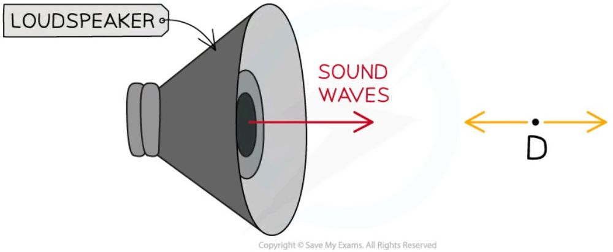

## Waves and energy

Waves are disturbances caused by an oscillating source that transfer **energy** and **information** without transferring matter. Waves are described as **oscillations** or **vibrations** about a fixed point — for example, ripples cause particles of water to oscillate up and down, and sound waves cause particles of air to vibrate back and forth.

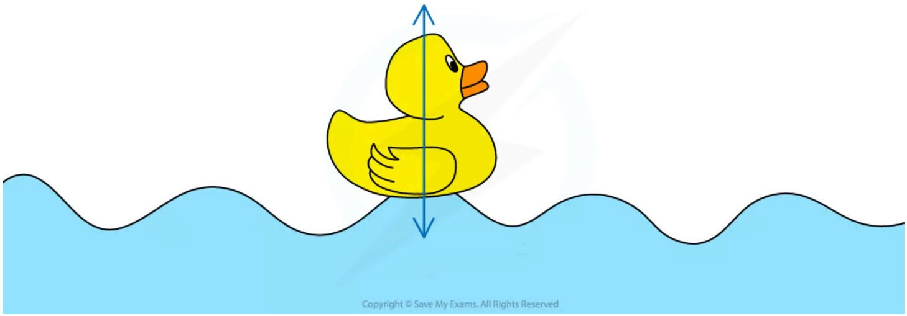

*Waves transfer energy and information, but not matter. This toy duck bobs up and down as water waves pass underneath*

The wave on the surface of a body of water is a **transverse** wave: the duck moves **perpendicular** to the direction of the wave, bobbing up and down, but does not travel along with the wave.

!!! tip "Examiner Tips and Tricks"

    Exam questions may ask you to describe waves, and this is most easily done by drawing a diagram of the wave and then describing the parts of the wave - a good, clearly labelled diagram can earn you full marks!

    You may also be asked to give further examples of transverse or longitudinal waves – so memorise the lists given here!

## Describing wave motion

When describing wave motion, there are several terms which are important to know, including wavefront, amplitude, wavelength, frequency, and time period.

### Wavefront

Wavefronts are a useful way of picturing waves from above: each wavefront, drawn as a single line, is used to represent a single wave. The arrow shows the direction the wave is moving, and is sometimes called a **ray**. The space between each wavefront represents the **wavelength**: when the wavefronts are **close together**, this represents a wave with a **short** wavelength, and when they are **far apart**, this represents a wave with a **long** wavelength.

**Wavefronts as viewed from above**

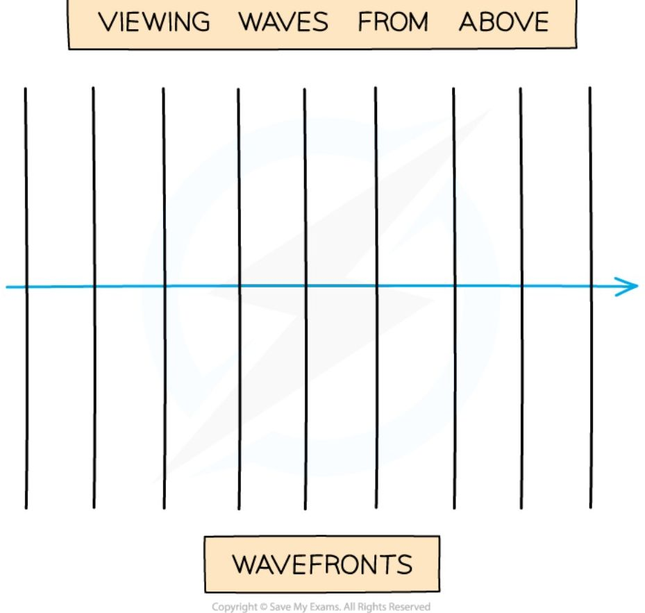

*Diagram showing a wave moving to the right, drawn as a series of wavefronts*

### Amplitude

!!! abstract "Definition: Amplitude"
    Amplitude is **the distance from the undisturbed position to the peak or trough of a wave**. It is given the symbol $A$, and is measured in **metres (m)**.

On a graph where the vertical axis is **displacement**, amplitude is measured from the **undisturbed position** to either the highest point of the wave (peak) or the lowest point (trough).

### Wavelength

!!! abstract "Definition: Wavelength"
    Wavelength is **the distance from one point on a wave to the same point on the next wave**. It is given the symbol $\lambda$ (lambda), and is measured in **metres (m)**.

In a **transverse** wave, the wavelength can be measured from one peak to the next peak; in a **longitudinal** wave, it can be measured from the centre of one compression to the centre of the next. On a graph where the horizontal axis is **distance**, the wavelength can be determined by measuring the distance from one point on the wave to the same point on the next wave.

### Using a graph to determine wavelength and amplitude

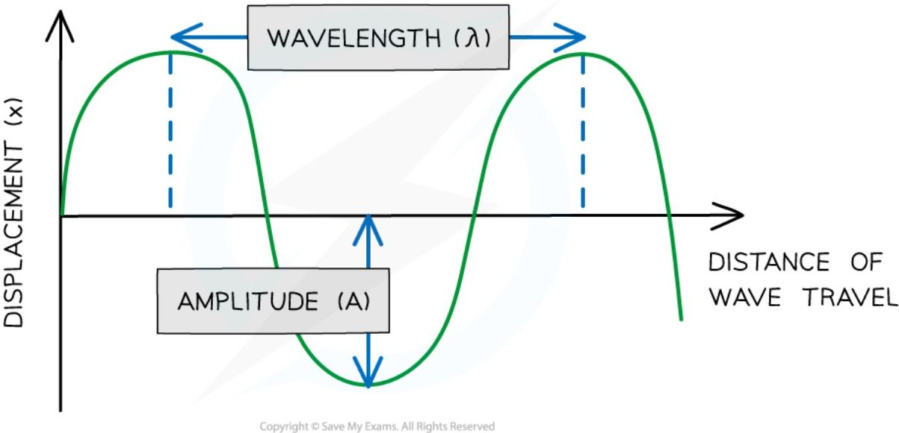

*Diagram showing the amplitude and wavelength of a wave*

### Frequency

!!! abstract "Definition: Frequency"
    Frequency is **the number of waves passing a point in a second**. It is given the symbol $f$, and is measured in **hertz (Hz)** — the unit hertz is equivalent to 'per second' (5 Hz = 5 waves per second).

Waves with a **higher frequency** transfer a higher amount of **energy**.

### Time period

!!! abstract "Definition: Time period"
    The time period (or sometimes just '**period**') of a wave is **the time taken for a single wave to pass a point**. It is given the symbol $T$, and is measured in **seconds (s)**.

On a graph where the horizontal axis is **time**, the period can be determined by measuring the time from one point on the wave to the same point on the next wave.

### Using a graph to determine time period

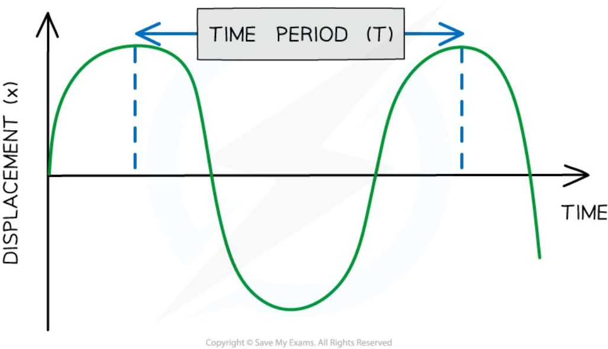

*Diagram showing the time period of a wave*

!!! tip "Examiner Tips and Tricks"

    In your exam, you are expected to be able to define these keywords and identify their values from diagrams or scenarios.

    The wavelength is often shown graphically between the peaks of two consecutive waves. However, the wavelength can be shown between two corresponding points on two successive waves - the distance will be the same!

### The wave equation

All waves obey the **wave speed equation** — the relationship between wave speed, frequency and wavelength:

!!! note "Required formulae: the wave equation"
    $$ v = f \times \lambda $$

    Where $v$ is wave speed in **metres per second** (m/s), $f$ is frequency in **hertz** (Hz), and $\lambda$ is wavelength in **metres** (m).

    ??? note "Formula triangle for wave speed, frequency and wavelength"

        ```mermaid
        graph TD
            A[WAVE SPEED(v)] --- B[FREQUENCY(f)]
            A --- C[WAVELENGTH(λ)]
            B --- C
        ```

        *A formula triangle can be used to help rearrange the wave speed equation*

### Frequency and time period

**Frequency** and **time period** are defined above, in [Describing wave motion](#describing-wave-motion). The following equation relates them:

!!! note "Required formulae: frequency and time period"
    $$ f = \frac{1}{T} $$

    Where $f$ is frequency measured in Hertz (Hz), and $T$ is time period, measured in seconds (s).

!!! example "Worked Example (calculation)"

    Visible light has a frequency of about $6 \times 10^{14}$ Hz.

    How long does it take for one complete cycle of visible light to enter our eyes?

    ??? success "Answer:"

        **Step 1: List the known values**

        Frequency, $f = 6 \times 10^{14}$ Hz.

        **Step 2: State the relationship between frequency and time period**

        This question involves quantities of time and frequency, so the equation relating **time period** and **frequency** is:

        $$ T = \frac{1}{f} $$

        **Step 3: Substitute the known values into the equation and calculate the time period**

        $$ T = 1 \div (6 \times 10^{14}) = 1.67 \times 10^{-15} \text{ s} $$

        Therefore, it takes **$1.67 \times 10^{-15}$ s** for one wave of visible light to pass our eyes.

!!! example "Worked Example (calculation)"

    A certain sound wave moves at about 330 m/s and has a time period of 0.0001 seconds.

    Calculate: (a) the frequency of the sound wave, and (b) the wavelength of the sound wave.

    ??? success "Answer (Part a):"

        **Step 1: List the known quantities**

        * Time period, $T = 0.0001\text{ s}$

        **Step 2: Write out the equation relating time period and frequency**

        $$T = \frac{1}{f}$$

        **Step 3: Rearrange for frequency, f, and calculate the answer**

        $$f = \frac{1}{T} = \frac{1}{0.0001} = 10\ 000\text{ Hz} = 1 \times 10^4\text{ Hz}$$

    ??? success "Answer (Part b):"

        **Step 1: List the known quantities**

        * Wave speed, $v = 330\text{ m/s}$

        * Frequency, $f = 1 \times 10^4\text{ Hz}$

        **Step 2: Write out the wave speed equation**

        $$v = f \times \lambda$$

        **Step 3: Rearrange the equation to calculate the wavelength**

        $$\lambda = \frac{v}{f}$$

        **Step 4: Use the frequency you calculated in part (a) and put the values into the equation**

        $$\lambda = \frac{330}{(1 \times 10^4)} = 0.033 \text{ m}$$

### Calculations in different contexts

The **wave equation** can be applied and rearranged to calculate the properties of transverse and longitudinal waves (see above), and it applies to all types of waves, including sound waves and electromagnetic waves.

!!! example "Worked Example (calculation)"

    A local radio station broadcasts at a frequency of 200 kHz. The wavelength of these radio waves is 1500 m.

    Calculate the speed of these radio waves and state an appropriate unit.

    ??? success "Answer:"

        **Step 1: List the known quantities**

        * Frequency, $f = 200 \text{ kHz} = 200\ 000 \text{ Hz}$
        * Wavelength, $\lambda = 1500 \text{ m}$

        **Step 2: Write out the wave speed equation**

        This question requires wave speed, so state the equation linking wave speed, wavelength and frequency:

        $$ v = f \times \lambda $$

        **Step 3: Substitute the known values to calculate the wave speed**

        $$ v = 200\ 000 \times 1500 = 300\ 000\ 000 = 3 \times 10^8 $$

        **Step 4: State the unit with the answer**

        The units for speed are m/s. Therefore, the speed of these radio waves is **$3 \times 10^8 \text{ m/s}$**.

!!! tip "Examiner Tips and Tricks"

    When stating equations make sure you use the right letters: for example, use $\lambda$ for wavelength, not L or W. If you can't remember the correct letters, then state the word equations required.

    Be careful with units: wavelength is usually measured in metres and speed in m/s, but if the wavelength is given in cm you might have to give the speed in cm/s. Likewise, watch out for the frequency given in kHz: $1 \text{ kHz} = 1000 \text{ Hz}$.

## The Doppler effect

!!! abstract "Definition: Doppler effect"
    The Doppler effect is **the apparent change in observed wavelength and frequency of a wave emitted by a moving source relative to an observer**.

The Doppler effect can be observed whenever sources of waves **move**: the **frequency** of the sound waves emitted by an ambulance or police siren goes from a **high pitch** (high frequency) to a **low pitch** (low frequency) as the vehicle whizzes past, and galaxies in outer space emit light waves which appear **redder** (longer wavelength) to an observer on Earth, because the stars are moving **away** from us.

### Explaining the Doppler effect

Usually, when a **stationary** object emits waves, the waves spread out **symmetrically**.

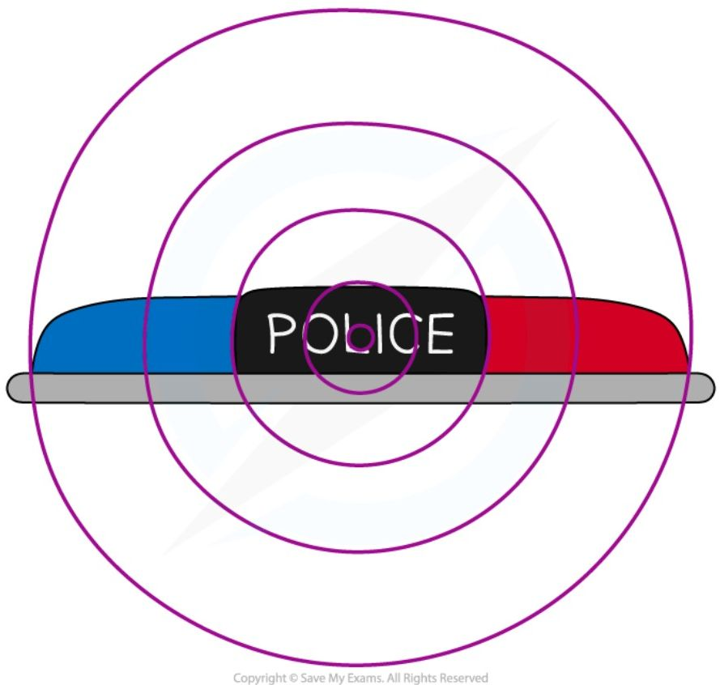

*This stationary police car emits sound from the siren and the waves spread out symmetrically*

To an observer standing in front of an object moving towards them, the waves appear to get **squashed** together, because the wavelength appears to get **shorter** (and the **frequency** appears to get **higher**). To an observer standing behind an object moving away from them, the waves appear to get **stretched** apart, because the wavelength appears to get **longer** (and the **frequency** appears to get **lower**). The Doppler effect is observed whenever the source of the waves is moving.

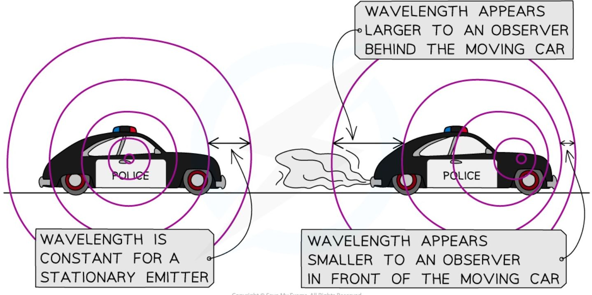

*To an observer in front of the moving car, the wavelength appears smaller because they squash together. To an observer behind the moving car, the waves appear to stretch out*

!!! tip "Examiner Tips and Tricks"

    Remember that the Doppler effect is an **apparent** change in wavelength and frequency. This only happens because a wave emitter **moves** away from or towards an observer. The **speed** of the waves emitted stays constant, so if the wavelength of the wave appears to **decrease** this must mean the frequency appears to **increase**, and vice versa.
