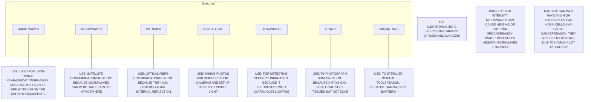
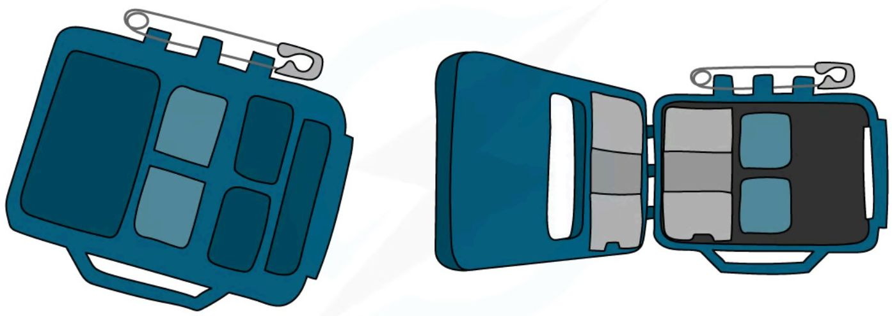

# The electromagnetic spectrum

## Properties of electromagnetic waves

Light is part of a continuous **electromagnetic spectrum** that consists of the following types of radiation: radio, microwave, infrared, visible, ultraviolet, x-ray and gamma ray. All waves in the electromagnetic spectrum share the same properties: they can all travel through free space (a **vacuum**), they all travel at the **same speed** in free space, and they are all **transverse**.

## The electromagnetic spectrum

The types of radiation found in the electromagnetic spectrum have a specific order based on their **wavelength** (and frequency): **radio waves** are at the **top**, since they have the **longest wavelength** (and **lowest frequency**), and **gamma rays** are at the **bottom**, since they have the **shortest wavelength** (and **highest frequency**). Wavelength and frequency are **inversely proportional** to each other (see the [wave equation](3_1_describing-waves.md#the-wave-equation)): an **increase** in wavelength is a **decrease** in frequency (towards the radio end of the spectrum), and a **decrease** in wavelength is an **increase** in frequency (towards the gamma end of the spectrum).

<table>
    <tr>
        <th>LOWER ENERGY LONG WAVELENGTH LOW FREQUENCY</th>
        <th>HIGHER ENERGY SHORT WAVELENGTH HIGH FREQUENCY</th>
    </tr>
</table>
<table>
  <thead>
    <tr>
        <th>RADIO WAVES</th>
        <th>MICROWAVES</th>
        <th>INFRARED</th>
        <th>VISIBLE LIGHT</th>
        <th>ULTRAVIOLET</th>
        <th>X-RAYS</th>
        <th>GAMMA RAYS</th>
    </tr>
  </thead>
</table>

*Visible light is just one small part of a much bigger spectrum: The electromagnetic spectrum*

## Visible spectrum

Visible light is the **only** part of the EM spectrum detectable by the human eye, though it is only a very small part of the **whole** electromagnetic spectrum — in the natural world, many animals, such as birds, bees and certain fish, can perceive beyond visible light, using infrared and UV wavelengths to see. Each colour within the visible light spectrum corresponds to a narrow band of **wavelength** and **frequency**: **red** has the **longest** wavelength (and the lowest frequency), and **violet** has the **shortest** wavelength (and the highest frequency).

!!! tip "Examiner Tips and Tricks"
    See if you can make up a mnemonic to help you remember the order of the colours of visible light in the EM spectrum!

    One possibility is:

    **R**aging **M**artians **I**nvaded **V**enus **U**sing **X**-ray **G**uns

    To remember the colours of the visible spectrum you could remember either:

    * The name "Roy G. Biv"

    * Or the saying "Richard Of York Gave Battle In Vain"

    

    You could even combine both to have a mega mnemonic:

    **R**aging **M**artians **I**nvaded **Roy G. Biv** **U**sing **X**-ray **G**uns!

The electromagnetic spectrum is usually given in order of **decreasing wavelength** and **increasing frequency**, i.e. from radio waves to gamma waves. One way to remember this: radios are **big** (long wavelength), while gamma rays are emitted from atoms, which are **very small** (short wavelength).

## Applications of EM waves

Each region of the electromagnetic spectrum has a variety of **uses** and applications.

**Uses of EM waves**

<table>
  <thead>
    <tr>
        <th>Wave Type</th>
        <th>Uses</th>
    </tr>
  </thead>
  <tbody>
    <tr>
        <td>Radio</td>
        <td>Broadcasting and communications</td>
    </tr>
    <tr>
        <td>Microwaves</td>
        <td>Cooking and satellite transmissions</td>
    </tr>
    <tr>
        <td>Infrared</td>
        <td>Fibre optic communications and infrared remote controllers</td>
    </tr>
    <tr>
        <td>Visible light</td>
        <td>Vision and photography</td>
    </tr>
    <tr>
        <td>Ultraviolet</td>
        <td>Fluorescent lamps</td>
    </tr>
    <tr>
        <td>X-rays</td>
        <td>Observing the internal structure of objects and materials, including medical applications</td>
    </tr>
    <tr>
        <td>Gamma rays</td>
        <td>Sterilising food and medical equipment</td>
    </tr>
  </tbody>
</table>

### Radio waves and microwaves

Both radio waves and microwaves are used in **wireless communication**, including radios, air traffic communication, and mobile phone communication. At very **high intensities**, microwaves are used to heat things in a microwave oven.

### Infrared

Infrared is emitted by **warm objects**, and can be detected using special cameras (thermal imaging cameras). Examples of its uses include security cameras for seeing people in the dark, TV remote controls, and transporting signals through fibre optic cables.

### Visible light

Visible light is the only part of the electromagnetic spectrum that the human **eye** can see. It is used in **photography**, where light is focused onto a sensor or film to produce an image.

### Ultraviolet

Ultraviolet is responsible for giving you a **sun tan**, which is your body's way of protecting itself against the ultraviolet rays. When certain substances are exposed to ultraviolet light, they absorb it and re-emit it as visible light, making them glow — a process known as **fluorescence**, which can be used to secretly mark things in special ink, such as banknotes.

### X-rays

The most obvious use of X-rays is in **medicine**. X-rays can pass through most body tissues but are absorbed by the denser parts of the body, such as bones.

### Gamma rays

Gamma rays are dangerous, and can be used to **kill cells** and living tissue. Gamma rays can also be used to **sterilise equipment**, by killing off the bacteria on it.

!!! tip "Examiner Tips and Tricks"

    Common questions in your exam require you to discuss the uses and applications of EM radiation. Learn the uses listed in the table for each radiation type.

## Dangers of EM waves

### Risks of excessive exposure to EM radiation

**Excessive exposure** of the human body to electromagnetic waves can have detrimental effects. Risks from overexposure to certain wavelengths include: **microwaves** causing heat damage to **internal organs**, due to internal heating of body tissue; **infrared** **burning** the skin; **ultraviolet** damaging skin cells, causing **sunburn** and blindness; and **gamma** and **X-rays** killing cells, causing **cancer** and cell mutations.

### Dangers and uses of each part of the EM spectrum

As the **frequency** of electromagnetic (EM) waves **increases**, so does the **energy** — beyond the **visible part** of the EM spectrum, the energy becomes large enough to **ionise** atoms. As a result, the danger associated with EM waves **increases** along with the frequency: the **shorter** the wavelength, the more **ionising** the radiation.

### Protective measures against the risks of over-exposure

Devices using hazardous EM radiation contain safety features that reduce human exposure: **microwaves** from microwave ovens are prevented from escaping the oven by the metal walls and metal grid in the glass door; wearing protective clothing such as gloves can prevent the skin from feeling the heat of **infrared**; **ultraviolet** damage to the eyes is reduced by wearing sunglasses that absorb ultraviolet and prevent it from reaching the eyes, and **sunscreen** absorbs ultraviolet light, preventing it from damaging the skin; and **gamma** and **X-ray** damage is reduced by using minimal levels in medicine — doctors leave the room during X-rays to avoid unnecessary exposure, radiographers wear radiation badges to measure their level of radiation exposure, and people working with gamma rays routinely have their dose levels tested.

*Radiation badges are used by people working closely with radiation to monitor exposure*

!!! tip "Examiner Tips and Tricks"
    In your exam, you may be asked to explain the hazards of each type of radiation and the safety precautions used to reduce these hazards.
