# Light Waves

## Overview of light properties

Visible light is part of the [electromagnetic spectrum](3_2_the-electromagnetic-spectrum.md), which means it is a **transverse wave** (see [Transverse and longitudinal waves](3_1_describing-waves.md#transverse-and-longitudinal-waves)).

<table>
  <thead>
    <tr>
        <th>Label</th>
        <th>Description</th>
    </tr>
  </thead>
  <tbody>
    <tr>
        <td>CREST</td>
        <td>Top peak of the wave</td>
    </tr>
    <tr>
        <td>TROUGH</td>
        <td>Bottom peak of the wave</td>
    </tr>
    <tr>
        <td>DIRECTION OF VIBRATION</td>
        <td>Vertical red double-headed arrow perpendicular to energy transfer</td>
    </tr>
    <tr>
        <td>DIRECTION OF ENERGY TRANSFER</td>
        <td>Horizontal blue arrow along the wave's path</td>
    </tr>
  </tbody>
</table>

*Light waves are transverse: the particles vibrate in a perpendicular direction to the energy transfer*

Light can undergo reflection and refraction.

## Reflection vs refraction

All waves, whether transverse or longitudinal, can be **reflected** and **refracted**.

!!! abstract "Definition: Reflection"
    Reflection occurs when **a wave hits a boundary between two media and does not pass through, but instead stays in the original medium**. In optics, the word **medium** is used to describe a material that transmits light (**media** means more than one medium).

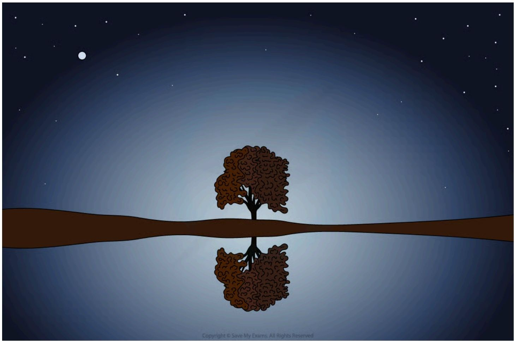

*An identical image of the tree is seen in the water due to reflection*

!!! abstract "Definition: Refraction"
    Refraction occurs when **a wave passes a boundary between two different transparent media and undergoes a change in direction**.

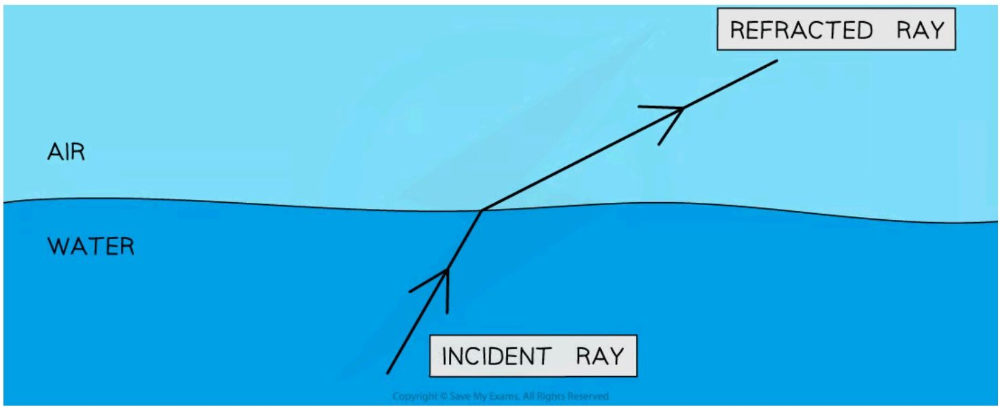

*Waves can change direction when moving between materials with different densities*

## The law of reflection

!!! abstract "Definition: The law of reflection"
    The law of reflection states that **the angle of incidence (i) equals the angle of reflection (r)**.

Angles are measured between the wave direction (ray) and a line at 90 degrees to the boundary, called the **normal**: the angle of the wave approaching the boundary is called the **angle of incidence (i)**, and the angle of the wave leaving the boundary is called the **angle of reflection (r)**.

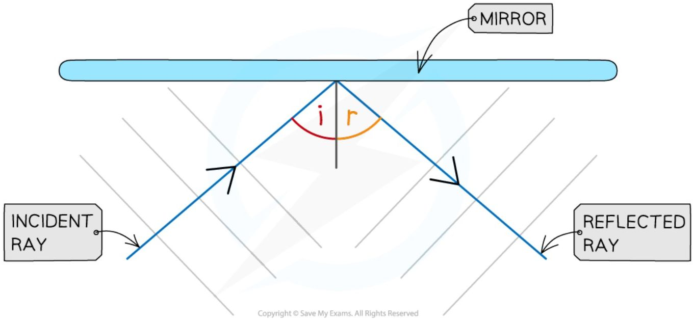

*Ray diagram of the reflection of a wave in a mirror*

## Ray diagrams

### Reflection ray diagrams

When drawing a ray diagram, an arrow is used to show the direction the wave is travelling: an **incident** ray has an arrow pointing **towards** the boundary, and a **reflected** ray has an arrow pointing **away** from the boundary.

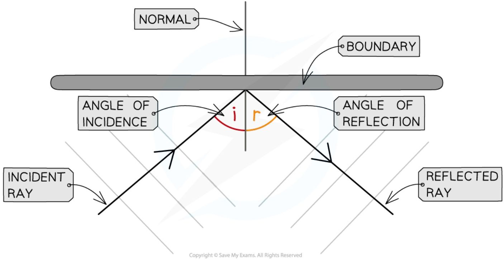

*The angle of incidence and angle of reflection are equal in the law of reflection*

### Refraction ray diagrams

The direction of the incident and refracted rays are also taken from the **normal** line. The change in direction of the refracted ray depends on the difference in density between the two media: from less dense to more dense (e.g. air to glass), light bends **towards** the normal; from more dense to less dense (e.g. glass to air), light bends **away** from the normal; and when passing along the normal (perpendicular), the light **does not bend** at all.

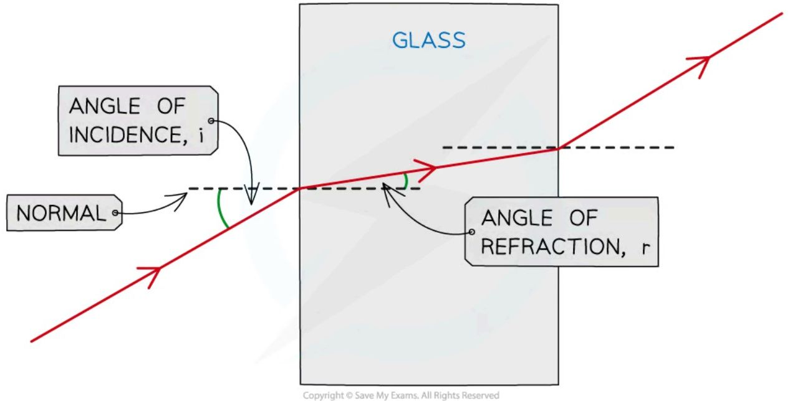

*A ray refracted into and out of a glass block*

The change in direction occurs due to the change in speed when travelling in different substances: when light passes into a **denser** substance, the rays will **slow down**, so they bend towards the normal. The only properties that change during refraction are speed and wavelength – the frequency of waves **does not change**. Different frequencies account for different **colours** of light (red has a low frequency, whilst blue has a high frequency); when light refracts, it **does not change colour** (think of a pencil in a glass of water), so the frequency does not change.

!!! tip "Examiner Tips and Tricks"

    When drawing ray diagrams for reflection:

    1. A simple straight line **with an arrow** is enough to represent the wave — you do not need to draw the wavefronts unless asked to do so!

    2. Take care to draw the angle correctly — if it is slightly out it won't be a problem, but if there is an obvious difference between the angle of incidence and the angle of reflection then you will probably lose a mark!

    Practice drawing refraction diagrams as much as you can! It's very important to remember which way the light bends when it crosses a boundary:

    As the light **enters** the block it bends **towards** the normal line. **Remember: Enters Towards.**

    When it **leaves** the block it bends **away** from the normal line. **Remember: Leaves Away.**

    Don't forget to draw the arrows for the direction of the light rays and make sure they are drawn with a ruler and a sharp pointed pencil

## Core practical 4: investigating refraction

This experiment aims to investigate the refraction of light using transparent rectangular blocks, semi-circular blocks and triangular prisms.

### Variables

* **Independent variable** = shape of the block

* **Dependent variable** = direction of refraction

* Control variables:

    - Width of the light beam

    - Same frequency / wavelength of the light

### Equipment list

<table>
  <thead>
    <tr>
        <th>Equipment</th>
        <th>Purpose</th>
    </tr>
  </thead>
  <tbody>
    <tr>
        <td>Ray Box</td>
        <td>To provide a narrow beam of light that can be easily refracted</td>
    </tr>
    <tr>
        <td>Protractor</td>
        <td>To measure the angles of incidence and refraction</td>
    </tr>
    <tr>
        <td>Sheet of Paper</td>
        <td>To mark the lines indicating the incident and refracted rays</td>
    </tr>
    <tr>
        <td>Pencil</td>
        <td>To draw the incident and refracted ray lines onto the paper</td>
    </tr>
    <tr>
        <td>Ruler</td>
        <td>To draw the incident and refracted ray lines onto the paper</td>
    </tr>
    <tr>
        <td>Perspex blocks (rectangular block, semi- circular block &amp; prism)</td>
        <td>To refract the light beam</td>
    </tr>
  </tbody>
</table>

**Resolution of measuring equipment:**

* Protractor = 1°

* Ruler = 1 mm

### Method

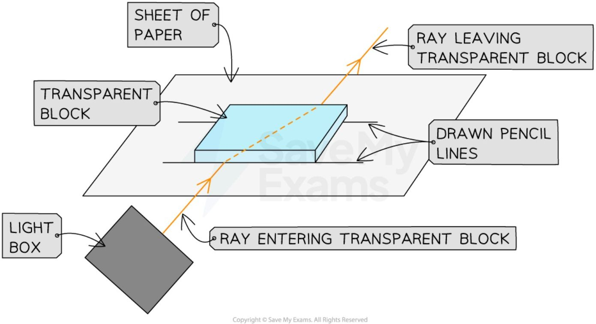

*Apparatus to investigate refraction*

1. Place the glass block on a sheet of paper, and carefully draw around the rectangular perspex block using a pencil

2. Switch on the ray box and direct a beam of light at the side face of the block

3. Mark on the paper:

    * A point on the ray close to the ray box

    * The point where the ray enters the block

    * The point where the ray exits the block

    * A point on the exit light ray which is a distance of about 5 cm away from the block

4. Draw a dashed line normal (at right angles) to the outline of the block where the points are

5. Remove the block and join the points marked with three straight lines

6. Replace the block within its outline and repeat the above process for a ray striking the block at a different angle

7. Repeat the procedure for each shape of perspex block (prism and semi-circular)

### Results

Consider the light paths through the different-shaped blocks:

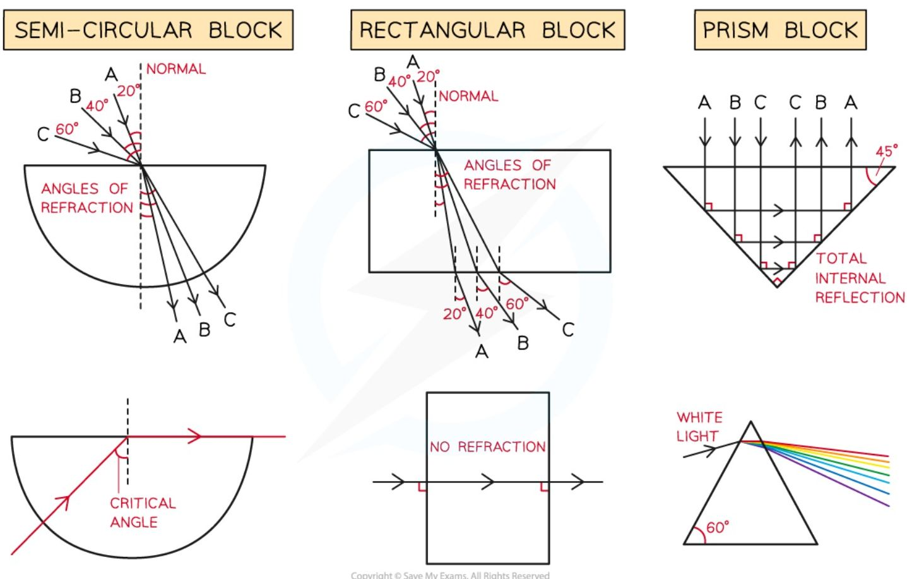

*Refraction of light through different shapes of perspex blocks*

The final diagram for each shape will include multiple light ray paths for the different angles of incidence ($i$) at which the light strikes the blocks, which will help demonstrate how the angle of refraction ($r$) changes with the angle of incidence — label these paths clearly with (1) (2) (3) or **A, B, C** to make this clearer. Use the [laws of refraction](#snells-law) to analyse these results.

### Evaluating the experiment

#### Systematic errors

* An error could occur if the 90° lines are drawn incorrectly

    - Use a set square to draw perpendicular lines

#### Random errors

* The points for the incoming and reflected beam may be inaccurately marked

    - Use a sharpened pencil and mark in the middle of the beam

* The protractor resolution may make it difficult to read the angles accurately

    - Use a protractor with a higher resolution

#### Safety considerations

* The ray box light could cause burns if touched

* Run burns under cold running water for at least five minutes

* Looking directly into the light may damage the eyes

    - Avoid looking directly at the light

    - Stand behind the ray box during the experiment

* Keep all liquids away from the electrical equipment and paper

!!! tip "Examiner Tips and Tricks"

    You may be asked questions on how to perform this refraction experiment in your exam. You may also be required to complete a table of results or deduce the path of a refracted ray.

## Snell's law

The angles of incidence and refraction are related to the **refractive index** of a medium by an equation known as **Snell's law**:

!!! note "Required formulae: Snell's law"
    $$ n = \frac{\sin i}{\sin r} $$

    Where $n$ is the refractive index of the material, $i$ is the angle of incidence of the light (°), and $r$ is the angle of refraction of the light (°). 'Sin' is the trigonometric function 'sine', found on a scientific calculator.

    ??? note "Formula triangle for Snell's law"

        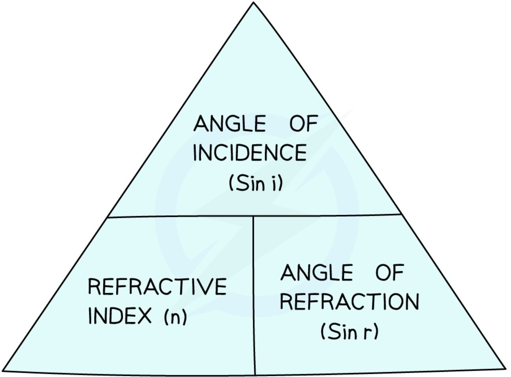

        **Snell's law formula triangle**

The **refractive index** is a number related to the speed of light in the material (which is **always less** than the speed of light in a vacuum):

$$ \text{refractive index, } n = \frac{\text{speed of light in a vacuum}}{\text{speed of light in material}} $$

The refractive index is a number that is **always larger than 1**, and is different for different materials: objects which are more **optically dense** have a **higher** refractive index (e.g. $n$ is about 2.4 for diamond), while objects which are less **optically dense** have a **lower** refractive index (e.g. $n$ is about 1.5 for glass). Since the refractive index is a **ratio**, it has **no units**.

!!! example "Worked Example (calculation)"

    A ray of light enters a glass block of refractive index 1.53 making an angle of 15° with the normal before entering the block.

    Calculate the angle it makes with the normal after it enters the glass block.

    ??? success "Answer:"

        **Step 1: Identify the known quantities**

        * Refractive index of glass, $n = 1.53$

        * Angle of incidence, $i = 15^\circ$

        **Step 2: State the equation for Snell's law**

        $$ n = \frac{\sin i}{\sin r} $$

        **Step 3: Substitute the known values**

        $$ 1.53 = \frac{\sin(15^\circ)}{\sin r} $$

        **Step 4: Rearrange to make $\sin r$ the subject**

        $$ \sin r = \frac{\sin(15^\circ)}{1.53} $$

        **Step 5: Evaluate, then use the inverse sin function to find $r$**

        $$ \sin r = 0.1692 $$

        $$r = \sin^{-1} (0.1692) = 9.7^\circ$$

        **Step 6: Give the answer to an appropriate precision, with unit**

        The refractive index and angle of incidence are each given to 2–3 significant figures, so:

        $$r = 10^\circ$$

!!! tip "Examiner Tips and Tricks"

    **Important:** in Snell's law $\frac{\sin i}{\sin r}$ is not the same as $\frac{i}{r}$. Incorrectly cancelling the sin terms is a common mistake!

    When calculating the value of $i$ or $r$ start by calculating the value of $\sin i$ or $\sin r$. You can then use the **inverse sin** function ($\sin^{-1}$ on most calculators by pressing 'shift' then 'sine') to find the angle.

    One way to remember which way around $i$ and $r$ are in the fraction is remembering that 'i' comes before 'r' in the alphabet, and therefore is on the top of the fraction (whilst $r$ is on the bottom).

## Core practical 5: investigating Snell's law

This experiment aims to investigate the refractive index of glass, using a glass block.

### Variables

* **Independent variable** = angle of incidence, *i*

* **Dependent variable** = angle of refraction, *r*

* Control variables:

    - Use of the same perspex block

    - Width of the light beam

    - Same frequency / wavelength of the light

### Equipment

<table>
  <thead>
    <tr>
        <th>Equipment</th>
        <th>Purpose</th>
    </tr>
  </thead>
  <tbody>
    <tr>
        <td>Ray Box</td>
        <td>To provide a narrow beam of light that can be easily refracted</td>
    </tr>
    <tr>
        <td>Protractor</td>
        <td>To measure the angles of incidence and refraction</td>
    </tr>
    <tr>
        <td>Sheet of Paper</td>
        <td>To mark the lines indicating the incident and refracted rays</td>
    </tr>
    <tr>
        <td>Pencil</td>
        <td>To draw the incident and refracted ray lines onto the paper</td>
    </tr>
    <tr>
        <td>Ruler</td>
        <td>To draw the incident and refracted ray lines onto the paper</td>
    </tr>
    <tr>
        <td>Perspex rectangle</td>
        <td>To refract the light beam</td>
    </tr>
  </tbody>
</table>

**Resolution of measuring equipment:**

* Protractor = 1°

* Ruler = 1 mm

### Method

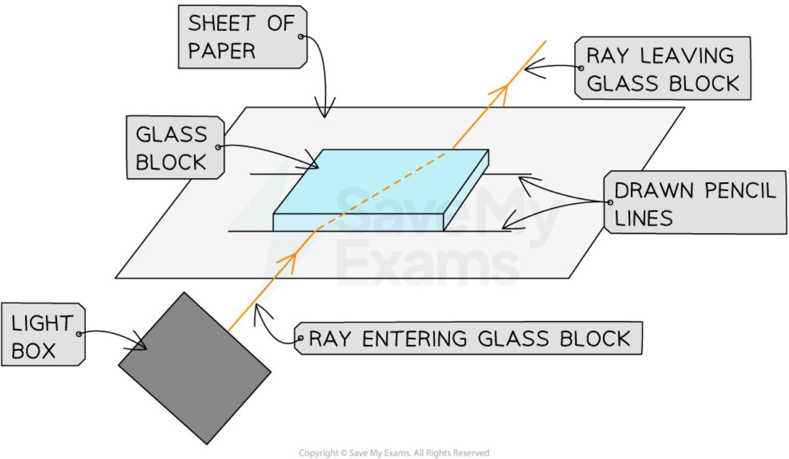

1. Place the glass block on a sheet of paper, and carefully draw around the block using a pencil

2. Draw a dashed line normal (at right angles) to the outline of the block

3. Use a protractor to measure the angles of incidence to be studied and mark these lines on the paper

4. Switch on the ray box and direct a beam of light at the side face of the block at the first angle to be investigated

5. Mark on the paper:

    * A point on the ray close to the ray box

    * The point where the ray enters the block

    * The point where the ray exits the block

    * A point on the exit light ray which is a distance of about 5 cm away from the block

6. Remove the block and join the points marked with three straight lines

7. Replace the block within its outline and repeat the above process for a ray striking the block at the next angle

### An example results table

<table>
  <thead>
    <tr>
        <th>Angle of incidence, i / °</th>
        <th>Angle of refraction, r / °</th>
    </tr>
  </thead>
  <tbody>
    <tr>
        <td colspan="2">0</td>
    </tr>
    <tr>
        <td colspan="2">10</td>
    </tr>
    <tr>
        <td colspan="2">20</td>
    </tr>
    <tr>
        <td colspan="2">30</td>
    </tr>
    <tr>
        <td colspan="2">40</td>
    </tr>
    <tr>
        <td colspan="2">50</td>
    </tr>
    <tr>
        <td colspan="2">60</td>
    </tr>
    <tr>
        <td colspan="2">70</td>
    </tr>
    <tr>
        <td colspan="2">80</td>
    </tr>
  </tbody>
</table>

### Analysis of results

If the angles have been measured correctly, the paper should end up looking like this:

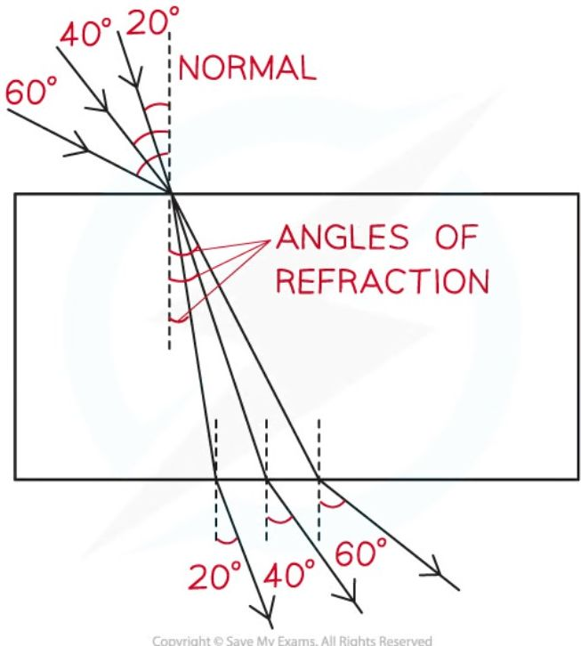

[Snell's law](#snells-law) relates the angles of incidence and refraction. Plot a graph of sin i on the y-axis against sin r on the x-axis — the refractive index is equal to the gradient of the graph.

<table>
  <thead>
    <tr>
        <th>sin r</th>
        <th>sin i</th>
    </tr>
  </thead>
  <tbody>
    <tr>
        <td>0</td>
        <td>0</td>
    </tr>
    <tr>
        <td>0.1</td>
        <td>0.15</td>
    </tr>
    <tr>
        <td>0.2</td>
        <td>0.3</td>
    </tr>
    <tr>
        <td>0.3</td>
        <td>0.45</td>
    </tr>
    <tr>
        <td>0.4</td>
        <td>0.6</td>
    </tr>
    <tr>
        <td>0.5</td>
        <td>0.75</td>
    </tr>
    <tr>
        <td>0.6</td>
        <td>0.9</td>
    </tr>
    <tr>
        <td>0.7</td>
        <td>1.05</td>
    </tr>
    <tr>
        <td>0.8</td>
        <td>1.2</td>
    </tr>
  </tbody>
</table>

*A graph of the results of Snell's law experiment*

$$ \text{gradient} = n = \frac{\sin i}{\sin r} $$

### Evaluating the experiment

#### Systematic errors

* An error could occur if the 90° lines are drawn incorrectly

    - Use a set square to draw perpendicular lines

#### Random errors

* The points for the incoming and reflected beam may be inaccurately marked

    - Use a sharpened pencil and mark in the middle of the beam

* The protractor resolution may make it difficult to read the angles accurately

    - Use a protractor with a higher resolution

#### Safety considerations

* The ray box light could cause burns if touched

    - Run burns under cold running water for at least five minutes

* Looking directly into the light may damage the eyes

    - Avoid looking directly at the light

    - Stand behind the ray box during the experiment

* Keep all liquids away from the electrical equipment and paper

## Total internal reflection

!!! abstract "Definition: Total internal reflection"
    Total internal reflection (TIR) occurs when **the angle of incidence is greater than the critical angle and the incident material is denser than the second material**. Sometimes, when light is moving from a denser medium towards a less dense one, instead of being refracted, all of the light is **reflected** — this phenomenon is called total internal reflection.

Therefore, the **two** conditions for total internal reflection are that the incident material is denser than the second material, and that the angle of incidence is greater than the critical angle.

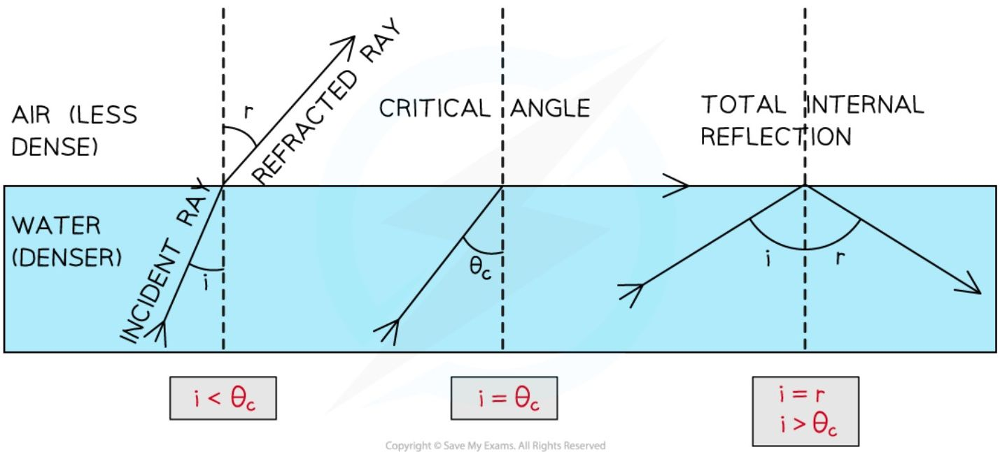

*The critical angle is different for different materials. Refraction occurs when the angle of incidence is less than the critical angle, and total internal reflection occurs when it is greater*

### Uses of TIR

#### Optical fibres

Total internal reflection is used to reflect light along optical fibres, meaning they can be used for communications, endoscopes, and decorative lamps. Light travelling down an optical fibre is totally internally reflected each time it hits the edge of the fibre.

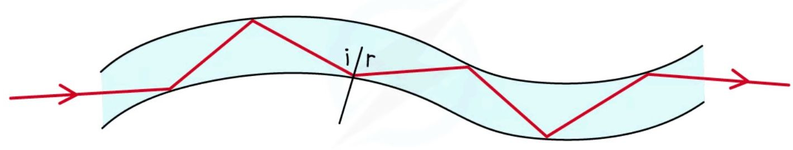

***Optical fibres utilise total internal reflection for communications***

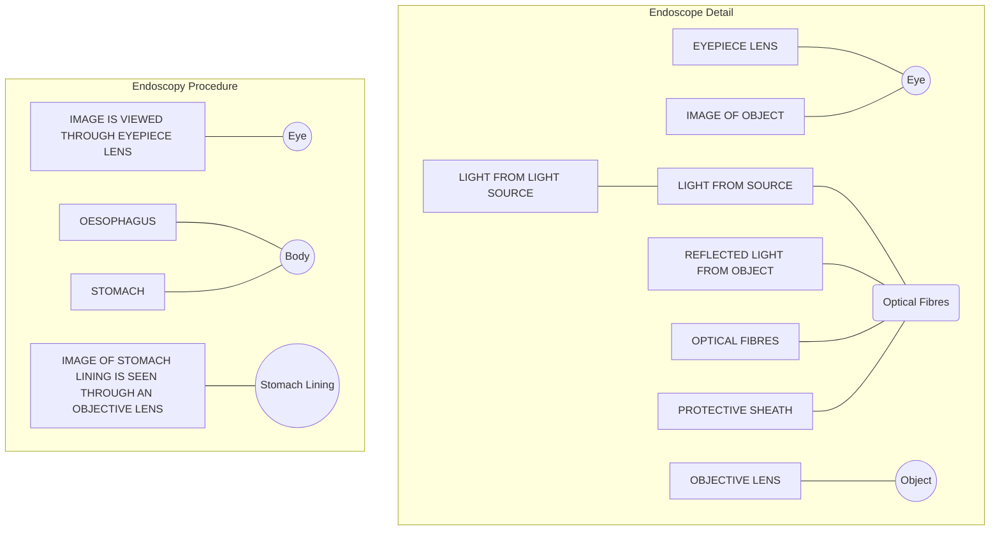

*Endoscopes utilise total internal reflection to see inside a patient's body*

#### Prisms

Prisms are used in a variety of optical instruments, including periscopes, binoculars, telescopes and cameras. Prisms are also used in safety reflectors for bicycles and cars, as well as posts marking the edges of roads. A periscope is a device consisting of two right-angled prisms that can be used to see over tall objects.

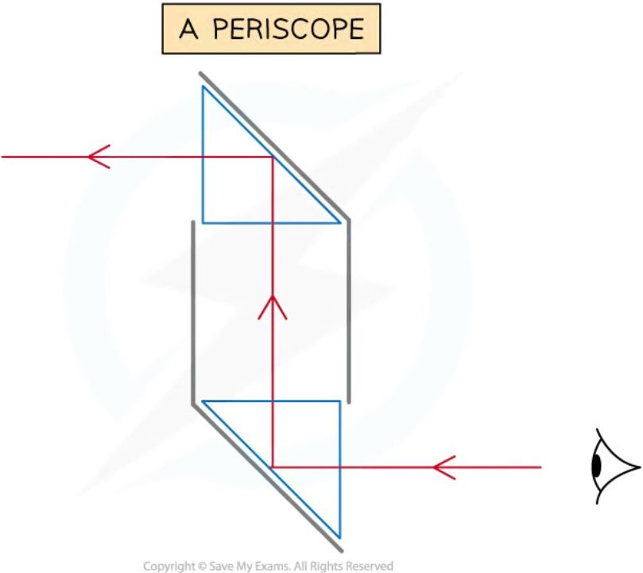

*When light travels through a periscope, it totally internally reflects through prisms causing the light to reflect at right angles*

The light totally internally reflects in both prisms.

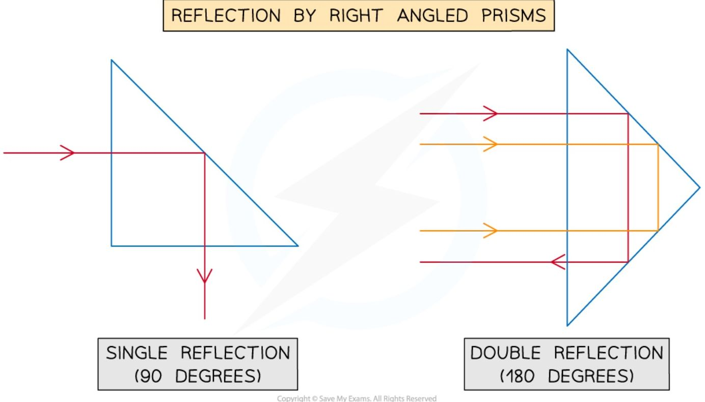

*Single and double reflection through right-angled prisms*

!!! tip "Examiner Tips and Tricks"

    If asked to name the phenomena make sure you give the whole name – **total internal reflection**.

    Remember: total internal reflection occurs when going from a denser material to a less dense material and **ALL** of the light is reflected.

    If asked to give an example of a use of total internal reflection, first state the name of the object that causes the reflection (e.g. a right-angled prism) and then name the device in which it is used (e.g. a periscope)

### Critical angle

!!! abstract "Definition: Critical angle"
    As the angle of incidence is increased, the angle of refraction also increases until it gets closer to 90°. When the angle of refraction is exactly 90°, the light is refracted along the boundary — at this point, the angle of incidence is known as the **critical angle, $c$**.

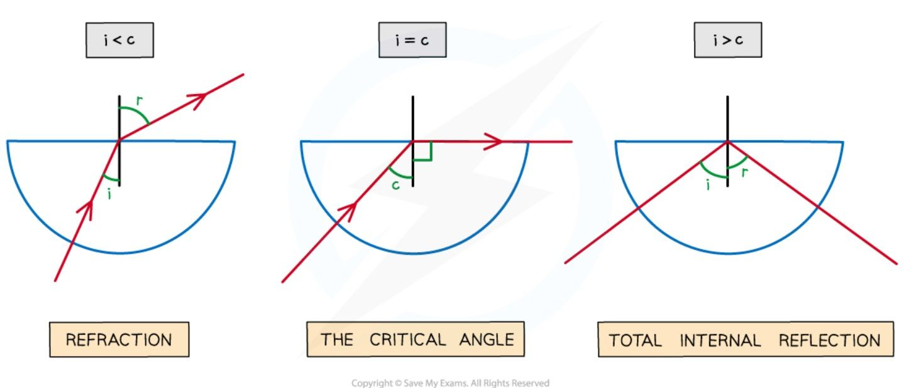

*As the angle of incidence increases it will eventually surplus the critical angle and lead to total internal reflection of the light*

When the angle of incidence is larger than the critical angle, the refracted ray is instead reflected — this is **total internal reflection**.

!!! example "Worked Example (method)"

    A glass cube is held in contact with a liquid and a light ray is directed at a vertical face of the cube. The angle of incidence at the vertical face is 39° and the angle of refraction is 25° as shown in the diagram.

    The light ray is totally internally reflected for the first time at **X**.

    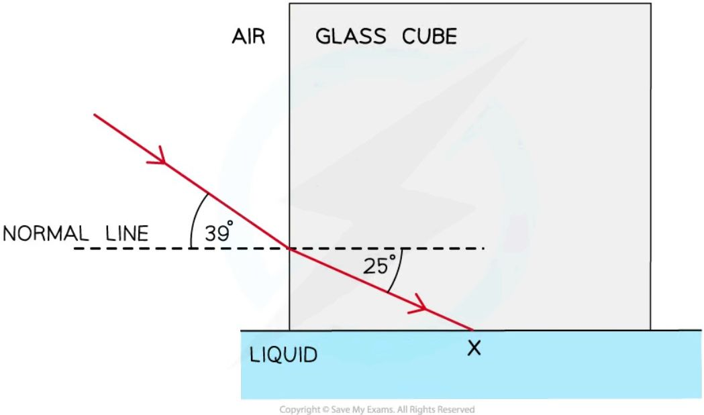

    Complete the diagram to show the path of the ray beyond **X** to the air and calculate the critical angle for the glass-liquid boundary.

    ??? success "Answer:"

        **Step 1: Draw the reflected angle at the glass-liquid boundary**

        When a light ray is reflected, the angle of incidence = angle of reflection, so the angle of incidence (or reflection) is $90° - 25° = 65°$.

        **Step 2: Draw the refracted angle at the glass-air boundary**

        At the glass-air boundary, the light ray refracts away from the normal. Due to the reflection, the light rays are symmetrical to the other side.

        **Step 3: Calculate the critical angle**

        The question states the ray is "totally internally reflected for the first time", meaning this is the lowest angle at which TIR occurs. Therefore, 65° is the critical angle.

        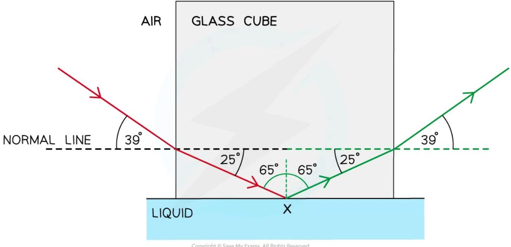

!!! tip "Examiner Tips and Tricks"

    If you are asked to explain what is meant by the critical angle in an exam, you can be sure to gain full marks by drawing and labelling the same diagram above (showing the three semi-circular blocks).

#### Calculating critical angle

The critical angle, $c$, of a material is related to its **refractive index**, $n$:

!!! note "Required formulae: critical angle and refractive index"
    $$ \sin c = \frac{1}{n} $$

    This can also be rearranged to calculate the refractive index:

    $$ n = \frac{1}{\sin c} $$

This equation shows that the larger the **refractive index** of a material, the smaller the **critical angle** — light rays inside a material with a **high refractive index** are more likely to be **totally internally reflected**.

!!! example "Worked Example (calculation)"

    Opals and diamonds are transparent stones used in jewellery. Jewellers shape the stones so that light is reflected inside. Compare the critical angles of opal and diamond and explain which stone would appear to sparkle more.

    The refractive index of opal is about 1.5. The refractive index of diamond is about 2.4.

    ??? success "Answer:"

        **Step 1: List the known quantities**

        * Refractive index of opal, no = 1.5

        * Refractive index of diamond, nd = 2.4

        **Step 2: Write out the equation relating critical angle and refractive index**

        $$ \sin c = \frac{1}{n} $$

        **Step 3: Calculate the critical angle of opal (co)**

        $$ \sin(c_o) = \frac{1}{1.5} = 0.6667 $$

        $$ c_o = \sin^{-1}(0.6667) = 41.8 = 42^\circ $$

        **Step 4: Calculate the critical angle of diamond (cd)**

        $$ \sin(c_d) = \frac{1}{2.4} = 0.4167 $$

        $$ c_d = \sin^{-1}(0.4167) = 24.6 = 25^\circ $$

        **Step 5: Compare the two values and write a conclusion**

        Total internal reflection occurs when the angle of incidence of light is **larger** than the critical angle ($i>c$). In opal, total internal reflection will occur for angles of incidence between 42° and 90°. The critical angle of diamond is **lower** than the critical angle of opal ($c_o>c_d$), meaning light rays will be totally internally reflected in diamond over a **larger** range of angles (25° to 90°). Therefore, more total internal reflection will occur in diamond, so it will appear to sparkle more than the opal.

!!! tip "Examiner Tips and Tricks"

    When calculating the value of the critical angle using the above equation:

    * First use the refractive index, *n*, to find sin(c)

    * Then use the **inverse** sin function (sin-1) to find the value of c
