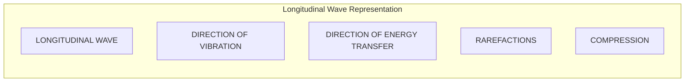
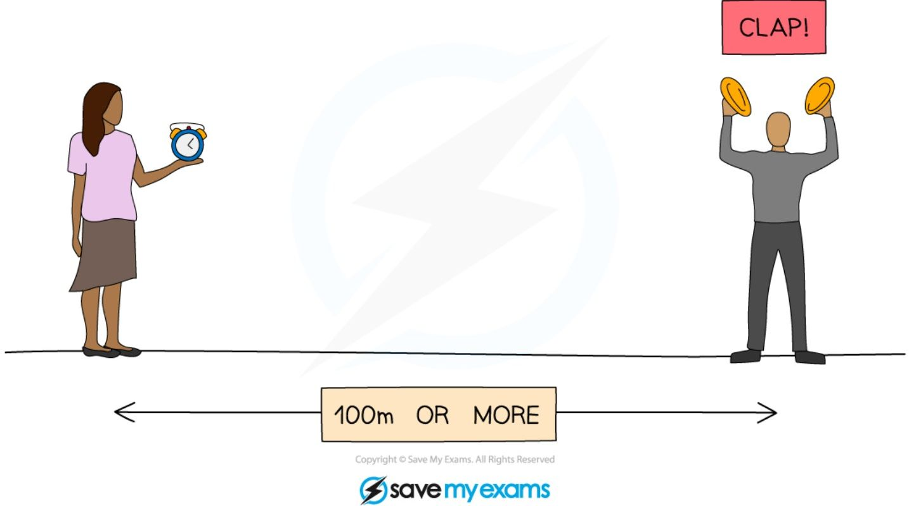
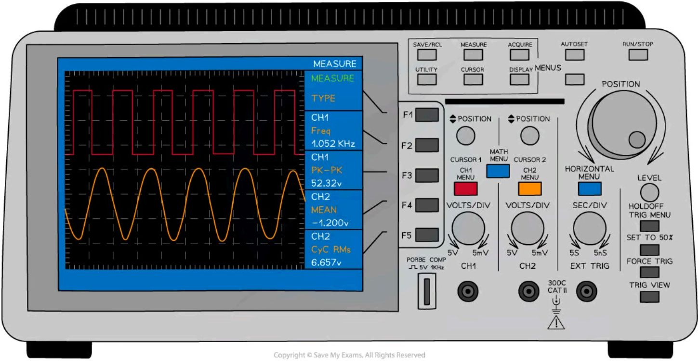
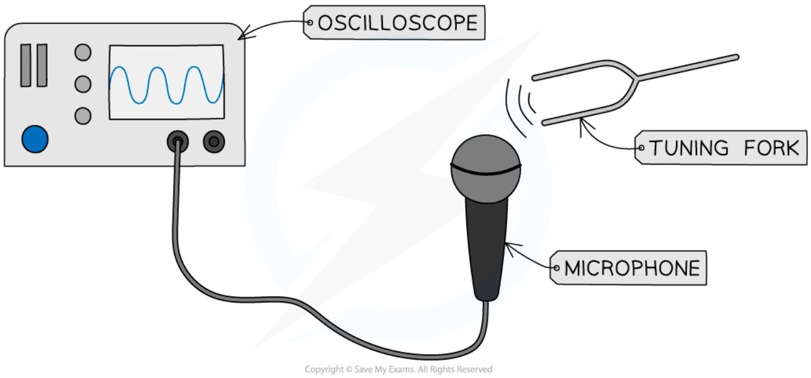
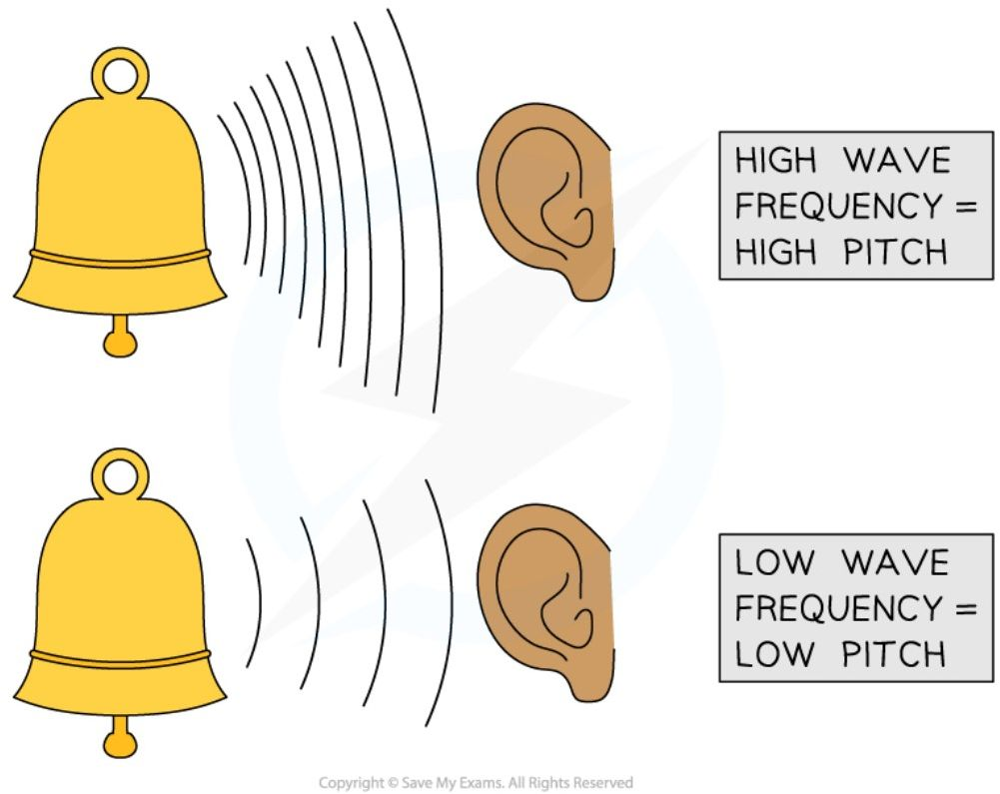

# Sound waves

## Overview of the properties of sound

Sound waves are **longitudinal waves** (see [Transverse and longitudinal waves](3_1_describing-waves.md#transverse-and-longitudinal-waves)). Longitudinal waves are usually drawn as several lines to show that the wave is moving **parallel** to the direction of energy transfer: drawing the lines closer together represents the **compressions**, and drawing them further apart represents the **rarefactions**.


*(The diagram above shows a longitudinal wave represented by vertical lines. A red box on the left labeled "DIRECTION OF VIBRATION" has a double-headed red arrow. A blue box on the right labeled "DIRECTION OF ENERGY TRANSFER" has a blue arrow pointing right. Brackets at the bottom identify "RAREFACTIONS" where lines are spread out and "COMPRESSION" where lines are close together.)*

***Longitudinal waves are represented as sets of lines with rarefactions and compressions***

Sound can also undergo [reflection and refraction](3_3_light-waves.md#reflection-vs-refraction), just like any other wave. The reflection of a sound wave is called an **echo**.

## Core practical 6: investigating the speed of sound

=== "Clap"
    This method aims to measure the speed of sound in air between two points, by timing a clap by eye and ear over a known distance.

=== "Using Oscilloscope"
    This method aims to measure the speed of sound in air between two points, using an oscilloscope to time a clap far more precisely.

### Equipment

=== "Clap"
    <table>
    <thead>
        <tr>
            <th>Equipment</th>
            <th>Purpose</th>
        </tr>
    </thead>
    <tbody>
        <tr>
            <td>Trundle Wheel</td>
            <td>To measure the distance travelled by the sound waves</td>
        </tr>
        <tr>
            <td>Wooden Blocks</td>
            <td>To create a sound when banged together</td>
        </tr>
        <tr>
            <td>Stopwatch</td>
            <td>To time how long it takes the sound waves to travel</td>
        </tr>
    </tbody>
    </table>

    **Resolution** of measuring equipment:

    * Trundle wheel = 0.01 m

    * Stopwatch = 0.01 s

=== "Using Oscilloscope"
    <table>
    <thead>
        <tr>
            <th>Equipment</th>
            <th>Purpose</th>
        </tr>
    </thead>
    <tbody>
        <tr>
            <td>Oscilloscope</td>
            <td>To display the sound wave electronically</td>
        </tr>
        <tr>
            <td>Microphones x2</td>
            <td>To detect sound waves and turn them into an electrical signal</td>
        </tr>
        <tr>
            <td>Wooden Blocks</td>
            <td>To create a sound when banged together</td>
        </tr>
        <tr>
            <td>Tape Measure</td>
            <td>To measure the distance between microphones</td>
        </tr>
    </tbody>
    </table>

    **Resolution** of measuring equipment:

    * Tape measure = 0.1 cm

### Variables

=== "Clap"

    * **Independent variable** = Distance

    * **Dependent variable** = Time

    * Control variables:

        * Same location to carry out the experiment

=== "Using Oscilloscope"

    * **Independent variable** = Distance

    * **Dependent variable** = Time

    * Control variables:

        * Same location to carry out the experiment

        * Same set of microphones for each trial

### Method

=== "Clap"

    

    **Measuring the speed of sound directly between two points**

    1. Use the trundle wheel to measure a distance of 100 m between two people

    2. One of the people should have two wooden blocks, which they will bang together above their head to generate sound waves

    3. The second person should have a stopwatch which they start when they see the first person banging the blocks together and stop when they hear the sound

    4. This should be repeated several times and an average taken for the time travelled by the sound waves

    5. Repeat this experiment for various distances, e.g. 120 m, 140 m, 160 m, 180 m

=== "Using Oscilloscope"

    ```mermaid
    graph TD
        subgraph Setup
            OSC[OSCILLOSCOPE]
            CLAP[CLAP!]
            MIC1[MICROPHONE 1]
            MIC2[MICROPHONE 2]
            DIST[A FEW METRES]
        end
        CLAP -- Sound Wave --> MIC1
        MIC1 -- Signal --> OSC
        CLAP -- Sound Wave --> MIC2
        MIC2 -- Signal --> OSC
        MIC1 --- DIST --- MIC2
    ```
    *Diagram showing an oscilloscope connected to two microphones with a sound source labeled CLAP! and a distance labeled A FEW METRES.*

    **Measuring the speed of sound using an oscilloscope**

    1. Connect two microphones to an oscilloscope

    2. Place them about 2 m apart using a tape measure to measure the distance between them

    3. Set up the oscilloscope so that it triggers when the first microphone detects a sound, and adjust the time base so that the sound arriving at both microphones can be seen on the screen

    4. Make a large clap using the two wooden blocks next to the first microphone

    5. Use the oscilloscope to determine the time at which the clap reaches each microphone and the time difference between them

    6. Repeat this experiment for several distances, e.g. 2 m, 2.5 m, 3 m, 3.5 m

### Results

=== "Clap"
    **An example results table for the speed of sound in air**
    <table>
    <thead>
        <tr>
            <th>Distance / m</th>
            <th>Time 1 / s</th>
            <th>Time 2 / s</th>
            <th>Time 3 / s</th>
            <th>Average time / s</th>
        </tr>
    </thead>
    <tbody>
        <tr>
            <td colspan="5">100</td>
        </tr>
        <tr>
            <td colspan="5">120</td>
        </tr>
        <tr>
            <td colspan="5">140</td>
        </tr>
        <tr>
            <td colspan="5">160</td>
        </tr>
        <tr>
            <td colspan="5">180</td>
        </tr>
    </tbody>
    </table>

=== "Using Oscilloscope"

    **An example results table for obtaining the speed of sound using an oscilloscope**

    <table>
    <thead>
        <tr>
            <th>Distance / m</th>
            <th>Time 1 / s</th>
            <th>Time 2 / s</th>
            <th>Time 3 / s</th>
            <th>Average time / s</th>
        </tr>
    </thead>
    <tbody>
        <tr>
            <td colspan="5">2.0</td>
        </tr>
        <tr>
            <td colspan="5">2.5</td>
        </tr>
        <tr>
            <td colspan="5">3.0</td>
        </tr>
        <tr>
            <td colspan="5">3.5</td>
        </tr>
        <tr>
            <td colspan="5">4.0</td>
        </tr>
    </tbody>
    </table>

### Analysis of results

=== "Clap"
    The speed of sound can be calculated using the equation $\text{average speed} = \frac{\text{distance moved}}{\text{time taken}}$. The speed of sound in air should work out to be about 340 m/s.

=== "Using an oscilloscope"
    The speed of sound can be calculated using the equation $\text{average speed} = \frac{\text{distance moved}}{\text{time taken}}$. The speed of sound in air should work out to be about 340 m/s.

### Evaluating the experiments

#### Systematic errors

=== "Clap"

=== "Using an oscilloscope"

    * Ensure the scale of the time base is accounted for correctly

        - The scale is likely to be small (e.g. milliseconds) so ensure this is taken into account when calculating speed

#### Random errors

=== "Clap"
    * The main cause of error in this experiment is the measurement of time
    * Ensure to take repeat readings when timing intervals and calculate an average to keep this error to a minimum
    * Maximise the distance between the two people where possible. This will reduce the error in measurements of time because the time taken by the sound waves to travel will be greater

=== "Using an oscilloscope"

!!! tip "Examiner Tips and Tricks"

    When answering questions about methods to measure waves, the question could ask you to comment on the accuracy of the measurements.

    In the case of measuring the speed of sound, the oscilloscope method is the **most** accurate, because the timing is done automatically, while the clap method is the **least** accurate, because the time interval is very short.

    Whilst this may not be too important when giving a method, you should be able to explain why each method is accurate or inaccurate and suggest ways of making them better (use bigger distances). For example, if a manual stopwatch is being used there could be variation in the time measured of up to 0.2 seconds, due to a person's reaction time — and the time interval could be as little as 0.3 seconds for sound travelling in the air, meaning the variation due to the stopwatch readings has a big influence on the results, and they may not be reliable.

## Using an oscilloscope to study sound

An **oscilloscope** is a device that can be used to study a rapidly **changing signal**, such as a **sound wave** or an **alternating current**.



*Oscilloscopes have lots of dials and buttons, but their main purpose is to display and measure changing signals like sound waves and alternating current*

When a microphone is connected to an **oscilloscope**, the (longitudinal) sound wave is displayed as though it were a transverse wave on the screen. The **time base** (like the 'x-axis') is used to measure the **time period** of the wave.

<table>
  <thead>
    <tr>
        <th>Label</th>
        <th>Description</th>
    </tr>
  </thead>
  <tbody>
    <tr>
        <td>AMPLITUDE</td>
        <td>Vertical distance from the center line to the peak of the wave.</td>
    </tr>
    <tr>
        <td>ONE TIME PERIOD (T)</td>
        <td>Horizontal distance for one complete wave cycle.</td>
    </tr>
    <tr>
        <td>TIME BASE</td>
        <td>Horizontal axis representing the time scale on the oscilloscope.</td>
    </tr>
  </tbody>
</table>

*A sound wave is displayed as though it were a transverse wave on the screen of the oscilloscope. The time base can be used to measure a full time period of the wave cycle*

The height of the wave (measured from the centre of the screen) is related to the **amplitude** of the sound, and the number of entire waves that appear on the screen is related to the **frequency** of the wave — if the frequency of the sound wave **increases**, **more** waves are displayed on screen.

!!! tip "Examiner Tips and Tricks"

    Take time to understand how the oscilloscope displays sound as a waveform, as it is more complicated than you think. Make sure you know what happens to the wave if you change either the horizontal or vertical axis.

### Core practical 7: using an oscilloscope

This experiment aims to investigate the frequency of a sound wave using an oscilloscope.

#### Variables

* **Independent variable** = Tuning forks of different frequencies

* **Dependent variable** = Time period

#### Equipment

<table>
  <thead>
    <tr>
        <th>Equipment</th>
        <th>Purpose</th>
    </tr>
  </thead>
  <tbody>
    <tr>
        <td>Tuning fork</td>
        <td>To generate sound waves of different frequencies</td>
    </tr>
    <tr>
        <td>Microphone</td>
        <td>To detect sound waves from the tuning fork</td>
    </tr>
    <tr>
        <td>Oscilloscope</td>
        <td>To display the sound waves electronically</td>
    </tr>
    <tr>
        <td>Wires</td>
        <td>To connect the microphone to the oscilloscope</td>
    </tr>
  </tbody>
</table>

#### Method



1. Connect the microphone to the oscilloscope as shown in the image above

2. Test the microphone displays a signal by humming

3. Adjust the time base of the oscilloscope until the signal fits on the screen - ensure that multiple complete waves can be seen

4. Strike the tuning fork on the edge of a hard surface to generate sound waves of a pure frequency

5. Hold the tuning fork near to the microphone and observe the sound wave on the oscilloscope screen

6. Freeze the image on the oscilloscope screen, or take a picture of it

7. Measure and record the time period of the wave signal on the screen by counting the number of divisions for one complete wave cycle

8. Repeat steps 4–6 for a variety of tuning forks

#### Results

Count the number of divisions along the time base for one complete wave, then use the scale of the time base to convert the period from divisions to seconds.

<table>
  <thead>
    <tr>
        <th>TUNING FORK</th>
        <th>TIME PERIOD / DIV</th>
        <th>TIME PERIOD / s</th>
    </tr>
  </thead>
  <tbody>
    <tr>
        <td colspan="3">1</td>
    </tr>
    <tr>
        <td colspan="3">2</td>
    </tr>
    <tr>
        <td colspan="3">3</td>
    </tr>
    <tr>
        <td colspan="3">4</td>
    </tr>
    <tr>
        <td colspan="3">5</td>
    </tr>
  </tbody>
</table>

#### Analysis of results

To convert the time period of the wave from the number of divisions into seconds, use the scale of the time base — for example, the time base is usually measured in units of ms/cm (milliseconds per centimetre), so a wave with a time base of 4 cm has a time period of 4 ms. To calculate the frequency of the sound waves produced by the tuning forks, use the [wave equation](3_1_describing-waves.md#frequency-and-time-period) $f = \frac{1}{T}$.

#### Evaluating the experiment

##### Systematic errors

* Ensure the scale of the time base is accounted for correctly

    - The scale is likely to be small (e.g. milliseconds) so ensure this is taken into account when calculating the time period

##### Random errors

* A cause of random error in this experiment is noise in the environment, so ensure it is carried out in a quiet location

!!! tip "Examiner Tips and Tricks"
    You have a lot of core practicals to know about. Make sure you don't get those relating to sound confused with each other. To succeed in questions about this particular practical you need to know exactly how an oscilloscope works — revise this in [Using an oscilloscope to study sound](#using-an-oscilloscope-to-study-sound) above.

## Pitch and loudness

### Pitch

The **pitch** of a sound is related to the **frequency** of the vibrating source of sound waves: if the **frequency** of vibration is **high**, the sound wave has a **high pitch**, and if it is **low**, the sound wave has a **low pitch**.



*The pitch of the sound is related to the frequency of the sound waves. In an oscilloscope trace, a higher-pitched wave has a smaller wavelength (more waves fit on screen) than a lower-pitched one*

### Loudness

The **loudness** of a sound is related to the **amplitude** of the vibrating source of sound waves: a **loud** sound has a **large amplitude**. In an oscilloscope trace, a louder wave has a greater height (amplitude) than a quieter one of the same frequency.

### Range of human hearing

The human ear responds to the vibrations caused by sound waves. The frequency range for human hearing is **20 Hz to 20 000 Hz**: below the frequencies that humans can hear is **infrasound**, and above them is **ultrasound**.

<table>
  <thead>
    <tr>
        <th>Frequency (Hz)</th>
        <th>Range Label</th>
        <th>Pitch/Frequency Description</th>
    </tr>
  </thead>
  <tbody>
    <tr>
        <td>2 Hz</td>
        <td>(INFRASOUND)</td>
        <td>LOW FREQUENCY AND PITCH</td>
    </tr>
    <tr>
        <td>20 Hz</td>
        <td>RANGE OF HUMAN HEARING (20-20 000 Hz)</td>
        <td> </td>
    </tr>
    <tr>
        <td>200 Hz</td>
        <td>RANGE OF HUMAN HEARING (20-20 000 Hz)</td>
        <td> </td>
    </tr>
    <tr>
        <td>2000 Hz</td>
        <td>RANGE OF HUMAN HEARING (20-20 000 Hz)</td>
        <td> </td>
    </tr>
    <tr>
        <td>20 000 Hz</td>
        <td>ULTRASOUND</td>
        <td>HIGH FREQUENCY AND PITCH</td>
    </tr>
    <tr>
        <td>200 000 Hz</td>
        <td>ULTRASOUND</td>
        <td>HIGH FREQUENCY AND PITCH</td>
    </tr>
  </tbody>
</table>

*The range of human hearing is between 20 – 20 000 Hz. Below 20 Hz is known as infrasound. Above 20 000 Hz is known as ultrasound*

!!! tip "Examiner Tips and Tricks"

    Remember that altering the frequency of a sound wave does not affect the volume, only the wave pitch. Changing the amplitude of the wave changes the volume.
