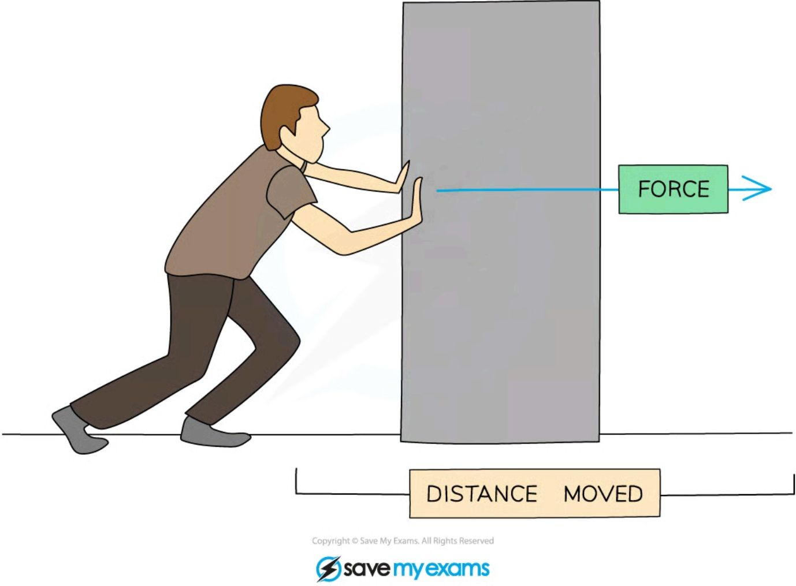
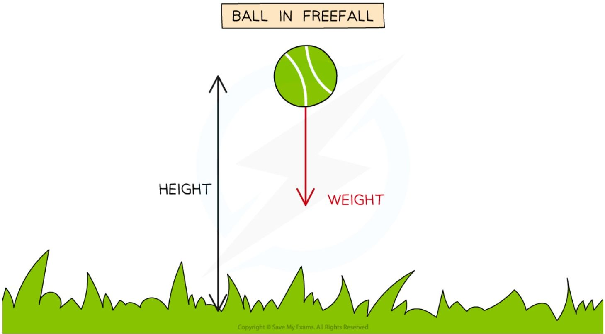
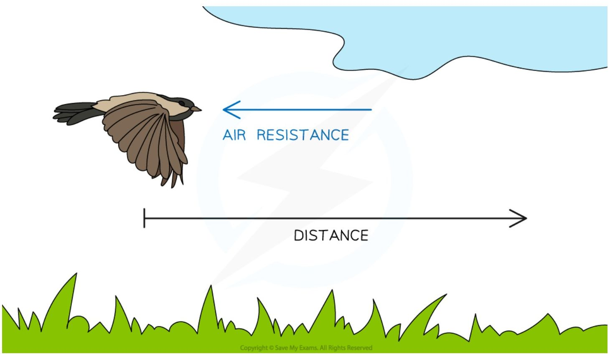
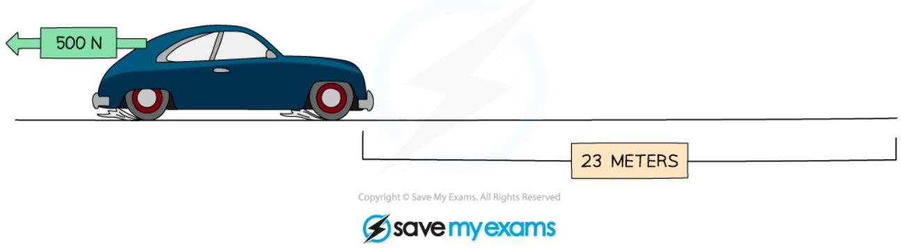
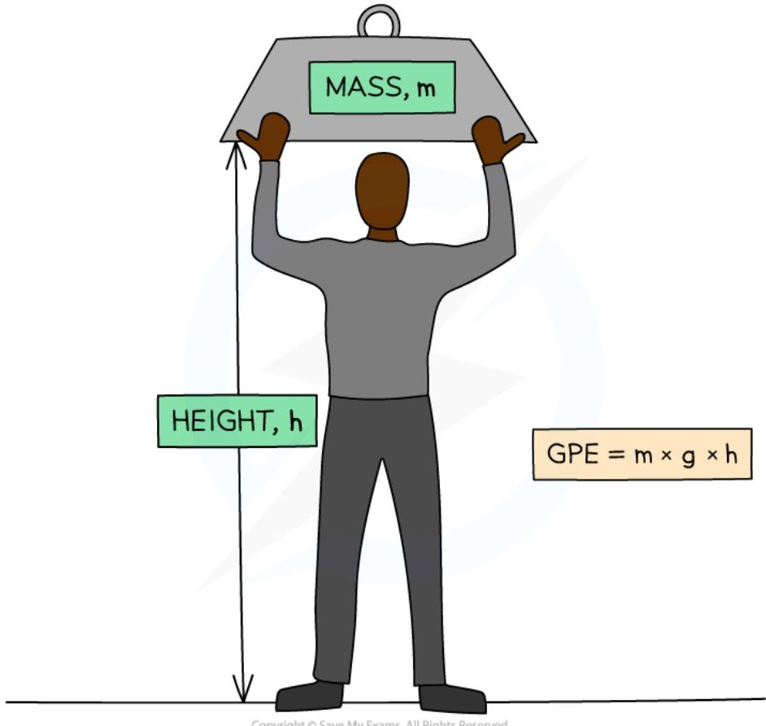
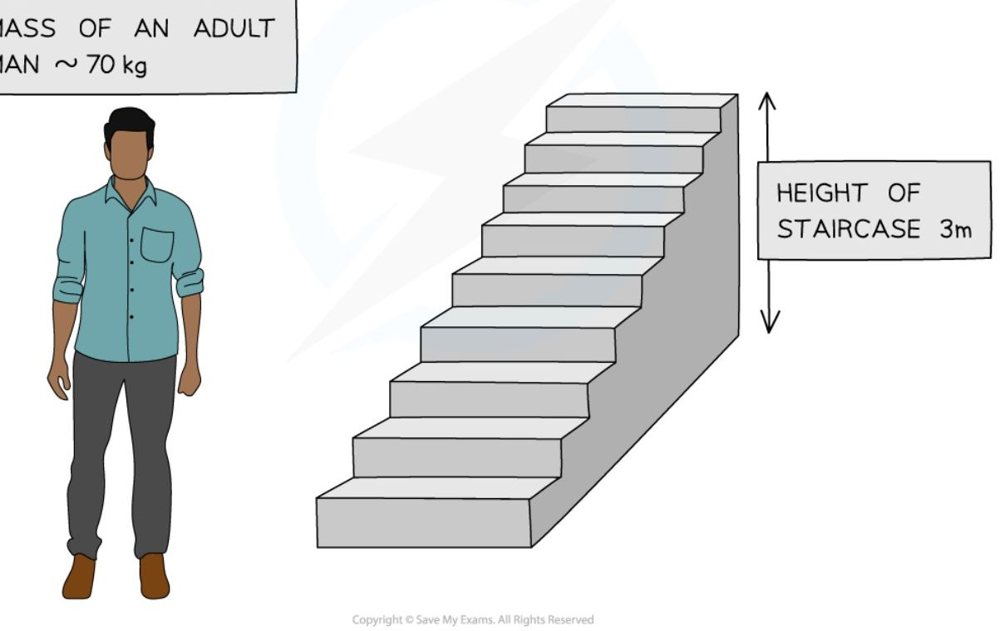
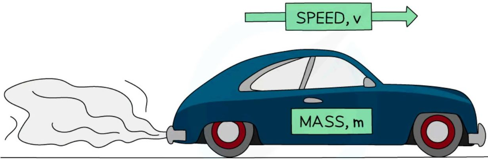
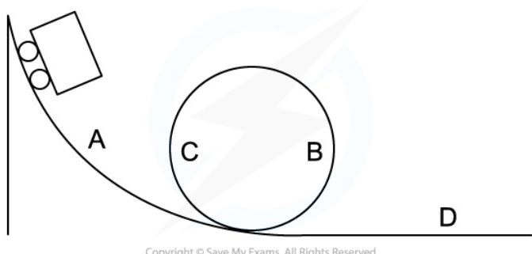
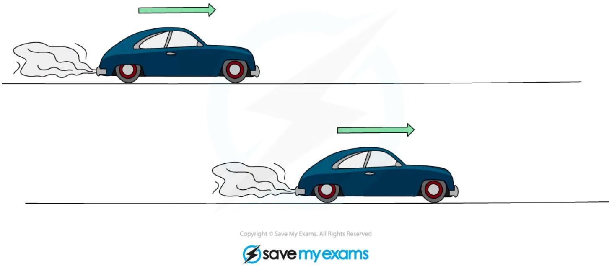
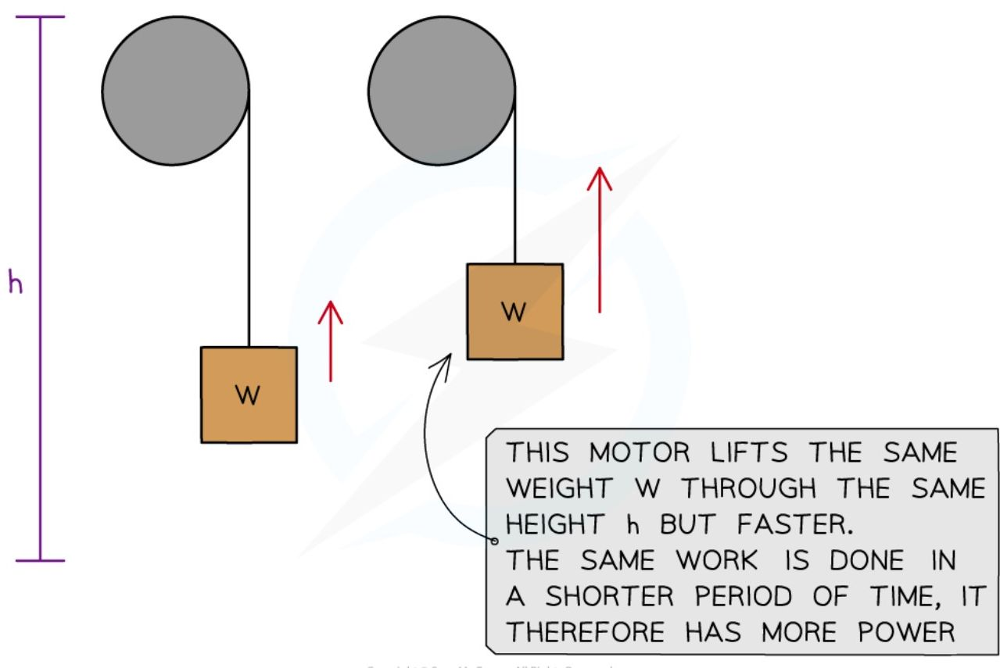

# Mechanical Energy transfers

## Work

### Definition and examples

* Work is done when an object is moved over a **distance** by a **force** applied in the **direction** of its displacement

    - It is said that the **force does work** on the object

    - If a force is applied to an object but doesn't result in any movement, no work is done

* When work is done on an object, **energy is transferred**

* The amount of energy transferred (in joules) is equal to the work done (also in joules) : **energy transferred (J) = work done (J)**

=== ""1: Work done pushing a box"
    !!! example 

        

        *Work is done when a force is used to move an object over a distance, and energy is transferred from the person to the box*

        * If a force acts **in the direction** that an object is moving, then the object will **gain energy** (usually to its kinetic energy store)

        * If the force acts in the **opposite direction** to the movement, then the object will **lose energy** (dissipated to the surroundings, usually by heating)

=== "2: Work done on a ball"
    !!! example

        * Work is done on a ball when it is lifted to a height

            - The energy is transferred mechanically from the ball's kinetic energy store to its gravitational potential energy store

        

        *The weight on the ball produced by the gravitational field does work on the ball over a distance*

=== "3: Work done by a bird"
    !!! example
        

        *The bird does work against air resistance (drag) as it flies through the air*

        * Work is done when a bird flies through the air

        - The bird must travel against air resistance, therefore energy is transferred from the bird's **kinetic store** to its **thermal store** and **dissipated** to the **thermal store** of the surroundings

### Calculating Work Done

* The amount of work that is done is related to the magnitude of the **force** and the **distance** moved by the object in the direction of the force

* To calculate the amount of work done on an object by a force, the work done equation is used:

$$ W = f \times d $$

* Where:

    - *W* = **work done** in joules (J) or newton-metres (N m)

    - *F* = force in newtons (N)

    - *d* = distance in metres (m)

!!! note "Work done formula triangle"

    ```mermaid
    graph TD
        A[WORK(W)] --- B[FORCE(F)]
        A --- C[DISTANCEMOVED(d)]
        B --- C
    ```

    ***Work, force, distance formula triangle***

    * For help with how to use formula triangles, see the revision note on [Speed](https://www.savemyexams.com/igcse/physics/edexcel/19/revision-notes/1-forces-and-motion/1-1-movement-and-position/1-1-2-speed/)

!!! example "Worked Example"

    A car moving at speed begins to apply the brakes. The brakes of the car apply a force of 500 N which brings it to a stop after 23 m.

    

    Calculate the work done by the brakes in stopping the car.

    ??? note "Answer :"

        **Step 1: List the known quantities**

        * Distance, $d = 23\text{ m}$
        * Force, $F = 500\text{ N}$

        **Step 2: Write out the equation relating work, force and distance**

        $$W = F \times d$$

        **Step 3: Calculate the work done on the car by the brakes**

        $$W = 500 \times 23$$

        $$W = \mathbf{11\,500\text{ J}}$$

!!! tip "Examiner Tips and Tricks"

    Remember to always convert the distance into **metres** and force into **newtons** so that the work done is in **joules** or **newton-metres**

## Gravitational Potential Energy

* Energy in the gravitational potential store of an object is defined as: **The energy an object has due to its height in a gravitational field**

* This means:

    - If an object is lifted up, energy will be transferred **to** its gravitational store

    - If an object falls, energy will be transferred **away from** its gravitational store

* The amount of energy in the gravitational potential store of an object can be calculated using the gravitational potential energy equation: $GPE = m \times g \times h$

* Where:

    - GPE = gravitational potential energy, in joules (J)

    - m = mass, in kilograms (kg)

    - g = gravitational field strength in newtons per kilogram (N/kg)

    - h = height in metres (m)




*Energy is transferred to the mass's gravitational store as it is lifted above the ground*

### Gravitational field strength

* The gravitational field strength (g) on the **Earth** is approximately 10 N/kg

* The gravitational field strength on the surface of the **Moon** is **less** than on the Earth
    

    - This means it would be **easier** to lift a mass on the Moon than on the Earth

* The gravitational field strength on the surface of the gas giants (eg. Jupiter and Saturn) is **more** than on the Earth
    

    - This means it would be **harder** to lift a mass on the gas giants than on the Earth

<table>
  <thead>
    <tr>
        <th>SUN</th>
        <th>JUPITER</th>
        <th>SATURN</th>
        <th>URANUS</th>
        <th>EARTH</th>
        <th>MARS</th>
        <th>MOON</th>
    </tr>
  </thead>
  <tbody>
    <tr>
        <td>g = 293.0 N/kg</td>
        <td>g = 24.7 N/kg</td>
        <td>g = 10.5 N/kg</td>
        <td>g = 9.0 N/kg</td>
        <td>g = 9.8 N/kg</td>
        <td>g = 3.7 N/kg</td>
        <td>g = 1.7 N/kg</td>
    </tr>
  </tbody>
</table>

*Some values for g on the different objects in the Solar System*

* The two graphs below show how GPE changes with height for a ball being thrown up in the air and when falling down

<table>
  <thead>
    <tr>
        <th>OBJECT THROWN IN THE AIR</th>
        <th colspan="3">OBJECT FALLING</th>
    </tr>
  </thead>
  <tbody>
    <tr>
        <td>HEIGHT / m</td>
        <td>GPE / J</td>
        <td>HEIGHT / m</td>
        <td>GPE / J</td>
    </tr>
    <tr>
        <td>0</td>
        <td>0</td>
        <td>0</td>
        <td>Max</td>
    </tr>
    <tr>
        <td>Max</td>
        <td>Max</td>
        <td>Max</td>
        <td>0</td>
    </tr>
  </tbody>
</table>

Graphs showing the linear relationship between GPE and height

!!! example "Worked Example"

    A man of mass 70 kg climbs a flight of stairs that is 3 m higher than the floor.

    Gravitational field strength is approximately 10 N/kg.

    Calculate the increase in energy transferred to his gravitational potential store.

    ??? note "Answer :"

        **Step 1: List the known quantities**

        * Mass of the man, *m* = 70 kg
        * Gravitational field strength, *g* = 10 N/kg
        * Height, *h* = 3 m

        **Step 2: Write down the gravitational potential energy equation**

        $$ GPE = m \times g \times h $$

        **Step 3: Calculate the gravitational potential energy**

        $$ GPE = 70 \times 10 \times 3 $$

        $$ GPE = 2100\text{ J} $$

        > THE ENERGY REQUIRED TO OVERCOME GRAVITATIONAL POTENTIAL IS EQUAL TO mgh

        > ENERGY $\sim 70\text{kg} \times 10\text{ Nkg}^{-1} \times 3\text{m}$
        > $= 2100\text{J}$

        

!!! tip "Examiner Tips and Tricks"

    When doing calculations involving gravitational field strength, g, don't panic, you will **always** be told the value of g in your equation sheet in your exam!

## Kinetic Energy

* Energy in an object's kinetic store is defined as: **The amount of energy an object has as a result of its mass and speed**

* This means that any object in **motion** has energy in its kinetic energy store



* Kinetic energy can be calculated using the equation: $KE = \frac{1}{2} \times m \times v^2$

* Where:

    * $KE$ = kinetic energy in joules (J)

    * $m$ = mass of the object in kilograms (kg)

    * $v$ = speed of the object in metres per second (m/s)

!!! Example "Worked Example"
    Calculate the kinetic energy stored in a vehicle of mass 1200 kg moving at a speed of 27 m/s.

    ??? note "Answer :"

        **Step 1: List the known quantities**

        * Mass of the vehicle, $m = 1200\text{ kg}$

        * Speed of the vehicle, $v = 27\text{ m/s}$

        **Step 2: Write down the equation for kinetic energy**

        $$ KE = \frac{1}{2} \times m \times v^2 $$


        **Step 3: Calculate the kinetic energy**

        $$ KE = \frac{1}{2} \times 1200 \times (27)^2 $$

        $$ KE = 437\ 400\ \text{J} $$

        **Step 4: Round the final answer to 2 significant figures**

        $$ KE = 440\ 000\ \text{J} $$

!!! tip "Examiner Tips and Tricks"

    When performing calculations using the kinetic energy equation, always double-check that you have squared the speed. Forgetting to do this is the most common mistake that students make.

## Work, GPE & KE

* GPE is **gravitational potential energy**

* KE is **kinetic energy**

* In many situations, energy is transferred between the GPE and KE **stores**

* Whenever mechanical work is done (when a force acts over a distance), energy is transferred mechanically

    - This is a consequence of **conservation of energy**

* The amount of energy transferred (in joules) is equal to the work done (in joules or newton-metres) : **energy transferred (J) = work done (J or N m)**

### GPE and KE calculations

* In a **perfect** energy transfer, there is no wasted energy

* Energy transfers can be **assumed** to be perfect if the wasted energy transfer is **negligible**

    - Some exam questions will state to **ignore** air resistance for example

    - In reality, there is **no** such thing as a perfect energy transfer

* Ignoring wasted energy transfers is helpful in **calculations** because it allows energy values to be **equated**

* **Pendulums** are often used as examples of perfect energy transfers

    - All of the energy in the **kinetic store** of the pendulum is transferred **mechanically** into its **gravitational potential store**

    - And then all of the energy in the **gravitational potential store** of the pendulum is transferred **mechanically** into its **kinetic store**

    - Energy is transferred back and forth between these two stores as the pendulum swings

    - Therefore, it can be said that:

$$ KE_{total} = GPE_{total} $$

!!! Example "Worked Example"

    The diagram shows a rollercoaster going down a track. The rollercoaster takes the path A → B → C → D.

    

    The rollercoaster begins at a height of 15 m above the ground and ends at ground level.

    A Braking to stop the ride begins after it passes position D.

    The mass of the rollercoaster is 100 kg.

    Calculate the maximum speed of the rollercoaster at position D. Ignore any frictional effects before passing point D.

    ??? note "Answer :"
        **Step 1: List the known quantities**

        * Height, *h* = 15 m
        * Mass, *m* = 100 kg
        * Gravitational field strength, *g* = 10 N/kg

        **Step 2: Write out the equation for gravitational potential energy**

        $$ \Delta GPE = m \times g \times \Delta h $$

        **Step 3: Calculate the gravitational potential energy**

        $$ \Delta GPE = 100 \times 10 \times 15 $$

        $$ \Delta GPE = 15\ 000\ J $$

        **Step 4: Use energy equivalency to equate the gravitational potential and kinetic energy**

        * Frictional effects are to be ignored; therefore, a perfect energy transfer can be assumed

        $$ \Delta GPE = KE $$

        **Step 5: Write out the equation for kinetic energy**

        $$ KE = \frac{1}{2} \times m \times v^2 $$

        **Step 6: Rearrange to make speed the subject:**

        $$ v = \sqrt{\frac{2 \times KE}{m}} $$


        **Step 7: Calculate the maximum possible speed of the rollercoaster at position D**

        * At position D the rollercoaster is at ground level
        * Therefore, all the energy has been transferred from the gravitational potential to the kinetic store
        * The maximum possible speed is based on the assumption of a perfect energy transfer

        $$ v = \sqrt{\frac{2 \times 15\ 000}{100}} $$

        $$ v = 17\ \text{m/s} $$

!!! tip "Examiner Tips and Tricks"

    When the question tells you to **ignore** the effects of resistance (ie wasted energy transfers), this is a clue that you may need to use **energy equivalency** to find the missing quantity needed for your calculation.

## Power

### Definition

* **Power** is **work done** per unit **time**

* Since work done is equal to energy transferred, **power** is also **energy transferred** per unit **time**

* Machines, such as car engines, transfer energy from one energy store to another constantly over a period of **time**

    - The **rate** of this energy transfer, or the rate of work done, is **power**

* **Time** is an important consideration when it comes to **power**

* Two cars transfer the **same amount of energy**, or do the same amount of **work** to accelerate over a distance

* If one car has **more power**, it will transfer that energy, or do that work, in a **shorter amount of time**



*Two cars accelerate to the same final speed, but the one with the most power will reach that speed sooner.*

* Two electric motors:

    - lift the same weight

    - by the same height

    - but one motor lifts it **faster** than the other

* The motor that lifts the weight faster has more **power**



*Two motors with different powers*

### Power ratings

* **Power ratings** are given to appliances to show the amount of energy transferred per unit time

* Common power ratings are shown in the table below:

<table>
  <thead>
    <tr>
        <th>Appliance</th>
        <th>Power rating</th>
    </tr>
  </thead>
  <tbody>
    <tr>
        <td>A torch</td>
        <td>1 W</td>
    </tr>
    <tr>
        <td>An electric light bulb</td>
        <td>100 W</td>
    </tr>
    <tr>
        <td>An electric oven</td>
        <td>10 000 W = 10 kW</td>
    </tr>
    <tr>
        <td>A train</td>
        <td>1 000 000 W = 1 MW</td>
    </tr>
    <tr>
        <td>Saturn V space rocket</td>
        <td>100 MW</td>
    </tr>
    <tr>
        <td>Large power station</td>
        <td>10 000 MW</td>
    </tr>
    <tr>
        <td>Global power demand</td>
        <td>100 000 000 MW</td>
    </tr>
    <tr>
        <td>A star like the Sun</td>
        <td>100 000 000 000 000 000 000 MW</td>
    </tr>
  </tbody>
</table>

* 1 kW = 1000 W (1 kilowatt = 1000 watts)

* 1 MW = 1 000 000 W (1 megawatt = 1 million watts)

### Calculating power

* Since power is defined as **The rate of doing work**

* And work is defined by **Work done = energy transferred**

* Then, power can be expressed in equation form as $P = \frac{W}{t}$

* Where:

    * $W$ = The work done, measured in **joules** (J) or **newton-metres** (Nm)

    * $t$ = time measured in seconds (s)

    * $P$ = power measured in **watts** (W)

!!! note "Power, work done and time formula triangle"

    ```mermaid
    graph TD
        subgraph Triangle
            W[WORK (W)]
            P[POWER (P)]
            T[TIME (t)]
            W --- P
            W --- T
            P --- T
        end
    ```

    *The formula triangle can be used to rearrange the equation*

    * For a reminder on how to use formula triangles, see the revision note on [Speed](https://www.savemyexams.com/igcse/physics/edexcel/19/revision-notes/1-forces-and-motion/1-1-movement-and-position/1-1-2-speed/)

!!! example "Worked Example"

    Calculate the work done if an iron of power 2000 W is used for 5 minutes.

    ??? note "Answer :"

        **Step 1: List the known values**

        * Power, $P = 2000\text{ W}$

        * Time, $t = 5\text{ minutes} = 5 \times 60 = 300\text{ s}$

        **Step 2: Write down the relevant equation**

        $$ P = \frac{W}{t} $$

        **Step 3: Rearrange for energy transferred, $\Delta E$**

        $$ W = Pt $$

        **Step 4: Substitute in the known values**

        $$ W = 2000 \times 300 $$

        $$ W = 600\ 000\text{ J} $$

!!! tip "Examiner Tips and Tricks"

    Think of power as "energy per second". Thinking of it this way will help you remember the relationship between power and energy.