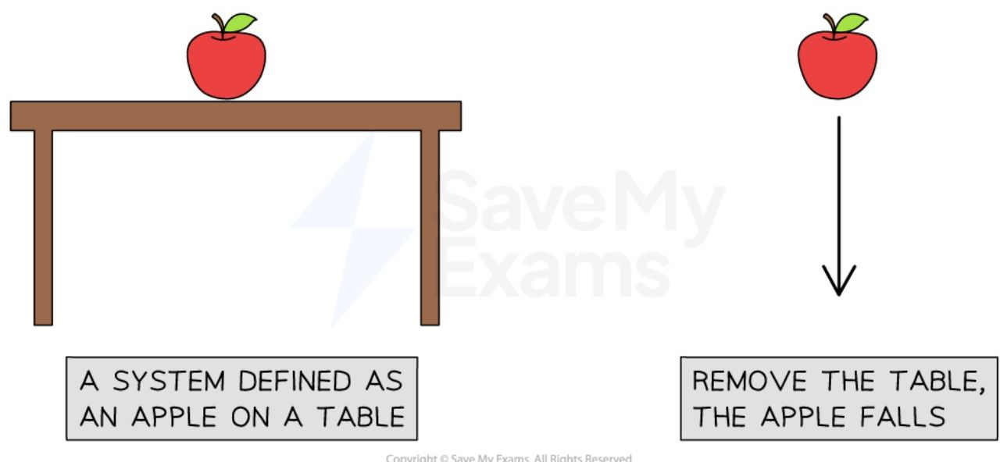
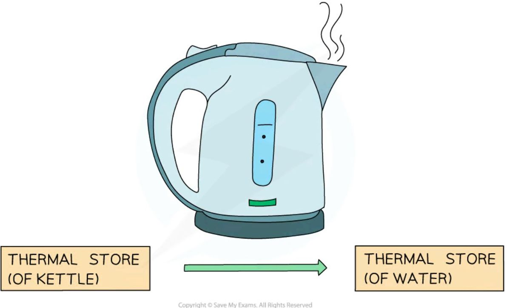
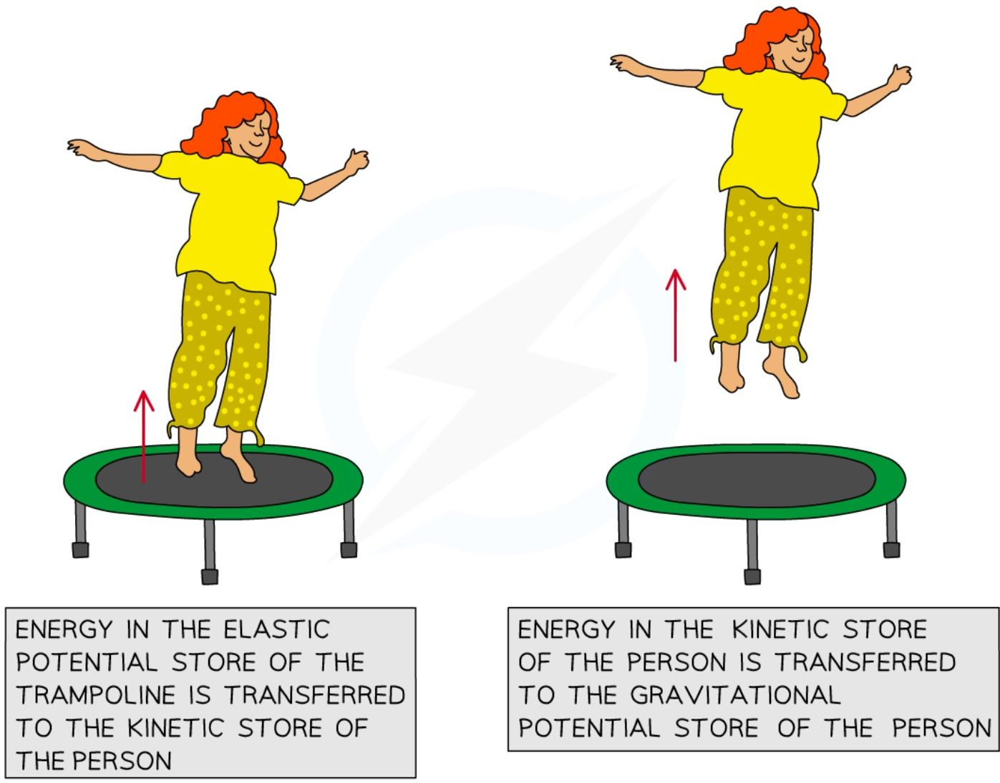
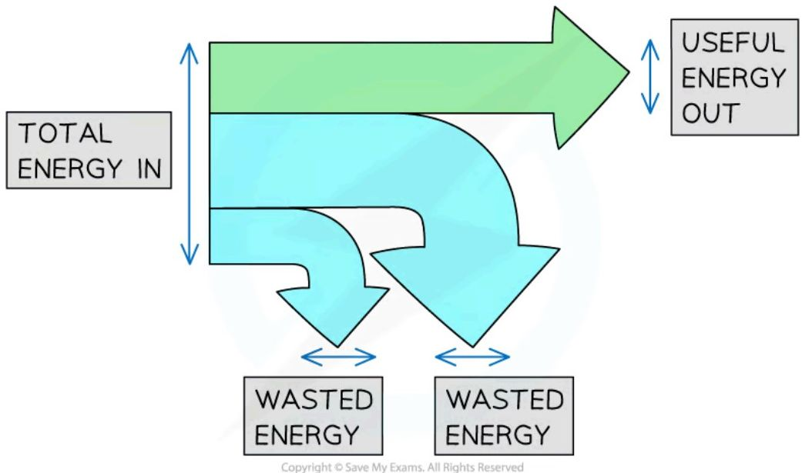
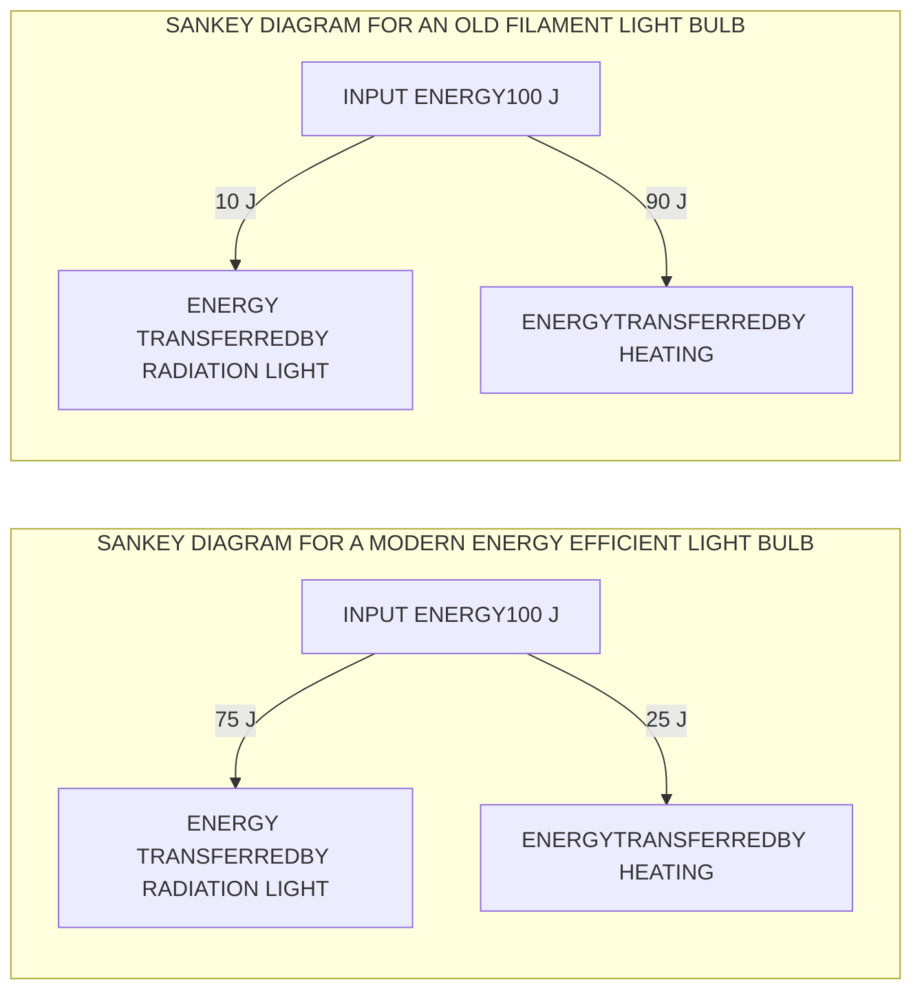

# Energy stores and transfers

**Energy stores** and **transfer pathways** are a **model** for describing energy transfers in a system.

!!! abstract "Definition: System"
    In physics, a system is **an object or group of objects**. Defining the system is a way of **narrowing** the parameters to **focus** only on what is relevant to the situation being observed — a system could be large or small, incorporating just one object, or a whole group of objects and their surroundings.

When a system is in **equilibrium**, nothing changes, and so nothing happens. When there is a **change** to a system, **energy is transferred** — for example, if an apple sits on a table, and that table is suddenly removed, the apple will fall, and as it falls, energy is transferred.



## Energy stores

Energy is stored in objects in different **energy stores**:

<table>
  <thead>
    <tr>
        <th>Energy Store</th>
        <th>Description</th>
    </tr>
  </thead>
  <tbody>
    <tr>
        <td>Kinetic</td>
        <td>Moving objects have energy in their kinetic store</td>
    </tr>
    <tr>
        <td>Gravitational</td>
        <td>Objects gain energy in their gravitational potential store when they are lifted through a gravitational field</td>
    </tr>
    <tr>
        <td>Elastic</td>
        <td>Objects have energy in their elastic potential store if they are stretched, squashed or bent</td>
    </tr>
    <tr>
        <td>Magnetic</td>
        <td>Magnetic materials interacting with each other have energy in their magnetic store</td>
    </tr>
    <tr>
        <td>Electrostatic</td>
        <td>Objects with charge (like electrons and protons) interacting with one another have energy in their electrostatic store</td>
    </tr>
    <tr>
        <td>Chemical</td>
        <td>Chemical reactions transfer energy into or away from a substance's chemical store</td>
    </tr>
    <tr>
        <td>Nuclear</td>
        <td>Atomic nuclei release energy from their nuclear store during nuclear reactions</td>
    </tr>
    <tr>
        <td>Thermal</td>
        <td>All objects have energy in their thermal store, the hotter the object, the more energy it has in this store</td>
    </tr>
  </tbody>
</table>

## Energy transfers

Energy is **transferred** between stores by different energy **transfer pathways**: mechanical, electrical, heating, and radiation. These are described in the table below:

<table>
  <thead>
    <tr>
        <th>Transfer Pathway</th>
        <th>Description</th>
    </tr>
  </thead>
  <tbody>
    <tr>
        <td>Mechanical working</td>
        <td>When a force acts on an object (e.g. pulling, pushing, stretching, squashing)</td>
    </tr>
    <tr>
        <td>Electrical working</td>
        <td>A charge moving through a potential difference (e.g. current)</td>
    </tr>
    <tr>
        <td>Heating (by particles)</td>
        <td>Energy is transferred from a hotter object to a colder one (e.g. conduction)</td>
    </tr>
    <tr>
        <td>(Heating by) radiation</td>
        <td>Energy transferred by electromagnetic waves (e.g. visible light)</td>
    </tr>
  </tbody>
</table>

An example of an energy transfer by heating is a cup of hot coffee heating up cold hands:


*Energy is transferred by heating from the hot coffee to the mug to the cold hands*

!!! example "Worked Example (explanation): A battery powering a torch"

    Describe the energy transfers that take place when a battery powers a torch.

    ??? success "Model answer:"
        The system is defined as the battery and the torch, so the energy transfer to focus on is from the battery to the torch: the energy begins in the **chemical store** of the cells of the battery. When the circuit is closed, the bulb lights up, so energy is transferred to the **thermal store** of the bulb (energy is then transferred from the bulb to the surroundings, but this is not described in the parameters of the system). Energy is transferred by the flow of charge around the circuit, so the transfer pathway is **electrical**: energy is transferred **electrically** from the **chemical store** of the battery to the **thermal store** of the bulb.

!!! example "Worked Example (explanation): A falling object"

    Describe the energy transfers that take place as an object falls.

    ??? success "Model answer:"
        For an object to fall, it must have been raised to a height first, so it began with energy in its **gravitational potential store**. As the object falls, it is moving, so energy is being transferred to its **kinetic store**. For an object to fall, a resultant force must be acting on it — that force is weight, acting over a distance (the height of the fall) — so the transfer pathway is **mechanical**: energy is transferred from the **gravitational store** to the **kinetic store** of the object via a **mechanical** transfer pathway.

!!! tip "Examiner Tips and Tricks"

    Don't worry too much about the parameters of the system. They are there to help you keep your answers concise so you don't end up wasting time in your exam.

    If you follow any process back far enough, you would get many energy transfers taking place. For example, an electric kettle heating water. The relevant energy transfer is from the thermal store of the kettle to the thermal store of the water, with some energy dissipated to the surroundings. But you could take it all the way back to how the electricity was generated in the first place. This is beyond the scope of the question. Defining the system gives you a starting point and a stopping point for the energy transfers you need to consider.

## Conservation of energy

### What is the principle of conservation of energy?

!!! abstract "Principle: Conservation of energy"
    Energy cannot be created or destroyed, it can only be transferred from one store to another.

This means the total amount of energy in a **closed system** remains **constant**: the **total energy** transferred **into** a system must be **equal** to the **total energy** transferred **out** of it. Therefore, energy is never 'lost', but it can be transferred to the surroundings — energy can be **dissipated** (spread out) to the surroundings by heating and radiation, and dissipated energy transfers are often **not useful**, so can be described as **wasted** energy.

### Examples of the principle of conservation of energy

!!! example "Example 1: a bat hitting a ball"

    The moving bat has energy in its **kinetic** store. Some of that energy is transferred **usefully** to the **kinetic** store of the ball. Some is transferred from the **kinetic** store of the bat to the **thermal** store of the ball **mechanically**, due to the impact of the bat on the ball — this energy transfer is not useful, so it is **wasted**. Some is also **dissipated** by **heating** to the **thermal** store of the bat, the ball, and the surroundings — again, not useful, so **wasted**.

    ```mermaid
    graph LR
        A[KINETIC STORE OF BAT] -- USEFUL --> B[KINETIC STORE OF BALL]
        A -- NOT USEFUL --> C[THERMAL STORE OF BAT]
        A -- NOT USEFUL --> D[THERMAL STORE OF BALL]
        A -- NOT USEFUL --> E[THERMAL STORE OF SURROUNDINGS]

        subgraph KEY
            direction LR
            K1[-- green arrow --> = USEFUL]
            K2[-- red arrow --> = NOT USEFUL]
        end
    ```

    

    *The principle of conservation of energy applied to a bat hitting a ball*

!!! example "Example 2: boiling water in a kettle"

    When an electric kettle boils water, **energy** is transferred **electrically** from the mains supply to the **thermal store** of the heating element inside the kettle. As the heating element gets hotter, energy is transferred **by heating** to the **thermal store** of the water. Some of the energy is transferred to the **thermal** store of the plastic kettle — not useful, so **wasted** — and some is **dissipated** to the **thermal store** of the surroundings, due to the air around the kettle being heated — also **wasted**.

    

    *The principle of conservation of energy applied to a kettle boiling water*

!!! example "Example 3: trampoline"

    Whilst jumping, the person has energy in their **kinetic** store. When they land on the trampoline, most of that energy is transferred to the **elastic potential** store of the trampoline, then transferred usefully back to the **kinetic** store of the person as they bounce upwards, and then to the **gravitational potential** store of the person as they gain height. Some energy is dissipated by **heating** to the **thermal** store of the surroundings (the person, the trampoline and the air). The useful energy transfers taking place are: elastic potential energy → kinetic energy → gravitational potential energy.

    

    Energy in the elastic potential store of the trampoline is transferred to the kinetic store of the person; energy in the kinetic store of the person is transferred to the gravitational potential store of the person.

    *The principle of conservation of energy applied to a person jumping on a trampoline*

## Efficiency

### What is efficiency in an energy transfer?

!!! abstract "Definition: Efficiency"
    The efficiency of a system is a measure of the amount of **wasted energy** in an energy transfer: **the ratio of the useful energy output from a system to its total energy output**. If a system has **high** efficiency, most of the energy transferred is **useful**; if **low**, most of it is **wasted**. Efficiency is represented as a percentage.

!!! note "Required formulae: efficiency"
    $$ \text{efficiency} = \frac{\text{useful energy output}}{\text{total energy output}} \times 100\% $$

    Total energy output is equal to total energy input, due to the principle of conservation of energy: total energy input = total energy output. Total energy output is also the sum of the useful energy output and the wasted energy: total energy output = useful energy output + wasted energy.

!!! example "Worked Example (calculation)"

    The blades of a fan are turned by an electric motor. In one second, 300 J of energy is transferred electrically from the mains supply. 85 J is wasted due to friction and sound.

    Calculate the efficiency of the motor.

    ??? success "Answer:"

        **Step 1: List the known quantities**

        * Total energy input = 300 J

        * Total wasted energy = 85 J

        **Step 2: State the equation for efficiency**

        $$ \text{efficiency} = \frac{\text{useful energy output}}{\text{total energy output}} \times 100\% $$

        **Step 3: Determine total energy output**

        Due to the conservation of energy, total energy input = total energy output, so total energy output = 300 J.

        **Step 4: Calculate the useful energy output**

        Since total energy output = useful energy output + wasted energy, useful energy output = total energy output − wasted energy = $300 - 85 = 215$ J.

        **Step 5: Substitute these values into the equation for efficiency**

        $$ \text{efficiency} = \frac{215}{300} \times 100\% = 72\% $$

!!! tip "Examiner Tips and Tricks"

    The equation for efficiency can be used to give a ratio (between 0 and 1) or a percentage (between 0 and 100%). If the question asks for efficiency as a ratio, give your answer as a fraction or decimal (do not multiply by 100%). If it's required as a percentage, remember to multiply the ratio by 100 to convert it — e.g. if the ratio = 0.25, percentage = $0.25 \times 100 = 25\%$. Remember that efficiency has **no units** (only %).

## Sankey diagrams

**Sankey diagrams** are visual representations of energy transfers, characterised by splitting arrows that show the proportions of the energy transfers taking place. The different parts of the arrow represent the different energy transfers: the left-hand side of the arrow (the flat end) represents the energy transferred **into** the system, the straight arrow pointing to the right represents the energy that ends up in the desired store (the **useful energy output**), and the arrows that bend away represent the **wasted energy**.



***Total energy in, wasted energy and useful energy out shown on a Sankey diagram***

The width of each arrow on a Sankey diagram is proportional to the amount of energy being transferred. As a result of the conservation of energy: total energy in = total energy out, and total energy in = useful energy out + wasted energy.

A Sankey diagram for a modern efficient light bulb looks very different from one for an old filament light bulb: a more efficient bulb has **less** wasted energy, shown by a smaller arrow representing the heat energy.



*Sankey diagram for modern vs. old filament light bulb*

!!! example "Worked Example (calculation)"

    An electric motor is used to lift a weight. The Sankey diagram below represents the energy transfers in the system.

    ```mermaid
    graph LR
        A[INPUT ENERGY500 J] -- 120 J --> B[ENERGY TRANSFERREDTO THE WEIGHT]
        A -- ? --> C[WASTED ENERGY]
    ```

    Calculate the amount of wasted energy.

    ??? success "Answer:"

        **Step 1: Identify the known quantities from the diagram**

        * Total energy in = 500 J

        * Useful energy transferred to the weight = 120 J

        **Step 2: State the conservation of energy**

        Energy cannot be created or destroyed, it can only be transferred from one store to another, so total energy in = useful energy out + wasted energy.

        **Step 3: Substitute the known values**

        $$500 = 120 + \text{wasted energy}$$

        **Step 4: Rearrange to make wasted energy the subject**

        $$\text{wasted energy} = 500 - 120$$

        **Step 5: Evaluate**

        $$\text{wasted energy} = 380\text{ J}$$

!!! tip "Examiner Tips and Tricks"

    **How to draw a Sankey diagram**

    Drawing a good Sankey diagram takes practice. Start by planning your diagram using graph paper or a ruler:

    * How many squares or mm wide will you make the input arrow?

    * How many squares or mm wide will the useful energy out arrow need to be?

    * How many squares or mm wide must the wasted arrow be?

    Next, start drawing the diagram one step at a time:

    * Draw the left-hand side of the arrow, along with the line going across the top

    * Next add the useful energy out arrow, making sure it is the correct width

    * Now carefully mark the start and end of the wasted arrow – make sure your marks are the correct distance apart

    * Finally join the markings together, finishing the wasted energy arrow
