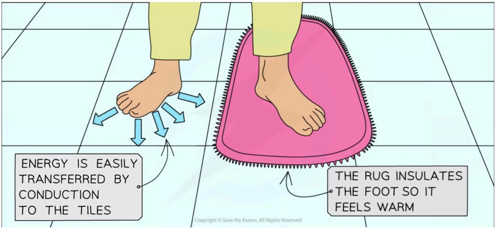
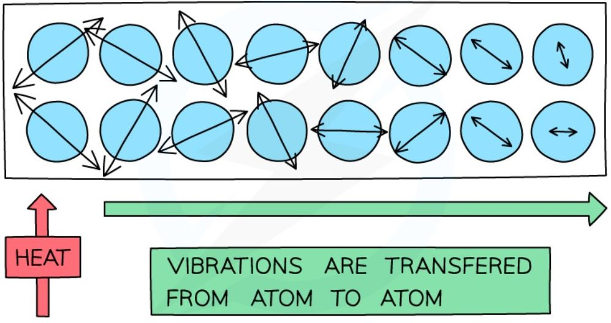
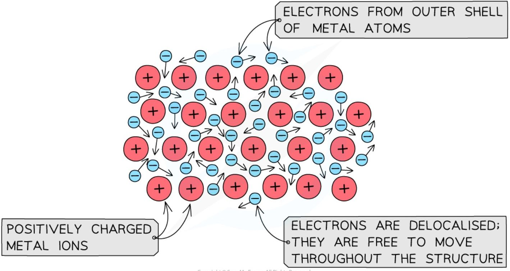
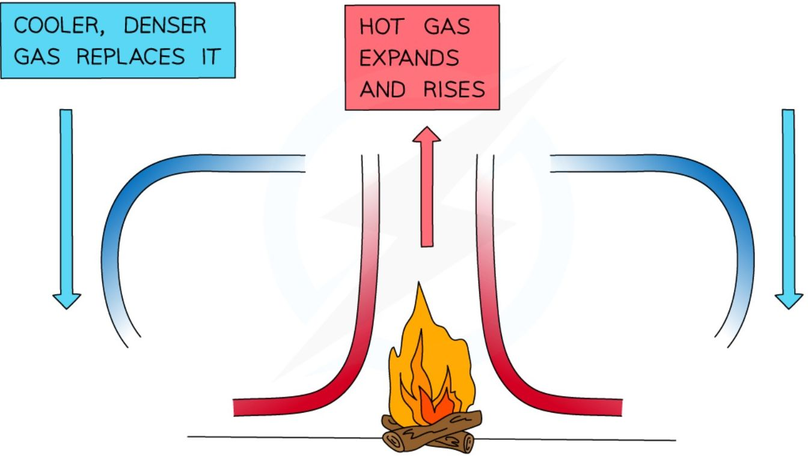
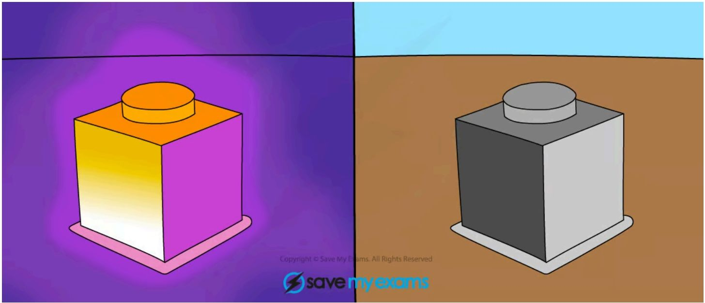
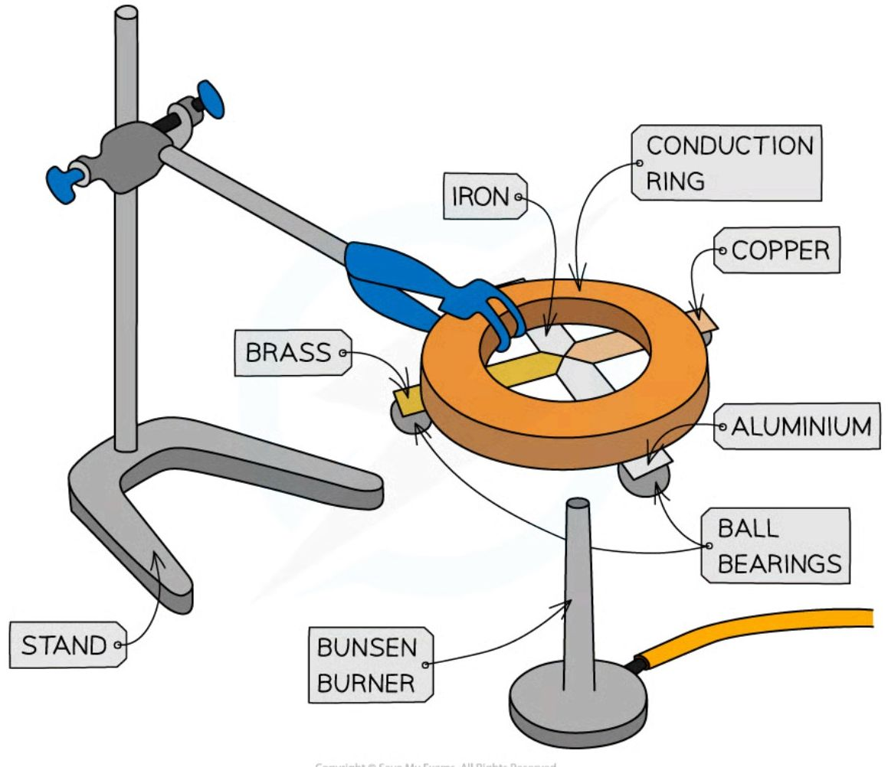
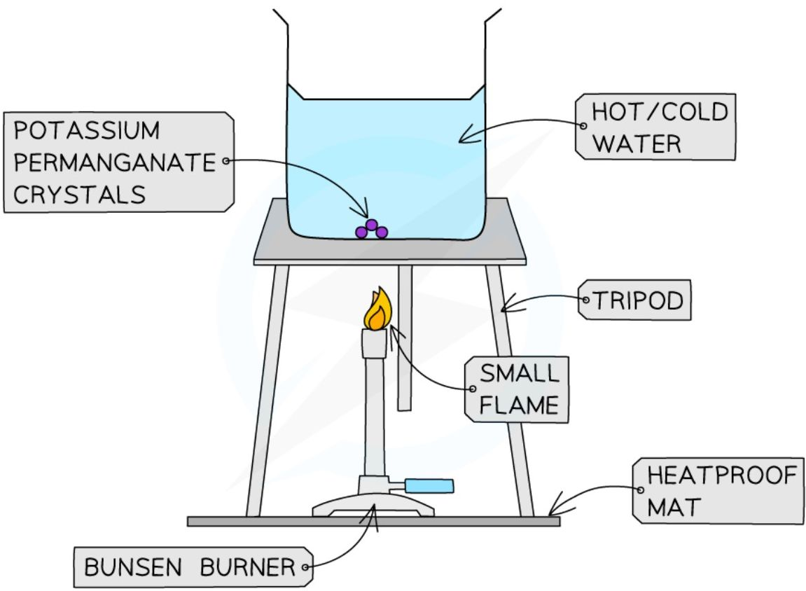
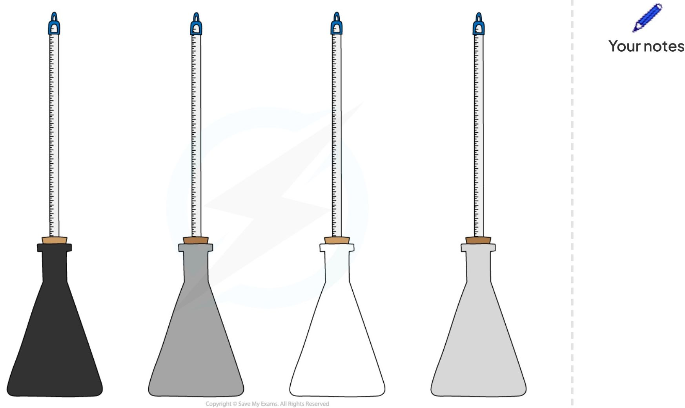
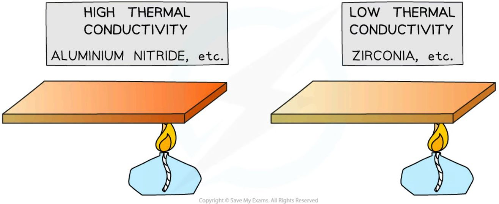
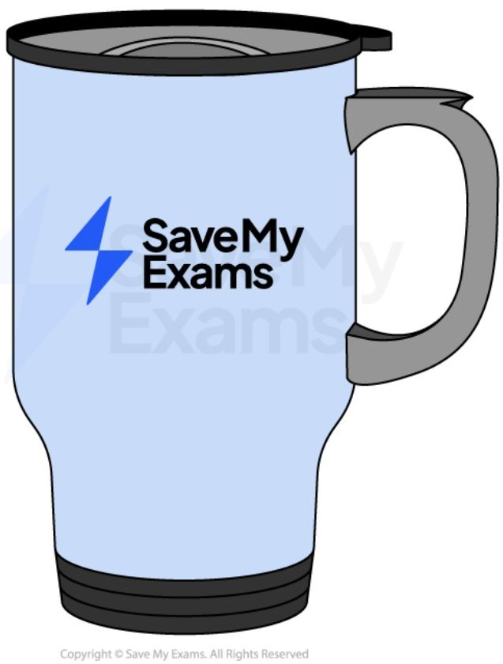

# Heat transfers

* Energy is transferred by heating and radiation via the processes of:

    * Conduction

    * Convection

    * Radiation

## Conduction, conductors and insulators

* Conduction is the main method of energy transfer by heating in solids

    * Metals are extremely good thermal **conductors**

    * A material is a good conductor if it transfers energy by heating

* Non-metals are poor thermal conductors whilst liquids and gases are extremely poor thermal conductors

    * Poor conductors are called **insulators**

    * A material is a good insulator if it does not transfer energy by heating

    * **Insulators** are used to **prevent** energy transfer by **conduction**

*Energy is transferred by heating from the hotter foot to the cooler tiles by conduction*

* Materials containing small pockets of **trapped air** are especially good at **insulating** because air is a gas and hence a poor conductor
    

    * The air is trapped, so it cannot move and form a convection current, therefore energy transfer by conduction occurs, but it happens very slowly since air is a gas

* When a substance is heated, the atoms **start to move around (vibrate) more**
    

    * As they do so they **bump into each other**, transferring energy from atom to atom

### Conduction in solids

*Conduction: the atoms in a solid vibrate and bump into each other*

* Metals are especially good at conducting heat as the **delocalised electrons** can collide with the atoms, helping to transfer the **vibrations** through the material and hence transfer heat better

### Conduction in metals

Delocalised electrons in metals speed up thermal conduction in metals

!!! tip "Examiner Tips and Tricks"

    Make sure you learn the key terms in this topic and are comfortable using them. You may be asked to explain how conduction, convection or radiation transfers energy.

## Convection

* Convection is the main way that thermal energy is transferred through **liquids** and **gases**

    - Convection **cannot occur in solids**

* When a fluid (a liquid or a gas) is heated:

    - The molecules push each other apart, making the fluid **expand**

    - This makes the hot fluid **less dense** than the surroundings

    - The **hot fluid rises**, and the cooler (surrounding) fluid moves in to take its place

    - Eventually, the hot fluid cools, contracts and sinks back down again

    - The resulting motion is called a **convection current**

A convection current caused by heating from the fire

!!! tip "Examiner Tips and Tricks"

    If a question refers to thermal energy transfers and a **liquid or gas** (that isn't trapped) then make sure your answer mentions that convection currents will probably form!

## Thermal radiation

* All bodies (objects), no matter what temperature, emit infrared radiation

* The **hotter** an object, the **more** infrared radiation it radiates in a given time

*The infrared radiation emitted from a hot object can be detected using a special camera*

* The colour of an object affects how well it **emits** and **absorbs** thermal radiation

    - Black objects are the **best** at emitting and absorbing thermal radiation

    - Shiny objects are the **worst** at emitting and absorbing thermal radiation

* The table below summarises the absorbing and emitting abilities of different colours:

<table>
  <thead>
    <tr>
        <th>Colour</th>
        <th>Absorbing</th>
        <th>Emitting</th>
    </tr>
  </thead>
  <tbody>
    <tr>
        <td>Black</td>
        <td>Good absorber</td>
        <td>Good emitter</td>
    </tr>
    <tr>
        <td>Dull/dark</td>
        <td>Reasonable absorber</td>
        <td>Reasonable emitter</td>
    </tr>
    <tr>
        <td>White</td>
        <td>Poor absorber</td>
        <td>Poor emitter</td>
    </tr>
    <tr>
        <td>Shiny</td>
        <td>Very poor absorber (it reflects)</td>
        <td>Very poor emitter</td>
    </tr>
  </tbody>
</table>

!!! example "Conduction, convection and radiation in a mug of coffee"
    * For a mug of hot coffee:

        * Energy is transferred **by radiation** from the surface to the mug to the surroundings

            * Due to the **infrared radiation** being emitted from its surface

            * All objects (above 0 K) emit infrared radiation, but the hotter an object is, the more IR radiation it emits

    * Energy is transferred **by heating** from the surface of the coffee to the surroundings

        * The most energetic particles of the coffee evaporate setting up a **convection** current

    * Energy is transferred **by heating** from the bottom of the mug to any surface it is in contact with, such as a table

        * This energy transfer happens by **conduction**

    

    ***Energy is transferred by conduction, convection and radiation in a mug of hot coffee***

    * Objects will **continue** to lose heat until they reach **thermal equilibrium** (equal temperature) with their surroundings

        * For example, a mug of hot coffee will cool down until it reaches room temperature

!!! tip "Examiner Tips and Tricks"

    If a question refers to the colour of something (**black, white or shiny**) then the answer will probably have something to do with thermal radiation!

    If the question involves a **vacuum** (empty space), then remember to mention **radiation!** Because conduction and convection require particles to transfer energy!

## Core practical 8: investigating thermal energy

### Aim of the experiment
=== "1: investigating conduction"
    * The aim of the experiment is to investigate the rate of conduction in four different metals

=== "2: investigating convection"
    * The aim of the experiment is to investigate the rate of convection of potassium permanganate crystals in two different temperatures of water

=== "3: investigating radiation"
    The aim of the experiment is to investigate how the amount of infrared radiation absorbed or radiated by a surface depends on the nature of that surface

### Variables

=== "1: investigating conduction"
    * **Independent variable** = Type of metal

    * **Dependent variable** = Rate of conduction

    * Control variables:

        - Size and thickness of metal strips

        - Amount of wax used

        - Identical ball bearings

=== "2: investigating convection"
    * **Independent variable** = Temperature of water

    * **Dependent variable** = Rate of convection

    * Control variables:

        * Amount of water in beaker

        * Size of Bunsen burner flame

        * Size of potassium permanganate crystal

=== "3: investigating radiation"
    * **Independent variable** = Colour

    * **Dependent variable** = Temperature

    * **Control variables**:
        
        *   Identical flasks (except for their colour)

        *   Same amounts of hot water

        *   Same starting temperature of the water

        *   Same time interval

### Equipment
=== "1: investigating conduction"
    <table>
    <thead>
        <tr>
            <th>Equipment</th>
            <th>Purpose</th>
        </tr>
    </thead>
    <tbody>
        <tr>
            <td>Bunsen burner</td>
            <td>To heat substances</td>
        </tr>
        <tr>
            <td>Heatproof mat</td>
            <td>To protect surfaces</td>
        </tr>
        <tr>
            <td>Stop watch</td>
            <td>To measure time</td>
        </tr>
        <tr>
            <td>Conduction ring (with rods of iron, copper, brass and aluminium)</td>
            <td>Different metals to investigate the thermal conductivity of</td>
        </tr>
        <tr>
            <td>Ball bearings</td>
            <td>To attach to the ends to the metal strips</td>
        </tr>
        <tr>
            <td>Wax</td>
            <td>To attach ball bearings to metal strips</td>
        </tr>
        <tr>
            <td>Clamp stand</td>
            <td>To hold the conduction ring</td>
        </tr>
    </tbody>
    </table>

    * **Resolution** of measuring equipment:

    * Stopwatch = 0.01 s

=== "2: investigating convection"
    <table>
    <thead>
        <tr>
            <th>Equipment</th>
            <th>Purpose</th>
        </tr>
    </thead>
    <tbody>
        <tr>
            <td>Bunsen burner</td>
            <td>To heat the beaker of water</td>
        </tr>
    </tbody>
    </table>

    <table>
    <tbody>
        <tr>
            <td>Heatproof mat</td>
            <td>To protect surfaces</td>
        </tr>
        <tr>
            <td>Stop watch</td>
            <td>To measure time</td>
        </tr>
        <tr>
            <td>Potassium permanganate crystals</td>
            <td>To show the convection current</td>
        </tr>
        <tr>
            <td>Tripod and gauze</td>
            <td>To place the beaker on</td>
        </tr>
        <tr>
            <td>Beaker</td>
            <td>To contain the water and crystal</td>
        </tr>
        <tr>
            <td>Forceps</td>
            <td>To handle the crystals</td>
        </tr>
    </tbody>
    </table>

    * **Resolution** of measuring equipment:

    - Stopwatch = 0.01 s

=== "3: investigating radiation"
    <table>
    <thead>
        <tr>
            <th>Equipment</th>
            <th>Purpose</th>
        </tr>
    </thead>
    <tbody>
        <tr>
            <td>Heatproof mat</td>
            <td>To protect surfaces and reduce heat loss</td>
        </tr>
        <tr>
            <td>Stop watch</td>
            <td>To measure time taken for cooling</td>
        </tr>
        <tr>
            <td>Kettle</td>
            <td>To boil water</td>
        </tr>
        <tr>
            <td>4 thermometers</td>
            <td>To measure the water temperature in each flask</td>
        </tr>
        <tr>
            <td>Flasks painted different colours (black, dull grey, white, silver)</td>
            <td>To investigate the heat loss of different colours</td>
        </tr>
    </tbody>
    </table>

    *   **Resolution** of measuring equipment:
        

        *   Thermometer = 1°C
        

        *   Stopwatch = 0.01 s

### Method
=== "1: investigating conduction"
    

    *The above apparatus consists of 4 different metal strips of equal width and length arranged around an insulated circle*

    1. Attach ball bearings to the ends of each metal strip at an equal distance from the centre, using a small amount of wax

    2. The strips should then be turned upside down and the centre heated gently using a bunsen burner so that each of the strips is heated at the central point where they meet

    3. When the heat is conducted along to the ball bearing, the wax will melt and the ball bearing will drop

    4. Time how long this takes for each of the strips and record in a table

    5. Repeat the experiment and calculate an average of each time

=== "2: investigating convection"
    

    **Apparatus used to investigate potassium permanganate crystals undergoing convection in water**

    1. Fill the beaker with cold water (not too full) and place it on top of a tripod and heatproof mat

    2. Pick up the crystal using forceps and drop it into the centre of the beaker – do this carefully to ensure the crystal does not dissolve prematurely

    3. Heat the beaker using the Bunsen burner and record observations

    4. Repeat experiment with hot water and record observations

=== "3: investigating radiation"
    

    *Different coloured beakers for investigating infrared radiation apparatus*

    1. Set up the four identical flasks painted in different colours: black, grey, white and silver

    2. Fill the flasks with hot water, ensuring the measurements start from the same initial temperature

    3. Note the starting temperature, then measure the temperatures at regular intervals, e.g. every 30 seconds for 10 minutes

### Results
=== "1: investigating conduction"

=== "2: investigating convection"

=== "3: investigating radiation"
    <table>
    <thead>
        <tr>
            <th>TIME / mins</th>
            <th>BLACK / °C</th>
            <th>WHITE / °C</th>
            <th>DULL GREY / °C</th>
            <th>SILVER / °C</th>
        </tr>
    </thead>
    <tbody>
        <tr>
            <td colspan="5">0.5</td>
        </tr>
        <tr>
            <td colspan="5">1.0</td>
        </tr>
        <tr>
            <td colspan="5">1.5</td>
        </tr>
        <tr>
            <td colspan="5">2.0</td>
        </tr>
        <tr>
            <td colspan="5">2.5</td>
        </tr>
        <tr>
            <td colspan="5">3.0</td>
        </tr>
        <tr>
            <td colspan="5">3.5</td>
        </tr>
        <tr>
            <td colspan="5">4.0</td>
        </tr>
        <tr>
            <td colspan="5">4.5</td>
        </tr>
        <tr>
            <td colspan="5">5.0</td>
        </tr>
        <tr>
            <td colspan="5">5.5</td>
        </tr>
        <tr>
            <td colspan="5">6.0</td>
        </tr>
        <tr>
            <td colspan="5">6.5</td>
        </tr>
        <tr>
            <td colspan="5">7.0</td>
        </tr>
    </tbody>
    </table>

### Analysis of results
=== "1: investigating conduction"
    * Order the metals according to their thermal conductivity

        - The first ball bearing to fall will be from the rod that is the best thermal conductor

    * This is because materials with high thermal conductivity **heat up faster** than materials with **low** thermal conductivity

    

    *Examples of materials with high and low thermal conductivity*

    * The results should show that the conductivity, ranked from highest to lowest, is:

        * Copper (fastest time for ball bearing to fall)

        * Aluminium

        * Brass

        * Iron (slowest time for ball bearing to fall)

=== "2: investigating convection"
    <table>
    <thead>
        <tr>
            <th>COLD WATER</th>
            <th>HOT WATER</th>
        </tr>
    </thead>
    <tbody>
        <tr>
            <td>[Visual: Beaker with purple crystal dissolving, slow convection arrows]</td>
            <td>[Visual: Beaker with purple crystal dissolving, fast convection arrows]</td>
        </tr>
        <tr>
            <td>[Visual: HEAT source below]</td>
            <td>[Visual: HEAT source below]</td>
        </tr>
    </tbody>
    </table>

    * Energy is initially transferred from the Bunsen flame through the glass wall of the beaker by conduction

    * The water in the region of the Bunsen flame is heated and the space between the water molecules expands, therefore, the water becomes **less dense** and **rises**

        - This causes the dissolved purple crystal to flow upwards with the water

    * Meanwhile, when the water at the top of the beaker cools, there is less space between the water molecules and the water becomes **denser** again and falls downwards

    * The process continues which leads to a **convection current** where energy is transferred through the liquid

        - The dissolved purple crystal follows this current which can be clearly observed during this experiment

    * It should be observed that the convection current is faster in hot water

        - This is because the higher the **temperature**, the higher the **kinetic energy** of the water molecules

    * Therefore, in hot water, the water molecules and the the molecules of potassium permanganate move around the beaker faster

=== "3: investigating radiation"
    * All objects emit **infrared radiation**, but the hotter an object is, the more infrared waves are emitted

    * The intensity (and wavelength) of the emitted radiation depends on:

        * The **temperature** of the body (hotter objects emit more thermal radiation)

        * The **surface area** of the body (a larger surface area allows more radiation to be emitted)

        * The **colour** of the surface

    * Most of the energy lost from the beakers will be **by heating** due to **conduction** and **convection**

        * This will be **equal** for each beaker, as colour does not affect energy transferred by conduction and convection

    * Any **difference** in energy transferred away from each beaker must, therefore, be due to infrared **radiation**

    * To compare the rate of energy transfer away from each flask, plot a graph of **temperature** on the y-axis against **time** on the x-axis and draw curves of best fit

    * The expected results are shown on the graph below:

    <table>
    <thead>
        <tr>
            <th>TIME (mins)</th>
            <th>SILVER</th>
            <th>WHITE</th>
            <th>DULL GREY</th>
            <th>BLACK</th>
        </tr>
    </thead>
    <tbody>
        <tr>
            <td>0</td>
            <td>8</td>
            <td>8</td>
            <td>8</td>
            <td>8</td>
        </tr>
        <tr>
            <td>2</td>
            <td>7</td>
            <td>6.5</td>
            <td>5.5</td>
            <td>4.5</td>
        </tr>
        <tr>
            <td>4</td>
            <td>6.5</td>
            <td>5.5</td>
            <td>4</td>
            <td>2.5</td>
        </tr>
        <tr>
            <td>6</td>
            <td>6</td>
            <td>5</td>
            <td>3</td>
            <td>1.5</td>
        </tr>
        <tr>
            <td>8</td>
            <td>5.8</td>
            <td>4.8</td>
            <td>2.5</td>
            <td>1</td>
        </tr>
        <tr>
            <td>10</td>
            <td>5.5</td>
            <td>4.5</td>
            <td>2.2</td>
            <td>0.8</td>
        </tr>
    </tbody>
    </table>

    *Example graph of the expected results for the different coloured beakers*

### Evaluating the experiments

#### Systematic errors
=== "1: investigating conduction"
    * Allow the rods to cool to room temperature before heating so that they all begin at the same temperature

=== "2: investigating convection"

=== "3: investigating radiation"
    * Make sure the starting temperature of the water is the same for each material since this will cool very quickly

    * It is best to do this experiment in pairs to coordinate starting the stopwatch and immersing the thermometer

    * Use a data logger connected to a digital thermometer to get more accurate readings

#### Random errors
=== "1: investigating conduction"
    * Avoid handling the rods and the wax too much before heating

=== "2: investigating convection"

=== "3: investigating radiation"
    * Make sure the hole for the thermometer isn’t too big, otherwise, thermal energy will escape through the hole

    * Take repeated readings for each coloured flask

    * Read the values on the thermometer at eye level, to avoid parallax error

#### Safety considerations
=== "1: investigating conduction"
    * Safety goggles should be worn when using a Bunsen burner

    * Ensure the safety (orange) flame is on when the Bunsen burner is not heating anything

    * Potassium permanganate in its solid form is an oxidiser, harmful if swallowed and harmful to aquatic life

    * Keep water away from all electrical equipment

    * Make sure not to touch the hot water directly

        - Run any burns immediately under cold running water for at least 5 minutes

    * Do not overfill the kettle

    * Make sure all the equipment is in the middle of the desk, and not at the end to avoid knocking over the beakers

    * Carry out the experiments only whilst standing, in order to react quickly to any spills or burns

=== "2: investigating convection"
    * Safety goggles should be worn when using a Bunsen burner

    * Ensure the safety (orange) flame is on when the Bunsen burner is not heating anything

    * Potassium permanganate in its solid form is an oxidiser, harmful if swallowed and harmful to aquatic life

    * Keep water away from all electrical equipment

    * Make sure not to touch the hot water directly

        - Run any burns immediately under cold running water for at least 5 minutes

    * Do not overfill the kettle

    * Make sure all the equipment is in the middle of the desk, and not at the end to avoid knocking over the beakers

    * Carry out the experiments only whilst standing, in order to react quickly to any spills or burns

=== "3: investigating radiation"
    * Safety goggles should be worn when using a Bunsen burner

    * Ensure the safety (orange) flame is on when the Bunsen burner is not heating anything

    * Potassium permanganate in its solid form is an oxidiser, harmful if swallowed and harmful to aquatic life

    * Keep water away from all electrical equipment

    * Make sure not to touch the hot water directly

        - Run any burns immediately under cold running water for at least 5 minutes

    * Do not overfill the kettle

    * Make sure all the equipment is in the middle of the desk, and not at the end to avoid knocking over the beakers

    * Carry out the experiments only whilst standing, in order to react quickly to any spills or burns

## Reducing Energy Loss
* There are many situations where energy transfers are actually **unwanted**:

    * Keeping a house warm

    * Keeping a drink hot or cold

    * Dressing to stay warm in cold weather

*Insulated mugs are used to maintain the temperature of hot or cold drinks*

* When an appliance is used for heating something (a kettle, a heater, a tumble dryer, a central heating system, etc.), the appliance requires a lot of energy

    * It can become expensive for a household to run such appliances

    * The production of electricity using fossil fuels produces greenhouse gases, which contribute to global warming

    * The combustion of (methane) gas produces greenhouse gases, which contribute to global warming

* Therefore, it is often useful to explore ways of **reducing** unwanted energy transfers

* Energy that is **dissipated to the surroundings** is often the main source of **wasted** energy transfers

* If these unwanted energy transfers can be prevented, or reduced, the **useful** energy transfers can be made more **efficient**

### Reducing conduction
* Energy transfers by heating due to **conduction** are one of the most common sources of dissipated energy

* To reduce energy transfers by **conduction**, materials with a **low** thermal conductivity should be used
    

    * Materials with low thermal conduction are called **insulators**

### Reducing convection
* **Convection** can also be a source of dissipated energy

* To reduce energy transfers by convection, **convection currents** must be prevented from forming

* Therefore, the **fluid** (liquid or gas) that forms the currents must be prevented from **moving**

### Insulation
* **Insulation** reduces energy transfers from both **conduction** and **convection**

* The effectiveness of an insulator is dependent upon:
    

    * The thermal **conductivity** of the material
        

        * The lower the conductivity, the less energy is transferred
    

    * The **density** of the material
        

        * The more dense the insulator, the more conduction can occur
        

        * In a denser material, the particles are closer together so they can transfer energy to one another more easily
    

    * The **thickness** of the material
        

        * The thicker the material, the better it will insulate

* Insulating the loft of a house lowers its rate of cooling, meaning less energy is transferred to the surroundings (outside)

* The insulation is often made from fibreglass (or glass fibre)
    

    * This is a reinforced plastic material composed of woven material with glass fibres laid across and held together
    

    * The air trapped between the fibres makes it a **good** insulator

* The gaps or cavities between external walls are often filled with insulation
    * This is called **cavity wall insulation**
    * This is often done by drilling a hole through the external wall to reach the cavity and filling it with a special type of foam which is made from blown mineral fibre filled with gas
    * This lowers the **conduction** of heat through the walls from the inside to the outside

*Less energy is transferred by conduction and convection if the cavity is insulated*

!!! tip "Examiner Tips and Tricks"

    A common mistake when explaining how an insulator keeps something warm is to state something along the lines of "The object warms up the insulator which then warms the object up".

    **Avoid giving this kind of answer!**

    The real explanation is:

    * The insulator contains trapped air, which is a poor thermal conductor
    * Trapping the air also prevents it from transferring energy by convection
    * This reduces the rate of energy transfer from the object, meaning that it will stay warmer for longer

    Other things to watch out for:

    * **Heat does not rise** (only hot gases or liquids rise)
    * **Shiny things do not reflect heat** (they reflect thermal radiation)
    * **Black things do not absorb heat** (they absorb thermal radiation)

    > And remember, a good answer will often include references to more than one method of thermal energy transfer.
