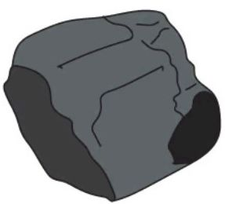
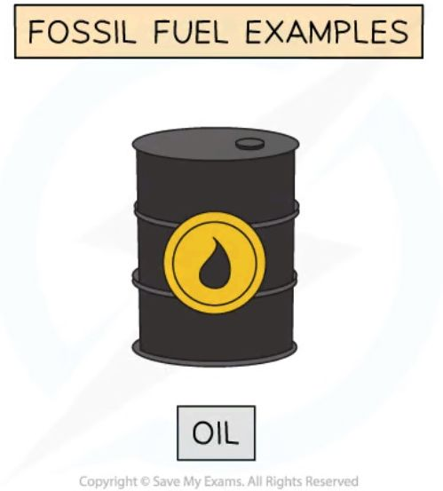
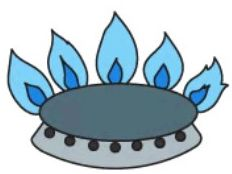
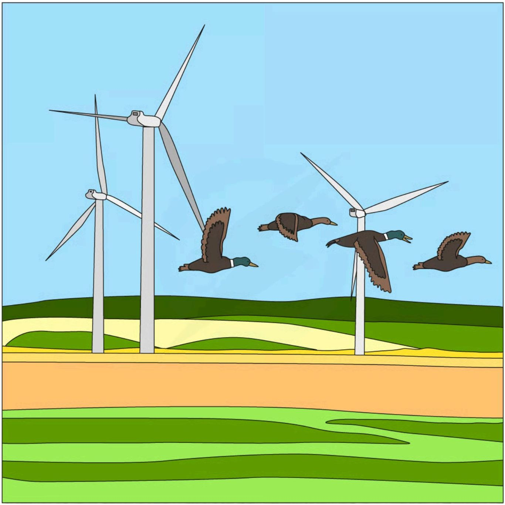
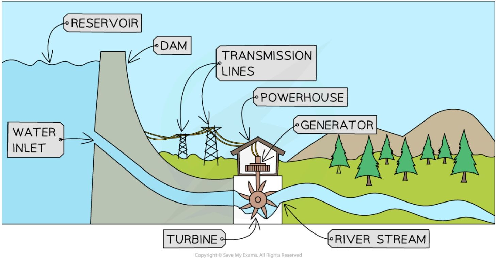
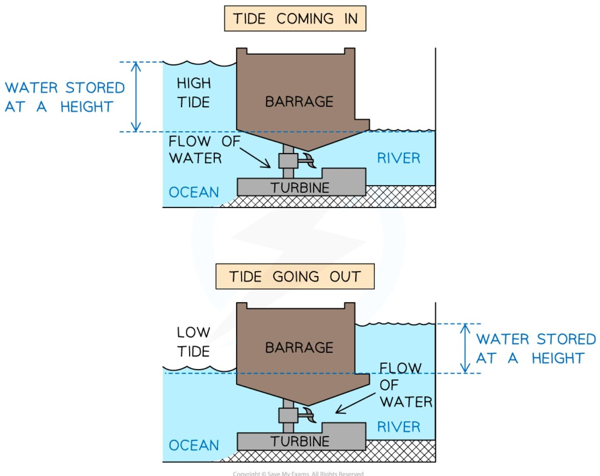
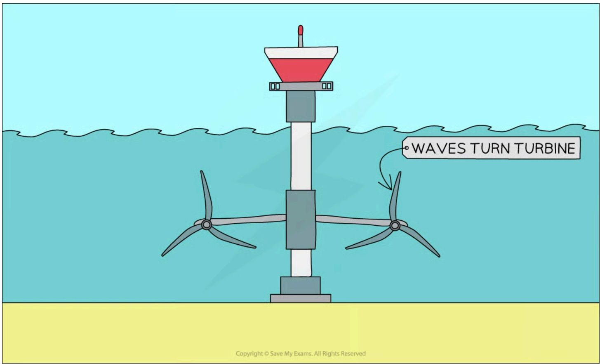
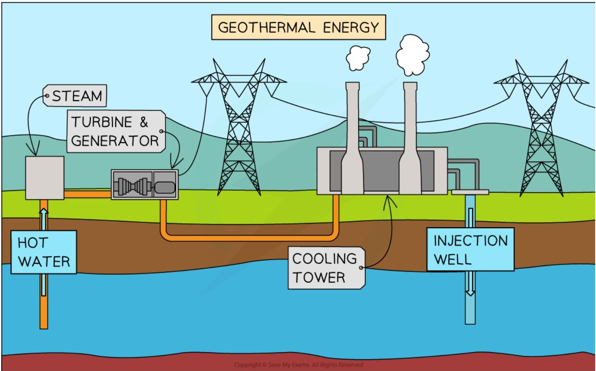
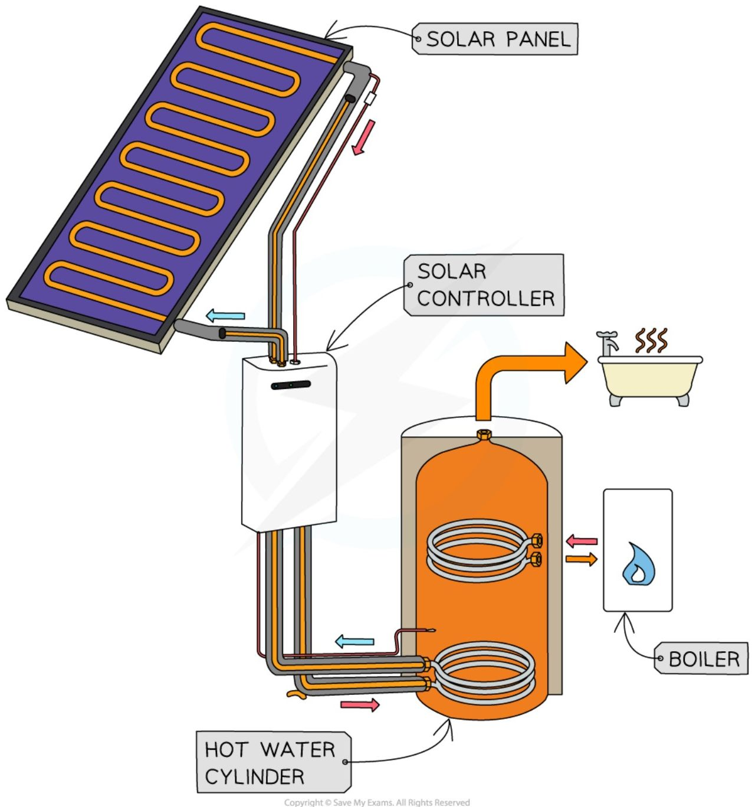
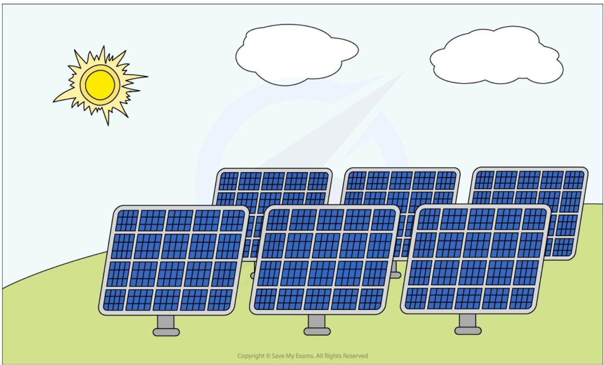

# Energy resources

**Energy resources** in physics are large stores of energy that can be used to **generate electricity** and heat homes and businesses — these are also sometimes called energy sources.

## Renewable and non-renewable energy resources

Some electricity drawn from the **National Grid** is generated from **non-renewable** resources, and some is generated from **renewable** resources.

!!! abstract "Definition: Renewable energy resource"
    An energy source that is replenished at a faster rate than the rate at which it is being used. As a result of this, a renewable energy resource is one that will not run out.

**Renewable** energy resources include solar heating panels, solar cells, wind, hydroelectricity, geothermal, wave, and tidal. **Non-renewable** energy resources include fossil fuels (coal, oil and natural gas) and nuclear fuel.

=== "Coal"

    

    *Coal*

=== "Crude oil"
    

    *Crude oil*

=== "Natural gas"
    

    *Natural gas*

*Coal, oil, and natural gas are examples of fossil fuels. These are energy resources in limited supply, meaning they will eventually run out*

## Generating electricity from energy resources

Electricity is generated in very similar ways, no matter what energy resource is used: a **turbine** is turned, which turns a **generator**, which generates electricity. The element that differs between resources is **how** the turbine is made to turn. Generating energy reliably on a national or global level requires the use of a range of different energy resources.

### Wind

**Wind** is used to turn turbines **directly**, which turn a generator, which generates electricity. Energy is transferred from the **kinetic** store of the wind, to the **kinetic** store of the turbine, to the **kinetic** store of the generator.

*Wind turns the turbines directly, which turn generators, which generate electricity*

### Water: hydroelectric

**Water** is stored at a height (usually in a dam), and when released, the moving water is used to turn turbines **directly**, which turn a generator, which generates electricity. Energy is transferred from the **gravitational potential** store of the water, to the **kinetic** store of the water, to the **kinetic** store of the turbine, to the **kinetic** store of the generator.

*A hydroelectric dam transfers energy from the gravitational potential energy store of the water to its kinetic energy store mechanically to turn a turbine*

### Water: tidal

**Water** is stored at a height (usually by a tidal barrage) at high and low tide. When released, the moving water is used to turn turbines **directly**, which turn a generator, which generates electricity. Energy is transferred from the **gravitational potential** store of the water, to the **kinetic** store of the water, to the **kinetic** store of the turbine, to the **kinetic** store of the generator.

*Tidal power uses water stored at a height, which when released, flows over a turbine causing it to turn*

### Water: wave

The motion of the **water** due to waves is used to turn turbines **directly**, which turn a generator, which generates electricity. Energy is transferred from the **kinetic** store of the water to the **kinetic** store of the turbine, to the **kinetic** store of the generator.

*Wave power uses the motion of the waves to turn turbines directly, the turbines turn generators which generate electricity*

### Geothermal resources

Hot rocks underground are used to heat **water** to produce **steam** that turns turbines, which turn a generator, which generates electricity. Energy is transferred from the **thermal** store of the rocks, to the **thermal** store of the water, to the **kinetic** store of the turbine, to the **kinetic** store of the generator.

*Cold water is heated by the rocks and returned as hot water or steam which can be used to turn turbines to generate electricity*

### Solar heating systems

Solar heating **panels** use sunlight to **heat water** in small pipes within the panel, to **produce warm water** for households. Energy is transferred from the **nuclear** store of the Sun, to the **thermal** store of the panel, to the **thermal** store of the water.

*Solar heating panels use energy from the sun to heat water for use in homes and businesses*

### Solar cells

Solar **cells** use sunlight (EM radiation) to **directly** produce a **current**. When sunlight falls on a solar cell, **electrons** are released from the semiconductor material inside it, which can be directed into a **circuit**, producing a current — this direct conversion of light into electrical energy is called the **photovoltaic effect**. Energy is transferred by radiation from the **nuclear** store of the Sun directly to **electrical energy** in the circuit — unlike solar heating panels, no thermal store is involved.

*Solar cells use energy from the sun to generate electricity directly*

### Fossil fuels

**Fossil fuels** are combusted to heat **water** to produce **steam** that turns turbines to generate electricity. Energy is transferred from the **chemical** store of the fuel, to the **thermal** store of the water, to the **kinetic** store of the turbine, to the **kinetic** store of the generator.

*The energy transfers involved in the production of electricity from fossil fuels*

### Nuclear power

**Nuclear fuels** are reacted to heat **water** to produce **steam** that turns turbines to generate electricity. Energy is transferred from the **nuclear** store of the fuel, to the **thermal** store of the water, to the **kinetic** store of the turbine, to the **kinetic** store of the generator.

!!! example "Worked Example (explanation): generating electricity from wind power"

    Describe the energy transfers which occur when a wind turbine is used to generate electricity for the National Grid.

    ??? success "Model answer:"
        Energy is transferred from the kinetic store of the moving wind to the kinetic store of the turbine, as the wind makes it turn. Energy is then transferred from the kinetic store of the turbine to the kinetic store of the generator, and is transferred electrically to the National Grid.

## Comparing energy resources

All energy resources have advantages and disadvantages associated with them. A **renewable** energy resource is one that is replenished at a faster rate than the rate at which it is being used, so as a result, renewable energy resources will not run out. A **reliable** energy resource is one that can produce energy at any time, whereas **unreliable** resources can only produce energy some of the time (e.g. when it's windy).

### Fossil fuels

#### Advantages of fossil fuels:

* Reliable — produces large amounts of energy consistently

* Can respond quickly to changes in demand

#### Disadvantages of fossil fuels:

* Non-renewable — supplies will eventually run out

* Produces carbon dioxide (CO2), which contributes to global warming

* Produces sulphur dioxide, which causes acid rain

### Nuclear

#### Advantages of nuclear power:

* Reliable — produces large amounts of energy consistently

* Produces no greenhouse gases or CO2 during electricity generation

* Large amounts of energy are produced from small amounts of fuel

#### Disadvantages of nuclear power:

* Produces radioactive waste that takes thousands of years to decay and must be safely disposed of

* Risk of nuclear accidents, which can have catastrophic consequences

* Non-renewable — uranium supplies will eventually run out

* Nuclear power stations are expensive to build and maintain

* Nuclear power stations take many years to build

* Cannot be turned on or off quickly, so cannot respond to changes in demand

### Biofuels

#### Advantages of biofuels:

* The CO2 released from combustion is balanced by the CO2 absorbed in photosynthesis, so could be considered carbon neutral

#### Disadvantages of biofuels:

* Crops grown for biofuels compete with food crops for land and resources

* Combustion still releases CO2 at the point of use

* Deforestation to clear land for crops can release stored carbon and destroy habitats

### Wind

#### Advantages of wind power:

* Renewable — will not run out

* Produces no greenhouse gases or pollution during operation

* No fuel costs and low running costs once built

#### Disadvantages of wind power:

* Unreliable — only generates electricity when the wind is blowing at sufficient speed

* Visual pollution — wind turbines can spoil the view of the landscape

* Can produce noise pollution

* High initial cost to build

### Hydroelectric

#### Advantages of hydroelectric power:

* Reliable

* Can respond quickly to changes in demand

* Produces no greenhouse gases or pollution during operation

* No fuel costs

#### Disadvantages of hydroelectric power:

* Building reservoirs can flood large areas, destroying habitats and displacing wildlife

### Tidal

#### Advantages of tidal power:

* Reliable — tides are very predictable, so energy can be produced at regular intervals

* Produces no greenhouse gases or pollution during operation

* No fuel costs

#### Disadvantages of tidal power:

* Few suitable locations (estuaries)

* Can harm aquatic life and disrupt shipping

### Geothermal

#### Advantages of geothermal power:

* Reliable

* Produces no greenhouse gases or CO2 during operation

* No fuel costs

* Can also be used directly for heating

#### Disadvantages of geothermal power:

* Not many suitable locations

* Can release methane (a greenhouse gas) during the extraction process

### Solar

#### Advantages of solar power:

* Produces no greenhouse gases or pollution during operation

* Useful where there is no mains electricity supply (e.g. remote areas)

#### Disadvantages of solar power:

* Unreliable — only generates electricity when the Sun is shining

* Each solar cell only produces a small amount of electricity, so many cells are needed

* High initial cost of solar panels

!!! tip "Examiner Tips and Tricks"
    Make sure you're familiar with the advantages and disadvantages of large scale electricity production from renewable and non-renewable energy sources, as this is a common exam question!
