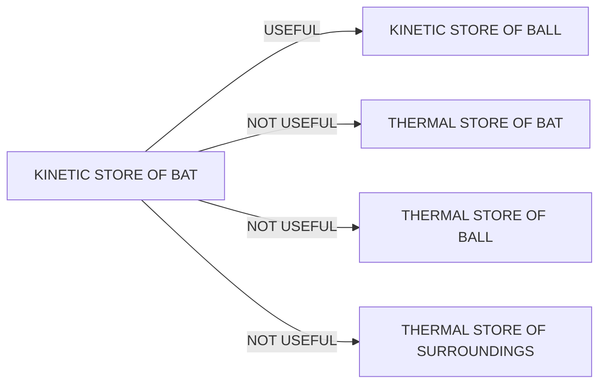
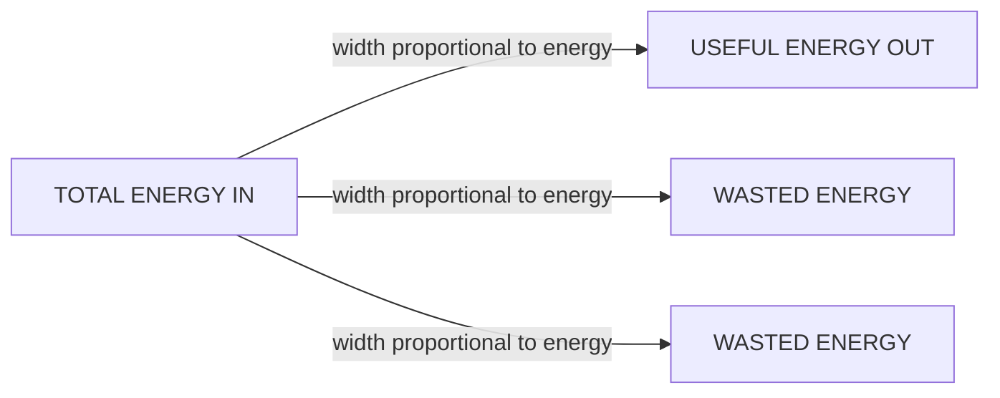
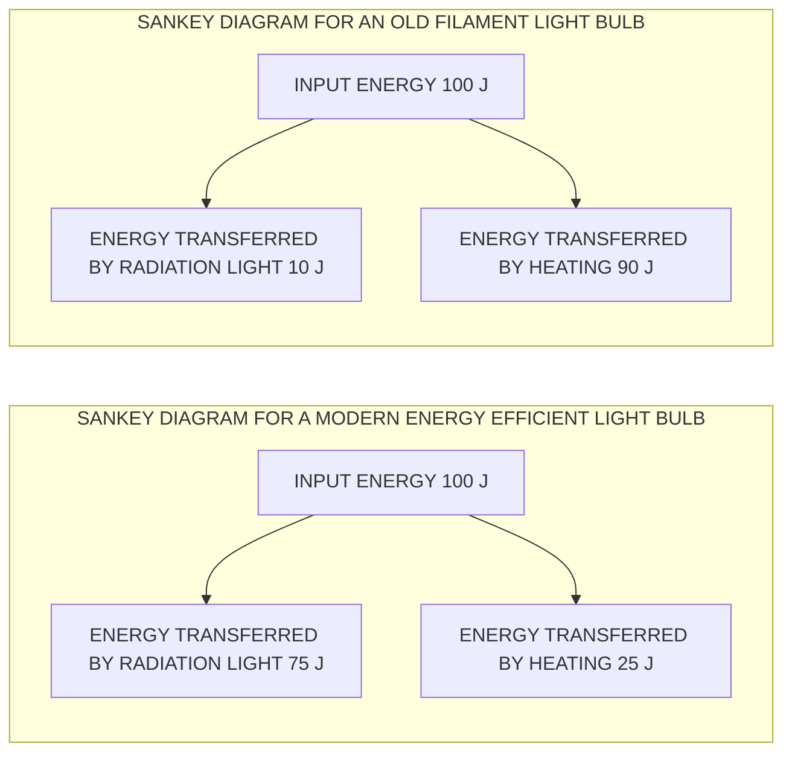
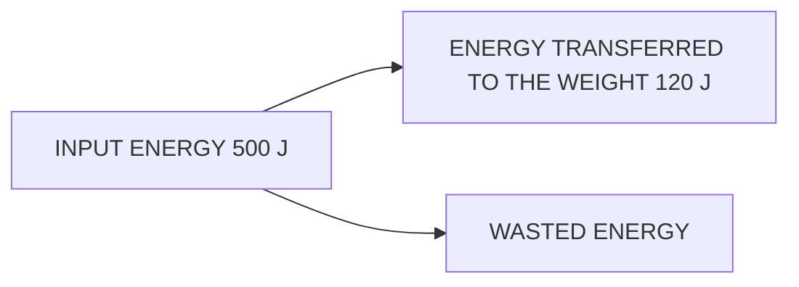

# Conservation of Energy

# Conservation of energy

## What is the principle of conservation of energy?

* The principle of conservation of energy states that:

> **Energy cannot be created or destroyed, it can only be transferred from one store to another**

* This means the total amount of energy in a **closed system** remains **constant**

* The **total** energy transferred **into** a system must be **equal** to the **total energy** transferred **out** of the system

* Therefore, energy is never 'lost' but it can be transferred to the surroundings

    - Energy can be **dissipated** (spread out) to the surroundings by heating and radiation

    - Dissipated energy transfers are often **not useful**, and can then be described as **wasted** energy

## Examples of the principle of conservation of energy

### Example 1: a bat hitting a ball

* The moving bat has energy in its **kinetic** store

* Some of that energy is transferred **usefully** to the **kinetic** store of the ball

* Some of that energy is transferred from the **kinetic** store of the bat to the **thermal** store of the ball **mechanically** due to the impact of the bat on the ball

    - This energy transfer is not useful; the energy is **wasted**

* Some of that energy is **dissipated** by **heating** to the **thermal** store of the bat, the ball, and the surroundings

    - This energy transfer is not useful; the energy is **wasted**

**KEY:** $\color{green}\rightarrow$ = USEFUL $\quad$ $\color{red}\rightarrow$ = NOT USEFUL

> ENERGY IS TRANSFERRED USEFULLY FROM THE KINETIC STORE OF THE BAT
>
> TO THE KINETIC STORE OF BALL
>
> ENERGY IS ALSO DISSIPATED TO THE THERMAL STORES OF THE BAT, BALL AND SURROUNDINGS

*The principle of conservation of energy applied to a bat hitting a ball*

## Example 2: Boiling Water in a Kettle

* When an electric kettle boils water, **energy** is transferred **electrically** from the mains supply to the **thermal store** of the heating element inside the kettle

* As the heating element gets hotter, **energy** is transferred **by heating** to the **thermal store** of the water

* Some of the energy is transferred to the **thermal** store of the plastic kettle

    * This energy transfer is not useful; the energy is **wasted**

* And some energy is **dissipated** to the **thermal store** of the surroundings due to the air around the kettle being heated

    * This energy transfer is not useful; the energy is **wasted**

© 2026 Save My Exams, Ltd.

Get more and ace your exams at [savemyexams.com](https://savemyexams.com)

<page_number>8</page_number>

*The principle of conservation of energy applied to a kettle boiling water*

## Example 3: Trampoline

* Whilst jumping, the person has energy in their **kinetic** store

* When the person lands on the trampoline, most of that energy is transferred to the **elastic potential** store of the trampoline

* That energy is transferred usefully back to the **kinetic** store of the person as they bounce upwards

* Energy is transferred from the kinetic store of the person to the **gravitational potential** store of the person as they gain height

* Some of the energy is dissipated by **heating** to the thermal store of the surroundings (the person, the trampoline and the air)

* The useful energy transfers taking place are:

  elastic potential energy → kinetic energy → gravitational potential energy

© 2026 Save My Exams, Ltd.

Get more and ace your exams at [savemyexams.com](https://savemyexams.com)

<page_number>9</page_number>

 Your notes

Copyright © Save My Exams. All Rights Reserved

*The principle of conservation of energy applied to a person jumping on a trampoline*

 © 2026 Save My Exams, Ltd. | Get more and ace your exams at [savemyexams.com](https://www.savemyexams.com) <page_number>10</page_number>

# Efficiency

# Efficiency

## What is efficiency in an energy transfer?

* The efficiency of a system is a measure of the amount of **wasted energy** in an energy transfer

* Efficiency is defined as:

**The ratio of the useful energy output from a system to its total energy output**

* If a system has **high** efficiency, this means most of the energy transferred is **useful**

* If a system has **low** efficiency, this means most of the energy transferred is **wasted**

## The equation for efficiency

* Efficiency is represented as a percentage

* The equation for efficiency is:

$$ \text{efficiency} = \frac{\text{useful energy output}}{\text{total energy output}} \times 100\% $$

* Total energy output is equal to total energy input due to the principle of conservation of energy

**total energy input = total energy output**

* Total energy output is the sum of the useful energy output and the wasted energy

**total energy output = useful energy output + wasted energy**

### Worked Example

The blades of a fan are turned by an electric motor. In one second, 300 J of energy is transferred electrically from the mains supply. 85 J is wasted due to friction and sound.

Calculate the efficiency of the motor.

**Answer:**

**Step 1: List the known quantities**

* Total energy input = 300 J

* Total wasted energy = 85 J

**Step 2: State the equation for efficiency**

© 2026 Save My Exams, Ltd.

Get more and ace your exams at [savemyexams.com](https://www.savemyexams.com)

<page_number>11</page_number>

$$\text{efficiency} = \frac{\text{useful energy output}}{\text{total energy output}} \times 100\%$$

**Your notes**

**Step 3: Determine total energy output**

* Due to the conservation of energy:

total energy input = total energy output

* Therefore, total energy output = 300 J

**Step 4: Calculate the useful energy output**

total energy output = useful energy output + wasted energy

useful energy output = total energy output - wasted energy

useful energy output = 300 - 85 = 215 J

**Step 5: Substitute these values into the equation for efficiency**

$$\text{efficiency} = \frac{\text{useful energy output}}{\text{total energy output}} \times 100\%$$

$$\text{efficiency} = \frac{215}{300} \times 100\%$$

$$\text{efficiency} = 72\%$$

**Examiner Tips and Tricks**

The equation for efficiency can be used to give a ratio (between 0 and 1) or percentage (between 0 and 100%)

If the question asks for efficiency as a ratio, give your answer as a fraction or decimal (do not multiply by 100%)

If the answer is required as a percentage, remember to multiply the ratio by 100 to convert it:

* if the ratio = 0.25, percentage = 0.25 x 100 = 25 %

Remember that efficiency has **no units** (only %)

# Sankey diagrams

## What are Sankey diagrams?

* **Sankey diagrams** are visual representations of energy transfers

- Sankey diagrams are characterised by the splitting arrows that show the proportions of the energy transfers taking place

© 2026 Save My Exams, Ltd.

Get more and ace your exams at [savemyexams.com](https://savemyexams.com)

<page_number>12</page_number>

* The different parts of the arrow in a Sankey diagram represent the different energy transfers:

    - The left-hand side of the arrow (the flat end) represents the energy transferred **into** the system

    - The straight arrow pointing to the right represents the energy that ends up in the desired store; this is the **useful energy output**

    - The arrows that bend away represent the **wasted energy**

# Example of a Sankey diagram

*Total energy in, wasted energy and useful energy out shown on a Sankey diagram*

* The width of each arrow on a Sankey diagram is proportional to the amount of energy being transferred

* As a result of the conversation of energy:

Total energy in = total energy out

**Total energy in = Useful energy out + Wasted energy**

* A Sankey diagram for a modern efficient light bulb will look very different from that for an old filament light bulb

* A more efficient light bulb has **less** wasted energy

    - This is shown by the smaller arrow downwards representing the heat energy

# Sankey diagram of light bulbs

© 2026 Save My Exams, Ltd.

Get more and ace your exams at [savemyexams.com](https://savemyexams.com)

<page_number>13</page_number>

Copyright © Save My Exams. All Rights Reserved

Sankey diagram for modern vs. old filament light bulb

## Worked Example

An electric motor is used to lift a weight. The Sankey diagram below represents the energy transfers in the system.

Copyright © Save My Exams. All Rights Reserved

Calculate the amount of wasted energy.

**Answer:**

**Step 1: State the conservation of energy**

* Energy cannot be created or destroyed, it can only be transferred from one store to another

* This means that:
    total energy in = useful energy out + wasted energy

**Step 2: Rearrange the equation for the wasted energy**

© 2026 Save My Exams, Ltd.

Get more and ace your exams at [savemyexams.com](https://savemyexams.com)

<page_number>14</page_number>

wasted energy = total energy in – useful energy out

Step 3: Substitute the values from the diagram

500 – 120 = **380 J**

### Examiner Tips and Tricks

**How to draw a Sankey diagram**

* Drawing a good Sankey diagram takes practice.
* Start by planning your diagram using graph paper or a ruler:
    - How many squares or mm wide will you make the input arrow?
    - How many squares or mm wide will the useful energy out arrow need to be?
    - How many squares or mm wide must the wasted arrow be?
* Next, start drawing the diagram one step at a time:
    - Draw the left-hand side of the arrow, along with the line going across the top
    - Next add the useful energy out arrow, making sure it is the correct width
    - Now carefully mark the start and end of the wasted arrow – make sure your marks are the correct distance apart
    - Finally join the markings together, finishing the wasted energy arrow

© 2026 Save My Exams, Ltd.

Get more and ace your exams at [savemyexams.com](https://savemyexams.com)

<page_number>15</page_number>
