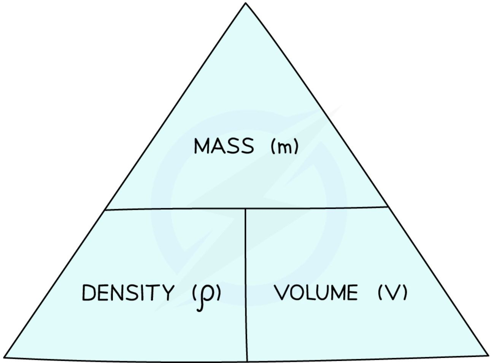
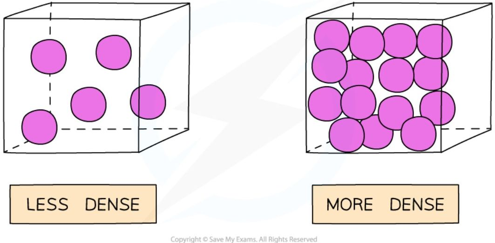
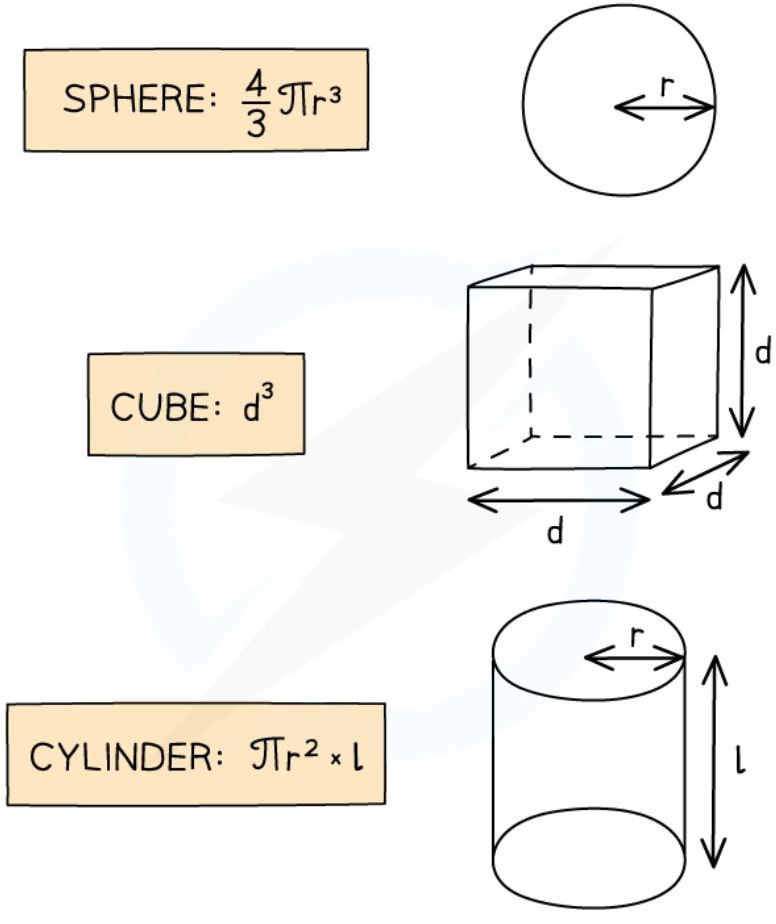
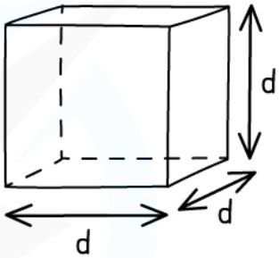
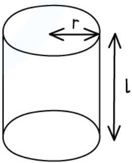
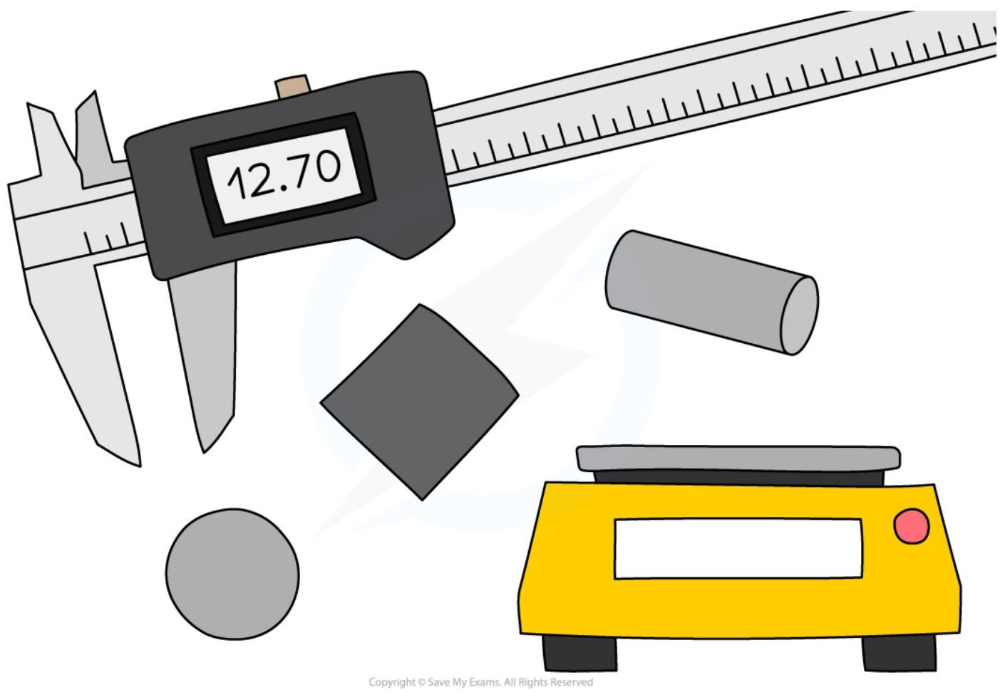
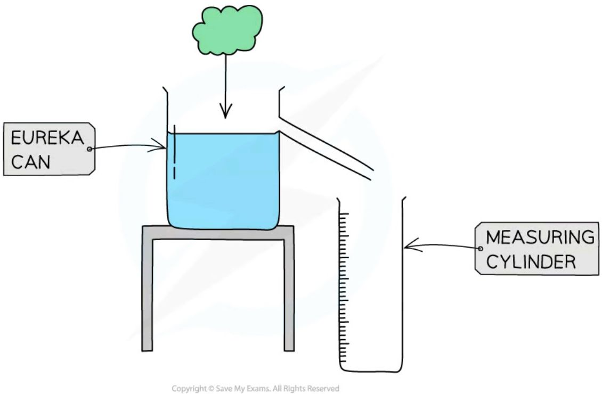
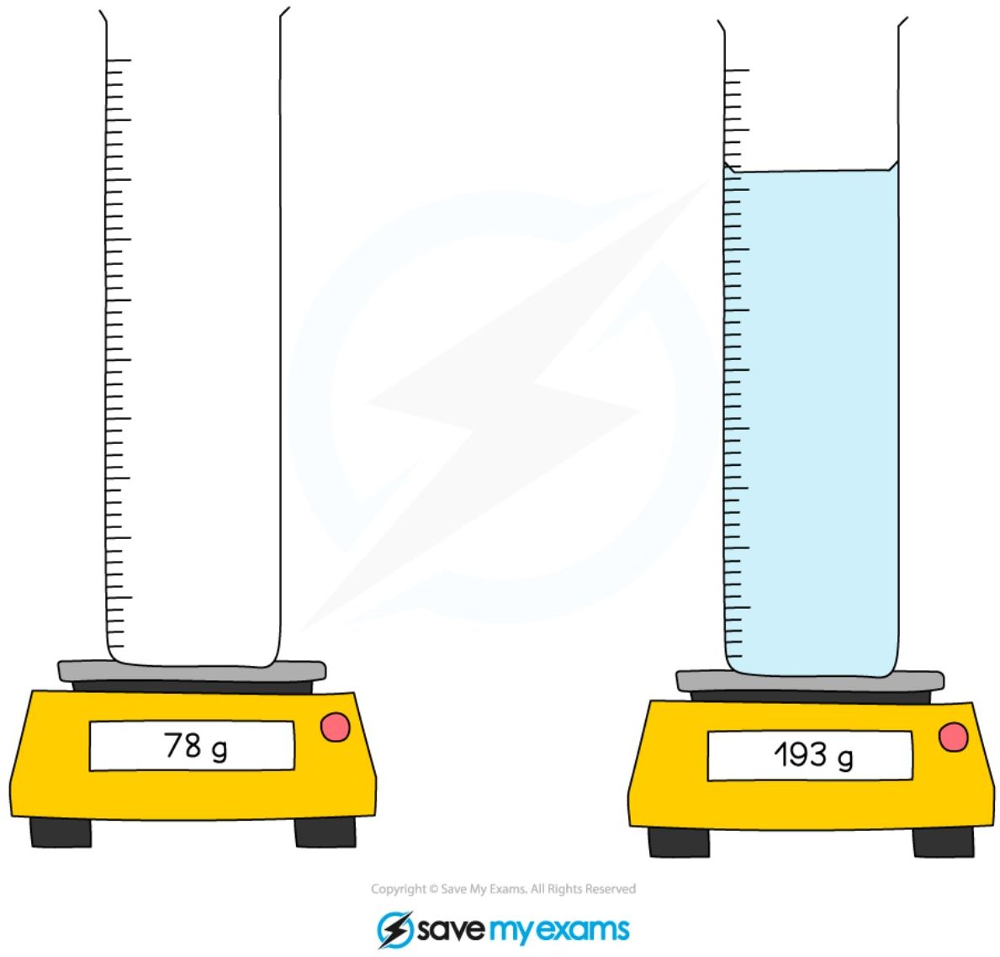

# Density

## Definition
!!! abstract "Definition: Density"
    Density is **The mass per unit volume of a material**: 
    
    <table>
        <tr>
            <th>Words:</th>
            <td>
                $\text{density}=\frac{\text{mass}}{\text{volume}}$
            </td>
        </tr>
        <tr>
            <th>
                Standard Symbols:
            </th>
            <td>
                $\rho = \frac{m}{V}$
            </td>
        </tr>
    </table>

    **Unit:** if mass ($m$) is in kg and volume ($V$) is in m3, then density ($\rho$) is in kg/m3. kg/m3 is *not* the only valid unit for density, though: for instance, if mass is given in g and the volume in cm3, then giving density in g/cm3 is perfectly acceptable. Just make sure you are consistent in the units you are using and convert when the units do not match.

    Density is also a **scalar** quantity.

    ??? note "Formula triangle for density, mass and volume"

        

        *To use a formula triangle, simply cover up the quantity you wish calculate and the structure of the equation is revealed*

        For more information on how to use a formula triangle, refer to the revision note on [Speed](https://www.savemyexams.com/igcse/physics/edexcel/19/revision-notes/1-forces-and-motion/1-1-movement-and-position/1-1-2-speed/).

!!! warning "Warning:"
    The symbol for density, $\rho$, is the greek letter 'rho', not $p$, which is used for pressure. It is important to write them in a noticably different way as there will be a formula that involves both later.   

## A few remarks

In common language, people often confuse mass with density. It is common to hear for instance that lead is heavier than gold, but this omits the implicit assumption that we should be comparing equal volumes of each material.

Technically, the density of a material also depends on its state: gases are generally less dense than solids because the particles in a gas are more spread out (same mass, over a larger volume).

***A gas is less dense than the same substance in liquid or solid form***

The units of density depend on what units are used for mass and volume: if the mass is measured in g and volume in cm3, then the density will be in g/cm3; if the mass is measured in kg and volume in m3, then the density will be in kg/m3.

### Typical densities

Density varies enormously between materials, which is why it is such a useful way of identifying a substance. A few reference values, in kg/m3:

| Material | Density / kg/m³ |
| --- | --- |
| Air (at sea level) | 1.2 |
| Ice | 920 |
| Water | 1000 |
| Aluminium | 2700 |
| Iron | 7900 |
| Copper | 8960 |
| Lead | 11 340 |
| Gold | 19 300 |

Note how water sits between ice and most metals: this is why ice floats on water, but a lead or gold object sinks in it.

### The Eureka story

The displacement method used in the Core practical below (measuring the volume of an irregular solid by the water it displaces) is traditionally credited to the Ancient Greek mathematician Archimedes. According to legend, he was asked to determine whether a crown made for the king was pure gold or had been adulterated with a cheaper, less dense metal, without damaging the crown. Stepping into a bath and noticing the water level rise as his body displaced it, he realised that the volume of an irregularly shaped object could be found from the volume of water it displaces — reportedly running through the streets shouting "Eureka!" ("I have found it!"). This is why the container used in the irregular-solid method below is called a *eureka can*.

### Applications in the IGCSE syllabus

Density reappears later in the course in two main contexts. **Floating and sinking**: an object floats in a fluid if its average density is less than the density of the fluid, and sinks if it is greater — this hasn't been written up yet as a dedicated set of notes. **Convection currents**: when part of a fluid is heated, it expands and becomes less dense than the surrounding fluid, so it rises while cooler, denser fluid sinks to take its place. This density difference is the driving mechanism behind convection, covered in the [Convection section](../Unit 4/4_3_heat-transfers.md#convection) of the Unit 4 notes on heat transfers.

## Calculating the volume of simple shapes
The volume of an object may not always be given directly, but if the shape is simple enough, it can be calculated with the appropriate formula:

!!! note "Required formulae: volumes of simple shapes"

    

    

    

!!! Example "Worked Example (calculation)"

    A paving slab has a mass of 73 kg and dimensions 0.04 m x 0.5 m x 0.85 m.

    Calculate the density, in kg/m3, of the material from which the paving slab is made.

    ??? success "Answer:"

        **Step 1: List the known quantities**

        * Mass of slab, $m = 73\text{ kg}$

        * Volume of slab, $V = 0.04\text{ m} \times 0.5\text{ m} \times 0.85\text{ m} = 0.017\text{ m}^3$

        **Step 2: Write out the equation for density**

        $$\rho = \frac{m}{V}$$

        **Step 3: Substitute in values**

        $$\rho = \frac{73}{0.017}$$

        $$\rho = 4294\text{ kg/m}^3$$

        Step 4: Round the answer to two significant figures

        $$\rho = 4300\text{ kg/m}^3$$

!!! tip "Examiner Tips and Tricks"

    Make sure you are comfortable converting between units such as metres (m) and centimetres (cm) or grams (g) and kilograms (kg).

    * When converting a **larger** unit to a **smaller** one, you **multiply (×)**

        * E.g. 125 m = 125 × 100 = 12 500 cm

    * When you convert a **smaller** unit to a **larger** one, you **divide (÷)**

        * E.g. 5 g = 5 ÷ 1000 = 0.005 or 5 × 10-3 kg

## Core practical 9: determining density
To determine the density of an object or a material, the plan is rather straightforward:

1. determine the mass $m$ of the object

2. determine the volume $V$ of the object

3. calculate the density using $\rho = \frac{m}{V}$

However, determining the mass or the volume may depend on the type of object we're dealing with, and you will need know how to deal with the three following cases: regular solids, irregular solids, and liquids.

### Equipment
=== "Regular solid"
    **Equipment needed to determine the density of regularly shaped objects**

    

=== "Irregular solid"
    

    ***Apparatus for measuring the density of irregular objects***

=== "liquid"
    

    ***Apparatus for determining the density of a liquid***

### Variables
=== "Regular solid"
    * **Independent variable** = Type of shape / volume

    * **Dependent variable** = Mass of the object

=== "Irregular solid"
    * **Independent variable** = Different irregular shapes / mass

    * **Dependent variable** = Volume of displaced water

=== "liquid"
    * **Independent variable** = Volume of water added

    * **Dependent variable** = Mass of cylinder

### Method
=== "Regular solid"
    1. Place the object on a digital balance and note down its mass

    2. Use either the ruler, Vernier callipers or micrometer to measure the object’s dimensions (width, height, length, radius) – the apparatus will depend on the size of the object

    3. Repeat these measurements and take an average of these readings before calculating the density

=== "Irregular solid"
    1. Place the object on a digital balance and note down its mass

    2. Place an empty measuring cylinder below its spout

    3. Fill the eureka can with water until the water overflows, and empty the measuring cylinder

    4. Carefully lower the object into the eureka can

    5. Measure the volume of the displaced water in the measuring cylinder

    6. Repeat these measurements and take an average before calculating the density

=== "liquid"
    1. Place an empty measuring cylinder on a digital balance and note down the mass

    2. Fill the cylinder with the liquid and note down the volume

    3. Note down the new reading on the digital balance

    4. Repeat these measurements and take an average before calculating the [density](https://www.savemyexams.com/igcse/physics/edexcel/19/revision-notes/5-solids-liquids-and-gases/5-1-density-and-pressure/5-1-1-density/)

### Results
=== "Regular solid"
    **An example results table to determine the density of regularly shaped objects**

    <table>
    <thead>
        <tr>
            <th> </th>
            <th colspan="3">CUBOID</th>
            <th colspan="3">SPHERE</th>
            <th colspan="3">CYLINDER</th>
        </tr>
        <tr>
            <th>MASS READINGS / g</th>
            <th> </th>
            <th> </th>
            <th> </th>
            <th> </th>
            <th> </th>
            <th> </th>
            <th> </th>
            <th> </th>
            <th> </th>
        </tr>
        <tr>
            <th>AVERAGE MASS / g</th>
            <th colspan="3"> </th>
            <th colspan="3"> </th>
            <th colspan="3"> </th>
        </tr>
        <tr>
            <th>AVERAGE MASS / kg</th>
            <th colspan="3"> </th>
            <th colspan="3"> </th>
            <th colspan="3"> </th>
        </tr>
        <tr>
            <th rowspan="3">DIMENSION READING / cm</th>
            <th>HEIGHT</th>
            <th> </th>
            <th> </th>
            <th rowspan="3">RADIUS</th>
            <th rowspan="3"> </th>
            <th rowspan="3"> </th>
            <th>RADIUS</th>
            <th> </th>
            <th> </th>
        </tr>
        <tr>
            <th>WIDTH</th>
            <th> </th>
            <th> </th>
            <th rowspan="2">LENGTH</th>
            <th rowspan="2"> </th>
            <th rowspan="2"> </th>
        </tr>
        <tr>
            <th colspan="3">LENGTH</th>
        </tr>
    </thead>
    <tbody>
        <tr>
            <th>AVERAGE DIMENSIONS / m</th>
            <th colspan="3">HEIGHT =  WIDTH =  LENGTH =</th>
            <th colspan="3">RADIUS =</th>
            <th colspan="3">RADIUS =  LENGTH =</th>
        </tr>
        <tr>
            <th>VOLUME / m³</th>
            <th colspan="3">H × W × L</th>
            <th colspan="3"> $\frac{4}{3} \times \pi \times R^3$ </th>
            <th colspan="3"> $\pi \times R^2 \times L$ </th>
        </tr>
    </tbody>
    </table>

    *A suitable results table must contain space for multiple readings to reduce random error and make the results more accurate*

=== "Irregular solid"
    <table>
    <thead>
        <tr>
            <th rowspan="2">Object</th>
            <th colspan="3">Mass of object / g</th>
            <th rowspan="2">Average mass / kg</th>
            <th colspan="3">Volume of water displaced / m³</th>
            <th rowspan="2">Average volume of water displaced / m³</th>
        </tr>
        <tr>
            <th>1</th>
            <th>2</th>
            <th>3</th>
            <th>1</th>
            <th>2</th>
            <th>3</th>
        </tr>
    </thead>
    <tbody>
        <tr>
            <td colspan="9">100</td>
        </tr>
        <tr>
            <td colspan="9">120</td>
        </tr>
        <tr>
            <td colspan="9">140</td>
        </tr>
        <tr>
            <td colspan="9">160</td>
        </tr>
        <tr>
            <td colspan="9">180</td>
        </tr>
    </tbody>
    </table>

=== "liquid"
    <table>
    <thead>
        <tr>
            <th colspan="3">Mass of cylinder before / g</th>
            <th rowspan="2">Average mass / kg</th>
            <th rowspan="2">Volume of water added / m³</th>
            <th colspan="3" rowspan="2">Mass of cylinder with water / g</th>
            <th colspan="4" rowspan="2">Average mass of cylinder with water / kg</th>
        </tr>
        <tr>
            <th>1</th>
            <th>2</th>
            <th>3</th>
            <th>1</th>
            <th>2</th>
            <th>3</th>
        </tr>
    </thead>
    <tbody>
        <tr>
            <td> </td>
            <td> </td>
            <td> </td>
            <td> </td>
            <td> </td>
            <td> </td>
            <td> </td>
            <td> </td>
            <td> </td>
            <td colspan="3"></td>
        </tr>
        <tr>
            <td> </td>
            <td> </td>
            <td> </td>
            <td> </td>
            <td> </td>
            <td> </td>
            <td> </td>
            <td> </td>
            <td> </td>
            <td colspan="3"></td>
        </tr>
        <tr>
            <td> </td>
            <td> </td>
            <td> </td>
            <td> </td>
            <td> </td>
            <td> </td>
            <td> </td>
            <td> </td>
            <td> </td>
            <td colspan="3"></td>
        </tr>
        <tr>
            <td> </td>
            <td> </td>
            <td> </td>
            <td> </td>
            <td> </td>
            <td> </td>
            <td> </td>
            <td> </td>
            <td> </td>
            <td colspan="3"></td>
        </tr>
        <tr>
            <td> </td>
            <td> </td>
            <td> </td>
            <td> </td>
            <td> </td>
            <td> </td>
            <td> </td>
            <td> </td>
            <td> </td>
            <td colspan="3"></td>
        </tr>
        <tr>
            <td> </td>
            <td> </td>
            <td> </td>
            <td> </td>
            <td> </td>
            <td> </td>
            <td> </td>
            <td> </td>
            <td> </td>
            <td colspan="3"></td>
        </tr>
    </tbody>
    </table>

### Analysis of results
=== "Regular solid"
    Calculate the volume of the object depending on whether it is a cube, sphere, cylinder (or other regular shape), then use the formula for density to calculate the density of each object. The formulae for volume and density are given above.

=== "Irregular solid"
    The volume of the water displaced is equal to the volume of the object. Once the mass and volume of the shape are known, the density can be calculated using $\rho = \frac{m}{V}$.

=== "liquid"
    Find the mass of the liquid by subtracting the final reading from the original reading:

    **Mass of liquid = Mass of cylinder with water – mass of cylinder**

    Once the mass and volume of the liquid are known, the density can be calculated using $\rho = \frac{m}{V}$, as above.

### Evaluating the experiments

#### Systematic errors
=== "Regular solid"
    To avoid a **zero error**, ensure the digital balance is set to zero before taking measurements of mass. 

=== "Irregular solid"
    Ensure the digital balance is set to zero before taking measurements of mass, **and** measure the mass before submerging the irregular solid in water (it may absorb some water in the process which would alter its mass)

=== "liquid"
    A common source of systematic error is to forget to cancel the mass of the recipient (a **zero error** of sorts): either set the digital balance to zero after placing the empty container on the pan and before pouring the liquid, or measure the mass of the empty recipient first and remove it for the masses measured.

#### Random errors
=== "Regular solid"
    A main cause of error in this experiment is in the measurements of length. Ensure to take repeat readings and calculate an average to keep this error to a minimum

=== "Irregular solid"
    Place the irregular object in the displacement can carefully, as dropping it from a height might cause water to splash, which will lead to an incorrect volume reading

=== "liquid"

#### Safety considerations
=== "Regular solid"

=== "Irregular solid"
    * There is a lot of glassware in this experiment, ensure this is handled carefully

    * Water should not be poured into the measuring cylinder when it is on the electric balance. This could lead to an electric shock

    * Make sure to stand up during the whole experiment, to react quickly to any spills

=== "liquid"
    * There is a lot of glassware in this experiment, ensure this is handled carefully

    * Water should not be poured into the measuring cylinder when it is on the electric balance

        - This could lead to an electric shock

    * Make sure to stand up during the whole experiment, to react quickly to any spills

!!! tip "Examiner Tips and Tricks"
    There is a lot of information to take in here! When writing about experiments, a good sequence is as follows:

    * If you need to use an equation to calculate something, start off by giving it as this will give you some hints about what you need to mention later

    * List the apparatus that you need

    * State what measurements you need to make (your equation will give you some hints) and how you will measure them

    * Finally, state that you will repeat each measurement several times and take averages
