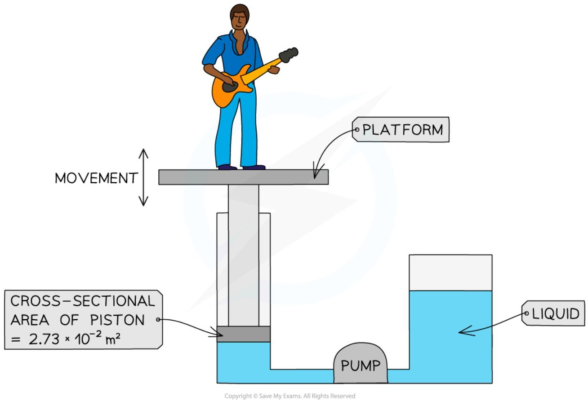
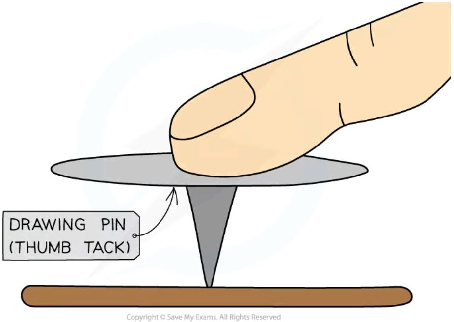
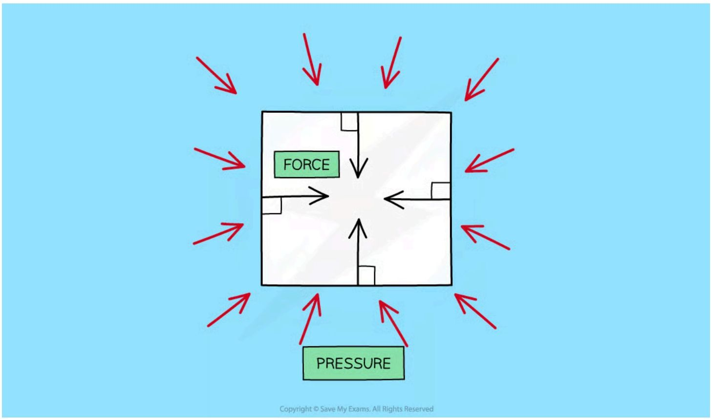

# Pressure

## Definition

!!! abstract "Definition: Pressure"
    * Pressure is defined as **the force per unit area**

    * Pressure, force and area are related by the equation: $P = \frac{F}{A}$

    * Where:

        * $P$ = pressure, measured in pascals (Pa)

        * $F$ = force, measured in newtons (N)

        * $A$ = area, measured in metres squared (m<sup>2</sup>)

    ??? note "Pressure, force, area formula triangle"

        ```mermaid
        graph TD
            A[FORCE (F)] --- B[PRESSURE (P)]
            A --- C[AREA (A)]
            B --- C
        ```

        *A formula triangle can help rearrange the pressure equation*

        * For more information on how to use a formula triangle refer to the revision note on [speed](https://www.savemyexams.com/igcse/physics/edexcel/19/revision-notes/1-forces-and-motion/1-1-movement-and-position/1-1-2-speed/)


* This equation for pressure tells us that

    * if a force is spread over a **large** area it will result in a **small** pressure

    * if it is spread over a **small** area it will result in a **large** pressure


!!! Example "Worked Example"
    The diagram below shows the parts of the lifting machine used to move the platform up and down.

    


    The pump creates pressure in the liquid of $5.28 \times 10^5\text{ Pa}$ to move the platform upwards.

    Calculate the force that the liquid applies to the piston.

    **Answer:**

    **Step 1: List the known quantities**

    *   Cross-sectional area $= 2.73 \times 10^{-2}\text{ m}^2$

    *   Pressure $= 5.28 \times 10^5\text{ Pa}$

    **Step 2: Write down the relevant equation**

    $$P = \frac{F}{A}$$

    **Step 3: Rearrange for the force, $F$**

    $$F = p \times A$$

    **Step 4: Substitute the values into the equation**

    $$F = (5.28 \times 10^5) \times (2.73 \times 10^{-2}) = 14\,414.4$$

    **Step 5: Round to the appropriate number of significant figures and quote the correct unit**

    $$F = 14\,400\text{ N} = 14.4\text{ kN (3 s.f)}$$

!!! tip "Examiner Tips and Tricks"

    Look out for the units for the force! **Large pressures** produce **large forces** - this is sometimes in kN! (1 kN = 1000 N)

## Examples of applications of pressure

!!! Todo
    * snow rackets, crossing thin ice
    * pressure and safety
    * explaining relationship between pressure, temperature, and volume in gas container

!!! Example "1: drawing pin"
    * For example, when a drawing pin is pushed downwards:

    * It is pushed into the surface, rather than up towards the finger

    * This is because the sharp point is more **concentrated** (a small area) creating a **larger** pressure

    

    *When you push a drawing pin, it goes into the surface (rather than your finger)*

!!! Example "2: Tractors"
    * Tractors have **large tyres**

    * This spreads the weight (force) of the tractor over a large area

    * This reduces the pressure which prevents the heavy tractor from sinking into the mud

!!! Example "3: Nails"
    * Nails have **sharp pointed ends** with a very small area

    * This concentrates the force, creating a large pressure over a small area

    * This allows the nail to be hammered into a wall

!!! Example "4: Shoes" 
    The surface area of the shoe affects the pressure applied to the ground

    

    > WEIGHT FROM HEELED SHOES IS SPREAD OVER A **SMALLER** AREA
    >
    > THIS EXERTS A **HIGHER** PRESSURE ON THE GROUND

    > WEIGHT FROM FLAT SHOES IS SPREAD OVER A **LARGER** AREA
    >
    > THIS EXERTS A **LOWER** PRESSURE ON THE GROUND

    *High heels produce a higher pressure on the ground because of their smaller area, compared to flat shoes*


## Pressure in fluids

* A fluid is either a **liquid** or a **gas**

* When an object is immersed and stationary in a fluid, the fluid will exert pressure, squeezing the object

    - This pressure is exerted evenly across the whole surface of the fluid and in **all directions**

    - The pressure exerted on objects in fluids creates **forces** against surfaces

    - These forces act at **90 degrees** (at right angles) to the surface




*The pressure of a fluid on an object creates a force normal (at right angles) to the surface*

* The pressure acting on an object in a fluid changes with **depth**

    - The **deeper** the object then the higher the pressure exerted upon it and vice versa

* The equation for the pressure difference, at different depths, in a fluid is given by the equation:

$$ P = h \times \rho \times g $$

* Where:

* $p$ = pressure in pascals (Pa)

* $h$ = height or depth of the fluid column above the object in metres (m)

* $\rho$ = density of the fluid in kilograms per metre cubed (kg/m<sup>3</sup>)

* $g$ = gravitational field strength on Earth in newtons per kilogram (N/kg)


*The force from the pressure of objects in a liquid is exerted evenly across its whole surface*

!!! Example "Worked Example"

    Calculate the depth of water in a swimming pool where a pressure of 20 kPa is exerted. The density of water is 1000 kg/m<sup>3</sup> and the gravitational field strength on Earth is 9.8 N/kg.

    **Answer:**

    **Step 1: List the known quantities**

    * Pressure, $P = 20\text{ kPa}$

    * Density of water, $\rho = 1000\text{ kg/m}^3$

    * Gravitational field strength, $g = 9.8\text{ N/kg}$

    **Step 2: List the relevant equation**

    $$ P = h \times \rho \times g $$


    **Step 3: Rearrange for height, *h***

    $$ h = \frac{P}{\rho \times g} $$

    **Step 4: Convert any units**

    $$ 20\text{ kPa} = 20\text{ }000\text{ Pa} $$

    **Step 5: Substitute in the values**

    $$ h = \frac{20\text{ }000}{1000 \times 9.8} $$

    $$ h = 2.0408 = 2.0\text{ m} $$

!!! tip "Examiner Tips and Tricks"

    This pressure equation will be given on your formula sheet, however, make sure you are comfortable with rearranging it for the variable required in the question!
