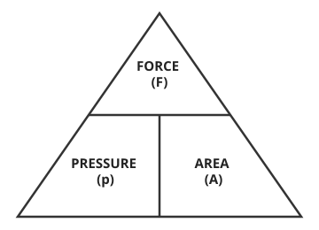

# Pressure

## Definition

!!! abstract "Definition: Pressure"
    Pressure is defined as **the force per unit area**:

    <table>
        <tr>
            <th>Words:</th>
            <td>
                $\text{pressure}=\frac{\text{force}}{\text{area}}$
            </td>
        </tr>
        <tr>
            <th>
                Standard Symbols:
            </th>
            <td>
                $p = \frac{F}{A}$
            </td>
        </tr>
    </table>

    **Unit:** if force ($F$) is in newtons (N) and area ($A$) is in metres squared (m2), then pressure ($p$) is in pascals (Pa).

    ??? note "Formula triangle for pressure, force and area"
        

        *A formula triangle can help rearrange the pressure equation*

This equation shows that spreading a given force over a **large** area results in a **small** pressure, while concentrating it over a **small** area results in a **large** pressure.

## Examples (calculations)
=== "Example 1"
    !!! example "Worked Example (calculation)"
        The diagram below shows the parts of the lifting machine used to move the platform up and down.

        

        The pump creates pressure in the liquid of $5.28 \times 10^5\text{ Pa}$ to move the platform upwards.

        Calculate the force that the liquid applies to the piston.

        ??? success "Answer:"

            **Step 1: List the known quantities**

            * Cross-sectional area, $A = 2.73 \times 10^{-2}\text{ m}^2$

            * Pressure, $p = 5.28 \times 10^5\text{ Pa}$

            **Step 2: Write down the relevant equation**

            $$p = \frac{F}{A}$$

            **Step 3: Rearrange for the force, $F$**

            $$F = p \times A$$

            **Step 4: Substitute the values into the equation**

            $$F = (5.28 \times 10^5) \times (2.73 \times 10^{-2}) = 14\,414.4$$

            **Step 5: Round to the appropriate number of significant figures and quote the correct unit**

            $$F = 14\,400\text{ N} = 14.4\text{ kN (3 s.f)}$$

=== "Example 2"
    !!! example "Worked Example (calculation)"
        A filing cabinet weighs 850 N and stands on four feet, each with a contact area of 25 cm2 with the floor.

        Calculate the pressure the filing cabinet exerts on the floor.

        ??? success "Answer:"

            **Step 1: List the known quantities**

            * Weight (force), $F = 850\text{ N}$

            * Total contact area, $A = 4 \times 25\text{ cm}^2 = 100\text{ cm}^2 = 100 \times 10^{-4}\text{ m}^2 = 0.01\text{ m}^2$

            **Step 2: Write down the relevant equation**

            $$p = \frac{F}{A}$$

            **Step 3: Substitute in the values**

            $$p = \frac{850}{0.01}$$

            **Step 4: Calculate and quote the correct unit**

            $$p = 85\,000\text{ Pa} = 85\text{ kPa}$$

!!! tip "Examiner Tips and Tricks"

    Look out for the units for the force! **Large pressures** produce **large forces** - this is sometimes in kN! (1 kN = 1000 N)

## Examples (Explanations)

=== "Drawing pin"
    !!! example "Worked Example (explanation): Drawing pin"
        

        *When you push a drawing pin, it goes into the surface (rather than your finger)*

        Explain why a drawing pin goes into the surface, rather than into your finger, when it is pushed.

        ??? success "Model answer:"
            The same force is applied at both ends of the pin. The sharp point pushes into the surface over a very small area, creating a large pressure — large enough to push the point into the surface. The flat head pushes into your finger over a much larger area, creating a much smaller pressure, which isn't enough to push it into your finger.

=== "pin"
    !!! example "Worked Example (explanation): Tractors"
        Explain why tractors have large tyres.

        ??? success "Model answer:"
            Large tyres spread the weight of the tractor over a large area. Since pressure is force divided by area, spreading the same weight over a larger area results in a lower pressure on the ground, which stops the heavy tractor sinking into soft or muddy ground.

=== "Snowshoes"
    !!! example "Worked Example (explanation): Snowshoes and thin ice"
        Explain why (a) wearing snowshoes stops you sinking into snow, and (b) lying flat rather than standing is safer if you have to cross ground that might be thin ice.

        ??? success "Model answer:"
            In both cases, the same weight (force) is spread over a larger area than usual: a snowshoe's large surface compared to an ordinary boot, or a person's whole body lying flat compared to just their feet. Since pressure is force divided by area, spreading the same weight over a larger area results in a lower pressure — low enough, in each case, not to break through the surface underneath.

=== "High heels"
    !!! example "Worked Example (explanation): Shoes"
        

        *High heels produce a higher pressure on the ground because of their smaller area, compared to flat shoes*

        Explain why high heels can exert a much higher pressure on the ground than flat shoes, for the same person.

        ??? success "Model answer:"
            The person's weight is the same in both cases. High heels concentrate this weight onto the very small area of the heel and toe, while flat shoes spread the same weight over the whole sole — a much larger area. Since pressure is force divided by area, the smaller area under a heel results in a much higher pressure on the ground.

### Explaining safety features

=== "Airbags"
    !!! example "Worked Example (explanation): Airbags"
        Explain, in terms of pressure, how an airbag reduces the risk of injury to a passenger in a collision.

        ??? success "Model answer:"
            In a collision, the airbag inflates and increases the area of contact between the passenger and the vehicle. For the same force from the collision, spreading it over this larger area results in a lower pressure on the passenger's body, reducing the risk of injury.

=== "Knee pads"
    !!! example "Worked Example (explanation): Knee pads"
        Explain, in terms of pressure, how a knee pad reduces the risk of injury when someone falls onto their knees.

        ??? success "Model answer:"
            A knee pad increases the area of contact between the knee and the ground. For the same force of impact, spreading it over this larger area results in a lower pressure on the knee, reducing the risk of injury.

!!! tip "Examiner Tips and Tricks"
    Airbags and knee pads can equally well be explained through **momentum**: increasing the *time* over which the collision happens reduces the *force* for the same change in momentum — see [Momentum and safety features](../Unit%201/1_4_momentum-and-collisions.md#momentum-and-safety-features). This is a genuinely different explanation from the pressure one above, not just a rephrasing of it. Exam questions on this topic usually ask for one explanation or the other — answer the one that's actually being asked for, rather than combining both.

!!! warning "Warning:"
    Momentum also uses the symbol $p$ (momentum $p = mv$) — a different quantity from pressure, which also uses $p$. The airbag and knee pad examples above can be explained through either quantity, so keep track of which $p$ is meant from context.

## Classic practical: pressure exerted by a person on the floor

Not one of the specified Core Practicals, but a common way of combining several skills from this page into one hands-on activity: measuring a person's weight, estimating an irregular area, and applying the pressure equation.

!!! note "Practical skill: estimating the area of an irregular shape"
    When an object's outline is irregular (e.g. a footprint), its area can be estimated by placing it on squared paper and counting squares:

    1. Count each full square enclosed by the outline.

    2. For a square that is only partly enclosed, count it if more than half of it is inside the outline, and ignore it if less than half is inside.

    3. Multiply the total number of squares counted by the area of one square to estimate the total area.

    This gives an estimate rather than an exact value, since it depends on the size of the squares used and on judging which partial squares count.

**Method**

1. Measure your weight in newtons (e.g. using bathroom scales to find your mass in kg, then $W = mg$).

2. Stand on a sheet of squared paper and draw around the outline of both feet.

3. Use the squared-paper technique above to estimate the total contact area of your feet with the floor.

4. Calculate the pressure you exert on the floor using $p = \frac{F}{A}$, using your weight as the force.

## Pressure in fluids

A **fluid** is either a **liquid** or a **gas**.

When an object is immersed and stationary in a fluid, the fluid exerts pressure on it, squeezing it evenly across its whole surface and in **all directions**. This pressure creates **forces** against the object's surfaces, acting at **90 degrees** (at right angles) to the surface.

!!! info "Classic diagram: pressure acting on a submerged object"

    

    *The pressure of a fluid on an object creates a force normal (at right angles) to the surface*

    You should be able to recognise and reproduce this diagram — unlike most other diagrams on this page, it shows up directly in exam questions rather than just illustrating the explanation.

The pressure acting on an object in a fluid also changes with **depth**: the deeper the object, the higher the pressure exerted on it, and vice versa.

!!! note "Required formulae: pressure at depth in a fluid"

    $$p = h \times \rho \times g$$

    Where $h$ is the height (depth) of the fluid column above the object in metres (m), $\rho$ is the density of the fluid in kilograms per metre cubed (kg/m3), and $g$ is the gravitational field strength in newtons per kilogram (N/kg).

!!! warning "Warning:"
    This is the formula the [Density note](5_1_1_density.md) warned about: it uses $p$ (pressure) and $\rho$ (density) side by side, so make sure the two symbols stay clearly distinguishable in your working.

*The force from the pressure of objects in a liquid is exerted evenly across its whole surface*

!!! example "Worked Example (calculation)"

    Calculate the depth of water in a swimming pool where a pressure of 20 kPa is exerted. The density of water is 1000 kg/m3 and the gravitational field strength on Earth is 9.8 N/kg.

    ??? success "Answer:"

        **Step 1: List the known quantities**

        * Pressure, $p = 20\text{ kPa}$

        * Density of water, $\rho = 1000\text{ kg/m}^3$

        * Gravitational field strength, $g = 9.8\text{ N/kg}$

        **Step 2: List the relevant equation**

        $$p = h \times \rho \times g$$

        **Step 3: Rearrange for height, $h$**

        $$h = \frac{p}{\rho \times g}$$

        **Step 4: Convert any units**

        $$20\text{ kPa} = 20\,000\text{ Pa}$$

        **Step 5: Substitute in the values**

        $$h = \frac{20\,000}{1000 \times 9.8}$$

        $$h = 2.0408 = 2.0\text{ m}$$

!!! tip "Examiner Tips and Tricks"

    This pressure equation will be given on your formula sheet, however, make sure you are comfortable with rearranging it for the variable required in the question!

## Applications in the IGCSE syllabus

Pressure reappears later in the course when studying gases: the relationships between a gas's pressure, temperature, and volume are covered in the [Ideal Gas Laws](5_3_2_ideal-gas-laws.md) notes.
