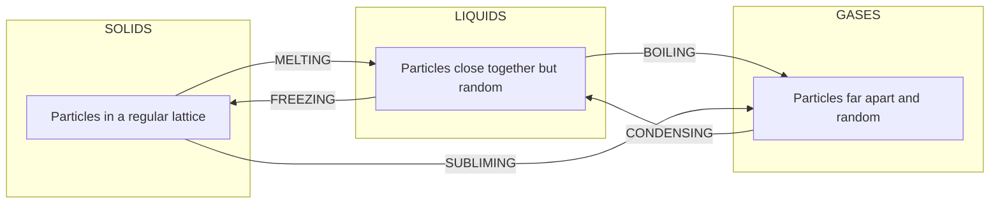
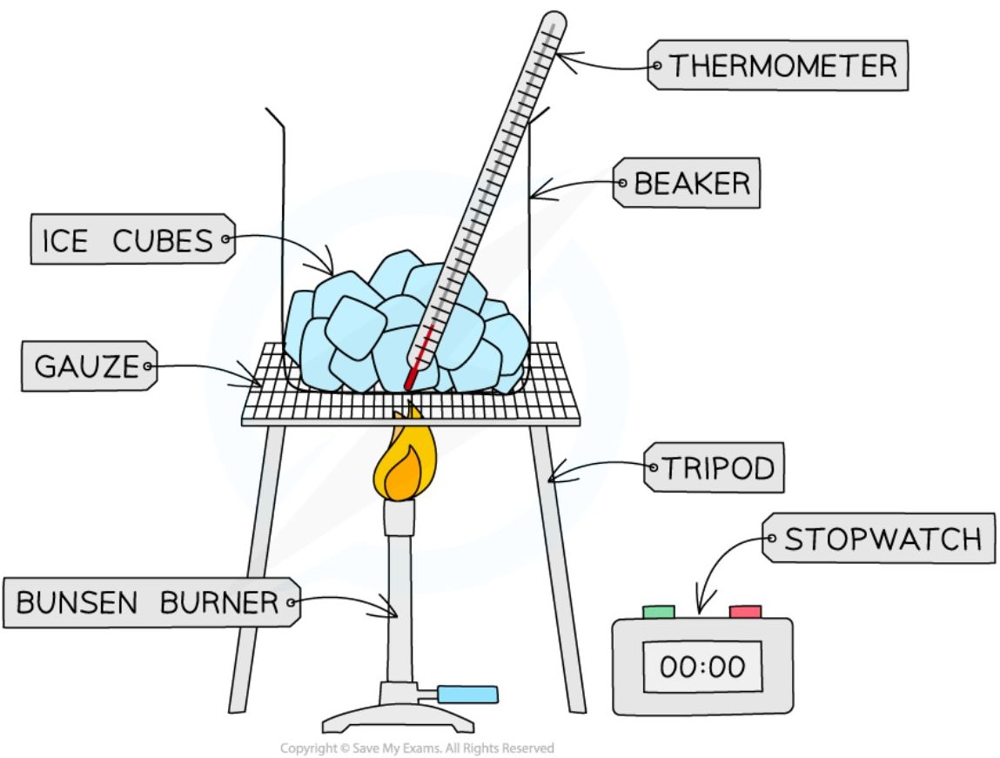

# Temperature and changes of state

## Naming the changes of state

* When a solid is heated, it **melts** to form a liquid

    - When it reaches the melting point, further energy supplied is transferred to the **potential store** of the particles

    - This breaks the rigid bonds between the particles so they can flow over each other

* When a liquid is heated, it **boils** to form a gas

    - When it reaches the boiling point, further energy supplied is transferred to the **potential store** of the particles

    - This overcomes the intermolecular bonds completely, so the particles spread far apart and move randomly

* **Evaporation** can also turn a liquid into a gas, but it is different from boiling:

    - Evaporation can happen at any temperature, not just the boiling point

    - Only the most energetic particles at the **surface** of the liquid have enough kinetic energy to escape the intermolecular bonds

    - Bubbles of gas form in the liquid during boiling, but **not** during evaporation

*Changing the temperature of a solid, liquid or gas changes its state*

## Core practical 10: investigating changes of state

### Aims of the experiment

* This experiment aims to investigate how the temperature of ice varies when it changes state from a solid to a liquid

### Equipment

<table>
  <thead>
    <tr>
        <th>Equipment</th>
        <th>Purpose</th>
    </tr>
  </thead>
  <tbody>
    <tr>
        <td>Thermometer</td>
        <td>To measure the temperature change of the ice</td>
    </tr>
    <tr>
        <td>Ice cubes</td>
        <td>To investigate temperature changes</td>
    </tr>
    <tr>
        <td>Beaker (400 ml)</td>
        <td>To contain the ice cubes</td>
    </tr>
    <tr>
        <td>Tripod &amp; Gauze</td>
        <td>To support the beaker &amp; ice cubes</td>
    </tr>
    <tr>
        <td>Bunsen Burner</td>
        <td>To heat the beaker &amp; ice</td>
    </tr>
    <tr>
        <td>Stopwatch</td>
        <td>To time the heating process</td>
    </tr>
  </tbody>
</table>

* **Resolution** of measuring equipment:

    - Thermometer = 0.1 °C

    - Stopwatch = 0.1 s

### Method

*Apparatus used to heat ice and measure its temperature as it melts*

1. Place the ice cubes in the beaker (it should be about half full)

2. Place the thermometer in the beaker

3. Place the beaker on the tripod and gauze and slowly start to heat it using the bunsen burner

4. As the beaker is heated, take regular temperature measurements (e.g. at one minute intervals)

5. Continue this whilst the substance changes state (from solid to liquid)

### Results

**An example table of results for the temperature of the ice**

<table>
  <thead>
    <tr>
        <th>Time / s</th>
        <th>Temperature / °C</th>
    </tr>
  </thead>
  <tbody>
    <tr>
        <td colspan="2">0</td>
    </tr>
    <tr>
        <td colspan="2">60</td>
    </tr>
    <tr>
        <td colspan="2">120</td>
    </tr>
    <tr>
        <td colspan="2">180</td>
    </tr>
    <tr>
        <td colspan="2">240</td>
    </tr>
  </tbody>
</table>

### Analysis of results

* Plot a graph of the temperature (y-axis) against time (x-axis)

* The graph will show regions where:

    * The temperature of the ice cubes increases

    * There is no temperature change (even though the ice cubes continue to be heated)

    * This should occur at 0 °C, where the ice is melting from solid to liquid

<table>
  <thead>
    <tr>
        <th>Time</th>
        <th>Temperature</th>
    </tr>
  </thead>
  <tbody>
    <tr>
        <td>Start</td>
        <td>Below 0 °C (Solid)</td>
    </tr>
    <tr>
        <td>Heating</td>
        <td>Increasing (Solid)</td>
    </tr>
    <tr>
        <td>Melting</td>
        <td>Constant at 0 °C</td>
    </tr>
    <tr>
        <td>Post-Melting</td>
        <td>Increasing (Liquid)</td>
    </tr>
  </tbody>
</table>

*A graph of temperature against time will show a flat region where the ice is melting*

### Evaluating the experiment

#### Systematic Errors:

* Measurements of temperature from the thermometer keeping it at eye level, to avoid parallax errors

    * Ensure the thermometer is held vertically in the beaker

#### Random Errors:

* Ensure there are enough ice cubes to surround the thermometer in the beaker, and only begin the experiment when the temperature is below 0 °C

    * This is to ensure readings of temperature are as accurate as possible

#### Safety considerations

* Wear goggles while heating water

* Place the bunsen burner, with the beaker and tripod, on a heatproof mat to avoid surface damage

* Make sure to stand up during the whole experiment, to react quickly to any spills

!!! tip "Examiner Tips and Tricks"

    You might be pleasantly surprised that heat can be transferred to a substance without changing its temperature. This is a very cool effect during changes of state: the **thermal energy** supplied does **not** contribute to the **average kinetic energy** of the particles in the ice - rather, it is used to **weaken the bonds** between the particles so they become freer to slide around each other (i.e. a liquid!). Once the ice is fully melted, the temperature of the liquid water begins rising again.

    Make sure you are familiar with the graph of temperature against time and you can associate the **flat region** with **changing state**

