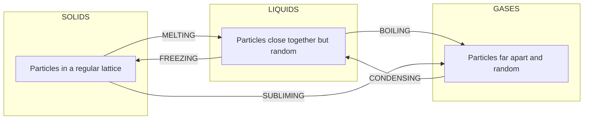
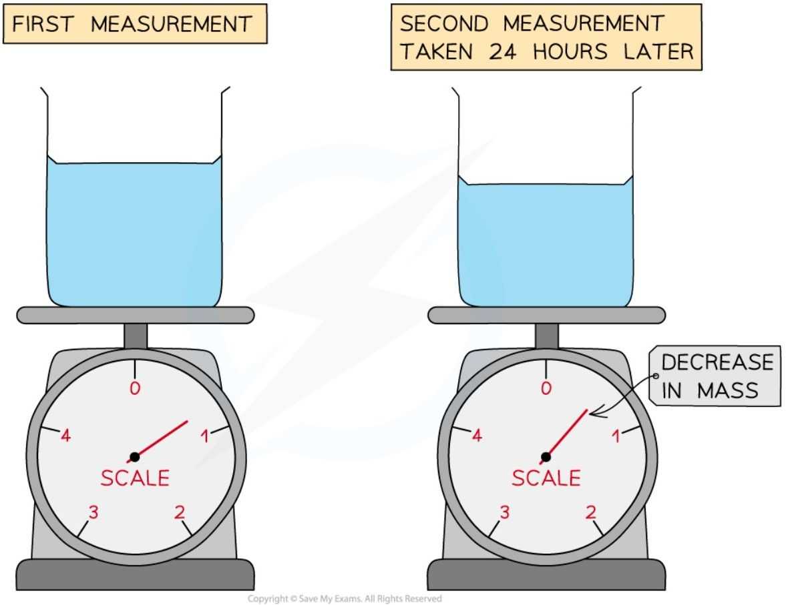
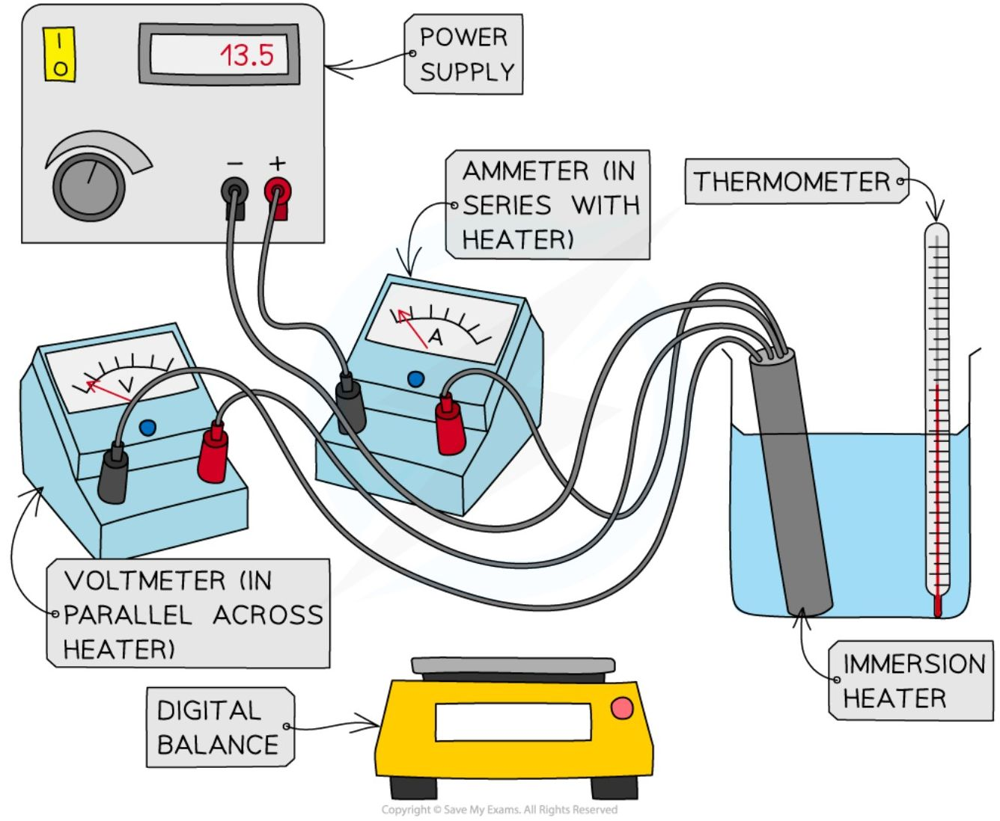

# Changes of State

## Describing states of matter in terms of particles

* There are three different states of matter: solid, liquid, or gas

### Solid state

* In a solid state of matter:
    

    * The particles are **closely packed**
    

    * The particles **vibrate** about fixed positions

* Solids have:
    

    * A definite **shape** (they are **rigid**)
    

    * A definite **volume**

### Liquid state

* In a liquid state of matter:
    

    * The particles are **closely packed**
    

    * The particles can **flow** over one another

* Liquids have:
    

    * No definite shape – they are able to **flow** and will take the shape of a container
    

    * A definite **volume**

### Gas state

* In a gas state of matter:
    

    * The particles are **far apart**
    

    * The particles move **randomly**

* Gases have:
    

    * No definite shape – they will take the shape of their container
    

    * No fixed volume – if placed in an evacuated container they will expand to fill the container

* Gases are highly **compressible**, this is because:
    

    * There are large **gaps** between the particles
    

    * It is easier to **push** the particles closer together than in solids or liquids

### Summary

<table>
    <tr>
        <th>SOLID</th>
        <th>LIQUID</th>
        <th>GAS</th>
    </tr>
    <tr>
        <td></td>
        <td></td>
        <td></td>
    </tr>
    <tr>
        <td>A SOLID HAS FIXED SHAPE AND VOLUME</td>
        <td>A LIQUID HAS FIXED VOLUME, BUT WILL FLOW TO TAKE THE SHAPE OF A CONTAINER</td>
        <td>A GAS WILL EXPAND TO COMPLETELY FILL A CONTAINER</td>
    </tr>
</table>

*Diagram showing the three states of matter in terms of shape and volume*

<table>
  <thead>
    <tr>
        <th>State</th>
        <th>Solid</th>
        <th>Liquid</th>
        <th>Gas</th>
    </tr>
  </thead>
  <tbody>
    <tr>
        <td>Density</td>
        <td>High</td>
        <td>Medium</td>
        <td>Low</td>
    </tr>
    <tr>
        <td>Arrangement of particles</td>
        <td>Regular pattern</td>
        <td>Randomly arranged</td>
        <td>Randomly arranged</td>
    </tr>
    <tr>
        <td>Movement of particles</td>
        <td>Vibrate around a fixed position</td>
        <td>Move around each other</td>
        <td>Move quickly in all directions</td>
    </tr>
    <tr>
        <td>Energy of particles</td>
        <td>Low energy</td>
        <td>Greater energy</td>
        <td>Highest energy</td>
    </tr>
  </tbody>
</table>

!!! tip  "Examiner Tips and Tricks"

    In your exam, you may be asked to explain the particle arrangement and behaviour for each state of matter. These are easy marks but make sure you learn all the possible things you can say.

## Changes of State

### Naming the changes of state

* When a solid is heated, it **melts** to form a liquid

    - When it reaches the melting point, further energy supplied is transferred to the **potential store** of the particles

    - This breaks the rigid bonds between the particles so they can flow over each other

* When a liquid is heated, it **boils** to form a gas

    - When it reaches the boiling point, further energy supplied is transferred to the **potential store** of the particles

    - This overcomes the intermolecular bonds completely, so the particles spread far apart and move randomly

* **Evaporation** can also turn a liquid into a gas, but it is different from boiling:

    - Evaporation can happen at any temperature, not just the boiling point

    - Only the most energetic particles at the **surface** of the liquid have enough kinetic energy to escape the intermolecular bonds

    - Bubbles of gas form in the liquid during boiling, but **not** during evaporation

*Changing the temperature of a solid, liquid or gas changes its state*

### Heat & temperature

* Heating a system increases the **internal energy** of its particles

* The internal energy is made up of two parts:

    - The **kinetic energy** of the molecules, due to their motion

*   The **potential energy** of the molecules, due to their position relative to each other (the intermolecular bonds)

*   The **temperature** of the material is related to the average kinetic energy of the molecules

*   The increase in internal energy from heating can:
    

    *   cause the **temperature** to increase — the energy goes into the kinetic store of the molecules, so they move around faster
    

    *   produce a **change of state** (e.g., solid to liquid or liquid to gas) — the energy goes into the potential store of the molecules, breaking the intermolecular bonds, while the kinetic energy stays constant, so the temperature does not rise

*   The higher the temperature, the higher the average **kinetic energy** of the molecules, and vice versa

*As the container is heated up, the gas molecules move faster with higher kinetic energy. The energy stored within the system – the internal energy – therefore increases*

!!! Example "Worked Example"

    A student measures the mass of a beaker of water twice, leaving 24 hours between the readings. The temperature in the room remained constant between readings, however, they noticed a decrease in the mass of the beaker of water.

    

    Which of the following is **not** a correct conclusion that can be drawn from the experiment?

    **A** The difference in mass is equal to the mass of the water that evaporated

    **B** The total energy within the beaker decreased

    **C** The density of water in the air increased

    **D** The total number of water molecules in the air and water decreased

    **Answer: D**

    * **A** is **true** because the mass lost from the beaker is due to those water molecules evaporating

    * **B** is **true** because evaporation causes the most energetic particles to leave the beaker

    * **C** is **true** because additional water molecules were added to the air, without a significant change in the volume of the air

    * **D** is **not true** because no mass is lost during evaporation - it is only changed from a liquid to a gas state

        * Therefore, the total number of particles in the **beaker** decreased, but the total number of water molecules in the air and water remained constant

!!! tip "Examiner Tips and Tricks"

    Heating a system will **always** increase the energy stored within the system. Remember this increase in 'internal energy' can have **two** effects: either the temperature of the system will increase, or the system will change state (e.g., from a solid to a liquid, or a liquid to a gas).

### Core practical 10: investigating changes of state

#### Aims of the experiment

* This experiment aims to investigate how the temperature of ice varies when it changes state from a solid to a liquid

#### Equipment

<table>
  <thead>
    <tr>
        <th>Equipment</th>
        <th>Purpose</th>
    </tr>
  </thead>
  <tbody>
    <tr>
        <td>Thermometer</td>
        <td>To measure the temperature change of the ice</td>
    </tr>
    <tr>
        <td>Ice cubes</td>
        <td>To investigate temperature changes</td>
    </tr>
    <tr>
        <td>Beaker (400 ml)</td>
        <td>To contain the ice cubes</td>
    </tr>
    <tr>
        <td>Tripod &amp; Gauze</td>
        <td>To support the beaker &amp; ice cubes</td>
    </tr>
    <tr>
        <td>Bunsen Burner</td>
        <td>To heat the beaker &amp; ice</td>
    </tr>
    <tr>
        <td>Stopwatch</td>
        <td>To time the heating process</td>
    </tr>
  </tbody>
</table>

* **Resolution** of measuring equipment:

    - Thermometer = 0.1 °C

    - Stopwatch = 0.1 s

#### Method

*Apparatus used to heat ice and measure its temperature as it melts*

1. Place the ice cubes in the beaker (it should be about half full)

2. Place the thermometer in the beaker

3. Place the beaker on the tripod and gauze and slowly start to heat it using the bunsen burner

4. As the beaker is heated, take regular temperature measurements (e.g. at one minute intervals)

5. Continue this whilst the substance changes state (from solid to liquid)

#### Results

**An example table of results for the temperature of the ice**

<table>
  <thead>
    <tr>
        <th>Time / s</th>
        <th>Temperature / °C</th>
    </tr>
  </thead>
  <tbody>
    <tr>
        <td colspan="2">0</td>
    </tr>
    <tr>
        <td colspan="2">60</td>
    </tr>
    <tr>
        <td colspan="2">120</td>
    </tr>
    <tr>
        <td colspan="2">180</td>
    </tr>
    <tr>
        <td colspan="2">240</td>
    </tr>
  </tbody>
</table>

#### Analysis of results

* Plot a graph of the temperature (y-axis) against time (x-axis)

* The graph will show regions where:

    * The temperature of the ice cubes increases

    * There is no temperature change (even though the ice cubes continue to be heated)

    * This should occur at 0 °C, where the ice is melting from solid to liquid

<table>
  <thead>
    <tr>
        <th>Time</th>
        <th>Temperature</th>
    </tr>
  </thead>
  <tbody>
    <tr>
        <td>Start</td>
        <td>Below 0 °C (Solid)</td>
    </tr>
    <tr>
        <td>Heating</td>
        <td>Increasing (Solid)</td>
    </tr>
    <tr>
        <td>Melting</td>
        <td>Constant at 0 °C</td>
    </tr>
    <tr>
        <td>Post-Melting</td>
        <td>Increasing (Liquid)</td>
    </tr>
  </tbody>
</table>

*A graph of temperature against time will show a flat region where the ice is melting*

#### Evaluating the experiment

##### Systematic Errors:

* Measurements of temperature from the thermometer keeping it at eye level, to avoid parallax errors

    * Ensure the thermometer is held vertically in the beaker

##### Random Errors:

* Ensure there are enough ice cubes to surround the thermometer in the beaker, and only begin the experiment when the temperature is below 0 °C

    * This is to ensure readings of temperature are as accurate as possible

##### Safety considerations

* Wear goggles while heating water

* Place the bunsen burner, with the beaker and tripod, on a heatproof mat to avoid surface damage

* Make sure to stand up during the whole experiment, to react quickly to any spills

!!! tip "Examiner Tips and Tricks"

    You might be pleasantly surprised that heat can be transferred to a substance without changing its temperature. This is a very cool effect during changes of state: the **thermal energy** supplied does **not** contribute to the **average kinetic energy** of the particles in the ice - rather, it is used to **weaken the bonds** between the particles so they become freer to slide around each other (i.e. a liquid!). Once the ice is fully melted, the temperature of the liquid water begins rising again.

    Make sure you are familiar with the graph of temperature against time and you can associate the **flat region** with **changing state**

## Specific Heat Capacity

### Definition

* The **specific heat capacity**, c of a substance is defined as:

> **The amount of energy required to raise the temperature of 1 kg of the substance by 1 °C per kilogram of mass (J/kg °C)**

* Different substances have different specific heat capacities

    - If a substance has a **low** specific heat capacity, it heats up and cools down quickly (ie. it takes less energy to change its temperature)

    - If a substance has a **high** specific heat capacity, it heats up and cools down slowly (ie. it takes more energy to change its temperature)

### Examples of specific heat capacity

<table>
  <thead>
    <tr>
        <th>Substance</th>
        <th>Specific Heat Capacity (J/kg°C)</th>
    </tr>
  </thead>
  <tbody>
    <tr>
        <td>COPPER BLOCK</td>
        <td>390 J/kg°C</td>
    </tr>
    <tr>
        <td>ALUMINIUM BLOCK</td>
        <td>910 J/kg°C</td>
    </tr>
    <tr>
        <td>WATER</td>
        <td>4200 J/kg°C</td>
    </tr>
  </tbody>
</table>
<table>
    <tr>
        <th>LOWER SPECIFIC HEAT CAPACITY – WARMS UP AND COOLS DOWN QUICKLY AS IT TAKES MUCH LESS ENERGY TO CHANGE ITS TEMPERATURE</th>
        <th>$\longleftrightarrow$</th>
        <th>HIGHER SPECIFIC HEAT CAPACITY – WARMS UP AND COOLS DOWN SLOWLY AS IT TAKES MUCH MORE ENERGY TO CHANGE ITS TEMPERATURE</th>
    </tr>
</table>

### Low vs high specific heat capacity

* How much the temperature of a system increases depends on:

    - The **mass** of the substance heated

    - The **type** of material

    - The amount of **energy** put into the system in the form of **thermal** energy

### Calculating specific heat capacity

* The specific heat capacity of a substance can be calculated using the equation:

change in thermal energy = mass $\times$ specific heat capacity $\times$ change in temperature

$$ \Delta Q = mc\Delta T $$

* Where:

    * $\Delta Q$ = change in thermal energy, in joules (J)

    * $m$ = mass, in kilograms (kg)

    * $c$ = specific heat capacity, in joules per kilogram per degree Celsius (J/kg °C)

    * $\Delta T$ = change in temperature, in degrees Celsius (°C)

!!! example "Worked Example"

    Water of mass 0.48 kg is increased in temperature by 0.7 °C. The specific heat capacity of water is 4200 J / kg °C.

    Calculate the amount of thermal energy transferred to the water.

    **Answer:**

    **Step 1: Write down the known quantities**

    * Mass, $m = 0.48\text{ kg}$

    * Change in temperature, $\Delta T = 0.7\text{ °C}$

    * Specific heat capacity, $c = 4200\text{ J/kg °C}$

    **Step 2: Write down the relevant equation**

    $$ \Delta Q = mc\Delta T $$

    **Step 3: Calculate the thermal energy transferred by substituting in the values**

    $$ \Delta Q = (0.48) \times (4200) \times (0.7) = 1411.2 $$

    **Step 4: Round the answer to 2 significant figures**

    $$ \Delta Q = 1400\text{ J} $$

!!! tip "Examiner Tips and Tricks"

    This equation will be given on your equation sheet, so don't worry if you cannot remember it, but it is important that you understand how to use it. You will always be

    given the specific heat capacity of a substance, so you do not need to memorise any values.

### Core practical 11: investigating specific heat capacity

#### Aims of the experiment

* This experiment aims to determine the specific heat capacity of a solid and of water by measuring the energy required to increase the temperature of a known amount by one degree

#### Variables

* Independent variable = Time, *t*

* Dependent variable = Temperature, *T*

* Control variables:

    - Potential difference from the power supply, *V*

#### Equipment

#### Equipment list for the specific heat capacity practical

<table>
  <thead>
    <tr>
        <th>Equipment</th>
        <th>Purpose</th>
    </tr>
  </thead>
  <tbody>
    <tr>
        <td>Thermometer</td>
        <td>To measure the temperature change of the solid / the water</td>
    </tr>
    <tr>
        <td>Solid block of aluminium</td>
        <td>To investigate temperature changes</td>
    </tr>
    <tr>
        <td>Beaker of water (400 ml)</td>
        <td>To investigate temperature changes</td>
    </tr>
    <tr>
        <td>Immersion heater</td>
        <td>To heat the solid / the water</td>
    </tr>
    <tr>
        <td>Voltmeter</td>
        <td>To measure the voltage across the immersion heater</td>
    </tr>
    <tr>
        <td>Ammeter</td>
        <td>To measure the current through the immersion heater</td>
    </tr>
    <tr>
        <td>Power supply</td>
        <td>To supply power to the immersion heater</td>
    </tr>
    <tr>
        <td>Digital balance</td>
        <td>To measure the mass of the solid / the water</td>
    </tr>
    <tr>
        <td>Stopwatch</td>
        <td>To time the heating of the solid / the water</td>
    </tr>
  </tbody>
</table>

* **Resolution of measuring equipment:**

* Thermometer = 0.1 °C

* Voltmeter = 0.1 V

* Ammeter = 0.1 A

* Stopwatch = 0.01 s

* Digital balance = 0.1 g

#### Method

*Apparatus for heating water and measuring energy supplied*

1. Place the beaker on the digital balance and press 'zero'

2. Add approximately 250 ml of water and record the mass of the water using the digital balance

3. Place the immersion heater and thermometer in the water

4. Connect up the circuit as shown in the diagram, with the ammeter in series with the power supply and immersion heater, and the voltmeter in parallel with the immersion heater

5. Record the initial temperature of the water at time 0 s

6. Turn on the power supply, set it at approximately 10 V, and start the stopwatch

7. Record the voltage from the voltmeter and the current from the ammeter

8. Continue to record the temperature, voltage and current every 60 seconds for 10 minutes

9. Repeat steps 2–8, replacing the beaker of water for the solid block of aluminium and starting with recording its mass using the digital balance

#### Results

<table>
  <thead>
    <tr>
        <th colspan="4"> </th>
        <th>ENERGY SUPPLIED = VOLTAGE × CURRENT × TIME</th>
        <th>TAKE EACH NEW TEMPERATURE AND SUBTRACT THE INITIAL TEMPERATURE</th>
    </tr>
    <tr>
        <th>TIME / s</th>
        <th>VOLTAGE / V</th>
        <th>CURRENT / A</th>
        <th>TEMPERATURE / °C</th>
        <th>ENERGY SUPPLIED / J</th>
        <th>TEMPERATURE CHANGE / °C</th>
    </tr>
  </thead>
  <tbody>
    <tr>
        <td>0</td>
        <td> </td>
        <td> </td>
        <td>INITIAL TEMPERATURE</td>
        <td>0</td>
        <td>0</td>
    </tr>
    <tr>
        <td colspan="6">60</td>
    </tr>
    <tr>
        <td colspan="6">120</td>
    </tr>
    <tr>
        <td colspan="6">180</td>
    </tr>
    <tr>
        <td colspan="6">240</td>
    </tr>
    <tr>
        <td colspan="6">300</td>
    </tr>
    <tr>
        <td colspan="6">360</td>
    </tr>
    <tr>
        <td colspan="6">420</td>
    </tr>
    <tr>
        <td colspan="6">480</td>
    </tr>
    <tr>
        <td colspan="6">540</td>
    </tr>
    <tr>
        <td colspan="6">600</td>
    </tr>
  </tbody>
</table>

*An example of a suitable results table for the specific heat capacity experiment looks like this. Energy supplies = voltage x current x time.*

#### Analysis of specific heat capacity practical results

* Calculate the energy supplied every 60 seconds using the electrical energy transfer formula:

> **Electrical energy = voltage × current × time**

* This formula is explained in the [Calculating energy transfers](https://www.savemyexams.com/igcse/physics/edexcel/19/revision-notes/2-electricity/2-3-electrical-power-and-mains-electricity/2-3-2-calculating-energy-transfers/) revision note

* Calculate the temperature change by subtracting the temperature at time 0 s from the temperature recorded each minute

* Then use the specific heat capacity equation to calculate the specific heat capacity of the material

    - The specific heat capacity equation is explained in the revision note Specific heat capacity

* Plot a graph of the energy supplied (y-axis) against the temperature change multiplied by the average mass (x-axis)

* Calculate the gradient of this graph in the straight line region to obtain the specific heat capacity of the water or solid block

<table>
  <thead>
    <tr>
        <th>TEMPERATURE × MASS, °C kg</th>
        <th>ENERGY SUPPLIED, J</th>
    </tr>
  </thead>
  <tbody>
    <tr>
        <td>Straight line region start</td>
        <td>[data point]</td>
    </tr>
    <tr>
        <td>Straight line region end</td>
        <td>[data point]</td>
    </tr>
  </tbody>
</table>

> The gradient of the graph is equal to the specific heat capacity of the substance, assuming a perfectly efficient immersion heater

#### Evaluating the specific heat capacity practical

##### Systematic Errors:

* Ensure the digital balance is set to zero before taking measurements of mass

* Some water may be lost to the surroundings by evaporation. Calculate an average mass of water (using the mass before the experiment and the mass after) to account for this

* Remember to only take gradients on the straight-line region

    - Before this point the energy supplied is being used to heat the immersion heater itself

##### Random Errors:

* Stir the water constantly whilst heating it to ensure the temperature measured is the temperature throughout the fluid

* When the current or voltage values appear to be changing between two values next to one another then be consistent in choosing the higher value

##### Safety considerations for the specific heat capacity practical

* The immersion heater will get very **hot**

    - Make sure not to touch it, and have a heatproof mat ready to place it on

* Make sure that the immersion heater is connected to a **Direct Current** supply

* The beaker may become **unstable** with an immersion heater and thermometer resting in it
    

    - If you feel this is the case then use a clamp stand to hold both

* Wear goggles while heating water

* Make sure to stand up during the whole experiment, to react quickly to any spills

!!! tip "Examiner Tips and Tricks"

    Although there is a lot of detail here, if you can begin any questions about this experiment by writing down the equation for specific heat capacity then you will have given yourself some clues about how best to proceed Taking a gradient is a more reliable way of determining an answer than just using a single value, so take time to understand the process of plotting graphs and using their gradients to make conclusions
