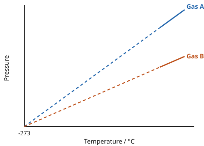

# Kinetic theory of ideal gases

## Explaining pressure in terms of particle motion

Molecules in a gas are in constant **random** motion at high speeds, and as they move about randomly they collide with the walls of their container.

*Gas molecules move about randomly at high speeds*

These collisions produce a **net force** on the wall of the container.

*Gas molecules colliding with the walls of a container, exerting a force over the area and hence generating pressure*

The magnitude of this force depends on two factors: the **speed** at which the collisions occur, and the **frequency** at which they occur.

??? info "Beyond the spec (A-Level preview): the role of momentum"
    The force each particle exerts on the wall comes from its **change in momentum** during the collision: if a particle of mass $m$ hits the wall at speed $v$ and rebounds elastically at the same speed, its momentum changes by $2mv$. The force from a single collision is this change in momentum divided by how long the collision takes, and the total force from many particles is what macroscopically appears as gas pressure. This isn't required at IGCSE, but it's the reasoning underneath both factors above: faster particles change momentum by more per collision, and more frequent collisions deliver that change more often.

Pressure is defined as the **force per unit area** ($p = \frac{F}{A}$), so the pressure exerted by a gas depends both on the magnitude of the force exerted and the surface area it acts over.

We will see how this reasoning can be used to explain the relationships between pressure, volume and temperature in several situations.

## Temperature and pressure

The **temperature** of a gas is related to the **average speed** (and therefore the **average kinetic energy**) of its molecules: the higher the temperature of the gas, the faster the molecules move, and the higher their average kinetic energy.

*As the container is heated up, the gas molecules move faster with higher kinetic energy. The energy stored within the system – the internal energy – therefore increases*

If the temperature of a gas is increased, its molecules move faster, so each collision with the container's walls produces a larger force, and the molecules also collide with the walls more frequently. Both effects increase the total force exerted on the walls, which results in an increased pressure, since pressure is the force applied per unit area ($p = \frac{F}{A}$) and the area is constant.

## Absolute zero and the Kelvin scale

If, instead, the temperature of the gas decreases, the pressure on the container also decreases. In 1848, mathematician and physicist Lord Kelvin recognised that there must be a temperature at which the particles in a gas exert no pressure at all: if the average kinetic energy of the molecules decreases to 0, they must no longer be moving, and so cannot collide with their container. This temperature is called **absolute zero**, and experiments show it is equal to -273 °C.

*At absolute zero, or -273 °C, particles will have no net movement. It is therefore not possible to have a lower temperature*

!!! abstract "Definition: Absolute zero"
    Absolute zero is defined as **the temperature at which the molecules in a substance have zero kinetic energy**.

Since molecules cannot move less than not at all, they cannot have less kinetic energy than 0, so **temperature cannot get any lower than 0 K**. Even in space, as far away as possible from any star, the temperature is roughly 2.7 K above absolute zero, because of the [Cosmic Microwave Background radiation](../Unit%208/8_3_cosmology.md#evidence-from-cmb-radiation).

!!! abstract "Definition: Kelvin scale"
    The **Kelvin temperature scale** is defined so that 0 K is equal to -273 °C, and an increase of 1 K is the same change as an increase of 1 °C.

!!! tip "Examiner Tips and Tricks"
    Because a change of 1 K is the same as a change of 1 °C, a temperature **change** always has the same numerical value in K as in °C — so in a formula such as $\Delta Q = mc\Delta \theta$, no conversion is needed, even though $\Delta\theta$ is a temperature *change*.

!!! note "Required formulae: converting between Celsius and Kelvin"
    $$ \theta / ^\circ\text{C} = \text{T} / \text{K} - 273 $$

    $$ \text{T} / \text{K} = \theta / ^\circ\text{C} + 273 $$

    Where $\theta$ is the temperature in the Celsius scale, and $T$ is the temperature in the Kelvin scale.

<table>
  <thead>
    <tr>
        <th>T / K</th>
        <th>θ / °C</th>
        <th>Notes</th>
    </tr>
  </thead>
  <tbody>
    <tr>
        <td colspan="3">THERMODYNAMIC (KELVIN) SCALE | CELSIUS SCALE</td>
    </tr>
    <tr>
        <td>400</td>
        <td>+127</td>
        <td>CONVERSION TO °C: 400 - 273.15 = 126.85 = 127 (ROUNDED TO 3 s.f.)</td>
    </tr>
    <tr>
        <td>300</td>
        <td>+27</td>
        <td> </td>
    </tr>
    <tr>
        <td>273.15</td>
        <td>0.00</td>
        <td>MELTING POINT OF ICE</td>
    </tr>
    <tr>
        <td>200</td>
        <td>-73</td>
        <td> </td>
    </tr>
    <tr>
        <td>100</td>
        <td>-173</td>
        <td> </td>
    </tr>
    <tr>
        <td>0</td>
        <td>-273</td>
        <td>ABSOLUTE ZERO (NO TEMPERATURE IS BELOW THIS)</td>
    </tr>
  </tbody>
</table>

*Conversion chart relating the temperature on the Kelvin and Celsius scales*

!!! example "Worked Example (calculation)"

    The temperature in a room is 300 K.

    What is this temperature in Celsius?

    ??? success "Answer:"

        **Step 1: Kelvin to Celsius equation**

        $$ \theta / ^\circ\text{C} = \text{T} / \text{K} - 273 $$

        **Step 2: substitute in value of 300 K**

        $$ 300\text{ K} - 273 = 27\text{ °C} $$

!!! tip "Examiner Tips and Tricks"

    If you forget in the exam whether it's +273 or -273, just remember that 0 °C = 273 K. This way, when you know that you need to +273 to a temperature in degrees to get a temperature in Kelvin. For example: 0 °C + 273 = 273 K.

One benefit of the Kelvin scale is that it lets us write the relationship between temperature and the average kinetic energy of particles in a very simple way.

!!! note "Required formulae: temperature and kinetic energy"
    The temperature in **Kelvin** is **proportional** to the **average kinetic energy** of the molecules:

    $$ T \propto KE $$

!!! warning "Warning:"
    The temperature in Kelvin is **not** proportional to the temperature in °C — the relationship between the two is linear, but not proportional, since 0 °C is not the same as 0 K. Likewise, the **speed** of molecules increases with **kinetic energy**, but not in a linear way, so speed is not proportional to kinetic energy, and therefore not proportional to temperature either.

!!! example "Worked Example (multiple choice)"

    When a liquid evaporates, molecules escape from the surface of the liquid.

    What happens to the temperature of the liquid and the average kinetic energy of the molecules within it?

    <table>
    <thead>
        <tr>
            <th> </th>
            <th>Temperature / K</th>
            <th>Average kinetic energy of the molecules</th>
        </tr>
    </thead>
    <tbody>
        <tr>
            <td>A</td>
            <td>Increases</td>
            <td>Increases</td>
        </tr>
        <tr>
            <td>B</td>
            <td>Decreases</td>
            <td>Decreases</td>
        </tr>
        <tr>
            <td>C</td>
            <td>Stays the same</td>
            <td>Stays the same</td>
        </tr>
        <tr>
            <td>D</td>
            <td>Decreases</td>
            <td>Increases</td>
        </tr>
    </tbody>
    </table>

    ??? success "Answer: B"

        When evaporation takes place, the more energetic molecules leave the surface of the liquid. Since the more energetic molecules have left, the **average kinetic energy per molecule** must **decrease** — so **A** and **D** are not correct. Temperature is **proportional** to the average kinetic energy per molecule, so the **temperature** also **decreases**, which rules out **C** and confirms **B**.

## Pressure and volume

If the temperature of a gas remains **constant**, changing the volume of its container also changes its pressure: decreasing the volume **increases** the pressure, and increasing the volume **decreases** the pressure.

***Pressure increases when a gas is compressed***

!!! example "Worked Example (explanation)"

    Explain this phenomenon in terms of particle motion.

    ??? success "Model answer:"
        The temperature is constant, so the particles travel at the same average speed as before, but in a smaller container they travel a shorter distance between collisions, so they hit the walls of the container **more frequently**. This creates a larger overall **net force**, and since the surface area has also decreased, both effects combine to increase the pressure ($p = F/A$).

A change in pressure can also cause a change in volume: a **vacuum pump** can be used to remove the air from a sealed container, and the diagram below shows the change in volume of a tied-up balloon as the pressure of the air around it decreases.

*By changing the pressure around the balloon, its change in volume can be seen*

!!! example "Worked Example (explanation)"

    Explain this phenomenon in terms of particle motion.

    ??? success "Model answer:"
        As air is pumped out of the bell jar, the air molecules outside the balloon become less frequent and less crowded, so they collide with the balloon's surface less often — the pressure outside the balloon decreases. The air trapped inside the balloon is still at its original pressure, so the net outward force on the balloon's surface increases and the balloon expands, until its own pressure has dropped (from the increased volume) enough to balance the lower pressure outside again.
