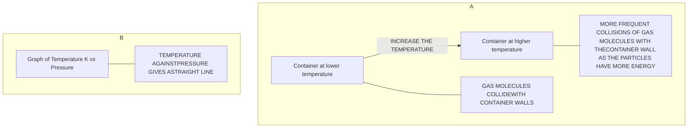

# Ideal Gas Laws

Gas laws provide numerical formulae for the relationships between pressure and (Kelvin) temperature at constant volume, and between pressure and volume at constant temperature.

## Pressure and temperature: the pressure law

As the temperature of a gas increases, the average **speed** of its molecules also increases, so — since average kinetic energy depends on speed — the average kinetic energy of the molecules also increases, assuming the volume stays constant: the **hotter** the gas, the **higher** the average kinetic energy, and the **cooler** the gas, the **lower** the average kinetic energy. If the gas is heated, its molecules travel at a higher speed, so they collide with the container's walls more often, which increases the **pressure**. Therefore, at a constant volume, an increase in temperature increases the pressure of a gas, and vice versa.

Diagram A below shows molecules in the same volume colliding with the container's walls more often as the temperature increases; Diagram B shows that, since pressure is proportional to temperature, a graph of one against the other is a straight line.

***At constant volume, an increase in the temperature of the gas increases the pressure due to more collisions on the container walls***

!!! tip "Examiner Tips and Tricks"

    You are required to be able to describe the links between pressure & volume and pressure & temperature **qualitatively**. This means that the correct use of terms such as 'collision', 'kinetic energy' and 'frequency', will be really important.

!!! note "Required formulae: the pressure law"
    If the volume $V$ of a fixed mass of an ideal gas is constant, the pressure is **proportional** to the (Kelvin) temperature:

    $$p \propto T$$

    Equivalently, comparing the gas's pressure and temperature before and after a change at constant volume:

    $$\frac{p_1}{T_1} = \frac{p_2}{T_2}$$

    Where $p_1$ and $p_2$ are the initial and final pressure in pascals (Pa), and $T_1$ and $T_2$ are the initial and final temperature in kelvin (K).

*Pressure and temperature are proportional. Doubling temperature also doubles the pressure for a gas in a fixed volume.*

*Pressure law graph representing temperature (in °C) directly proportional to the volume*

!!! example "Worked Example (calculation)"

    The pressure inside a bicycle tyre is 5.10 × 105 Pa when the temperature is 279 K. After the bicycle has been ridden, the temperature of the air in the tyre is 299 K. Calculate the new pressure in the tyre, assuming the volume is unchanged.

    ??? success "Answer:"

        **Step 1: Identify the known quantities**

        * $p_1 = 5.10 \times 10^5 \text{ Pa}$
        * $T_1 = 279 \text{ K}$
        * $T_2 = 299 \text{ K}$

        **Step 2: State the correct ideal gas law**

        Volume is constant, so the pressure law must be used.

        $$ \frac{p_1}{T_1} = \frac{p_2}{T_2} $$

        **Step 3: Substitute the known values**

        $$ \frac{5.10 \times 10^5}{279} = \frac{p_2}{299} $$

        **Step 4: Rearrange to make $p_2$ the subject**

        Multiply both sides by $T_2$ to cancel out the $T_2$ in the fraction under $p_2$:

        $$ \frac{5.10 \times 10^5}{279} \times 299 = \frac{p_2}{\cancel{299}} \times \cancel{299} $$

        $$ p_2 = \frac{5.10 \times 10^5}{279} \times 299 $$

        **Step 5: Evaluate**

        $$ p_2 = 5.47 \times 10^5 \text{ Pa} $$

!!! tip "Examiner Tips and Tricks"

    Remember when using gas laws the temperature *T* must always be in **kelvin** (K)!

## Pressure and volume: Boyle's law

For a fixed mass of gas held at a constant temperature, pressure and volume are **inversely proportional** to each other: when the volume **decreases** (compression), the pressure **increases**, and when the volume **increases** (expansion), the pressure **decreases**. This is because, when the volume decreases, the same number of particles collide with the walls of the container **more frequently**, since there is less space — the particles still collide with the same amount of force, so a greater force per unit area (pressure) results. The key assumption throughout is that the **temperature** and the **mass** (and number) of the particles remain the same.

!!! note "Required formulae: Boyle's law"
    $$pV = \text{constant}$$

    Where $p$ is the pressure in pascals (Pa) and $V$ is the volume in metres cubed (m3).

    Comparing the gas's pressure and volume before and after a change at constant temperature, this can also be written as:

    $$p_1V_1 = p_2V_2$$

    Where $p_1$ and $V_1$ are the initial pressure and volume, and $p_2$ and $V_2$ are the final pressure and volume.

***Increasing the volume of a gas decreases its pressure***

*Initial pressure and volume, $p_1$ and $V_1$, and final pressure and volume, $p_2$ and $V_2$. When volume decreases, pressure increases*

!!! example "Worked Example (calculation)"

    A gas occupies a volume of 0.70 m3 at a pressure of 200 Pa. Calculate the pressure exerted by the gas if it is compressed to a volume of 0.15 m3. Assume that the temperature and mass of the gas stay the same.

    ??? success "Answer:"

        **Step 1: Identify the known quantities**

        * Initial volume, $V_1$ = 0.70 m3

        * Initial pressure, $p_1$ = 200 Pa

        * Final volume, $V_2$ = 0.15 m3

        **Step 2: State the relevant equation**

        $$ p_1 V_1 = p_2 V_2 $$

        **Step 3: Substitute the known values**

        $$ 200 \times 0.70 = p_2 \times 0.15 $$

        **Step 4: Rearrange to make the final pressure, $p_2$, the subject**

        Divide both sides by $V_2$ to get the $p_2$ term on its own:

        $$ p_2 = \frac{200 \times 0.70}{0.15} $$

        **Step 5: Evaluate**

        $$ p_2 = 933.3 \text{ Pa} $$

        **Step 6: Give the answer to an appropriate precision, with unit**

        $$ p_2 = 930 \text{ Pa} \text{ (2 s.f.)} $$

!!! tip "Examiner Tips and Tricks"

    Always check whether your final answer makes sense. If the gas has been **compressed**, the final pressure is expected to be **more** than the initial pressure (like in the worked example). If this is not the case, double-check the rearranging of any formulae and the values put into your calculator.
