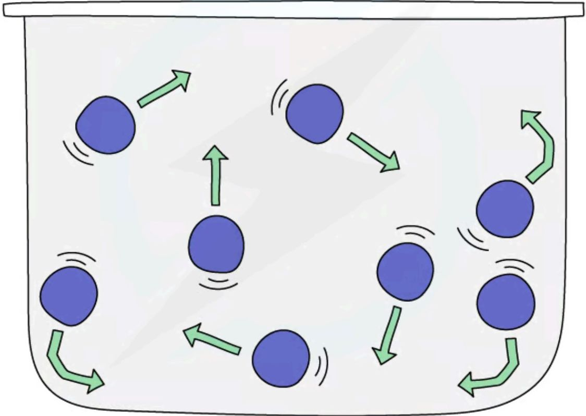
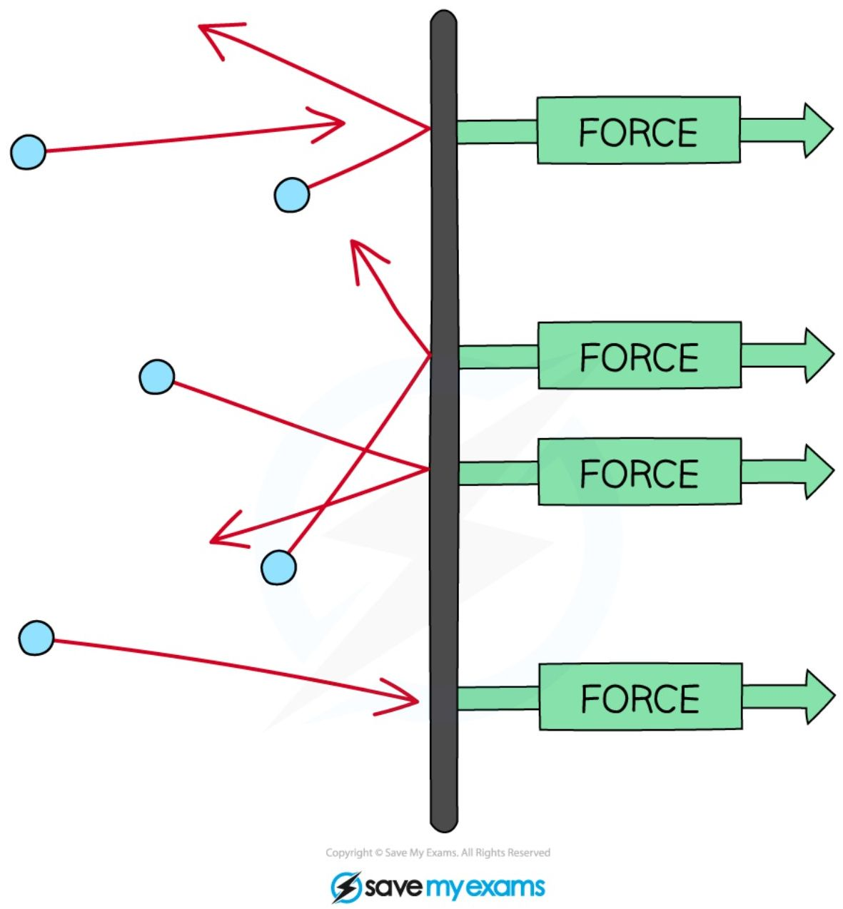
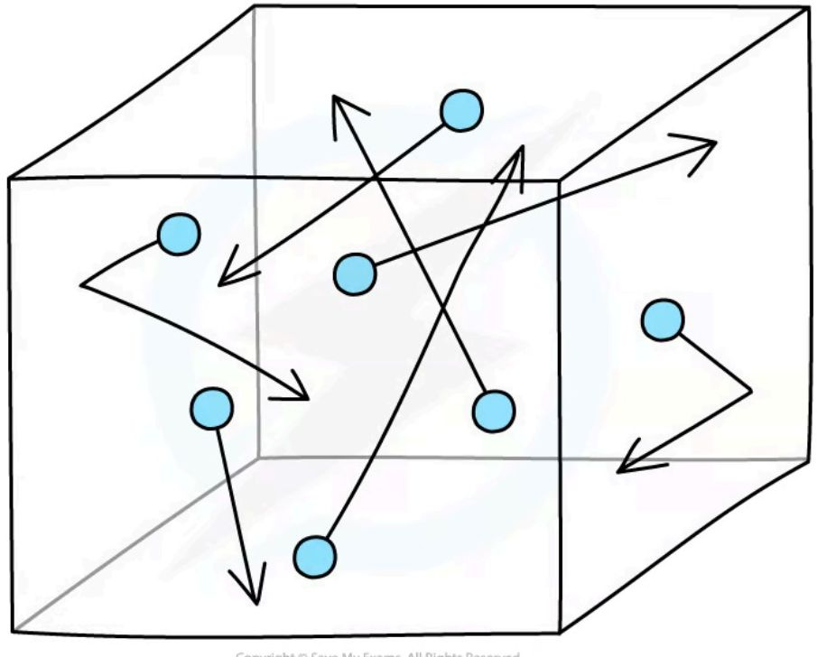
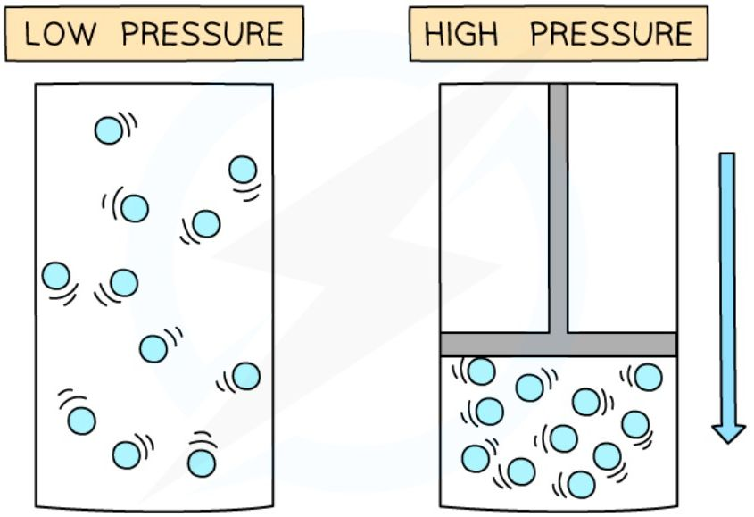
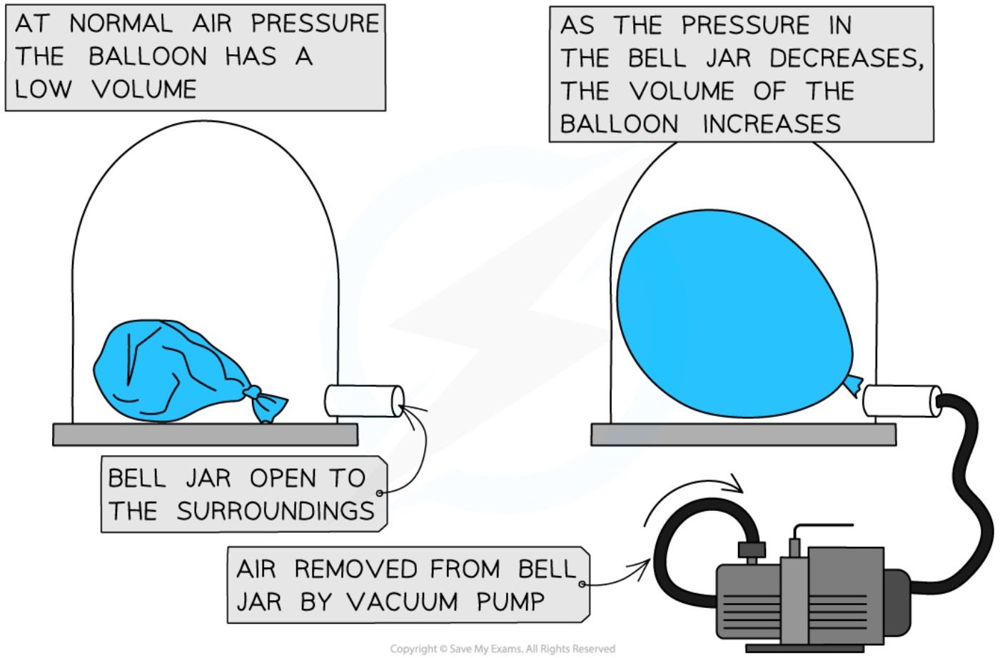
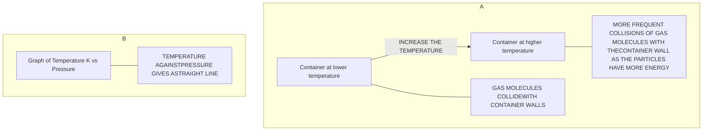
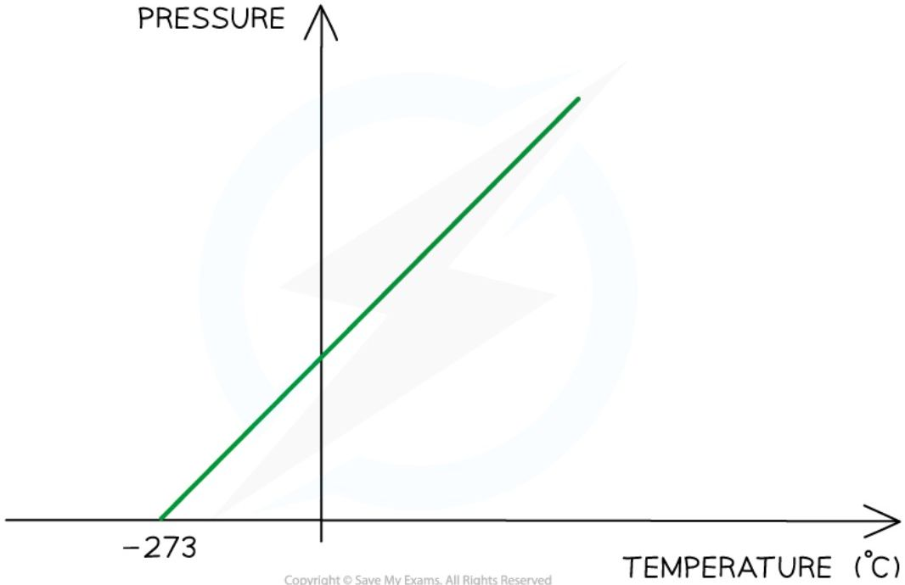
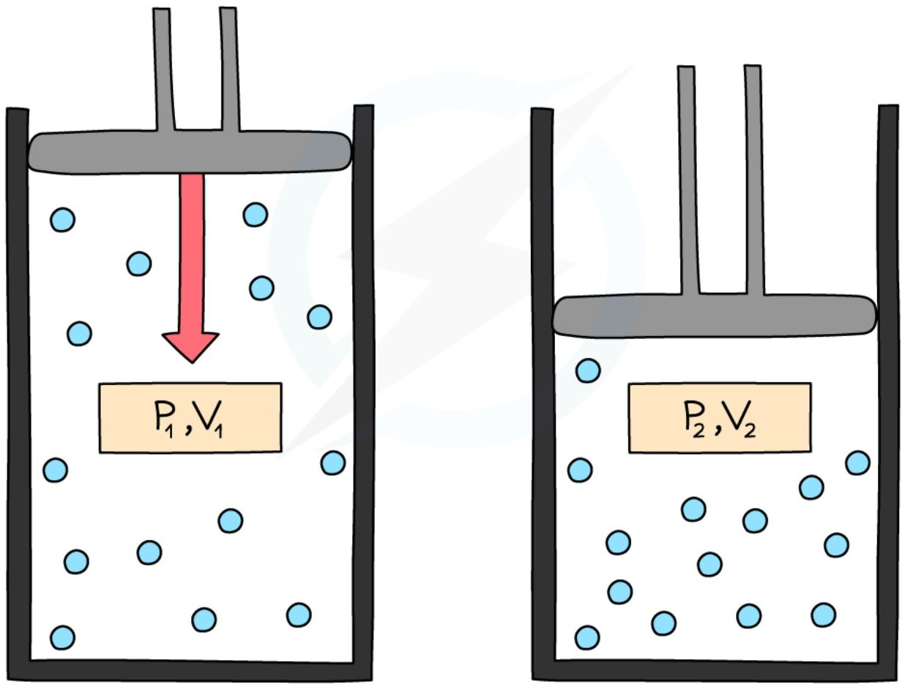

# Ideal Gases

## Kinetic theory of gases

### Random motion

* Molecules in a gas are in constant **random** motion at high speeds

* Random motion means that the molecules are travelling in no specific path and undergo sudden changes in their motion if they collide:

    - with the walls of its container

    - with other molecules

*Random motion of gas molecules in a container, caused by collisions*

### Explaining pressure in terms of particle motion

* A feature of gases is that they fill their container

* The pressure is defined as the **force per unit area**

$$ p = \frac{F}{A} $$

* Where:

    - $p$ = pressure in pascals Pa

    - $F$ = force in newtons N

* A = area in metres-squared m2

* As the gas particles move about randomly they collide with the walls of their containers

* These collisions produce a **net force** at right angles to the wall of the gas container (or any surface)

* Therefore, a gas at **high** pressure has **more frequent collisions** with the container walls and a greater force

    * Hence the higher the pressure, the higher the **force** exerted per unit area

*Gas molecules colliding with the walls of a container, exerting a force over the area and hence generating pressure*

### Absolute Zero

* The amount of pressure that a gas exerts on its container is dependent on the temperature of the gas

    - This is because particles move with more energy as their temperature increases

* As the temperature of the gas decreases, the pressure on the container also decreases

* In 1848, mathematician and physicist, Lord Kelvin, recognised that there must be a temperature at which the particles in a gas exert no pressure

    - At this temperature they must **no longer be moving**, and hence not colliding with their container

* This temperature is called **absolute zero** and is equal to -273 °C

<table>
  <thead>
    <tr>
        <th>TEMPERATURE (°C)</th>
        <th>PRESSURE</th>
    </tr>
  </thead>
  <tbody>
    <tr>
        <td>-273</td>
        <td>0</td>
    </tr>
    <tr>
        <td>-273</td>
        <td>&gt; 0</td>
    </tr>
  </tbody>
</table>

*At absolute zero, or -273 °C, particles will have no net movement. It is therefore not possible to have a lower temperature*

* Absolute zero is defined as:
**The temperature at which the molecules in a substance have zero kinetic energy**

* This means for a system at absolute zero, it is not possible to remove any more energy from it

* Even in space, the temperature is roughly 2.7 K above absolute zero

### The Kelvin scale

* The **Kelvin temperature scale** begins at absolute zero

    - **0 K is equal to -273 °C**

* An increase of 1 K is the same change as an increase of 1 °C

* It is not possible to have a temperature lower than 0 K * This means a temperature in Kelvin will **never** be a negative value

* To convert between temperatures $\theta$ in the Celsius scale, and T in the Kelvin scale, use the following conversion:

$$ \theta / ^\circ\text{C} = \text{T} / \text{K} - 273 $$

$$ \text{T} / \text{K} = \theta / ^\circ\text{C} + 273 $$

<table>
  <thead>
    <tr>
        <th>T / K</th>
        <th>θ / °C</th>
        <th>Notes</th>
    </tr>
  </thead>
  <tbody>
    <tr>
        <td colspan="3">THERMODYNAMIC (KELVIN) SCALE | CELSIUS SCALE</td>
    </tr>
    <tr>
        <td>400</td>
        <td>+127</td>
        <td>CONVERSION TO °C: 400 - 273.15 = 126.85 = 127 (ROUNDED TO 3 s.f.)</td>
    </tr>
    <tr>
        <td>300</td>
        <td>+27</td>
        <td> </td>
    </tr>
    <tr>
        <td>273.15</td>
        <td>0.00</td>
        <td>MELTING POINT OF ICE</td>
    </tr>
    <tr>
        <td>200</td>
        <td>-73</td>
        <td> </td>
    </tr>
    <tr>
        <td>100</td>
        <td>-173</td>
        <td> </td>
    </tr>
    <tr>
        <td>0</td>
        <td>-273</td>
        <td>ABSOLUTE ZERO (NO TEMPERATURE IS BELOW THIS)</td>
    </tr>
  </tbody>
</table>

Conversion chart relating the temperature on the Kelvin and Celsius scales

* The divisions on both scales are equal. This means:

**A change in a temperature of 1 K is equal to a change in temperature of 1 °C**

!!! example "Worked Example"

    The temperature in a room is 300 K.

    What is this temperature in Celsius?

    ??? "Answer:"

        Step 1: Kelvin to Celsius equation

        $$ \theta / ^\circ\text{C} = \text{T} / \text{K} - 273 $$

        Step 2: substitute in value of 300 K

        300 K - 273 = **27 °C**

!!! tip "Examiner Tips and Tricks"

    If you forget in the exam whether it's +273 or -273, just remember that 0 °C = 273 K. This way, when you know that you need to +273 to a temperature in degrees to get a temperature in Kelvin. For example: 0 °C + 273 = 273 K.

## Temperature

### Temperature & speed

* Imagine molecules of gas that are free to move around in a box

* The molecules in the gas move around randomly at high speeds, colliding with surfaces and exerting pressure upon them

* The **temperature** of a gas is a measure of the **average speed** of the molecules:

    - The **higher the temperature** of the gas, the **faster** the molecules move

    - This is because they have a greater average speed

*Gas molecules move about randomly at high speeds*

### Temperature & kinetic energy

* The temperature of a substance is related to the average kinetic energy of its molecules

* The higher the temperature, the higher the average kinetic energy of the molecules, and vice versa

    - This means they move **faster** at higher temperatures

    - This applies to all states of matter, although the motion of particles in a solid is different from that of particles in a gas

* For a gas, the **internal energy** can be taken as the sum of the kinetic energies of all the molecules

    - In a gas, the intermolecular forces are negligible, so the contribution from potential energy can be taken as zero

* This is different from a solid or liquid, where the internal energy includes contributions from both kinetic and potential energy

*As the container is heated up, the gas molecules move faster with higher kinetic energy. The energy stored within the system – the internal energy – therefore increases*

* If the temperature of a gas is increased, the particles move faster and gain **kinetic energy**

    - They collide more often with each other and the container walls, leading to an increase in **pressure**

* The temperature (in Kelvin) is **proportional** to the average kinetic energy of the molecules:

$$ T \propto KE $$

!!! Example "Worked Example"

    When a liquid evaporates, molecules escape from the surface of the liquid.

    What happens to the temperature of the liquid and the average kinetic energy of the molecules within it?

    <table>
    <thead>
        <tr>
            <th> </th>
            <th>Temperature / K</th>
            <th>Average kinetic energy of the molecules</th>
        </tr>
    </thead>
    <tbody>
        <tr>
            <td>A</td>
            <td>Increases</td>
            <td>Increases</td>
        </tr>
    </tbody>
    </table>

    <table>
    <tbody>
        <tr>
            <td>B</td>
            <td>Decreases</td>
            <td>Decreases</td>
        </tr>
        <tr>
            <td>C</td>
            <td>Stays the same</td>
            <td>Stays the same</td>
        </tr>
        <tr>
            <td>D</td>
            <td>Decreases</td>
            <td>Increases</td>
        </tr>
    </tbody>
    </table>

    **Answer: B**

    * When evaporation takes place, the more energetic molecules leave the surface of the liquid
    * Since the more energetic molecules have left, the **average kinetic energy per molecule** must **decrease**
        - Therefore, **A & D** are not correct
    * Temperature is **proportional** to the average kinetic energy per molecule, therefore, the **temperature** also **decreases**

## The Gas Laws

* Gas laws provide explanations for the relationships between:

    * Pressure and volume at a constant temperature

    * Pressure and (kelvin) temperature at a constant volume

### Pressure & volume

* If the temperature of a gas remains **constant**, the pressure of the gas changes when it is:

    * **compressed** – decreases the volume which **increases** the pressure

    * **expanded** – increases the volume which **decreases** the pressure

***Pressure increases when a gas is compressed***

* Similarly, a change in pressure can cause a change in volume

* A **vacuum pump** can be used to remove the air from a sealed container

* The diagram below shows the change in volume to a tied up balloon when the pressure of the air around it decreases:

*By changing the pressure around the balloon, its change in volume can be seen*

* For a fixed temperature, if the gas is compressed, the pressure will increase

    * The particles travel the same speed as before, but the distance they travel is reduced when the container is smaller

    * The molecules will hit the walls of the container **more frequently**

    * This creates a larger overall **net force** on the walls which increases the **pressure**

### Pressure & temperature

* The motion of molecules in a gas changes according to the **temperature**

* As the temperature of a gas increases, the average **speed** of the molecules also **increases**

* Since the average kinetic energy depends on their speed, the kinetic energy of the molecules also increases if its volume remains constant

    * The **hotter** the gas, the **higher** the average kinetic energy

    * The **cooler** the gas, the **lower** the average kinetic energy

* If the gas is heated up, the molecules will travel at a higher **speed**

    * This means they will collide with the walls **more often**

    * This creates an increase in **pressure**

* Therefore, at a constant volume, an **increase** in temperature **increases** the pressure of a gas and vice versa

* Diagram A shows molecules in the same volume collide with the walls of the container more with an increase in temperature

* Diagram B shows that since the temperature is proportional to the pressure, the graph against each is a straight line

***At constant volume, an increase in the temperature of the gas increases the pressure due to more collisions on the container walls***

!!! tip "Examiner Tips and Tricks"

    You are required to be able to describe the links between pressure & volume and pressure & temperature **qualitatively**. This means that the correct use of terms such as 'collision', 'kinetic energy' and 'frequency', will be really important.

### The Pressure Law

* If the volume $V$ of an ideal gas is constant, the **pressure law** is given by:

$$P \propto T$$

* This means the pressure is **proportional** to the temperature

*Pressure and temperature are proportional. Doubling temperature also doubles the pressure for a gas in a fixed volume.*

* The relationship between the pressure and (Kelvin) temperature for a fixed mass of gas at constant volume can also be written as:

$$\frac{p_1}{T_1} = \frac{p_2}{T_2}$$

* Where:

    * $p_1$ = initial pressure (Pa)

    * $p_2$ = final pressure (Pa)

    * $T_1$ = initial temperature (K)

    * $T_2$ = final temperature (K)

*Pressure law graph representing temperature (in °C) directly proportional to the volume*

!!! example "Worked Example"

    The pressure inside a bicycle tyre is 5.10 × 105 Pa when the temperature is 279 K. After the bicycle has been ridden, the temperature of the air in the tyre is 299 K. Calculate the new pressure in the tyre, assuming the volume is unchanged.

    **Answer:**

    **Step 1: Choose the correct ideal gas law**

    * Volume is constant, so the pressure law must be used

    $$ \frac{p_1}{T_1} = \frac{p_2}{T_2} $$

    **Step 2: Write down the known quantities**

    * $p_1 = 5.10 \times 10^5 \text{ Pa}$
    * $T_1 = 279 \text{ K}$
    * $T_2 = 299 \text{ K}$

    **Step 3: Rearrange for $p_2$ and substitute values into the pressure law**

    * To make $p_2$ the subject, multiply both sides by $T_2$ to cancel out the $T_2$ in the fraction under $p_2$

    $$ \frac{p_1}{T_1} \times T_2 = \frac{p_2}{\cancel{T_2}} \times \cancel{T_2} $$

    $$ \frac{p_1}{T_1} \times T_2 = p_2 $$

    * Substitute the known quantities

    $$ p_2 = \frac{5.10 \times 10^5}{279} \times 299 $$

    $$ p_2 = 5.47 \times 10^5 \text{ Pa} $$

!!! tip "Examiner Tips and Tricks"

    Remember when using gas laws the temperature *T* must always be in **kelvin** (K)!

### Boyle's Law

* For a fixed mass of a gas held at a constant temperature, the Boyle's law formula is:

$$pV = \text{constant}$$

* Where:

    - $p$ = pressure in pascals (Pa)

    - $V$ = volume in metres cubed (m$^3$)

* This means that the pressure and volume are **inversely proportional** to each other

    - When the volume **decreases** (compression), the pressure **increases**

    - When the volume **increases** (expansion), the pressure **decreases**

* This is because when the volume decreases, the same number of particles collide with the walls of a container but **more frequently** as there is **less space**

    - However, the particles still collide with the same amount of **force** meaning greater force per unit area (pressure)

* The key assumption is that the **temperature** and the **mass** (and number) of the particles remains the same

***Increasing the volume of a gas decreases its pressure***

* This equation can also be rewritten for comparing the pressure and volume before and after a change in a gas:

$$p_1V_1 = p_2V_2$$

* Where:

* $p_1$ = initial pressure in pascals (Pa)

* $V_1$ = initial volume in metres cubed (m3)

* $p_2$ = final pressure in pascals (Pa)

* $V_2$ = final volume in metres cubed (m3)

* This equation is sometimes referred to as **Boyle's Law**

*Initial pressure and volume, $p_1$ and $V_1$, and final pressure and volume, $p_2$ and $V_2$. When volume decreases, pressure increases*

!!! example "Worked Example"

    A gas occupies a volume of 0.70 m3 at a pressure of 200 Pa. Calculate the pressure exerted by the gas if it is compressed to a volume of 0.15 m3. Assume that the temperature and mass of the gas stay the same.

    **Answer:**

    **Step 1: List the known quantities**

    * Initial volume, $V_1$ = 0.70 m3

    * Initial pressure, $p_1$ = 200 Pa

    * Final volume, $V_2$ = 0.15 m3

    **Step 2: Write the relevant equation**

    $$ p_1 V_1 = p_2 V_2 $$

    **Step 3: Rearrange for the final pressure, $p_2$**

    * Divide both sides by $V_2$ to get the $p_2$ term on its own

    $$ \frac{p_1 V_1}{V_2} = \frac{p_2 \cancel{V_2}}{\cancel{V_2}} $$

    $$ \frac{p_1 V_1}{V_2} = p_2 $$

    **Step 4: Substitute in the values**

    $$ p_2 = \frac{p_1 V_1}{V_2} = \frac{200 \times 0.70}{0.15} $$

    $$ p_2 = 930 \text{ Pa} \text{ (2 s.f.)} $$

!!! tip "Examiner Tips and Tricks"

    Always check whether your final answer makes sense. If the gas has been **compressed**, the final pressure is expected to be **more** than the initial pressure (like in the worked example). If this is not the case, double-check the rearranging of any formulae and the values put into your calculator.
