# Magnets and magnetic fields

## Poles of a magnet

The ends of a magnet are called **poles**. Magnets have two poles: a **north** and a **south**.

*Poles of a Magnet*

## The law of magnetism

When two magnets are held close together, there is an attractive or repulsive force between them, depending on how they are arranged.

***Opposite poles attract; like poles repel***

The law of magnetism states that two **like** poles repel (e.g. S and S, or N and N), and two **opposite** poles attract (e.g. S and N). The attraction or repulsion between two magnetic poles occurs due to the **magnetic force**.

## Magnetic materials

Magnetic materials can be **soft** or **hard**. Magnetically soft materials (e.g. iron) are easy to magnetise, but also easily lose their magnetism — they are only temporarily magnetised. Magnetically hard materials (e.g. steel) are difficult to magnetise, but do not easily lose their magnetism once magnetised — they are permanently magnetised.

Permanent magnets are made out of magnetically **hard** materials, while electromagnets are made out of magnetically **soft** materials — this means electromagnets can be made magnetic or non-magnetic as and when required.

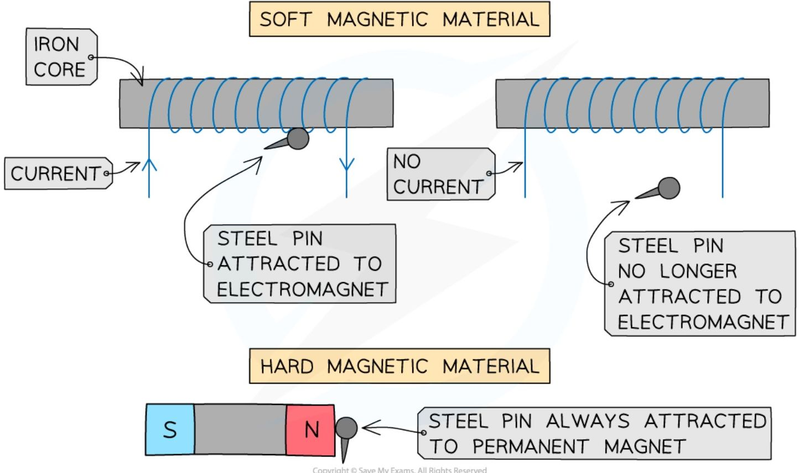

***A steel pin will be attracted when an electromagnet switches on but not when it switches off. It is always attracted to a permanent magnet***

## Magnetic fields

!!! abstract "Definition: Magnetic field"
    A magnetic field is **the region around a magnet where a force acts on another magnet or on a magnetic material** (such as iron, steel, cobalt and nickel). All magnets are surrounded by a magnetic field.

### Magnetic field lines

Magnetic field lines represent the **strength** and **direction** of a magnetic field: the direction is shown using **arrows**, and the strength is shown by the **spacing** of the lines — field lines that are **close together** show a **strong** field, and lines that are **far apart** show a **weak** field.

There are two rules for drawing magnetic field lines: they always go **from north to south** (shown by an arrow midway along the line), and two magnetic field lines must **never touch or cross** each other.

### Magnetic field around a bar magnet

The magnetic field is **strongest at the poles**, where the field lines are **closest** together, and becomes **weaker as the distance from the magnet increases**, shown by the field lines getting **further apart**.

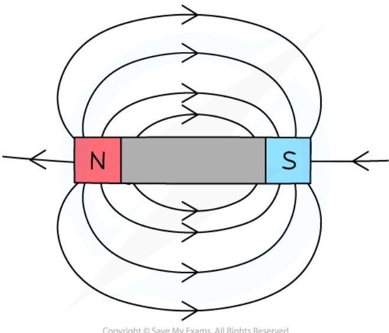

*The magnetic field around a bar magnet*

Two bar magnets can be arranged to repel or attract, and the field lines look slightly different in each case:

### Magnetic field lines between two bar magnets

The magnetic field lines around different configurations of two bar magnets would look like this:

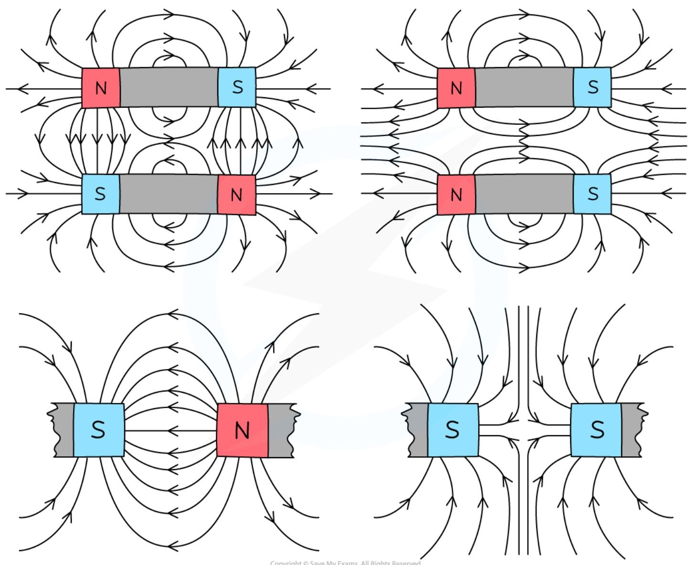

!!! tip "Examiner Tips and Tricks"

    If you are asked to draw the magnetic field around a bar magnet remember to indicate both the **direction** of the magnetic field and the **strength** of the magnetic field. You can do this by:

    * Adding arrows pointing away from the north pole and towards the south pole

    * Making sure the magnetic field lines are further apart as the distance from the magnet increases

    * Remember that the direction of the field line at a point is the same as the direction of the force a north pole would experience at that point

### Uniform magnetic fields

Two bar magnets can be used to produce a **uniform** magnetic field: pointing opposite poles (north and south) of the two magnets a few centimetres apart produces a uniform field in the **gap** between them. Outside that gap, the field is **not** uniform.

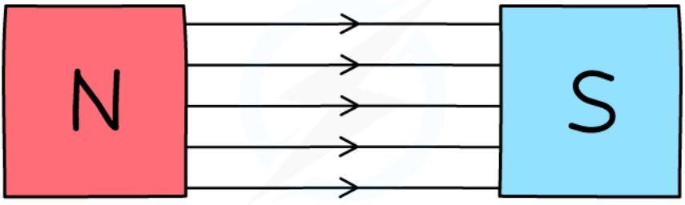

*A uniform field is created when two opposite poles are held close together. Magnetic fields are always directed from North to South. Note that the rest of each magnet is not shown, but the magnet with a north pole also has a south pole not shown and vice versa for the south pole shown above.*

A uniform magnetic field is one that has the **same strength and direction at all points**: equal spacing between the field lines shows that the field has the same strength everywhere, and an arrow on each line pointing from the **north** pole to the **south** pole shows that it acts in the same direction everywhere.

## Permanent and induced magnets

### Which materials are magnetic?

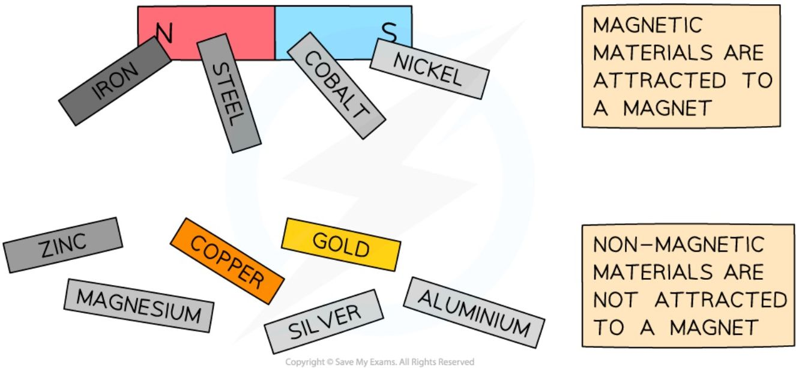

***Magnetic materials are attracted to a magnet; non-magnetic materials are not***

Magnetic materials are materials which are attracted by magnets — being a magnetic material does **not** mean the material is itself a magnet. Very few metals in the periodic table are magnetic: iron, cobalt and nickel. **Steel** is an alloy which **contains iron**, so it is also magnetic. Magnetic materials are always **attracted** to a magnet, regardless of which pole is held close to it.

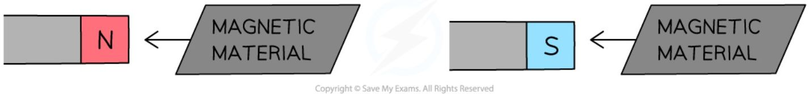

***Magnetic materials attracted to either pole of a magnet***

To test whether a material is itself a magnet, bring it close to a known magnet: if it can be **repelled** by the known magnet, the material itself is a magnet; if it can only be **attracted**, and never repelled, it is a magnetic material rather than a magnet.

There are two types of magnets: **permanent magnets** and **induced magnets**.

### Permanent magnets

Permanent magnets are made out of permanent magnetic materials, for example steel. A permanent magnet produces its own magnetic field, and does not lose its magnetism.

### Induced magnets

When a magnetic material is placed in a magnetic field, the material can temporarily be turned into a magnet — this is called **induced magnetism**. One end of the material becomes a north pole, and the other becomes a south pole. Because magnetic materials are always **attracted** to a permanent magnet, the end of the material closest to the magnet always takes on the **opposite** pole to the magnet's pole closest to it.

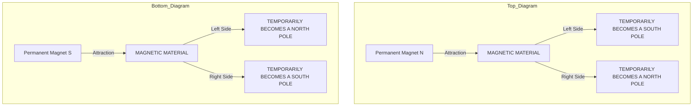

*Inducing magnetism in a magnetic material*

When the magnetic material is removed from the magnetic field, it will lose most or all of its magnetism quickly.

!!! example "Worked Example (multiple choice)"

    The diagram below shows a magnet held close to a piece of metal that is suspended by a light cotton thread. The piece of metal is attracted towards the magnet.

    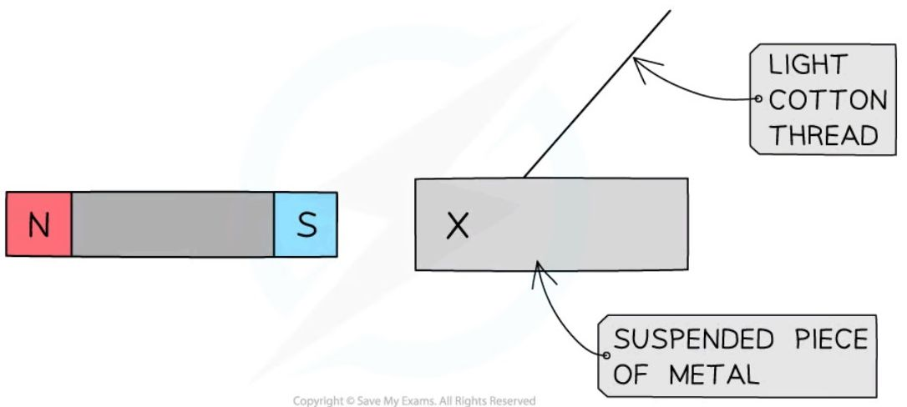

    Which of the following rows in the table gives the correct type of pole at X and the correct material of the suspended piece of metal?

    <table>
    <thead>
        <tr>
            <th> </th>
            <th>Type of pole at X</th>
            <th>Material of suspended metal</th>
        </tr>
    </thead>
    <tbody>
        <tr>
            <td>A</td>
            <td>North</td>
            <td>Nickel</td>
        </tr>
        <tr>
            <td>B</td>
            <td>South</td>
            <td>Nickel</td>
        </tr>
        <tr>
            <td>C</td>
            <td>North</td>
            <td>Aluminium</td>
        </tr>
        <tr>
            <td>D</td>
            <td>South</td>
            <td>Aluminium</td>
        </tr>
    </tbody>
    </table>

    ??? success "Answer: A"

        X must be a north pole: the piece of metal is being attracted towards the magnet, and the law of magnetism states that opposite poles attract. The material of the suspended piece of metal is nickel, since nickel is a magnetic material (it experiences a force when placed in a magnetic field — in this case, attraction towards the magnet).

        * **B** is incorrect because X cannot also be a south pole (and hence is a north pole): if the pole at X was a south pole, the piece of metal would be repelled from the magnet, since the law of magnetism states that like poles repel.

        * **C** and **D** are incorrect because aluminium is not a magnetic material — a non-magnetic material would be unaffected by the magnetic field produced by the magnet.

## Core practical 12: investigating magnetic fields

This experiment aims to investigate the magnetic field pattern for a permanent bar magnet, and between two bar magnets.

### Equipment

<table>
  <thead>
    <tr>
        <th>Equipment</th>
        <th>Purpose</th>
    </tr>
  </thead>
  <tbody>
    <tr>
        <td>Two bar magnets</td>
        <td>Produce a magnetic field which is plotted</td>
    </tr>
    <tr>
        <td>Plotting compasses</td>
        <td>Show the direction of the magnetic field at a given point</td>
    </tr>
    <tr>
        <td>Paper</td>
        <td>Plot the magnetic field pattern on this</td>
    </tr>
    <tr>
        <td>Pencil</td>
        <td>Plot the magnetic field pattern with this</td>
    </tr>
  </tbody>
</table>

### Method

1. Place the magnet on top of a piece of paper, and draw a dot at one end of the magnet (near its corner).

    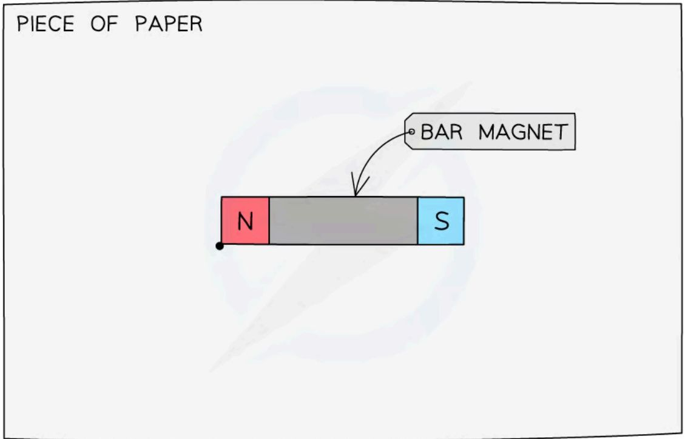

2. Place a plotting compass next to the dot, so that one end of the needle of the compass points away from the dot, and use a pencil to draw a new dot at the other side of the compass needle.

    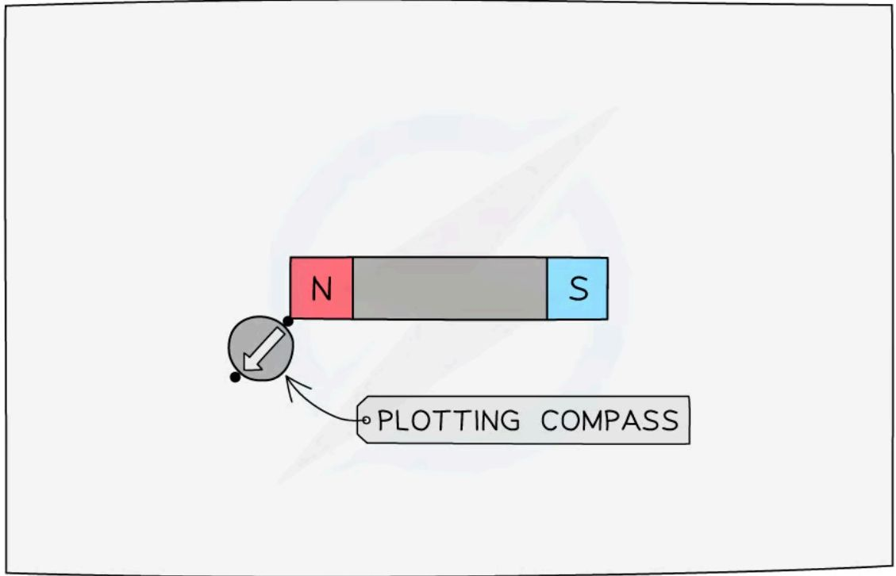

3. Move the compass so that it points away from the new dot, and repeat the process above.

    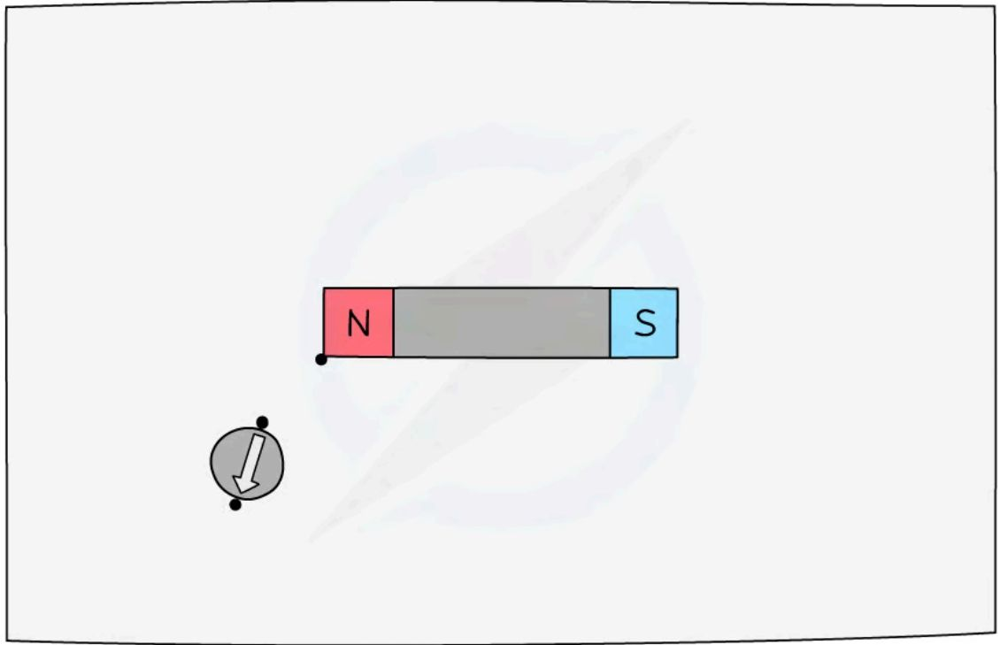

4. Keep repeating the previous process until there is a chain of dots going from one end of the magnet to the other. Then remove the compass, and link the dots using a smooth curve — this will be the magnetic field line.

    

5. Repeat the whole process several times to create several other magnetic field lines.

    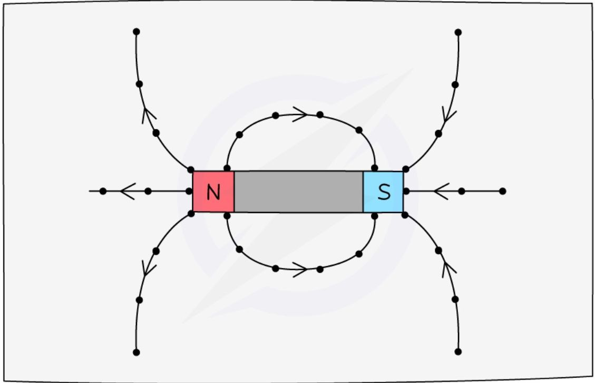

6. Repeat the whole process for two bar magnets placed 5 cm apart, first facing the same pole, then facing opposite poles.

### Analysis of results

The magnetic field pattern for the single bar magnet should look like this:

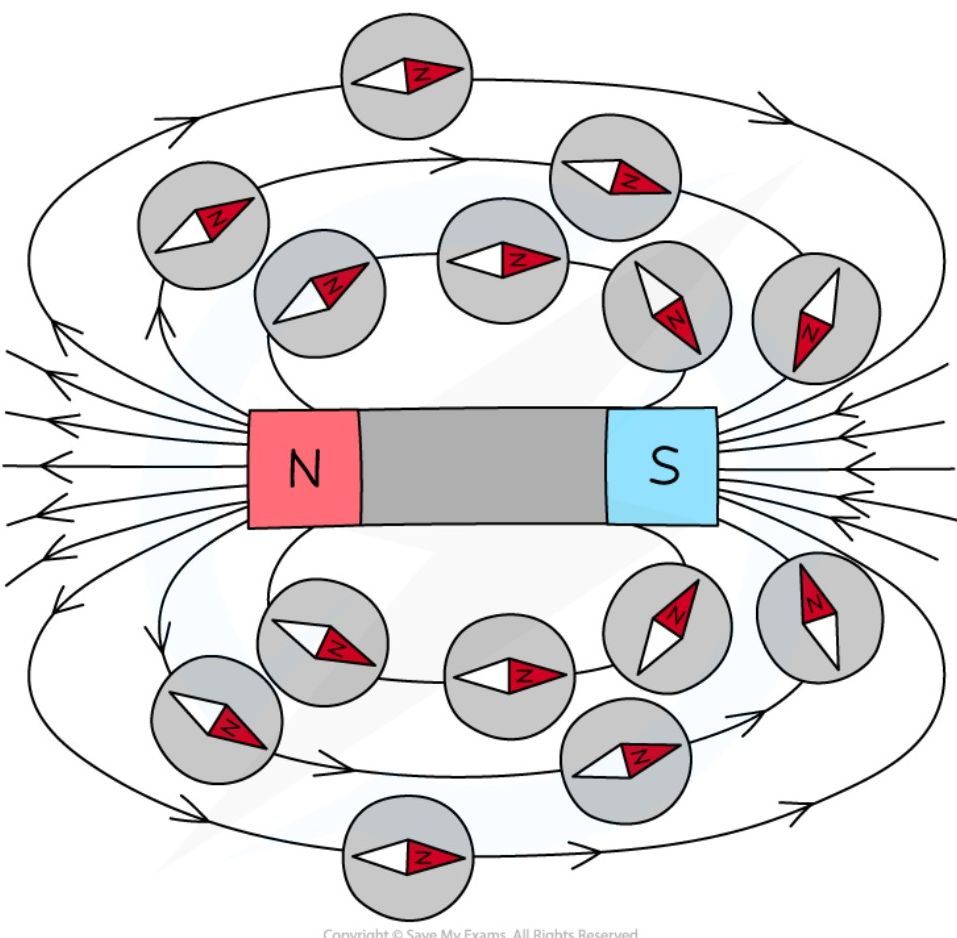

***The magnetic field of a bar magnet plotted***

The magnetic field pattern for two bar magnets should look like this:

***Magnetic field of two bar magnets interacting***

### Evaluating the experiment

* Make sure the pencil you use is sharp to provide a clear and accurate drawing of the field lines

* Read the marker on the compass from above and not at an angle

* Allow the compasses to settle for a couple of seconds before taking the reading
