# Motor effect

## Magnetic field of a wire carrying current

* When a **current** flows through a conducting wire a **magnetic field** is produced around the wire

* The shape and direction of the magnetic field can be investigated using plotting compasses

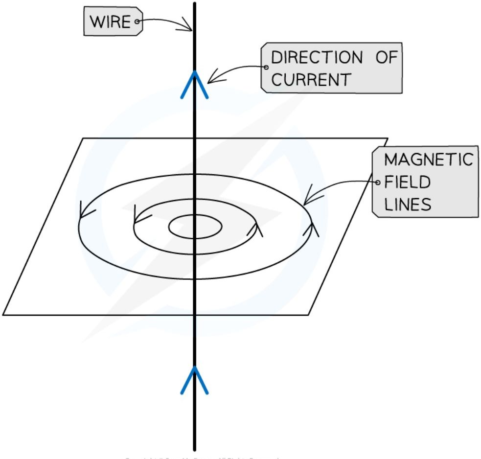

*Diagram showing the magnetic field around a current-carrying wire*

* The magnetic field is made up of **concentric circles**

    - A circular field pattern indicates that the magnetic field around a current-carrying wire has **no poles**

* As the distance from the wire increases the circles get further apart

    - This shows that the magnetic field is strongest closest to the wire and gets weaker as the distance from the wire increases

* The **right-hand thumb rule** can be used to work out the **direction** of the magnetic field

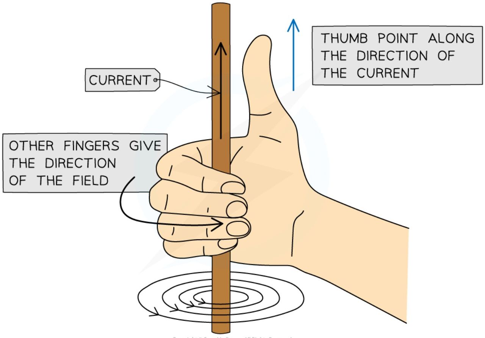

*The right-hand thumb rule shows the direction of current flow through a wire and the direction of the magnetic field around the wire*

* Reversing the direction in which the current flows through the wire will **reverse the direction** of the magnetic field

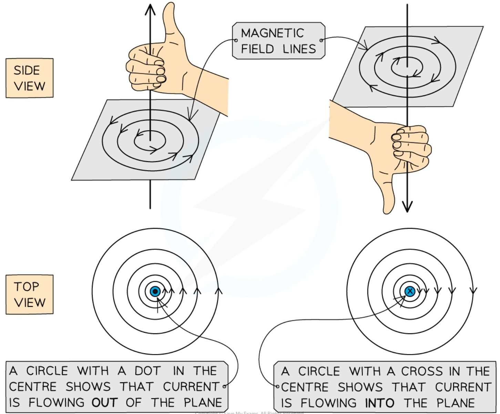

*Side and top view of the current flowing through a wire and the magnetic field produced*

* If there is **no current** flowing through the conductor there will be **no magnetic field**

* Increasing the amount of current flowing through the wire will increase the strength of the magnetic field

    * This means the field lines will become **closer together**

### Factors affecting field strength

* The strength of the magnetic fields field depends on:

    * The size of the current

    * The distance from the long straight conductor (such as a wire)

* A larger **current** will produce a larger **magnetic field** and vice versa

* The greater the **distance** from the conductor, the **weaker** the **magnetic field** and vice versa

*The greater the current, the stronger the magnetic field. This is shown by more concentrated field lines*

### Magnetic Field Patterns

* Magnetic field line patterns are all slightly different around:

    * Straight wires

    * Flat circular coils

    * Solenoids

#### Magnetic field in a straight wire

* When a **current** flows through a conducting wire a **magnetic field** is produced around the wire

* The shape and direction of the magnetic field can be investigated using plotting compasses

* The magnetic field is made up of **concentric circles**

    * A circular field pattern indicates that the magnetic field around a current-carrying wire has **no poles**

* As the distance from the wire increases the circles get further apart

    * This shows that the magnetic field is strongest closest to the wire and gets weaker as the distance from the wire increases

* The **right-hand thumb rule** can be used to work out the **direction** of the magnetic field

*The direction of the magnetic field around a wire is given by the right-hand thumb rule*

* Reversing the direction in which the current flows through the wire will **reverse the direction** of the magnetic field

* If there is **no current** flowing through the conductor there will be **no magnetic field**

* **Increasing** the amount of current flowing through the wire will **increase** the strength of the magnetic field

    * This means the field lines will become **closer together**

#### Magnetic field in a flat circular coil

* When a wire is looped into a **coil**, the magnetic field lines circle around each part of the coil, passing through the centre of it

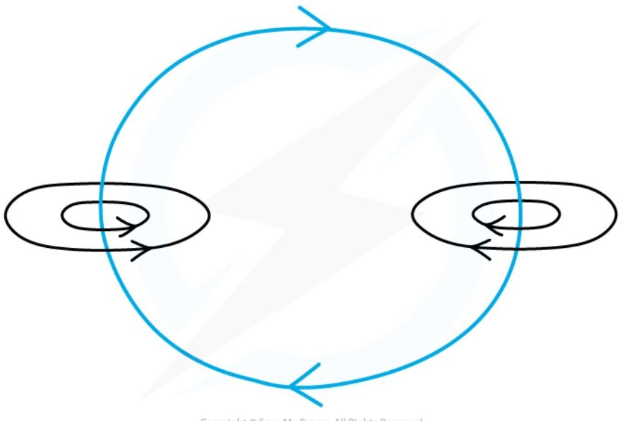

*The magnetic field around a flat circular coil*

* To increase the strength of the magnetic field around the wire it should be coiled to form a **solenoid**

* The magnetic field around the solenoid is similar to that of a **bar magnet**

* Using this, we can draw the pattern of magnetic field lines of a current carrying solenoid

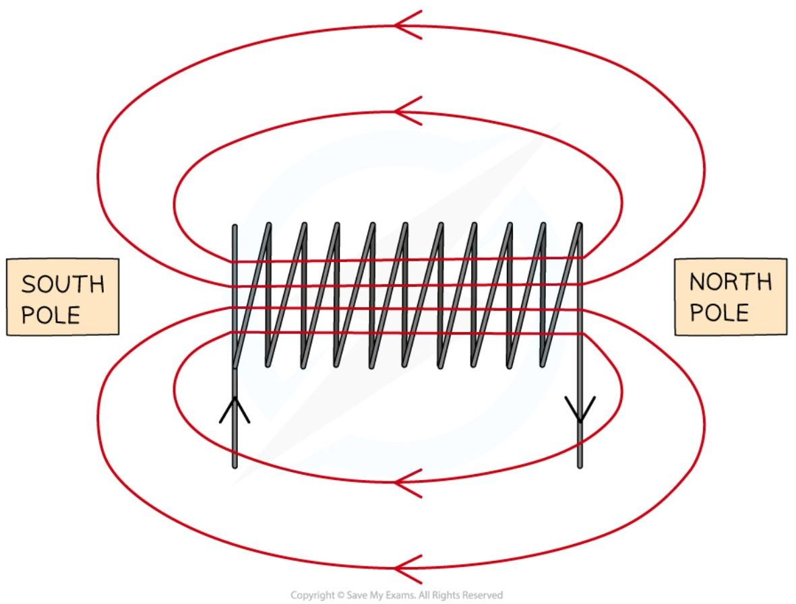

*Magnetic field around and through a solenoid. This is similar to the field of a bar magnet.*

#### Magnetic field in a solenoid

* The magnetic field inside the solenoid is strong and **uniform**

* Inside a solenoid (an example of an electromagnet) the fields from individual coils

    * **Add together** to form a very **strong** almost uniform field along the **centre** of the solenoid

    * **Cancel** to give a weaker field **outside** the solenoid

* One end of the solenoid behaves like the **north pole** of a magnet; the other side behaves like the **south pole**

    * To work out the polarity of each end of the solenoid it needs to be viewed from the end

    * If the current is travelling around in a **clockwise** direction then it is the **south pole**

    * If the current is travelling around in an **anticlockwise** direction then it is the north pole

* If the **current changes direction** then the north and south **poles will be reversed**

* If there is **no current** flowing through the wire then there will be **no magnetic field** produced around or through the solenoid

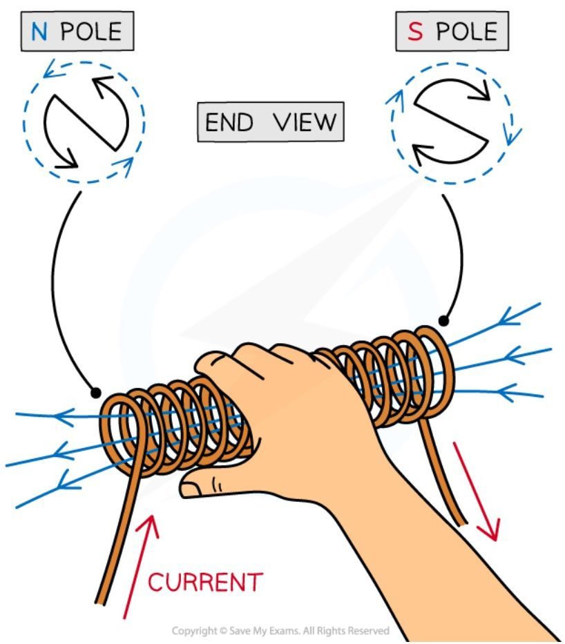

*Poles of a solenoid. The right hand rule can be adapted for this situation, with fingers following the direction of current and the thumb pointing in the direction of the central magnetic field lines.*

##### Factors affecting magnetic field strength of a solenoid

* The strength of the magnetic field produced around a solenoid can be increased by:

    * Increasing the **size of the current** which is flowing through the wire

    * Increasing the **number of turns in the coil** in a given length

    * **Reducing the length** of the wire and **maintaining the number of turns**

    * Adding an **iron core** through the centre of the coils

* The iron core will become an **induced magnet** when current is flowing through the coils

* The magnetic field produced from the solenoid and the iron core will create a much **stronger** magnet overall

!!! tip "Examiner Tips and Tricks"

    Remember the term ‘uniform field’ means a field which has the same strength and direction at all points. This is represented by parallel field lines.

    When discussing the strength of an electromagnet, avoid saying “add more coils”: The coil describes the overall object – the individual loops of wire should be referred to as **turns**. The correct phrase to use is "add more **turns** to the coil".

### Electromagnets

* When an electric current flows in a wire it creates a **magnetic field** around the wire

* By winding the wire into a **coil** we can **strengthen** the magnetic field by concentrating the field lines

* If this wire is wound around a soft magnet, such as an iron, then an electromagnet is made (see the electromagnet diagram below)

    - The electromagnet is magnetic **only** when current flows through the wire

**Electromagnet diagram**

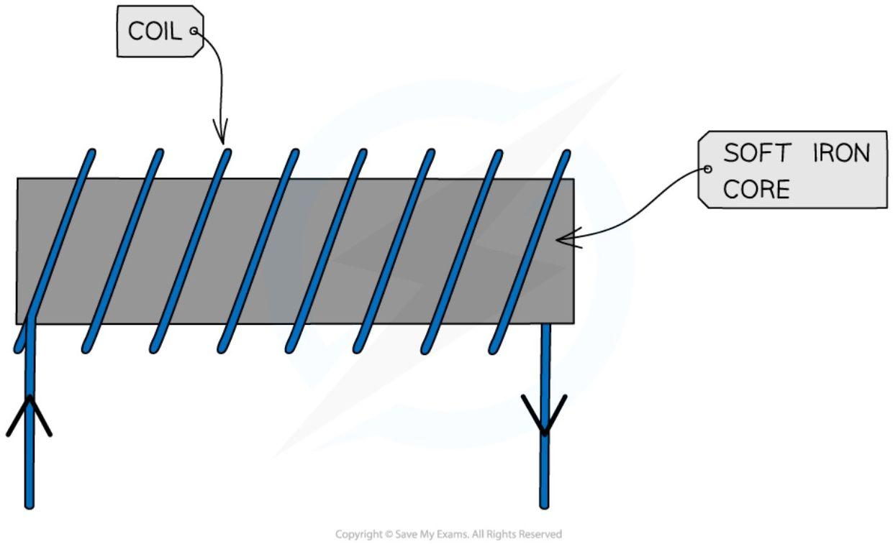

***Electromagnets are made up of a coil of wire wrapped around an iron core***

* The strength of an electromagnet’s magnetic field may be increased by:

    - Increasing the **current** in the coil

    - Adding more **turns** to the coil

* The magnetic field around an electromagnet has the same shape as the one around a bar magnet

* The field can be **reversed** by reversing the direction of the **current**

    - However, bar magnets are always magnetic, unlike electromagnets

## The Motor Effect

### Magnetic force on a current-carrying wire

* The **motor effect** occurs when:
  A wire with current flowing through it is placed in a magnetic field and experiences a **force**

* This effect is a result of **two** interacting **magnetic fields**

  * One is produced around the wire due to the current flowing through it

  * The second is the magnetic field into which the wire is placed, for example, between two magnets

* As a result of the interactions of the two magnetic fields, the wire will experience a **force**

* When no current is passed through a conductor in a magnetic field, however, it will experience no force

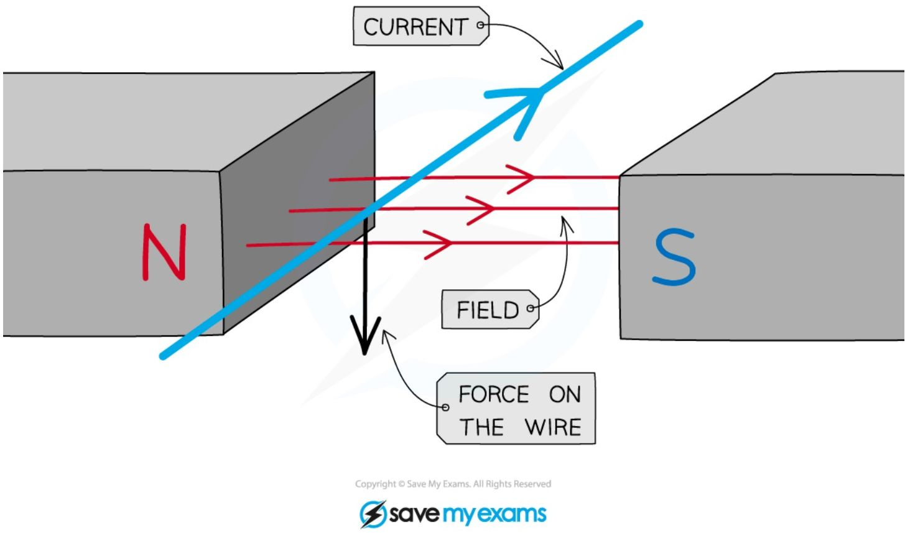

*The motor effect is a result of two magnetic fields interacting to produce a force on the wire*

### Factors affecting magnetic force

* Magnetic forces are due to interactions between **magnetic fields**

    - **Stronger** magnetic fields produce **stronger** forces and vice versa

* For a current carrying conductor, the size of the force exerted by the magnetic fields can be **increased** by:

    - Increasing the amount of **current** flowing through the wire

        - This will increase the magnetic field around the wire

    - Using **stronger magnets**

        - This will increase the magnetic field between the poles of the magnet

    - Placing the wire at **90°** to the direction of the magnetic field lines between the poles of the magnet

        - This will result in the maximum interaction between the two magnetic fields

* Note:  If the two magnetic fields are **parallel** there will be no interaction between the two magnetic fields and therefore **no force** produced

### Fleming's left-hand rule

* The **direction** of the **force** (aka the **thrust**) on a current-carrying wire depends on the direction of
    - the current
    - the magnetic field

* All three will be **perpendicular** to each other in Fleming's left-hand rule questions
    - This means that sometimes the force could be into and out of the page (in 3D)

* The direction of the force (or thrust) can be worked out by using **Fleming's left-hand rule**:

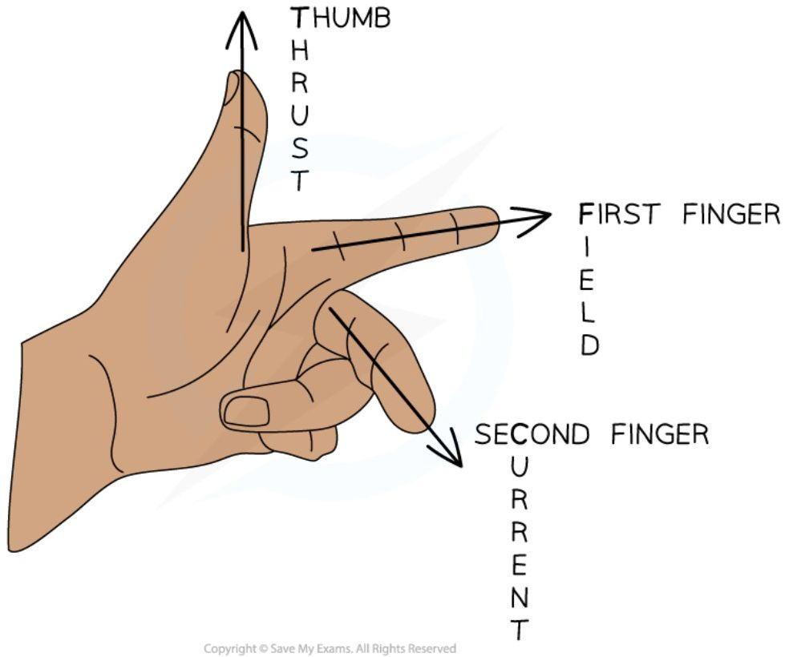

*Fleming’s left-hand rule can be used to determine the directions of the force, magnetic field and current*

!!! Worked Example

    A current-carrying wire is placed into the magnetic field between the poles of the magnet, as shown in the diagram.

    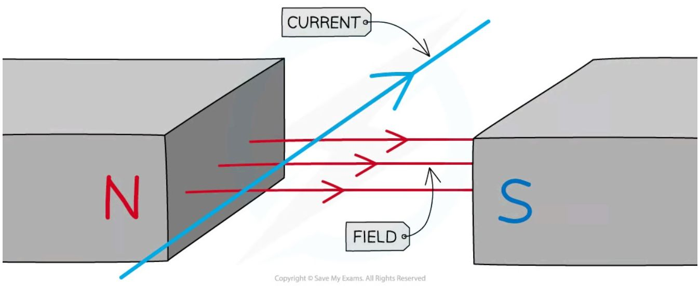

    Use Fleming’s left-hand rule to show that there will be a downward force acting on the wire.

    ??? note "Answer :"

        **Step 1: Determine the direction of the magnetic field**

        * Start by pointing your **F**irst **F**inger in the direction of the (magnetic) **F**ield

        **Step 2: Determine the direction of the current**

        * Now rotate your hand around the first finger so that the se**C**ond finger points in the direction of the **C**urrent

        **Step 3: Determine the direction of the force**

        * The **TH**umb will now be pointing in the direction of the **TH**rust (the force)

        * Therefore, this will be the direction in which the wire will move

        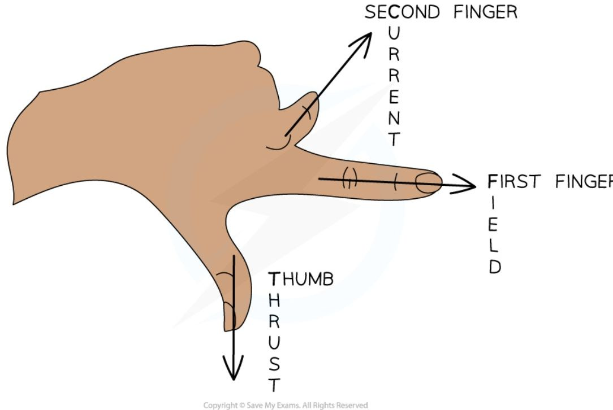

        

!!! tip "Examiner Tips and Tricks"

    Remember that the magnetic field is always in the direction from **North** to **South**.

    Feel free to use your hands when answering Fleming's left hand rule questions, just don't make it too obvious or distracting for other students!

### The D.C. motor

* The **motor effect** can be used to create a simple **d.c.** electric motor

  * The force on a current-carrying coil is used to make it **rotate** in a single direction

* The simple D.C. motor consists of a coil of wire (which is free to rotate) positioned in a **uniform magnetic field** * The coil of wire, when horizontal, forms a complete circuit with a cell

    * The coil is attached to a **split ring** (a circular tube of metal split in two)

    * This split ring is connected in a circuit with the cell via contact with conducting **carbon brushes**

**Forces on the horizontal coil in a D.C. motor**

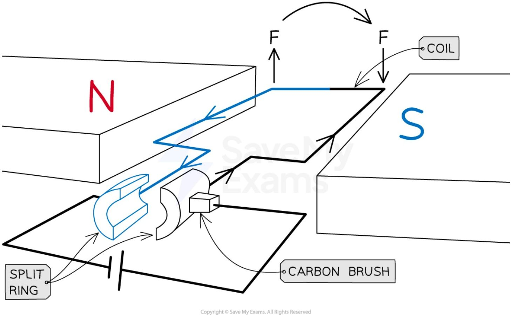

***Forces acting in opposite directions on each side of the coil, causing it to rotate. The split ring connects the coil to the flow of current***

* Current flowing through the coil produces a magnetic field

    * This magnetic field interacts with the uniform external field, so a **force** is exerted on the wire

* Forces act in opposite directions on each side of the coil, causing it to rotate:

    * On the blue side of the coil, current travels towards the cell so the force acts upwards (using **Fleming's left-hand rule**)

    * On the black side, current flows away from the cell so the force acts downwards

* Once the coil has rotated 90°, the split ring is **no longer in contact** with the brushes

    * No current flows through the coil so no forces act

**Coil in the vertical position**

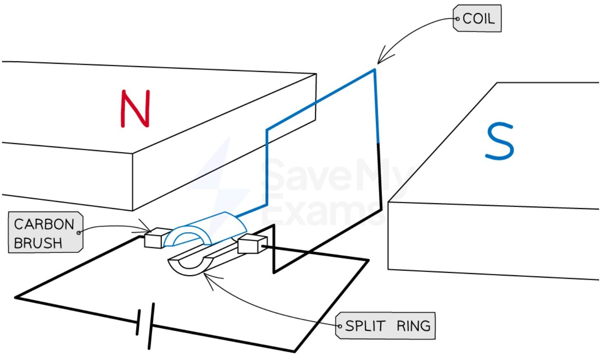

**No force acts on the coil when vertical, as the split ring is not in contact with the brushes**

* Even though no force acts, the momentum of the coil causes the coil to continue to rotate slightly

* The split ring reconnects with the carbon brushes and current flows through the coil again

    - Now the blue side is on the right and the black side is on the left

* Current still flows toward the cell on the left and away from the cell on the right, even though the coil has flipped

    - The black side of the coil experiences an upward force on the left and the blue side experiences a downward force on the right

    - The coil continues to rotate in the same direction, forming a continuously spinning motor

**Forces on the coil when rotated 180°**

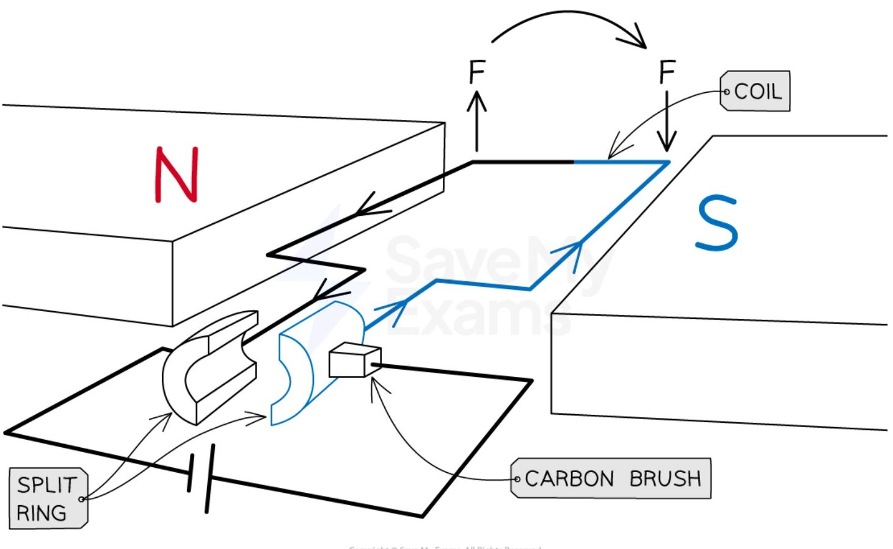

*Even though the coil has flipped, current still flows anticlockwise and the forces still cause rotation in the same direction*

#### Factors affecting the D.C. motor

* The **speed** at which the coil rotates can be increased by:

    * Increasing the **current**

    * Increasing the strength of the **magnetic field**

* The **direction of rotation** of coil in the D.C. motor can be changed by:

    * Reversing the direction of the **current**

    * Reversing the direction of the magnetic field by reversing the **poles** of the magnet

* The **force** supplied by the motor can be increased by:

    * Increasing the **current** in the coil

    * Increasing the strength of the **magnetic field**

    * Adding **more turns** to the coil

### Loudspeakers

* Loudspeakers and headphones convert electrical signals into sound

    * They work due to the **motor effect**

* They work in the opposite way to microphones

* A loudspeaker consists of a **coil of wire** which is wrapped around one pole of a **permanent magnet**

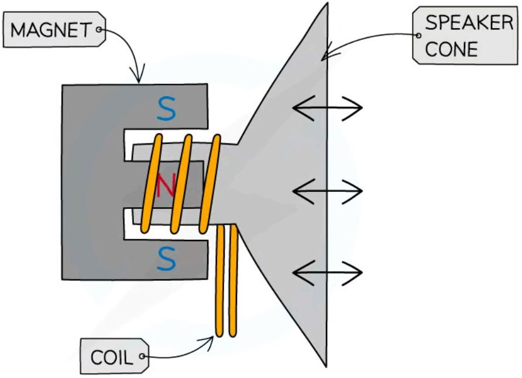

*Diagram showing a cross-section of a loudspeaker*

* An **alternating current** passes through the coil of the loudspeaker

    - This creates a **changing magnetic field** around the coil

* As the current is constantly changing direction, the direction of the magnetic field will be **constantly changing**

* The magnetic field produced around the coil **interacts** with the field from the permanent magnet

* The interacting magnetic fields will exert a **force** on the coil

    - The direction of the force at any instant can be determined using **Fleming’s left-hand rule**

* As the magnetic field is constantly changing direction, the **force** exerted on the coil will **constantly change direction**

    - This makes the coil **oscillate**

* The oscillating coil causes the speaker cone to oscillate

    - This makes the air oscillate, creating **sound waves**

!!! example "Worked Example"

    A d.c. motor is set up as shown below.

    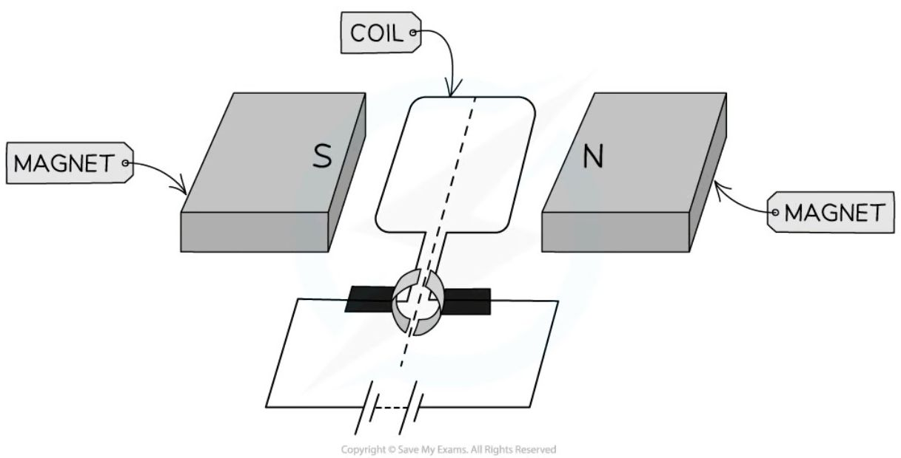

    Determine whether the coil will be rotating clockwise or anticlockwise.

    ??? note "Answer:"

        **Step 1: Draw arrows to show the direction of the magnetic field lines**

        * These will go from the north pole of the magnet to the south pole of the magnet

        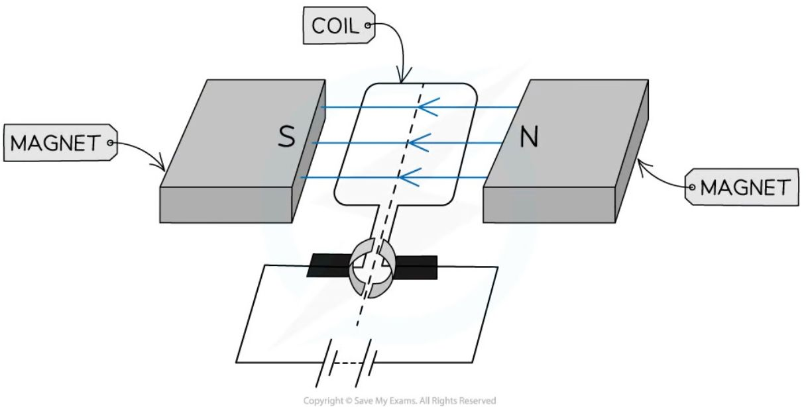

        **Step 2: Draw arrows to show the direction the current is flowing in the coils**

        * Current will flow from the positive terminal of the battery to the negative terminal

        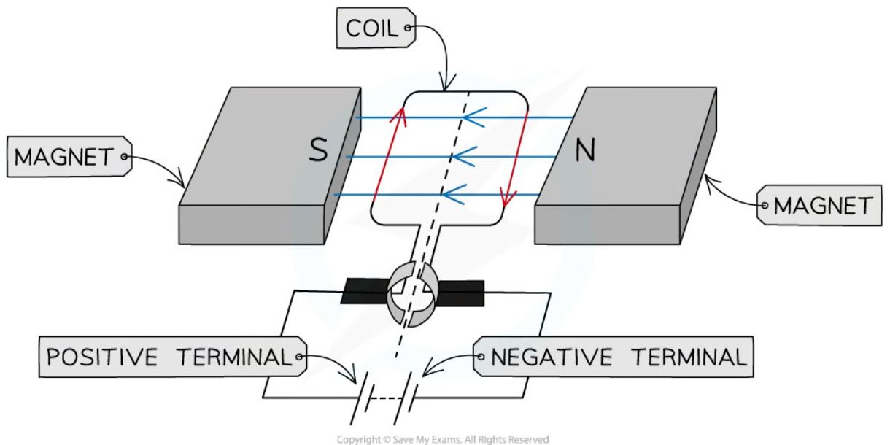

        **Step 3: Use Fleming’s left hand rule to determine the direction of the force on each side of the coil**

        * Start by pointing your **F**irst **F**inger in the direction of the (magnetic) **F**ield

        * Now rotate your hand around the first finger so that the se**C**ond finger points in the direction of the **C**urrent

        * The **TH**umb will now be pointing in the direction of the **TH**rust (the force)

        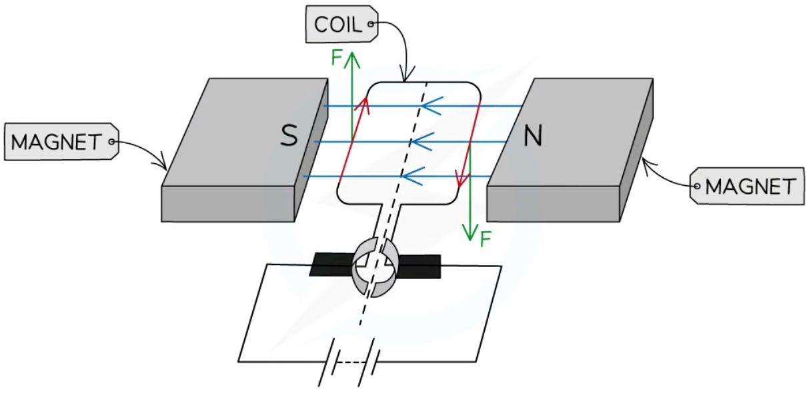

        **Step 4: Use the force arrows to determine the direction of rotation**

        * The coil will be turning **clockwise**

        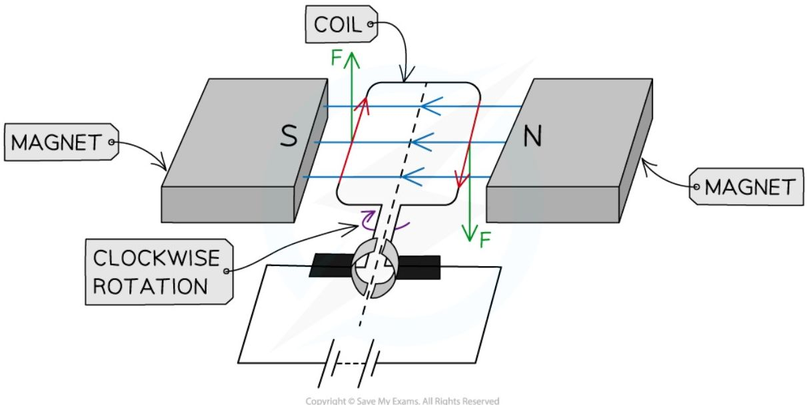

!!! tip "Examiner Tips and Tricks"

    It is important to remember all the steps that cause the rotation of the coil in a d.c. motor. Use Fleming's Left Hand rule to convince yourself of the direction of the force on each side of the coil, these should be in opposite directions because the directions of the current through each side are opposite.

    Additionally, don't be confused if you see the phrase 'split-ring commutator'. This is another way of referring to the split ring in the circuit and they mean the same thing.

    The explanation of the loudspeaker is very similar to the explanation of a motor, however **direct current** is used in a d.c motor and **alternating current** is used in a loudspeaker. You need to learn how both work.

    When explaining how a loudspeaker works remember to refer to the **alternating current** and the **changing magnetic field** that it creates.

## Magnetic Force on a moving Charge

* When a current-carrying wire is placed in a magnetic field, it will experience a force if the wire is perpendicular

    - This is because the magnetic field exerts a force on each individual electron flowing through the wire

* Therefore, when a charged particle passes through a magnetic field, the field can exert a **force** on the particle, causing it to **deflect**

    - The force is always at **90 degrees** to both the direction of travel and the magnetic field lines

    - The direction can be worked out by using **Fleming's left-hand rule**

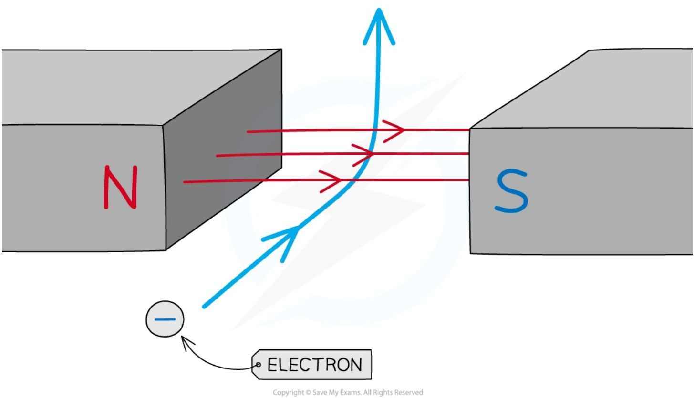

*The electron experiences a force upwards when it travels through the magnetic field between the two poles. Remember that conventional current flows in the opposite direction to electrons.*

* If the particle is travelling **perpendicular** to the field lines:

    - It will experience the **maximum** force

* If the particle is travelling **parallel** to the field lines:

    - It will experience **no** force

* If the particle is travelling at an **angle** to the field lines:

    - It will experience a **small** force

!!! tip "Examiner Tips and Tricks"

    Remember that the direction of current flow in Fleming's Left-Hand Rule is from **positive** to **negative**. This means it is in the **opposite** direction to the direction of travel of an electron (which is negatively charged)

