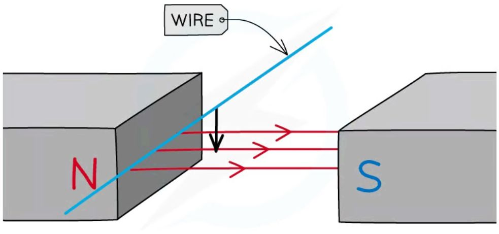
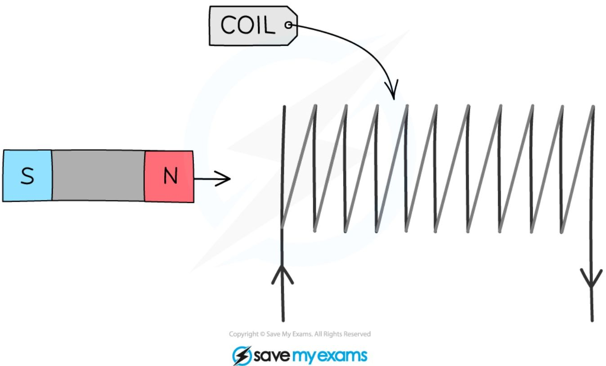
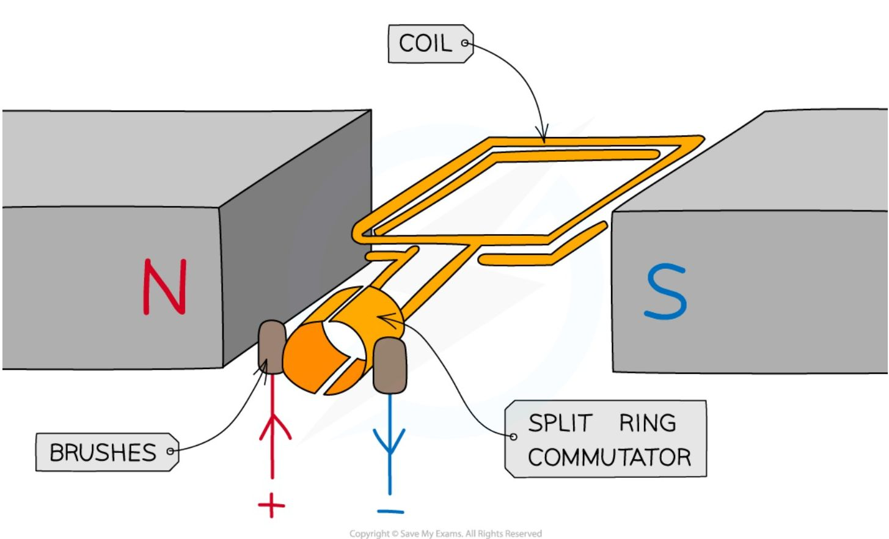
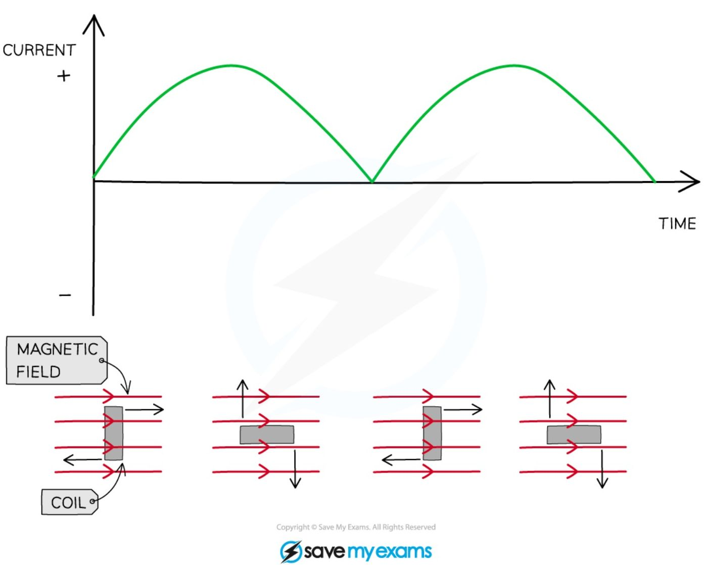

# Electromagnetic induction

## Definition

!!! abstract "Definition: Electromagnetic induction"
    Electromagnetic (EM) induction is used to generate electricity. **A voltage is induced in a conductor or a coil when it moves through a magnetic field, or when a magnetic field changes through it** — this happens because the conductor or coil **cuts through** the magnetic field lines.

This is often referred to as the **generator effect**, and is the opposite of the **motor effect**: in the motor effect, there is already a current in the conductor, which then experiences a force; in the generator effect, there is **no** initial current in the conductor, but one is induced (created) when it moves through a magnetic field. A potential difference is induced in the conductor whenever there is **relative movement** between the conductor and the magnetic field — this can happen either by moving the conductor through a fixed magnetic field, or by moving the magnetic field relative to a fixed conductor.

When a conductor (such as a wire) is moved through a magnetic field, the wire cuts through the field lines, inducing a potential difference in it.

*Moving an electrical conductor in a magnetic field to induce a potential difference*

When a magnet is moved through a coil instead, its field lines cut through the turns of the coil as it moves, again inducing a potential difference.

*When the magnet enters the coil, the field lines cut through the turns, inducing a potential difference*

A **sensitive voltmeter** can be used to measure the size of the induced potential difference. If the conductor is part of a **complete circuit**, a **current** is induced in it too.

## Factors affecting the induced potential difference

The **size** of the induced potential difference is determined by the speed at which the wire, coil or magnet is moved, the number of turns on the coil, the size of the coil, and the strength of the magnetic field. Its **direction** is determined by the orientation of the poles of the magnet. Each of these factors is examined below.

**Speed**: increasing the speed at which the wire, coil or magnet moves increases the rate at which the magnetic field lines are cut, which increases the induced potential difference.

**Number of turns**: increasing the number of turns on the coil, for a given length of wire, increases the potential difference induced — as does reducing the length of wire while keeping the number of turns the same. This is because each turn cuts through the magnetic field lines, and the total induced potential difference is the combined result of every turn cutting the field lines.

**Size of the coil**: increasing the area of the coil increases the potential difference induced, since there is then more wire to cut through the magnetic field lines.

**Strength of the magnetic field**: increasing the strength of the magnetic field increases the potential difference induced.

**Orientation of the poles**: reversing the direction of motion, or swapping the magnet's poles, reverses the direction of the induced p.d., but not its magnitude.

!!! tip "Examiner Tips and Tricks"
    When discussing factors affecting the induced potential difference, say "add more **turns** to the coil" rather than "add more coils" — these statements do not mean the same thing. Likewise, refer to "**a stronger magnet**" rather than "a bigger magnet", since larger magnets are not necessarily stronger.

## Examples of applications

When a coil of wire is **rotated** within a magnetic field, an electric **current** can be generated — this is known as **the generator effect**, and is how electricity is produced. The generator effect can be used to generate **a.c.** in a **generator**, or **d.c.** in a **dynamo**.

### Generators

A simple **alternator** is a type of generator that produces an **alternating current** (a.c.).

***An alternator is a rotating coil in a magnetic field with slip rings***

A rectangular coil is forced to spin in a **uniform magnetic field**. The coil is connected to a circuit containing a centre-reading meter, by **metal brushes** that press on two metal **slip rings** — the slip rings and brushes provide a **continuous connection** between the coil and the meter. As the coil turns, it **cuts through** the magnetic field lines, so an alternating **potential difference** is **induced** in the coil, producing an **alternating current**. Because of this, as the coil turns in one direction, the meter's pointer deflects first one way, then the opposite way, then back again.

An alternating current can also be produced when a **magnet rotates within a stationary coil** instead — both methods work on the same principle, that a p.d. is induced whenever a coil experiences a **changing** external magnetic field. The induced potential difference and current **alternate** because they repeatedly change direction.

<table>
  <thead>
    <tr>
        <th>Position</th>
        <th>Description</th>
    </tr>
  </thead>
  <tbody>
    <tr>
        <td>Position 1</td>
        <td>Coil is horizontal, cutting magnetic field lines at maximum rate; peak positive potential difference.</td>
    </tr>
    <tr>
        <td>Position 2</td>
        <td>Coil is vertical, moving parallel to field lines; zero potential difference.</td>
    </tr>
    <tr>
        <td>Position 3</td>
        <td>Coil is horizontal again but moving in opposite direction; peak negative potential difference.</td>
    </tr>
    <tr>
        <td>Position 4</td>
        <td>Coil is vertical again; zero potential difference.</td>
    </tr>
  </tbody>
</table>

*a.c output from an alternator - the current is both in the positive and negative region of the graph*

### Dynamos

A dynamo is a type of **generator** that produces a **direct current**. A simple dynamo is the **same** as an alternator, except that it has a **split-ring commutator** instead of two separate slip rings.

*A dynamo is a rotating coil in a magnetic field connected to a split ring commutator*

As the coil rotates, it **cuts** through the field lines, inducing a potential difference between the ends of the coil. The split-ring commutator changes the connections between the coil and the brushes every half turn — each time the coil is perpendicular to the magnetic field lines — so as to keep the current leaving the dynamo in the **same direction**. This means the induced potential difference **does not reverse** direction as it does in the alternator: instead, it varies from zero to a maximum value twice each cycle of rotation, and never changes polarity, so the current is always **positive** (or always **negative**).

*D.C output from a dynamo - the current is only in the positive region of the graph*

!!! tip "Examiner Tips and Tricks"

    Motors and generators look very similar, but they do very different things. When tackling a question on either of them, make sure you are writing about the right one!

    You are also expected to know that alternating current can be produced when a coil rotates in a magnetic field, or when a magnet rotates within a coil. The key is **relative motion** between the coil and the magnet.

??? info "Beyond the spec: induction chargers"
    Explain how a wireless (induction) charger transfers energy to a phone without any physical electrical contacts.

    An alternating current in the charging pad's coil produces a changing magnetic field. When a phone with a matching coil is placed on the pad, this changing field passes through the phone's coil and induces an alternating potential difference in it, which is used to charge the battery. This is the same principle as a transformer, except the two coils are separated by air instead of being linked by an iron core.

??? info "Beyond the spec: induction heaters"
    Explain how an induction hob heats a pan without the hob's surface itself becoming hot.

    A coil beneath the hob's surface carries a rapidly alternating current, producing a rapidly changing magnetic field. When a pan made from a magnetic material is placed on top, this changing field induces circulating currents directly within the metal of the pan. The pan's own electrical resistance converts these induced currents into heat, so it is the pan itself that heats up, not the hob's surface.

??? info "Beyond the spec: microphones"
    Explain how a microphone converts sound into an electrical signal.

    A microphone works on the opposite principle to a loudspeaker. Sound waves striking a diaphragm attached to a coil make it vibrate within a magnetic field. This relative motion between the coil and the field induces a changing potential difference in the coil, which forms the electrical signal representing the sound.
