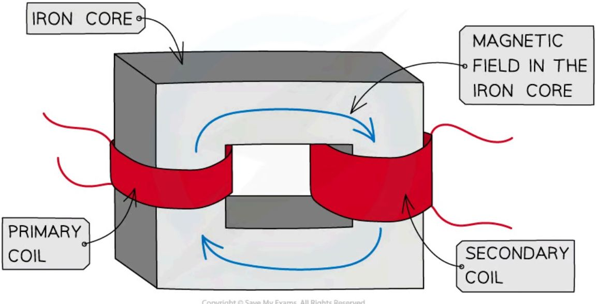

# Transformers

## How a transformer works

* A transformer is a device used to **change** the value of an **alternating potential difference** or **current**

* This is achieved using **induction**

* A basic transformer consists of:

    * A **primary coil**

    * A **secondary coil**

    * An **iron core**

* Iron is used because it is easily **magnetised**

*Structure of a transformer*

* An **alternating current** is supplied to the **primary coil**

* The **current** is continually **changing direction**

    * This means it will produce a **changing magnetic field** around the primary coil

* The iron core is **easily magnetised**, so the changing magnetic field passes through it

* As a result, there is now a **changing magnetic field** inside the **secondary coil**

    * This changing field **cuts** through the secondary coil and **induces a potential difference**

* As the magnetic field is continually changing the potential difference induced will be **alternating**

* The alternating potential difference will have the same **frequency** as the alternating current supplied to the primary coil

* If the secondary coil is part of a **complete circuit** it will cause an **alternating current** to flow

* A transformer can change the **size** of an alternating voltage

* They also have a number of other roles, such as:

    - To increase the potential difference of electricity before it is transmitted across the national grid

    - To lower the high voltage electricity used in power lines to the lower voltages used in houses

    - Used in adapters to lower mains voltage to the lower voltages used by many electronic devices

* A **step-up** transformer **increases the potential difference** of a power source.

    - A step-up transformer has **more** turns on the secondary coil than on the primary coil

* A **step-down** transformer **decreases the potential difference** of a power source.

    - A step-down transformer has **fewer** turns on the secondary coil than on the primary coil

## Transformer Equations

### The transformer equation

* The **output potential difference** (voltage) of a transformer depends on:

    - The **number of turns** on the primary and secondary coils

    - The **input potential difference** (voltage)

* It can be calculated using the transformer equation below:

$$ \frac{\text{potential difference across primary coil}}{\text{potential difference across secondary coil}} = \frac{\text{number of turns on primary coil}}{\text{number of turns on secondary coil}} $$

* This equation for transformers can be written using symbols as follows:

$$ \frac{V_p}{V_s} = \frac{n_p}{n_s} $$

* Where

    - $V_p$ = potential difference (voltage) across the primary coil in volts (V)

    - $V_s$ = potential difference (voltage) across the secondary coil in volts (V)

    - $n_p$ = number of turns on primary coil

    - $n_s$ = number of turns on secondary coil

* The transformer equation above can be flipped upside down to give:

$$ \frac{V_s}{V_p} = \frac{n_s}{n_p} $$

* The equations above show that:

    - The **ratio** of the potential differences across the primary and secondary coils of a transformer is **equal** to the ratio of the number of turns on each coil

* A step-up transformer **increases** the **potential difference** of a power source

* A step-up transformer has **more turns** on the **secondary coil** than on the primary coil (Ns > Np)

* A step-down transformer **decreases** the **potential difference** of a power source

* A step-down transformer has **fewer turns** on the **secondary coil** than on the primary coil (Ns < Np)

!!! example "Worked Example"

    A transformer has 20 turns on the primary coil and 800 turns on the secondary coil. The input potential difference across the primary coil is 500 V.

    a) Calculate the output potential difference

    b) State what type of transformer it is

    ??? note "Answer (Part a):"

        Step 1: List the known quantities

        * Number of turns in primary coil, $N_p = 20$
        * Number of turns in secondary coil, $N_s = 800$
        * Voltage in primary coil, $V_p = 500\text{ V}$

        Step 2: Write out the transformer equation

        * Use the version with the secondary coil quantities on the top to minimise the amount of rearranging

        $$ \frac{N_s}{N_p} = \frac{V_s}{V_p} $$

        Step 3: Rearrange for $V_s$

        $$ V_s = \frac{N_s}{N_p} \times V_p $$

        Step 4: Substitute values into the equation

        $$ V_s = \frac{800}{20} \times 500 = 20\ 000\text{ V} $$

    ??? note "Answer (Part b):"

        * The transformer is a **step-up** transformer
        * This is because the transformer has:
            - More secondary coils
            - A greater secondary voltage

!!! tip "Examiner Tips and Tricks"

    When you are using the transformer equation make sure you have used the same letter (p or s) in the **numerators** (top line) of the fraction and the same letter (p or s) in the **denominators** (bottom line) of the fraction. There will be less rearranging to do in a calculation if the variable which you are trying to find is on the numerator (top line) of the fraction. The individual loops of wire going around each side of the transformer should be referred to as turns and not coils.

### The ideal transformer equation

* An **ideal** transformer would be **100% efficient**

    - Although transformers can increase the voltage of a power source, due to the **law of conservation of energy**, they cannot increase the power output

* If a transformer is 100% efficient:

$$ \text{Input power} = \text{Output power} $$

* The equation to calculate electrical power is:

$$ P = V \times I $$

* Where:

    - $P$ = power in Watts (W)

    - $V$ = potential difference in volts (V)

    - $I$ = current in amps (A)

* Therefore, if a transformer is 100% efficient then:

$$ V_{p} \times I_{p} = V_{s} \times I_{s} $$

* Where:

    - $V_{p}$ = potential difference across primary coil in volts (V)

    - $I_{p}$ = current through primary coil in Amps (A)

    - $V_{s}$ = potential difference across secondary coil in volts (V)

    - $I_{s}$ = current through secondary coil in Amps (A)

* The equation above could also be written as:

$$ P_{s} = V_{p} \times I_{p} $$

* Where:

    - $P_{s}$ = output power (power produced in the secondary coil) in Watts (W)

!!! example "Worked Example"

A transformer in a travel adapter steps up a 115 V ac mains electricity supply to the 230 V needed for a hair dryer. A current of 5 A flows through the hairdryer. Assuming that the transformer is 100% efficient, calculate the current drawn from the mains supply.

??? note "Answer :"

    **Step 1: List the known quantities**

    *   Voltage in primary coil, $V_p = 115\text{ V}$

    *   Voltage in secondary coil, $V_s = 230\text{ V}$

    *   Current in secondary coil, $I_s = 5\text{ A}$

    **Step 2: Write the equation linking the known values to the current drawn from the supply, $I_p$**

    $$V_p \times I_p = V_s \times I_s$$

    **Step 3: Substitute in the known values**

    $$115 \times I_p = 230 \times 5$$

    **Step 4: Rearrange the equation to find $I_p$**

    $$I_p = \frac{230 \times 5}{115}$$

    **Step 5: Calculate a value for $I_p$ and include the correct unit**

    $$I_p = 10\text{ A}$$

## Transformers in electricity transmission

* Electricity is transmitted through power cables at a low current to prevent dissipation of energy

    - When current flows in a wire, there is heating in the wire due to resistance

    - Therefore, energy is dissipated to the surroundings, this energy is wasted

    - The lower the current, the more efficient the energy transfer

* When electricity is transmitted over large distances, the **current** in the wires **heats** them, resulting in **energy loss**

* The electrical energy is transferred at **high voltages** from power stations

* It is then transferred at **lower voltages** in each locality for domestic uses

* The voltage must be stepped up by a **step-up** transformer

    - These are placed **after the power station**

* For the domestic use of electricity, the voltage must be much lower

* This is done by stepping down by the voltage using a **step-down** transformer

    * These are placed **before buildings**

*Electricity is transmitted at high voltage, reducing the current and hence power loss in the cables using transformers*

!!! tip "Examiner Tips and Tricks"

    Electrical power is equal to voltage × current, or $$P = IV$$

    This means that a low current can be achieved for the same power output by increasing the voltage

    * A **smaller current** flowing through the power lines results in **less heating** in the wire

    * This **reduces** the **energy loss** in the power cables

    * The key **advantages** of high-voltage transmission of electricity are:

        * the reduced power loss in transmission cables increases the efficiency of energy transfer

        * lower currents in cables mean thinner, and therefore, cheaper cables can be used
