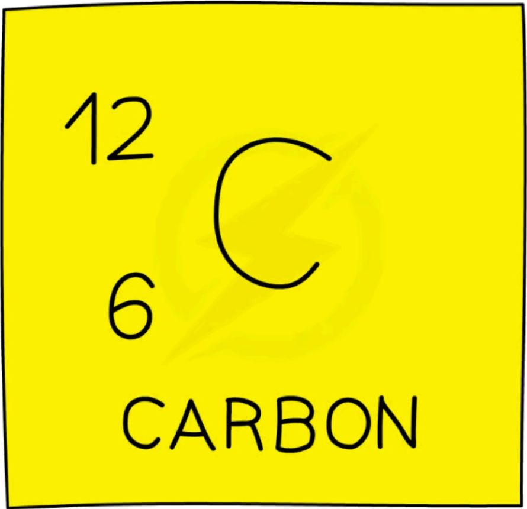
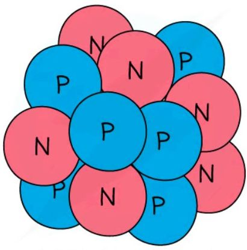
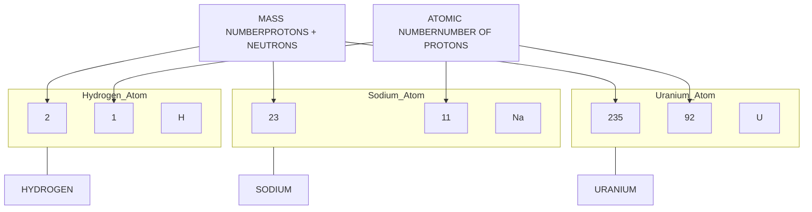
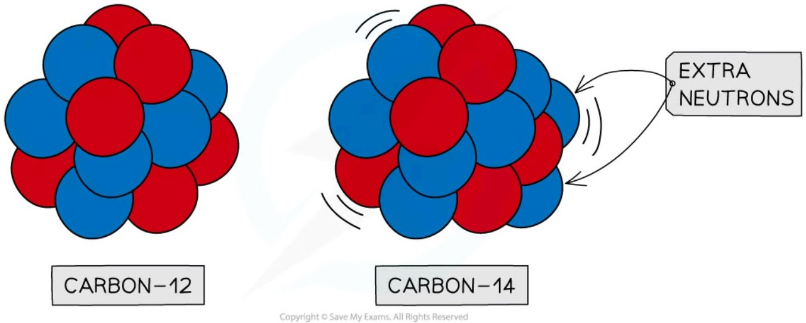
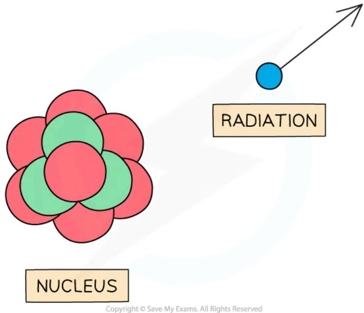
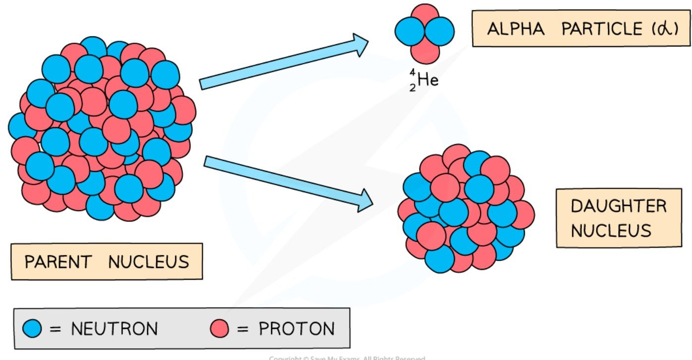
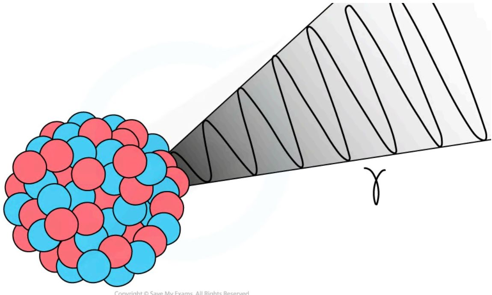
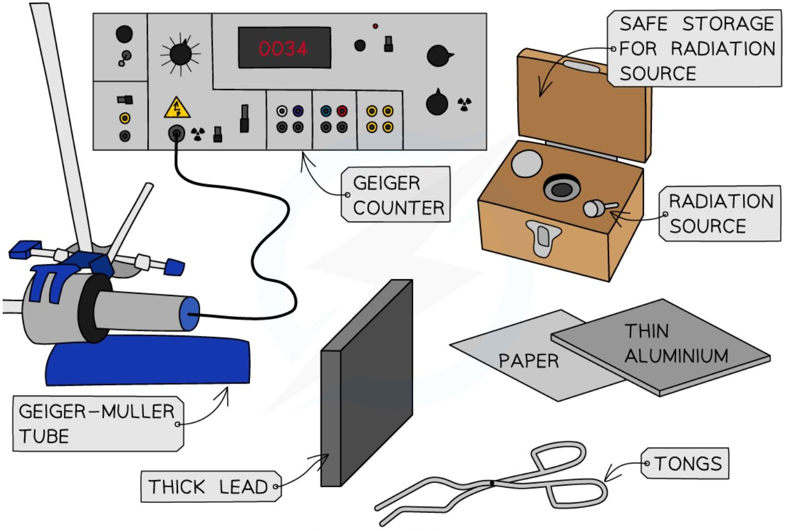
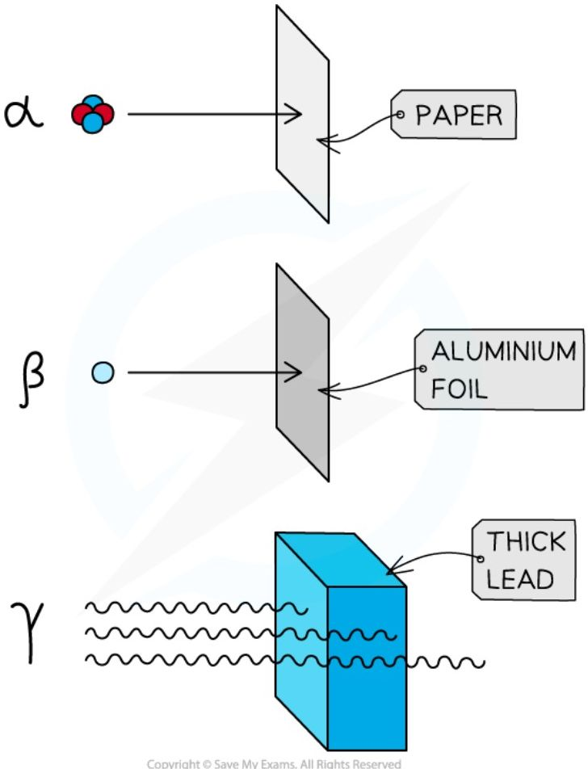

# Atomic structure and nuclear radiation

## Atomic structure

### Structure of atoms

Atoms are the building blocks of **all matter**. They are incredibly small, with a radius of only 1 × 10<sup>-10</sup> m — about one hundred million atoms could fit side by side across your thumbnail. Atoms have a tiny, dense **nucleus** at their centre, with **electrons** orbiting around it: the radius of the nucleus is over 10,000 times smaller than the whole atom, but it contains almost **all of the mass** of the atom.

**Atomic structure of lithium**

<table>
  <thead>
    <tr>
        <th>Particle</th>
        <th>Description</th>
    </tr>
  </thead>
  <tbody>
    <tr>
        <td>Red circle</td>
        <td>= PROTON</td>
    </tr>
    <tr>
        <td>Green circle</td>
        <td>= NEUTRON</td>
    </tr>
    <tr>
        <td>Blue circle</td>
        <td>= ELECTRON</td>
    </tr>
  </tbody>
</table>

*Diagram showing the structure of a Lithium atom. If drawn to scale then the electrons would be around 100 metres away from the nucleus!*

### Particles in the atom

The nucleus contains **protons** — positively charged particles with a relative atomic mass of one unit — and **neutrons**, which have no charge, but also a relative mass of one unit. Almost all of the rest of the atom is empty space, with **electrons** — negative charge, and almost no mass (1/2000 the mass of a proton or neutron) — moving around the nucleus. The properties of each particle are shown in the table below:

**Table of particle properties**

<table>
  <thead>
    <tr>
        <th>Particle</th>
        <th>Location</th>
        <th>Relative charge</th>
        <th>Relative mass</th>
    </tr>
  </thead>
  <tbody>
    <tr>
        <td>proton</td>
        <td>in the nucleus</td>
        <td>+1</td>
        <td>1</td>
    </tr>
    <tr>
        <td>neutron</td>
        <td>in the nucleus</td>
        <td>0</td>
        <td>1</td>
    </tr>
    <tr>
        <td>electron</td>
        <td>orbiting the nucleus</td>
        <td>-1</td>
        <td>1/2000 (negligible)</td>
    </tr>
  </tbody>
</table>

### Charge in the atom

Although atoms contain particles of different charge, the total **charge** within an atom is **zero**, because the number of **electrons** is always **equal** to the number of **protons**. The table below sets out this calculation for the lithium atom shown above:

**Calculating total charge table**

<table>
  <thead>
    <tr>
        <th>Particle</th>
        <th>Relative charge</th>
        <th>Number of particles in lithium atom</th>
        <th>number × relative charge</th>
        <th>Total charge</th>
    </tr>
  </thead>
  <tbody>
    <tr>
        <td>proton</td>
        <td>+1</td>
        <td>3</td>
        <td>+3</td>
        <td rowspan="3">(+3) + 0 + (−3)<br/>= 0</td>
    </tr>
    <tr>
        <td>neutron</td>
        <td>0</td>
        <td>4</td>
        <td>0</td>
    </tr>
    <tr>
        <td>electron</td>
        <td>−1</td>
        <td>3</td>
        <td>−3</td>
    </tr>
  </tbody>
</table>

If an atom loses electrons, it is said to be **ionised**. Particular nuclei are described using their element symbol, atomic number and mass number — this notation is called **nuclear notation**.



*Carbon 12 in nuclear notation*

!!! example "Worked Example (calculation)"

    A nucleus of carbon-12 is shown below.

    

    How many electrons are there in an atom of carbon-12?

    ??? success "Answer:"

        **Step 1: Count the number of protons in the carbon nucleus**

        There are 6 protons in the carbon atom.

        **Step 2: Determine the number of electrons**

        The number of electrons in an atom is **equal** to the number of protons, so there must be **6** electrons in the carbon atom.

!!! tip "Examiner Tips and Tricks"

    You may have noticed that the number of electrons is not part of the mass number. This is because electrons have a **tiny** mass compared to neutrons and protons. We say their mass is negligible when compared to the particles in the nucleus.

## Describing a nucleus

### Atomic number

The number of protons in an atom is called its **atomic number** (also called the **proton number**). Elements in the periodic table are ordered by their atomic number, so the number of protons determines which element an atom is. The atomic number of a particular element is always the same: hydrogen has an atomic number of 1 (it always has just one proton), sodium has an atomic number of 11 (11 protons), and uranium has an atomic number of 92 (92 protons). The atomic number is also equal to the number of electrons in an atom, since atoms have the same number of electrons and protons in order to have no overall charge.

### Mass number

The total number of particles in the nucleus of an atom is called its **mass number** (also called the **nucleon number**) — the number of protons **and** neutrons in the atom. The number of neutrons can be found by **subtracting** the atomic number from the mass number:

$$\text{number of neutrons} = \text{mass number} - \text{atomic number}$$

For example, if a sodium atom has a mass number of 23 and an atomic number of 11, its number of neutrons is $23 - 11 = 12$.

### Nuclear notation

The mass number and atomic number of an atom are shown by writing them with the atomic symbol — this is called **nuclear notation**. Here are three examples:



*Examples of nuclear notation for atoms of Hydrogen, Sodium and Uranium*

The top number is the **mass number** — equal to the total number of particles (protons and neutrons) in the nucleus. The lower number is the **atomic number** — equal to the total number of protons in the nucleus.

**Number of protons, neutrons and electrons in each example atom**

<table>
  <thead>
    <tr>
        <th>Atom</th>
        <th>Number of protons<br/>(atomic number)</th>
        <th>Number of neutrons<br/>(mass number – atomic number)</th>
        <th>Number of electrons<br/>(same as atomic number)</th>
    </tr>
  </thead>
  <tbody>
    <tr>
        <td>hydrogen</td>
        <td>1</td>
        <td>1</td>
        <td>1</td>
    </tr>
    <tr>
        <td>sodium</td>
        <td>11</td>
        <td>12</td>
        <td>11</td>
    </tr>
    <tr>
        <td>uranium</td>
        <td>92</td>
        <td>143</td>
        <td>92</td>
    </tr>
  </tbody>
</table>

!!! example "Worked Example (multiple choice)"

    The element symbol for gold is <sup>197</sup><sub>79</sub>Au.

    How many protons, neutrons and electrons are in an atom of gold?

    <table>
    <tbody>
        <tr>
            <td> </td>
            <td>number of protons</td>
            <td>number of neutrons</td>
            <td>number of electrons</td>
        </tr>
        <tr>
            <td>A.</td>
            <td>79</td>
            <td>79</td>
            <td>79</td>
        </tr>
        <tr>
            <td>B.</td>
            <td>197</td>
            <td>79</td>
            <td>118</td>
        </tr>
        <tr>
            <td>C.</td>
            <td>118</td>
            <td>118</td>
            <td>79</td>
        </tr>
        <tr>
            <td>D.</td>
            <td>79</td>
            <td>118</td>
            <td>79</td>
        </tr>
    </tbody>
    </table>

    ??? success "Answer: D"

        **Step 1: Determine the atomic and mass number**

        The gold atom has an atomic number of 79 (lower number) and a mass number of 197 (top number).

        **Step 2: Determine the number of protons**

        The **atomic** number is equal to the number of **protons**, so an atom of gold has 79 protons.

        **Step 3: Calculate the number of neutrons**

        The mass number is equal to the number of protons and neutrons, so the number of neutrons is equal to the mass number minus the atomic number: $197 - 79 = 118$. An atom of gold has 118 neutrons.

        **Step 4: Determine the number of electrons**

        An atom has the **same** number of **protons and electrons**, so an atom of gold has 79 electrons.

## Isotopes

For a particular element, the number of protons is always the same, but the number of neutrons can be different — this is because the number of protons is what determines the element (e.g. carbon atoms always have 6 protons, and iron atoms always have 26). Each element can have more than one isotope.

!!! abstract "Definition: Isotope"
    An isotope is **an atom, or atoms, of the same element that have an equal number of protons but a different number of neutrons**.

**Isotopes of hydrogen**

<table>
  <thead>
    <tr>
        <th>ISOTOPE</th>
        <th>ATOMIC STRUCTURE</th>
        <th>SYMBOL</th>
    </tr>
  </thead>
  <tbody>
    <tr>
        <td>HYDROGEN — 1</td>
        <td>0 NEUTRONS<br/>1 ELECTRON<br/>1 PROTON</td>
        <td><sup>1</sup><sub>1</sub>H</td>
    </tr>
    <tr>
        <td>HYDROGEN — 2</td>
        <td>1 NEUTRON<br/>1 ELECTRON<br/>1 PROTON</td>
        <td><sup>2</sup><sub>1</sub>H</td>
    </tr>
    <tr>
        <td>HYDROGEN — 3</td>
        <td>2 NEUTRONS<br/>1 ELECTRON<br/>1 PROTON</td>
        <td><sup>3</sup><sub>1</sub>H</td>
    </tr>
  </tbody>
</table>

Some isotopes are more **unstable** than others, due to the imbalance of protons and neutrons — they may be more likely to **decay**, and less likely to occur naturally. For example, about 2 in every 10 000 atoms of hydrogen are the isotope deuterium, and the isotope tritium is even rarer (about 1 in every billion billion atoms of hydrogen).

!!! example "Worked Example (calculation)"

    State the number of protons, neutrons and electrons in these two isotopes of chlorine:

    $$ {}^{35}_{17}\text{Cl}, {}^{37}_{17}\text{Cl} $$

    ??? success "Answer:"

        **Step 1: Determine the number of protons**

        The atomic number is the number of protons: both chlorine-35 and chlorine-37 have 17 protons.

        **Step 2: Determine the number of neutrons**

        The mass number is the number of protons and neutrons: chlorine-35 has $35 - 17 = 18$ neutrons, and chlorine-37 has $37 - 17 = 20$ neutrons.

        **Step 3: Determine the number of electrons**

        The number of electrons is equal to the number of protons: both chlorine-35 and chlorine-37 have 17 electrons.

## Nuclear radiation

### Unstable isotopes

Some atomic nuclei are **unstable** and **radioactive**, because of an imbalance of protons or neutrons in the nucleus. Carbon-14 is an example of an **isotope** of carbon which is **unstable**, because it has two extra neutrons compared to a stable nucleus of carbon-12.

**Stable and unstable isotopes of carbon**



*Carbon-12 is stable, whereas carbon-14 is unstable because it has two extra neutrons*

Unstable nuclei can **emit radiation** to become more stable — radiation can be in the form of a high-energy particle or wave. This process is known as **radioactive decay**: as the radiation moves away from the nucleus, it takes some energy with it, making the nucleus more **stable**.



*Unstable nuclei decay by emitting high energy particles or waves*

When an unstable nucleus decays, it emits **radiation**. The different types of radiation that can be emitted are **alpha (α)** particles, **beta (β<sup>-</sup>)** particles, and **gamma (γ)** radiation. These changes are **spontaneous** and **random**.

!!! example "Worked Example (multiple choice)"

    Which of the following statements is **not** true?

    **A** Isotopes can be unstable because they have too many or too few neutrons

    **B** The process of emitting particles or waves of energy from an unstable nucleus is called radioactive decay

    **C** Scientists can predict when a nucleus will decay

    **D** Radiation refers to the particles or waves emitted from a decaying nucleus

    ??? success "Answer: C"

        Answer A is **true**: the number of neutrons in a nucleus determines its stability. Answer B is **true**: this is a suitable description of radioactive decay. Answer D is **true**: radiation refers to the emissions themselves, which is different from the radioactive particles.

        Answer C is **not true**: radioactive decay is a random process, so it is not possible to predict precisely when a particular nucleus will decay.

!!! tip "Examiner Tips and Tricks"

    The terms **unstable**, **random** and **decay** have very particular meanings in this topic. Remember to use them correctly when answering questions!

### Properties of alpha, beta and gamma radiation

Alpha (α), beta (β) and gamma (γ) radiation can be identified by their **nature** (what type of particle or radiation they are), their **ionising ability** (how easily they **ionise** other atoms), and their **penetrating power** (how far they can travel before they are stopped completely). Alpha, beta and gamma **penetrate** materials in different ways, so they are stopped, or reduced, by different materials.

#### Alpha particles

The symbol for alpha is **α**. An alpha particle is the same as a helium nucleus, since it consists of two protons and two neutrons.

#### Beta particles

The symbol for beta is **β<sup>−</sup>**. Beta particles are high-energy electrons, produced in nuclei when a neutron changes into a proton and an electron.

#### Gamma rays

The symbol for gamma is **γ**. Gamma rays are electromagnetic waves, with the highest energy of the different types of electromagnetic wave.

**Penetrating power of alpha, beta and gamma**

<table>
  <thead>
    <tr>
        <th>Radiation Type</th>
        <th>PAPER</th>
        <th>FEW mm ALUMINIUM</th>
        <th>FEW mm LEAD</th>
    </tr>
  </thead>
  <tbody>
    <tr>
        <td>ALPHA PARTICLES</td>
        <td>Stopped</td>
        <td> </td>
        <td> </td>
    </tr>
    <tr>
        <td>BETA PARTICLES</td>
        <td>Passes through</td>
        <td>Stopped</td>
        <td> </td>
    </tr>
    <tr>
        <td>GAMMA RAYS</td>
        <td>Passes through</td>
        <td>Passes through</td>
        <td>Partially stopped</td>
    </tr>
  </tbody>
</table>

*Alpha, beta and gamma are different in how they penetrate materials. Alpha is the least penetrating, and gamma is the most penetrating*

Alpha is stopped by **paper**, whereas beta and gamma pass through it. Beta is stopped by a few millimetres of aluminium. Gamma rays can pass through **aluminium**, but are only partially stopped by thick **lead**.

#### Summary of the properties of nuclear radiation

<table>
  <thead>
    <tr>
        <th>Particle</th>
        <th>Nature</th>
        <th>Range in air</th>
        <th>Penetrating power</th>
        <th>Ionising ability</th>
    </tr>
  </thead>
  <tbody>
    <tr>
        <td>Alpha (α)</td>
        <td>helium nucleus (2 protons, 2 neutrons)</td>
        <td>a few cm</td>
        <td>low; stopped by a thin sheet of paper</td>
        <td>high</td>
    </tr>
    <tr>
        <td>Beta (β)</td>
        <td>high-energy electron</td>
        <td>a few 10s of cm</td>
        <td>moderate; stopped by a few mm of aluminium foil or Perspex</td>
        <td>moderate</td>
    </tr>
    <tr>
        <td>Gamma (γ)</td>
        <td>electromagnetic wave</td>
        <td>infinite</td>
        <td>high; reduced by a few cm of lead</td>
        <td>low</td>
    </tr>
  </tbody>
</table>

!!! example "Worked Example (multiple choice)"

    A student has an unknown radioactive source. They are trying to work out which type of ionising radiation is being emitted.

    They measure the count rate, using a Geiger-Muller tube, when the source is placed behind different materials. Their results are recorded in a table.

    <table>
    <thead>
        <tr>
            <th> </th>
            <th>no material<br/>between<br/>source and<br/>detector</th>
            <th>thin sheet of<br/>paper between<br/>source and<br/>detector</th>
            <th>5 mm aluminium<br/>foil between<br/>source and<br/>detector</th>
            <th>5mm lead<br/>plate between<br/>source and<br/>detector</th>
        </tr>
    </thead>
    <tbody>
        <tr>
            <td>Count-rate</td>
            <td>4320</td>
            <td>4318</td>
            <td>256</td>
            <td>244</td>
        </tr>
    </tbody>
    </table>

    Which type(s) of ionising radiation is/are emitted by the source?

    **A** Alpha particles

    **B** Beta particles

    **C** Gamma rays

    **D** Alpha, beta and gamma radiation

    ??? success "Answer: B"

        The answer is not **A** or **D**, because the radiation passed through the paper almost unchanged, so it is not alpha (alpha is stopped by a thin sheet of paper) — it is usual to find some variance between readings, so look for a *significant* change. The answer is not **C**, because the lead plate did not decrease the count rate significantly.

        It was the aluminium that decreased the count rate significantly: beta particles are blocked by a few mm of aluminium, so the source must be emitting **beta particles**.

!!! tip "Examiner Tips and Tricks"

    Students often get confused about whether **beta particles** can pass though **aluminium foil**. Beta particles **can be stopped** by aluminium foil if it is thick enough (**a few mm** thick); if the foil is thin enough, they can pass through. This is the basis of using beta radiation to measure the thickness of aluminium foil (a common exam question!). The thicker the foil, the fewer beta particles pass through and are measured by a detector on the other side of the foil.

### Decay equations

#### Alpha decay

During alpha decay, an alpha particle is emitted from an unstable nucleus, and a completely new **element** is formed in the process.



*Alpha decay usually happens in large unstable nuclei, causing the overall mass and charge of the nucleus to decrease*

An alpha particle is a **helium nucleus**, made of 2 protons and 2 neutrons. When it is emitted from the unstable nucleus, the mass number of the nucleus **decreases** by 4, and the atomic number **decreases** by 2.

!!! note "Required formulae: alpha decay"
    $${^A_Z}X \rightarrow {^{A-4}_{Z-2}}Y + {^4_2}\alpha$$

    Where ${^A_Z}X$ is the initial element X with mass number A and atomic number Z, ${^{A-4}_{Z-2}}Y$ is the new element Y, and $^{4}_{2}\alpha$ is an alpha particle.

#### Beta decay

During **beta** decay, a **neutron** changes into a **proton** and an **electron**: the electron is **emitted**, and the proton **remains** in the nucleus. A completely new element is formed, because the **atomic number** changes.

```mermaid
graph LR
    N(( )) -- " " --> P(( ))
    N -- " " --> E(( ))
    subgraph NEUTRON_BOX [NEUTRON]
        N
    end
    subgraph PROTON_BOX [PROTON]
        P
    end
    subgraph ELECTRON_BOX [ELECTRON(BETA MINUS PARTICLE)]
        E
    end
    style N fill:#90EE90,stroke:#000
    style P fill:#FF7F7F,stroke:#000
    style E fill:#00BFFF,stroke:#000
    style NEUTRON_BOX fill:none,stroke:#000
    style PROTON_BOX fill:none,stroke:#000
    style ELECTRON_BOX fill:#FFE4B5,stroke:#000
```

$$n \rightarrow p + e^{-}$$

***Beta decay often happens in unstable nuclei that have too many neutrons. The mass number stays the same, but the atomic number increases by one***

A beta particle is a high-speed **electron**. It has a mass number of 0, since the electron has a negligible mass compared to neutrons and protons, so the **mass number** of the decaying nucleus **remains the same**. Electrons have an atomic number of -1, meaning the atomic number of the new nucleus **increases by 1**, to balance the overall atomic number before and after the decay.

!!! note "Required formulae: beta decay"
    $$ ^{A}_{Z}X \rightarrow \text{ }^{A}_{Z+1}Y + \text{ }^{0}_{-1}\beta $$

    Where $^{A}_{Z}X$ is the initial element X with mass number A and atomic number Z, $^{A}_{Z+1}Y$ is the new element Y, and $^{0}_{-1}\beta$ is a beta particle.

#### Gamma decay

During gamma decay, a gamma ray is emitted from an unstable nucleus. This process makes the nucleus less energetic, but does not change its structure.



***Gamma decay does not affect the mass number or the atomic number of the radioactive nucleus, but it does reduce the energy of the nucleus***

The gamma ray that is emitted has a lot of energy, but no mass or charge.

!!! note "Required formulae: gamma decay"
    $$ {^A_Z}X \rightarrow {^A_Z}X + {^0_0}\gamma $$

    Where ${^A_Z}X$ is the element X with mass number A and atomic number Z, and ${^0_0}\gamma$ is a gamma ray. Notice that the mass number and atomic number of the unstable nucleus remain the same during the decay.

#### Neutron emission

A small number of isotopes can decay by emitting neutrons. When a nucleus emits a neutron, the atomic number (number of protons) does **not** change, but the mass number (total number of nucleons) **decreases by 1**.

!!! note "Required formulae: neutron emission"
    $$ {^A_Z}X \rightarrow {^{A-1}_Z}X + {^1_0}n $$

    Where $^{A}_{Z}X$ is the element X with mass number A and atomic number Z, and $^{1}_{0}n$ is a neutron. Notice that the atomic number remains the **same** during the decay, but the mass number has changed — meaning an **isotope** of the original element has formed.

!!! tip "Examiner Tips and Tricks"

    It is easy to forget that an alpha particle **is** a helium nucleus. The two are interchangeable, so don't be surprised to see either used in the exam.

    You are not expected to know the names of the elements produced during radioactive decays, but you do need to be able to calculate the mass and atomic numbers by making sure they are balanced on either side of the reaction.

#### Nuclear decay equations

Radioactive decay events can be shown using **nuclear decay equations**, similar to a chemical reaction equation: the particles present before the decay are shown **before** the arrow, and the particles produced are shown **after** it. In a decay equation, the sum of the mass numbers **before** and **after** the reaction must be the **same**, and the sum of the atomic numbers **before** and **after** the reaction must also be the **same**.

The following decay equation shows polonium-212 undergoing alpha decay:

$$ ^{212}_{84}Po \rightarrow ^{208}_{82}Pb + ^{4}_{2}\alpha $$

When a nucleus of polonium-212 decays, a nucleus of lead-208 forms and an alpha particle is emitted. To check if the equation is balanced: mass number, $212 = 208 + 4$; atomic number, $84 = 82 + 2$. The sums are the **same** on each side, so the equation is **balanced**.

!!! example "Worked Example (multiple choice)"

    A nucleus with 84 protons and 126 neutrons undergoes alpha decay. It forms lead, which has the element symbol Pb.

    Which of the isotopes of lead below is the correct one formed during the decay?

    **A.** <sup>206</sup><sub>82</sub>Pb

    **B.** <sup>208</sup><sub>82</sub>Pb

    **C.** <sup>210</sup><sub>84</sub>Pb

    **D.** <sup>214</sup><sub>86</sub>Pb

    ??? success "Answer: A"

        **Step 1: Calculate the mass number of the original nucleus**

        The mass number is equal to the number of protons plus the number of neutrons. The original nucleus has 84 protons and 126 neutrons: $84 + 126 = 210$. The mass number of the original nucleus is 210.

        **Step 2: Calculate the new atomic number**

        The alpha particle emitted is made of two protons and two neutrons. Protons have an atomic number of 1, and neutrons have an atomic number of 0, so removing two protons and two neutrons reduces the atomic number by 2: $84 - 2 = 82$. The new nucleus has an atomic number of 82.

        **Step 3: Calculate the new mass number**

        Protons and neutrons both have a mass number of 1, so removing two protons and two neutrons reduces the mass number by 4: $210 - 4 = 206$. The new nucleus has a mass number of 206.

!!! example "Worked Example (multiple choice)"

    A nucleus with 11 protons and 13 neutrons undergoes beta decay. It forms magnesium, which has the element symbol Mg.

    Which is the correct isotope of magnesium formed during the decay?

    **A.** <sup>20</sup><sub>9</sub>Mg

    **B.** <sup>24</sup><sub>10</sub>Mg

    **C.** $^{23}_{11}\text{Mg}$

    **D.** $^{24}_{12}\text{Mg}$

    ??? success "Answer: D"

        **Step 1: Calculate the mass number of the original nucleus**

        The mass number is equal to the number of protons plus the number of neutrons. The original nucleus has 11 protons and 13 neutrons: $11 + 13 = 24$. The mass number of the original nucleus is 24.

        **Step 2: Calculate the new atomic number**

        During beta decay, a neutron changes into a proton and an electron, and the electron is emitted as a beta particle. The neutron has an atomic number of 0 and the proton has an atomic number of 1, so the atomic number increases by 1: $11 + 1 = 12$. The new nucleus has an atomic number of 12.

        **Step 3: Calculate the new mass number**

        Protons and neutrons both have a mass number of 1, so changing a neutron to a proton does not affect the mass number. The new nucleus has a mass number of 24 (the same as before).

## Core practical 13: investigating radiation

This experiment aims to investigate the penetration powers of different types of radiation, using either radioactive sources or simulations.

### Variables

* **Independent variable** = Absorber material

* **Dependent variable** = Count rate

* Control variables:

    - Radioactive source

    - Distance of GM tube to source

    - Location / background radiation

### Equipment

<table>
  <thead>
    <tr>
        <th>Equipment</th>
        <th>Purpose</th>
    </tr>
  </thead>
  <tbody>
    <tr>
        <td>radioactive sources (α, β and γ)</td>
        <td>to use as a source of radioactive emission</td>
    </tr>
    <tr>
        <td>ruler</td>
        <td>to measure the distance between the source<br/>and detector</td>
    </tr>
    <tr>
        <td>mount for radioactive source</td>
        <td>to secure the source in place</td>
    </tr>
    <tr>
        <td>Geiger-Muller tube and counter</td>
        <td>to measure the count rate of a radioactive<br/>source</td>
    </tr>
    <tr>
        <td>tongs</td>
        <td>to safely handle the sources at a distance</td>
    </tr>
    <tr>
        <td>selection of absorbing materials<br/>(paper, aluminium foil, lead)</td>
        <td>to place between the source and detector to<br/>investigate effect on count rate</td>
    </tr>
    <tr>
        <td>lead-lined containers for radioactive<br/>sources</td>
        <td>to store sources in when not in use</td>
    </tr>
  </tbody>
</table>

**Resolution of measuring equipment:**

* Ruler = 1 mm

* Geiger-Müller tube = 0.01 μS/hr

### Method



***Apparatus for investigating the penetrating powers of different types of radiation***

1. Connect the Geiger-Müller tube to the counter and, without any sources present, measure background radiation over a period of one minute

2. Repeat this three times, and take an average. Subtract this value from all subsequent readings.

3. Place a radioactive source a fixed distance of 3 cm away from the tube and take another reading of count rate over a period of one minute

4. Take a set of absorbers, i.e. some paper, several different thicknesses of aluminium (increasing in 0.5 mm intervals) and different thicknesses of lead

5. One at a time, place these absorbers between the source and the tube and take another reading of count rate over a period of one minute

6. Repeat the above experiment for other radioactive sources

### Analysis of results

If the count rate is similar to background levels (allowing for a little random variation), the radiation has all been absorbed — note that some sources emit more than one type of radiation. If the count rate reduces when **paper** is present, the source is emitting **alpha**; if it reduces when a **few mm of aluminium** is present, the source is emitting **beta**; and if some radiation is **still able to penetrate** a few mm of **lead**, the source is emitting **gamma**.



*Penetrating power of alpha, beta and gamma radiation*

### Evaluating the experiment

#### Systematic errors

* Make sure that the sources are stored well away from the counter during the experiment

* Conduct all runs of the experiment in the same location to avoid changes in background radiation levels

#### Random errors

* The accuracy of such an experiment is improved with using reliable sources with a long half-life and an activity well above the natural background level

#### Safety considerations

* When not using a source, keep it in a lead-lined container

* When in use, try and keep a good distance (a metre or so) between yourself and the source

* When handling the source, do so using tweezers (or tongs) and point the source away from you

!!! tip "Examiner Tips and Tricks"

    When answering questions about the core practicals you could try to remember the acronym SCREAMS:

    *   S: Which variable will you keep the **same**
    *   C: which variable should you **change**
    *   R: what will you do to make your experiment **reliable**
    *   E: what special **equipment and equations** are required
    *   A: how will you **analyse** your results
    *   M: which variable will you **measure**
    *   S: what **safety** precautions will you take?
