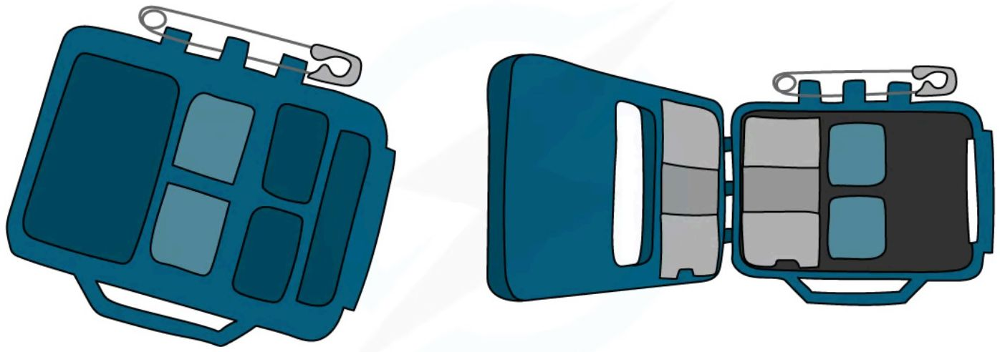
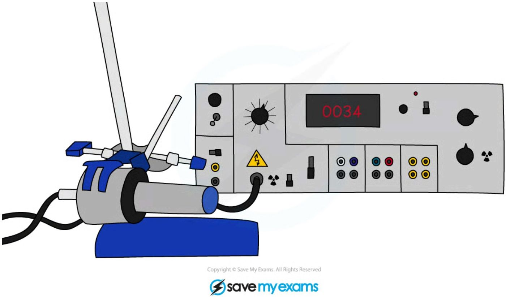
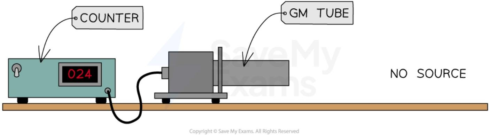
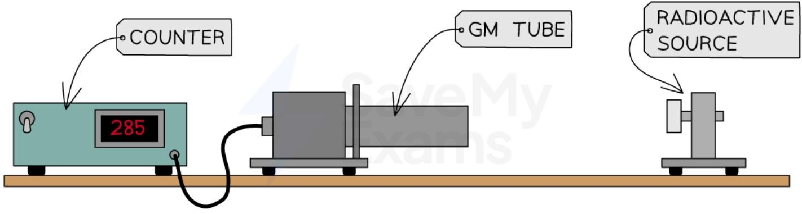

# Radioactivity and half-life

## Measuring radioactivity

### Radioactivity

* Objects containing radioactive nuclei are called **sources** of radiation

* Sources of radiation decay at different **rates** which are defined by their **activity**

* The activity of a radioactive source is defined as:

**The rate at which the unstable nuclei decay**

* Activity is measured in **becquerels**

    - The symbol for Becquerels is **Bq**

* 1 Becquerel is equal to 1 nucleus in the source decaying in 1 second


### Detecting radiation

*   Ionising radiation can be **detected** using    

    *   photographic film

    *   a Geiger–Müller tube

#### Photographic film

*   Photographic films detect radiation by becoming darker when it absorbs radiation, similar to when it absorbs visible light
    

    *   The **more** radiation the film absorbs, the **darker** it is when it is developed

*   People who work with radiation, such as radiographers, wear film badges which are checked regularly to monitor the levels of radiation absorbed

*   To get an accurate measure of the dose received, the badge contains different materials that the radiation must penetrate to reach the film
    

    *   These materials may include aluminium, copper, paper, lead and plastic

*   The diagram shows what a typical radiation badge looks like:



*A badge containing photographic film can be used to monitor a person’s exposure to radiation*

#### Geiger-Müller tube

*   The Geiger-Müller tube is the most common device used to measure and detect radiation

*   Each time it absorbs radiation, it transmits an electrical pulse to a counting machine

* This makes a clicking sound or displays the **count rate**

* The greater the frequency of clicks, or the higher the count rate, the more radiation the Geiger-Müller tube is absorbing 

    - Therefore, it matters how close the tube is to the radiation source

    - The further away from the source, the lower the count rate detected



*A Geiger-Müller tube (or Geiger counter) is a common type of radiation detector*

!!! example "Worked Example"

    A Geiger-Müller tube is used to detect radiation in a particular location. If it counts 16,000 decays in 1 hour, what is the count rate?

    ??? note "Answer:"

        **Step 1: Identify the different variables**

        * The number of decays is 16 000

        * The time is 1 hour

        **Step 2: Determine the time period in seconds**

        * 1 hour is equal to 60 minutes, and 1 minute is equal to 60 seconds
        Time period = 1 × 60 × 60 = 3600 seconds

        **Step 3: Divide the total counts by the time period in seconds**

        Counts ÷ Time period = 16 000 ÷ 3600 = 4.5

        * Therefore, it detects **4.5 decays per second**

!!! tip "Examiner Tips and Tricks"

    If asked to name a device for detecting radiation, the Geiger-Müller tube is a good example to give. You can also refer to it as a GM tube, a GM detector, GM counter, Geiger counter etc. (The examiners will allow some level of misspelling, providing it is readable). Don’t, however, refer to it as a ‘radiation detector’ as this is too vague and may simply restate what was asked for in the question.

### Background radiation

* It is important to remember that radiation is a natural phenomenon

* Radioactive elements have always existed on Earth and in outer space

* However, human activity has added to the amount of radiation that humans are exposed to on Earth

* Background radiation is defined as:

**The radiation that exists around us all the time**

* Every second of the day there is some radiation emanating from natural sources such as:

    - Rocks

    - Cosmic rays from space

    - Foods

**Chart of Background Radiation Sources**

SOURCES OF BACKGROUND RADIATION

<table>
  <tbody>
    <tr>
        <td>Category</td>
        <td>Percentage</td>
    </tr>
    <tr>
        <td>RADON GAS</td>
        <td>50</td>
    </tr>
    <tr>
        <td>ROCKS AND BUILDING MATERIALS</td>
        <td>15</td>
    </tr>
    <tr>
        <td>MEDICAL (e.g. X-RAYS)</td>
        <td>13</td>
    </tr>
    <tr>
        <td>FOOD</td>
        <td>11</td>
    </tr>
    <tr>
        <td>COSMIC RAYS</td>
        <td>10</td>
    </tr>
    <tr>
        <td>OTHER</td>
        <td>1</td>
    </tr>
  </tbody>
</table>

*Background radiation is the radiation that is present all around in the environment. Radon gas is given off from some types of rock*

* There are two types of background radiation:

    - Natural sources

    - Artificial (man-made) sources

#### Natural Sources of Background Radiation

##### Radon gas from rocks and buildings

* Airborne radon gas comes from rocks in the ground, as well as building materials e.g. stone and brick

* This is due to the presence of radioactive elements, such as uranium, which occur naturally in small amounts in all rocks and soils

    - Uranium decays into radon gas, which is an alpha emitter

    - This is particularly dangerous if inhaled into the lungs in large quantities

* Radon gas is tasteless, colourless and odourless so it can only be detected using a Geiger counter

* Levels of radon gas are generally very low and are not a health concern, but they can vary significantly from place to place

##### Cosmic rays from space

* The sun emits an enormous number of protons every second

* Some of these enter the Earth’s atmosphere at high speeds

* When they collide with molecules in the air, this leads to the production of gamma radiation

* Other sources of cosmic rays are supernovae and other high energy cosmic events

##### Carbon-14 in biological material

* All organic matter contains a tiny amount of carbon-14

* Living plants and animals constantly replace the supply of carbon in their systems hence the amount of carbon-14 in the system stays almost constant

##### Radioactive material in food and drink

* Naturally occurring radioactive elements can get into food and water since they are in contact with rocks and soil containing these elements

* Some foods contain higher amounts such as potassium-40 in bananas

* However, the amount of radioactive material is minuscule and is not a cause for concern

#### Artificial Sources of Background Radiation

#### Nuclear medicine

* In medical settings, nuclear radiation is utilised all the time

* For example, X-rays, CT scans, radioactive tracers, and radiation therapy all use radiation

#### Nuclear waste

* While nuclear waste itself does not contribute much to background radiation, it can be dangerous for the people handling it

#### Nuclear fallout from nuclear weapons

* Fallout is the residue radioactive material that is thrown into the air after a nuclear explosion, such as the bomb that exploded at Hiroshima

* While the amount of fallout in the environment is presently very low, it would increase significantly in areas where nuclear weapons are tested

#### Nuclear accidents

* Nuclear accidents, such as the incident at Chernobyl, contribute a large dose of radiation to the environment

* While these accidents are now extremely rare, they can be catastrophic and render areas devastated for centuries

### Accounting for background radiation

* Background radiation must be accounted for when taking readings in a laboratory

* This can be done by taking readings with no radioactive source present and then subtracting this from readings with the source present


* This is known as the **corrected count rate**

**Measuring background count rate**



*The background count rate can be measured using a Geiger-Müller (GM) tube with no source present*

* For example, if a Geiger counter records 24 counts in 1 minute when no source is present, the background radiation count rate would be:

    * 24 counts per **minute** (cpm)

    * 24/60 = 0.4 counts per **second** (cps)

**Measuring the corrected count rate of a source**



**The corrected count rate can be determined by measuring the count rate of a source and subtracting the background count rate**

* Then, if the Geiger counter records, for example, 285 counts in 1 minute when a source is present, the corrected count rate would be:

    * 285 − 24 = 261 counts per **minute** (cpm)

    * 261/60 = 4.35 counts per **second** (cps)

* When measuring count rates, the **accuracy** of results can be improved by:

    * Repeating readings and taking averages

    * Taking readings over a long period of time

!!! example "Worked Example"

    A student uses a Geiger counter to measure the counts per minute at different distances from a source of radiation. Their results and a graph of the results are shown below.

    RESULTS TABLE
    <table>
    <thead>
        <tr>
            <th>Distance from source (m)</th>
            <th>Counts per minute</th>
        </tr>
    </thead>
    <tbody>
        <tr>
            <td>0.2</td>
            <td>180</td>
        </tr>
        <tr>
            <td>0.4</td>
            <td>67</td>
        </tr>
        <tr>
            <td>0.6</td>
            <td>29</td>
        </tr>
        <tr>
            <td>0.8</td>
            <td>17</td>
        </tr>
        <tr>
            <td>1.0</td>
            <td>15</td>
        </tr>
        <tr>
            <td>1.2</td>
            <td>15</td>
        </tr>
        <tr>
            <td>1.4</td>
            <td>15</td>
        </tr>
    </tbody>
    </table>

    GRAPH
    <table>
    <thead>
        <tr>
            <th>DISTANCE FROM SOURCE (m)</th>
            <th>COUNTS PER MINUTE</th>
        </tr>
    </thead>
    <tbody>
        <tr>
            <td>0.2</td>
            <td>180</td>
        </tr>
        <tr>
            <td>0.4</td>
            <td>67</td>
        </tr>
        <tr>
            <td>0.6</td>
            <td>29</td>
        </tr>
        <tr>
            <td>0.8</td>
            <td>17</td>
        </tr>
        <tr>
            <td>1.0</td>
            <td>15</td>
        </tr>
        <tr>
            <td>1.2</td>
            <td>15</td>
        </tr>
        <tr>
            <td>1.4</td>
            <td>15</td>
        </tr>
    </tbody>
    </table>

    Determine the background radiation count.

    ??? note "Answer:"

        **Step 1: Determine the point at which the source radiation stops being detected**

        * The background radiation is the amount of radiation received all the time
        * When the source is moved back far enough it is all absorbed by the air before reaching the Geiger counter
        * Results after 1 metre do not change
        * Therefore, the amount after 1 metre is only due to background radiation

        **Step 2: State the background radiation count**

        * The background radiation count is **15 counts per minute**

!!! tip "Examiner Tips and Tricks"

    The sources that make the most significant contribution are the natural sources:

    * Radon gas from rocks and buildings
    * Food and drink
    * Cosmic rays

    Make sure you remember these for your exam!

## Half life

### How does activity vary with time?

* The activity of a radioactive source **decreases** with time

    - This is because each decay event reduces the overall number of radioactive particles in the source

* Radioactive decay is a **random** process

* The randomness of radioactive decay can be observed by measuring the **count rate** of a source using a Geiger-Muller (GM) tube

* When the count rate is plotted against time, fluctuations can be seen

* These fluctuations provide **evidence** for the randomness of radioactive decay

<table>
  <thead>
    <tr>
        <th>TIME / t</th>
        <th>COUNT RATE / C</th>
    </tr>
  </thead>
  <tbody>
    <tr>
        <td>0</td>
        <td>[High value with fluctuations]</td>
    </tr>
    <tr>
        <td>[Increasing t]</td>
        <td>[Decreasing value with fluctuations following an exponential decay curve]</td>
    </tr>
  </tbody>
</table>

The decreasing activity of a source can be shown on a graph against time. The fluctuations show the randomness of radioactive decay


!!! example "Worked Example"

    A source of radiation has an activity of 2000 Bq. How many unstable atoms decay in 2 minutes?

    **Answer:**

    **Step 1: Determine the activity**

    * The activity of the source is 2000 Bq

    * This means 2000 nuclei decay every second

    **Step 2: Determine the time period in seconds**

    * The time period is 2 minutes

    * Each minute has 60 seconds

    * The time period in seconds is:

    2 × 60 = 120 seconds

    **Step 3: Multiply the activity by the time period**

    Activity (Bq) × Time period (s) = 2000 × 120 = 240 000

    * Therefore, 240 000 unstable nuclei decay in 2 minutes

!!! tip "Examiner Tips and Tricks"

    Do not confuse **activity** and **count rate**.

    Activity is the rate at which unstable nuclei decay, whereas count rate is the rate at which radioactive emissions are detected.

### Half life

* It is impossible to know when a particular unstable nucleus will decay

* It is possible to find out the rate at which the activity of a sample decreases

    - This is known as the **half-life**

* Half-life is defined as:

> **The time it takes for the number of nuclei of a sample of radioactive isotopes to decrease by half**

* In other words, the time it takes for the activity of a sample to fall to half its original level

* Different isotopes have different half-lives and half-lives can vary from a fraction of a second to billions of years in length

### Measuring half life

* To determine the half-life of a sample, the procedure is:

    - Measure the initial activity A<sub>0</sub> of the sample

    - Determine the half-life of this original activity

    - Measure how the activity changes with time

* The time taken for the activity to decrease to half its original value is the **half-life**

### Half life calculations

* Scientists can measure the half-lives of different isotopes accurately

* Uranium-235 has a half-life of 704 million years

    - This means it would take 704 million years for the activity of a uranium-235 sample to decrease to half its original amount

* Carbon-14 has a half-life of 5700 years

    - So after 5700 years, there would be 50% of the original amount of carbon-14 remaining

    - After two half-lives or 11 400 years, there would be just 25% of the carbon-14 remaining

* With each half-life, the amount remaining **decreases by half**

**A graph can be used to make half-life calculations**

<table>
  <thead>
    <tr>
        <th>Time (t)</th>
        <th>Activity (A)</th>
        <th>Annotation</th>
    </tr>
  </thead>
  <tbody>
    <tr>
        <td>0</td>
        <td>A₀</td>
        <td> </td>
    </tr>
    <tr>
        <td>t₁/₂</td>
        <td>A₀/2</td>
        <td>1 HALF-LIFE: ACTIVITY HAS DROPPED BY HALF OF ITS ORIGINAL VALUE</td>
    </tr>
    <tr>
        <td>2t₁/₂</td>
        <td>A₀/4</td>
        <td>2 HALF-LIVES: ACTIVITY HAS DROPPED BY A QUARTER OF ITS ORIGINAL VALUE</td>
    </tr>
    <tr>
        <td>3t₁/₂</td>
        <td>[illegible]</td>
        <td> </td>
    </tr>
  </tbody>
</table>


***The graph shows how the activity of a radioactive sample changes over time. Each time the original activity halves, another half-life has passed***

* The time it takes for the activity of the sample to decrease from 100% to 50% is the half-life

* It is the same length of time as it would take to decrease from 50% activity to 25% activity

* The half-life is **constant** for a particular isotope

* The following table shows that as the number of half-life increases, the proportion of the isotope remaining **halves**

**Half life calculation table**

<table>
  <thead>
    <tr>
        <th>number of half lives</th>
        <th>proportion of isotope remaining</th>
    </tr>
  </thead>
  <tbody>
    <tr>
        <td>0</td>
        <td>1 or 100%</td>
    </tr>
    <tr>
        <td>1</td>
        <td>1/2 or 50%</td>
    </tr>
    <tr>
        <td>2</td>
        <td>1/4 or 25%</td>
    </tr>
    <tr>
        <td>3</td>
        <td>1/8 or 12.5%</td>
    </tr>
  </tbody>
</table>

<table>
    <tr>
        <th>4</th>
        <th>$$\frac{1}{16}$$ or 6.25%</th>
        <th></th>
    </tr>
</table>

!!! example "Worked Example"

    The activity of a particular radioactive sample is 880 Bq. After a year, the activity has dropped to 220 Bq.

    What is the half-life of this material?

    ??? note "Answer:"

        **Step 1: Calculate how many times the activity has halved**

        * Initially, the activity was 880 Bq
        * After 1 half-life the activity would be 440 Bq
        * After 2 half-lives, the activity would be 220 Bq
        * Therefore, 2 half-lives have passed

        **Step 2: Divide the time period by the number of half-lives**

        * The time period is a year
        * The number of half-lives is 2

        ```mermaid
        graph LR
            A(880) -- "1 half life6 months" --> B(440)
            B -- "2 half lives1 year" --> C(220)
        ```

        * So two half-lives is 1 year, and one half-life is 6 months
        * Therefore, the half-life of the sample is **6 months**

!!! example "Worked Example"

    The radioisotope technetium is used extensively in medicine. The graph below shows how the activity of a sample varies with time.

    <table>
    <thead>
        <tr>
            <th>TIME / HOURS</th>
            <th>ACTIVITY / 10^7 Bq</th>
        </tr>
    </thead>
    <tbody>
        <tr>
            <td>0</td>
            <td>8</td>
        </tr>
        <tr>
            <td>2</td>
            <td>6.3</td>
        </tr>
        <tr>
            <td>4</td>
            <td>5</td>
        </tr>
        <tr>
            <td>6</td>
            <td>4</td>
        </tr>
        <tr>
            <td>8</td>
            <td>3.2</td>
        </tr>
        <tr>
            <td>10</td>
            <td>2.5</td>
        </tr>
        <tr>
            <td>12</td>
            <td>2</td>
        </tr>
        <tr>
            <td>14</td>
            <td>1.6</td>
        </tr>
        <tr>
            <td>16</td>
            <td>1.3</td>
        </tr>
        <tr>
            <td>18</td>
            <td>1</td>
        </tr>
        <tr>
            <td>20</td>
            <td>0.8</td>
        </tr>
        <tr>
            <td>22</td>
            <td>0.6</td>
        </tr>
        <tr>
            <td>24</td>
            <td>0.5</td>
        </tr>
    </tbody>
    </table>

    Determine the half-life of this material.

    ??? note "Answer:"

        Step 1: Draw lines on the graph to determine the time it takes for technetium to drop to half of its original activity

        <table>
        <thead>
            <tr>
                <th>TIME / HOURS</th>
                <th>ACTIVITY / 10^7 Bq</th>
            </tr>
        </thead>
        <tbody>
            <tr>
                <td>0 (A_0)</td>
                <td>8</td>
            </tr>
            <tr>
                <td>2</td>
                <td>6.3</td>
            </tr>
            <tr>
                <td>4</td>
                <td>5</td>
            </tr>
            <tr>
                <td>6 (t_1/2)</td>
                <td>4 (1/2 A_0)</td>
            </tr>
            <tr>
                <td>8</td>
                <td>3.2</td>
            </tr>
            <tr>
                <td>10</td>
                <td>2.5</td>
            </tr>
            <tr>
                <td>12</td>
                <td>2</td>
            </tr>
            <tr>
                <td>14</td>
                <td>1.6</td>
            </tr>
            <tr>
                <td>16</td>
                <td>1.3</td>
            </tr>
            <tr>
                <td>18</td>
                <td>1</td>
            </tr>
            <tr>
                <td>20</td>
                <td>0.8</td>
            </tr>
            <tr>
                <td>22</td>
                <td>0.6</td>
            </tr>
            <tr>
                <td>24</td>
                <td>0.5</td>
            </tr>
        </tbody>
        </table>

        Step 2: Read the half-life from the graph

        * In the diagram above the initial activity, $A_0$, is $8 \times 10^7 \text{ Bq}$

        * The time taken to decrease to $4 \times 10^7 \text{ Bq}$, or $1/2 A_0$, is 6 hours

        * Therefore, the half-life of this isotope is **6 hours**