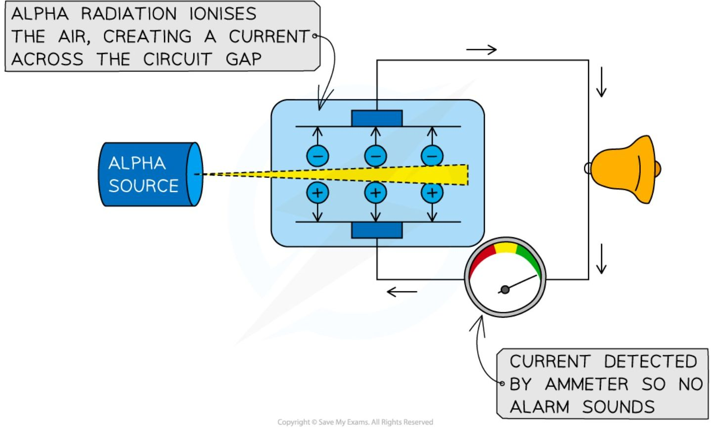
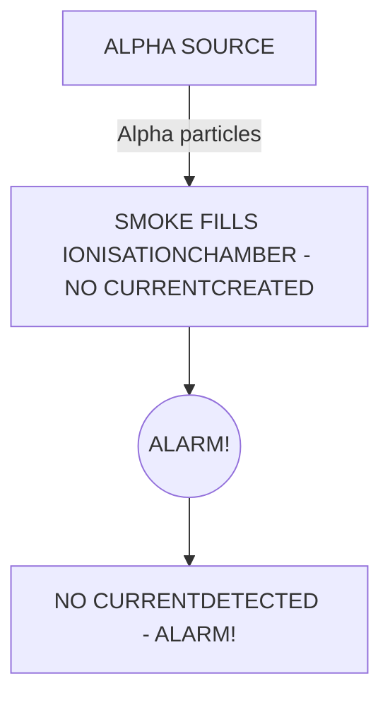
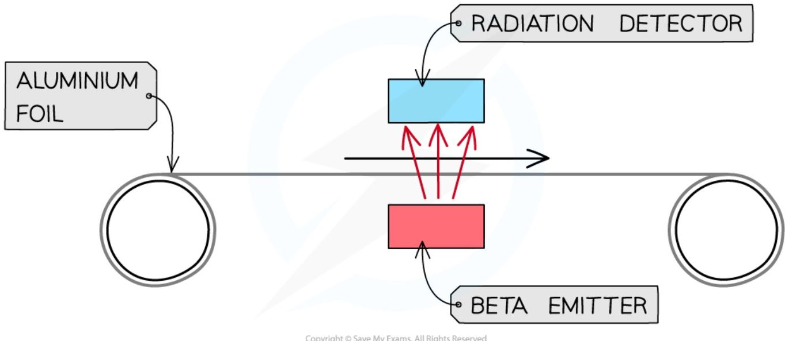
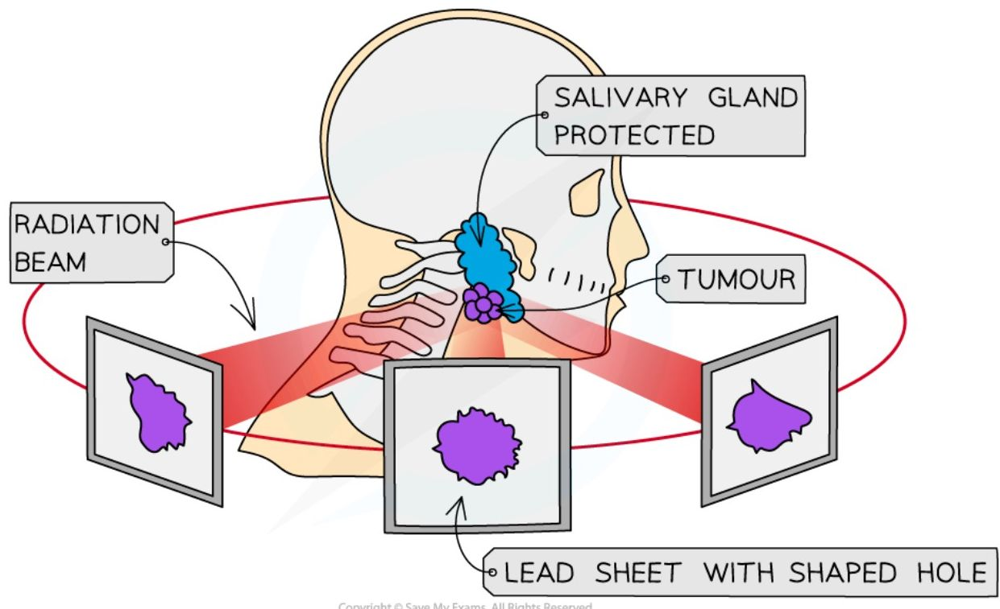
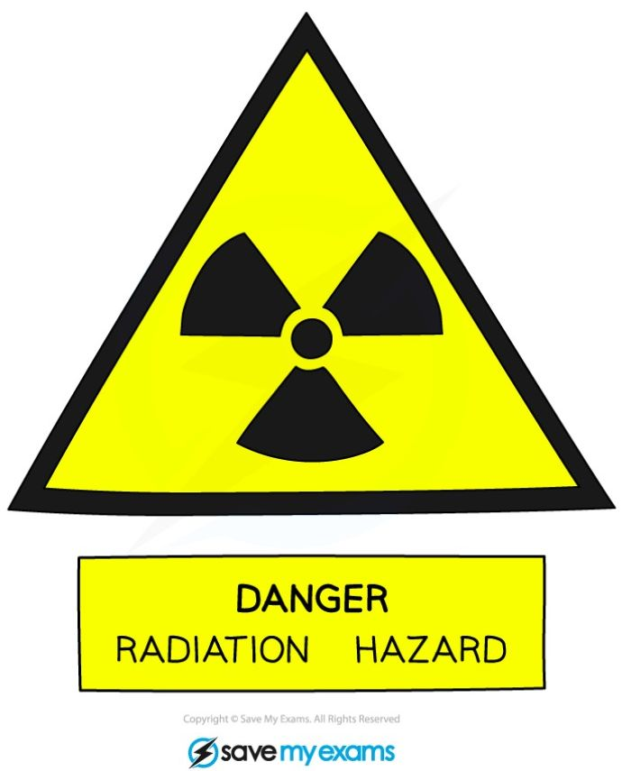
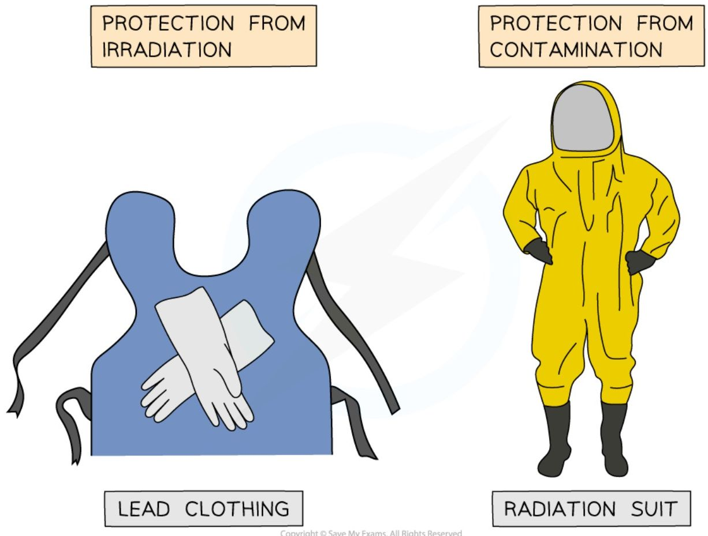
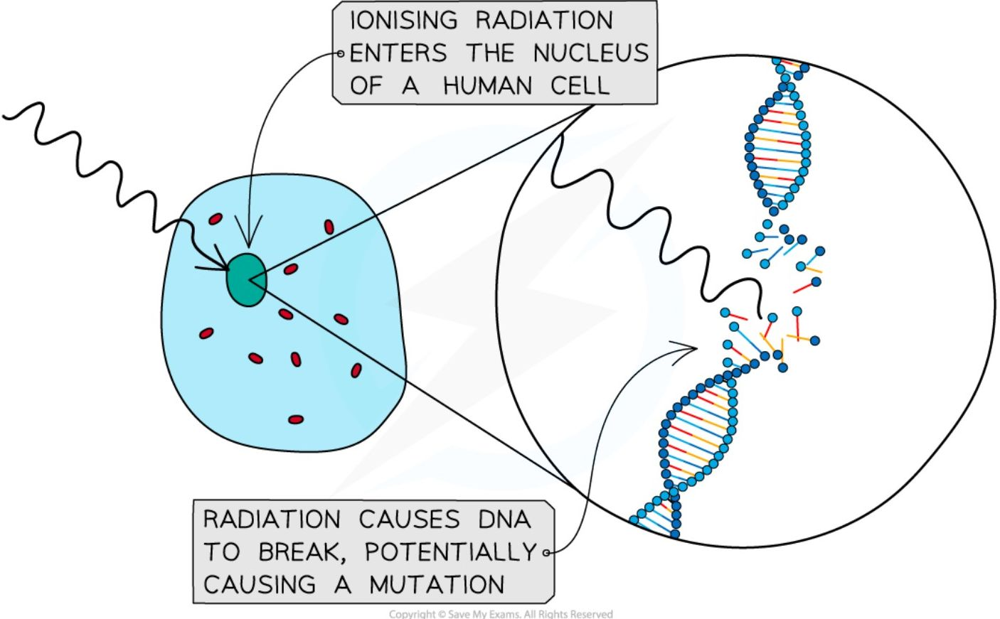
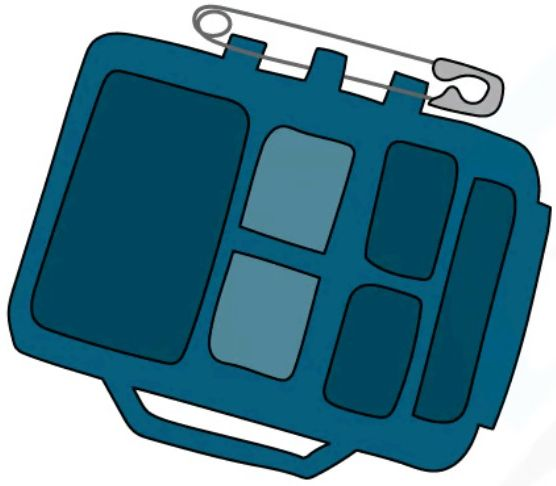
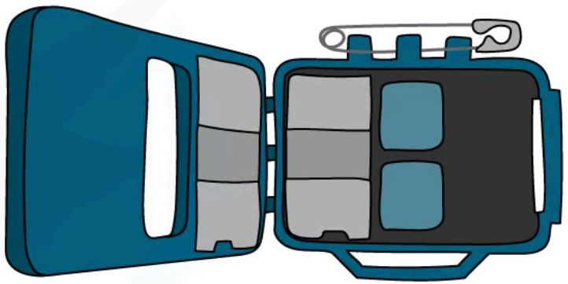
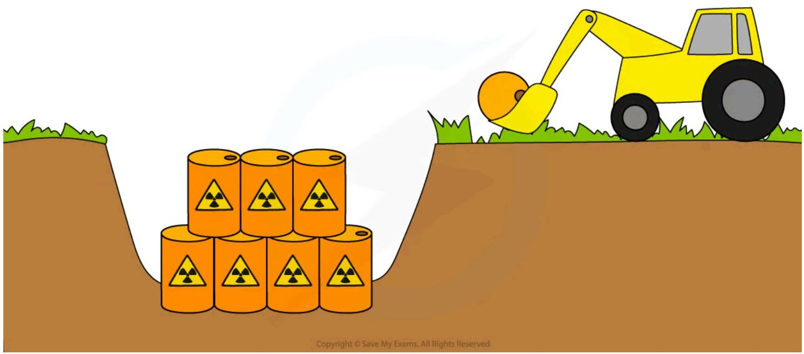

# Uses and hazards of radioactivity

## Uses of radioactivity

Radioactivity has many uses, such as smoke detectors (alarms), monitoring the thickness of materials, medical procedures including diagnosis and treatment of cancer, sterilising food (irradiating food) and medical equipment, determining the age of ancient artefacts, and as a power source. The properties of the different types of radiation determine which one is used in a particular application.

### Smoke detectors

Alpha particles are used in smoke detectors: the alpha radiation normally **ionises** the air within the detector, creating a current. The alpha emitter is blocked when smoke enters the detector, and the alarm is triggered by a microchip when the sensor no longer detects alpha.

*When no smoke is present, alpha particles ionise the air and cause a current to flow. When smoke is present, alpha particles are absorbed and current is prevented from flowing which triggers the alarm*

### Measuring the thickness of materials

When a material, such as aluminium foil, moves above a beta source, some beta particles are absorbed, but most penetrate through — the amount passing through can be monitored using a detector. If the material gets **thicker**, more particles are absorbed and the count rate **decreases**; if it gets **thinner**, fewer particles are absorbed and the count rate **increases**. This allows the manufacturer to make adjustments to keep the thickness of the material constant.

***Beta particles can be used to measure the thickness of thin materials such as paper, cardboard or aluminium foil***

Beta radiation is used because the material will only **partially** absorb it: if an **alpha** source were used, **all** alpha particles would be **absorbed** regardless of material thickness, and if a **gamma** source were used, almost **all** gamma rays would be **detected** regardless of material thickness — neither would be sensitive to changes in thickness the way beta is.

### Diagnosis and treatment of cancer

**Radiotherapy** is the name given to the treatment of cancer using radiation (note: this is different to chemotherapy, which is a drug treatment for cancer). Although radiation can cause cancer, it is also highly effective at treating it, since ionising radiation can kill living cells — some cells, such as bacteria and cancer cells, are more susceptible to radiation than others. Beams of gamma rays are directed at the cancerous tumour: gamma rays are used because they can penetrate the body and reach the tumour, and the beams are moved around to minimise harm to healthy tissue while still being aimed at the tumour.

A **tracer** is a radioactive isotope that can be used to track the movement of substances, like blood, around the body. A PET scan can detect the emissions from a tracer to diagnose cancer and determine the location of a tumour.

*Radiation therapy is a type of cancer treatment which targets the tumour with ionising radiation*

### Sterilising food and medical equipment

Gamma radiation is widely used to **sterilise** medical equipment. Gamma is most suited to this because it is the most **penetrating** of all the types of radiation, penetrating enough to irradiate **all sides** of the instruments, and instruments can be sterilised without removing their **packaging**. Food can be irradiated in order to **kill any microorganisms** present on it, making it last longer and reducing the risk of food-borne infections.

*Food that has been irradiated carries this symbol, called the Radura. Different countries allow different foods to be irradiated*

### Determining the age of ancient artefacts

Living organisms constantly exchange carbon with their environment, so the proportion of carbon-14 (a naturally occurring, radioactive isotope of carbon) in their bodies stays roughly constant while they are alive. Once an organism dies, this exchange stops, and the carbon-14 already present decays away with its known half-life (about 5700 years) without being replaced. By measuring how much carbon-14 remains in an artefact made from once-living material — such as wood, bone or cloth — and comparing it to the amount expected in a living organism, scientists can estimate how many half-lives have passed since it died, and therefore its age.

### Radioactivity as a power source

A radioactive source can also be used directly as a **power source**: as an isotope decays, its radiation carries away energy, which can be captured as heat and converted into electricity. A **radioisotope thermoelectric generator (RTG)** does exactly this. Because the decay itself does not depend on external conditions like sunlight, RTGs can reliably supply power for decades in places solar panels cannot reach, such as deep-space probes far from the Sun, or — in a much smaller form — older cardiac pacemakers.

### Choosing a suitable source of radiation

There are two aspects to choosing a suitable source of radiation: it needs to produce the right type of radiation, and its half-life needs to be suitable too.

!!! example "Worked Example (explanation)"

    Explain why a source of alpha radiation is used in smoke detectors, and not beta or gamma radiation.

    ??? success "Model answer:"

        Alpha is the most weakly penetrating and strongest-ionising type of radiation, while beta and gamma have stronger penetrating power and weaker ionising power. Alpha radiation is the best choice for a smoke detector because it is easily absorbed by smoke, triggering the alarm — beta and gamma radiation would pass straight through the smoke, so the alarm would not be triggered.

!!! tip "Examiner Tips and Tricks"

    If you are presented with an unfamiliar situation in your exam don't panic! Just apply your understanding of the properties of alpha, beta and gamma radiation. Focus on the range (how far it can travel) and ionising power of the radiation to help understand which radiation is used in which situation.

!!! example "Worked Example (explanation)"

    Technetium-99m, used as a medical tracer, has a half-life of about 6 hours. Explain why this short half-life makes it suitable for this use, rather than a source with a half-life of many years.

    ??? success "Model answer:"

        A short half-life means the isotope has a high activity for a given amount of material, so only a small amount needs to be used, and it produces a strong enough signal to be detected quickly. Because it decays away within about a day, very little of it remains in the patient's body afterwards, minimising their long-term exposure to radiation. A source with a half-life of many years would keep irradiating the patient from inside their body for the rest of their life, which would be far more dangerous.

## Hazards of radioactivity

### Contamination and irradiation

#### Contamination

!!! abstract "Definition: Contamination"
    Contamination is **the accidental transfer of a radioactive substance onto or into a material**. A substance is only radioactive if it contains a source of ionising radiation.

Contamination occurs when a radioactive isotope gets onto a material where it should not be — it is almost always a mistake or an accident, e.g. a radiation leak. As a result, the small amounts of isotope in the contaminated area will emit radiation, and the material itself **becomes radioactive**.

#### Irradiation

!!! abstract "Definition: Irradiation"
    Irradiation is **the process of exposing a material to ionising radiation**. Irradiating a substance **does not** make it radioactive, though it **can** kill living cells.

Irradiation is usually a deliberate process, such as in the **sterilisation** of food or medical equipment: surgical equipment is irradiated before use to kill any micro-organisms on it, and food can be irradiated to kill any micro-organisms within it and make it last longer.

*This sign is the international symbol indicating the presence of a radioactive material*

### Protection from irradiation and contamination

Radiation can mutate DNA in cells and cause cancer through both irradiation and contamination, so it is important to reduce the risk of exposure. Contamination is particularly dangerous if a radioactive source gets **inside** the human body — for example, through inhaling radioactive gas particles, or ingesting contaminated food — since the internal organs are then irradiated as the source emits radiation while moving through the body.

To prevent irradiation, **shielding** can be used to absorb radiation: lead-lined suits are used to reduce irradiation for people working with radioactive materials, since lead absorbs most of the radiation that would otherwise hit the person. To prevent contamination, an **airtight suit** is worn by people working in an area where a radioactive source may be present, to prevent radioactive atoms from getting on or into the person.

*Lead shielding is used when a person is getting an x-ray, as well as for people who work with radiation. Contamination carries much greater risks than irradiation*

#### Comparison of irradiation and contamination

<table>
  <thead>
    <tr>
        <th> </th>
        <th>Irradiation</th>
        <th>Contamination</th>
    </tr>
  </thead>
  <tbody>
    <tr>
        <td>description</td>
        <td>when an object is exposed to a source of radiation but does not become radioactive</td>
        <td>when an object becomes radioactive due to the presence of a source of radiation</td>
    </tr>
    <tr>
        <td>source</td>
        <td>exposure to source of radiation outside the object</td>
        <td>exposure to source on or within the object</td>
    </tr>
    <tr>
        <td>prevention</td>
        <td>blocked by using shielding such as lead</td>
        <td>radiation cannot be blocked once an object is contaminated, but can be prevented by handling the source safely</td>
    </tr>
    <tr>
        <td>causes</td>
        <td>caused by the deliberate exposure to radiation</td>
        <td>caused by the accidental transfer of radioactive material</td>
    </tr>
  </tbody>
</table>

!!! example "Worked Example (explanation)"

    Summarise the difference in the risk posed by radioactive sources with very short and very long half-lives, in regard to (a) irradiation and (b) contamination.

    ??? success "Model answer:"

        **(a)** Irradiation poses a greater risk from sources with **shorter** half-lives: a short half-life means a source has a **high activity**, so there is a high rate of radioactive emissions, compared to a source with a long half-life.

        **(b)** Contamination poses a greater risk from sources with **longer** half-lives: these sources remain radioactive for longer, so they need to be controlled for longer to prevent them spreading, and shielding and storage may be required over a much longer timescale.

!!! tip "Examiner Tips and Tricks"

    Irradiation and contamination are very commonly confused. Remember that something is radioactive **only** if it contains radioactive atoms. This can only occur from contamination, **not** from irradiation!

### Dangers of ionising radiation

All types of ionising radiation pose a danger if mishandled, as they can damage living cells and tissues, and cause mutations which can lead to cancer.

**Effect of radiation on a living cell**

*Ionising radiation can cause damage to DNA. Sometimes the cell can successfully repair the DNA, but incorrect repairs can cause a mutation*

Highly **ionising** types of radiation are more dangerous **inside** the body (if a radioactive source is somehow ingested): alpha sources are the **most ionising**, so they are likely to cause the **most harm** to living cells inside the body, while gamma sources are the **least ionising** (about 20 times lower than alpha particles), so they are likely to cause the **least harm** inside the body.

Highly **penetrating** types of radiation are more dangerous **outside** the body: gamma sources are the **most penetrating**, so they are able to pass through the skin and reach living cells in the body, while alpha sources are **least penetrating**, so they would be absorbed by the air before even reaching the skin.

### Safe handling of radioactive sources

The risks of radiation exposure can be minimised by handling sources of radiation safely, and by monitoring exposure to radiation.

To minimise the risks of **contamination**, safety practices must be followed, such as keeping radioactive sources in a **shielded container** when not in use (for example, a lead-lined box), wearing gloves and using **tongs** to handle radioactive materials, wearing **protective clothing** (particularly if the risk of inhalation or ingestion is high), and limiting the **time** that a radioactive source is outside of its container.

To minimise the risks of **irradiation** to workers, it is important to **monitor** their exposure to radiation: to protect against over-exposure, the dose received during different activities is measured. A **dosemeter** measures the amount of radiation in particular areas, and is often worn by radiographers, or anyone working with radiation.

**Badge for monitoring radiation exposure**

*A dosemeter, or radiation badge, can be worn by a person working with radiation in order to keep track of the amount of radiation they are receiving*

### Disposal of nuclear waste

Nuclear waste must be treated appropriately, depending on the type of radiation it emits: **alpha**-emitting nuclear waste is easily stored in plastic or metal canisters, **beta**-emitting nuclear waste is stored inside metal canisters and concrete silos, and **gamma**-emitting nuclear waste requires storage inside lead-lined, thick concrete silos.

Radioactive waste of all types tends to emit dangerous levels of radiation for many years, so it must be stored securely for a very long time — waste with the highest levels of radioactivity is typically buried underground, in secure, geologically stable locations.

**Dealing with radioactive waste**

***Depending on the type of radiation emitted, nuclear waste is treated in different ways***

Sources with **long half-lives** present a risk of contamination for a much longer time, so radioactive waste with a long half-life is buried underground to prevent radioactive material from being released into the environment. Radioactive waste must be stored in **strong** containers able to withstand harsh conditions over long periods, and the containers must be designed to resist **rust** and corrosion — rust-proof containers are often expensive and challenging to manufacture. The disposal site must have **high security**, to prevent unauthorised access, and a **low risk of natural disasters**, such as earthquakes. Carefully selecting the site and using strong containers helps prevent radioactive waste from leaking into **groundwater**; radioactive waste can also be diluted in large volumes of seawater, to minimise the concentration of radioactive materials.

!!! example "Worked Example (explanation)"

    A student plans to use a gamma source to conduct an experiment.

    List **four** things that the student should do in order to minimise the risk to themselves when using the source.

    ??? success "Model answer:"

        Any four from:

        * Keep the source in a lead-lined container until the time it is needed
        * Use tongs to move the source, rather than handling it directly
        * Keep the source at as far a distance from the student as possible during the experiment
        * Minimise the time that the source is being used
        * Wash their hands after the experiment
        * Record the date and time that the radiation has been used for
