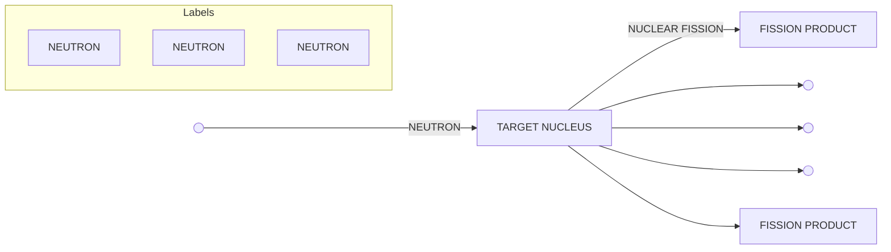
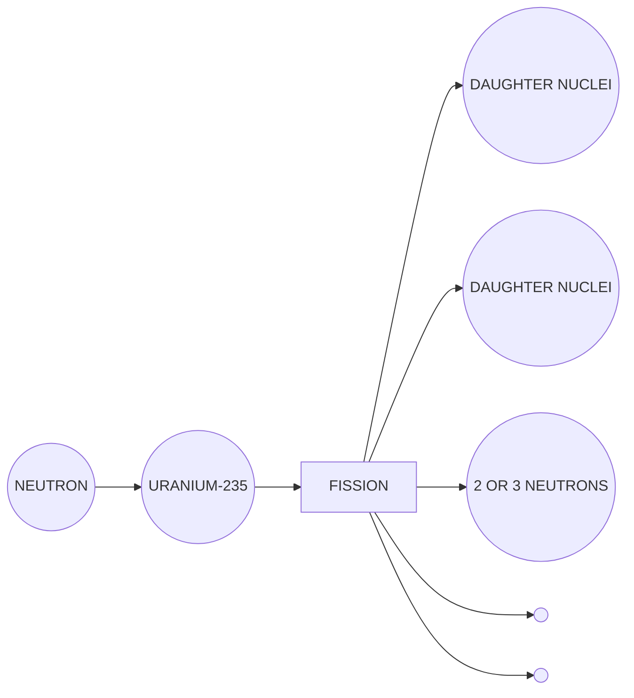
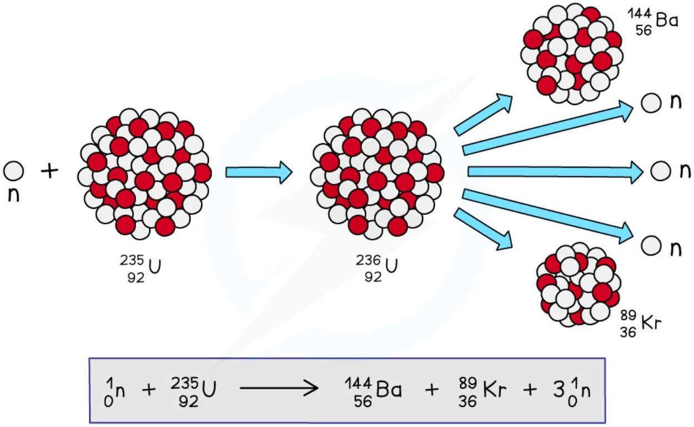
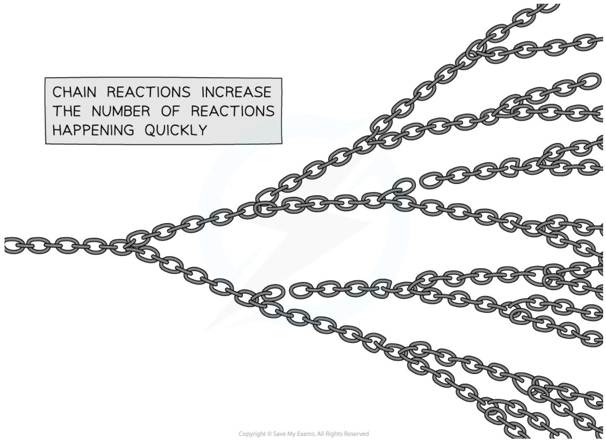
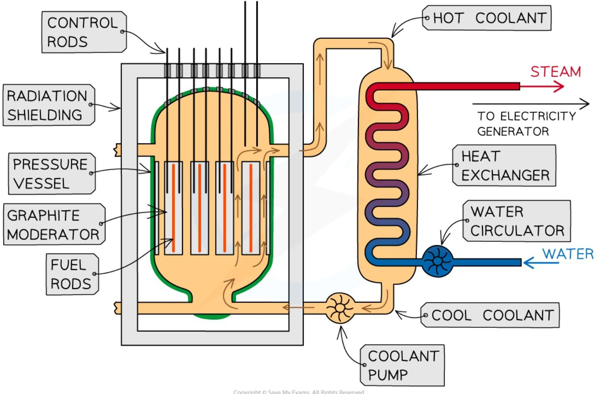
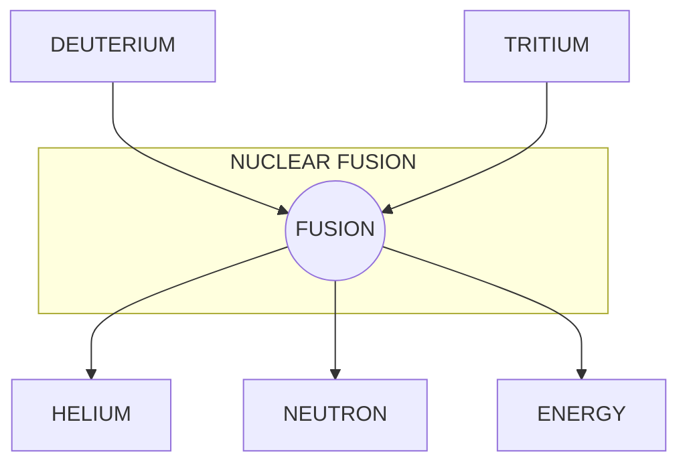
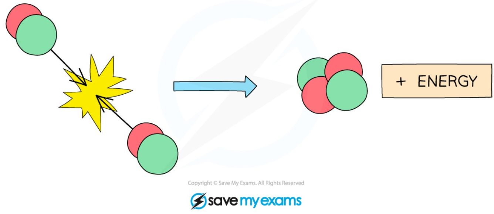
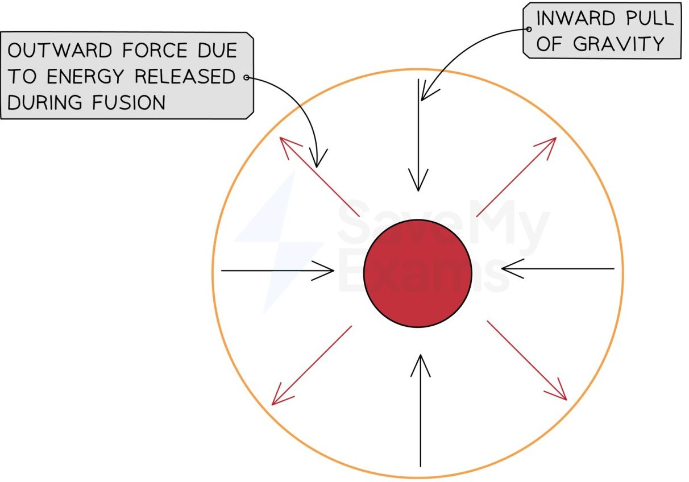
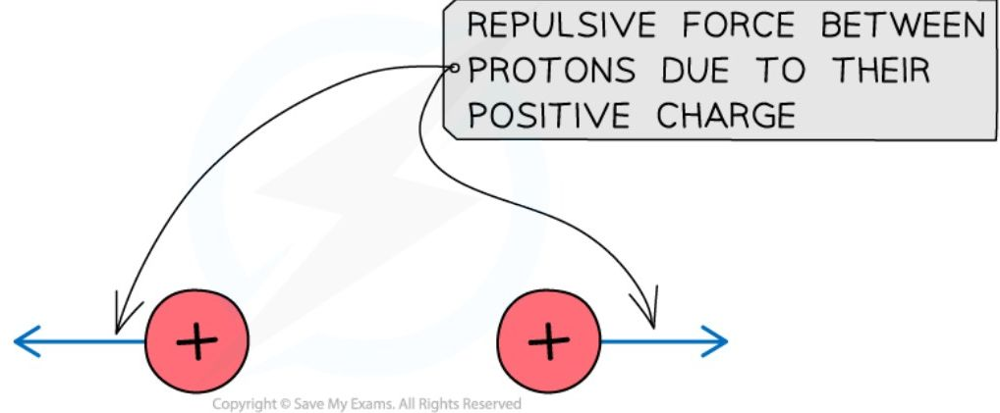

# Fission and Fusion

## Nuclear fission

!!! abstract "Definition: Nuclear fission"
    Nuclear fission is when **one large nucleus splits into two smaller nuclei**. The large nucleus that splits is often referred to as the **parent** nucleus, and the smaller nuclei produced are referred to as the **daughter** nuclei. This is the process used to generate electricity in nuclear power stations.



*The fission of a nucleus, such as uranium, to produce smaller daughter nuclei with the release of energy*

Some isotopes of uranium and plutonium are known as **fissile** materials, meaning they can undergo fission under the right conditions — this makes them ideal to use as **fuels** in nuclear power stations.

### The induced fission of uranium-235

#### Spontaneous vs induced fission

It is **rare** for nuclei to undergo fission without additional energy being put into the nucleus — when fission occurs this way, it is called **spontaneous fission**. Usually, for fission to occur, the unstable nucleus must first absorb a **neutron**, which makes the nucleus more unstable so that it decays almost immediately — this is called **induced fission**.

#### Fission of uranium-235

Uranium-235 is commonly used as a fuel in nuclear reactors. It has a very **long half-life** of 700 million years, meaning it has a low activity and releases energy very slowly — unsuitable for producing energy in a nuclear power station on its own. Therefore, the fission of uranium-235 must be **induced**: during induced fission, the uranium-235 nucleus absorbs a **neutron** and becomes uranium-236. Uranium-236 is very unstable, and splits by nuclear fission almost immediately, producing two smaller daughter nuclei and two or three neutrons.



*When a uranium-235 nucleus is struck by a neutron, it breaks into two smaller daughter nuclei and 2 or 3 neutrons*

!!! tip "Examiner Tips and Tricks"
    You need to remember that uranium and plutonium are possible elements for fission, but you do not need to know the specific daughter nuclei that are formed.

    Use your knowledge of balancing nuclear equations to work these out.

During fission, when a neutron collides with an unstable nucleus, the nucleus splits into two smaller nuclei (**daughter nuclei**) and two or three **neutrons** — gamma rays are also emitted. One of the many decay reactions uranium-235 can undergo is shown below:



*When fission is induced in a uranium-235 nucleus it may split into two smaller daughter nuclei, such as barium-144 and krypton-89*

The products of the fission reaction move away very **quickly**, because energy is transferred from the **nuclear potential energy** stored in the original nucleus into the **kinetic energy** of the products. In a nuclear power station, this energy can be harnessed and converted into **electrical energy**.

!!! example "Worked Example (multiple choice)"

    During a particular spontaneous fission reaction, plutonium-239 splits as shown in the equation below:

    $$ {}^{239}_{94}\text{Pu} \rightarrow {}^{112}_{46}\text{Pd} + {}^{124}_{48}\text{Cd} + \dots $$

    Which answer shows the section missing from this equation?

    **A.** ${}^{3}_{0}\text{n}$

    **B.** ${}^{0}_{0}\gamma$

    **C.** ${}^{4}_{2}\alpha$

    **D.** $3{}^{1}_{0}\text{n}$

    ??? success "Answer: D"

        **Step 1: Identify the different mass and atomic numbers**

        Pu (plutonium) has mass number 239 and atomic number 94. Pd (palladium) has mass number 112 and atomic number 46. Cd (cadmium) has mass number 124 and atomic number 48.

        **Step 2: Calculate the mass and atomic number of the missing section**

        Mass number is the difference between the mass numbers of the reactants and the products: $239 - (112 + 124) = 3$. Atomic number is the difference between the atomic numbers of the reactants and the products: $94 - (46 + 48) = 0$. The answer is therefore not **B** or **C**.

        **Step 3: Determine the correct notation**

        Neutrons have a mass number of 1, so the answer is therefore not **A** — it must instead be three neutrons, which corresponds to **D**.

#### Nuclear chain reactions

Only one extra neutron is required to induce fission in a uranium-235 nucleus. During fission, it produces **two** or **three** neutrons which move away at high speed, and each of these new neutrons can start another fission reaction, which again emits further **neutrons** — this process can start a **chain reaction**.

!!! abstract "Definition: Chain reaction"
    A chain reaction occurs when **a neutron emitted from the splitting of a nucleus causes further nuclei to split, and the neutrons emitted from these cause further fission reactions**.

Controlling chain reactions is an important part of the fission process in nuclear reactors. For a chain reaction to be maintained, there must be a minimum amount of fissile material, called the **critical mass**: if the mass of fissile material exceeds the critical mass, the rate of reaction accelerates, which can cause a huge and uncontrolled release of energy, i.e. a nuclear explosion.



*The neutrons released by each fission reaction can go on to create further fissions, like a chain that is linked several times – from each chain comes two more*

!!! example "Worked Example (method)"

    The diagram shows the nuclear fission process for an atom of uranium-235.

    ```mermaid
    graph LR
        N1(( )) -- NEUTRON --> U1((U-235))
        U1 --> D1(( ))
        U1 --> D2(( ))
        U1 --> N2(( ))
        U1 --> N3(( ))
        U1 --> N4(( ))
        
        subgraph Legend
            D1 --- DN[DAUGHTER NUCLEUS]
            D2 --- DN
        end
        
        style U1 fill:#90EE90
        style N1 fill:#00BFFF
        style N2 fill:#00BFFF
        style N3 fill:#00BFFF
        style N4 fill:#00BFFF
        style D1 fill:#FF6347
        style D2 fill:#FF6347
    ```

    Complete the diagram to show how the fission process starts a chain reaction.

    ??? success "Answer:"

        **Step 1: Draw the neutrons to show that they hit other U-235 nuclei**

        It is the neutrons hitting the uranium-235 nuclei which causes the fission reactions. The daughter nuclei do not need to be shown, only the neutrons and uranium-235 nuclei.

        **Step 2: Draw the splitting of the U-235 nuclei to show they produce two or more neutrons**

        The number of neutrons increases with each fission reaction: each reaction requires one neutron but releases two, so more reactions happen as the number of neutrons increases.

        ```mermaid
        graph LR
            N1(( )) -- NEUTRON --> U1((U-235))
            U1 --> N2(( ))
            U1 --> N3(( ))
            U1 --> U2(( ))
            U1 --> U3(( ))
            U2 --> N4(( ))
            U2 --> N5(( ))
            U2 --> U4(( ))
            U2 --> U5(( ))
            U3 --> N6(( ))
            U3 --> N7(( ))
            U3 --> U6(( ))
            U3 --> U7(( ))
            U4 --> A1[ ]
            U4 --> A2[ ]
            U5 --> A3[ ]
            U5 --> A4[ ]
            U6 --> A5[ ]
            U6 --> A6[ ]
            U7 --> A7[ ]
            U7 --> A8[ ]
            style N1 fill:#00BFFF
            style N2 fill:#00BFFF
            style N3 fill:#00BFFF
            style N4 fill:#00BFFF
            style N5 fill:#00BFFF
            style N6 fill:#00BFFF
            style N7 fill:#00BFFF
            style U1 fill:#90EE90
            style U2 fill:#90EE90
            style U3 fill:#90EE90
            style U4 fill:#90EE90
            style U5 fill:#90EE90
            style U6 fill:#90EE90
            style U7 fill:#90EE90
        ```

!!! tip "Examiner Tips and Tricks"

    You need to be able to draw and interpret different diagrams of nuclear fission and chain reactions. Generally, things move to the right as time goes on in these diagrams, but it is important to read all the information carefully on questions like this.

    If you have to draw a diagram in an exam remember that the clarity of the information is important, not how pretty it looks!

### Nuclear reactors

In a nuclear reactor, a chain reaction is required to keep the reactor running. When the reactor is producing energy at the required rate, two factors must be controlled: the **number** of free neutrons in the reactor, and their **energy**. The main components of a nuclear reactor are **control rods** and a **moderator**.

**Reactor diagram**



*The overall purpose of the reactor is to control chain reactions and collect the heat energy produced from nuclear reactions to generate electricity*

#### Control rods

**Purpose of control rods:** to absorb neutrons.

Control rods are made of a material which absorbs neutrons without becoming dangerously unstable themselves. The number of neutrons absorbed is controlled by varying the depth of the control rods in the reactor core: lowering the rods further **decreases** the rate of fission, as more neutrons are absorbed, while raising the rods **increases** the rate of fission, as fewer neutrons are absorbed. This is adjusted automatically, so that exactly one fission neutron produced by each fission event goes on to cause another fission. If the nuclear reactor needs to shut down, the control rods can be lowered all the way, so no reactions can take place.

#### Moderator

**Purpose of a moderator:** to slow down neutrons.

The moderator is a material that surrounds the fuel rods and control rods inside the reactor core. The fast-moving neutrons produced by fission reactions slow down by colliding with the molecules of the moderator, losing some of their momentum, until they are in **thermal equilibrium** with the moderator — these are called **thermal neutrons**. This ensures the neutrons can react efficiently with the uranium fuel.

#### Shielding

**Purpose of shielding:** to absorb hazardous radiation.

The entire nuclear reactor is surrounded by **shielding** materials, since the daughter nuclei formed during fission, and the neutrons emitted, are radioactive. The reactor is surrounded by a **steel** and **concrete** wall that can be nearly 2 metres thick, which absorbs the emissions from the reactions and ensures the environment around the reactor is **safe** for workers.

<table>
  <thead>
    <tr>
        <th>Layer</th>
        <th>Description</th>
    </tr>
  </thead>
  <tbody>
    <tr>
        <td>MULTIPLE LAYERS TO SAFETY</td>
        <td>45 INCH STEEL-REINFORCED CONCRETE</td>
    </tr>
    <tr>
        <td> </td>
        <td>1/4 INCH STEEL LINER</td>
    </tr>
    <tr>
        <td> </td>
        <td>36 INCH CONCRETE SHIELDING</td>
    </tr>
    <tr>
        <td> </td>
        <td>8 INCH STEEL REACTOR VESSEL</td>
    </tr>
    <tr>
        <td> </td>
        <td>NUCLEAR FUEL ASSEMBLIES</td>
    </tr>
  </tbody>
</table>

*Shielding materials around a nuclear reactor are designed to absorb harmful radiation*

## Nuclear fusion

!!! abstract "Definition: Nuclear fusion"
    Nuclear fusion is when **two small nuclei join together to produce a larger nucleus**.

This process requires extremely **high temperatures** to maintain, which is why nuclear fusion has proven very hard to reproduce on Earth. Nuclear fusion does not happen on Earth naturally, but it does in **stars** — however, fusion has been achieved on Earth, and fusion reactors are currently in development. When deuterium and tritium nuclei (isotopes of hydrogen) fuse, they form a **helium** nucleus, with the release of energy. The amount of energy released during nuclear fusion is huge: the energy from 1 kg of hydrogen undergoing fusion is equivalent to the energy from burning about 10 million kilograms of coal.



*The fusion of deuterium and tritium to form helium with the release of energy*

Stars, including the Sun, use nuclear fusion to produce energy, so fusion reactions are very important to life on Earth. In most stars, hydrogen atoms are fused together to form helium, producing lots of energy.



*Two hydrogen nuclei are fusing to form a helium nuclei*

The energy produced during nuclear fusion comes from a very small amount of the particles' mass being **converted** into energy.

### Fusion reactions in stars

Stars are huge balls of (mostly) **hydrogen** gas. In the centre of a star, hydrogen nuclei undergo **nuclear fusion** to form helium nuclei. An equation for a possible fusion reaction is:

$${}^{2}_{1}\text{H} + {}^{3}_{1}\text{H} \rightarrow {}^{4}_{2}\text{He} + {}^{1}_{0}\text{n}$$

Where ${}^{2}_{1}\text{H}$ (deuterium) and ${}^{3}_{1}\text{H}$ (tritium) are both isotopes of hydrogen, formed through other fusion reactions in the star.

Fusion reactions release a huge amount of energy. The heat from fusion provides a pressure that prevents the star from collapsing under its own gravity.

**Forces acting on a stable star**



***The outward and inward forces within a star are in equilibrium. The central red circle represents the star's core, and the orange circle represents the star's outer layers***

In larger stars, where the temperature gets hot enough, helium nuclei can fuse into heavier elements.

!!! tip "Examiner Tips and Tricks"

    It is useful to remember that hydrogen is the fuel within stars, but the details of the reaction between deuterium and tritium are not required at this level.

## Comparing nuclear fusion and fission

The following table summarises some of the key differences between fusion and fission:

**Comparison of fusion and fission**

<table>
  <thead>
    <tr>
        <th> </th>
        <th>Fusion</th>
        <th>Fission</th>
    </tr>
  </thead>
  <tbody>
    <tr>
        <td>the process of...</td>
        <td>nuclei joining together</td>
        <td>nuclei splitting</td>
    </tr>
    <tr>
        <td>nuclei are</td>
        <td>small e.g. hydrogen</td>
        <td>large e.g. uranium</td>
    </tr>
    <tr>
        <td>occurs in</td>
        <td>stars</td>
        <td>nuclear reactors</td>
    </tr>
    <tr>
        <td>produces</td>
        <td>a large amount of energy<br/>larger nuclei (usually stable and not radioactive)</td>
        <td>a large amount of energy<br/>smaller daughter nuclei (usually unstable and radioactive)<br/>2 or 3 neutrons</td>
    </tr>
    <tr>
        <td>requires</td>
        <td>very high temperatures<br/>very high pressures</td>
        <td>thermal neutrons to induce fission</td>
    </tr>
  </tbody>
</table>

Nuclear fission reactors are an increasingly common method of electricity generation on Earth. Nuclear fusion reactors are not yet a commercially viable method for generating electricity, but they are in development — in the future, fusion reactors are likely to have several **advantages** over fission reactors.

### Advantages of fusion reactors

* Nuclear fusion reactions are capable of generating **more energy** than fission reactions (per kilogram of fuel)

* The nuclear fuel required for fusion (isotopes of hydrogen found in water) is more **abundant** than the fuel required for fission (uranium and plutonium)

* Nuclear fusion produces **no** long-lived nuclear waste products

### Disadvantages of fusion reactors

The **conditions** for nuclear fusion are much harder to achieve and maintain on Earth than for fission. Nuclear fusion can only occur when two nuclei get extremely close together, which requires extremely **high temperatures** and extremely **high pressures** — because protons are **positively charged**, they repel each other through **electrostatic repulsion**, so to overcome this repulsion and allow the protons to get close enough to fuse, they must be moving **very fast**, meaning they need **very high kinetic energy**.

**Electrostatic repulsion between protons**



*Hydrogen nuclei are positively charged protons which repel one another, making it difficult to achieve fusion under normal conditions*

For hydrogen nuclei (protons) to travel fast enough to fuse, the gas has to be heated to **millions of degrees** — such high temperatures are usually only achievable in the cores of stars. The **higher** the **temperature**, the **faster** the nuclei move, and the **more energy** they have to overcome electrostatic repulsion, so the **closer** together they can get.

In regular conditions, such as on Earth, where temperatures and pressures are **low**, the possibility of collisions between nuclei resulting in fusion is significantly lower. To increase the number of collisions (and hence fusion reactions) between nuclei, high **densities** (and hence **pressures**) are also needed: the **higher** the **pressure**, the **smaller** the space the nuclei are forced into, so the **more likely** they are to collide.

!!! example "Worked Example (multiple choice)"

    An example of a hydrogen fusion reaction which takes place in stars is shown here.

    $$ {}^{2}_{1}\text{H} + {}^{1}_{1}\text{H} \rightarrow {}^{3}_{2}\text{He} $$

    Which of the following is a valid reason as to why hydrogen fusion is not currently possible on Earth?

    **A.** Hydrogen fusion produces dangerous radioactive waste

    **B.** Hydrogen nuclei require very high temperature to fuse together

    **C.** Hydrogen is a rare element that would be difficult to get large amounts of

    **D.** Hydrogen fusion does not produce enough energy to be commercially viable

    ??? success "Answer: B"

        Hydrogen nuclei have **positive charges**, so two hydrogen nuclei have a **repulsive force** between them — high temperatures are required to give the nuclei enough energy to overcome this repulsive force.

        The answer is **not A**, because the product of the hydrogen fusion shown in the reaction is helium, which is an inert gas — it is not dangerous or radioactive. The answer is **not C**, because hydrogen is a very abundant element, the most common element in the universe. The answer is **not D**, because hydrogen fusion would produce a huge amount of energy.
