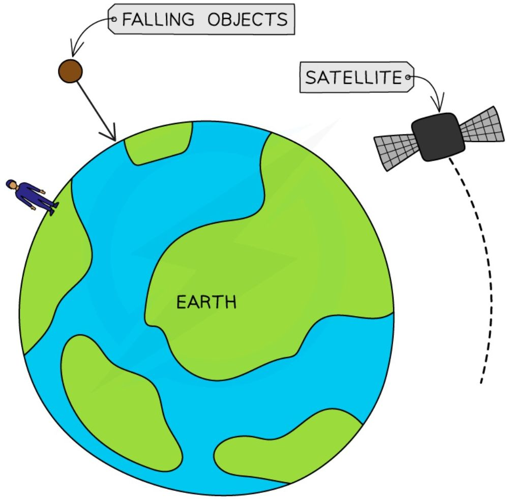
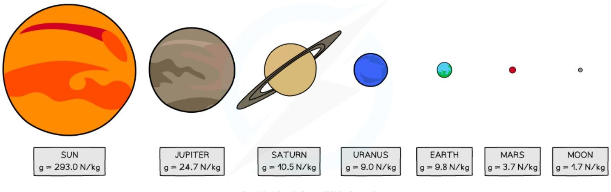
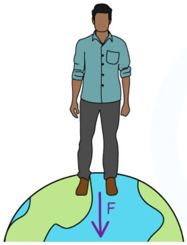
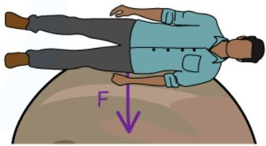
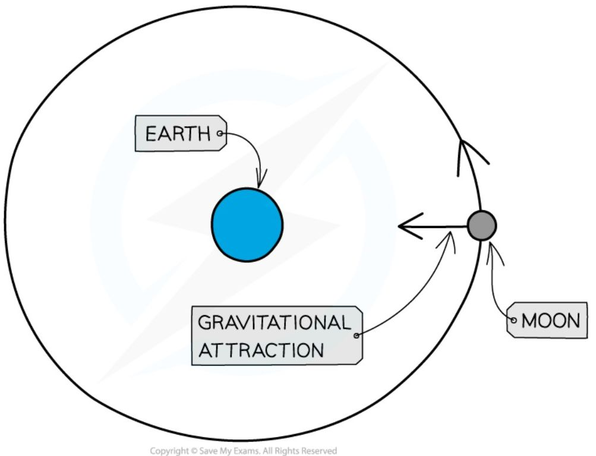
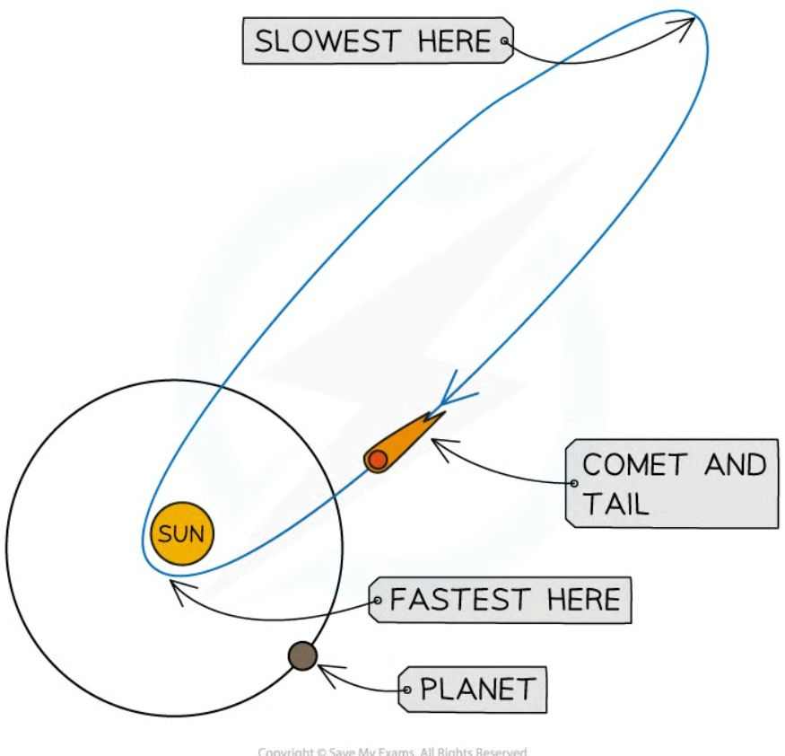
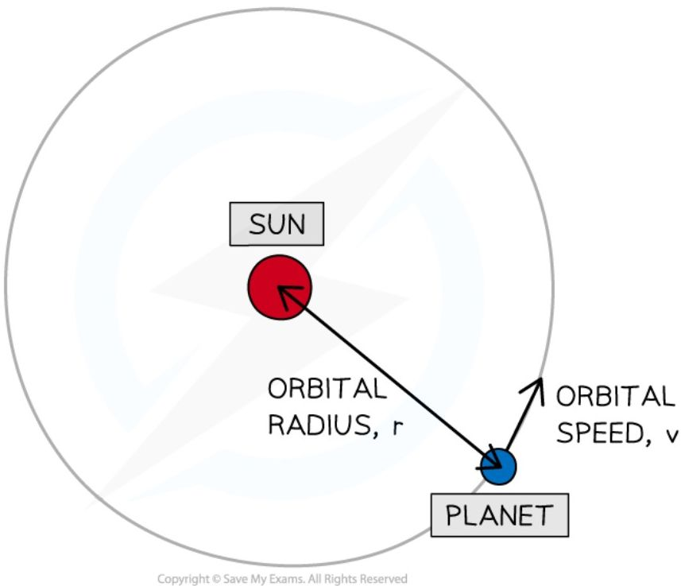

# Motion in the Universe

## The Universe

!!! abstract "Definition: Universe"
    The Universe is **a large collection of billions of galaxies** — it is also the name given to the entirety of space.

!!! abstract "Definition: Galaxy"
    A galaxy is **a large collection of billions of stars**.

Stars are large astronomical objects such as the Sun. Stars may be part of a **planetary system**, where planets and other astronomical objects orbit around a star at the centre. Our Solar System is in the **Milky Way galaxy**, with the Sun at its **centre** — our planet, the Earth, is the third of eight planets in our **Solar System**.

**Hierarchy of the Solar System**

![Diagram showing the hierarchy from the Universe to the Milky Way Galaxy to Our Solar System. The top panel labeled "UNIVERSE" shows a star field with a blue triangle zooming into a specific point. The middle panel labeled "MILKY WAY GALAXY" shows a spiral galaxy with a blue triangle zooming into a point on one of the arms. The bottom panel labeled "OUR SOLAR SYSTEM" shows the Sun and the eight planets: Mercury, Venus, Earth, Mars, Jupiter, Saturn, Uranus, and Neptune, all labeled under the collective heading "PLANETS".](../assets/images/page_486_image_1_v2.jpg)

*The Universe is a large collection of galaxies and a galaxy is a large collection of stars. The Sun is a star at the centre of our Solar System in the Milky Way galaxy*

## Gravitational field strength

The strength of gravity on different planets affects an object's weight on that planet.

!!! abstract "Definition: Weight"
    Weight is **the force acting on an object due to gravitational attraction**.

Planets have strong gravitational fields, so they attract nearby masses with a strong gravitational force. Weight is responsible for objects staying firmly on the ground, objects always falling to the ground, and satellites being kept in orbit.

*Objects are attracted towards the centre of the Earth due to its gravitational field strength*

Weight and gravitational field strength both vary between different objects in the Solar System: the greater the mass of a planet, the greater its gravitational field strength, and a higher gravitational field strength means a larger attractive force towards the centre of that planet or moon.

The value of $g$ varies with distance from a planet, but on the surface of the planet it is roughly the **same** — though $g$ varies dramatically between different planets and moons. The gravitational field strength ($g$) on **Earth** is approximately 10 N/kg. On the surface of the **Moon**, $g$ is **less** than on Earth, meaning it would be **easier** to lift a mass there than on Earth; on the surface of the gas giants (e.g. Jupiter and Saturn), $g$ is **more** than on Earth, meaning it would be **harder** to lift a mass there.

<table>
  <thead>
    <tr>
        <th>SUN</th>
        <th>JUPITER</th>
        <th>SATURN</th>
        <th>URANUS</th>
        <th>EARTH</th>
        <th>MARS</th>
        <th>MOON</th>
    </tr>
  </thead>
  <tbody>
    <tr>
        <td>g = 293.0 N/kg</td>
        <td>g = 24.7 N/kg</td>
        <td>g = 10.5 N/kg</td>
        <td>g = 9.0 N/kg</td>
        <td>g = 9.8 N/kg</td>
        <td>g = 3.7 N/kg</td>
        <td>g = 1.7 N/kg</td>
    </tr>
  </tbody>
</table>

**Value for g on the different objects in the Solar System**

The mass of an object is always the same, but its weight changes depending on the gravitational field: on both Earth and Jupiter, an object's **mass** has the **same** value, but its **weight** is a lot **greater** on Jupiter than on Earth — so much so that a human would not be able to stand up on the surface of Jupiter.

*A body on Earth has a much smaller force per unit mass than on Jupiter (Earth: g = 9.81 N/kg)*

*This means a body will have a much greater weight on Jupiter than on Earth (Jupiter: g = 25 N/kg). A person's weight on Jupiter would be so large a human would be unable to fully stand up*

!!! tip "Examiner Tips and Tricks"

    You do not need to remember the value of g on different planets for your exam, the value of g for Earth will be given in the exam question.

## Orbital motion

The Solar System is made up of many bodies which orbit around other bodies, as shown in the table below:

**Table of orbiting bodies in the Solar System**

<table>
  <thead>
    <tr>
        <th>orbiting body</th>
        <th>body it orbits</th>
    </tr>
  </thead>
  <tbody>
    <tr>
        <td>planet</td>
        <td>the Sun</td>
    </tr>
    <tr>
        <td>moon</td>
        <td>planet</td>
    </tr>
    <tr>
        <td>comet</td>
        <td>the Sun</td>
    </tr>
    <tr>
        <td>asteroid</td>
        <td>the Sun</td>
    </tr>
    <tr>
        <td>artificial satellites</td>
        <td>the Earth</td>
    </tr>
  </tbody>
</table>

Smaller bodies **orbit** around **larger** bodies — for example, planets orbit the Sun. Orbital motion is a result of the **gravitational force of attraction** acting between two bodies: this force always acts **towards the centre** of the larger body, and causes the orbiting body to move in a **circular path**.

*The gravitational force of attraction causes the Moon to orbit around the Earth*

### Orbital motion of planets

There are several **similarities** in the way different planets orbit the Sun: their orbits are all **slightly elliptical** (stretched circles) with the Sun at one focus (approximately the centre of the orbit), they all orbit in the **same plane**, and they all travel in the **same direction** around the Sun. There are also a few differences: they orbit at **different distances** from the Sun (different orbital radius), at **different speeds**, and take **different amounts of time** to orbit the Sun. The **further** away a planet is from the Sun, the **slower** it travels, and therefore the **longer** it takes to orbit.

*The planets closest to the Sun have higher orbital speeds, whereas the planets furthest from the Sun have lower orbital speeds*

### Orbital motion of moons

Moons orbit planets in a **circular path**, and some planets have more than one moon. The **closer** a moon is to its planet, the **shorter** the **time** it takes to complete each orbit, and the **greater** its orbital **speed**.

### Orbital motion of comets

The orbits of comets are very different to those of planets: they are highly **elliptical** (very stretched) or hyperbolic, which causes a comet's speed to change significantly as its distance from the Sun changes. Not all comets orbit in the same plane as the planets, and some don't even orbit in the same direction. As a comet approaches the Sun, its speed **increases**; as it moves further away, its speed **decreases**.

*Comets follow highly elliptical orbits around the Sun*

### Orbital period equation

When planets move around the Sun, or a moon moves around a planet, they orbit in **circular motion** — in one orbit, an object travels a distance equal to the circumference of its orbit, $2\pi r$, where $r$ is the radius of the circle. Since speed is distance divided by time, the average orbital speed of an object is given by:

!!! note "Required formulae: orbital speed"
    $$ v = \frac{2\pi r}{T} $$

    Where $v$ is the orbital speed in metres per second (m/s), $r$ is the average radius of the orbit in metres (m), and $T$ is the orbital period in seconds (s).

!!! abstract "Definition: Orbital period"
    The orbital period (or time period) is **the time taken for an object to complete one orbit**.

The orbital radius $r$ is always taken from the **centre** of the object being orbited to the object orbiting.

*Orbital radius and orbital speed of a planet moving around a Sun*

!!! example "Worked Example (calculation)"

    The Hubble Space Telescope (HST) moves in a circular orbit around the Earth.

    The HST orbits at a height of 560 km above the Earth's surface and completes one orbit in 96 minutes. The radius of the Earth is 6400 km.

    Calculate the orbital speed of the HST in m/s.

    ??? success "Answer:"

        **Step 1: List the known quantities**

        * Radius of the Earth = 6400 km

        * Height of the HST above the Earth's surface = 560 km

        * Time period, $T$ = 96 minutes

        **Step 2: Write the relevant equation**

        $$v = \frac{2\pi r}{T}$$

        **Step 3: Calculate the orbital radius, $r$**

        The orbital radius is the distance from the **centre** of the Earth to the telescope: $r$ = radius of the Earth + height of the HST above the Earth's surface.

        $$r = 6400 + 560 = 6960 \text{ km}$$

        **Step 4: Convert any units**

        The time period needs to be in seconds: $1$ minute $= 60$ seconds, so

        $$T = 96 \text{ minutes} = 60 \times 96 = 5760 \text{ s}$$

        The radius needs to be in metres: $1$ km $= 1000$ m, so

        $$r = 6960 \text{ km} = 6\,960\,000 \text{ m}$$

        **Step 5: Substitute values into the orbital speed equation**

        $$v = \frac{2\pi \times (6\,960\,000)}{5760}$$

        $$v = 7592.18 = 7590 \text{ m/s}$$

!!! tip "Examiner Tips and Tricks"

    Remember to always check that the orbital radius $r$ given is the distance from the **centre** of the Sun (if a planet is orbiting a Sun) or the planet (if a moon is orbiting a planet) and not just from the surface
