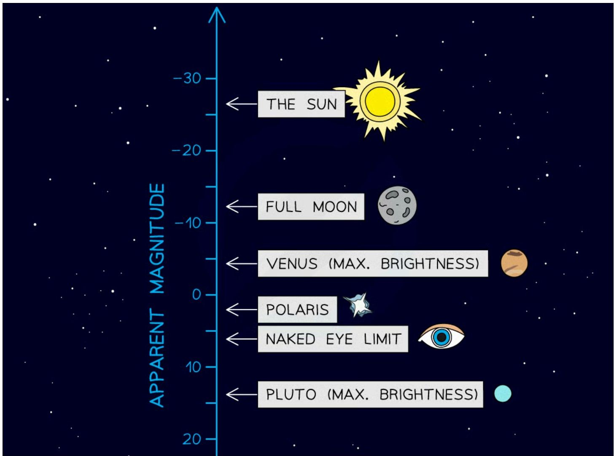
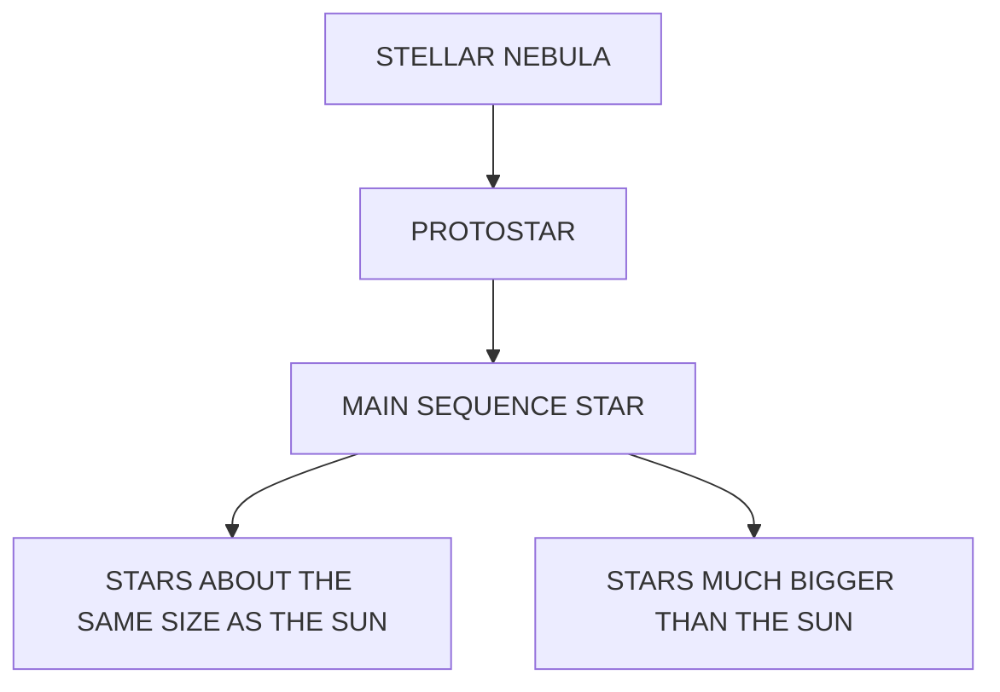
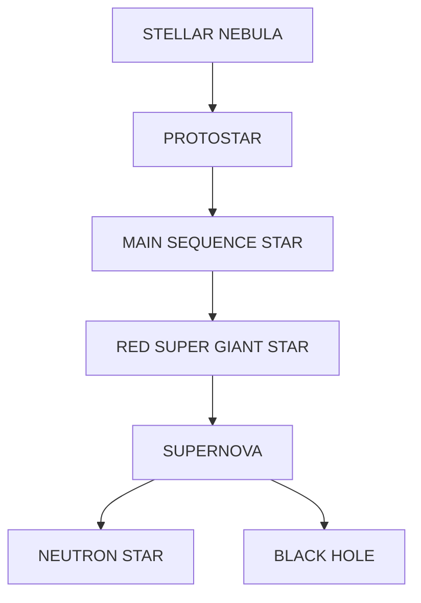

# Stellar Evolution

## Classification of stars

### Colour and temperature

* Stars come in a wide range of sizes and colours, from yellow stars to red dwarfs, from blue giants to red supergiants

    - These can be classified according to their **colour**

* Warm objects emit infrared and extremely hot objects emit visible light as well

    - Therefore, the **colour** they emit depends on how **hot** they are

* A star's colour is related to its **surface temperature**

    - A **red** star is the **coolest** (at around 3000 K)

    - A **blue** star is the **hottest** (at around 30 000 K)

**Star colour and surface temperature**

<table>
  <thead>
    <tr>
        <th>Colour</th>
        <th>Surface Temperature (K)</th>
    </tr>
  </thead>
  <tbody>
    <tr>
        <td>Blue</td>
        <td>30 000 K</td>
    </tr>
    <tr>
        <td>Light Blue</td>
        <td>20 000 K</td>
    </tr>
    <tr>
        <td>White</td>
        <td>10 000 K</td>
    </tr>
    <tr>
        <td>Light Yellow</td>
        <td>7 000 K</td>
    </tr>
    <tr>
        <td>Yellow</td>
        <td>6 000 K</td>
    </tr>
    <tr>
        <td>Orange</td>
        <td>4 000 K</td>
    </tr>
    <tr>
        <td>Red</td>
        <td>3 000 K</td>
    </tr>
  </tbody>
</table>

*The colour of a star correlates to its temperature. The bluer the star, the hotter its surface temperature. The redder the star, the cooler its surface temperature*

* Astronomical objects **cool** as they **expand** and **heat** up as they **contract**

    - This means that their colour will also change according to their surface temperature

* When a star becomes a red giant it becomes **redder** as it **expands** and **cools**

* When a star becomes a white dwarf it becomes **whiter** as it **contracts** and **heats** up

!!! tip "Examiner Tips and Tricks"

    We often remember red as being hot and blue as cool in everyday life, but remember this is the other way around when describing the temperature of stars!

### The Brightness of Stars

#### Luminosity

* The luminosity of a star is defined as

**The total amount of light energy emitted by the star**

* Luminosity is a measure of a star's **brightness** or **power output**

#### Apparent magnitude

* The brightness, or apparent magnitude, of a star depends on two main factors:

    - the **luminosity** of the star

    - the **distance** the star is from Earth (more distant stars are usually fainter than nearby stars)

* Apparent magnitude is defined a

**The perceived brightness of a star as seen from Earth**

* The apparent magnitude scale runs back to front:

    - the **brighter** the star, the **lower** the magnitude

    - the **dimmer** the star, the **higher** the magnitude

**The apparent magnitude scale**

<table>
  <thead>
    <tr>
        <th>Astronomical Body</th>
        <th>Apparent Magnitude (approx.)</th>
    </tr>
  </thead>
  <tbody>
    <tr>
        <td>THE SUN</td>
        <td>-27</td>
    </tr>
    <tr>
        <td>FULL MOON</td>
        <td>-13</td>
    </tr>
    <tr>
        <td>VENUS (MAX. BRIGHTNESS)</td>
        <td>-5</td>
    </tr>
    <tr>
        <td>POLARIS</td>
        <td>2</td>
    </tr>
    <tr>
        <td>NAKED EYE LIMIT</td>
        <td>6</td>
    </tr>
    <tr>
        <td>PLUTO (MAX. BRIGHTNESS)</td>
        <td>14</td>
    </tr>
  </tbody>
</table>

*Examples of the apparent magnitude of different astronomical bodies*

#### Absolute magnitude

* Astronomers describe the brightness of stars at a standard distance using the **absolute magnitude scale**

    - a bright star which is far away can look the same as a dim star which is nearby

    - therefore, it is difficult to measure the brightness of stars directly

* Absolute magnitude is defined as

**A measure of how bright stars would appear if they were all placed the same distance away from the Earth**

* The standard distance astronomers use is 10 parsecs, 32.6 light-years or 3.04 × 1014 km away from the Earth

### Hertzsprung-Russell Diagrams

* The properties of stars can be classified using the Hertzsprung-Russell (HR) diagram

* This is a plot of **luminosity** on the y-axis and **temperature** on the x-axis

* Usually, it is given in solar units, where the luminosity of the Sun = 1, so

    - For stars which are **brighter** than the Sun, luminosity > 1

    - For stars which are **dimmer** than the Sun, luminosity < 1

* Surface temperature is measured in kelvin (K) and is plotted backwards from hottest to coolest

* It can also be displayed as a colour where

    - The **hottest** stars are blue

    - The **coolest** stars are red

**The Hertzsprung-Russell diagram**

<table>
  <thead>
    <tr>
        <th>Luminosity (Solar Units)</th>
        <th>30 000 K (Blue)</th>
        <th>10 000 K (White)</th>
        <th>6 000 K (Yellow)</th>
        <th>3 000 K (Red)</th>
    </tr>
  </thead>
  <tbody>
    <tr>
        <td>10^6</td>
        <td> </td>
        <td>SUPERGIANTS</td>
        <td>SUPERGIANTS</td>
        <td>SUPERGIANTS</td>
    </tr>
    <tr>
        <td>10^5</td>
        <td>MAIN SEQUENCE</td>
        <td>SUPERGIANTS</td>
        <td>SUPERGIANTS</td>
        <td>SUPERGIANTS</td>
    </tr>
    <tr>
        <td>10^4</td>
        <td>MAIN SEQUENCE</td>
        <td>MAIN SEQUENCE</td>
        <td>GIANTS</td>
        <td>GIANTS</td>
    </tr>
    <tr>
        <td>10^3</td>
        <td>MAIN SEQUENCE</td>
        <td>MAIN SEQUENCE</td>
        <td>GIANTS</td>
        <td>GIANTS</td>
    </tr>
    <tr>
        <td>10^2</td>
        <td>MAIN SEQUENCE</td>
        <td>MAIN SEQUENCE</td>
        <td>GIANTS</td>
        <td>GIANTS</td>
    </tr>
    <tr>
        <td>10</td>
        <td>MAIN SEQUENCE</td>
        <td>MAIN SEQUENCE</td>
        <td> </td>
        <td> </td>
    </tr>
    <tr>
        <td>1</td>
        <td> </td>
        <td>MAIN SEQUENCE</td>
        <td>SUN</td>
        <td> </td>
    </tr>
    <tr>
        <td>10^-1</td>
        <td> </td>
        <td>MAIN SEQUENCE</td>
        <td>MAIN SEQUENCE</td>
        <td>MAIN SEQUENCE</td>
    </tr>
    <tr>
        <td>10^-2</td>
        <td>WHITE DWARFS</td>
        <td>WHITE DWARFS</td>
        <td>MAIN SEQUENCE</td>
        <td>MAIN SEQUENCE</td>
    </tr>
    <tr>
        <td>10^-3</td>
        <td>WHITE DWARFS</td>
        <td>WHITE DWARFS</td>
        <td> </td>
        <td>MAIN SEQUENCE</td>
    </tr>
    <tr>
        <td colspan="5">10^-4</td>
    </tr>
    <tr>
        <td colspan="5">10^-5</td>
    </tr>
  </tbody>
</table>

*** The Hertzsprung-Russell (HR) diagram is a way of displaying the properties of stars and representing their life cycles***

* The key areas of the H-R diagram are:

    * The **brightest** stars (high luminosity) are found near the top
    

    * The **dimmest** stars (low luminosity) are found near the bottom
    

    * The **hottest** stars (high temperature) are found towards the left
    

    * The **coolest** stars (low temperature) are found towards the right

* The [life cycle of a star](https://www.savemyexams.com/igcse/physics/edexcel/19/revision-notes/8-astrophysics/8-2-stellar-evolution/8-2-2-the-life-cycle-of-solar-mass-stars/) can be shown on a Hertzsprung-Russell diagram

* The main features of the Hertzsprung-Russell diagram are:
    

    * Most stars are found to lie on the **main sequence**. This is the band of stars going from top left to bottom right
    

    * Below the main sequence (and slightly to the left) are the **white dwarfs**
    

    * Above the main sequence on the right-hand side are the **red giants**
    

    * Directly above the red giants are the **red supergiants**

* This means that

    * The **hottest, brightest** stars are the largest main sequence stars, also called supergiant stars

    * The **coolest, brightest** stars are red supergiants

    * The **hottest, dimmest** stars are white dwarfs

    * the **coolest, dimmest** stars are the smallest main sequence stars, also called red dwarfs

!!! example "Worked Example"

    Stars can be classified using the Hertzsprung-Russell (H-R) Diagram.

    <table>
    <thead>
        <tr>
            <th>Region</th>
            <th>Luminosity (Sun = 1)</th>
            <th>Temperature (K)</th>
            <th>Description</th>
        </tr>
    </thead>
    <tbody>
        <tr>
            <td>A</td>
            <td>10^-2 — 10^-4</td>
            <td>30 000 — 10 000</td>
            <td>White dwarf stars</td>
        </tr>
        <tr>
            <td>B</td>
            <td>10^-1 — 10^6</td>
            <td>30 000 — 3 000</td>
            <td>Main sequence stars</td>
        </tr>
        <tr>
            <td>C</td>
            <td>10^4 — 10^6</td>
            <td>10 000 — 6 000</td>
            <td>Red supergiant stars</td>
        </tr>
        <tr>
            <td>D</td>
            <td>10^2 — 10^3</td>
            <td>6 000 — 3 000</td>
            <td>Red giant stars</td>
        </tr>
        <tr>
            <td>THE SUN</td>
            <td>1</td>
            <td>~6 000</td>
            <td>Main sequence star</td>
        </tr>
    </tbody>
    </table>

    (a) State the types of stars found in areas A, B, C and D

    (b) On the H-R diagram, plot the star with a surface temperature of 20 000 K and a luminosity 10 000 times greater than the Sun and label it Star X.

    ??? note "Answer (Part a):"

        * A = white dwarf stars

        * B = main sequence stars

        * C = red supergiant stars

        * D = red giant stars

    ??? note "Answer (Part b):"

        **Step 1: List the known quantities**

        * Surface temperature of Star **X** = 20 000 K

        * Luminosity of Star **X** = 10 000 times that of the Sun

        **Step 2: Use the graph to find the value for the luminosity of the Sun**

        * Use a ruler and pencil to draw a line from the position of the sun to the luminosity axis (y-axis)

        * The Sun’s luminosity on this scale is 1 because the luminosities given are relative to the luminosity of the sun

        <table>
        <thead>
            <tr>
                <th>Region/Object</th>
                <th>Surface Temperature / K</th>
                <th>Luminosity (Sun = 1)</th>
            </tr>
        </thead>
        <tbody>
            <tr>
                <td>A</td>
                <td>~20 000 - 8 000</td>
                <td>10^-2 - 10^-4</td>
            </tr>
            <tr>
                <td>B (Main Sequence)</td>
                <td>30 000 - 3 000</td>
                <td>10^6 - 10^-5</td>
            </tr>
            <tr>
                <td>C</td>
                <td>~15 000 - 5 000</td>
                <td>10^4 - 10^6</td>
            </tr>
            <tr>
                <td>D</td>
                <td>~8 000 - 3 000</td>
                <td>10^2 - 10^3</td>
            </tr>
            <tr>
                <td>THE SUN</td>
                <td>~6 000</td>
                <td>1</td>
            </tr>
        </tbody>
        </table>

        **Step 3: Calculate the luminosity of Star X**

        * Star **X** is 10 000 times that of the Sun

        * The luminosity of the Sun is 1

        10 000 × 1 = 10 000 or 104

        **Step 4: Plot the position of Star X on the HR diagram**

        * Locate the surface temperature of Star **X** at 20 000 K

        * Locate the luminosity of Star **X** at 104

        <table>
        <thead>
            <tr>
                <th>SURFACE TEMPERATURE/K</th>
                <th>LUMINOSITY COMPARED TO THE SUN</th>
            </tr>
        </thead>
        <tbody>
            <tr>
                <td>30 000</td>
                <td>10^6</td>
            </tr>
            <tr>
                <td>10 000</td>
                <td>10^4</td>
            </tr>
            <tr>
                <td>6 000</td>
                <td>1</td>
            </tr>
            <tr>
                <td>3 000</td>
                <td>10^-5</td>
            </tr>
        </tbody>
        </table>

        * Plot the point and label it Star X:

        <table>
        <thead>
            <tr>
                <th>SURFACE TEMPERATURE/K</th>
                <th>LUMINOSITY COMPARED TO THE SUN</th>
            </tr>
        </thead>
        <tbody>
            <tr>
                <td>30 000</td>
                <td>10^6</td>
            </tr>
            <tr>
                <td>10 000</td>
                <td>10^4</td>
            </tr>
            <tr>
                <td>6 000</td>
                <td>1</td>
            </tr>
            <tr>
                <td>3 000</td>
                <td>10^-5</td>
            </tr>
        </tbody>
        </table>

!!! tip "Examiner Tips and Tricks"

    Make sure you remember the key components of this diagram to be able to draw it from memory, more specifically which way around the axis goes - the x-axis is the opposite way round to what you might be used to!

    If you forget how where the different types of stars are found on the HR diagram, try and think about it logically:

    *   The **main sequence** is the easiest to recognise as it is the long band diagonally central to the diagram where the majority of stars are found

    *   **White dwarf** stars are hot, but very small, so they are not very luminous, so you need to identify the area with a lower luminosity than the main sequence

    *   **Red giants** and **supergiants** have clues in their names - they are giant, so they are very luminous and they are red, so they tend to be on the cooler end of the temperature scale

## The life cycle of solar mass stars

* All stars, including the Sun, began as a cloud of dust and gas

* Once a star has formed, it will spend its life going through a sequence of evolutionary stages, known as the **life cycle** of a star

**Summary of the life cycles of stars**

*Flow diagram showing the life cycle of a star which is the same size as the Sun (solar mass) and the lifecycle of a star which is much more massive than the Sun*

### Star formation

* All stars follow the same initial stages:

Nebula → protostar → main sequence star

### Nebula

* Stars form from a giant interstellar **cloud of gas and dust** called a nebula

### Protostar

* The force of **gravity** within a nebula pulls the particles **closer together** until a hot ball of gas forms, known as a **protostar**

* As the particles are pulled closer together the **density** of the protostar will **increase**

* This results in **more frequent collisions** between the particles which causes the **temperature** to **increase**

### Main sequence star

* Once the protostar becomes hot enough, **nuclear fusion** reactions occur within its core

* Once a star initiates fusion, it is known as a **main-sequence star**

* During the main sequence, the star is in **equilibrium** and said to be **stable**

### The life cycle of a solar mass star

* After the main sequence, a low-mass star finishes its life cycle in the following evolutionary stages:

**Red giant → planetary nebula → white dwarf**

### Red giant

* After several **billion** years, the hydrogen causing the fusion reactions in the star will begin to run out

* Once this happens, the fusion reactions in the core will start to **die down**

* The star will begin to fuse helium which causes the outer part of the star to **expand**

* As the star expands, its surface cools and it becomes a **red giant**

### White dwarf

* Once the helium fusion reactions have finished, the star collapses and becomes a **white dwarf**

* The white dwarf **cools** down over time and as a result, the amount of **energy** it emits **decreases**

**The life cycle of a low-mass star**

*The life cycle of a star that is similar to our Sun*

!!! "tip" Examiner Tips and Tricks

    Make sure you remember the life cycle for a solar mass star and ensure you can describe the sequence in a logically structured manner in case a 6 marker comes up in the exam!

    Ensure you can remember the end stages for a solar mass star clearly (red giant, planetary nebula, white dwarf) as this is different for a star that is much larger than our Sun!

## The life cycle of more massive stars

* After the main sequence, a high-mass star finishes its life cycle in the following evolutionary stages:

**Red supergiant → supernova → neutron star (or black hole)**

* The key **differences** between a lower mass and higher mass star at this stage are:

    - A higher mass star will stay on the main sequence for a **shorter time** before it becomes a red supergiant

    - A lower mass star fuses helium into heavy elements, such as **carbon**, whereas a higher mass star fuses helium into even heavier elements, such as **iron**

### Red supergiant

* After several **million** years, the hydrogen causing the fusion reactions in the star will begin to run out

* Once this happens, the fusion reactions in the core will start to **die down**

* The star will begin to fuse helium which causes the outer part of the star to **expand**

* As the star expands, its surface cools and it becomes a **red supergiant**

### Supernova

* Once the fusion reactions inside the red supergiant cannot continue, the core of the star will **collapse suddenly** and cause a **gigantic explosion** called a **supernova**

* At the centre of this explosion, a **dense** body called a **neutron star** will form

* The **outer remnants** of the star are **ejected** into space forming **new clouds** of dust and gas **(nebula)**

    - The heaviest elements are formed during a supernova, and these are ejected into space

    - These nebulae may form **new planetary systems**

### Neutron star (or black hole)

* In the case of the **most massive stars**, the neutron star that forms at the centre will continue to **collapse** under the force of **gravity** until it forms a **black hole**

* A black hole is an **extremely dense** point in space that not even **light** can escape from

**The life cycle of a high-mass star**

*The life cycle of a star much larger than our Sun*

!!! tip "Examiner Tips and Tricks"

    Make sure you remember the life cycle for a high-mass star and that you can describe the sequence logically in case a 6-marker comes up in the exam!

    Ensure you can clearly remember the end stages for a high-mass star (red supergiant, supernova, neutron star/black hole) as this is different for a star that is a similar size to the Sun!
