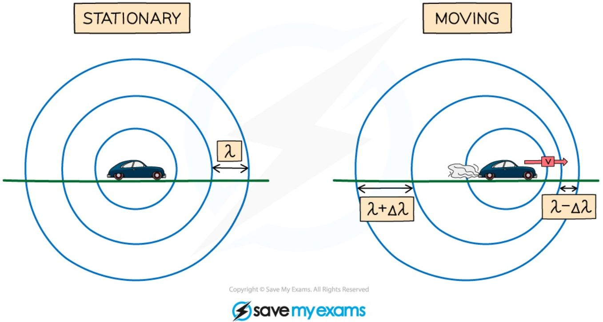
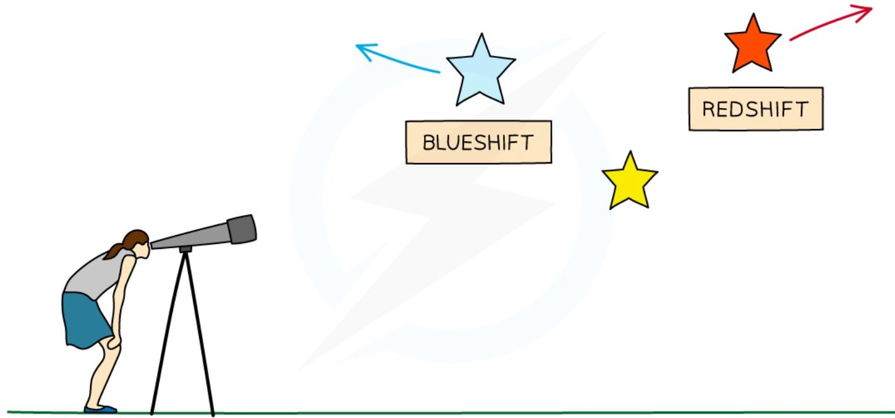
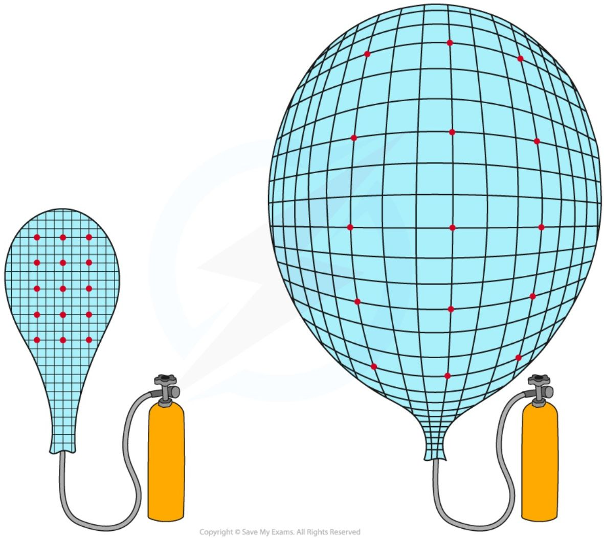
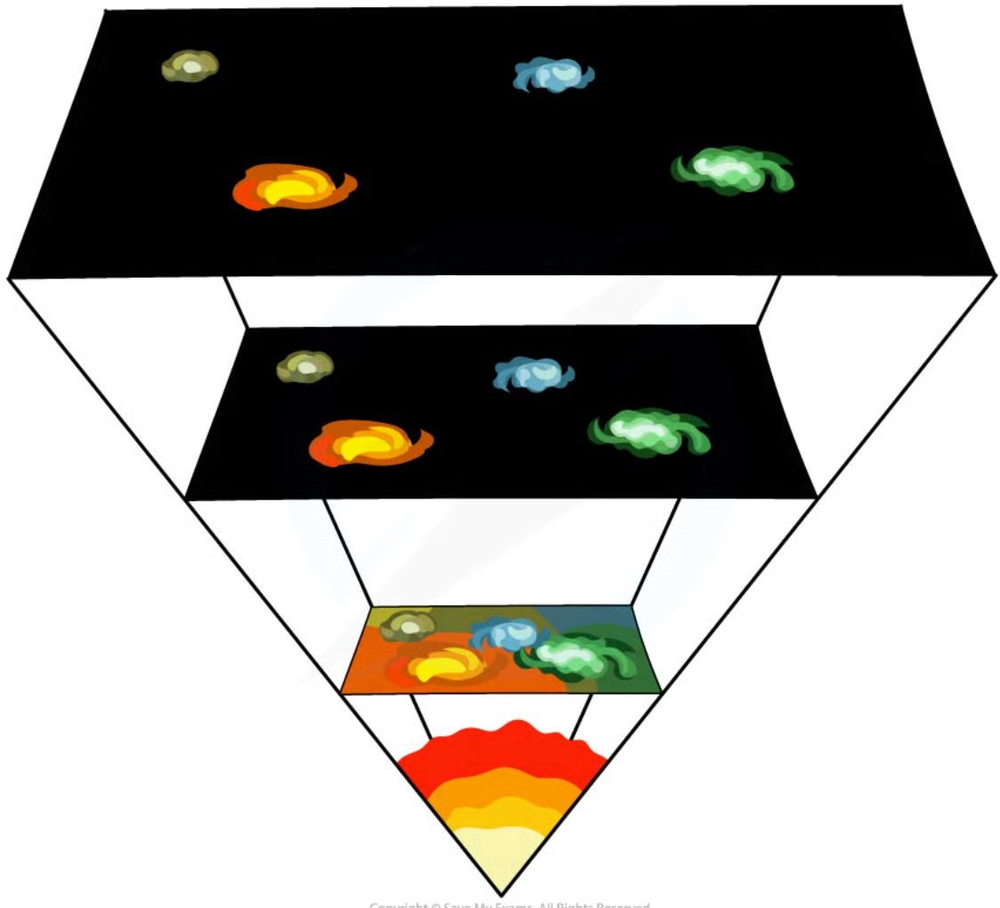
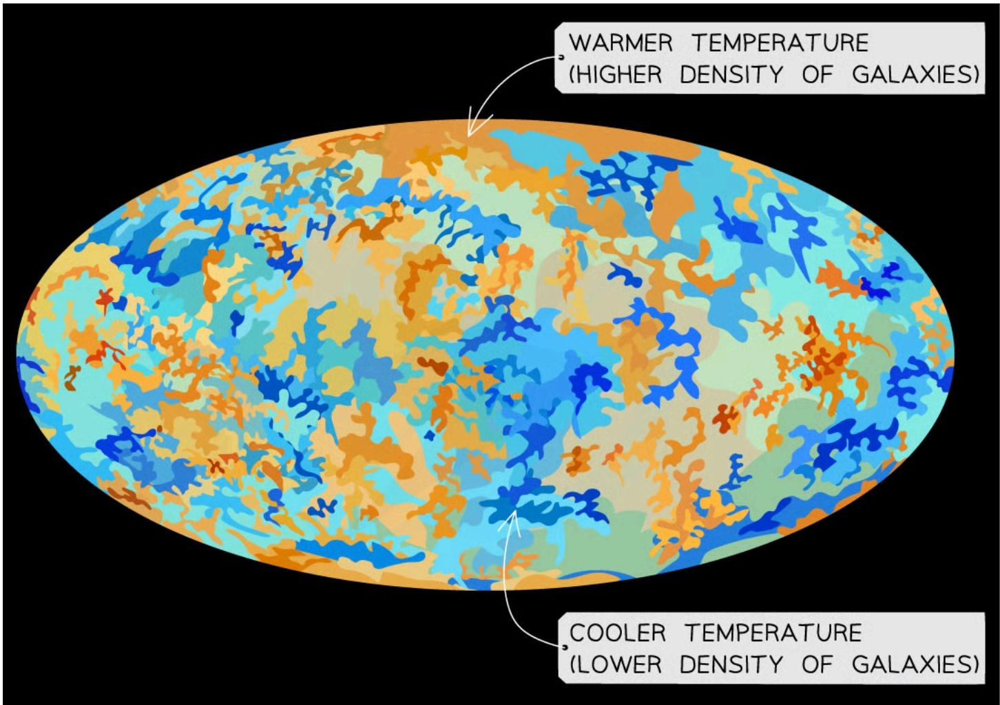

# Cosmology

## Doppler shift

!!! abstract "Definition: Doppler shift"
    The Doppler shift (or Doppler effect) is **the change in the observed frequency and wavelength of a wave, caused by relative motion between the source and the observer**.

Usually, when an object emits waves, the wavefronts spread out **symmetrically**. If the wave source moves, the waves can become squashed together in front of it, and stretched out behind it.

*Wavefronts are even in a stationary object but are closer together in the direction of the moving wave source*

A moving source changes the **wavelength**, $\lambda$ (and frequency), of its waves: the **wavelength** of the waves **in front** of the source **decreases** ($\lambda - \Delta\lambda$) and the **frequency increases**, while the wavelength **behind** the source **increases** ($\lambda + \Delta\lambda$) and the **frequency decreases**. ($\Delta\lambda$ means 'change in wavelength'.)

!!! note "Required formulae: Doppler shift"
    $$\frac{\lambda - \lambda_{0}}{\lambda_{0}} = \frac{\Delta\lambda}{\lambda_{0}} = \frac{v}{c}$$

    Where $\lambda$ is the observed wavelength of the source in metres (m), $\lambda_0$ is the reference wavelength in metres (m), $\Delta\lambda = \lambda - \lambda_0$ is the change in wavelength in metres (m), $v$ is the velocity of a galaxy in metres per second (m/s), and $c$ is **the speed of light** in metres per second (m/s).

This equation can be used to calculate the velocity of a galaxy, if its wavelength can be measured and compared to a reference wavelength. Since the fractions have the same units in the numerator (top) and denominator (bottom), the Doppler shift itself has **no units**.

!!! example "Worked Example (calculation)"

    Light emitted from a star has a wavelength of $435 \times 10^{-9}$ m. A distance galaxy emits the same light but has a wavelength of $485 \times 10^{-9}$ m.

    Calculate the speed at which the galaxy is moving relative to Earth.

    The speed of light = $3 \times 10^{8}$ m/s.

    ??? success "Answer:"

        **Step 1: Identify the known quantities**

        * Observed wavelength, $\lambda = 485 \times 10^{-9}$ m

        * Reference wavelength, $\lambda_{0} = 435 \times 10^{-9}$ m

        * Speed of light, $c = 3 \times 10^8\text{ m/s}$

        **Step 2: State the Doppler effect equation**

        $$\frac{\lambda - \lambda_{0}}{\lambda_{0}} = \frac{v}{c}$$

        **Step 3: Substitute the known values**

        $$ \frac{(485 \times 10^{-9}) - (435 \times 10^{-9})}{435 \times 10^{-9}} = \frac{v}{3 \times 10^8} $$

        **Step 4: Rearrange to make the relative speed of the galaxy, $v$, the subject**

        $$v = (3 \times 10^8) \times \frac{(485 \times 10^{-9}) - (435 \times 10^{-9})}{435 \times 10^{-9}}$$

        **Step 5: Evaluate**

        $$ v = 3.4 \times 10^7 \text{ m/s} $$

!!! tip "Examiner Tips and Tricks"

    This Doppler effect equation will be provided for you in the exam, but make sure you understand how to use it, in particular, make sure you know the difference between shifted $\lambda$ and unshifted $\lambda_0$ wavelength terms and get lots of practice using it

## Galactic red-shift

The Doppler effect affects all types of waves, including **light**. Light emitted from stars and galaxies is at a certain wavelength in the visible part of the electromagnetic spectrum.

!!! abstract "Definition: Redshift"
    Redshift is **the phenomenon of the wavelength of light appearing to increase when the source moves away from an observer** — the light moves towards the red end of the spectrum. The opposite case, where a source moves *towards* an observer, is called **blueshift**: the wavelength of light **decreases**, moving towards the blue end of the spectrum.

*Light from a star that is moving towards an observer will show blueshift and light from a star moving away from an observer will show redshift*

An **increase** in wavelength (redshift) is a **decrease** in frequency, and vice versa.

!!! tip "Examiner Tips and Tricks"

    You need to know that in the visible light spectrum **red light** has the **longest wavelength** and the **smallest frequency** compared to **blue light**, which has a **shorter wavelength** and **higher frequency**.

    To help you remember what happens to the wavelength and frequency of an object as it moves further away, it is useful to think about how the sound of a **motorbike** changes as it travels **away** from you. As the motorbike travels away, the pitch of the sound becomes **lower**, meaning the frequency of the sound is **decreasing** — and if the frequency has decreased, the wavelength must have increased. Don't get caught up on the redshift definition, but focus on the application of the phenomenon in different contexts.

## The expanding Universe

Galactic redshift provides evidence for the Big Bang theory and the expansion of the universe. The diagram below shows the **light** coming to us from a **close object**, such as the Sun, compared to the light coming to Earth from a **distant galaxy**:

**Redshift diagram for a light spectrum**

<table>
  <thead>
    <tr>
        <th>Spectrum</th>
        <th>Description</th>
    </tr>
  </thead>
  <tbody>
    <tr>
        <td>[Visible spectrum with black absorption lines]</td>
        <td>LIGHT SPECTRUM FROM A CLOSE OBJECT SUCH AS THE SUN</td>
    </tr>
    <tr>
        <td>[Visible spectrum with black absorption lines shifted towards the red end]</td>
        <td>LIGHT SPECTRUM FROM A DISTANT GALAXY</td>
    </tr>
  </tbody>
</table>

*Comparing the light spectrum produced from the Sun and a distant galaxy. The spectral lines from the distant galaxy are redshifted.*

Redshift is observed when the spectral lines from a distant galaxy move closer to the **red** end of the spectrum — this is because light waves are **stretched** by the expansion of the universe, so their wavelength increases (and frequency decreases), indicating that the galaxy is moving **away** from us. Light spectra from **distant** galaxies are redshifted **more** than those from **nearby** galaxies, showing that the **greater** the **distance** to a galaxy, the **greater** the **redshift** — meaning the **further away** a galaxy is, the **faster** it is moving away from the Earth. These observations imply that the universe is **expanding**, and therefore **support** the Big Bang theory.

<table>
  <thead>
    <tr>
        <th>DISTANCE</th>
        <th>REDSHIFT</th>
    </tr>
  </thead>
  <tbody>
    <tr>
        <td>0</td>
        <td>0</td>
    </tr>
    <tr>
        <td>1</td>
        <td>1</td>
    </tr>
    <tr>
        <td>2</td>
        <td>2</td>
    </tr>
    <tr>
        <td>3</td>
        <td>3</td>
    </tr>
    <tr>
        <td>4</td>
        <td>4</td>
    </tr>
    <tr>
        <td>5</td>
        <td>5</td>
    </tr>
    <tr>
        <td>6</td>
        <td>6</td>
    </tr>
    <tr>
        <td>7</td>
        <td>7</td>
    </tr>
    <tr>
        <td>8</td>
        <td>8</td>
    </tr>
    <tr>
        <td>9</td>
        <td>9</td>
    </tr>
  </tbody>
</table>

*Graph showing the greater the distance to a galaxy, the greater the redshift*

## The Big Bang theory

Around **14 billion years ago**, the Universe began from a **very small region** that was **extremely hot and dense**. Then there was a **giant explosion**, known as the **Big Bang**, which caused the universe to **expand** from a single point, cooling as it did so, to form the universe today. Each point **expands away** from the others — seen as **galaxies** moving away from each other, with more distant galaxies moving faster — and as a result of the initial explosion, the Universe **continues to expand**.

***All galaxies are moving away from each other, indicating that the universe is expanding***

An analogy for this is points drawn on a balloon, where the balloon represents space and the points represent galaxies: when the balloon is deflated, the points are close together and equally spaced apart; as the balloon expands, the points all become further apart **by the same amount**, because the **space itself** has expanded between them. As a result, the **density** of galaxies **falls** as the Universe expands.

*A balloon inflating is similar to the stretching of the space between galaxies*

## Evidence for the Big Bang

Since there is more evidence supporting the Big Bang theory than the Steady State theory, it is the currently **accepted model** for the origin of the Universe. The two main pieces of evidence supporting the Big Bang are galactic red-shift, and Cosmic Microwave Background (CMB) radiation.

### Evidence from galactic red-shift

By observing the **light spectrums** from **supernovae** in other galaxies (first done in 1998), there is evidence to suggest that distant galaxies are **receding** (moving further apart) even faster than nearby galaxies. These light spectra show that light from distant galaxies is **redshifted**, which is evidence that the **universe is expanding**: as a result, astronomers have concluded that all galaxies are moving away from the Earth, and moving away from each other.

This is what is expected after an **explosion**: matter is first **densely packed**, and as it explodes, it moves out in **all** directions, getting further and further from the source. Some matter is **lighter** and travels at a **greater** speed, **further** from the source of the explosion, while some matter is **heavier** and travels at a **slower** speed, **closer** to the source. If someone were to **travel back in time** and compare the separation distance of the galaxies, they would see the galaxies becoming **closer and closer together**, until the entire universe was a **single point** — exactly what would be expected if the galaxies were originally all grouped together at a single point, and then exploded outwards: the galaxies that are **furthest** away are moving the **fastest** (their distance is proportional to their speed), and the galaxies that are **closer** are moving **slower**.

***Tracing the expansion of the universe back to the beginning of time leads to the idea the universe began with a "big bang"***

### Evidence from CMB radiation

The discovery of the CMB (Cosmic Microwave Background) led to the Big Bang theory becoming the currently accepted model. The CMB is a type of electromagnetic radiation which is a remnant from the early stages of the Universe: it has a wavelength of around 1 mm, making it a microwave, hence the name Cosmic Microwave Background.

In 1964, astronomers discovered radiation in the microwave region of the electromagnetic spectrum coming from **all directions**, at a generally **uniform temperature** of 2.73 K. They were unable to do this any earlier, since microwaves are **absorbed** by the atmosphere — it was only around this time that space flight was developed, enabling astronomers to send telescopes into orbit above the atmosphere.

According to the Big Bang theory, the early Universe was an extremely **hot** and **dense** environment, so it must have emitted **thermal radiation**. This radiation is now in the **microwave** region because, over the past 14 billion years or so, the radiation from the Big Bang has become redshifted as the Universe has expanded: initially, this would have been **high energy** radiation, towards the gamma end of the spectrum, but as the Universe expanded, the wavelength of the radiation **increased** — over time, it has increased so much that it is now in the **microwave** region of the spectrum.

<table>
  <thead>
    <tr>
        <th>TIME: 300,000 YEARS AFTER THE BIG BANG</th>
        <th>14 BILLION YEARS AFTER THE BIG BANG (THE PRESENT)</th>
    </tr>
  </thead>
  <tbody>
    <tr>
        <td>TEMPERATURE: 3000 KELVIN</td>
        <td>3 KELVIN</td>
    </tr>
    <tr>
        <td colspan="2">REDSHIFT (indicated by arrow showing wavelength increase)</td>
    </tr>
  </tbody>
</table>

*The CMB is a result of high energy radiation being redshifted over billions of years*

The CMB radiation is very **uniform**, and has the exact profile expected to be emitted from a **hot body** that has cooled down over a very long time — a phenomenon that other theories, such as the Steady State Theory, **cannot** explain.

The CMB is represented by the following map — the closest image we have to a map of the Universe:

***The CMB map with areas of higher and lower temperature. Places with higher temperature have a higher concentration of galaxies, Suns and planets***

The different colours represent different temperatures: the **red / orange / brown** regions represent **warmer** temperatures, indicating a **higher density** of galaxies, while the **blue** regions represent **cooler** temperatures, indicating a **lower density** of galaxies. The temperature of the CMB is mostly uniform, though there are minuscule temperature fluctuations (on the order of 0.00001 K), implying that all objects in the Universe are more or less **uniformly spread out**.
