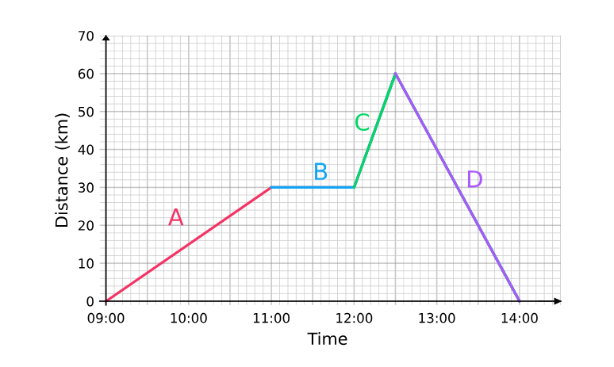
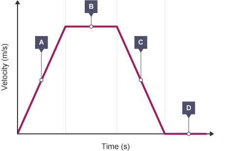
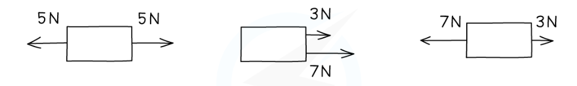

# Edexcel IGCSE Physics (4PH1) - Retrieval Practice Tasks

Extracted from Science Faculty Learning Log (40 Tasks covering Units 1–8).

---

## Unit 1: Forces and Motion

### Task 1

#### Subtask 1.1
* Complete the table from memory only:

| Quantity | Name of units | units |
| :--- | :--- | :--- |
| Mass |  |  |
| Length |  |  |
| Speed/velocity |  |  |
| Acceleration |  |  |
| Weight |  |  |
| Time |  |  |
| Acceleration due to gravity |  |  |
| Moment of a force |  |  |
| Momentum |  |  |

#### Subtask 1.2
* Explain what is happening at A, B, C and D

---

### Task 2

#### Subtask 2.1
* Calculate the speed at A, B, C and D

#### Subtask 2.2
* Explain how to investigate the motion of everyday objects such as a toy car or tennis ball

---

### Task 3

#### Subtask 3.1
* Write out the equation for calculating acceleration

#### Subtask 3.2
* Explain what is happening at A, B, C and D

#### Subtask 3.3
* Explain how you would calculate acceleration for the graph above

#### Subtask 3.4

* Explain how you would calculate distance travelled for the graph above

---

### Task 4

#### Subtask 4.1
* Write out the equation that shows the relationship between final speed, initial speed, acceleration and distance

#### Subtask 4.2
* Complete the sentence:

A force can change an object’s ____________, _____________ or _______________

#### Subtask 4.3
* Complete the table:

| Examples of contact forces | Examples of  non-contact forces |
| :--- | :--- |
|  |  |
|  |  |
|  |  |
|  |  |

#### Subtask 4.4
* What is the difference between distance and displacement?

#### Subtask 4.5
* What is the difference between speed and velocity?

---

### Task 5

#### Subtask 5.1
* Work out the resultant force for each examples:

#### Subtask 5.2
* What is the definition for friction?

#### Subtask 5.3
* State the equation for calculating force from mass and acceleration

#### Subtask 5.4
* State the equation for calculating weight

#### Subtask 5.5
* Write out the formula for calculating stopping distances

#### Subtask 5.6
* Describe the factors affecting stopping distance.

---

### Task 6

#### Subtask 6.1
* Describe the forces acting on a falling object and explain why it reaches a terminal velocity

#### Subtask 6.2
* Explain how you can investigate how extension varies with force on a helical spring, metal wire and rubber band.

#### Subtask 6.3
* State Hooke’s Law and explain why it does not always apply to a spring

#### Subtask 6.4
* What is elastic behaviour?

---

### Task 7

#### Subtask 7.1
* What is the formula for calculating momentum

#### Subtask 7.2
* Discuss 3 safety features in cars that are related to momentum

#### Subtask 7.3
* State the equation for calculating force from momentum and time

#### Subtask 7.4
* State Newton’s 3rd law

#### Subtask 7.5
* What is the equation for calculating moment?

#### Subtask 7.6
* What is the centre of gravity of an object?

---

## Unit 2: Electricity

### Task 8

#### Subtask 8.1
* Complete the table from memory

| Quantity | Name of units | units |
| :--- | :--- | :--- |
| Current |  |  |
| Charge |  |  |
| Energy |  |  |
| Resistance |  |  |
| Time |  |  |
| Potential difference |  |  |
| Power |  |  |

#### Subtask 8.2
* Explain how the following protect domestic appliances:
    * Insulation
    * Double insulation
    * Earthing
    * Fuses
    * Circuit breakers

---

### Task 9

#### Subtask 9.1
* Explain how a toaster works in terms of resistance

#### Subtask 9.2
* What is the formula for calculating power?

#### Subtask 9.3
* What is the formula for energy transferred using current, voltage and time?

#### Subtask 9.4
* What is the difference between the current supplied by mains electricity and a battery?

#### Subtask 9.5
* Why is a parallel circuit more appropriate for domestic lighting?

#### Subtask 9.6
* What factors effect the size of the current in a series circuit?

---

### Task 10

#### Subtask 10.1
* How can the effect of voltage on current be investigated in wires, resisitors, metal filament lamps and diodes?

#### Subtask 10.2
* What is the equation for calculating voltage?

#### Subtask 10.3
* What is current?

#### Subtask 10.4
* What is the equation for calculating charge?

#### Subtask 10.5
* Explain how current passes through solid metallic conductors

---

### Task 11

#### Subtask 11.1
* Explain why current is conserved at a junction in a circuit

#### Subtask 11.2
* What is voltage?

#### Subtask 11.3
* What is a volt?

#### Subtask 11.4
* What is the equation for calculating energy transferred using charge and voltage?

#### Subtask 11.5
* Name 5 common materials:
    * That conduct electricity
    * That are electrical insulators

---

### Task 12

#### Subtask 12.1
* Describe an experiment to investigate how insulating materials can be charged by friction

#### Subtask 12.2
* How are positive and negative electrostatic charges produce on materials?

#### Subtask 12.3
* Describe 2 situations where electrostatic charges can be dangerous

#### Subtask 12.4
* Describe 2 uses of electrostatic charges in the workplace

---

## Unit 3: Waves

### Task 13

#### Subtask 13.1
* Complete the table from memory

| Quantity | Name of units | units |
| :--- | :--- | :--- |
| Angle size |  |  |
| frequency |  |  |
| wavelength |  |  |
| speed |  |  |
| time |  |  |

#### Subtask 13.2
* Explain the difference between transverse and longitudinal waves

#### Subtask 13.3
* Define the following:
    * Amplitude
    * Wavefront
    * Frequency
    * Wavelength
    * Period of a wave

#### Subtask 13.4
* What is the formula for wave speed?

#### Subtask 13.5
* What is the formula for frequency?

---

### Task 14

#### Subtask 14.1
* Explain the Doppler effect

#### Subtask 14.2
* Name the waves that make up the electromagnetic spectrum in order of decreasing wavelength (increasing frequency)

#### Subtask 14.3
* Give 1 use for each part of the electromagnetic spectrum

#### Subtask 14.4
* Identify the harmful electromagnetic waves and their effects on the body

#### Subtask 14.5
* Name the colours that make up the visible spectrum in order of decreasing wavelength (increasing frequency)

---

### Task 15

#### Subtask 15.1
* What is the difference between refraction and reflection? Include ray diagrams in your explanation

#### Subtask 15.2
* What is the law of reflection?

#### Subtask 15.3
* What is the formula for refractive index?

#### Subtask 15.4
* Describe how you would determine the refractive index of a glass block

---

### Task 16

#### Subtask 16.1
* Explain how optical fibres carry information

#### Subtask 16.2
* Explain the meaning of critical angle c

#### Subtask 16.3
* What is the relationship between critical angle and refractive index?

#### Subtask 16.4
* What is the frequency range for human hearing?

#### Subtask 16.5
* Describe how to investigate the speed of sound in air

---

### Task 17

#### Subtask 17.1
* How can an oscilloscope and a microphone be used to display a sound wave?

#### Subtask 17.2
* Describe how to investigate the frequency of a sound wave using an oscilloscope

#### Subtask 17.3
* How can a wave be used to calculate the pitch of a sound?

#### Subtask 17.4
* How can a wave be used to calculate the loudness of a sound?

---

## Unit 4: Solids, Liquids and Gases

### Task 18

#### Subtask 18.1
* Complete the table

| Quantity | Name of units | units |
| :--- | :--- | :--- |
| Mass |  |  |
| Energy |  |  |
| length |  |  |
| speed |  |  |
| acceleration |  |  |
| force |  |  |
| time |  |  |
| power |  |  |

#### Subtask 18.2
* List 8 types of energy stores

#### Subtask 18.3
* List 4 types of energy transfer

---

### Task 19

#### Subtask 19.1
* Write the equation for calculating efficiency

#### Subtask 19.2
* An electric motor is supplied with 100 kJ of electrical energy. 70% of this energy is converted into kinetic energy, while the rest is lost as heat and sound.

#### Subtask 19.3
* Draw a Sankey diagram to represent these energy transfers.

#### Subtask 19.4
* Describe how heat energy is transferred through conduction, radiation and covection

---

### Task 20

#### Subtask 20.1
* Give 2 examples of convection in everyday life

#### Subtask 20.2
* Explain how heat loss in the home can be reudced

#### Subtask 20.3
* Explain how emission and absorption or radiation are related to surface and temperature

#### Subtask 20.4
* Describe how to investigate thermal energy transfer by conduction, convection and radiation in the lab.

---

### Task 21

#### Subtask 21.1
* Give the equation for calculating work done

#### Subtask 21.2
* Give the equation for calculating gravitational potential energy

#### Subtask 21.3
* Give the equation for calculating kinetic energy

#### Subtask 21.4
* Define power

#### Subtask 21.5
* Give the equation for calculating power

#### Subtask 21.6
* Describe the energy transfers involved in generating electricity using:
    * Wind
    * Water
    * Geothermal energy
    * Solar heating systems
    * Solar cells
    * Fossil fuels
    * Nuclear power

---

## Unit 5: Solids, Liquids and Gases

### Task 22

#### Subtask 22.1
| Quantity | Name of units | units |
| :--- | :--- | :--- |
| Temperature |  |  |
| Absolute zero |  |  |
| Energy |  |  |
| mass |  |  |
| Density |  |  |
| Length |  |  |
| Area |  |  |
| Volume |  |  |
| speed |  |  |
| acceleration |  |  |
| weight |  |  |
| pressure |  |  |

#### Subtask 22.2
* What is the equation for calculating density?

#### Subtask 22.3
* Describe how to investigate density in the lab using direct measurements of mass and volume

---

### Task 23

#### Subtask 23.1
* What is the equation for calculating pressure?

#### Subtask 23.2
* What is the equation for calculating pressure? Difference?

#### Subtask 23.3
* How does heating raise the temperature of a system or change its state?

#### Subtask 23.4
* Describe the arrangement and motion of particles in a solid, liquid and gas.

---

### Task 24

#### Subtask 24.1
* Describe a practical to obtain a temperature-time graph to show the constant temperature during a change of state

#### Subtask 24.2
* What is specific heat capacity?

#### Subtask 24.3
* What is the equation for change in thermal energy??

#### Subtask 24.4
* Describe a practical to investigate the specific heat capacity of water and solids

---

### Task 25

#### Subtask 25.1
* What is the value for absolute zero and what does it mean?

#### Subtask 25.2
* Describe how to convert between degrees Celsius and kelvin

#### Subtask 25.3
* Explain why increasing temperature increases the speed of gas molecules and the pressure exerted by the gas on the walls of the container.

#### Subtask 25.4
* State the relationship between the pressure and Kelvin temperature of a fixed mass of gas at a constant temperature

#### Subtask 25.5
* State the relationship between the pressure and volume of a fixed mass of gas at a constant temperature

---

## Unit 6: Magnetism and Electromagnetism

### Task 26

#### Subtask 26.1
* Complete the table form memory

| Quantity | Name of units | units |
| :--- | :--- | :--- |
| Current |  |  |
| Potential difference |  |  |
| Power |  |  |

#### Subtask 26.2
* Describe the properties of:
    * Magnetically hard materials
    * Magnetically soft materials

#### Subtask 26.5
* What does ‘magnetic field line’ mean?

#### Subtask 26.6
* How can magnetism be induced in some materials?

#### Subtask 26.7
* Describe an experiment to investigate the magnetic field pattern for a bar magnet and between 2 bar magnets

---

### Task 27

#### Subtask 27.1
* Describe how to use 2 permanent magnets to produce a uniform magnetic field pattern

| A Straight wire |
| :--- |
| A flat circular coil |
| Solenoid |

#### Subtask 27.2
* Describe the construction of electromagnets

#### Subtask 27.3
* Draw magnetic field patterns for the following:
    * a straight wire
    * a flat circular coil
    * a solenoid

#### Subtask 27.4
* When each is carrying a current

---

### Task 28

#### Subtask 28.1
* Complete the following sentence:

There is a _____________ on a _____________ particle when it moves in a _________________
field, as long as its motion is not _________________ to the field

#### Subtask 28.2
* Explain why a force is exerted on a wire carrying a current in a magnetic field

#### Subtask 28.3
* How is this effect used in simple d.c. electric motors and loudspeakers?

#### Subtask 28.4
* Explain the left-hand rule

#### Subtask 28.5
* Describe how the force on a conductor carrying a current in a magnetic field changes with the magnitude and direction of the field and current

---

### Task 29

#### Subtask 29.1
* How can a voltage be induced in a coil using a magnetic filed?

#### Subtask 29.2
* Describe the factors that affect the size of the induced voltage

#### Subtask 29.3
* Describe the structure of a transformer.

#### Subtask 29.4
* How does a transformer change the size of an alternating voltage?.

---

### Task 30

#### Subtask 30.1
* Which formula shows the relationship between input (primary) and output (secondary) voltages and the turns ration for a transformer?

#### Subtask 30.2
* Show the relationship between input and output power for 100% efficiency

---

## Unit 7: Radioactivity and Particles

### Task 31

#### Subtask 31.1
* Complete the table

| Quantity | Units name | Units symbol |
| :--- | :--- | :--- |
| Radioactivity |  |  | 

#### Subtask 31.2
* Describe the structure of an atom in terms of sub-atomic particles

#### Subtask 31.3

* Explain the following terms:

    * Atomic number

    * Mass number

    * Isotope

#### Subtask 31.4
* Describe the following ionising radiations:

| radiation | description |
| :-- | :-- |
| Alpha particles | |
| Beta particles | |
| Gamma rays | |

---

### Task 32

#### Subtask 32.1
* Describe a practical to investigate the penetration powers of different types of radiation using radioactive sources

#### Subtask 32.2
* Describe the effects of the following types of radiation on the atomic and mass number of a nucleus:

    * Alpha

    * Beta

    * Gamma

    * Neutron

#### Subtask 32.3
* Give an example of a balanced nuclear equation

---

### Task 33

#### Subtask 33.1
* What can be used to detect ionising radiation?

#### Subtask 33.2
* Explain the sources of background radiation from earth and space

#### Subtask 33.3
* What is the definition for half-life?

#### Subtask 33.4
* Describe how radioactivity is used in industry and medicine

#### Subtask 33.5
* Describe the difference between contamination and irradiation

---

### Task 34

#### Subtask 34.1
* Describe the dangers of ionising radiations on living organisms

#### Subtask 34.2
* Describe how the risks arising from the disposal of radioactive waste can be reduced

#### Subtask 34.3
* Explain the following terms:
    * Fision
    * Fusion
    * Radioactive decay

#### Subtask 34.4
* Explain how a nucleus of U-235 can be split and what happens as a result of this process.

#### Subtask 34.5
* How can the above process result in a chain reaction?

---

### Task 35

#### Subtask 35.1
* Describe the role played by control rods and moderator in the fission process

#### Subtask 35.2
* Why is shielding around a nuclear reactor important?

#### Subtask 35.3
* Explain why nuclear fusion does not happen at low temperature and pressure

---

## Unit 8: Astrophysics and Cosmology

### Task 36

#### Subtask 36.1
* Complete the table

| Quantity | Name of units | units |
| :--- | :--- | :--- |
| Mass |  |  |
| Length/distance |  |  |
| Speed |  |  |
| Acceleration |  |  |
| Force |  |  |
| Time |  |  |
| Gravitational field strength |  |  |

#### Subtask 36.2
* Define the following:
    * Universe
    * Galaxy

#### Subtask 36.3
* Where is our solar system located?

#### Subtask 36.4
* Why does gravitational field strength vary?

#### Subtask 36.5
* Explain the effect of gravitational force on named satellites of the earth

---

### Task 37

#### Subtask 37.1
* Describe the differences in the orbits of comets. Moons and planets

#### Subtask 37.2
* What is the formula for orbital speed?

#### Subtask 37.3
* How can stars be classified?

---

### Task 38

#### Subtask 38.1
* What is the colour of a star related to?

#### Subtask 38.2
* Describe the evolution of stars with a similar mass to the sun

#### Subtask 38.3
* Describe the evolution of stars with a greater mass to the sun

---

### Task 39

#### Subtask 39.1
* What is absolute magnitude?

#### Subtask 39.2
* Draw the main components of the Hertzsprung-Russel daigram

#### Subtask 39.3
* Describe the Big Bang theory

---

### Task 40

#### Subtask 40.1
* Describe the evidence that supports the Big Bang theory

#### Subtask 40.2
* Show the formula that relates change in wavelength, reference wavelength, velocity of a galaxy and the speed of light

#### Subtask 40.3
* What is red shift and how does it provide evidence for the expansion of the universe?

---

